# Hand Gesture Recognition using TinyML on OpenMV

Created By:
Wamiq Raza 

Public Project Link:
[https://studio.edgeimpulse.com/public/84373/latest](https://studio.edgeimpulse.com/public/84373/latest)

## Overview
The vision-based technology of hand gesture recognition is an important part of human-computer interaction. Technologies, such as speech recognition and gesture recognition, receive great attention in the field of Hyperconverged Infrastructure (HCI). The initial problem was originally tackled by the computer vision community by means of images and videos. But more recently, the introduction of low- cost consumer depth cameras have opened the way to several different approaches. These new approaches exploit the depth information acquired by these devices which improve gesture recognition performance. 

The literature study gives insight into the many strategies that may be considered and executed to achieve hand gesture recognition. It also assists in comprehending the benefits and drawbacks of the various strategies. The literature review is separated into two parts: the detection module and the camera module.

## Problem Description
In the literature data, gloves, hand belts, and cameras have shown to be the most often utilized techniques of gathering user input. In many research articles, the technique of gesture recognition employs input extraction using data gloves, a hand belt equipped with an accelerometer, and Bluetooth to read hand motions. For pre-processing the image, a variety of approaches were used; algorithms and techniques for noise removal, edge identification, and smoothening. This was then followed by several segmentation techniques for boundary extraction, such as separating the foreground from the background. A standard 2D camera was used for gesture recognition. Earlier in technology, it was thought that a single camera may not be as effective as stereo or depth aware cameras, but some companies are challenging this theory. For this reason, using Edge Impulse [1] framework, a Software-based gesture recognition technology using a standard 2D camera that can detect robust hand gestures was built. Additionally, the range of image-based gesture recognition systems may raise concerns about the technology's practicality for broad application. For example, an algorithm calibrated for one camera may not function with another device or camera. In order to cope with this challenge, a dataset creation during a class was taken from dataset [2] and validated this approach using a FOMO [3] algorithm.

## Proposed Hardware
The objective was to develop an integrated architecture that implemented on microcontrollers and was able to recognize hand gesture, optimizing the model’s performance. As for the TinyML platform, we chose an OpenMV [4] microcontroller, which acted as a decision unit. The OpenMV (shown in Figure 1) is a small, low power microcontroller that enables the easy and intuitive implementation of image processing applications. It can be programmed using high-level Python scripts (Micro-Python) and is driven by an STM32H74VI ARM Cortex M7 processor running at 480 MHz, suitable for most machine vision applications. OpenMV was particularly suitable for our proposed approach due to its low power consumption and simple algorithms that will run between 25-50 FPS on QVGA (320x240) resolutions and below. It is equipped with a high-performance camera that we used to collect data for the mission purposes.

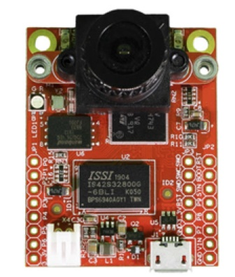

## Data collection process
This project is being built from scratch and will use an OpenMV microcontroller as pictured above in Figure 1. The first step consisted of creating the data needed to run the training model. For this step, OpenMV was used with the built-in camera and OpenMV IDE for dataset creation. In total, 30 images were captured from my hand, showing three different gestures which were then split into three folders, each folder with its unique class name. All the prepared training images were then stored in dataset folders. In addition, four from the [2] superb class were taken to compare results with the created dataset and testing data, which was not taken through the microcontroller.
 - HORNS, contains 30 images of hand pointing horn
 - INDEX, contains 30 images of index finger
 - TWO, contains 30 images of hand showing two fingers
 - SUPERB, contains 30 images of superb
 
To create a dataset using OpenMV IDE, firstly connect OpenMV to your laptop using the USB cable. Click on the connect button in order to connect to the default data acquisition program. Once successfully connected, you can start taking images of the object that will be saved in the defined class folder.

Figure 2 represents the steps to follow to create a dataset directory. Figure 3 represents the dataset folder with each class consisting of images with a unique ID.

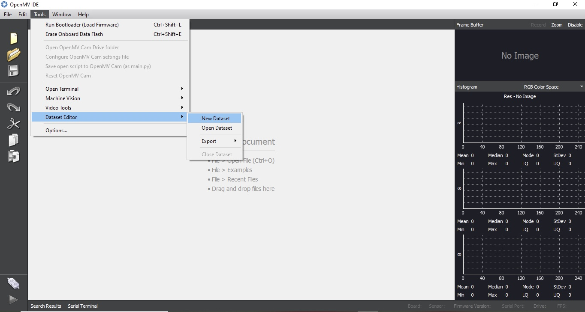

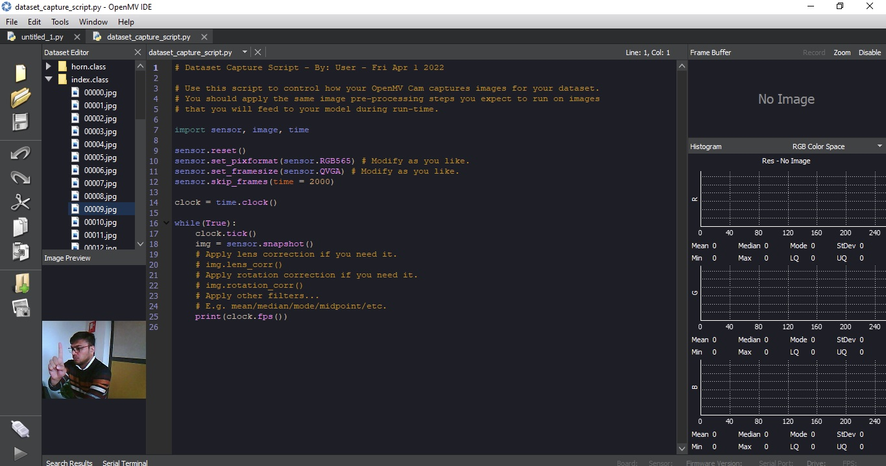

Once the dataset is created, all images would be uploaded to Edge Impulse for labeling. Figure 4 represents the Edge Impulse platform on how to upload the data for labelling before it processes. Figure 5 represents the labeled image for class horns.

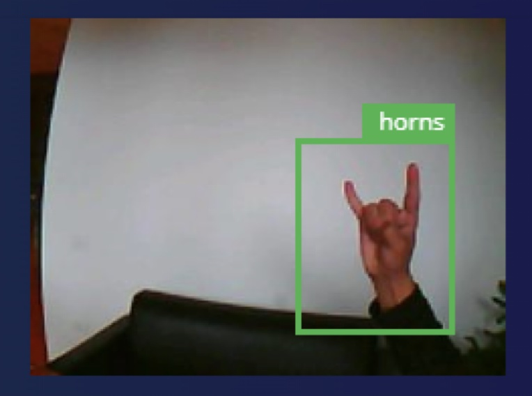

## Building and training the model
The images in the dataset are now labeled. To train a model, FOMO algorithm was then used. As FOMO (Faster Objects, More Objects) is a unique machine learning approach that extends object identification to devices with limited processing power, it allows you to count things, locate objects in an image, and track numerous objects in real time while consuming up to 30x less computing power and memory than MobileNet SSD or YOLOv5. Dataset visualization and separability of the classes is presented in Figure 6. Even after rescaling and color conversions, image features have a high dimensionality that prevents suitable visualization. Each image was resized to 48 x 48 pixels, in addition to that, data augmentation technique was applied.

The number of epochs is the number of times the entire dataset is passed through the neural network during training. There is no ideal number for this, it depends on the data in total. The model was run for 60 epochs with learning rate 0.001 with the dataset split into training, validation, and testing.

After introducing a dynamic quantization from a 32-bit floating point to an 8-bit integer, the resulting optimized model showed a significant reduction in size (75.9KKB). The onboard inference time was reduced to 70 msec and the use of RAM was limited to 63.9 KB, with an accuracy after the post-training validation of 87.8%. The model confusion matrix and on a mobile device performance can be seen in Figure 7.

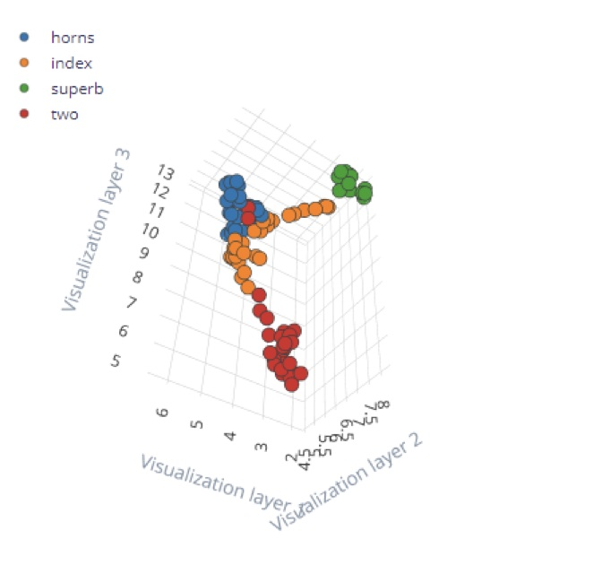

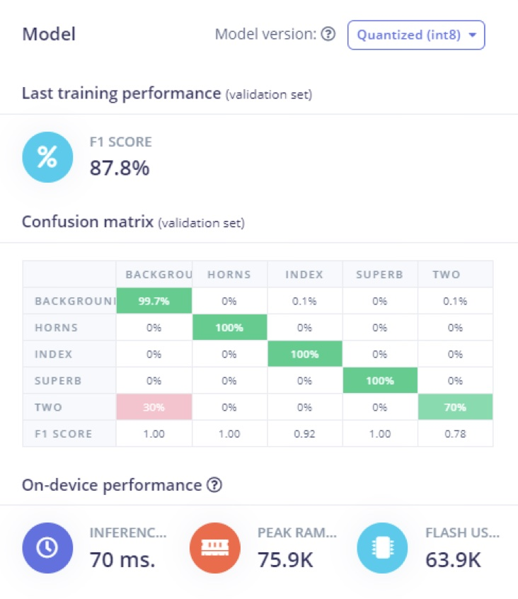

## Model deployment
In order to deploy a model on a microcontroller, Figure 8 represents the block diagram. The red bounding box is the steps where first model is trained on given data, after that model is converted to a tflite file then deployed on a microcontroller.

Here in our case, we must build firmware using the Edge Impulse platform. Figure 9 represents the steps for OpenMV with red bounding boxes. Impulses can be deployed as a C++ library. You can include this package in your own application to run the impulse locally. We will have three files in the zip folder from Edge Impulse: a python micro script, label as txt and tflite file. Once we have the tflite file we can deploy that on our microcontroller. In our case, we use OpenMV. Copy the tflite and label file from folder. Next, paste it into OpenMV disk and open python micro script file in OpenMV IDE and start inference. For further details of OpenMV development refer to [5].

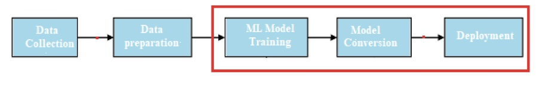

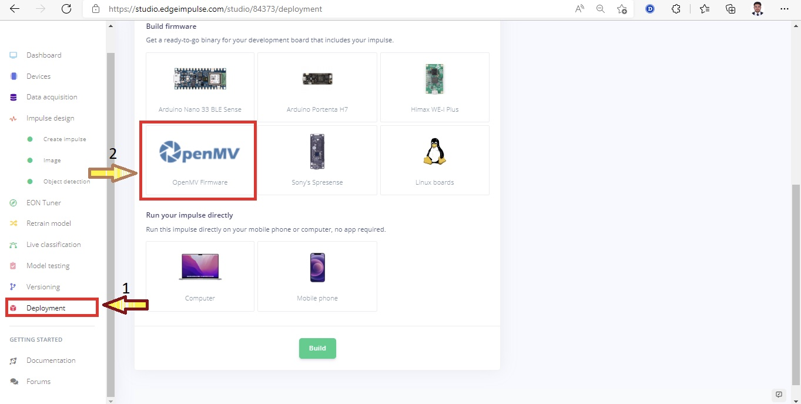

## Results
To test the model, images of hand gestures were split during the processing steps. Through the live testing on Edge Impulse’s website, the input image was taken as a parameter and is able to predict the class it belongs to. Before passing the image, we need to ensure that we are using the same dimensions that we used during the training phase. Here, the image is by default the same dimension. Figure 10 represents the results of different class live testing. Figures 11 and 12 represent device testing results for two different classes.

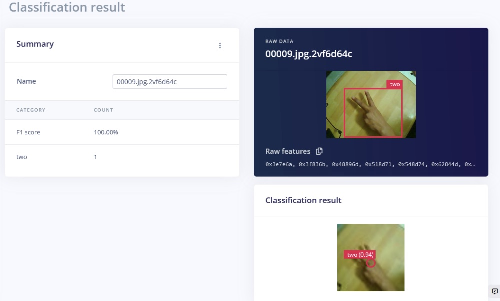

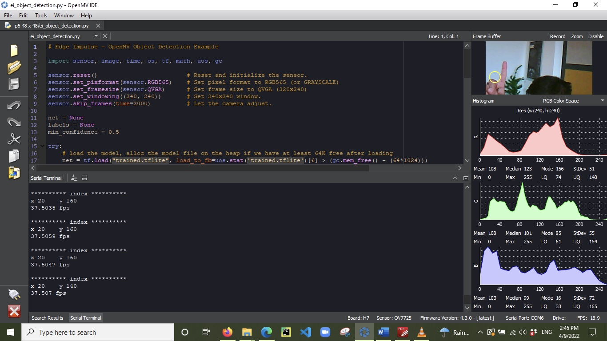

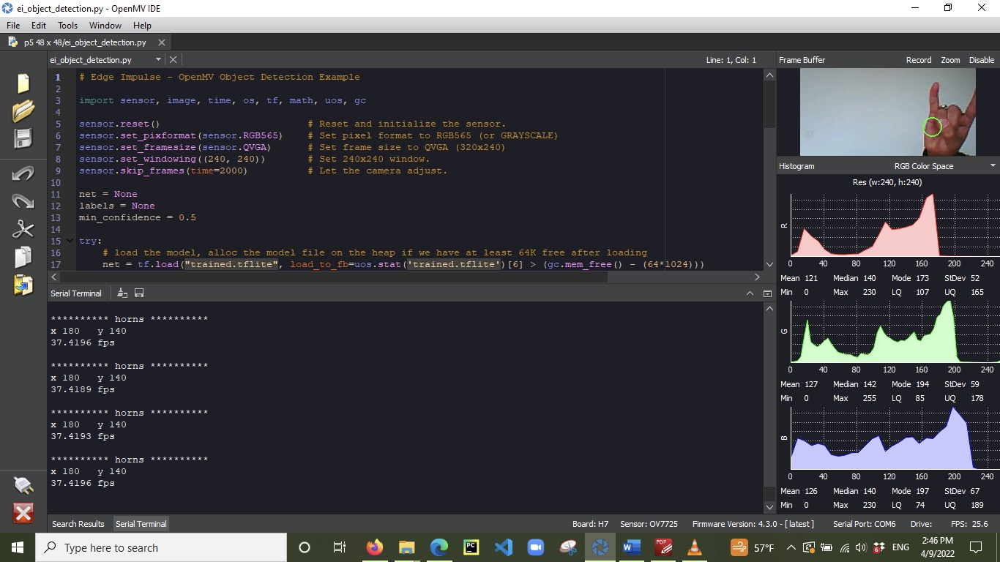

## Conclusion
In this project, we have built a developed recognition model based on a FOMO algorithm. The result shows that the accuracy of the proposed algorithm on a TinyML device is up to 87.8%. However, since the proposed method's effectiveness is low, the gesture dataset is insufficient. As a result, we can improve the accuracy of recognition and detection steps with more data and classes.

## Reference
1. [https://www.edgeimpulse.com/](https://www.edgeimpulse.com)
2. Memo, L. Minto, P. Zanuttigh, "Exploiting Silhouette Descriptors and Synthetic Data for Hand Gesture Recognition", STAG: Smart Tools & Apps for Graphics, 2015
3. [FOMO: Object detection for constrained devices - Edge Impulse Documentation](https://docs.edgeimpulse.com/docs/tutorials/fomo-object-detection-for-constrained-devices)
4. [OpenMV Cam H7 Plus | OpenMV](https://openmv.io/products/openmv-cam-h7-plus)
5. [https://docs.edgeimpulse.com/docs/tutorials/running-your-impulse-locally/running-your-impulse-openmv](https://docs.edgeimpulse.com/docs/tutorials/running-your-impulse-locally/running-your-impulse-openmv)

