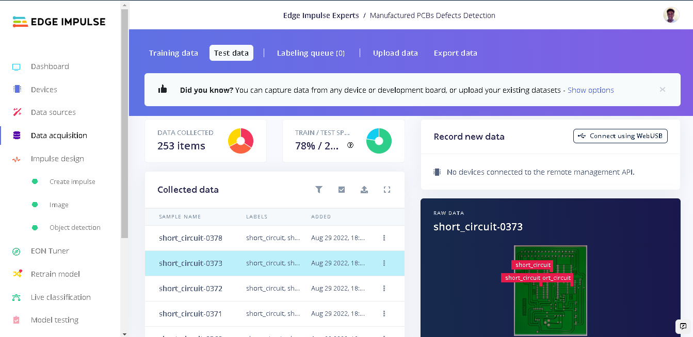
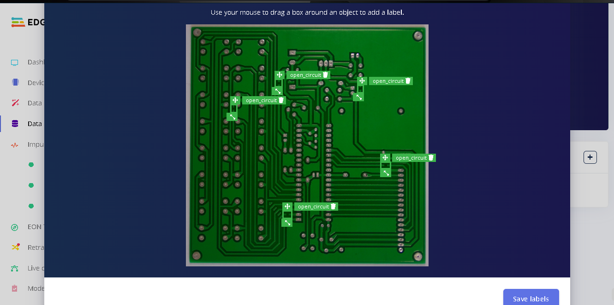
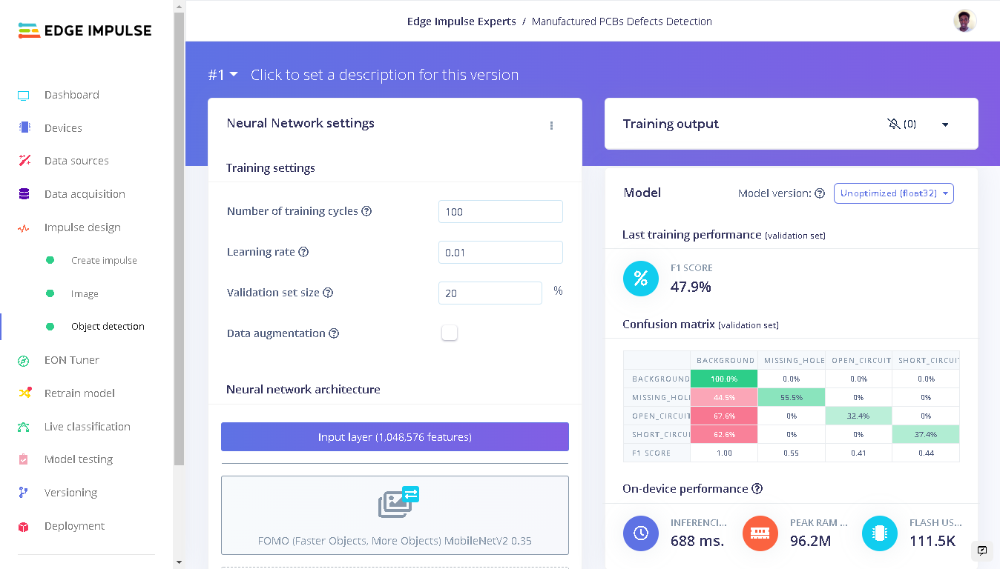
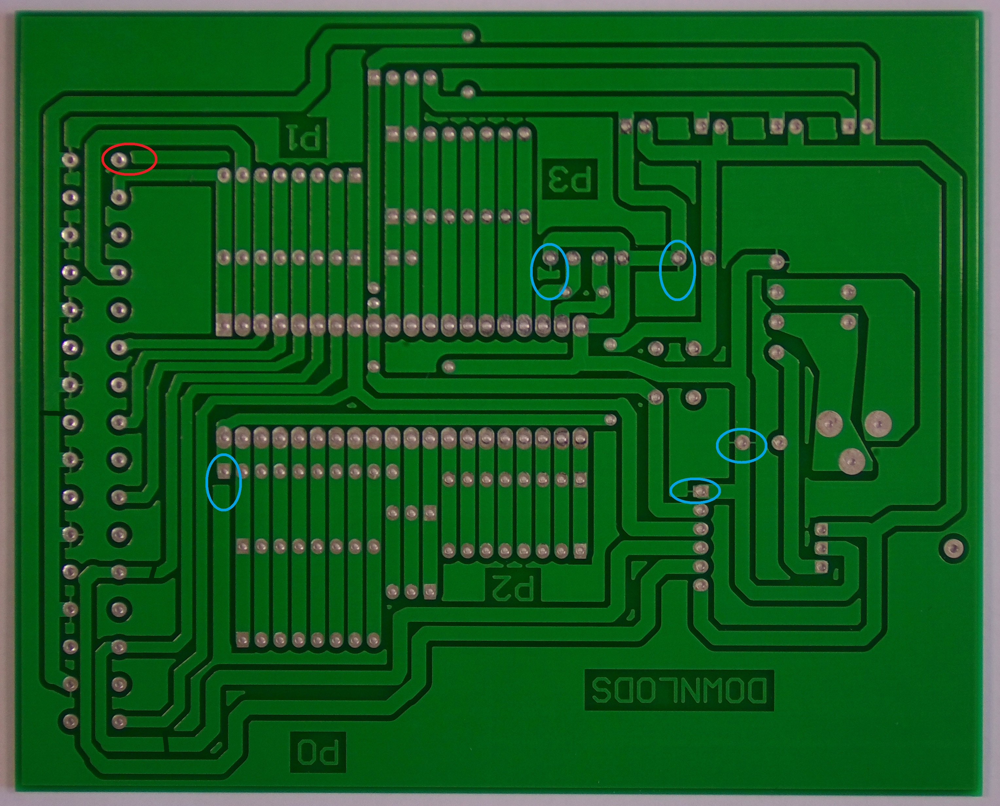
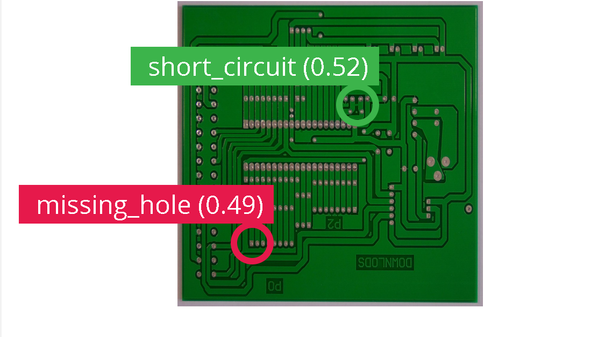
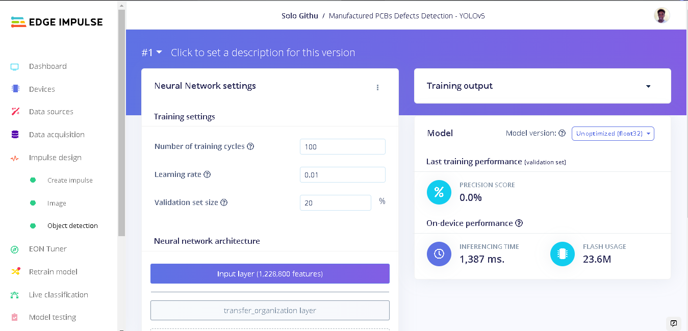
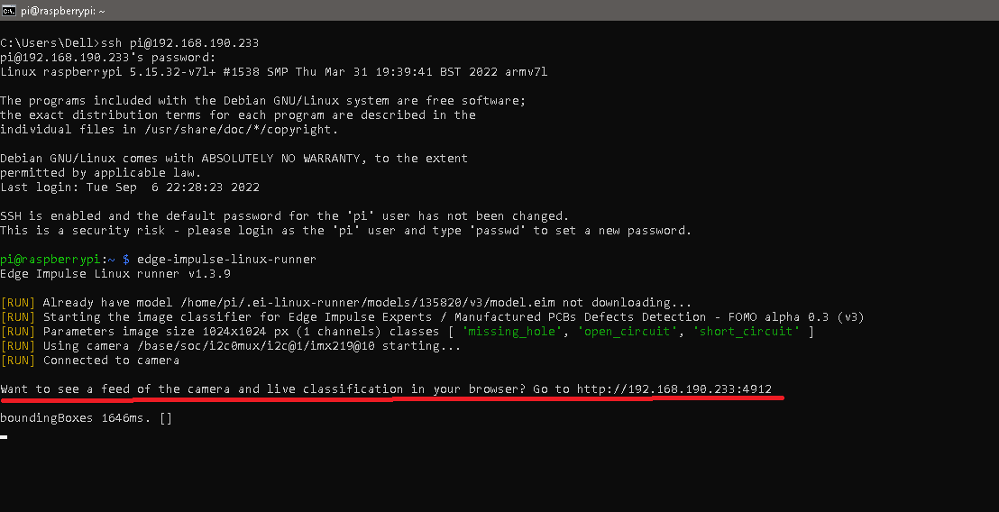

# Identifying PCB Defects with Machine Learning 

Created By:
Solomon Githu 

Public Project Link:
[https://studio.edgeimpulse.com/public/135820/latest](https://studio.edgeimpulse.com/public/135820/latest)

## Identifying PCB Defects with Machine Learning

To reduce the number of defects on PCBs, a number of inspections are carried out at various points in the assembly line. With increased number of PCB manufacturers and developers wanting a more compact and smaller circuit layout, companies have developed advanced inspection systems but still sometimes defects can be unnoticed. 

This project aims to look at three defects on a PCB and how machine learning can be used to identify them. One of the defects is missing holes which can be caused by faulty tooling or excessive processing. This hinders components or mountings to be put on the PCB. Next are the faulty defects: open and short circuit. These two can cause a device to be non functional. An open circuit creates an infinitely high resistance therefore stopping current flow. A short circuit on the other hand creates a low resistance causing a high current to flow which can damage components or even cause a fire. 

While working on this project I build various models with MobileNetV2 SSD FPN-Lite 320x320, FOMO and YOLOv5 each with different parameters to achieve the best result. At the end, I settled with FOMO since it achieved a much better detection compared to the other models.

Therefore to build our Machine Learning model, we will use [FOMO](https://docs.edgeimpulse.com/docs/edge-impulse-studio/learning-blocks/object-detection/fomo-object-detection-for-constrained-devices) and afterwards delploy the model to a Raspberry Pi 4B with the 8 megapixel V2.1 camera module.

## Quick Start

You can find the public project here:  [Manufactured PCBs Defects Detection](https://studio.edgeimpulse.com/public/135820/latest) .  To add this project to your Edge Impulse projects, click “Clone”  at the top of the window. 

Alternatively, to create a similar project, follow the next steps after creating a new Edge Impulse project.

## Data Acquisition

The dataset used in this project was sourced from [Kaggle PCB Defects dataset](https://www.kaggle.com/datasets/akhatova/pcb-defects) . This dataset consisits of 1366 PCB images with 6 kinds of defects. However for this demo, we will only use 3 kinds (missing hole, open circuit and short circuit) for our detection. This is because the annotations for this dataset are in XML format but [Edge Impulse uploader](https://docs.edgeimpulse.com/docs/edge-impulse-cli/cli-uploader#bounding-boxes) requires a bounding_boxes.labels file with the bounding boxes in a unique JSON structure. For this project demo we will have to draw bounding boxes for all our images therefore the need to reduce our dataset size.

There are 9 PCBs used for this dataset. To create the dataset with the defects, artificial defects were added to the PCB images at various locations and saved as multiple images. These are high resolution images, which is a key factor in this object detection as lower resolution images reduce useful information for object detection which will in turn reduce the accuracy of a model.

In total, we have 887 images for training and 253 images for testing. For each defect, we have a total of 380 images both for training and testing. 

AI assisted labelling was not in favour of this project since our objects are not common objects that can be identified with YOLOv5. Edge Impulse Studio has various [AI-Assisted Labelling methods](https://www.edgeimpulse.com/blog/3-ways-to-do-ai-assisted-labeling-for-object-detection) for tedious and time-consuming tasks but in this case bounding boxes were drawn for all 1140 images.

## Impulse Design

With our dataset in place we now need to configure to important features: input, processing and learning blocks. This is a machine learning pipeline that indicates the type of input data, extracts features from the data and finally a neural network that trains on the features from your data. Documentation on Impulse Design can be found [here](https://docs.edgeimpulse.com/docs/edge-impulse-studio/impulse-design) .

We first click ”Create Impulse”. Here, set image width and height to 1024x1024 and Resize mode to Squash. Processing block is set to “Image” and the Learning block is “Object Detection(images)”. Click ‘Save Impulse’ to use this configuration.

Next, we go to the processing block "Image" and set Color depth to Grayscale as we are using FOMO. Save parameters and this will open the “Generate Features” tab.

We generate features by clicking the "Generate features" button. Upon completion we get to see our features in a 2D space which is generated by Edge Impulse's [Data Explorer](https://docs.edgeimpulse.com/docs/edge-impulse-studio/data-explorer) .

The last step to build our model is the training step. Under Impulse Design, we click "Object detection". Next we click "Choose a different model"and select FOMO (Faster Objects, More Objects) MobileNetV2 0.35 . We set the number of training cycles to 100 and the learning rate to 0.01 . Click “Start training” and we get a neural network when the task is complete. After the training process is complete, we get different performance numbers of our model. These include F1 Score, inference time on the Raspberry Pi 4B, peak RAM and flash usage on the Pi 4B.

## Discussion of the model performance - very interesting!

#### Training with FOMO (Faster Objects, More Objects) MobileNetV2 0.35

After training our model we get an F1 score of 48%. However, is an F1 score of 48% good or bad? This depends on the prediction (type of problem we want to solve).

F1-score combines precision and recall into a single metric. Precision is the number of True Positives divided by the number of True Positives plus the number of False Positives (image source: Joos Korstanje)

Recall is a measure of the correctly identified positive cases from all the actual positive cases, that is number of True Positive divided by number of True Positives plus False Negatives. A model with high recall succeeds when finding all positive cases in the data while lower recall models are not able to find a large part of positive cases in the data.

Simply, **precision tell us "of the classified classes as missing hole/open circuit/short circuit, how many of them or what fraction are actually missing hole/open circuit/short circuit". Recall on the other hand tells us "of the classes that are actually missing hole/open circuit/short circuit, how many of them are actually classified as missing hole/open circuit/short circuit.** 

Our model performance for each class is shown in the table below:

| Class | F1-score  | Precision | Recall|
| ----- | --------- | --------- | ------|
|missing hole | 0.55 | 0.54 | 0.56|
|open circuit | 0.41 | 0.56 | 0.32|
|short circuit| 0.44 | 0.54 | 0.37|

**In certain problems a higher precision is required**. In our case we do not want to generate False Positives and notify that a good PCB has a short circuit nor do we want False Negatives which means notifying that a PCB with a short circuit has no short circuit. 

Missing hole has a better prediction compared to open or short circuit since its features are more distinct. 

However in the confusion matrix, we see that a lot of False Positives from the background. This can be caused by the fact that a bare PCB tends to have sections that look similar but the circuitry is very different at each section. Let's look at a sample from the dataset in the image below:

In this image, the red ovals show a region which our model can predict as an open circuit since the copper trace does not reach the copper pad. However us humans we can tell that the copper trace is actually copper pour therefore this is not an open circuit point. Thus, when labelling our dataset we do not draw bounding boxes at this region. Same case applies to the blue ovals which show some copper pads being connected to the copper pour with some traces. This can be connection to a ground plane and we do not draw bounding boxes here but **our Machine Learning model cannot make this complex analysis** and therefore it can say that is a short circuit region.

##### Model Testing

To test our model we go to "Model testing" and click "classify all". Our model has an accuracy of 13%, but wait! There's more to this. Let's discuss this result.

Let's look at the model performance for a test image that has an F1-score of 0%. This image has 3 short circuit labels and our model was possible to accurately detect one short circuit in the PCB.

Now let's look at another testing sample that has an F1-Score of 28%. This sample has 3 labelled short circuits and our model was able to accurately determine them.

In this test sample, FOMO was able to detect a short circuit between two copper traces that is very much impressive since the traces are not straight and parallel compared to other short circuit cases.

In the model testing, accuracy is the percentage of all samples with precision score above 80%. **In our case, since any PCB defect can cause the device to be non functional, even detecting one defect among many is a acceptable. This way if a defect is identified on a PCB, a more detailed inspection can then be done on the PCB afterwards.**

#### Training with YOLOv5

After training with FOMO and analyzing the results, I decided to train another model with YOLOv5 using the same dataset and classes. 

To train a YOLOv5 model on this custom dataset, I built a YOLOv5 model on my local computer using [Edge Impulse custom learning blocks Documentation](https://docs.edgeimpulse.com/docs/edge-impulse-studio/learning-blocks/adding-custom-learning-blocks) and pushed it to my Edge Impulse account. This model was trained with various training cycles and a learning rates. 

With 100 training cycles (epochs) and a learning rate of 0.01, The precision score of this model was not accepatable at 0.0%. FOMO has obviously performed much better compared to this model.

Testing the model on unseen data showed that the model could not detect a single class among the testing data. The testing accuracy was also 0%.

This performance could be one of the limitations of YOLOv5 whereby it struggles to detect small objects that appear in groups. Also, it is advised to train a YOLOv5 model using more than 1500 photos per class and more than 10,000 instances per class to produce a robust YOLOv5 model. This is a very huge dataset which we cannot produce at once.

## Deploying to a Raspberry Pi 4

To deploy our model to the Raspbery Pi we first have to flash the Raspberry Pi OS image to an SD card, install Edge Impulse dependancies on the Raspberry Pi and connect a camera to the Pi. I used the 8 megapixel V2 camera module for capturing the images. Edge Impulse has provided a [documentation](https://docs.edgeimpulse.com/docs/development-platforms/officially-supported-cpu-gpu-targets/raspberry-pi-4) on how to setup the Raspberry Pi to connect to Edge Impulse studio and also deploying your model to the Pi.

After setting up the raspberry pi, we can run the command "edge-impulse-linux" to select our project from the Raspberry Pi then run the command "edge-impulse-linux-runner" to run our model. 

When running our model we can see live classification of what the Raspberry Pi camera captures and the inference. To do this, we connect a computer to the same network that the Raspberry Pi is connected to. Next, on a web browser we enter the url provided by the Raspberry Pi.

Below is a screenshot of live classification running on the Raspberry Pi 4 and the model successfully detecting 3 missing holes on a PCB.

On the Raspberry Pi 4 the model has a latency of ~ 1500ms which equals to ~ 1 fps. In an industrial setup with many PCBs to be inspected the Raspberry Pi 4 won't be the ideal hardware to run this model. A better hardware can be the Jetson Nano dev kit which is fully supported by Edge Impulse and has a GPU accelerated processor (NVIDIA Tegra) targeted at edge AI applications. Documentation on setting up a Jetson Nano can be found [here](https://docs.edgeimpulse.com/docs/development-platforms/officially-supported-cpu-gpu-targets/nvidia-jetson-nano) .

## Conclusion

This project has shown that we can move closer to zero manufacturing defects on bare board PCBs by intergrating Machine Learning for visual inspections.  An interesting future work can be to extend the object detection to multi-layered PCBs and use Deep Learning models for better performance.

FOMO performed best for this object detection since it is flexible and very fast. With FOMO we used image inputs of 1024x1024, which is the highest input size compared to YOLOv5 and MobileNetV2 SSD FPN-Lite 320x320. This enabled our small objects to still retain their useful information for their detection. With Edge Impulse, developing ML models and deploying them has always been easy. The [Versioning](https://forum.edgeimpulse.com/t/you-can-now-version-your-projects/671) feature really help me to save my projects with different models and be able to restore the entire project with dataset and models.

