# Illegal Logging Detection - Nordic Thingy:53

Created By: [Zalmotek](https://zalmotek.com)

Public Project Link:

[https://studio.edgeimpulse.com/studio/138770](https://studio.edgeimpulse.com/studio/138770)

## Introduction

Illegal logging is a major environmental issue worldwide. It has been estimated that it accounts for up to [30% of the global timber trade](https://preferredbynature.org/sourcinghub/info/illegal-logging-0), and is responsible for the loss of billions of dollars worth of valuable timber each year. When timber is exploited illegally, governments lose much-needed money, particularly in developing countries. In addition to this, illegal logging severely impacts biodiversity and it can lead to soil erosion, decreased water quality, and habitat loss for wildlife. Furthermore, illegal logging is frequently associated with organized crime groups and can serve as a source of funding for rebel or terrorist groups.

Due to the vastness of forested regions, it is difficult to identify unauthorised logging activities, which frequently occur in isolated and difficult-to-reach locations and traditional approaches, such as ground patrols, are frequently ineffective.

One way to combat this problem is through the use of AI algorithms that can be deployed on battery-powered devices, such as sensors near the forest on roads frequented by the trucks transporting the wood. Machine learning algorithms are well suited for this task as they can be trained to recognize the characteristic sounds made by logging trucks. When deployed on the roads near forests, these sensors can provide a real-time alert when a logging activity is detected, allowing law enforcement to quickly respond.

## The Challenge

One challenge posed by this approach is that sensors must be able to distinguish between different types of logging truck noises and the background noise in the forest. Another challenge is that the devices must be ruggedized to withstand the harsh environment of the forest. We will address both of these challenges by using the Nordic Thingy:53, a multi-sensor prototyping platform for wireless IoT and embedded machine learning, which will be used to train a ML algorithm, and is encased in a tough polymer casing that can withstand drops and impact.

### Our Solution

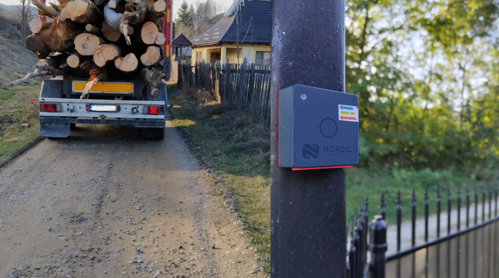

Our approach to this problem is to create an IoT system based on the Nordic Thingy:53 platform that will run a machine learning model trained using the Edge Impulse platform that can detect the sound of timber trucks.

The Nordic Thingy:53 is a versatile, low-power device that is well suited for this application. Its two Arm Cortex-M33 processors' computing capability and memory capacity allow it to execute embedded machine learning (ML) models directly on the device. It features a microphone for audio input in addition to several other integrated sensors, such as an accelerometer, gyroscope, and magnetometer, as well as sensors for temperature, humidity, air quality, and light level. The Thingy can be powered by a rechargeable Li-Po battery with a 1350 mAh capacity that can be charged via USB-C, making it ideal for use in remote locations.


### Hardware requirements

* [Nordic Thingy:53](https://www.nordicsemi.com/Products/Development-hardware/Nordic-Thingy-53)
* USB-C cable

### Software requirements

* Edge Impulse account
* Edge Impulse CLI
* Nordic nRF Edge Impulse App

## Hardware Setup

Our choice of Edge computing hardware for this use case is the Nordic Thingy:53, is based on Nordic Semiconductor’s flagship dual-core wireless SoC, the nRF5340. The SoC's Arm Cortex-M33 CPU application core assures that the Thingy:53 can handle heavy computational workloads of embedded machine learning without interfering with the wireless communication. The application core is clocked at 128 MHz for maximum speed, with 1 MB of flash storage and 512 KB RAM to fit your programs. Wireless communication is handled independently by another Arm Cortex-M33 core clocked at 64 MHz for more power efficient operation and without using any computing resources from the application core. The Bluetooth Low Energy (LE) radio provides firmware updates and communication through Bluetooth LE, as well as additional protocols such as Bluetooth mesh, Thread, Zigbee, and proprietary 2.4 GHz protocols.


## Software Setup

### Creating an Edge Impulse Project

Let's start by creating an Edge Impulse project. Select **Developer** as your project type, click **Create a new project**, and give it a suggestive name.

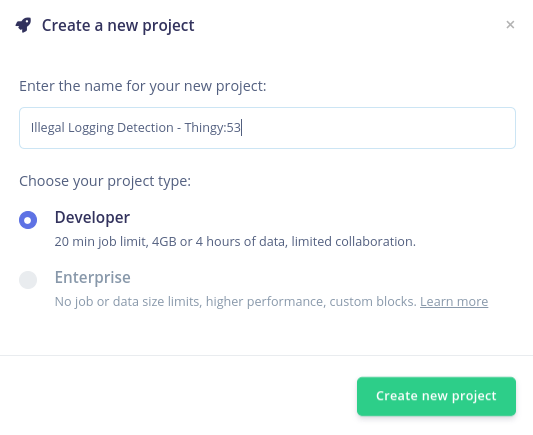

### Connecting the Device

New Thingy:53 devices will function with the Nordic nRF Edge Impulse [iPhone](https://apps.apple.com/us/app/nrf-edge-impulse/id1557234087) and [Android](https://play.google.com/store/apps/details?id=no.nordicsemi.android.nrfei\&hl=en\&gl=US) apps, as well as with the Edge Impulse Studio right out of the box.

Before connecting it to the Edge Impulse project, the firmware of the Thingy:53 must be updated. Download the **nRF Programmer** mobile application and launch it. You will be prompted with a number of available samples.

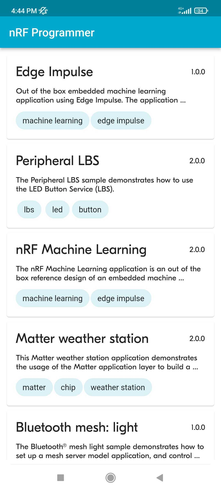

Then, go to **Devices -> Connect a new device** in your Edge Impulse project, choose **Use Your Computer**, and allow access to your microphone.

Select the **Edge Impulse** application, select the version of the sample from the drop-down menu and tap **Download**.

When that is done, tap **Install**. A list with the nearby devices will appear and you must select your development board from the list. Once that is done, the upload process will begin.


With the firmware updated, connect the Thingy:53 board to a computer that has the edge-impulse-cli suite installed, turn it on, launch a terminal and run:

```
edge-impulse-daemon --clean
```

You will be required to provide your username and password before choosing the project to which you want to attach the device.

```
Edge Impulse serial daemon v1.14.10
? What is your user name or e-mail address (edgeimpulse.com)? <your user>
? What is your password? [hidden]
```

Once you select the project and the connection is successful, the board will show up in the Devices tab of your project.

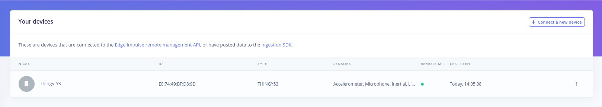

### Building the Dataset

We will use a publicly available [truck noise dataset](https://freesound.org/search/?q=truck+sound) and a [forest sound dataset](https://www.youtube.com/watch?v=HAw37tUHcOo\&t=455s\&ab\_channel=MichaelGhelfiStudios), as well as the Edge Impulse platform to train and deploy a model that can distinguish between the two types of sounds. In order to upload the sound dataset to Edge Impulse, we’ll have to split it into smaller samples (in our case the samples are 3 seconds long), and you can do so using the following command line instruction:

```
ffmpeg -i DaytimeForest_NatureAmbience.wav -f segment -segment_time 3 -c copy output%09d.wav
```

Make sure to replace **DaytimeForest\_NatureAmbience.wav** with the name of your file.

Now go to Data acquisition > Upload data on Edge Impulse and upload your samples, making sure to label them accordingly. Our two labels are **EngineSounds** and **Background**. The difference between the two classes should be clearly observed in the sound waveform, as seen in the following pictures:

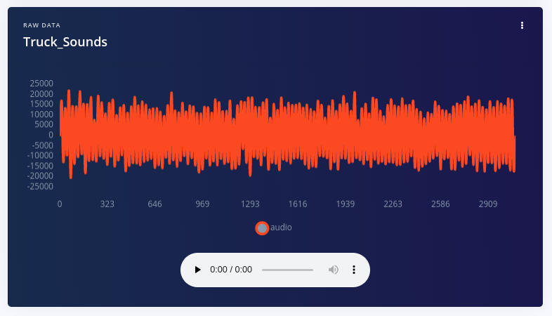

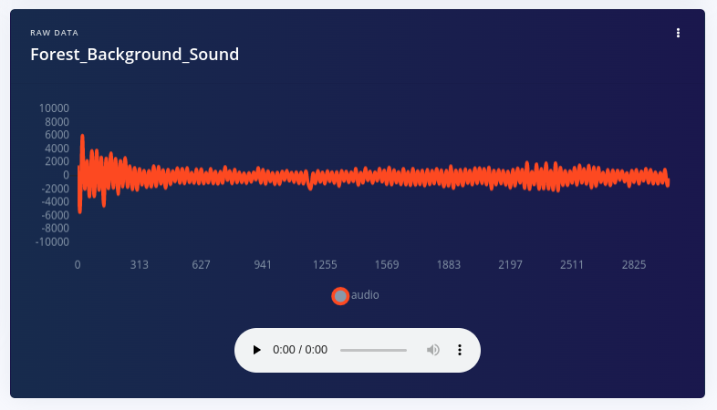

### Designing the Impulse

Now that the data is available, it’s time to create the Impulse. The functional Block of the Edge Impulse ecosystem is called **"Impulse"** and it fundamentally describes a collection of blocks through which data flows, starting from the ingestion phase and up to outputting the features.

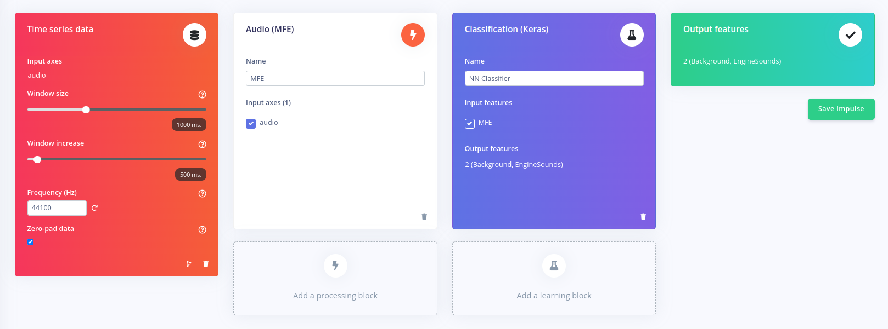

The setup is rather straightforward for this use case. We will be using a 2000ms window size, with a window increase of 200ms at an acquisition frequency of 100Hz. For the processing block we will be using an **Audio (MFE)** block and for the Learning block, we will be employing a basic **Classification (Keras)** block.

### Configuring the Audio Features Block

The Audio MFE (Mel-filterbank energy) processing block extracts signal time and frequency information. A mel filter bank can be used to break down an audio signal into discrete frequency bands on the mel frequency scale, simulating the nonlinear human perception of sound. It works effectively with audio data, primarily for **non-voice recognition** applications when the sounds to be categorised may be recognized by the human ear. You can read more about how this block works [here](https://docs.edgeimpulse.com/docs/edge-impulse-studio/processing-blocks/audio-mfe).

A spectrogram is a display of the MFE's output for a sample of audio on the right side of the page. The MFE block converts an audio window into a data table, with each row representing a frequency range and each column representing a time period. The value contained within each cell reflects the amplitude of its related frequency range during that time period. The spectrogram depicts each cell as a colored block, with the intensity varying according to the amplitude.

A spectrogram's patterns reveal information about the sort of sound it represents. In our case, the spectrogram below depicts a pattern characteristic of forest background noise:

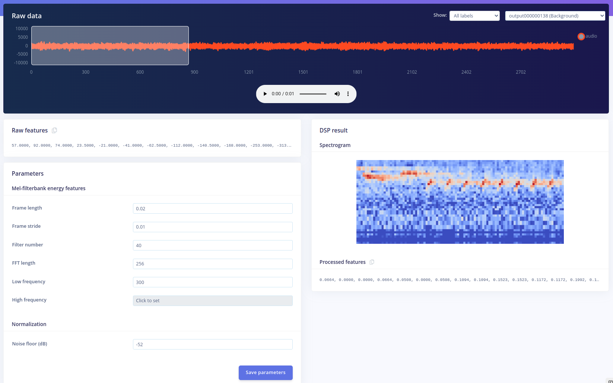

This spectrogram depicts a pattern characteristic of logging trucks engine sounds and the differences between this spectrogram and the above one can be easily observed:

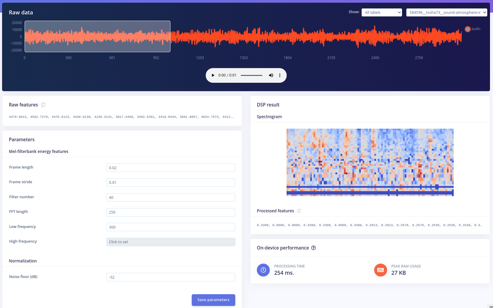

You can use the default values for configuring the MFE block as they work well for a wide range of applications. Click on **Save parameters** and you’ll be prompted to the feature generation page. After you click on **Generate features** you’ll be able to visualise them in the **Feature explorer**. Generally, if the features are well separated into clusters, it means the ML model will be able to easily distinguish between the classes.

### Configure the Neural Network

The next step in developing our machine learning algorithm is configuring the NN classifier block. There are various parameters that can be changed: the **Number of training cycles**, the **Learning rate**, the **Validation set size** and to enable the **Auto-balance dataset** function. They allow you to control the number of epochs to train the NN on, how fast it learns and the percent of samples from the training dataset used for validation. Underneath, the architecture of the NN is described. For the moment, leave everything as is and press **Start training**.

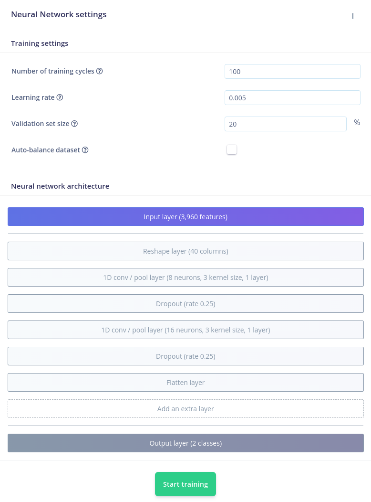

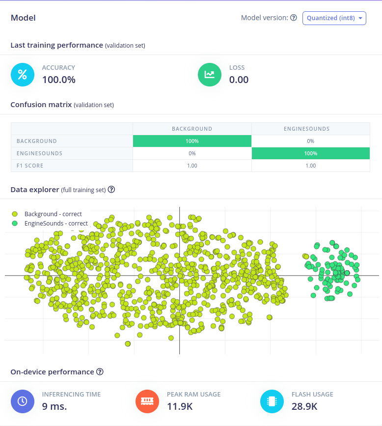

The training will be assigned to a cluster and when the process ends, the training performance tab will be displayed. Here, you can evaluate the Accuracy and the Loss of the model, the right and wrong responses provided by the model after it was fed the previously acquired data set, in a tabulated form.

Moreover, you can see the Data explorer that offers an intuitive representation of the classification and underneath it, the predicted on-device performance of the NN.

### Model Testing and NN Optimization

To quickly test the performance of your NN, navigate to the Model testing tab, and click on **Classify all**. This will evaluate how well the model will perform on never seen data. This is a great practice to avoid overfitting the model on the training data.

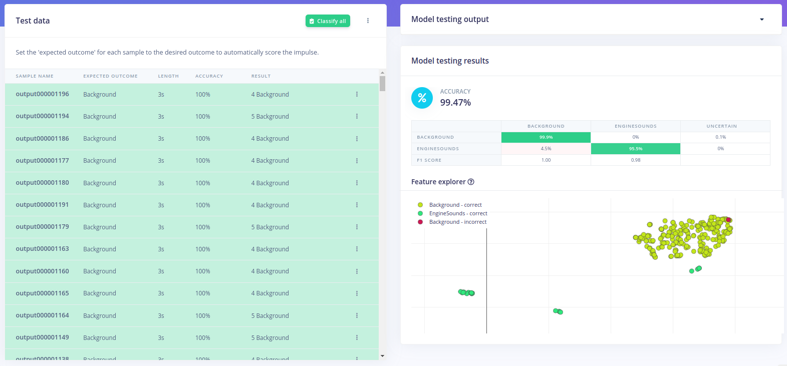

## Upload the Impulse via USB Cable

You will notice that another menu pops up that allows you to opt in if you want to enable EON Compiler. For now, click **Build** and wait for the process to end. Once it’s done, download the .hex file and follow the steps in the video that shows up to upload it on the Thingy:53 board.

With the impulse uploaded, connect the board to your computer, launch a terminal and issue the following command to see the results of the inferencing:

```
edge-impulse-run-impulse
```

### Upload the Impulse via Android/IoS App

Another way of deploying the model on the edge is using the **Nordic nRF Edge Impulse App** for iPhone or Android:

1. Download and install the app for your Android/IoS device.
2. Launch it and log in with your edgeimpulse.com credentials.
3. Select your Illegal Logging Detection project from the list

Now deploy your device in an area that you want to monitor and receive the notifications of passing trucks on your phone. In our next section we will explore mesh network capabilities and connectivity options.


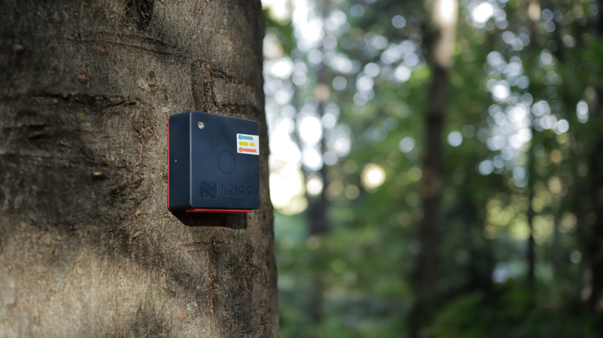

## Future Development

The Nordic Thingy:53 is equipped with a Dual-core Bluetooth 5.3 SoC supporting Bluetooth Low Energy, Bluetooth mesh, NFC, Thread and Zigbee, which makes it a great choice for creating edge applications that use bluetooth communication as an output. In this case, Edge Impulse platform allows its users to deploy their Impulse as a library containing all the signal processing blocks, learning blocks, configurations, and SDK required to integrate the ML model in your own unique application.

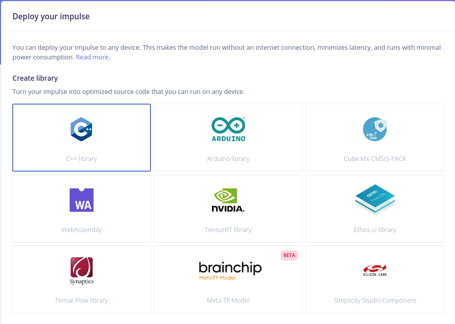

In order to deploy the model as a sensor in the forest, a mesh network can be used to establish connections between various sensors, called nodes. Bluetooth mesh networks are well suited for applications that require a large coverage area. The data collected by the sensors can be transmitted wirelessly to a central location, from which an alert can be sent. Having a Bluetooth mesh network in place is more efficient than having to physically retrieve the sensor data. Furthermore, this network topology provides redundancy and resistance to failure as all nodes are interconnected and any node can act as a relay if necessary. Consequently, using a Bluetooth mesh network is an efficient way to wirelessly collect sensor data over a large coverage area.

## Conclusion

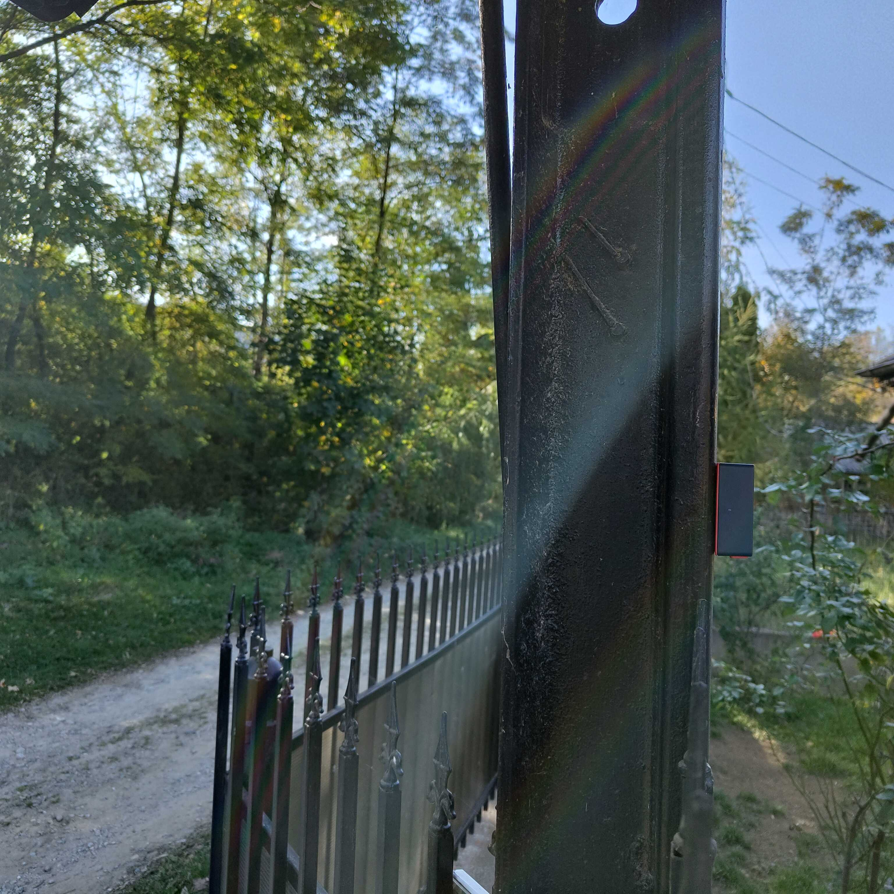

Though it is often overlooked, illegal logging is a significant global problem. It results in the loss of valuable timber each year, and contributes to deforestation and climate change. Fortunately, machine learning algorithms offer a promising solution to this problem. By providing real-time monitoring, these algorithms have the potential to significantly reduce the amount of valuable timber lost each year to illegal logging, and the Nordic Thingy:53 is a powerful tool to achieve this. With this system in place, we can help to preserve our forests and ensure that they are managed in a sustainable way.

If you need assistance in deploying your own solutions or more information about the tutorial above please [reach out to us](https://edgeimpulse.com/contact)!
