# Computer Vision Object Counting - Avnet RZBoard V2L

Created By: David Tischler

Public Project Link: [https://studio.edgeimpulse.com/public/315846/latest](https://studio.edgeimpulse.com/public/315846/latest)

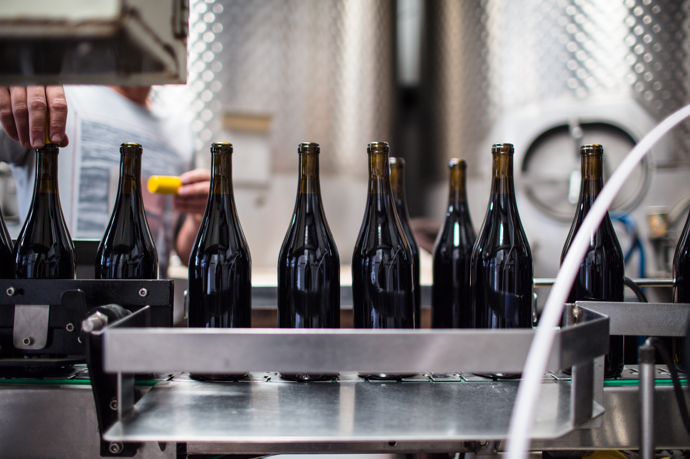

## Introduction

Large scale production and manufacturing operations rely on effective and accurate inventory and product counting, so that businesses have accurate and known quantities of products to fulfill orders, ship to retailers, and plan their finances accordingly.  In typical scenarios, business have up-to-date counts of inputs such as supplies and raw materials, partially completed products that are currently being worked on, and finished goods ready for distribution.  To alleviate the burden of counting the units in each stage by hand, which could possibly be very time-consuming, computer vision can be used to identify and quantify parts, supplies, or products instead.

There are two distinct counting operations to consider.  The first is a "total quantity" at any given time, such as "there are 8 objects on the assembly line at this exact moment".  The second scenario is a value that includes a time factor, for example, "14 items moved from point A to point B along the conveyor belt since we began work this morning."  Each of these counts are important, so we'll cover both of them here.  First, we'll perform a count of items detected in a camera frame, then we will explore how to count the total number of objects that moved past a stationary camera placed above a conveyor belt.

A machine learning model that recognizes a distinct item will be needed, along with the camera and hardware.

## Solution

We'll use the [Avnet RZBoard V2L](https://www.avnet.com/wps/portal/us/products/avnet-boards/avnet-board-families/rzboard-v2l/) along with Edge Impulse to accomplish this task.  The Avnet RZBoard V2L is a compact single board computer powered by a Renesas RZ/V2L SoC, running a Linux operating system.  It has 2gb of RAM, 32gb of onboard eMMC storage, an SD Card slot, micro-HDMI display output, an ethernet port, built-in WiFi and Bluetooth connectivity, USB ports, and a 40-pin GPIO header for expansion.  It's powered by a single 5V/3A USB-C power supply.

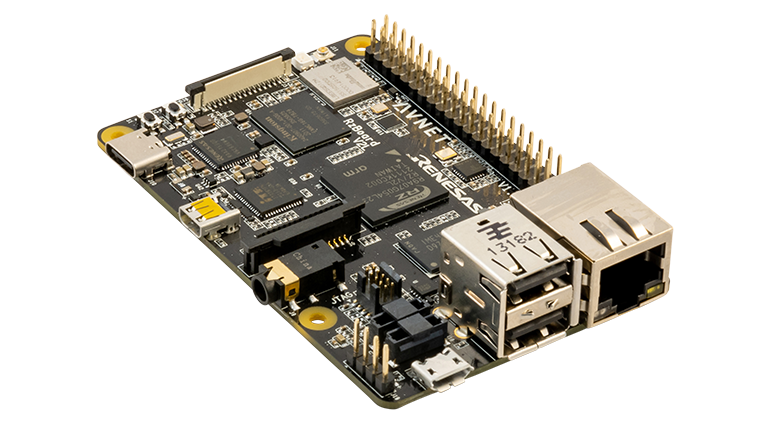

The Renesas RZ/V2L SoC contains two 1.2GHz Arm® Cortex®-A55 cores for running Linux, a 200MHz Cortex-M33 core for RTOS or other microprocessor applications, and very important for this use-case, a DRP-AI machine learning model accelerator.

With all of the connectivity, memory, storage, and compute power the RZBoard V2L contains, it is a very capable and highly efficient platform for AI projects.

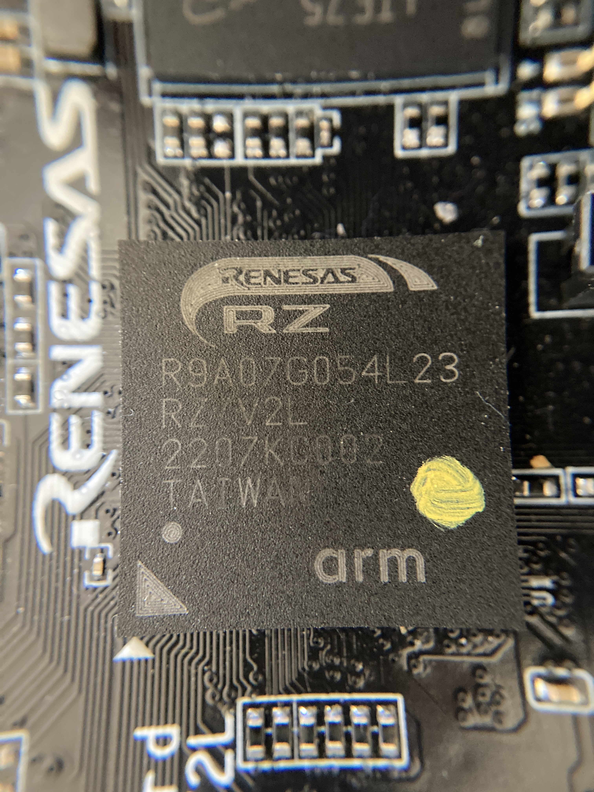

For ease of testing, we'll use small conveyor belt to prototype the system so that objects pass into and out of the camera's field of view.  This way we can test both scenarios as mentioned: the number of objects in view at a distinct moment, and the total count of objects that have moved past the camera.

## Hardware Requirements

 - [Avnet RZBoard V2L](https://www.avnet.com/wps/portal/us/products/avnet-boards/avnet-board-families/rzboard-v2l/)
 - USB Webcam
 - HDMI monitor, keyboard, mouse
 - Conveyor belt, motor, power supply
 - M5 hex nuts (this is the object I will be detecting, but you can choose something else)
 
## Software Requirements

 - Edge Impulse
 - Updated RZBoard OS
 
## Data Collection

The first step in our machine learning workflow is data collection.  In this example, we are going to identify, and count, some small M5 hex bolts traveling down a conveyor belt.  I've used M5 hex nuts due to their convenient size, but you could use any object.  To build a model that can identify a hex nut, we need to first take pictures of hex nuts and label them accordingly.  Knowing that a USB camera is going to be hooked up to the RZBoard and placed above the conveyor belt, I have (for now) connected the same camera directly to my laptop in order to capture representative images.  This allows me to gather pictures of the M5 nuts from the same angle, distance, and lighting as what we will experience once the model is deployed to the RZBoard.

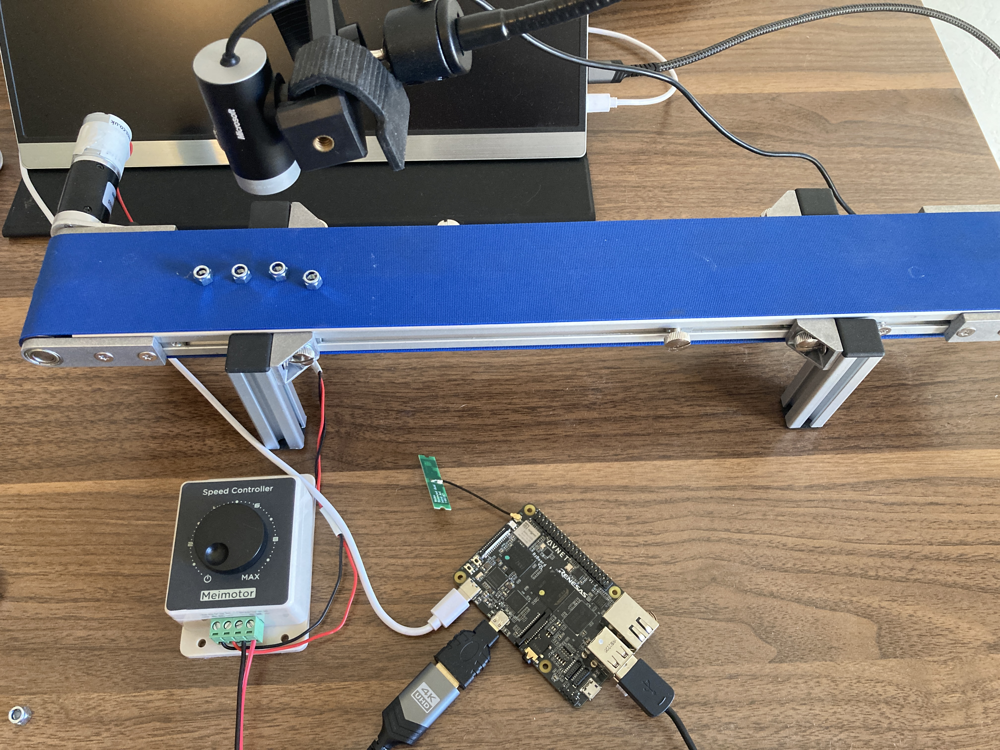

Log in to Edge Impulse, click on Create Project, and provide a name for your project.  Next, click "Data acquisition" on the left, and then click on "Connect to your computer".  A new tab or window will open, with the ability to take pictures by clicking the "Capture" button.  Images collected will be automatically added to your dataset.  I was able to select the camera I wanted to use in my browser settings, and I re-positioned the M5 bolts, moved the conveyor a bit, rotated the bolts, and varied the lighting in order to build a robust collection of images.

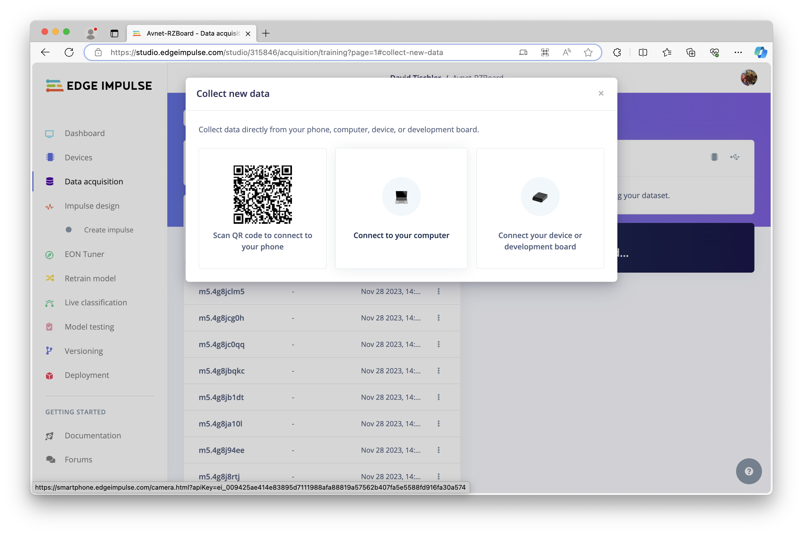

Next, we need to label the objects in each image.  This locates where the objects of interest are in each picture, which will be used when training the model.  Click on "Labeling Queue" at the top, and draw a bounding box around each bolt in the picture, and give it a label.  I simply entered `m5_nut` on mine, though yours could vary.  Click on "Save labels" to advance to the next image in the dataset, and you will notice that the bounding boxes will follow through to the next picture, making this process quick and easy.  Once complete, you can click on "Dataset" to return to the summary list of data elements.  You can click on them if you'd like to inspect them closer, but they should be ready for use at this point.

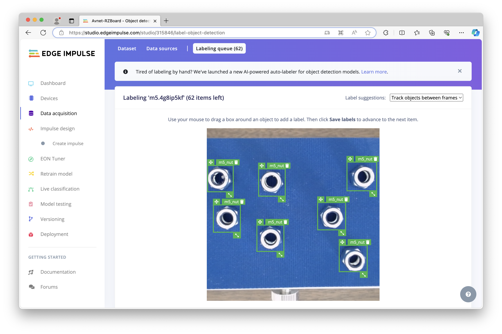

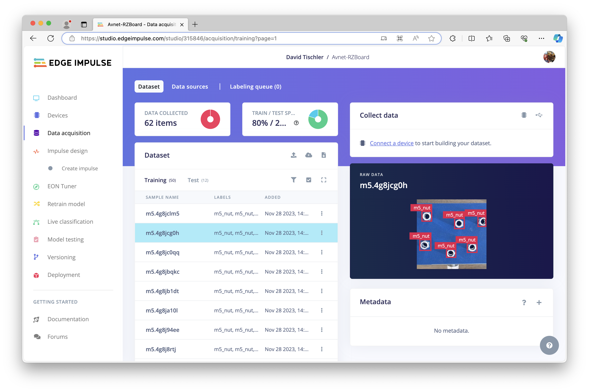

## Model Creation

After the images have all been labeled, it is time to move on to the machine learning model creation phase.  Click on "Impulse design" on the left, and you will see 4 columns (2 of which are empty for the moment), that will make up the machine learning pipeline.  The first column is the input, which should be pre-populated with "Image data".  You can however, increase the image height and width to 320 by 320, as the RZBoard will have plenty of processing power available to make use of the larger image size (more on that in a bit).  In the second column, click "Add a processing block", and choose "Image" by clicking "Add".  In column 3, click "Add a learning block", and choose "YOLOv5 for Renesas DRP-AI" by clicking "Add".  Finally, the fourth column should be pre-populated as well, with only one Output feature, the label we created earlier called `m5_nut`.  Click "Save Impulse".

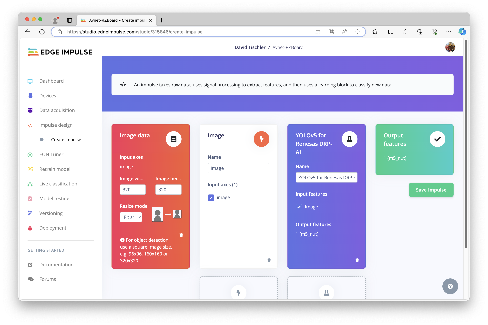

On the left, click "Image", and we'll configure the Image Processing Block.  Here you can review the Raw features, switch to grayscale to save some memory on lower power devices or those with grayscale image sensors (not necessary in this case), and review the DSP results.  We won't make any changes, so click "Save parameters".  It will automatically move to the "Generate features" page, and here you can click the "Generate features" button to create a visualization of the analyzed features.  With only one class in this project, there should be a nice cluster of data points represented, though the clustering is a bit easier to comprehend or represent visually when multiple labels / objects are used in a dataset.

Next, click on "YOLOv5 for Renesas DRP-AI" on the left navigation to go to the Neural Network Settings page.  You can leave the default selections alone, but do check to make sure that the Target is set to "Renesas RZ/V2L with DRP-AI accelerator" in the top-right corner, for more accurate inference time and memory usage estimations, and also double check that the Neural network architecture is correctly set to "Renesas / YOLOv5 for Renesas DRP-AI", then click "Start training".  This will take a short while to iterate through each epoch, and at the end of the process you should get back a Precision score and estimated inference time and memory usage.

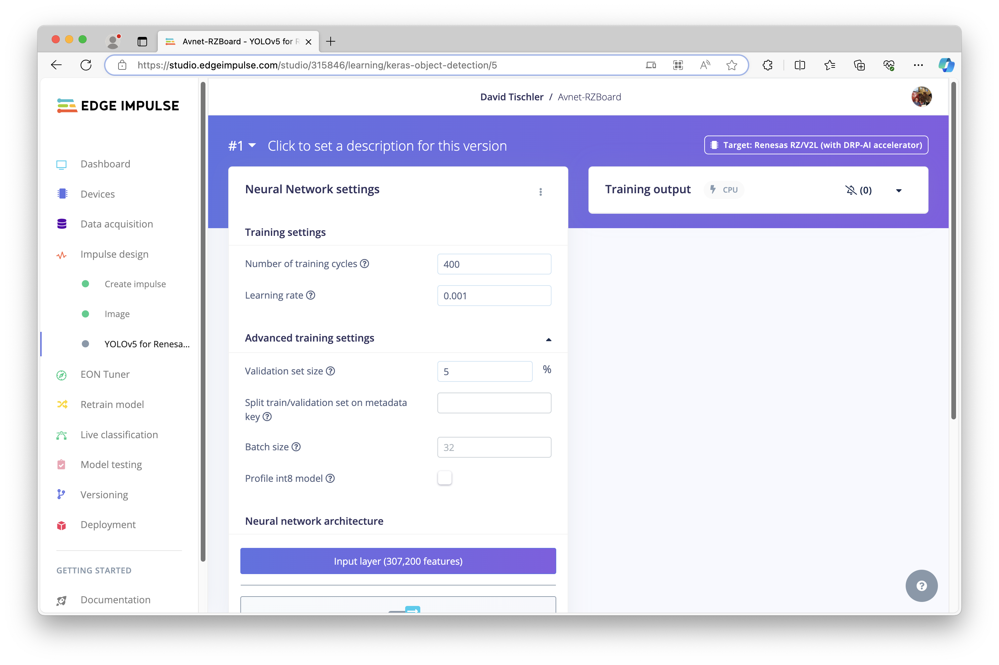

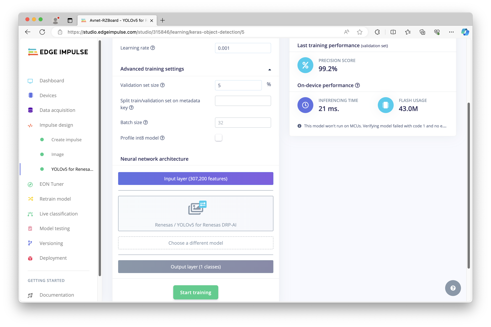

## Deployment

In order to get the model (and eventually our counting application) onto the RZBoard V2L, we have a bit of prep work to do.  The RZBoard comes from the factory with an operating system and sample application installed on it's eMMC, which is nice for an immediate way to get started with the board and a great out-of-the-box experience, but won't work for our purposes here.  Instead, we need a version of the Yocto OS that includes `nodejs` and `npm`, so that we can install the Edge Impulse Linux Runner.  You _could_ go down the path of building Yocto yourself (I tested it, and it does work fine), but to save you the trouble Avnet has already gone ahead and built one, that you can find in their Sharepoint site here:  

[https://avtinc.sharepoint.com/teams/ET-Downloads/Shared%20Documents/Forms/AllItems.aspx?id=%2Fteams%2FET%2DDownloads%2FShared%20Documents%2Fprojects%2FRenesas%20RzBoard%20V2L%2Fsoftware%5Fimage%5Ffiles%2FRZBoard%5FEdgeImpulse%5FeMMC%2Ezip&parent=%2Fteams%2FET%2DDownloads%2FShared%20Documents%2Fprojects%2FRenesas%20RzBoard%20V2L%2Fsoftware%5Fimage%5Ffiles&p=true&ga=1](https://avtinc.sharepoint.com/teams/ET-Downloads/Shared%20Documents/Forms/AllItems.aspx?id=%2Fteams%2FET%2DDownloads%2FShared%20Documents%2Fprojects%2FRenesas%20RzBoard%20V2L%2Fsoftware%5Fimage%5Ffiles%2FRZBoard%5FEdgeImpulse%5FeMMC%2Ezip&parent=%2Fteams%2FET%2DDownloads%2FShared%20Documents%2Fprojects%2FRenesas%20RzBoard%20V2L%2Fsoftware%5Fimage%5Ffiles&p=true&ga=1)

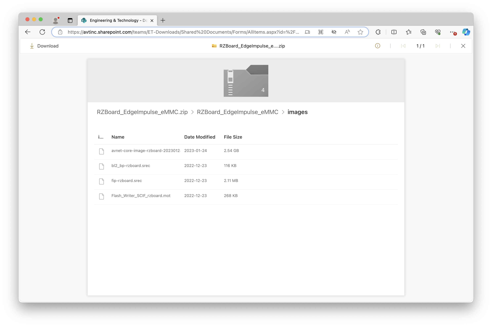

The name of the file you need to download is `avnet-core-image-rzboard-20230124105646.rootfs.wic`.  (If you enter the folder at the top-most driectory, navigate into the "images" folder to find it there).  Download that file, and flash it directly to an SD Card.  Now, on the RZBoard, you'll need to flip a small DIP-switch that tells the board to boot from SD Card instead of the eMMC storage.  Look for two tiny switches near the headphone jack, and make sure they are both flipped *away* from the headphone jack, facing the silkscreened `1` and `2` markings on the switch.  Here is an example of how mine looks:

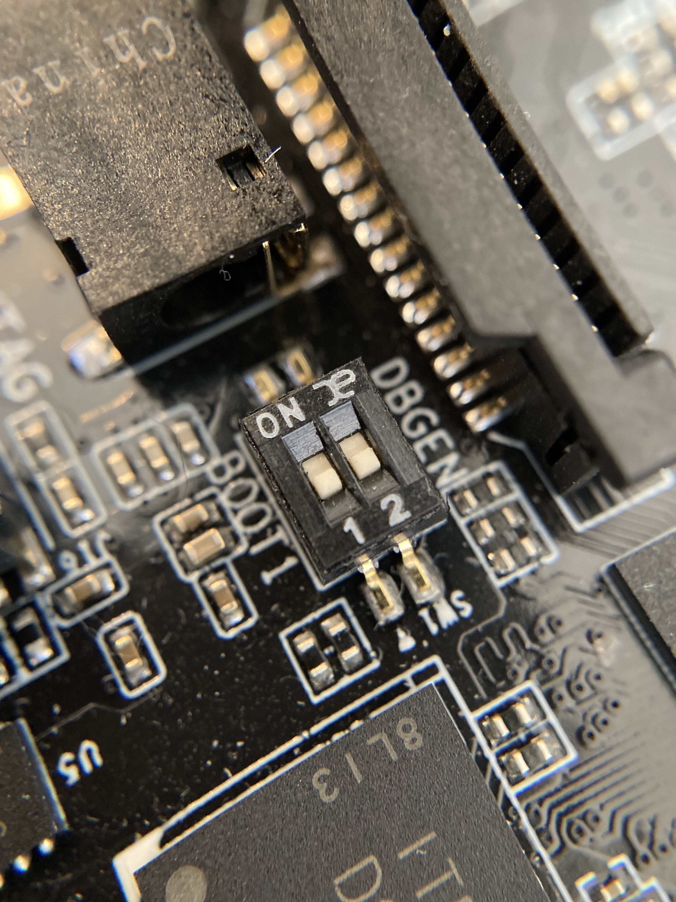

Once this is done, insert the SD Card, plug in USB-C power, attach an HDMI monitor, USB webcam, and USB keyboard/mouse, then power on the board by pressing the power button near the USB-C power supply.


Once booted up, you can open a terminal session by clicking on the top left icon, and we'll need to connect the board to WiFi.  To do that, enter:

```
wpa_passphrase "SSID_Name_Goes_Here" "Password_Goes_Here" >> /etc/wpa_supplicant.conf
wpa_supplicant -B -i mlan0 -c /etc/wpa_supplicant.conf
udhcpc -i mlan0 -n -R
```

> NOTE:  You can also attach a serial console and use Putty or a similar terminal application, if that's easier for you.

We'll also need to expand the available space on the SD Card, so enter:

```
fdisk /dev/mmcblk0
```

Enter `p` to print the current partition information, and make note of the `mmcblk0p2` start address displayed on the screen.  We'll need that in a moment (mine was `204832`).  Follow the series of commands below to [p] print the partition info, [d] delete the current second [2] partition, make a [n] new [p] primary second [2] partition, and type in the start address you discovered a moment ago and press [enter].  Then press [enter] again on the next question to accept the default end address, [N] to *not* remove the signature, and [w] to write the changes to disk.  The chain of commands is thus:

```
p -> d -> 2 -> n -> p -> 2 -> <mmcblk0p2 start address>,enter -> enter (to accept default) -> N -> w
```

Finally, run this to expand the drive:

```
resize2fs /dev/mmcblk0p2
```

At this point, we are ready to install the Edge Impulse Linux tooling, which can be done with:

```
npm config set user root && npm install edge-impulse-linux -g --unsafe-perm
```

Once completed, we can test out that everything works thus far, by running:

```
edge-impulse-linux-runner --debug
```

You will be asked for your username and password, and the project name to connect to, then a download and build will run to get the model ready for use on the RZBoard.  Once complete, local inferencing will start, and results will be printed to the command line.  Make note of the final model location just before the inferencing starts, we'll use that later on (mine was `/root/.ei-linux-runner/models/315846/v15/model.eim`).  You can also load http://<your-rzboard-ip-address>:4912 in a browser on your development machine, to get a view from the camera with any detected objects outlined by bounding boxes. Before we move on to building our object counting application, let's highlight an important item here.  My inference time as you can see below is approximately 8ms to 10ms, so roughly 100 inferences per second - incredible performance.  The web view of the camera however, provides a slow frame rate:  The reason is that the sample webserver sending the camera view is not really optimized, and the WiFi latency itself is also at play here.  A compiled binary version of an application is much more responsive.


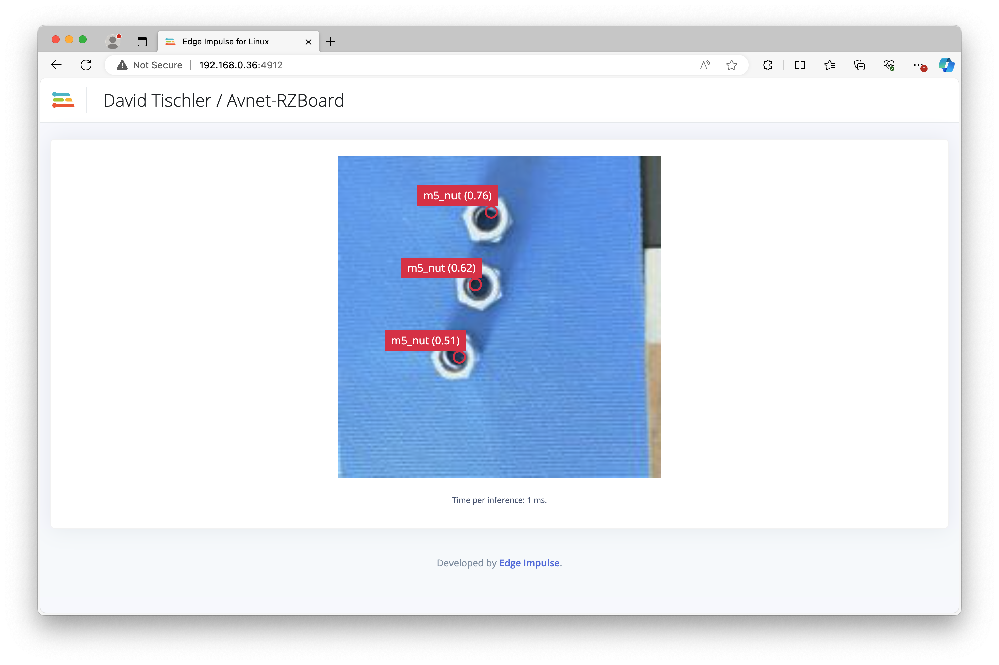

## Object Counting Applications

### Unique Count at any Moment

For our first counting task, we'll quantify the number of objects detected within a camera frame.  To do this, we'll put together a bit of python code to run on the RZBoard - but this will also require some more tooling and dependencies to get installed.  In that same terminal session you already have running, enter the following series of commands to install `portaudio`, `pip`, a few dependencies, `edge_impulse_linux`, and set the Display variable.  You could probably wrap this all up into a shell command to run in bulk, but here are the individual commands to run:

```
curl https://files.portaudio.com/archives/pa_stable_v190700_20210406.tgz --output portaudio.tgz
tar -xvf portaudio.tgz
cd portaudio/
./configure
make
make install
cd ..
export LD_LIBRARY_PATH=$LD_LIBRARY_PATH:/usr/local/lib
ldconfig
python3 -m ensurepip
python3 -m pip install --upgrade pip
pip3 install wheel six args
pip3 install pyaudio
pip3 install edge_impulse_linux   
export DISPLAY=:0
```

Now we can place our python counting application on the RZBoard, by entering `nano unique_count.py` and then pasting in the following python snippet (it might be faster to copy/paste this snippet into a file on your desktop/laptop, and then copy the file directly on to the RZBoard's SD card, or use a serial console so that you can copy/paste from host to device, instead of typing this all in to that terminal window directly on the RZBoard).

```
import cv2
import os
import sys, getopt
import signal
import time
from edge_impulse_linux.image import ImageImpulseRunner

modelfile = '/path/to/modelfile.eim'
# If you have multiple webcams, replace None with the camera port you desire, get_webcams() can help find this
camera_port = None


runner = None
# if you don't want to see a camera preview, set this to False
show_camera = True
if (sys.platform == 'linux' and not os.environ.get('DISPLAY')):
    show_camera = False

def now():
    return round(time.time() * 1000)

def get_webcams():
    port_ids = []
    for port in range(5):
        print("Looking for a camera in port %s:" %port)
        camera = cv2.VideoCapture(port)
        if camera.isOpened():
            ret = camera.read()[0]
            if ret:
                backendName =camera.getBackendName()
                w = camera.get(3)
                h = camera.get(4)
                print("Camera %s (%s x %s) found in port %s " %(backendName,h,w, port))
                port_ids.append(port)
            camera.release()
    return port_ids

def sigint_handler(sig, frame):
    print('Interrupted')
    if (runner):
        runner.stop()
    sys.exit(0)

signal.signal(signal.SIGINT, sigint_handler)


print('MODEL: ' + modelfile)


with ImageImpulseRunner(modelfile) as runner:
    try:
        model_info = runner.init()
        print('Loaded runner for "' + model_info['project']['owner'] + ' / ' + model_info['project']['name'] + '"')
        labels = model_info['model_parameters']['labels']
        if camera_port:
            videoCaptureDeviceId = int(args[1])
        else:
            port_ids = get_webcams()
            if len(port_ids) == 0:
                raise Exception('Cannot find any webcams')
            if len(port_ids)> 1:
                raise Exception("Multiple cameras found. Add the camera port ID as a second argument to use to this script")
            videoCaptureDeviceId = int(port_ids[0])

        camera = cv2.VideoCapture(videoCaptureDeviceId)
        ret = camera.read()[0]
        if ret:
            backendName = camera.getBackendName()
            w = camera.get(3)
            h = camera.get(4)
            print("Camera %s (%s x %s) in port %s selected." %(backendName,h,w, videoCaptureDeviceId))
            camera.release()
        else:
            raise Exception("Couldn't initialize selected camera.")

        next_frame = 0 # limit to ~10 fps here
        
        # Define the top of the image and the number of columns
        TOP_Y = 100
        NUM_COLS = 5
        COL_WIDTH = int(w / NUM_COLS)
        # Define the factor of the width/height which determines the threshold
        # for detection of the object's movement between frames:
        DETECT_FACTOR = 1.5

        # Initialize variables
        count = [0] * NUM_COLS
        countsum = 0
        previous_blobs = [[] for _ in range(NUM_COLS)]

        

        for res, img in runner.classifier(videoCaptureDeviceId):
            # Initialize list of current blobs
            current_blobs = [[] for _ in range(NUM_COLS)]
            
            if (next_frame > now()):
                time.sleep((next_frame - now()) / 1000)

            if "bounding_boxes" in res["result"].keys():
                print('Found %d bounding boxes (%d ms.)' % (len(res["result"]["bounding_boxes"]), res['timing']['dsp'] + res['timing']['classification']))
                for bb in res["result"]["bounding_boxes"]:
                    print('\t%s (%.2f): x=%d y=%d w=%d h=%d' % (bb['label'], bb['value'], bb['x'], bb['y'], bb['width'], bb['height']))
                    img = cv2.rectangle(img, (bb['x'], bb['y']), (bb['x'] + bb['width'], bb['y'] + bb['height']), (255, 0, 0), 1)

                        # Check which column the blob is in
                    col = int(bb['x'] / COL_WIDTH)
                    # Check if blob is within DETECT_FACTOR*h of a blob detected in the previous frame and treat as the same object
                    for blob in previous_blobs[col]:
                        print(abs(bb['x'] - blob[0]) < DETECT_FACTOR * (bb['width'] + blob[2]))
                        print(abs(bb['y'] - blob[1]) < DETECT_FACTOR * (bb['height'] + blob[3]))
                        if abs(bb['x'] - blob[0]) < DETECT_FACTOR * (bb['width'] + blob[2]) and abs(bb['y'] - blob[1]) < DETECT_FACTOR * (bb['height'] + blob[3]):
                        # Check this blob has "moved" across the Y threshold
                            if blob[1] >= TOP_Y and bb['y'] < TOP_Y:
                                # Increment count for this column if blob has left the top of the image
                                count[col] += 1
                                countsum += 1
                    # Add current blob to list
                    current_blobs[col].append((bb['x'], bb['y'], bb['width'], bb['height']))
                
            # Update previous blobs
            previous_blobs = current_blobs

            if (show_camera):
                im2 = cv2.resize(img, dsize=(800,800))
                cv2.putText(im2, f'{countsum} items passed', (15,750), cv2.FONT_HERSHEY_COMPLEX, 1, (0,255,0), 2)
                cv2.imshow('edgeimpulse', cv2.cvtColor(im2, cv2.COLOR_RGB2BGR))
                print('Found %d bounding boxes (%d ms.)' % (len(res["result"]["bounding_boxes"]), res['timing']['dsp'] + res['timing']['classification']))

                if cv2.waitKey(1) == ord('q'):
                    break

            next_frame = now() + 100
    finally:
        if (runner):
            runner.stop()
```

Be sure to update line 8 with the location of your model file on the RZBoard.  We determined that mine was `/root/.ei-linux-runner/models/315846/v15/model.eim` earlier when we ran the Linux Runner the first time.  Finally, it is time to test out the counter, simply run `python3 unique_count.py`, and in the terminal you will see the number of detected M5 nuts that are in view of the camera printed out to the console.

I was able to then use the conveyor belt and observe the quantity increase and decrease as the bolts moved down the line and entered / exited the field of view of the camera.


### Sum of Total Count Over Time

Now we can move on to our second counting application, which totals up the number of M5 hex nuts that pass in front of the camera over a period of time.  For that, we'll use a second python snippet, and this time we'll render the camera view on screen so we can have a look at what the camera is seeing.  Create a new file with `nano total_count.py` and paste in the following snippet: 

```
#!/usr/bin/env python


import cv2
import os
import sys, getopt
import signal
import time
from edge_impulse_linux.image import ImageImpulseRunner
import itertools 
from collections import deque
import numpy as np

runner = None
# if you don't want to see a camera preview, set this to False
show_camera = True
if (sys.platform == 'linux' and not os.environ.get('DISPLAY')):
    show_camera = False

def now():
    return round(time.time() * 1000)

def get_webcams():
    port_ids = []
    for port in range(5):
        print("Looking for a camera in port %s:" %port)
        camera = cv2.VideoCapture(port)
        if camera.isOpened():
            ret = camera.read()[0]
            if ret:
                backendName =camera.getBackendName()
                w = camera.get(3)
                h = camera.get(4)
                print("Camera %s (%s x %s) found in port %s " %(backendName,h,w, port))
                port_ids.append(port)
            camera.release()
    return port_ids

def sigint_handler(sig, frame):
    print('Interrupted')
    if (runner):
        runner.stop()
    sys.exit(0)

signal.signal(signal.SIGINT, sigint_handler)

def help():
    print('python classify.py <path_to_model.eim> <Camera port ID, only required when more than 1 camera is present>')

def main(argv):
    try:
        opts, args = getopt.getopt(argv, "h", ["--help"])
    except getopt.GetoptError:
        help()
        sys.exit(2)

    for opt, arg in opts:
        if opt in ('-h', '--help'):
            help()
            sys.exit()

    if len(args) == 0:
        help()
        sys.exit(2)

    model = args[0]

    dir_path = os.path.dirname(os.path.realpath(__file__))
    modelfile = os.path.join(dir_path, model)

    print('MODEL: ' + modelfile)

    with ImageImpulseRunner(modelfile) as runner:
        try:
            model_info = runner.init()
            print('Loaded runner for "' + model_info['project']['owner'] + ' / ' + model_info['project']['name'] + '"')
            labels = model_info['model_parameters']['labels']
            if len(args)>= 2:
                videoCaptureDeviceId = int(args[1])
            else:
                port_ids = get_webcams()
                if len(port_ids) == 0:
                    raise Exception('Cannot find any webcams')
                if len(args)<= 1 and len(port_ids)> 1:
                    raise Exception("Multiple cameras found. Add the camera port ID as a second argument to use to this script")
                videoCaptureDeviceId = int(port_ids[0])

            camera = cv2.VideoCapture(videoCaptureDeviceId)
            ret = camera.read()[0]
            if ret:
                backendName = camera.getBackendName()
                w = camera.get(3)
                h = camera.get(4)
                print("Camera %s (%s x %s) in port %s selected." %(backendName,h,w, videoCaptureDeviceId))
                camera.release()
            else:
                raise Exception("Couldn't initialize selected camera.")

            next_frame = 0 # limit to ~10 fps here
            
            # Change x and y windows to detect smaller items (limited by FOMO windowing)
            x_windows = 20
            y_windows = 10
            # forward_buffer-1 == how many frames have no object after one is detected to count
            forward_buffer = 2
            detections = np.zeros((x_windows,y_windows))
            frame_queue = deque(maxlen=forward_buffer)
            frame_queue.append(detections[0,:])
            count = 0
            for res, img in runner.classifier(videoCaptureDeviceId):
                if (next_frame > now()):
                    time.sleep((next_frame - now()) / 1000)
                detections = np.zeros((x_windows,y_windows))
                
                if "bounding_boxes" in res["result"].keys():
                    # print('Found %d bounding boxes (%d ms.)' % (len(res["result"]["bounding_boxes"]), res['timing']['dsp'] + res['timing']['classification']))
                    for bb in res["result"]["bounding_boxes"]:
                        # print('\t%s (%.2f): x=%d y=%d w=%d h=%d' % (bb['label'], bb['value'], bb['x'], bb['y'], bb['width'], bb['height']))
                        img = cv2.rectangle(img, (bb['x'], bb['y']), (bb['x'] + bb['width'], bb['y'] + bb['height']), (255, 0, 0), 1)
                        # map x and y values to the windowed array
                        x=bb['x']+(bb['width']/2)
                        x_n=round(np.interp(x, [0,img.shape[0]],[0,y_windows-1]))
                        y=bb['y']+(bb['height']/2)
                        y_n=round(np.interp(y, [0,img.shape[1]],[0,x_windows-1]))
                        detections[y_n,x_n]=1
                    
                # Detect if items have left the top row and debounce
                top_row = detections[0,:]
                frame_queue.append(top_row)
                for column, value in enumerate(frame_queue[0]):
                    debounced = all(ele[column] == 0 for ele in itertools.islice(frame_queue,1,forward_buffer))
                    if value == 1 and debounced:
                        count +=1
                        print(f'{count} items passed')

                if (show_camera):
                    im2 = cv2.resize(img, dsize=(800,800))
                    cv2.putText(im2, f'{count} items passed', (15,750), cv2.FONT_HERSHEY_COMPLEX, 1, (0,255,0), 2)
                    cv2.imshow('edgeimpulse', cv2.cvtColor(im2, cv2.COLOR_RGB2BGR))
                    if cv2.waitKey(1) == ord('q'):
                        break

                next_frame = now() + 100
        finally:
            if (runner):
                runner.stop()

if __name__ == "__main__":
   main(sys.argv[1:])
```

> Like the first application, it might be easier to use a serial console or just copy the file directly onto the RZBoard's SD Card from your development machine, to save the typing.

For this application, we'll need to append the model file to use to the command, so from the terminal session on the RZBoard run:

```
python3 total_count.py /path/to/model/file/goes/here
```

In my case, this means I entered `python3 total_count.py /root/.ei-linux-runner/models/315846/v15/model.eim`

It will take a moment for the camera view to appear on screen, and it should be noted that once again the framerate here is not optimized, as we are running non-threaded single core python, and compiled code is much faster.  But for purposes of demonstating how to acheive the counting, this will work.  I once again turned on the conveyor belt, and as M5 hex nuts travel past the camera, the count increases by one in the rendered camera view window.  My model could probably benefit from some extra images added to my dataset, as I did have a few sneak by undetected, so perhaps 60 images was not quite enough in the training dataset, but we have proven the concept works!

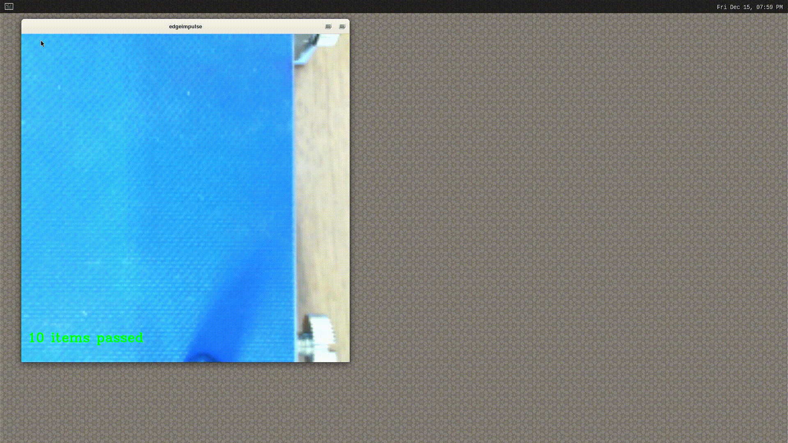

## Conclusion

The Avnet RZBoard with it's Renesas RZ/V2L SoC and DRP-AI Accelerator made prototpying our computer vision counting applications quick and easy, and demonstrated excellent performance with inference times in the 9ms range!  
