# Industrial Inspection Line - Brainchip Akida Neuromorphic Processor

Created By: Peter Ing

Public Project Links: 

Object Detection - [https://studio.edgeimpulse.com/studio/349843](https://studio.edgeimpulse.com/studio/349843)
Classification - [https://studio.edgeimpulse.com/studio/349858](https://studio.edgeimpulse.com/studio/349858)

GitHub Repo: [https://github.com/peteing/brainchip_edgeimpulse_inspectionsystem.git](https://github.com/peteing/brainchip_edgeimpulse_inspectionsystem.git)

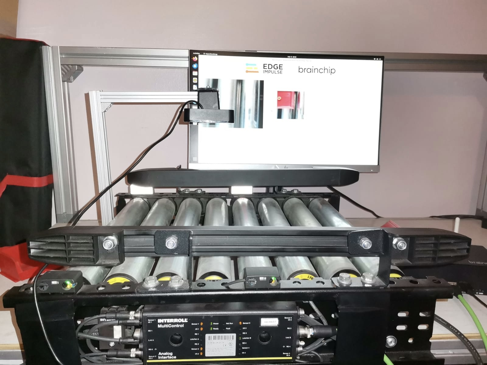

## Introduction

In the ever-evolving landscape of modern manufacturing, the efficiency and accuracy of production lines are paramount. The meticulous inspection of products at various stages ensures not only the adherence to quality standards but also the optimization of resources. In this dynamic scenario, the integration of cutting-edge technologies such as computer vision and artificial intelligence has emerged as a game-changer. 

Initially, machine vision systems relied on basic image processing techniques and rule-based algorithms. These early systems were capable of performing relatively simple tasks, such as inspecting products for basic defects or checking for the presence of specific features. These systems required cameras with high-cost Industrial PC's to perform CPU based processing that was expensive and power hungry while offering limited performance. 

Today the trend has shifted towards using Deep Learning specifically Convolutional Neural Networks on Graphics Processing Units and specialized CNN hardware accelerators. The solutions on the market are still relatively costly and power hungry. Camera and IPC's are available with integrated acceleration built-in for industrial use cases, but are very expensive.

Neuromorphic processing, inspired by the human brain, diverges from traditional computing with its parallel, adaptive features like Spiking Neural Networks, parallel processing, event-driven computation, and synaptic plasticity. This disruptive technology holds promise for energy-efficient, brain-like information processing, particularly in tasks like pattern recognition and sensory processing. This makes Neuromorphic computing ideal for use in Industrial Inspection systems where it can provide real-time insights into inspections.  The benefits include reduced costs and improved performance and being able to adapt the system at the edge to new use cases.

Brainchip Akida represents the state of the art in production-ready Neuromorphic computing ideally suited to edge use-cases. We will be demonstrating the power of the Brainchip Akida in an industrial setting in this guide as part of a standalone inspection system that can be setup along a production line.

The Akida processor is available on a PCI-E card form-factor for integration into your own hardware, or ships as either an Intel or Arm-based developer kit. For the purpose of this project our focus is on the Arm-based developer kit, which consists of a Raspberry Pi Compute Module 4 mounted on a Raspberry PI Compute Module 4 IO board, which is what we are using for this application.

Many users coming from an Industrial environment have limited experience when it comes to AI and Deep Learning and this can seem daunting. There are very expensive platforms and solutions that help simplify the process, but none can match the ease of use and rapid performance of using Edge Impulse for the AI component of your project.

## Industrial Inspection Use Case

A typical scenario in an industrial manufacturing plant is defect detection. This can be applied to a range of different product types but essentially the requirement is always to determine which products to reject, out of a set of products that are often in motion using some kind of materials handling equipment such as a conveyor.

To achieve this, classic machine vision techniques using old camera systems running CPU algorithms often included detecting a Region of Interest (ROI) and then focusing on that area, and using tools such as edge and blob detection to find anomalies.

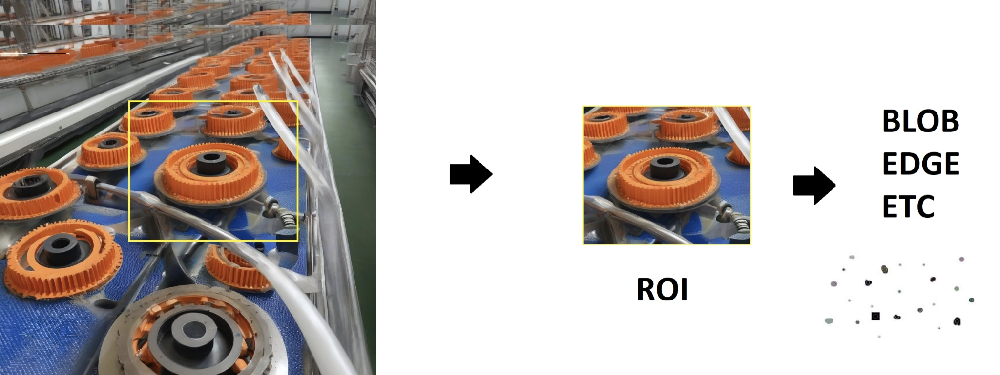

Deep learning solves this approach by making use of learning algorithms to simply teach the system what is correct and what isn't. This results in a 2 stage pipeline that first does Object Detection, then cascades the results to a classifier.

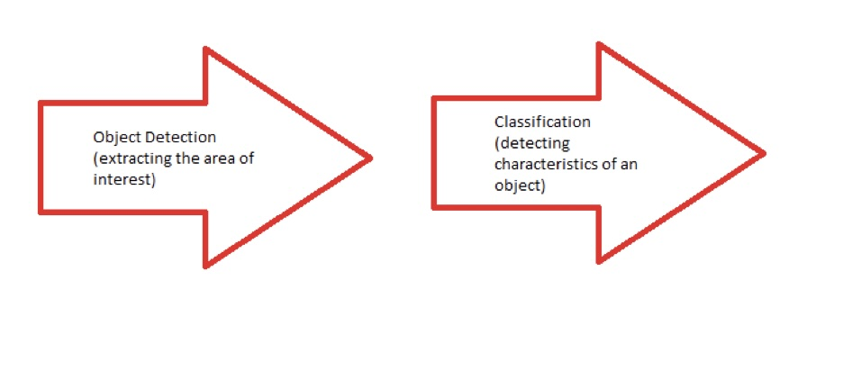

The Object Detector functions as the Region of Interest segmenter, while the classifier then determines if a product is defective or damaged, or passes the quality check. We will proceed to implement such a pipeline together with a custom GUI based app.

Akida Neuralmorphic technology is unrivaled in terms of power usage at a given performance level. Neuromorphic also provides unique features not found in other technologies such as in device edge learning made possible by the Spiking Neural Network architecture.

## Setting up the Brainchip Akida Developer Kit

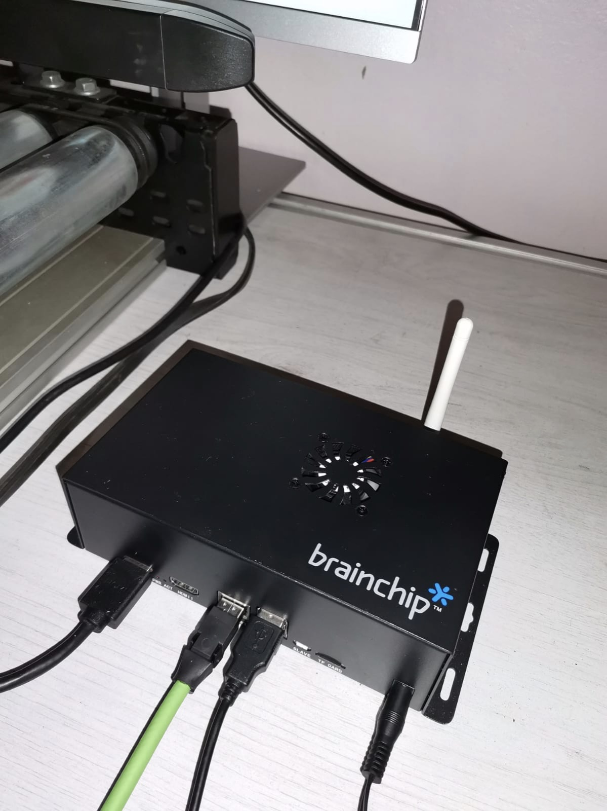

The Akida Raspberry Pi Kit ships with an SD card with a preloaded console-only version of Ubuntu and a set of web based demos. Preparing your Brainchip Raspbery Pi Kit for use as an inspection system means building up an OS image that has a Linux Desktop Window Manager  to enable to host a desktop GUI application.

### Step 1: Flash Ubuntu OS image

You need to install the Raspberry Pi Imager V1.8.5 or higher and have a spare SD Card ready. An SD card with a minimum size of 16Gb is required.

When selecting the OS, instead of selecting the Raspberry Pi OS, a desktop version of Ubuntu needs to be installed.

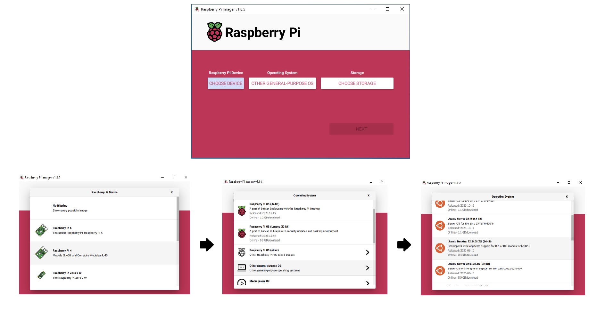

First, select the "Choose Device" button, and select the Raspberry Pi 4 option. Then select the "Choose OS" button and select "Other General Purpose OS".  Choose "Ubuntu Desktop 22.04.3 LTS (64 bit)".  A later version can be used, but for stability in production environments the LTS version is recommended. Note that at the time of reading this version may be a later version.  Proceed to select the storage and flash the SD card, which may take some time as the OS downloads.

### Step 2: Install Dependances on the Device

Once ready, the SD card needs to be inserted into the Brainchip unit which must be connected to a display via the HDMI port, and the keyboard and mouse attached via USB. Note due to the fact that the Raspberry Pi IO board only exposes 2 USB ports it is recommended to use a wireless keyboard and trackpad combo via a dongle connected to a single port. This frees up the other USB port for use with a Web Camera later.  You can also use a USB hub to increase the number of USB ports available.

When booting up the Ubuntu OS installation for the first time, you will need to follow the prompts to set the time zone and create an initial user. Once you are able to open a command prompt the following dependencies need to be installed:

 - **Python 3.8 to 3.11**: There should already be a suitable version of Python installed by default in Ubuntu 22.04.3 LTS
 - **Tensorflow CPU**: Follow the instructions here [https://www.tensorflow.org/install/pip](https://www.tensorflow.org/install/pip) to install TensorFlow but make sure to do a CPU installation
 - **Akida Execution Engine**:  This component of the MetaTF framework provides access to the Akida hardware or a software simulator if you don't have hardware present. It also provides a Keras-like API via Python for programmatic access to the Akida Hardware.
 - **Akida PCIe Driver**: Lastly the Akida PCIe driver is required to ensure that the Akida Execution Engine can directly access the Akida co-processor. 

To get started with the process first upgrade `pip` from the command line on the device (you can do this via SSH as well)

```
pip install --upgrade pip
```

Then install TensorFlow, but for CPU-only as we won't be using a GPU in this case. We will use the Akida Execution Engine with the MetaTF Keras-like API later to access the Akida Hardware

```
pip install tensorflow
```

Once installed you can verify the installation using the following command to test TensorFlow from the command-line invoked Python interpreter:

```
python3 -c "import tensorflow as tf;
print(tf.reduce_sum(tf.random.normal([1000, 1000])))"
```

Once Tensorflow is running the next step is to install the Akida Execution engine and this is done via `pip` as well, as its installs a Python package:

```
pip install akida
```

After running this command successfully the MetaTF API can be used from within Python, however since no hardware driver is installed when attempting to execute inference later on it will resort to simulated Akida in the backend. This is helpful for testing models for compatibility and not necessarily performance, and can be useful for creating a portable development environment. To make use of the actual hardware the next step is to install the Akida PCIe card and the software.

First ensure the unit is powered down and the Akida PCIe card is correctly seated inside the Raspberry Pi IO Board's PCIe slot, then power up again.  You can verify the card is correctly plugged in using the following command:

```
lspci 
```

If the card is working and detected you should see something similar to below where you can see the Brainchip Akida is detected as Co-processor.

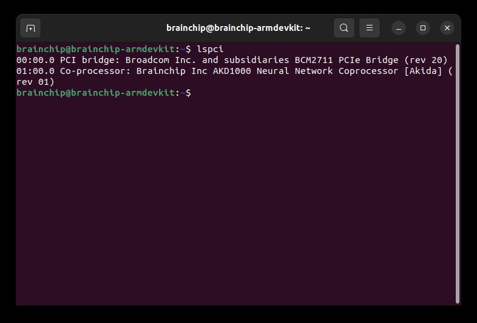

The Akida driver needs to be downloaded from the Brainchip GitHub repository from the command line, and the `build-essentials` and `linux-headers` packages need to be installed:

```
git clone https://github.com/Brainchip-Inc/akida_dw_edma
sudo apt install build-essential linux-headers-$(uname -r)
```

To install the driver and make it available on each boot and fully accessible to all users, first change directory into the repo and then run the install script as the superuser, this is achieved with running the following commands:

```
cd akida_dw_edma
sudo ./install.sh
```

After a while the installation should complete without any issues. To verify that all is in order and the Akida Execution Engine can use the hardware directly instead of the virtual software backend, the `akida` command is used as follows:

```
akida devices 
```

This will result in the below, where the hardware accessibility is verified by the PCIe/NSoC_v2/0 being shown as an available device. Note that the `akida` command is available through the installation of the akida package earlier.

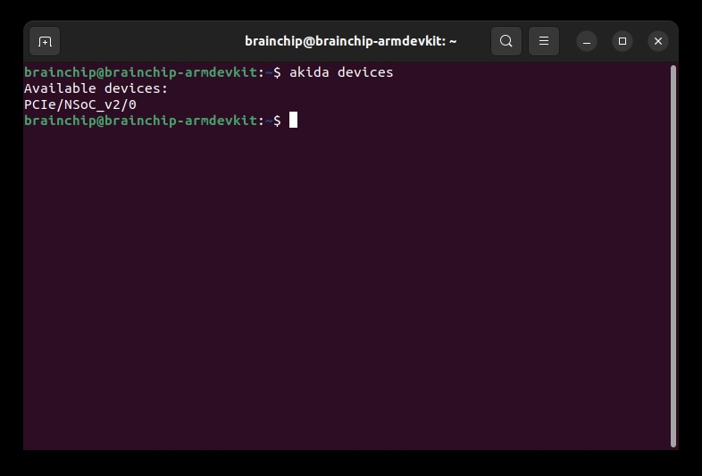

From this point on the Brainchip Kit is setup and ready for use but has no applications loaded yet. You may choose to install the examples available from Brainchip and the QuantML and CNN2SNN toolkits from Brainchip to make direct use of MetaTF. This will however require a learning curve and time to be invested in understanding the platform as well as familiarity with Keras.

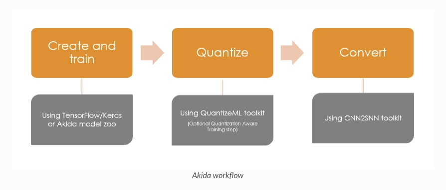

The workflow for building a model with Akida contains some additional steps including needing to use QuantizeML and CNN2SNN which are part of MetaTF. Briefly, QuantizeML converts the model weights to fixed point integer format before the model is converted from a CNN to an Akida-compatible SNN. These steps need to be performed as post processing after model development using TensorFlow. The end result is a serialized model that is stored in a `.fbz` format that can be loaded or mapped directly onto the Akida NSoC at runtime.

## Edge Impulse and Brainchip

For an industrial automation engineer, or anyone not familiar with deep learning, this can seem daunting and slows down the efficacy of deploying AI-based Inspection Systems. The fastest path to market has been expensive proprietary camera hardware and software solutions that abstract the process with complicated licensing and limited access to the underlying platform.  On the hardware side Brainchip Akida acts as a co-processor, freeing you up to use your existing x86 or Arm-based platform to allow you to have full freedom on your final application.

From the software perspective, Edge Impulse eliminates that complexity and cost and provides a solution that offers a flexible way to collect data using the Brainchip hardware, any other device with a camera, even your mobile phone. 

The process of building the ML model is intuitive and straight-forward, and thanks to Edge Impulse's built in support for Akida AKD1000, Edge Impulse generates a model that is optimized and performs the Akida workflow for you automatically in the background, with the result being either a `.fbz` model or Edge Impulse's extremely useful `.eim` executable model format.

For the purposes of an inspection system, two distinct models need to be built:

**Object Detection (FOMO)** - Edge Impulse's _Faster Objects More Objects_ model architecture has been ported to work on the AKD1000. This model works well at fixed depths, which makes it ideal for inspection applications.

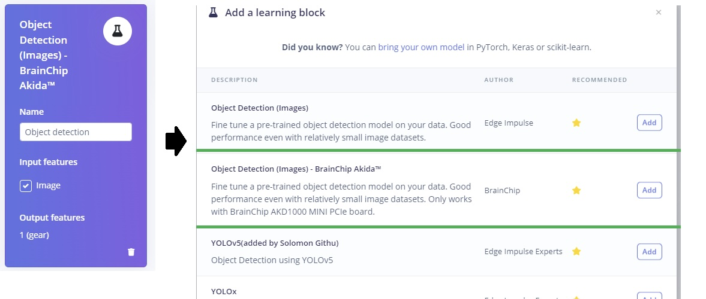

**Transfer Learning** - The second model will be used for classification.  The Akida Transfer Learning block makes use of pretrained models from the Akida Model Zoo, where your dataset is used to fine-tune one of the existing models for your requirements, saving you time.

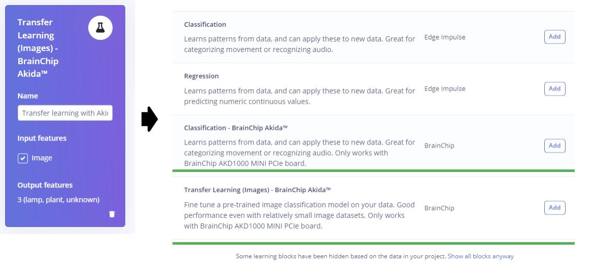

### Auto Labeling Data - Object Detection

Users with an Enterprise Account can make use of the "Auto Labeler" feature, which saves significant time when labeling object detection data sets:

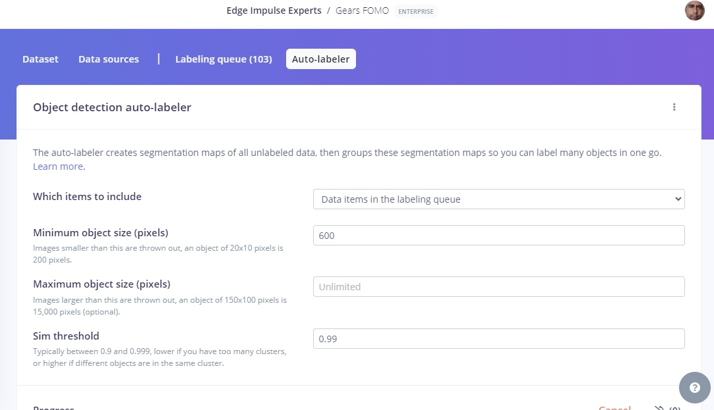

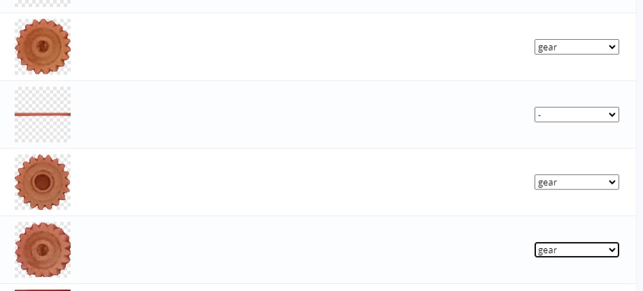

The auto labeller uses an instance segmentation model to automatically find differing objects and extract them for you, and then once you choose a label a bounding box is automatically applied as seen in the following example.

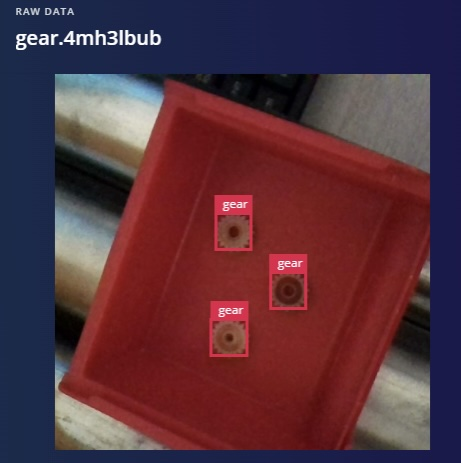

The rest of the process used to train a model is exactly the same as per the standard Edge Impulse workflows. Edge Impulse's Deployment menu allows models to be deployed in a variety of scenarios.

For the purposes of using the Inspection App presented in the next section, both the "FOMO" and "Transfer Learning" models need to be exported from the Deployment as a Brainchip MetaTF Model.

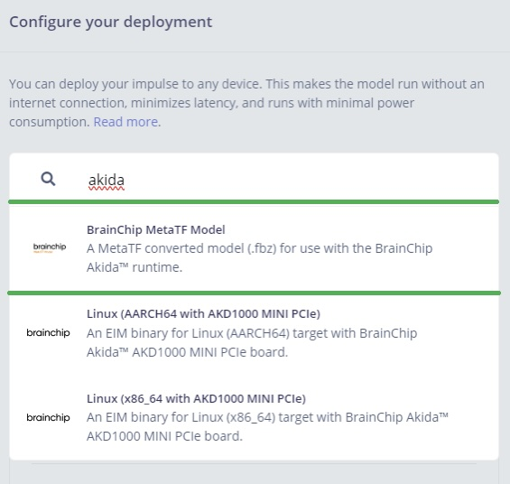

A quick way to do this is to simply search for Akida, and then select this model type and click "Build".

## Inspection System 

To create an inspection system, a local GUI client based on Qt is used, written in Python. Thanks to the native acceleration provided by Akida, using Python does not affect performance as all ML inference takes place in hardware in the neuromorphic SoC.

Dependencies need to be installed for the app, including OpenCV and PyQt5 which are installed with the following commands:

```
sudo apt-get install python3-opencv
pip install PyQt5
```

Once installed, this repo needs to be cloned, which downloads the application:

```
git clone  https://github.com/peteing/brainchip_edgeimpulse_inspectionsystem.git
```

To run the application from the command line using python, simply run:

```
python3 InspectionGUI.py
```

When the application launches you are presented with the following UI:

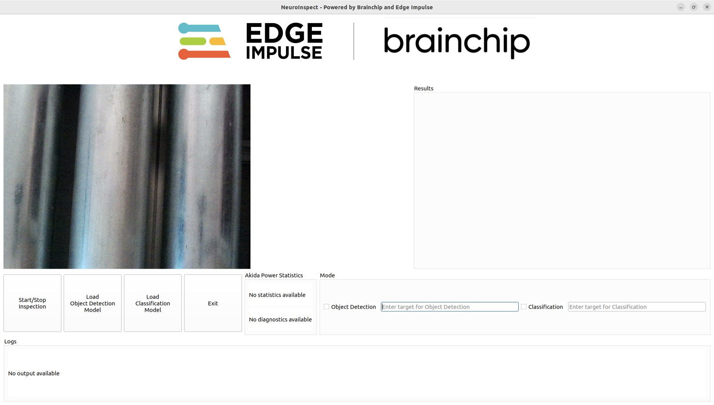

The UI Layout consists of several areas, specifically a live view that shows the live feed from the camera and buttons that control the starting and stopping of the live inspection and model loading.

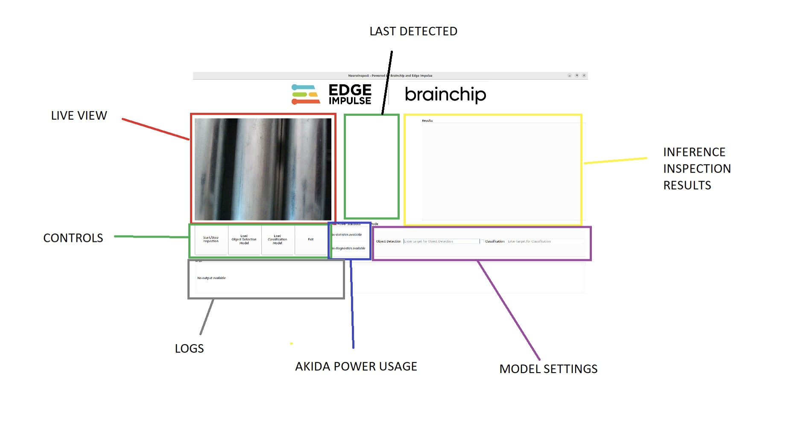

The application supports two models, an Object Detection Model which needs to be an Edge Impulse FOMO model as described earlier, and a Classification model which needs to be the Transfer Learning model also described earlier.  The Load Object Detection Model and Load Classification Model buttons allow you to browse the file system to select the respective `.fbz` files deployed from Edge Impulse Studio.

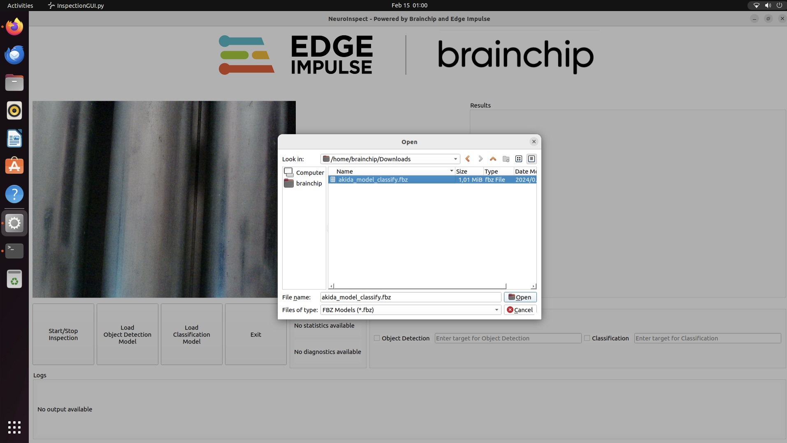

To understand how Akida works with models is helpful in knowing what is happening behind the scenes. A model is loaded from a `.fbz` file by creating an instance of the Model class and passing the file name as a parameter.

The Akida ADK1000 uses a process called mapping to load models into the NSoC. This is done by calling the "map member" function of the model class and specifying the device, which is essentially using the returned device shown earlier. What is useful is the ability to map models on the fly, and this is what is being done in the above application. 

## Application Functionality

When the "Start Inspection" mode is selected, first the object detection model is loaded to detect and localize the part on the conveyor.  Next, the classifier model is loaded and run on the result of the localized area. The object detector and classifier run in a pipeline, which is a common machine learning design pattern.

The app is shown running live below:

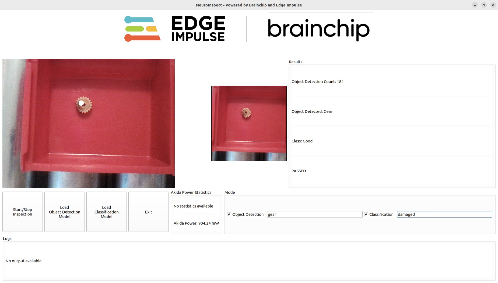

Note that the "Mode" buttons are used to turn on the model type and provide the class that will be used to fail the inspection. In the above example we are inspecting plastic gears, and the FOMO model has been trained to detect gears and extract them out of the image. The classifier runs immediately afterwards and classifies the gear as "good" or "damaged". If the classifier outputs "damaged", then the inspection fails.

A typical use-case in a manufacturing facility is to install such inspection systems along a conveyor line, whereby products pass the camera. The output of the ML model can be further utilized to make decisions around handling of the product, sorting via additional conveyors, or passed to a human for further inspection.

Finally, some stats are shown, giving you an indication of the number of objects detected thus far, as well as the power utilization of the AKD1000. 

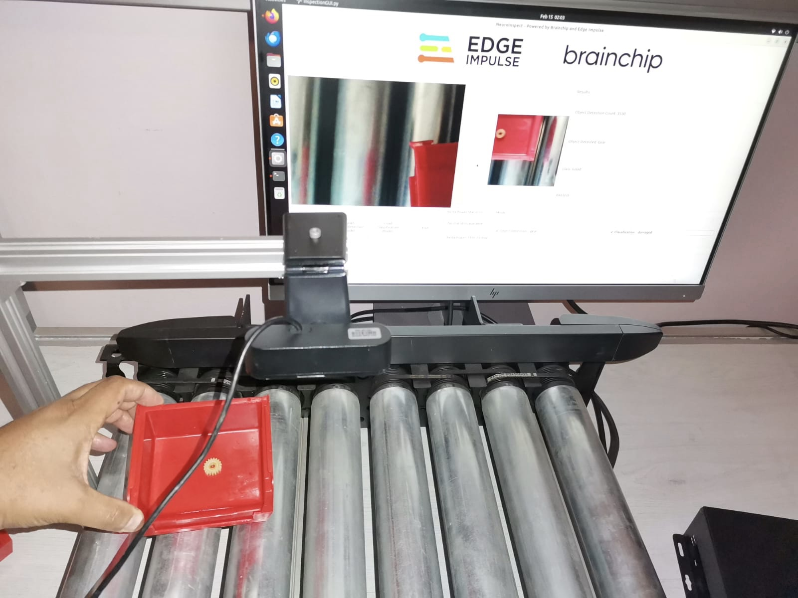

The Edge Impulse projects used are available below, which you can clone and use with your own datasets.

Object Detection - [https://studio.edgeimpulse.com/studio/349843](https://studio.edgeimpulse.com/studio/349843)
Classification - [https://studio.edgeimpulse.com/studio/349858](https://studio.edgeimpulse.com/studio/349858)

The final piece needed is the Python application, which as mentioned above can be cloned from [https://github.com/peteing/brainchip_edgeimpulse_inspectionsystem.git](https://github.com/peteing/brainchip_edgeimpulse_inspectionsystem.git)

