# Multi-camera Video Stream Inference - Brainchip Akida Neuromorphic Processor

Created By: Naveen Kumar

Public Project Link: [https://studio.edgeimpulse.com/public/298672/latest](https://studio.edgeimpulse.com/public/298672/latest)

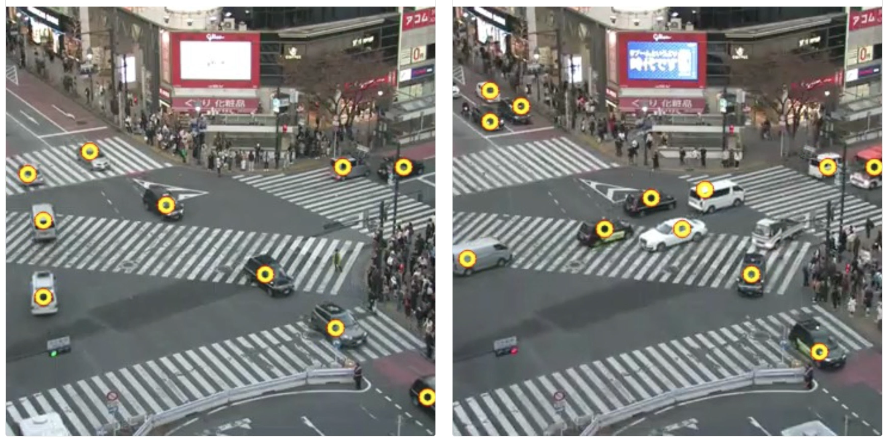

Real-time inferencing for multi-camera video streaming for road crossings is a challenging task that involves processing and analyzing multiple video sources simultaneously, such as from different cameras or sensors, to provide useful information and insights for traffic management, safety, and planning. Some of the possible goals and applications of this task could be:

- To recognize and monitor traffic events, such as congestion, accidents, violations, or anomalies, and alert the authorities or the public in real time.
- To measure and optimize traffic flow, density, and patterns, and provide guidance or recommendations for traffic control, routing, or scheduling.

## Hardware Selection

In this project, we aim to build a pipeline that is both flexible and scalable for streaming and inference of multi-camera videos. We will utilize BrainChip’s [Akida Development Kit.](https://shop.brainchipinc.com/products/akida-enablement-platform-raspberry-pi) to optimize and accelerate the Edge Impulse FOMO model near the data sources to decrease the bandwidth and latency requirements for video streaming and analytics. The BrainChip's neuromorphic processor IP uses event-based technology for increased energy efficiency. It allows incremental learning and high-speed inference for various applications, including convolutional neural networks, with exceptional performance and low power consumption. The kit includes a PCIe board with an onboard AKD1000 Akida processor, a Raspberry Pi Compute Module 4 (Wi-Fi, 8 GB RAM), and a Raspberry Pi Compute Module 4 I/O (carrier) board. The kit is shown below in a disassembled state.

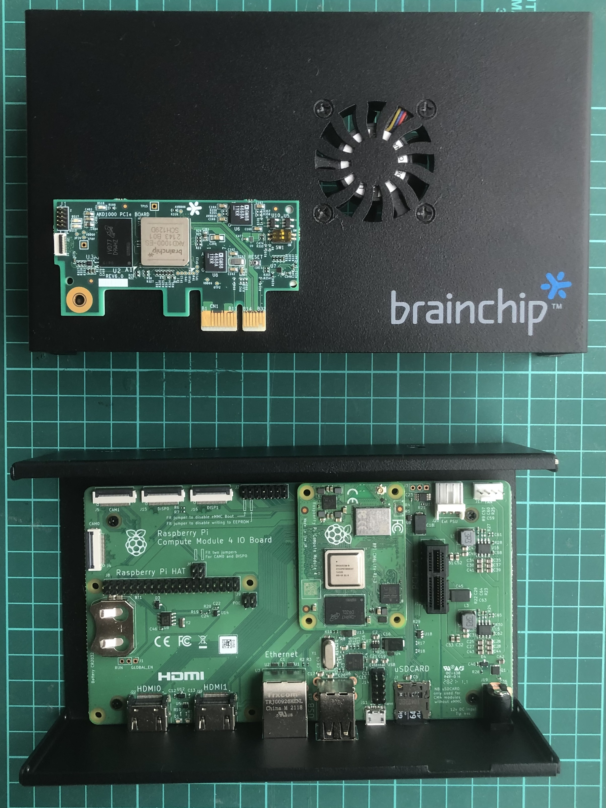

The Akida PCIe board is connected to the Raspberry Pi Compute Module 4 IO Board through the PCIe Gen 2 x1 socket available onboard.

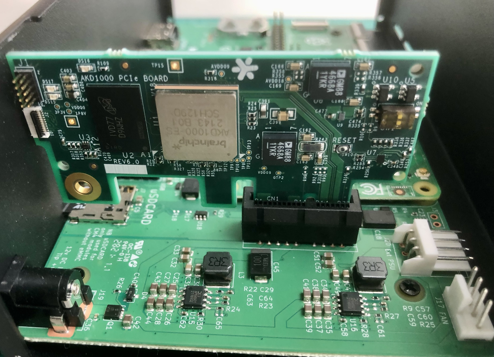

## Setting up the Development Environment

The Brainchip Akida Kit comes with Ubuntu 20.04 LTS and Akida PCIe drivers preinstalled but we wanted to try the latest Raspberry Pi OS (Bookworm). We can use the [Raspberry Pi Imager](https://www.raspberrypi.com/software/) to install the Raspberry Pi OS (64-bit) on an SD card. The Raspberry Pi Imager also allows to setup a user account, Wi-Fi credentials, and enables an SSH server which is useful since we will be using this kit as a headless edge device.

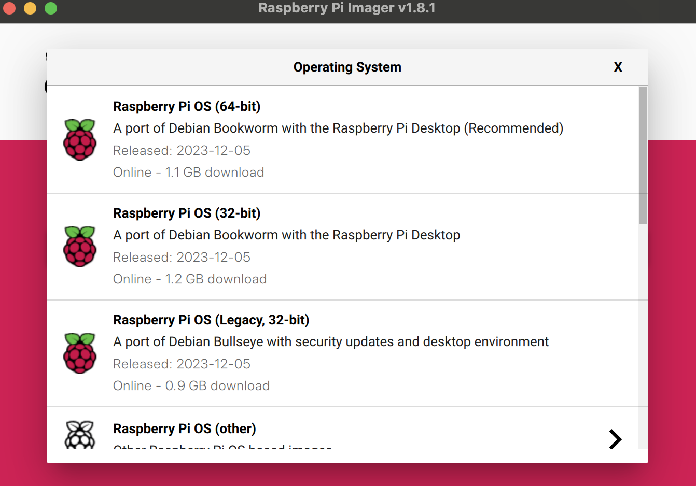

After the installation is completed, we can insert the SD card back into the kit and power it on. Once it boots up, we can log in via ssh. The first thing we need to check, is whether the Akida PCIe card is detected or not using the command below which should print some information about the device.

```
$ lspci | grep Co-processor
Co-processor: Device 1e7c: bca1 (rev 01)
```

To install the kernel driver and python bindings execute the following commands:

```
$ sudo apt install build-essential linux-headers-$(uname -r) 
$ git clone https://github.com/Brainchip-Inc/akida_dw_edma
$ cd akida_dw_edma
$ sudo ./install.sh
$ python3 -mpip install akida==2.4.0
```

Execute the command below to make sure everything is okay and we can start using the PCIe card:

```
$ akida devices
Available devices
PCIe/NSoC_v2
```

## Data Collection

Shibuya Scramble Crossing is a popular pedestrian scramble crossing in Shibuya, Tokyo. There are several IP cameras installed at the crossing, and their live feeds are available on YouTube. We will be utilizing one of the streams for data collection. 


To download the live video stream we need to install the `youtube-dl` python library.

```
$ python3 -mpip install youtube_dl
```

We should be able to download a 640x360 pixels live stream using the command below.

```
$ youtube-dl -o video11_2.mp4 -f 93 "https://www.youtube.com/watch?v=Lfl2Nj_QRXU" 
```

We downloaded a few streams at different points in time during the afternoon and evening. We used the following Python script to extract every 30th frames from the video to remove redundancy.

```
import cv2
import sys

if __name__ == '__main__':
    video_path = './video.mp4'
    videoCapture = cv2.VideoCapture(video_path)
    videoCapture.set(cv2.CAP_PROP_FRAME_WIDTH, 640)
    videoCapture.set(cv2.CAP_PROP_FRAME_HEIGHT, 360)
    
    if not videoCapture.isOpened():
        print("Cannot open video file")
        sys.exit(-1)
   
    i = 0
    j = 0

    while True:
        success, frame = videoCapture.read()
        if success:
            cv2.imshow('Display', frame)
            i = i + 1
            if i % 30 == 0:
                j += 1
                cv2.imwrite(f'./data/images/img_{j:04d}.jpg', frame)
    
            key = cv2.waitKey(1) & 0xFF
            if key == ord('q'):
                print('Exited gracefully')
                cv2.destroyAllWindows()
                break
```

We will use the Edge Impulse Studio to build and train our model. This requires us to create an account and initiate a new project at [https://studio.edgeimpulse.com.](https://studio.edgeimpulse.com./)

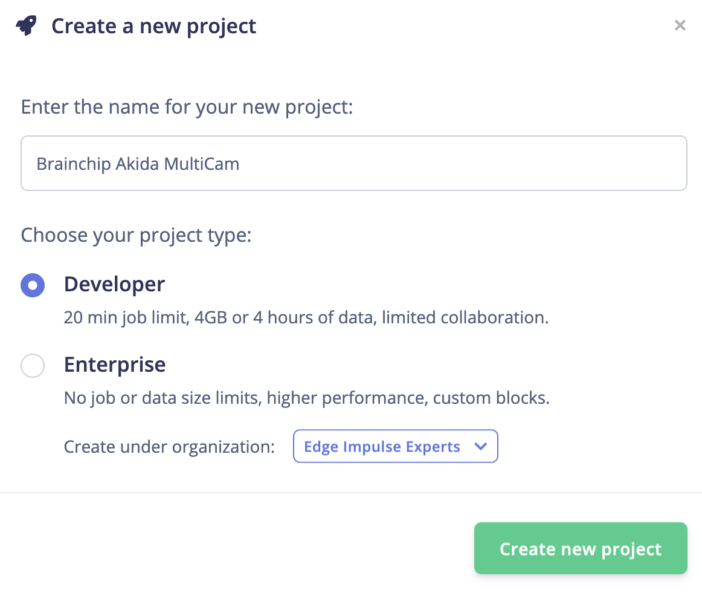

To upload the input images extracted from the video into the Edge Impulse project, we will use the Edge Impulse CLI Uploader. Follow the instructions at the link: [https://docs.edgeimpulse.com/docs/cli-installation](https://docs.edgeimpulse.com/docs/cli-installation) to install the Edge Impulse CLI on your host computer.

Execute the command below to upload the dataset.

```
$ edge-impulse-uploader --category split images/*.jpg
```

The command above will upload the demo input images to Edge Impulse Studio and split them into "Training" and "Testing" datasets. Once the upload completes, the input datasets are visible on the **Data Acquisition** page within Edge Impulse Studio.

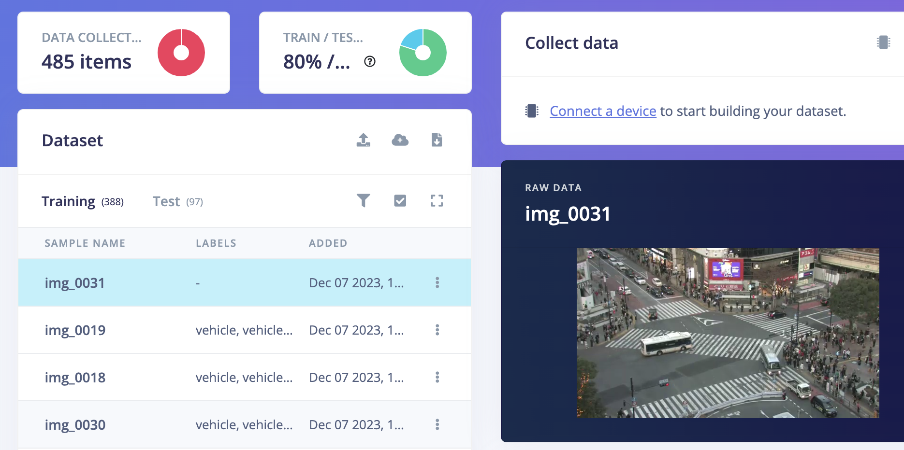

We can now assign labels to the data by using bounding boxes in the **Labeling queue** tab, as demonstrated in the GIF below. We have successfully labeled over 1800 objects, which was a tedious and time-consuming task, but it will greatly contribute to the creation of a diverse training dataset.

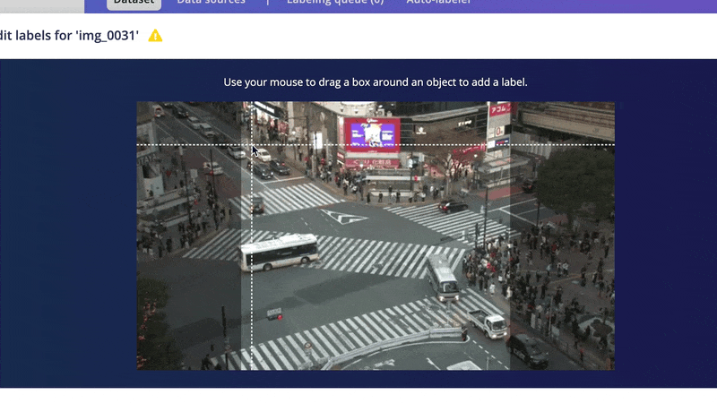

## Model Training

Go to the **Impulse Design** > **Create Impulse** page, click **Add a processing block**, and then choose **Image**. This preprocesses and normalizes image data, and optionally allows you to choose the color depth. Also, on the same page, click **Add a learning block**, and choose **Object Detection (Images) - BrainChip Akida™** which fine-tunes a pre-trained object detection model specialized for the BrainChip AKD1000 PCIe board. This specialized model permits the use of a 224x224 image size, which is the size we are currently utilizing. Now click on the **Save Impulse** button.

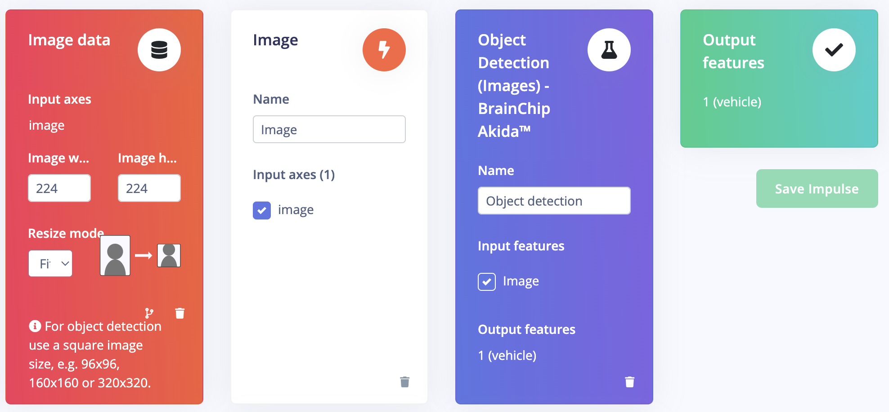

On the **Image** page, choose *RGB* color depth and click the **Save parameters** button. The page will be redirected to the **Generate Features** page.

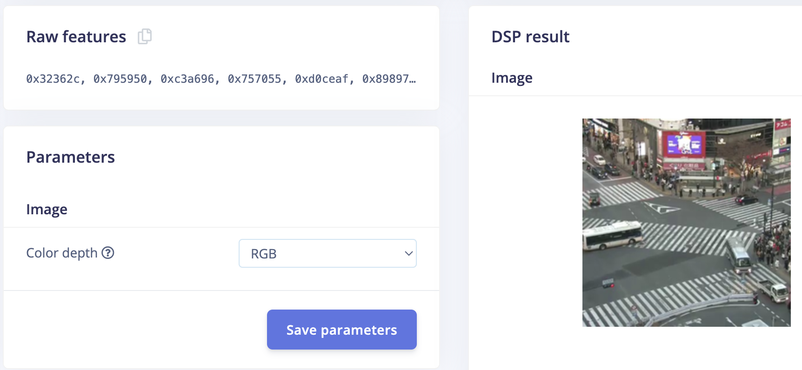

Now we can start feature generation by clicking on the **Generate features** button:

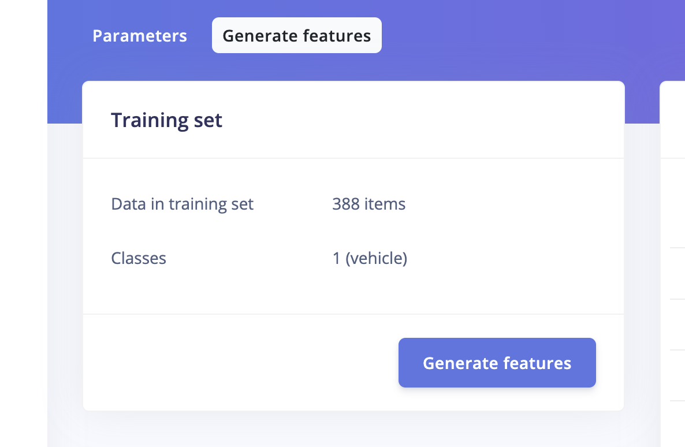

After feature generation, go to the **Object Detection** page and select the **Akida FOMO** model. Since we will be doing the inferencing on multiple camera streams we need to tweak the model to make it faster. We need to open the editor by selecting **Switch to Keras (expert) mode** to change the model parameters.

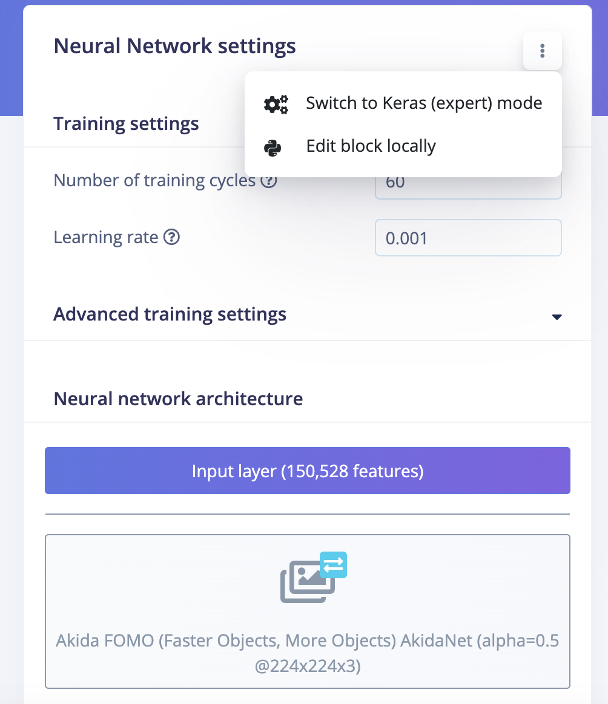 

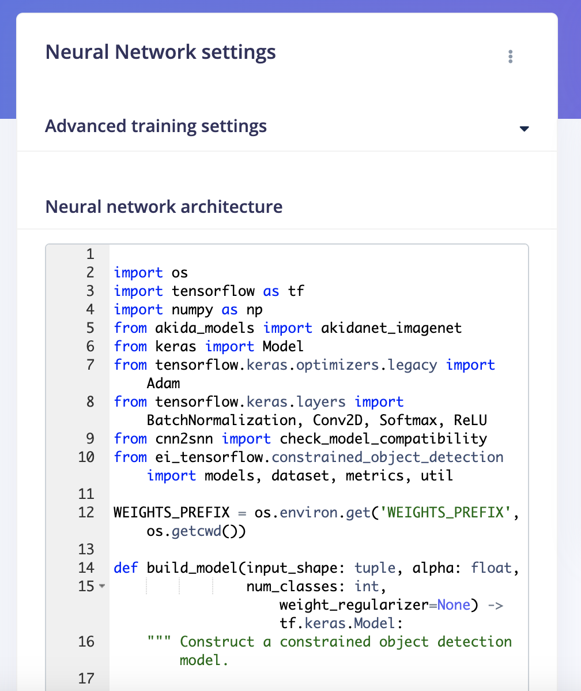

We changed the pre-trained model weights to the **akidanet_imagenet_224_alpha_25.h5** and the train function parameter **alpha** to 0.25. The alpha parameter controls the width of the network. This is known as the width multiplier in the MobileNet paper. If alpha < 1.0, proportionally decreases the number of filters in each layer.

```
...

pretrained_weights = os.path.join(WEIGHTS_PREFIX , 'transfer-learning-weights/akidanet/akidanet_imagenet_224_alpha_25.h5')

...

model, akida_model = train(num_classes=classes,
                           learning_rate=LEARNING_RATE,
                           num_epochs=EPOCHS,
                           alpha=0.25,  # changed to 0.25 from 0.50
                           object_weight=100,
                           train_dataset=train_dataset,
                           validation_dataset=validation_dataset,
                           best_model_path=BEST_MODEL_PATH,
                           input_shape=MODEL_INPUT_SHAPE,
                           callbacks=callbacks,
                           quantize_function=akida_quantize_model,
                           qat_function=akida_perform_qat,
                           batch_size=BATCH_SIZE,
                           lr_finder=False,
                           ensure_determinism=ensure_determinism)

```

Then click on the **Start training** button. It will take a few minutes to complete the training.

## Confusion Matrix

Once the training is completed we can see the confusion matrix for the quantized Akida model as shown below. 

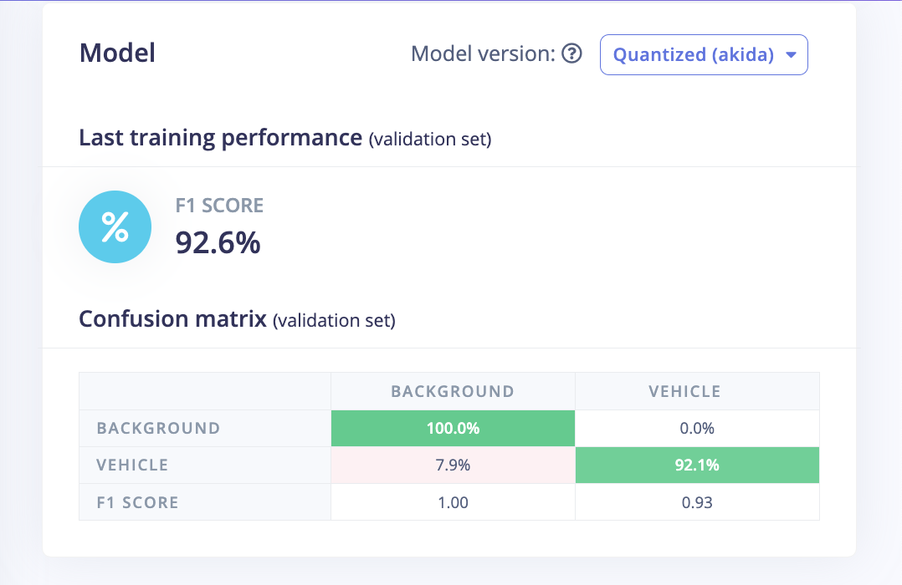

## Model Testing

On the **Model testing** page, click on the **Classify All** button which will initiate model testing with the trained model. The testing accuracy is **94.85%**.


## Deployment

In order to achieve full hardware acceleration models must be converted from their original format to run on an Akida PCIe card. This can be done by selecting the **BrainChip MetaTF Model**  from the **Deployment** page. This will generate a .zip file with models that can be used in the application for the AKD1000. The build process uses the [CNN2SNN toolkit](https://doc.brainchipinc.com/user_guide/cnn2snn.html?highlight=cnn2snn#cnn2snn-toolkit) to convert quantized models to SNN models compatible for the AKD1000. 

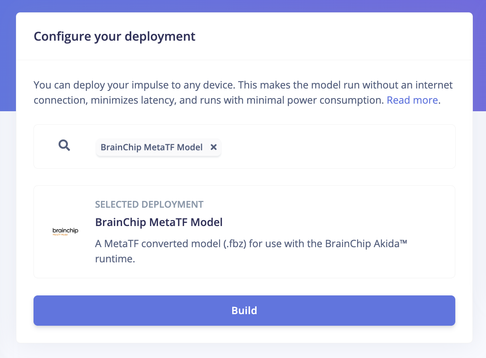

## Application

We will be using the Edge Impulse Linux C++ SDK which allows us to run machine learning model inferencing on Linux machines using C++. The SDK is open source and hosted on GitHub: [edgeimpulse/example-standalone-inferencing-linux](https://github.com/edgeimpulse/example-standalone-inferencing-linux). 

First, execute the command below to clone the repository.

```
$ git clone https://github.com/edgeimpulse/example-standalone-inferencing-linux.git
$ cd example-standalone-inferencing-linux && git submodule update --init --recursive
```

We should extract the downloaded Brainchip MetaTF model zip file into the example-standalone-inferencing-linux directory.

```
$ unzip brainchip-akida-multicam-meta-tf-v12.zip
```

We will not be using the OpenCV bundled with the repository instead we will install it from the OS distribution.

```
$ sudo apt install libopencv-dev
```

Also, we need to build and install a MPEG streamer library which is used to stream the inferencing result at web browser.

```
$ git clone https://github.com/nadjieb/cpp-mjpeg-streamer.git
$ cd cpp-mjpeg-streamer/
$ mkdir build && cd build
$ cmake ..
$ make
$ sudo make install
```

For this application, we will be using one of the examples in the source directory, **camera.cpp** and modify it for our requirements. The complete code is given below.

```
#include <iostream>
#include <map>
#include <opencv2/opencv.hpp>
#include <opencv2/videoio/videoio_c.h>
#include <nadjieb/mjpeg_streamer.hpp>
#include "edge-impulse-sdk/classifier/ei_run_classifier.h"

extern std::stringstream engine_info;
using MJPEGStreamer = nadjieb::MJPEGStreamer;
static float features[EI_CLASSIFIER_INPUT_WIDTH * EI_CLASSIFIER_INPUT_HEIGHT];

int main(int argc, char *argv[]) 
{
    if ( argc != 3 ) {
	      std::cerr << "Usage: " << argv[0] << " <video 1 file path> <video 2 file path>" <<   
	                    std::endl;
	      exit(1);
    } 

    MJPEGStreamer streamer;
    streamer.start(8080, 2); // port, workers
    std::vector<int> params = {cv::IMWRITE_JPEG_QUALITY, 90};
    std::vector<cv::VideoCapture> caps;
    cv::VideoCapture cap1(argv[1]);
    cv::VideoCapture cap2(argv[2]);
    if (! (cap1.isOpened() && cap2.isOpened()) ) {
        std::cerr << "ERROR: Could not open video capture" << std::endl;
        exit(1);
    }
    caps.push_back(cap1);
    caps.push_back(cap2);

    // video width/height should be 640x360
    float scale  = 360.0f / EI_CLASSIFIER_INPUT_HEIGHT;
    cv::Rect crop_region((640-360)/2, 0, 360, 360);
    cv::Size dsize(static_cast<int>(EI_CLASSIFIER_INPUT_WIDTH), 
                   static_cast<int>(EI_CLASSIFIER_INPUT_HEIGHT));
    std::map<int, bool> completed = { {0, false}, {1, false} };

    while (true) {
        for (int stream_id = 0; stream_id < caps.size(); ++stream_id) {
            cv::Mat frame;
            caps[stream_id] >> frame;
	          if (int(caps[stream_id].get(cv::CAP_PROP_POS_FRAMES)) % 3 == 0) { 
	              continue; 
            }

	          if (frame.empty()) {
                completed[stream_id] = true;
		            continue;
	          }

            cv::Mat cropped_frame = frame(crop_region);
            cv::Mat img;	
            cv::resize(cropped_frame, img, dsize);

            size_t feature_ix = 0;
            for (int rx = 0; rx < (int)img.rows; rx++) {
                for (int cx = 0; cx < (int)img.cols; cx++) {
                    cv::Vec3b pixel = img.at<cv::Vec3b>(rx, cx);
                    uint8_t b = pixel.val[0];
                    uint8_t g = pixel.val[1];
                    uint8_t r = pixel.val[2];
                    features[feature_ix++] = (r << 16) + (g << 8) + b;
                }
            }
            
            ei_impulse_result_t result;
            signal_t signal;
            numpy::signal_from_buffer(features, EI_CLASSIFIER_INPUT_WIDTH *  
                                       EI_CLASSIFIER_INPUT_HEIGHT, &signal);
            
            EI_IMPULSE_ERROR res = run_classifier(&signal, &result, false);
            if (res != 0) {
                printf("ERR: Failed to run classifier (%d)\n", res);
                exit(1);
            }
            
            printf("Classification result (%d ms.):\n", result.timing.dsp + 
                                              result.timing.classification);
            for (size_t ix = 0; ix < result.bounding_boxes_count; ix++) {
                auto bb = result.bounding_boxes[ix];
                if (bb.value < 0.8f) {
                    continue;
                }
       
                cv::Point center(int(bb.x * scale) + int((bb.width/2) * scale), int(bb.y * 
                                                    scale)  + int((bb.height/2) * scale));
                cv::circle(cropped_frame, center, 7, cv::Scalar(0, 0, 255), 1, cv::LINE_AA);
                cv::circle(cropped_frame, center, 5, cv::Scalar(0, 255, 255), 2, 
                           cv::LINE_AA);
            }
            std::vector<uchar> buf;
            cv::imencode(".jpg", cropped_frame, buf, params);
	          std::string endpoint = "/stream_" + std::to_string(stream_id);
            streamer.publish(endpoint, std::string(buf.begin(), buf.end()));
            std::cout << "Engine Info: "  << engine_info.str()  << std::endl;
	    }
      if (std::all_of(completed.begin(), completed.end(), [](auto m){ return m.second; })) {
	        break;
      }
    }
    streamer.stop();
    for (auto cap : caps) {
	      cap.release();
    }
    return 0;
}
```

We made the following changes in the Makefile to build it with OpenCV library.

```
CXXFLAGS += -std=c++17 
CFLAGS += -I/usr/include/opencv4
```

Finally, execute the command below which should build an executable **camera** in the build/ directory.

```
$ USE_AKIDA=1 APP_CAMERA=1 TARGET_LINUX_AARCH64=1 make -j3
```

## Inferencing 

To run the application we should provide two recorded video files downloaded from the YouTube stream to the application executable as follows.

```
$ ./build/camera video_1.mp4 video2.mp4 
```

To view the inferencing results on a web page, we will save the following code in an index.html file.

```
<!doctype html>
<html lang="en">
<head>
    <!-- Required meta tags -->
    <meta charset="utf-8">
    <meta name="viewport" content="width=device-width, initial-scale=1, shrink-to-fit=no">

    <!-- Bootstrap CSS -->
    <link href="https://cdn.jsdelivr.net/npm/bootstrap@5.1.3/dist/css/bootstrap.min.css" rel="stylesheet" integrity="sha384-1BmE4kWBq78iYhFldvKuhfTAU6auU8tT94WrHftjDbrCEXSU1oBoqyl2QvZ6jIW3" crossorigin="anonymous">

    <title>Edge Impulse Model Inferencing with Brainchip</title>
</head>
<body>

  <div class="b-example-divider"></div>

  <div class="container">
	<div class="h1 text-center">
	     
	    <span class="align-bottom">FOMO /</span>
	    
	    <span class="align-bottom">Akida</span>
	</div>

    <div class="row">
      <div class="col-sm-6"> 
	<div class="card">
          <div class="card-body">
             <p class="card-text h3 text-center">Video Stream 1</p>
          </div>
          
        </div>
      </div>

      <div class="col-sm-6"> 
	<div class="card">
          <div class="card-body">
             <p class="card-text h3 text-center">Video Stream 2</p>
          </div>
          
        </div>
      </div>
    </div>

  </div>

  <script type="text/javascript">
      const img_0 = document.getElementById('stream_0');
      const img_1 = document.getElementById('stream_1');
      const url = (window.location.protocol + '//' + window.location.hostname + ':8080/');

      img_0.setAttribute('src', url + 'stream_0');
      img_1.setAttribute('src', url + 'stream_1');
  </script>

</body>
</html>
```

We can spin up a webserver as follows and open a web browser at the port showing below.

```
$ python3 -m http.server
Serving HTTP on :: port 8000 (http://[::]:8000/) ...
```

## Demo



We can see the real time stats for the inferencing rate and power consumption at the console.

```
Inferences per second: 73
Classification result (13 ms.):
Engine Info: Power Consumption: 20.98 mW
Inferences per second: 74
Classification result (14 ms.):
Engine Info: Power Consumption: 20.94 mW
Inferences per second: 69
Classification result (13 ms.):
Engine Info: Power Consumption: 20.94 mW
```

## Conclusion

In this project, we have evaluated the Brainchip AKD1000 Akida processor and demonstrated its effectiveness and efficiency in terms of accuracy, latency, bandwidth, and power consumption. We also conclude that Edge Impulse FOMO model is highly suitable for contrained and low-power edge devices to achieve fast inferencing without loosing too much accuracy. The public version of the Edge Impulse Studio project can be found here: [https://studio.edgeimpulse.com/public/298672/latest](https://studio.edgeimpulse.com/public/298672/latest).


