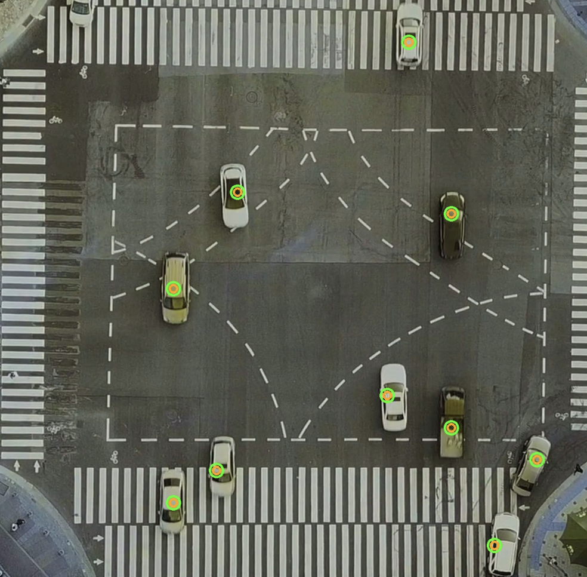
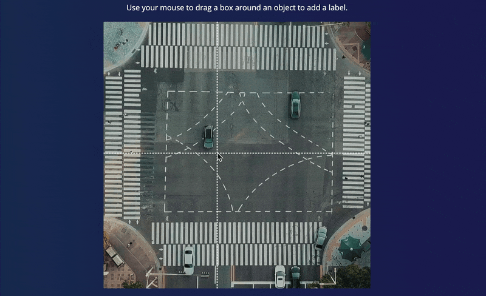
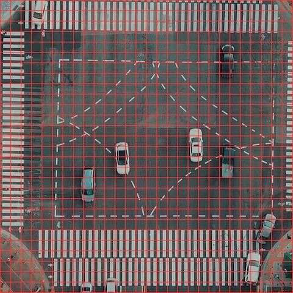

# Traffic Monitoring using the Brainchip Akida Neuromorphic Processor

Created By: Naveen Kumar

Public Project Link: [https://studio.edgeimpulse.com/public/222419/latest](https://studio.edgeimpulse.com/public/222419/latest)

## Overview

A highly efficient computer-vision system that can detect moving vehicles with great accuracy and relative motion, all while consuming minimal power.



By capturing moving vehicle images, aerial cameras can provide information about traffic conditions, which is beneficial for governments and planners to manage traffic and enhance urban mobility. Detecting moving vehicles with low-powered devices is still a challenging task. We are going to tackle this problem using a Brainchip Akida neural network accelerator.

## Hardware Selection

In this project, we'll utilize BrainChip’s [Akida Development Kit](https://shop.brainchipinc.com/products/akida-enablement-platform-raspberry-pi). BrainChip's neuromorphic processor IP uses event-based technology for increased energy efficiency. It allows incremental learning and high-speed inference for various applications, including convolutional neural networks, with exceptional performance and low power consumption.


The kit consists of an Akida PCie board, a Raspberry Pi Compute Module 4 with Wi-Fi and 8 GB RAM, and a Raspberry Pi Compute Module 4 I/O Board. The disassembled kit is shown below.


The Akida PCIe board can be connected to the Raspberry Pi Compute Module 4 IO Board through the PCIe Gen 2 x1 socket available onboard.


## Setting up the Development Environment

After powering on the Akida development kit, we need to log in using an SSH connection. The kit comes with Ubuntu 20.04 LTS and Akida PCIe drivers preinstalled. Furthermore, the Raspberry Pi Compute Module 4 Wi-Fi is preconfigured in Access Point (AP) mode.

Completing the setup requires the installation of a few Python packages, which requires an internet connection. This internet connection to the Raspberry Pi 4 can be established through wired LAN. In my situation, I used internet sharing on my Macbook with a USB-C to LAN adapter to connect the Raspberry Pi 4 to my Macbook.

To log in and install packages execute the following commands. The password is _brainchip_ for the user _ubuntu_.

```
$ ssh ubuntu@<ip-address>
$ pip3 install akida
$ pip3 install opencv-python
$ pip3 install scipy
$ pip3 install Flask
```

## Data Collection

Capturing video of moving traffic using a drone is not permitted in my area so I used a license-free video from pexels.com (credit: Taryn Elliot). For our demo input images, we extracted every 5th frame from the pexels.com video using the Python script below.

```
python
import cv2
import sys

if __name__ == '__main__':
    video_path = './traffic-3840x2160-24fps.mp4'
    videoCapture = cv2.VideoCapture(video_path)
    if not videoCapture.isOpened():
        logging.error("Cannot open video file")
        sys.exit(-1)
    i = 0
    j = 0
    while True:
        ret, frame = videoCapture.read()
        if ret:
            img = frame[440:440+1280, 1280:1280+1280]
            cv2.imshow('Frame', img)
            i = i + 1
            if i % 5 == 0:
                j += 1
                cv2.imwrite(f'./data/images/img_{j:04d}.jpg', img)

            key = cv2.waitKey(1) & 0xFF
            if key == ord('q'):
                print('Exited gracefully')
                cv2.destroyAllWindows()
                break
```

We will use Edge Impulse Studio to build and train our demo model. This requires us to create an account and initiate a new project at https://studio.edgeimpulse.com.


To upload the demo input images extracted from the pexels.com video into the demo Edge Impulse project, we will use the Edge Impulse CLI Uploader. Follow the instructions at the link: https://docs.edgeimpulse.com/docs/cli-installation to install the Edge Impulse CLI on your host computer..

Execute the command below to upload the dataset.

```
$ edge-impulse-uploader --category split images/*.jpg
```

The command above will upload the demo input images to Edge Impulse Studio and split them into "Training" and "Testing" datasets. Once the upload completes, the demo input datasets are visible on the Data Acquisition page within Edge Impulse Studio..


Now we can label the data with bounding boxes in the **Labeling queue** tab as shown in the GIF below.



## Model training

Go to the **Impulse Design** > **Create Impulse** page, click **Add a processing block**, and then choose **Image**. This preprocesses and normalizes image data, and optionally allows you to choose the color depth. Also, on the same page, click **Add a learning block**, and choose **Object Detection (Images) - BrainChip Akida™** which fine-tunes a pre-trained object detection model specialized for the BrainChip AKD1000 PCIe board. This specialized model permits the use of a 224x224 image size, which is the size we are currently utilizing. Now click on the **Save Impulse** button.


On the **Image** page, choose _RGB_ as color depth and click on the **Save parameters** button. The page will be redirected to the **Generate Features** page.


Now we can start feature generation by clicking on the **Generate features** button:


After feature generation, go to the **Object Detection** page and click on **Choose a different model** and select **Akida FOMO**. Then click on the **Start training** button. It will take a few minutes to complete the training.


The FOMO model uses an architecture similar to a standard image classification model which splits the input image into a grid and runs the equivalent of image classification across all cells in the grid independently in parallel. By default the grid size is 8x8 pixels, which means for a 224x224 image, the output will be 28x28 as shown in the image below.



For localization, it cuts off the last layers of the classification model and replaces this layer with a per-region class probability map, and subsequently applies a custom loss function that forces the network to fully preserve the locality in the final layer. This essentially gives us a heat map of vehicle locations. FOMO works on the constraining assumption that all of the bounding boxes are square, have a fixed size, and the objects are spread over the output grid. In the aerial view images, vehicles look similar in size hence FOMO works quite well.

## Confusion Matrix

Once the training is completed we can see the confusion matrices as shown below. By using the post-training quantization, the Convolutional Neural Networks (CNN) are converted to a low-latency and low-power Spiking Neural Network (SNN) for use with the Akida runtime. We can see in the below image, the F1 score of **94%** of the Quantized (Akida) model is better than that of the Quantized (int8) model.


## Model Testing

On the **Model testing** page, click on the **Classify All** button which will initiate model testing with the trained model. The testing accuracy is **100%**.


## Deployment

We will be using Akida Python SDK to run inferencing, thus we will need to download the Meta TF model (underlined in red color in the image below) from the Edge Impulse Studio's **Dashboard**. After downloading, copy the _ei-object-detection-metatf-model.fbz_ model file to the Akida development kit using command below.

```
$ scp ei-object-detection-metatf-model.fbz ubuntu@<ip-address>:/home/ubuntu
```


## Application Development

The application loads the MetaTF model (\*fbz) and maps it to the Akida neural processor. The inferencing is done on the images from a video file. We have converted several Edge Impulse C++ SDK functions to Python to preprocess FOMO input. Below is the main code for inferencing.

```python
import akida
import cv2
import math
import time
import signal
import threading
import numpy as np
from queue import Queue
from scipy.special import softmax
from flask import Flask, render_template, Response

app = Flask(__name__, static_folder='templates/assets')

EI_CLASSIFIER_INPUT_WIDTH  = 224
EI_CLASSIFIER_INPUT_HEIGHT = 224
EI_CLASSIFIER_LABEL_COUNT = 1
EI_CLASSIFIER_OBJECT_DETECTION_THRESHOLD = 0.95
categories = ['Vehicle']
inference_speed = 0
power_consumption = 0

def ei_cube_check_overlap(c, x, y, width, height, confidence):
    is_overlapping = not ((c['x'] + c['width'] < x) or (c['y'] + c['height'] < y) or (c['x'] > x + width) or (c['y'] > y + height))

    if not is_overlapping:
         return False
    if x < c['x']:
        c['x'] = x
        c['width'] += c['x'] - x
    if y < c['y']:
        c['y'] = y;
        c['height'] += c['y'] - y;
    if (x + width) > (c['x'] + c['width']):
        c['width'] += (x + width) - (c['x'] + c['width'])
    if (y + height) > (c['y'] + c['height']):
        c['height'] += (y + height) - (c['y'] + c['height'])
    if confidence > c['confidence']:
        c['confidence'] = confidence

    return True

def ei_handle_cube(cubes, x, y, vf, label, detection_threshold):
    if vf < detection_threshold:
        return
    has_overlapping = False
    width = 1
    height = 1
    for c in cubes:
        # not cube for same class? continue
        if c['label'] != label:
             continue
        if ei_cube_check_overlap(c, x, y, width, height, vf):
            has_overlapping = True
            break

    if not has_overlapping:
        cube = {}
        cube['x'] = x
        cube['y'] = y
        cube['width'] = 1
        cube['height'] = 1
        cube['confidence'] = vf
        cube['label'] = label
        cubes.append(cube)

def fill_result_struct_from_cubes(cubes, out_width_factor):
    result = {}
    bbs = [];
    results = [];
    added_boxes_count = 0;

    for sc in cubes:
        has_overlapping = False;
        for c in bbs:
            # not cube for same class? continue
            if c['label'] != sc['label']:
                continue
            if ei_cube_check_overlap(c, sc['x'], sc['y'], sc['width'], sc['height'], sc['confidence']):
                has_overlapping = True
                break

        if has_overlapping:
            continue

        bbs.append(sc)
        results.append({
            'label'  : sc['label'],
            'x'      : int(sc['x'] * out_width_factor),
            'y'      : int(sc['y'] * out_width_factor),
            'width'  : int(sc['width'] * out_width_factor),
            'height' : int(sc['height'] * out_width_factor),
            'value'  : sc['confidence']
        })
        added_boxes_count += 1
        
    result['bounding_boxes'] = results
    result['bounding_boxes_count'] = len(results)
    return result

def fill_result_struct_f32_fomo(data, out_width, out_height):
    cubes = []
    out_width_factor = EI_CLASSIFIER_INPUT_WIDTH / out_width;
    for y in range(out_width):
        for x in range(out_height):
            for ix in range(1, EI_CLASSIFIER_LABEL_COUNT + 1):
                vf = data[y][x][ix];
                ei_handle_cube(cubes, x, y, vf, categories[ix - 1], EI_CLASSIFIER_OBJECT_DETECTION_THRESHOLD);

    result = fill_result_struct_from_cubes(cubes, out_width_factor)
    return result

def capture(video_file, queueIn):
    cap = cv2.VideoCapture(video_file)
    fps = cap.get(cv2.CAP_PROP_FPS)
    num_frames = cap.get(cv2.CAP_PROP_FRAME_COUNT)
    resize_dim = (EI_CLASSIFIER_INPUT_WIDTH, EI_CLASSIFIER_INPUT_HEIGHT)
    if not cap.isOpened():
        print("File not opened")
        sys.exit(1)

    while True:
        ret, frame = cap.read()
        if ret:
            #cropped_img = frame[0:720, 280:280+720]
            #resized_img = cv2.resize(frame, resize_dim, interpolation = cv2.INTER_AREA)
            resized_img = cv2.resize(frame, resize_dim)
            img = cv2.cvtColor(resized_img, cv2.COLOR_BGR2RGB)
            input_data = np.expand_dims(img, axis=0)
            if not queueIn.full():
                queueIn.put((frame, input_data))
        else:
            return
     
def inferencing(model_file, queueIn, queueOut):
    akida_model = akida.Model(model_file)
    devices = akida.devices()
    print(f'Available devices: {[dev.desc for dev in devices]}')
    device = devices[0]
    device.soc.power_measurement_enabled = True
    akida_model.map(device)
    akida_model.summary()
    i_h, i_w, i_c = akida_model.input_shape
    o_h, o_w, o_c = akida_model.output_shape
    scale_x = int(i_w/o_w)
    scale_y = int(i_h/o_h)
    scale_out_x = 1280/EI_CLASSIFIER_INPUT_WIDTH
    scale_out_y = 1280/EI_CLASSIFIER_INPUT_HEIGHT

    global inference_speed
    global power_consumption

    while True:
        if queueIn.empty():
            #print("queue empty, wait a while")
            time.sleep(0.01)
            continue
        img, input_data = queueIn.get()

        start_time = time.perf_counter()
        logits = akida_model.predict(input_data)
        end_time = time.perf_counter()
        inference_speed = (end_time - start_time) * 1000

        pred = softmax(logits, axis=-1).squeeze()

        floor_power = device.soc.power_meter.floor
        power_events = device.soc.power_meter.events()
        active_power = 0
        for event in power_events:
            active_power += event.power

        power_consumption = f'{(active_power/len(power_events)) - floor_power : 0.2f}'
        #print(akida_model.statistics)

        result = fill_result_struct_f32_fomo(pred, int(EI_CLASSIFIER_INPUT_WIDTH/8), int(EI_CLASSIFIER_INPUT_HEIGHT/8))

        for bb in result['bounding_boxes']:
            img = cv2.circle(img, (int((bb['x'] + int(bb['width']/2)) * scale_out_x), int((bb['y'] + int(bb['height']/2)) * scale_out_y)), 14, (57, 255, 20), 3)
            img = cv2.circle(img, (int((bb['x'] + int(bb['width']/2)) * scale_out_x), int((bb['y'] +  int(bb['height']/2)) * scale_out_y)), 8, (255, 165, 0), 3)

        img = cv2.cvtColor(img, cv2.COLOR_RGB2BGR)

        if not queueOut.full():
            queueOut.put(img)
        
def gen_frames():
    while True:
        if queueOut.empty():
            time.sleep(0.01)
            continue
        img = queueOut.get()
        ret, buffer = cv2.imencode('.jpg', img)
        yield (b'--frame\r\n'
                b'Content-Type: image/jpeg\r\n\r\n' + buffer.tobytes() + b'\r\n')

def get_inference_speed():
    while True:
        yield f"data:{inference_speed:.2f}\n\n"
        time.sleep(0.1)

def get_power_consumption():
    while True:
        yield "data:" + str(power_consumption) + "\n\n"
        time.sleep(0.1)

@app.route('/video_feed')
def video_feed():
    #Video streaming route. Put this in the src attribute of an img tag
    return Response(gen_frames(), mimetype='multipart/x-mixed-replace; boundary=frame')

@app.route('/model_inference_speed')
def model_inference_speed():
        return Response(get_inference_speed(), mimetype= 'text/event-stream')

@app.route('/model_power_consumption')
def model_power_consumption():
        return Response(get_power_consumption(), mimetype= 'text/event-stream')

@app.route('/')
def index():
    return render_template('index.html')

if __name__ == '__main__':
    video_file = './video/aerial_1280_1280.avi'
    model_file = './model/ei-object-detection-metatf-model.fbz '

    queueIn  = Queue(maxsize = 24)
    queueOut = Queue(maxsize = 24)

    t1 = threading.Thread(target=capture, args=(video_file, queueIn))
    t1.start()
    t2 = threading.Thread(target=inferencing, args=(model_file, queueIn, queueOut))
    t2.start()
    app.run(host = '0.0.0.0', port = 8080)
    t1.join()
    t2.join()
```

## Run Inferencing

To run the application, login to the Akida development kit and execute the commands below.

```
$ git clone https://github.com/metanav/vehicle_detection_brainchip_edge_impulse.git
$ cd vehicle_detection_brainchip_edge_impulse
$ python3 main.py
```

The inferencing results can be accessed at http://:8080 using a web browser. The application also displays the model summary mapped on the Akida PCIe neural processor on the console.

```
Available devices: ['PCIe/NSoC_v2/0']
                    Model Summary                    
_____________________________________________________
Input shape    Output shape  Sequences  Layers  NPs
=====================================================
[224, 224, 3]  [28, 28, 2]   1          8       21 
_____________________________________________________

________________________________________________________________
Layer (type)             Output shape    Kernel shape      NPs

====== HW/conv_0-conv2d_1 (Hardware) - size: 261248 bytes ======

conv_0 (InputConv.)      [112, 112, 16]  (3, 3, 3, 16)     N/A
________________________________________________________________
conv_1 (Conv.)           [112, 112, 32]  (3, 3, 16, 32)    4  
________________________________________________________________
conv_2 (Conv.)           [56, 56, 64]    (3, 3, 32, 64)    6  
________________________________________________________________
conv_3 (Conv.)           [56, 56, 64]    (3, 3, 64, 64)    3  
________________________________________________________________
separable_4 (Sep.Conv.)  [28, 28, 128]   (3, 3, 64, 1)     3  
________________________________________________________________
                                         (1, 1, 64, 128)      
________________________________________________________________
separable_5 (Sep.Conv.)  [28, 28, 128]   (3, 3, 128, 1)    2  
________________________________________________________________
                                         (1, 1, 128, 128)     
________________________________________________________________
conv2d (Conv.)           [28, 28, 32]    (1, 1, 128, 32)   2  
________________________________________________________________
conv2d_1 (Conv.)         [28, 28, 2]     (1, 1, 32, 2)     1  
________________________________________________________________
```

Notice there is no Softmax layer at the end of the model. That layer has been removed during model conversion to run on the Akida processor. The Softmax operation is performed in the application code, rather than in the model..

## Demo

The video used for the demonstration runs at a framerate of 24 fps, and the inferencing takes approximately 40ms per frame, resulting in real-time inferencing.



## Conclusion

This project highlights the impressive abilities of the Akida PCIe board. Boasting low power consumption, it could be used as a highly effective device for real-time object detection in various industries for numerous use cases.
