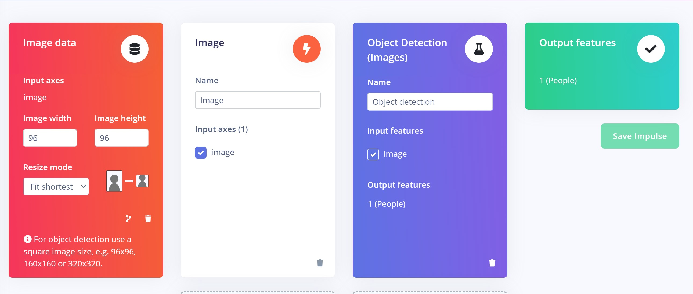
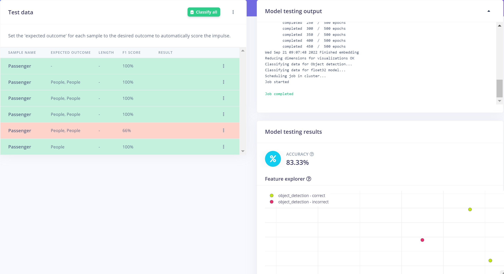
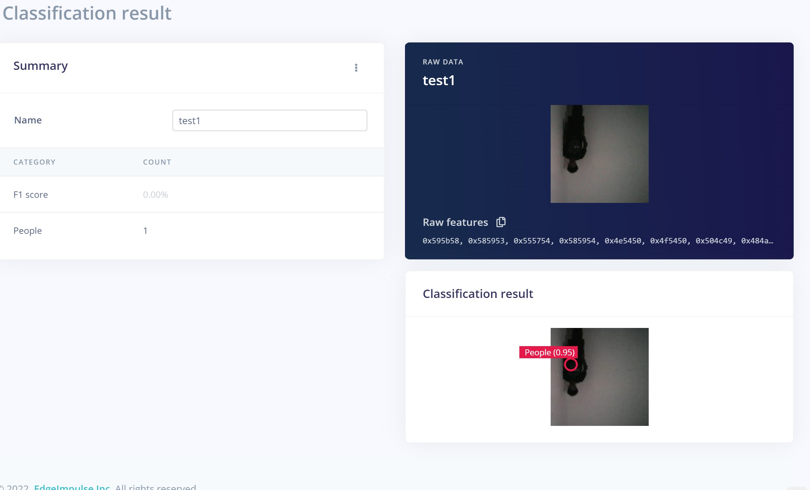
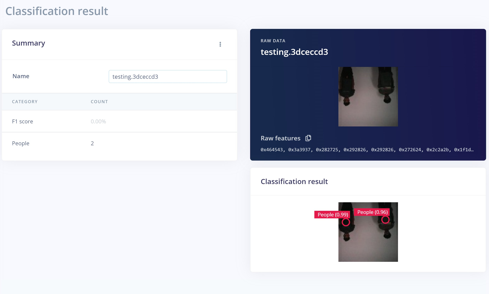
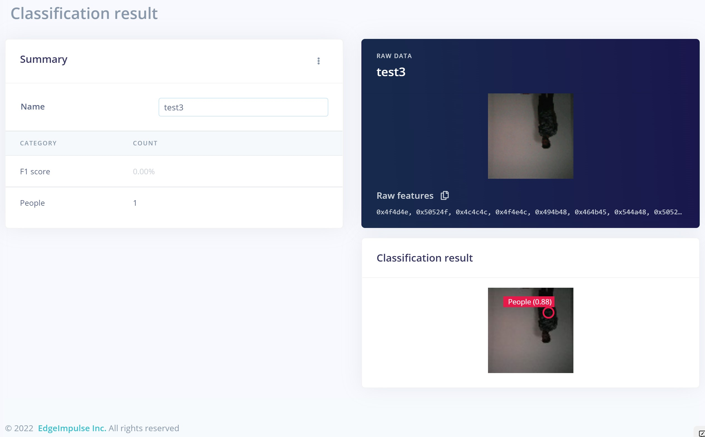
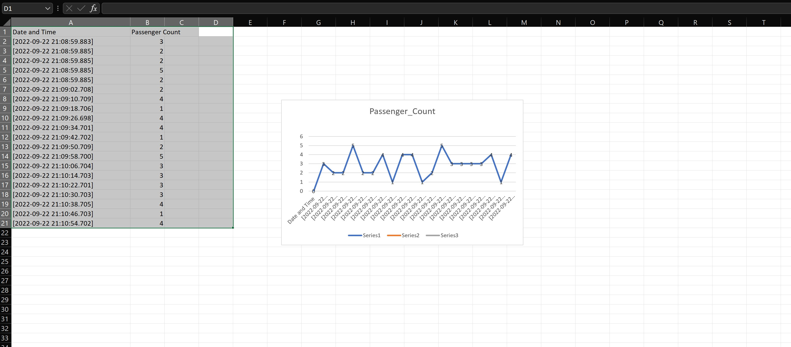

# Elevator Passenger Counting Using Computer Vision

Created By: Nekhil R.

Public Project Link: [https://studio.edgeimpulse.com/public/109997/latest](https://studio.edgeimpulse.com/public/109997/latest)

## Project Demo



## Story

As elevators become more and more indispensable in people's lives, safety has become more of a concern. Overloading is an important contributing factor to elevator accidents. Most existing elevators use weight sensors to determine the total load in an elevator, and those systems can sometimes fail. Additionally, their maintenance is expensive.

To avoid such accidents, we are going to design a proof-of-concept device which can count passengers in real-time at high speed, and can give an alert if the number of people in an elevator is above a threshold.

This device can be attached anywhere in the elevator. And compared with existing technology, its implementation cost is low, and maintenance is easy.

## How does it work?

In this prototype, we only consider two floors, the ground floor and the 2nd floor. After all the passengers enter the elevator, someone needs to press the close button. Then we count the number of passengers, and if it is above the threshold the device will sound an alarm. Thus, some people can leave the elevator, before it will begin ascending. If the number of people detected is not above the threshold, the elevator will move on.

The threshold passenger limit can be set by the user in the code, and should be set based on the size and capacity of the elevator.

In addition to the overload alert, we also provide elevator statistics. This means that the device can upload the count in elevators with the specific time stamp to a database or spreadsheet for tracking. The count will be always updated after pressing the close button in the elevator.

One of the interesting aspects of this data is that it can be easily visualised by any graphs or charts. So, it can be useful for any person who analyses elevator usage and pedestrian movement.

Here is an example of the passenger count data coming from the device, when it is viewed in Excel.

Below are the various graphs generated from the above data.

#### Clustered Column

#### Line chart

#### Pie chart

Consider the case of elevators in a shopping mall. By using this type of information, the mall owner or operator can easily add up elevators, and if the usage of an elevator is too high can make changes, such as adding capacity or redirecting pedestrians as needed.

## Nicla Vision

In this project, we are using the [Nicla Vision](https://store.arduino.cc/products/nicla-vision), a tiny AI board from Arduino. It features a 2MP color camera, and has the intelligence to process and extract useful information from anything it sees.

## Data collection and Labeling

For the data collection, we mounted the board on a tripod and connected it to a laptop using a lengthy USB cable. The below image shows the data acquisition setup.

The whole setup was on one end of the room and we actually stood on the opposite end. This allowed a good perspective for training data, teaching the Nicla to detect and count passengers.

You can follow this [tutorial](https://docs.edgeimpulse.com/docs/development-platforms/officially-supported-mcu-targets/arduino-nicla-vision) to connect Nicla vision to Edge Impulse.

We captured 73 images and split them between Testing and Training. Our images contain only one person or two people at a time, but you could easily do more. Then we labeled each image one by one, and here we have only one class named "people".

## Impulse Design

This is the machine learning pipeline for this project:

To keep the model size small, we choose an image width and height of 96x96 pixels, and the resize mode to "Fit the shortest axis". After saving the impulse we moved onto the _Image_ tab and chose "Grayscale" as the colour depth, and saved the parameters and generated features for our images.

The image below shows the generated features:

## Model Training

Here is our Neural Network training settings and architecture for generating the model:

We only changed the training cycle from **60** to **70**. Further increasing a training cycle or learning rate can overfit the data, so we stuck to this.

For the Neural Network architecture, we used **FOMO (MobileNet V2 0.35)**. The results are great, achieving a bit over 95% accuracy for the model (using quantized int version).

## Model Testing

It's time to test the model. First, we used the test data which we separated earlier and got around 84% accuracy. That is not great, but seems to be fine in this use case.

Now let's move on to the Live classification. Here we are testing 3 sample images captured from the Nicla vision and let's see how our model performs.

#### Test 1

#### Test 2

#### Test 3

In all our testing samples, the model performed very well, so we can go ahead and deploy it to the device.

## Deployment

Now we have our ML model, and it has been tested, so we need to deploy it to our Nicla Vision. We just created an Arduino library by pressing the Build button, and a Zip file will be downloaded.

Then we add that library to the Arduino IDE. Next, we modified the example sketch that is provided. You can find code and assets in this [GitHub Repository](https://github.com/Nekhil-haxh/Elevator\_Passenger\_Counting).

## Additional Hardware and Casing

In addition to the Nicla Vision, we used a buzzer and a LED to create an alarm.

But the output current of the Nicla (4.7 mA) is not enough to properly power up an LED and buzzer. So we used a 2N222A transistor to drive these devices. This required the use of an external power supply of 5V, in addition to the USB power supply for powering the Nicla Vision itself. A push button is also used, to check whether the door is closed or not.

Finally, we made a nice, tiny case for this device.

Then we inserted each component into it:

Now, our device is ready to implement.

## TeraTerm

We used TeraTerm to stream data from the Nicla Vision. The streaming data can be logged anywhere in any format. Here we proceeded with CSV format, so the file can be easily opened with Microsoft Excel.

Make sure to check the box for _Timestamp_ before logging the data.

The below image shows sample data streamed from our device, which is then opened in Excel.

We can easily generate graphical reports from this data by selecting that text. The below figure represents the line chart for the above data.

There is a wide variety of options available and they are shown below.

## Conclusion

This device can be easily integrated and installed in an elevator, making it so that the elevator will only start when the passenger count is in the permissible range.

To reduce the cost of the unit, we can also try using an ESP32-EYE or similar microcontroller unit, instead of the Nicla Vision, though the quality and capability will need to be tested similar to how the Nicla was evaluated.
