# A Federated Approach to Train and Deploy Machine Learning Models

Created By: Solomon Githu

Public Project Link: [https://studio.edgeimpulse.com/public/279823/latest](https://studio.edgeimpulse.com/public/279823/latest)

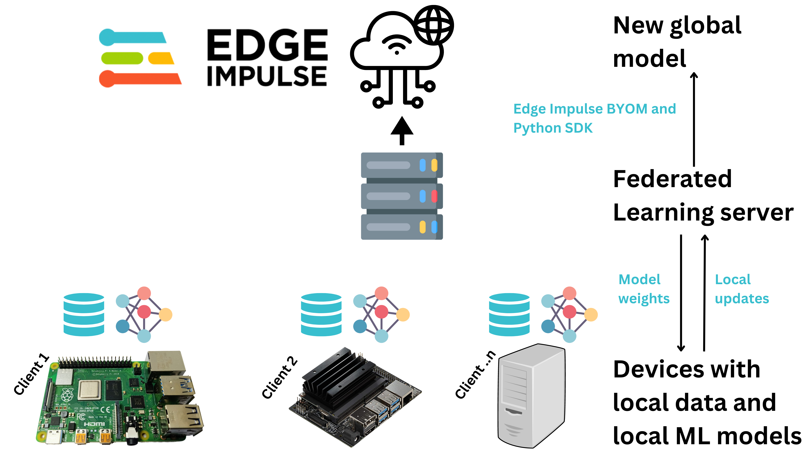

## Introduction

In Machine Learning (ML), we create a model that is trained to do a particular task like object detection, anomaly detection, or prediction. To develop a model, we normally collect data on one computer (possibly in the cloud) and then we train the model on the computer with the centralized data. However, in some situations, using a centralized machine learning model may not be effective or efficient. In some situations, the data may be sensitive, not diverse, or too large for the available internet bandwidth making it unable to be uploaded to the central computer.

Federated Learning enables us to bring the model, to the data. For example, voice recognition and face recognition by Siri and Google Assistant are Federated Learning based solutions. In these cases, we do not want to send our voices or pictures to the cloud for training the model. Federated Learning works by training models locally on the devices using the data on the device. Once a model has been trained, a device uploads the new model updates to a server that aggregates model parameters from various devices and generates a global updated model. This global updated model can then be deployed to the devices for better Machine Learning task performance, and also continuous retraining of the model.

The approach of federated learning normally follows four major processes:
- A central server initializes a global model and its parameters are transferred to clients in each iteration
- Clients update their local model parameters by locally training a model
- The server gets model parameters from clients, aggregates them, and updates the global parameters
- The above steps are repeated until local and global parameters converge

There are several Open-Source Federated Learning frameworks that we can use. However, there are some factors that should be considered before selecting a Federate Learning framework. Some of these factors include:
- The supported Machine Learning frameworks
- Aggregation Algorithms - the most widely supported Federated Learning algorithm is Federated averaging (FedAvg). However, the specific algorithms offered by each framework may vary.
- The supported privacy methods, such as encryption
- The supported devices and operating systems
- Scalability - the complexity of adding your own model or aggregation algorithm

## Demonstration

To demonstrate Federated Learning, I simulated a situation where we want to identify if workers at a construction site are wearing safety equipment (hardhats). At each construction site, we have a surveillance camera that is monitoring the workers. The camera device will be taking an image of a person and determining if it sees a head or a hardhat.


Some of the challenges in this use case are: 
- how can we overcome sending sensitive photos of workers to the cloud?
- how can we overcome the need to send a lot of image data to a central server for training a model?
- how to acquire diverse data?

To solve the above challenges, I used [Flower framework](https://flower.dev/) to train a decentralized MobileNetV2 image classification model. Flower is easy to use, flexible, and they have a wide range of quickstart examples to help you get started. I used a Raspberry Pi 4 (with 4GB RAM) and a personal computer as the client devices in the Federated Learning system. 

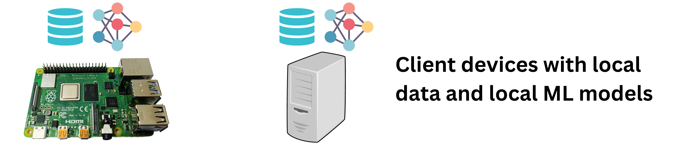

There are 6 Federated Learning iterations where both the Raspberry Pi and the personal computer individually train a MobileNetV2 model, send updates to the server, and the server aggregates the model parameters. During the client's training process, each client uses a dataset, different from the other, to train the model. This helps us simulate a situation where we have different devices at different locations and therefore the data is different and more diverse.

For my demonstration, I chose the MobileNetV2 architecture since it is a lightweight neural network architecture that is designed to be efficient and fast, with less computation power requirements. In my previous tests, I trained an EfficientNetB0 model and it achieved almost the same performance as the MobileNetV2 model, but at the cost of a significantly longer training and classification time. 

When the Federated Learning is complete, the server uses the [Edge Impulse Python SDK](https://docs.edgeimpulse.com/docs/tools/edge-impulse-python-sdk) to profile the final global model for the Raspberry Pi. This profiling gives us an estimate of the RAM, ROM, and inference time of the model on a target hardware family like the Raspberry Pi. Finally, the new global model will also be uploaded to an Edge Impulse project and this enables us to deploy it to any device that can run it.

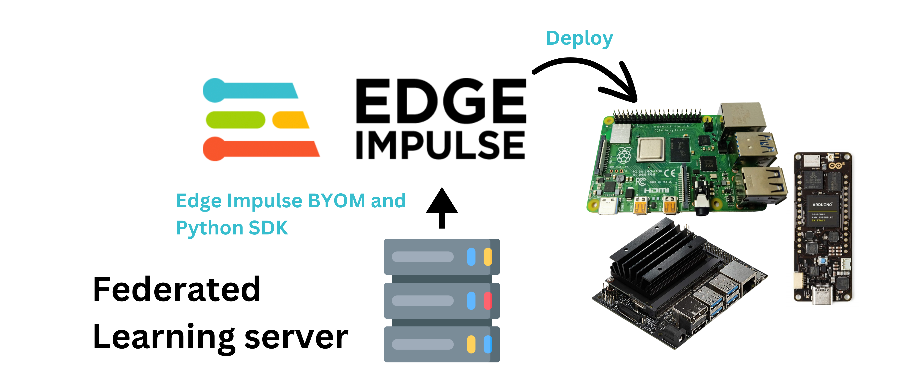

## Components and Hardware Configuration

Software components: 
- Edge Impulse Studio account
- Python
- Edge Impulse for Linux

Hardware components:
- Personal Computer with Windows or Linux based Operating System
- Raspberry Pi 4 (recommended to use the 4GB RAM version) with Raspberry Pi OS
- Official Raspberry Pi 4 power adapter (recommended)
- Raspberry Pi V2 camera module

## Data Collection Process

I first started by sourcing images with people's heads and people wearing safety hats. I obtained my dataset from this [Public Edge Impulse project](https://studio.edgeimpulse.com/public/34898/latest). The project trains a MobileNetV2 SSD FPN-Lite 320x320 object detection model to identify heads and safety hats on an image. This project is a good demonstration of the classic Machine Learning approach where we train a centralized model with all the data on one computer. To get a better understanding of the project, please feel free to read the [project's write-up here](https://edgeimpulse.com/blog/enhancing-health-and-safety-in-industrial-environments-with-embedded-machine-learning).

The public project has a total of 583 images of people's heads and people wearing safety hats. I then split the images according to this:
- two folders with training and test images for two client devices
- one folder with test images for the server model testing during the Federated Learning
- one folder with test images that we can give to the final global model *after* the Federated Learning

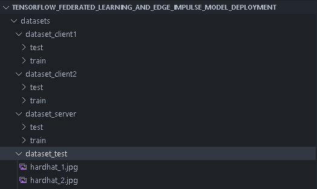

## Training the Model, the Federated Way

For the Federated Learning pipeline, I created this [GitHub repository](https://github.com/SolomonGithu/tensorflow_federated_learning_and_edge_impulse_model_deployment/tree/main) that has the dataset and Python scripts for the server and client devices. To follow along as I describe how to run the Federated Learning system, start by cloning the repository on the device that will run as the server. For the client devices, we only need to copy to them the ```datasets``` folder, ```requirements_client.txt``` and ```client.py```. You can also clone the repository on the client devices, but this will load unnecessary files on them.

First, we need computers for the server and clients but you can also use the same computer as both the server and clients, provided the computer has enough resources to do that. The minimum number of required clients is two for the Federated Learning to start. This minimum number can be modified in the ```server.py``` code but remember to also modify the ```client.py``` code to load dataset for the additional clients.

I decided to use my personal computer as the server and also as one client device. For the other client device, I decided to use a Raspberry Pi 4 with 4GB of RAM.

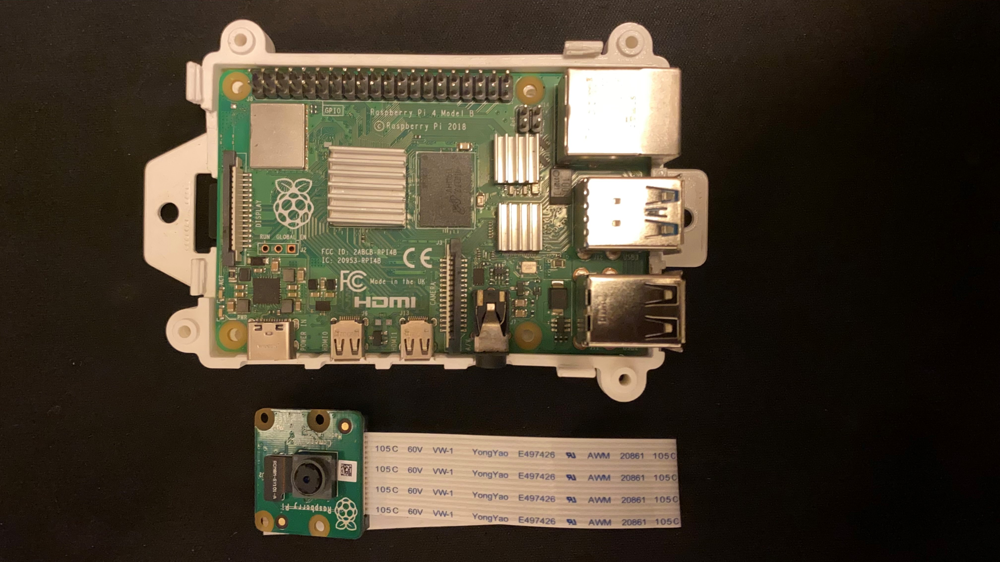

In my test with Raspberry Pi 3s running as the client devices, they managed to train a model but failed at the model evaluation process. This can be related to the fact that the Raspberry Pi 3 is more resource constrained than the Raspberry Pi 4 with a less powerful CPU and smaller RAM. Using the ```top``` command on the Raspberry Pi 3s showed that the CPU and RAM usage were at the top during the training process. When it reached the evaluation process, the RAM usage increased to around 80%, CPU usage dropped to around 40% and then the Federated Learning framework disconnected the Raspberry Pi 3 client devices. The Raspberry Pi 3s also showed 92% CPU usage and 45% RAM usage when they were connecting as the client devices.

First, we need to install dependencies on the devices. The difference between the server and client dependencies is that the server computer uses Edge Impulse Python SDK for profiling and deploying the model. We can install dependencies on the server computer by running the command below on a terminal or a Command Prompt(CMD):
```
pip install -r requirements_server.txt
```

To install the dependencies on the Raspberry Pi 4 running as a client device, we use the command below:
```
pip install -r requirements_client.txt
```


Next, we need to update the ```server_address``` value in both ```server.py``` and ```client.py``` with the IP address of the device running as the server. If you get an error message from ```server.py``` that says ```_ERROR_MESSAGE_PORT_BINDING_FAILED```, change the server's port to another one that is available.


Afterwards, we need to get an [API key for an Edge Impulse project](https://edgeimpulse.readme.io/reference/edge-impulse-api#api-key). To do this, we can create a new project on Edge Impulse Studio and then copy its API key. Afterwards, we need to paste the API key to the ```ei.API_KEY``` variable in ```server.py```.

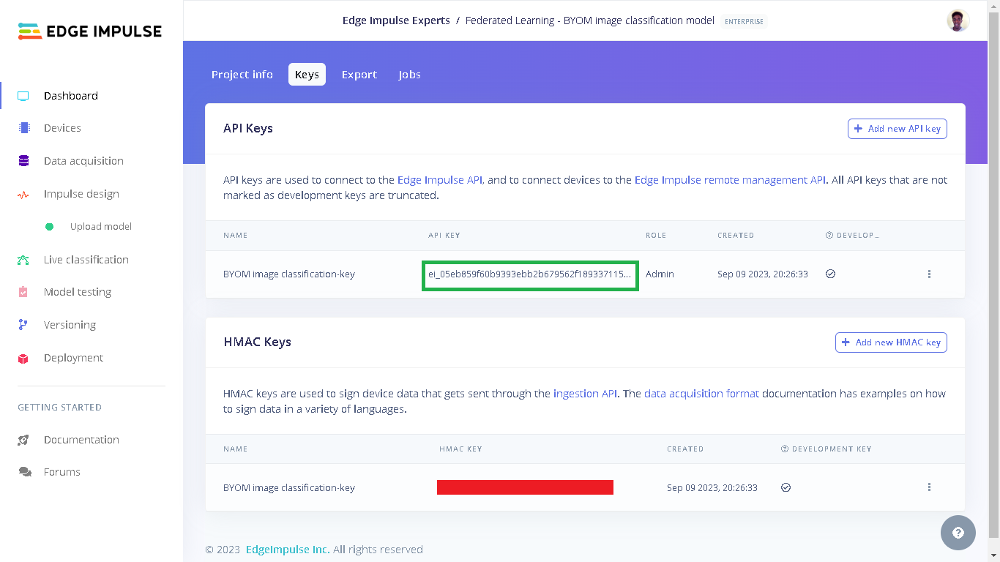

Finally, we can now run the Federated Learning system. I first start the server on my personal computer by running ```python server.py```. The server will first load the test images, initialize the global model parameters, evaluate the initial model's parameters and then wait until at least two clients join before starting the Federated Learning.


Next, I start one client on my personal computer by running ```python client.py --client_number=1``` on a Command Prompt (CMD). When running the client scripts we use the argument ```client_number``` to enable the script load different datasets for each client using the two folders with the client's dataset.


Afterwards, I start the second client on the Raspberry Pi 4 by running the command ```python client.py --client_number=2```. 


Once the two clients have connected, the Federated Learning will start. Each client will load a MobileNetV2 model, train the model using the train data, evaluate the model using the test data, and then send model updates to the server. In each Federated Learning iteration, the clients train a model with 20 epochs and a batch size of 8. The sever then aggregates the models parameters from the updates sent by the clients and then updates the initial model with the new parameters. This process continues six times and the Federated Learning will be completed.

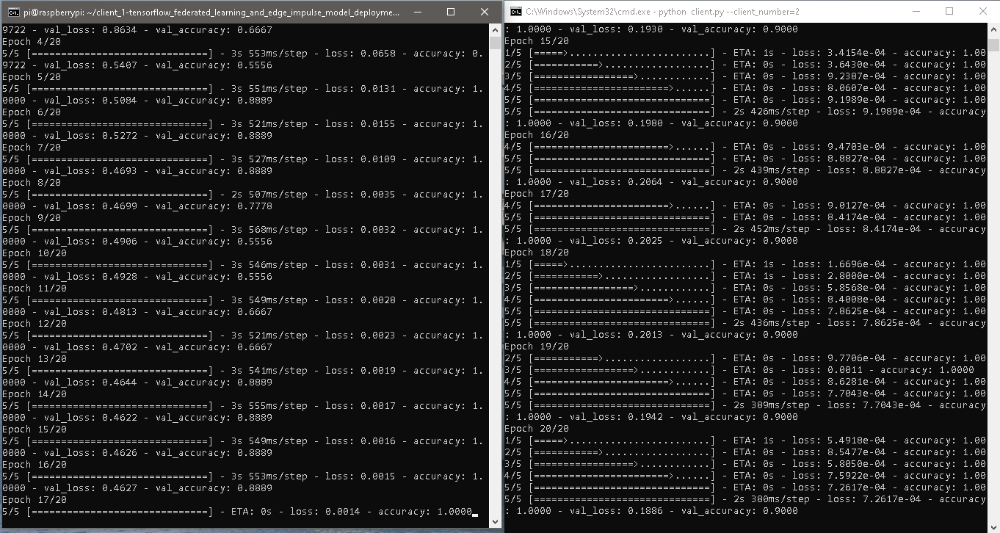


Finally, when the Federated Learning is complete, I added some code on the server script to test the final global model with the test images that were not use during the Federated Learning. In the server's logs, we can see that the global model gives an accuracy of 1.0 in all the Federated Learning iterations. This, however, does not suggest that our model is perfect. Our dataset is still relatively small with only 415 images equally divided for the two client's training dataset. Also, since this is transfer learning, our head and hardhat images are not very complex objects and the pre-trained model may be requiring a few fine-tuning to make it learn the new task.


After testing the model, the server script then uses [Edge Impulse Python SDK](https://docs.edgeimpulse.com/docs/tools/edge-impulse-python-sdk) to profile the model for the Raspberry Pi. This profiling gives us an estimate of the RAM, ROM, and inference time of our model on the Raspberry Pi. We can see the performance estimates for the Raspberry Pi in the screenshot below. Also, during this profiling, the final global model will be sent to the Edge Impulse project.

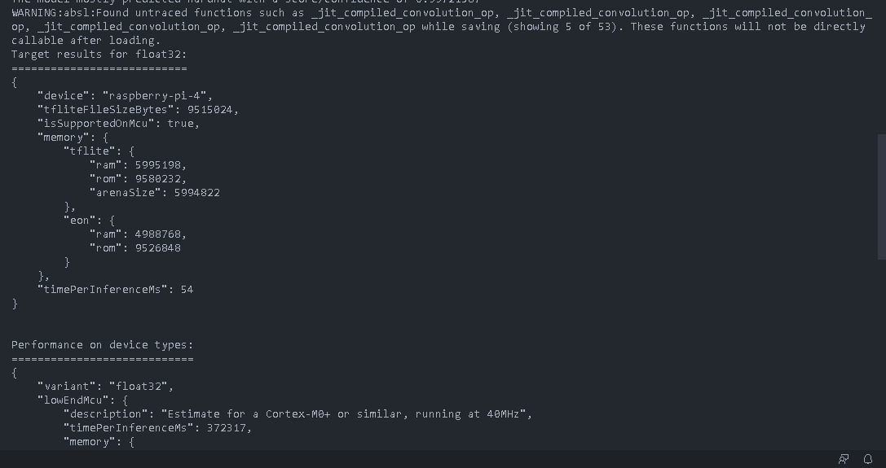

## Testing the global model

When we go to the Edge Impulse project, we will see "Upload model" under "Impulse design". This is because our final global model was uploaded to the project during profiling.

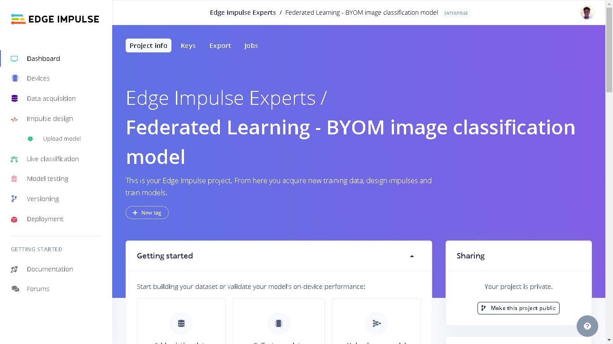

We first need to configure some parameters on the Edge Impulse project. Click "Upload model" and a new interface will open on the right side of the page. Here, we need to select "Image (RGB)" for the model input since our model is using RGB images. Next, for the input scaling query, we select "Pixels ranging 0..255(not normalized)". Afterwards, we select "Classification" for model output since this is an image classification model. Finally, the output labels should be: head, hardhat. Click "Save model" to finish the configuration.


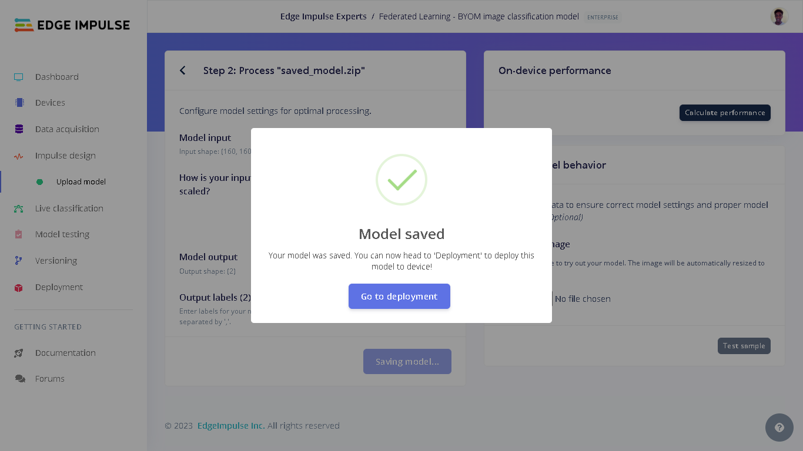

Afterwards, we can upload a test image to see if the settings we made are correct. In this test image, we can see that as much as the person is occupying a relatively small area portion of the image, the model was able to correctly determine that this is a hardhat image.

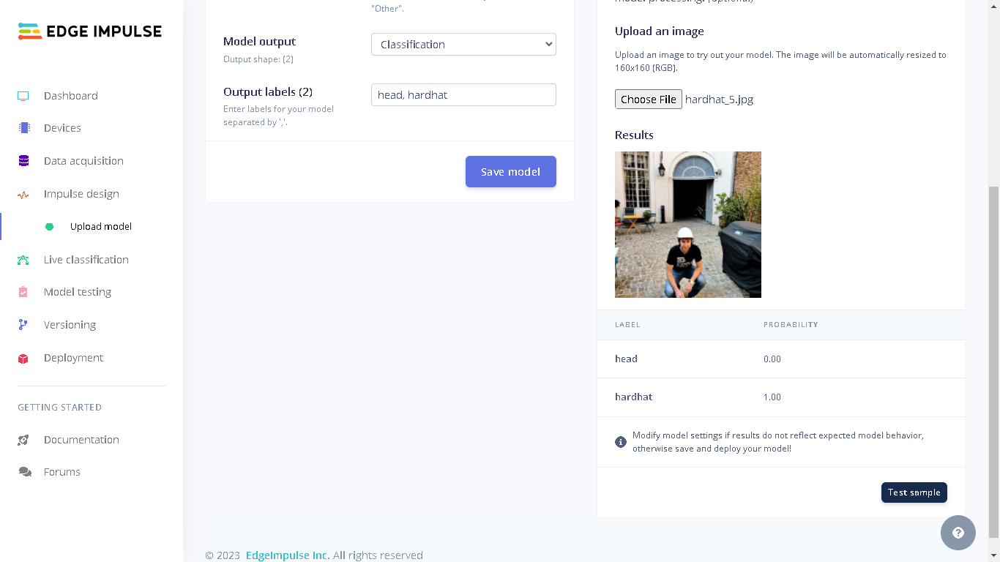

Perfect! Now we have a federated learning model added to Edge Impulse. 

We can use the [Model testing feature](https://docs.edgeimpulse.com/docs/edge-impulse-studio/model-testing) on Edge Impulse to further test our model. Remember we had a fourth dataset folder for test images that were not used during the Federated Learning system. First click "Data Acquisition" followed by clicking the "Upload data" icon.

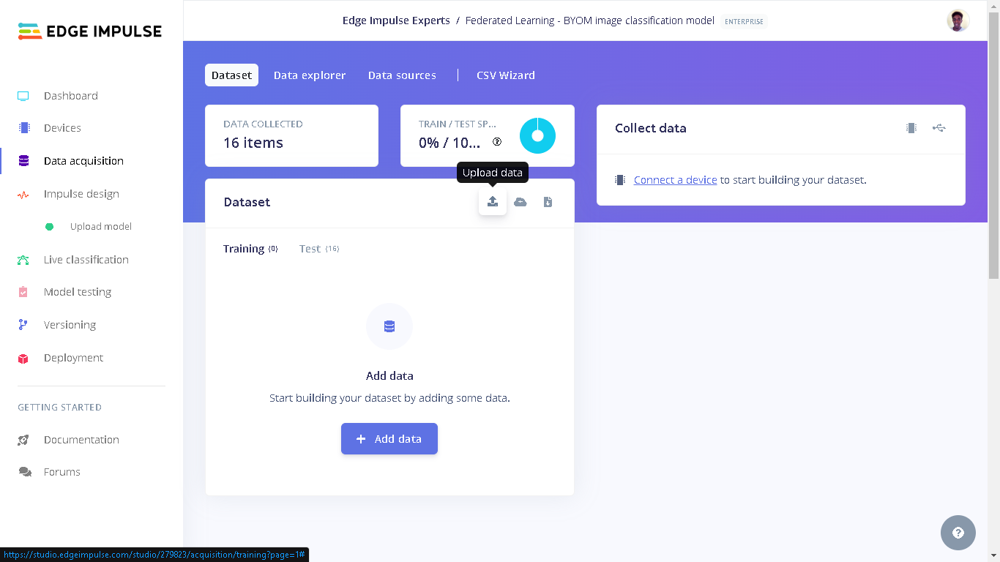

A new interface will open. Here we can first choose "Select a folder" for the upload mode. Click "Choose files" and select the ```dataset_test``` directory on your computer from where you cloned the GitHub repository to. Next, select "Testing" for the upload category since we have already trained a model and therefore there is no need to have training data. Next, for Label we select "Leave data unlabeled". Finally, click "Upload data" and the images will be uploaded to the project. The uploaded images can be seen by going to "Test" in Data acquisition.

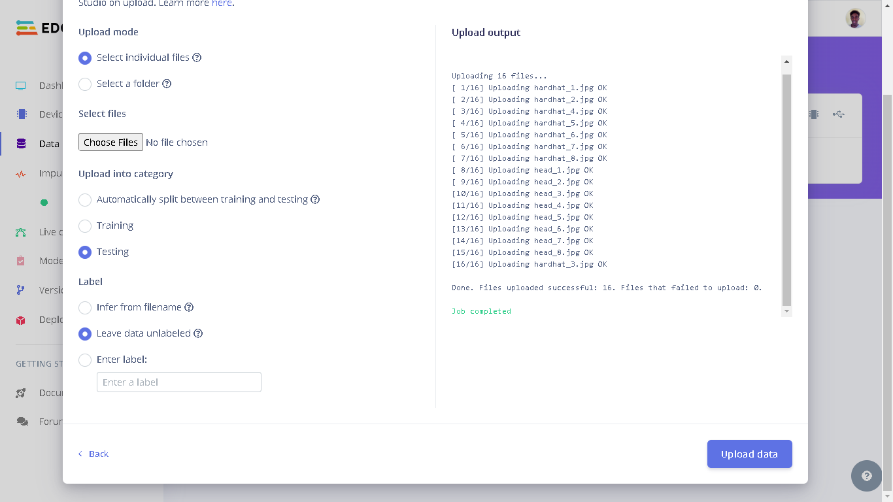


The last thing to do is to label the images. This label information describes what each image is, head or hardhat. The label information will also be used during the model testing by comparing the models output to the correct class (label). To label the images, first click the kebab menu (three dots menu) that is at each item listed in the test data. Next, select "Edit label" and type the name of the class which the image belongs to: head or hardhat. Do this until all images have been labelled.


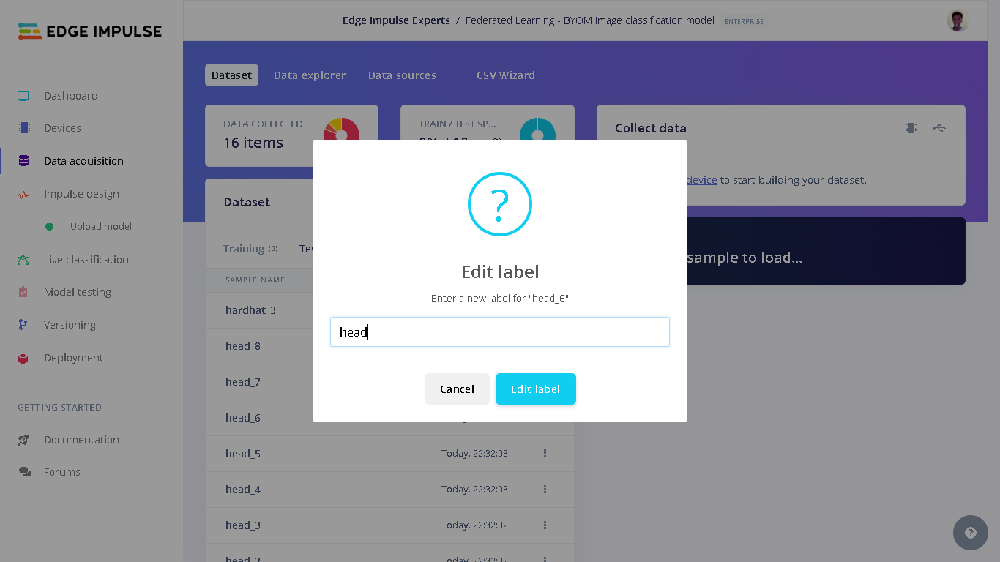

Finally, when all the images have been labeled, we can click "Model testing" and afterwards "Classify all". This will test the model on all the test images, determine the model's performance and also create a confusion matrix. From my test, the model achieved an accuracy of 93%. However, for a more robust model, we still need to train the model on more data and more times. For my demonstration, I chose this result as an acceptable performance.

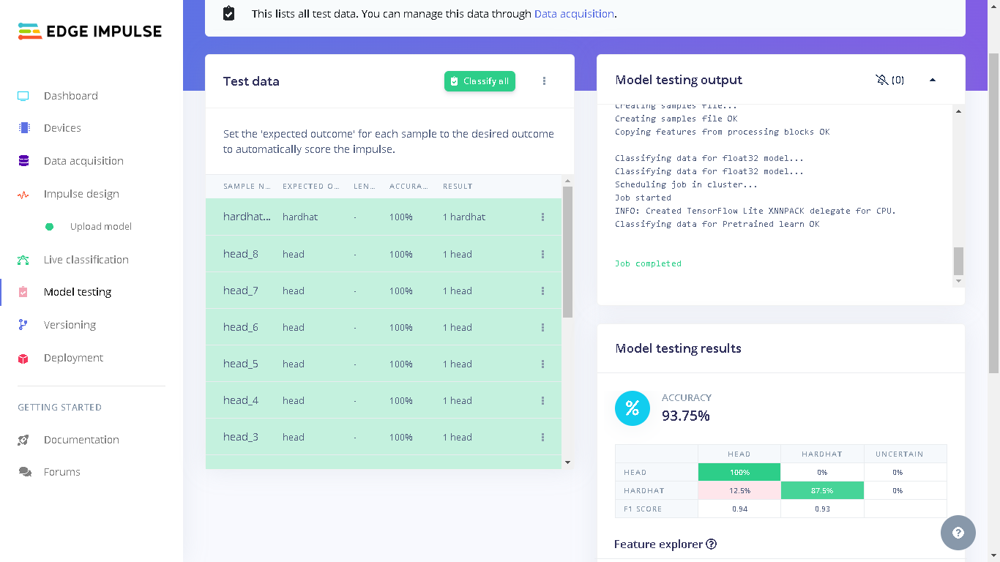

## Result

Finally, after training a decentralized model and uploading it to Edge Impulse, one incredible feature that we can benefit from is a seamless deployment of the model on hardwares ranging from MCUs, CPUs and custom AI accelerators. In this case, we can deploy our model to the Raspberry Pi as an [.eim executable](https://docs.edgeimpulse.com/docs/tools/edge-impulse-for-linux#.eim-models) that contains the signal processing and ML code, compiled with optimizations for a processor or GPU (e.g. NEON instructions on ARM cores) plus a very simple IPC layer (over a Unix socket).

First, we need to attach the Raspberry Pi camera to the to the board.


Next, we need to install Edge Impulse for Linux dependencies on the Raspberry Pi 4. To do this, we can run the commands below on the Raspberry Pi:

```
sudo apt update
curl -sL https://deb.nodesource.com/setup_12.x | sudo bash -
sudo apt install -y gcc g++ make build-essential nodejs sox gstreamer1.0-tools gstreamer1.0-plugins-good gstreamer1.0-plugins-base gstreamer1.0-plugins-base-apps
npm config set user root && sudo npm install edge-impulse-linux -g --unsafe-perm
```

Afterwards, we need to activate the camera interface on the Raspberry Pi 4 for the camera module. We can run the command ```sudo raspi-config``` and use the cursor keys to select and open Interfacing Options, then select camera and follow the prompt to enable the camera. Finally, reboot the Raspberry Pi by running the command ```sudo reboot```.

After setting up the Raspberry Pi, we can download the final global model from the Edge Impulse project by running the command below. You will be prompted to input your username and password for your Edge Impulse account, followed by a prompt to select the Edge Impulse project.
```
edge-impulse-linux-runner --download modelfile.eim
```

Finally, we can run the executable model locally on the Raspberry Pi by running the command below. This will capture an image using the camera, process the image, give the image to the model, get the model's prediction and present a live stream of the camera feed and inference results. Without having to write code for each step, [Edge Impulse for Linux](https://docs.edgeimpulse.com/docs/tools/edge-impulse-for-linux) bundles all these processes.
```
edge-impulse-linux-runner --model-file modelfile.eim
```
In the command, we pass the name of the downloaded .eim file ```modelfile```.

We can go to the provided URL (Raspberry Pi's IP address at port 4912) and we will see the feed being captured by the camera as well as the models predictions. At this point I used a 3D printed support to hold the Raspberry Pi camera upright and then projected the test images to the camera.

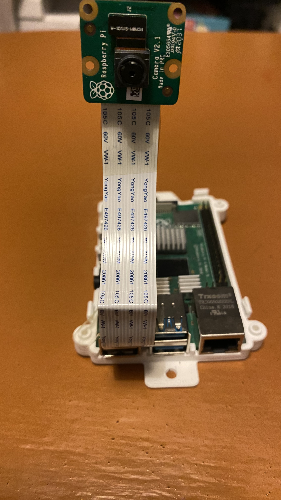


Below is a demo video of live classification on the Raspberry Pi 4. We can see that the model predicts the correct class for each image.


## Conclusion

You can access my public Edge Impulse project using this link: [Federated Learning - BYOM image classification model](https://studio.edgeimpulse.com/public/279823/latest).

From the demonstration, we have seen that we can obtain more accurate and generalizable models through Federated Learning without requiring the data leave the client devices. Federated Learning has a lot of potential. It prevents sending sensitive information like healthcare records, financial records, etc. Since the training occurs from multiple data sources, we get a more diverse data enabling us to come up with more robust models that perform better at their tasks.

An excellent progression of this demonstration would be to implement the Federated Learning system with a different Machine Learning model framework, and adding more clients and data to the system. Additionally, we can also reinforce the system by implementing automated deployments, whereby a final global model is automatically deployed on edge devices from an Edge Impulse project.
