# Optimize a cloud-based Visual Anomaly Detection Model for Edge Deployments

Created By: Mathieu Lescaudron

Public Project Link: [https://studio.edgeimpulse.com/public/376268/latest](https://studio.edgeimpulse.com/public/376268/latest)
GitHub Repo: [https://github.com/emergy-official/anomaly.parf.ai](https://github.com/emergy-official/anomaly.parf.ai)

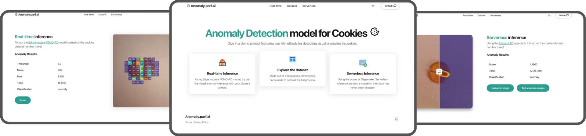

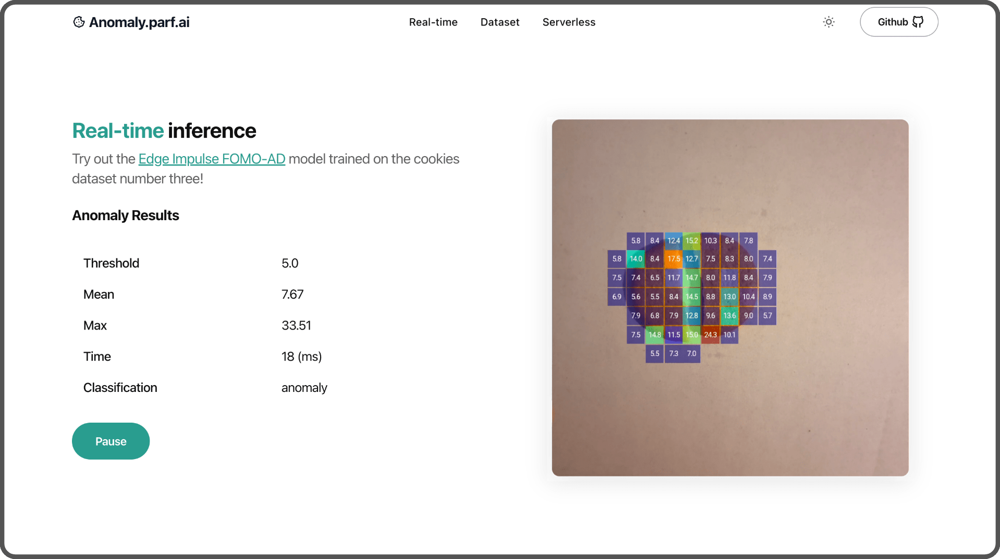

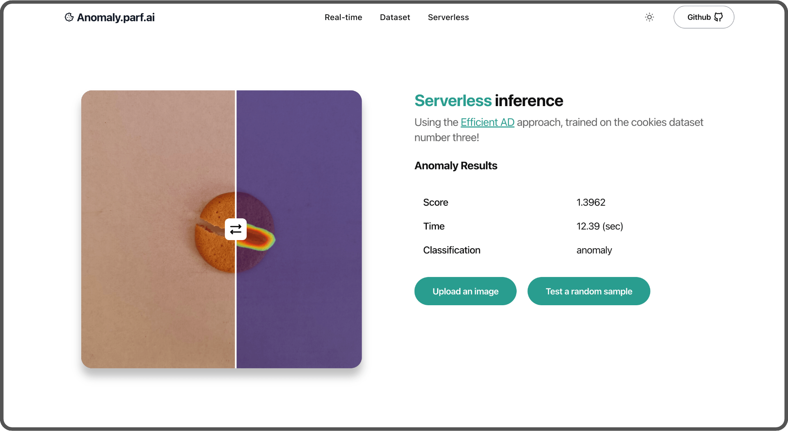

## Introduction

Let's explore the development and optimization of a cloud-based visual anomaly detection model designed for edge deployments, featuring real-time and serverless inference.

We will cover the following topics:

- **Datasets**: Creation of our own datasets.
- **Models**: Development of three different models:
    - A baseline model + usage of BYOM (Bring Your Own Model on Edge Impulse),
    - Efficient AD model,
    - FOMO AD model by Edge Impulse (automated).
- **Web App**: 
    - Setting up a real-time and serverless inference endpoint,
    - Dataset explorer,
    - Automating deployments with GitHub Actions and Terraform on AWS.

This is a demo project. All code is provided for you to implement any or all parts yourself.

## Software used

- [Edge Impulse Studio](https://studio.edgeimpulse.com/studio)
- [Edge Impulse Mobile client](https://github.com/edgeimpulse/mobile-client)
- [Visual Studio Code](https://code.visualstudio.com/)
- [Amazon Web Services](https://aws.amazon.com/)
- [Terraform](https://www.terraform.io/)
- [MLFlow](https://mlflow.org/)
- [Astro](https://astro.build/)

## Context

Imagine we are an industrial company that produces cookies. Our goal is to sort cookies to identify those with and without anomalies.

We are developing a cloud-based proof of concept to attract investment before deploying it on edge devices.

## Step 1: Create the Datasets

We assume we don't have access to [Onmiverse Replicator](https://docs.omniverse.nvidia.com/extensions/latest/index.html) to create a synthetic dataset. Instead, We manually create our own. The first step is to carefully review which cookies to ~~eat~~ use.

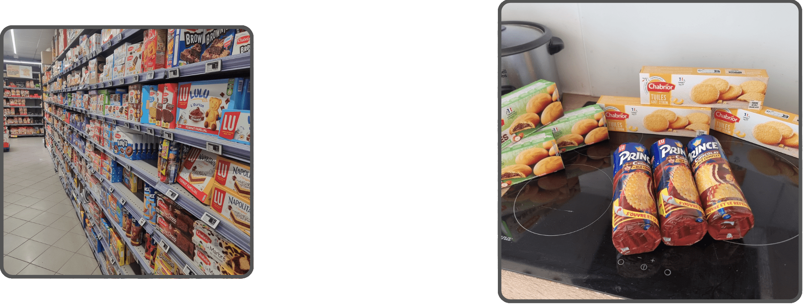

We'll create three datasets using three different types of cookies:

- One with texture,
- One thicker cookie,
- One plain cookie.

Each dataset will consist of 200 images, totaling 600 images:

- 100 without any anomalies
- 100 with anomalies
  - 50 easy to recognize with a clear, strong separation down the middle,
  - 25 medium difficulty with a separation that has no gap,
  - 25 hard to detect, with small defects and knife marks.

We take around five pictures of each cookie, making slight rotations each time. Here's the result:

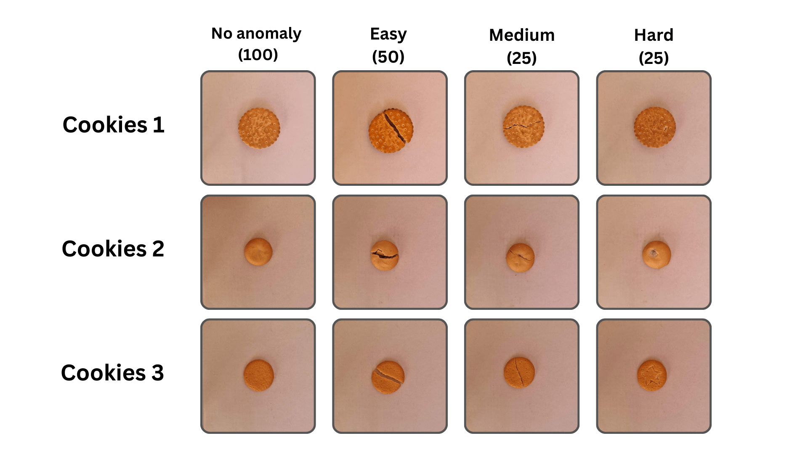

Each picture, taken from a mobile phone in a `1:1` ratio with an original size of 2992 x 2992 pixels, is resized to 1024 x 1024 pixels using [morgify](https://imagemagick.org/script/mogrify.php) command from ImageMagick. It saves computing resources for both the training process and the inference endpoint:

```
mogrify -resize 1024x1024 *.jpg
```

The folder structure looks like this:

```
- cookies_1
    - anomaly_lvl_1
    - anomaly_lvl_2
    - anomaly_lvl_3
    - no_anomaly
- cookies_2
...
```

You can download the datasets [here](https://drive.google.com/file/d/19VM3RtzVFyDZ4s0HKJ8eVMnijAKEJdRJ/view?usp=drive_link) (95MB) and the raw images [here](https://drive.google.com/file/d/1vWbc9nI2v5Uzhs5MyEXu8a-mi5jwUn1K/view?usp=drive_link) (1GB)

## Step 2: Create the models

### Baseline model

The first model we will develop will be our baseline, serving as our starting point.

It consist of a categorical image classification using a pre-trained MobileNet.
Categorical (rather than binary) classification to allow for the addition of more categories of anomalies in the future.

Have a look at the training in [this notebook](https://github.com/emergy-official/anomaly.parf.ai/blob/main/ai/notebooks/1_baseline.ipynb)

```python
base_model = MobileNet(input_shape=(160, 160, 3),
                       include_top=False,
                       weights='imagenet',
                       pooling='avg')

base_model.trainable = False

model = Sequential([
    base_model,
    Dense(128, activation='relu'),
    Dense(2, activation='softmax')
])

model.compile(
    optimizer=tf.keras.optimizers.legacy.Adam(learning_rate=1e-5),  
    loss='categorical_crossentropy',
    metrics=['accuracy']
)
```

Here's how the images are distributed for this model:

- Training: 144 images (72%)
- Validation: 16 images (8%)
- Test: 40 images (20%)

Both anomalies & no anomalies images are used during training.
The model is trained on a Mac using the CPU, running through 50 epochs.

You can find the results in the [Step 3: Benchmarking](#step-3-benchmarking) section.

### Convert Baseline with BYOM

With Edge Impulse's [Bring Your Own Model](https://docs.edgeimpulse.com/docs/edge-impulse-studio/bring-your-own-model-byom) feature, you can easily upload your own model and use all their features.

In our case, let's use a jupyter notebook that convert the Baseline model to a MacOS version using the Edge Impulse API. (You can do it for a specific edge device, linux, web assembly, ...). It can save you quite some time compared to doing it yourself.

You can find detailed steps in [this notebook](https://github.com/emergy-official/anomaly.parf.ai/blob/main/ai/notebooks/1_baseline.ipynb) (scroll down to the section titled `Edge Impulse conversion`)

First, start by importing the [Edge Impulse Python SDK](https://github.com/edgeimpulse/python-sdk). Then load your project's API KEY.

```python
import os
import edgeimpulse as ei 
from dotenv import load_dotenv 

ei.API_KEY = os.getenv("EDGE_IMPULSE_API_KEY_BASELINE")
```

After that, define the input and output types for your model:

```
python
model_input_type = ei.model.input_type.ImageInput()
model_output_type = ei.model.output_type.Classification(labels=["anomaly","no_anomaly"])
```

And then, convert it to the format that fits your needs (in this case, MacOS for the demo):

```python
deploy_bytes_mac_os = ei.model.deploy(model=model,
                                      model_output_type=model_output_type,
                                      model_input_type=model_input_type,
                                      deploy_target='runner-mac-x86_64')

if deploy_bytes_mac_os:
    with open(f"baseline.eim", 'wb') as f:
        f.write(deploy_bytes.getvalue())
```

You'll need to make it executable by using the command `chmod +x baseline.eim`.
And you're all set! Create an inference function to use it with this model:

```python
def ei_inference(img_path):
    with ImageImpulseRunner(modelfile) as runner:
        model_info = runner.init()

        original_image = cv2.imread(img_path, cv2.IMREAD_COLOR)
        img = cv2.cvtColor(original_image, cv2.COLOR_BGR2RGB)  
        
        features, cropped = runner.get_features_from_image(img)
        res = runner.classify(features)
        
        anomaly = res["result"]["classification"]["anomaly"]
        no_anomaly = res["result"]["classification"]["no_anomaly"]

        classification = "anomaly" if anomaly > no_anomaly else "no_anomaly"
        print(res["result"]["classification"], f"Classification: {classification}")
```

### EfficientAD

Let's use another method called **EfficientAD** ([detailed in a study from arXiv.org](https://arxiv.org/abs/2303.14535)).

EfficientAD employs an autoencoder paired with a student-teacher approach  to quickly and effectively identify anomalies in images.

Take a look at their [video presentation](https://www.youtube.com/watch?v=yhpkHOdpyPU) for a brief overview.

The network, named PDN (Patch Description Network), includes a design with 4 convolutional layers and 2 pooling layers. It examines each segment of the 33 x 33 pixel image and produces a feature vector of 384 values.

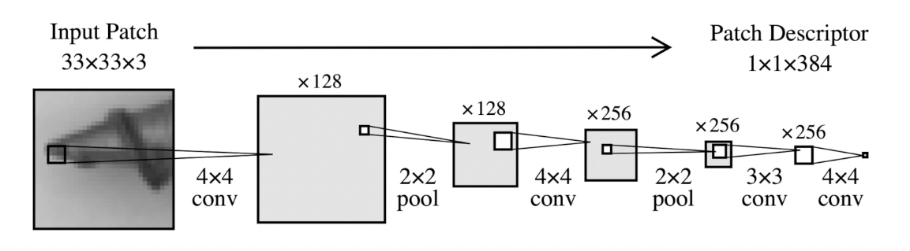

Two models, `student` and `teacher` are trained on the same data. The teacher model guides the student model by providing a loss function which helps the student to improve their performance in detecting anomalies.

Anomaly detection during testing is measurable when the student model fails to predict the characteristics of an image. EfficientAD introduces an autoencoder that gives a broader view of the image, improving the overall performance of the detection in addition to the Student-Teacher method.

We're going to reuse some of the code from [nelson1425/EfficientAD](https://github.com/nelson1425/EfficientAD) and update it to suit our needs. You can find the updated code [here](https://github.com/emergy-official/anomaly.parf.ai/blob/main/ai/code/efficientad_fns.py).

#### Experimenting with MLFLow

We will test different parameters to build a model that performs well. In the study, they used 70,000 iterations (steps) and pretrained weights from [WideResNet-101](https://paperswithcode.com/model/wide-resnet?variant=wide-resnet-101-2).

We will experiment different numbers of steps, enabling or disabling the pretrained weights and using the small or medium size of the patch description network (the medium size includes another layer and twice as many features). Each test is called an experiment, and we will use [MLFlow](https://mlflow.org/) to log the parameters and store their results, including the scores and the models.

To run a MLFlow server, either locally or on a remotely, use the following command:

```sh
# pip install mlflow
mlflow server \
    --host 0.0.0.0 \
    --port 5000 \
    --artifacts-destination s3://artifact-dev.anomaly.parf.ai \
    --gunicorn-opts --timeout=300 \
    --gunicorn-opts --keep-alive=300
```

Here, we're using the  `--artifacts-destination` argument  to specify where to store our models. You can omit this argument if you're not using a S3 bucket on AWS, and it will default to storing the models on the disk.

In your code, you define an experiment like this:

```python
mlflow.set_tracking_uri(uri=self.cfg["mlflow_tracking_uri"])
mlflow.set_experiment("Name of the experiment")

with mlflow.start_run(): # Start the experiments and timer

    mlflow.log_params({**self.cfg}) 

    # your code, training, ...

    mlflow.log_metric("score", score)
    mlflow.log_metric("threshold", threshold)

    mlflow.log_artifact("./models.pth") # teacher, student & autoencoder
    # mlflow.log_artifact(...) # you can log multiple artifacts

```

We primarily use MLFlow to track experiments and store artifacts, although it offers many other powerful features including model registry, model deployments, model serving, and more.

You can find the full setup instructions for MLFlow for this demo [here](https://github.com/emergy-official/anomaly.parf.ai/blob/main/ai/AWS_ML_FLOW.md).

#### Training on the cloud 

Let's train our models in the cloud using our [notebook](https://github.com/emergy-official/anomaly.parf.ai/blob/main/ai/notebooks/2_efficientad.ipynb). We are using a Jupyter notebook, you could also use a Python script.

There are many different cloud providers that allow you to train a model. We will use an AWS instance that includes a [Nvidia Tesla 4 GPU](https://www.nvidia.com/en-us/data-center/tesla-t4/).

The specific instance type we use is  `g4dn.xlarge`. To get access to this instance, you need to create a support ticket requesting access to the type G instance type in your region. It will cost us 0.526 USD per hour and we plan to use it for approximately 3h.

For our setup, we'll use a pre-configured AMI with PyTorch named `Deep Learning OSS Nvidia Driver AMI GPU PyTorch 2.2.0`.

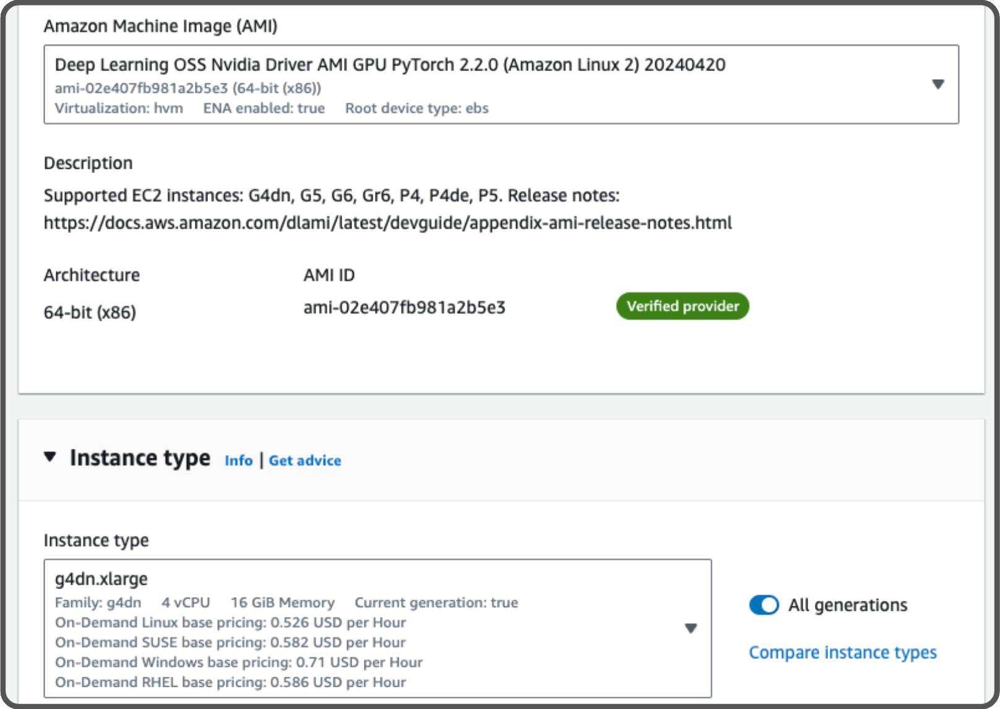

Here is the CLI:

```sh
INSTANCE_NAME=ModelTraining
SG_GROUP_ID="..." # The security group ID allowing ssh from your computer.
KEY_NAME="..." # Your PEM key to connect through ssh

# Create the instance
aws ec2 run-instances --image-id ami-02e407fb981a2b5e3 \
--instance-type g4dn.xlarge \
--key-name $KEY_NAME \
--security-group-ids $SG_GROUP_ID \
--block-device-mappings '[{"DeviceName":"/dev/sda1","Ebs":{"VolumeSize":60}}]' \
--tag-specifications "ResourceType=instance,Tags=[{Key=Name,Value=$INSTANCE_NAME}]"

# To terminate the instance
aws ec2 terminate-instances --instance-ids $(aws ec2 describe-instances \
--filters "Name=tag:Name,Values=$INSTANCE_NAME" \
--query "Reservations[*].Instances[*].InstanceId" \
--output text)
```

The complete commands used are detailed [here](https://github.com/emergy-official/anomaly.parf.ai/blob/main/ai/AWS_Train_readme.md)

Once you've connected to the instance using ssh and cloned the repository along with the datasets, you can run the following command to start the jupyter notebook:

```sh
jupyter notebook --no-browser >jupyter.log 2>&1 &
```

Make sure you've enabled port forwarding so you can connect to the remote Jupyter notebook locally:

```sh
ssh -N -f -L 8888:localhost:8888 ubuntu@44.200.180.25 # Change using your instance IP
```
You can now access Jupyter Notebook on the remote instance from your local computer.

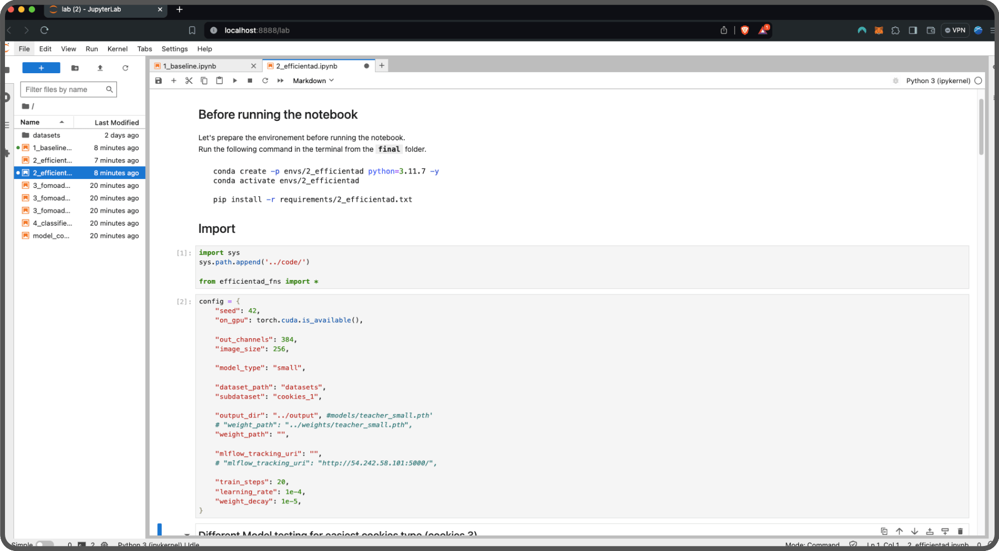

For the training, we will only use the images without anomalies. Here's how the data is distributed:

- Training
    - No anomaly: 72 images (36%)
- Validation
    - No Anomaly: 8 images (4%)
    - Anomaly: 20 images (10%)
- Testing
    - No Anomaly: 20 images (10%)
    - Anomaly: 80 images (40%)

Once it is trained, you can see the different results in MLFlow:


And you can create graphics to build reports:

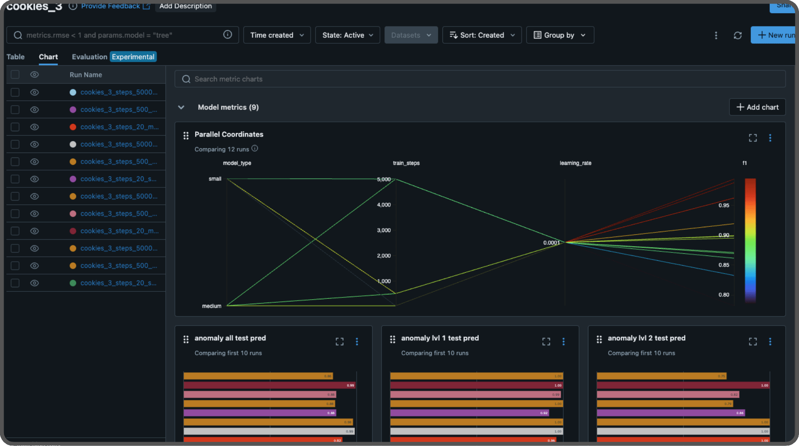

For the cookies dataset three, the best model used 3,200 steps, pretrained weights, and the small network. In the study, they used 70,000 steps. We added `early stopping`  based on the F1 score from the evaluation dataset. Modify this for your needs.

We use the same config for training datasets one and two.

Here's an example of the inference results with EfficientAD. It localizes the anomaly within the image through a heatmap.

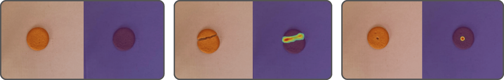

Once you're finished, terminate the remote instance. You can find the results in the [Step 3: Benchmarking](#step-3-benchmarking) section.

### FOMO AD model (automated)

The last model we will build is called FOMO-AD, a visual anomaly detection learning block developed by Edge Impulse. It's based on the FOMO architecture, specifically designed for constrained devices.

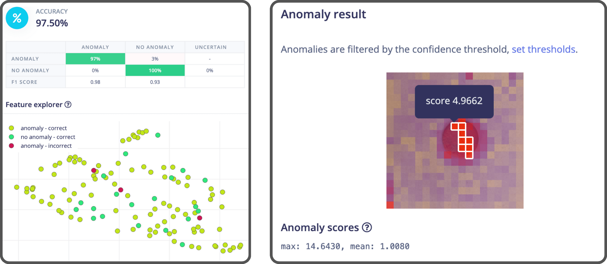

Check the [FOMO-AD documentation](https://docs.edgeimpulse.com/docs/edge-impulse-studio/learning-blocks/visual-anomaly-detection) for more information.

Let's automate the entire process using the Edge Impulse API:
- Import the dataset,
- Create an impulse,
- Generate features,
- Train the model,
- Export the model.

There's too much code to detail here, if you want to replicate it yourself **step by step**, check out [this notebook](https://github.com/emergy-official/anomaly.parf.ai/blob/main/ai/notebooks/3_fomoad.ipynb)

We separate our dataset as follows:

- Training set
    - No Anomaly: 80 images (40%)
- Testing set
    - No Anomaly: 20 images (10%)
    - Anomaly: 100 images (50%)

The best part of the notebook is that it includes a pre-built pipeline in Edge Impulse that `Find the best Visual AD Model` using our dataset. All you need to do is provide the dataset and run the pipeline.  After that, you'll have the optimal model set up in your project, and you can find the best threshold to use in the logs (Refer to the `Option 2` section in the notebook for more details).

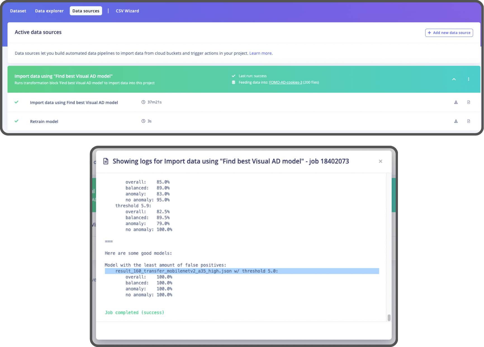

Edge Impulse lets you classify your entire dataset or just one image at a time:

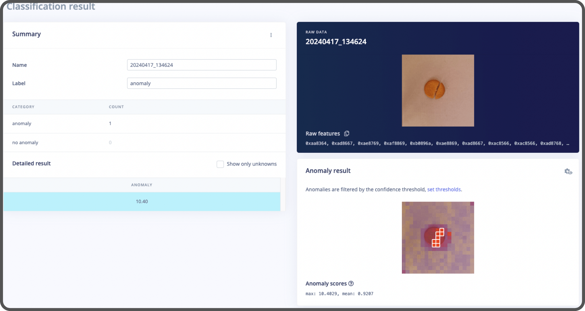

Once the model is exported, you can create an inference function in Python to run it locally:

```python
def ei_inference(img_path):
    with ImageImpulseRunner(model_path) as runner:
        model_info = runner.init()
        
        original_image = cv2.imread(img_path, cv2.IMREAD_COLOR)  
        img = cv2.cvtColor(original_image, cv2.COLOR_BGR2RGB)  
        
        features, cropped = runner.get_features_from_image(img)
        res = runner.classify(features)

    return res
```

## Step 3: Benchmarking

Now that we've trained all the models, it's time to evaluate how well they perform using the F1 Score. (The F1 Score is a way to measure a model's accuracy, taking into account both precision and recall).

Take a look at [this notebook](https://github.com/emergy-official/anomaly.parf.ai/blob/main/ai/notebooks/model_comparaison.ipynb) where all the benchmarking is done.

Since each model was trained on different sets of data, we will use the test dataset from Efficient AD model for comparison.

Here are the results, tested on a Macbook:

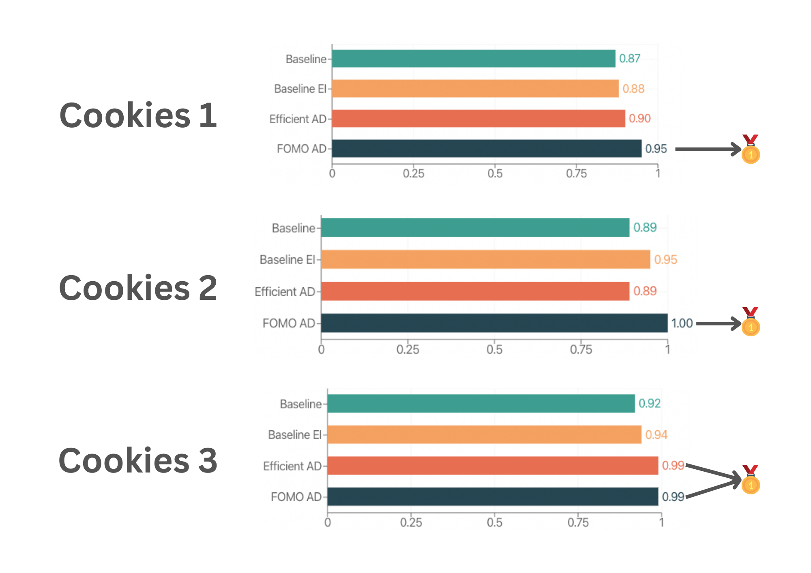

FOMO AD performs the best in most datasets. Although Efficient AD could be improved to score higher, it would require more time.

For additional details on performance, including difficulty, time, and RAM usage, check out [this notebook](https://github.com/emergy-official/anomaly.parf.ai/blob/main/ai/notebooks/model_comparaison.ipynb). Usually, the inference time of Efficient AD is 300ms, whereas FOMO AD is 35ms.

Efficient AD model should to be used by modern GPUs, where the inference time is about 3ms.

## Step 4: API & Web App

The models are trained and ready to be used, so let's build an app to showcase our proof of concept.

We'll include two features:

- A serverless endpoint using [SageMaker Serverless Inference](https://docs.aws.amazon.com/sagemaker/latest/dg/serverless-endpoints.html) with EfficientAD,

- A real-time inference using a compact version of the Edge Impulse [mobile client](https://github.com/edgeimpulse/mobile-client/tree/master/client) with FOMO AD.

In the public repository, you will find:

- The [API Code](https://github.com/emergy-official/anomaly.parf.ai/tree/main/api), 
- The [Automated Infrastructure Code (using Terraform)](https://github.com/emergy-official/anomaly.parf.ai/tree/main/infrastructure), 
- The [Website Code](https://github.com/emergy-official/anomaly.parf.ai/tree/main/website).

### SageMaker Serverless Inference

This is the infrastructure of our serverless inference endpoint:

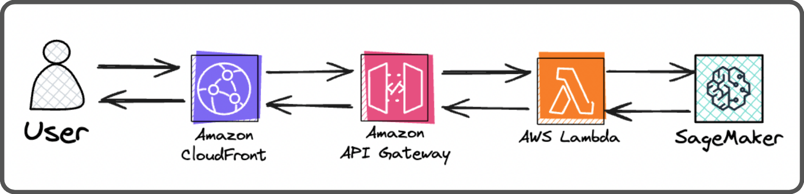

When a user uploads an image to get the anomaly result, it will go through:

- Cloudfront (which is also used by the front end. Users are redirected to the API Gateway when the request path matches `/api*`),
- An API Gateway (to communicate with the Lambda and allows for future API expansions),
- A Lambda that communicate to the SageMaker endpoint securely,
- A Serverless SageMaker endpoint (executes the inference using a Docker container).

The SageMaker endpoint operates using a Docker image. You can build your docker like this:

```Dockerfile
FROM python:3.11.7  
  
WORKDIR /app  
  
COPY requirements.txt .  
RUN apt-get update && apt-get install -y \  
    libgl1-mesa-glx \  
    build-essential \
    && rm -rf /var/lib/apt/lists/*

RUN pip3 install torch torchvision --index-url https://download.pytorch.org/whl/cpu
RUN pip install --no-cache-dir -r requirements.txt

COPY app.py .
COPY inference.py .  

RUN mkdir efficientad_cookies_3

# Artifacts from MLFLOW
COPY efficientad_cookies_3/all_models.pth ./efficientad_cookies_3/
COPY efficientad_cookies_3/best_threshold.pkl ./efficientad_cookies_3/
COPY efficientad_cookies_3/map_normalization.pth ./efficientad_cookies_3/

ENTRYPOINT ["gunicorn", "-b", "0.0.0.0:8080", "app:app"]  
```

Then, upload the Docker image to an ECR repository (an Elastic Container Registry).

```sh
# Tag version image
export IMG_VERSION=latest

# Login to AWS ECR
aws ecr get-login-password --region us-east-1 | docker login --username AWS --password-stdin "$ACCOUNT_ID".dkr.ecr.us-east-1.amazonaws.com/

docker build --platform linux/amd64 -t anomaly-inference-api:$IMG_VERSION .
docker tag anomaly-inference-api:$IMG_VERSION "$ACCOUNT_ID".dkr.ecr.us-east-1.amazonaws.com/anomaly-inference-api:latest
docker push "$ACCOUNT_ID".dkr.ecr.us-east-1.amazonaws.com/anomaly-inference-api:$IMG_VERSION
```

You can also test the inference locally without using Docker:

```sh
FLASK_APP=app.py flask run --port=8080
python local.py
```

Check out the [terraform code](https://github.com/emergy-official/anomaly.parf.ai/blob/main/infrastructure/sdlc/staticWebsiteModule/sagemaker.tf) to configure the SageMaker endpoint or you can do it manually in the AWS Console.

The serverless inference is quite slow (12 sec per inference), you can speed this up this by increasing the RAM usage, switching to a provisionned endpoint, or using a real-time endpoint within AWS. However, these options will increase the cost. The actual setup cost $ 0.20 per 1,000 inferences, an affordable way for creating demos without impacting your wallet.

### Real-time inference

If you've previously played with Edge Impulse, you might be familiar with the `Launch in browser` feature that lets you test your model in real-time.

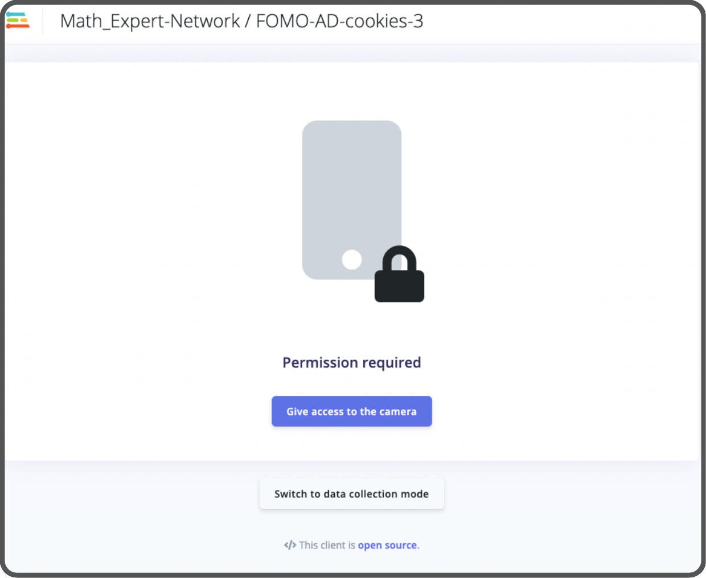

Wouldn't it be great to include this feature directly in our web app ?  
Thanks to Edge Impulse, this feature is [open source](https://github.com/edgeimpulse/mobile-client)!

The way it work is that the client is downloading a **web assembly** zip file of the model using the Edge Impulse API from your project's API KEY. Then, it unzips the export and loads the model along with multiple scripts to enable real-time inference.

We're going to modify this a bit.

- We’ll no longer use the API KEY.
- We’ll include the web assembly zip file directly in the website’s assets. _(you can download this file manually from Edge Impulse, or it can be downloaded automatically using the API when building the website assets)_,
- We'll keep only the essential code and update what's needed to make it work the new way,
- We'll add a colormap function for fun to show the model's confidence.

This is what we obtain:

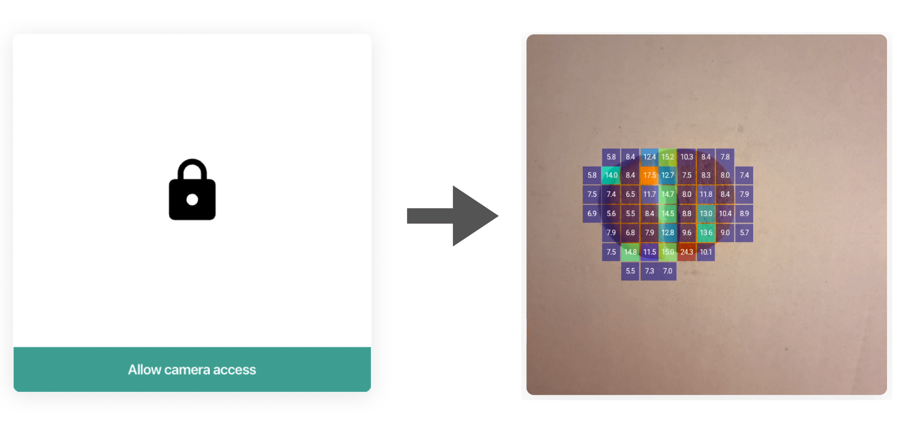

All the modification are detailed [here](https://github.com/emergy-official/anomaly.parf.ai/tree/main/website#mobile-client-compressed-version-detail) at the `Mobile Client compressed version detail` section.

### Website

For the website, we're using [Astro](https://astro.build/) with React based on the [AstroWind](https://astrowind.vercel.app/) template. 

To automatically deploy the website, we use [this github action](https://github.com/emergy-official/anomaly.parf.ai/blob/main/.github/workflows/staticWebsite.yml)  It triggers a deployment whenever the commit message includes `deploy:website`.

The website is hosted on AWS within a S3 bucket and is behind a Cloudfront distribution.

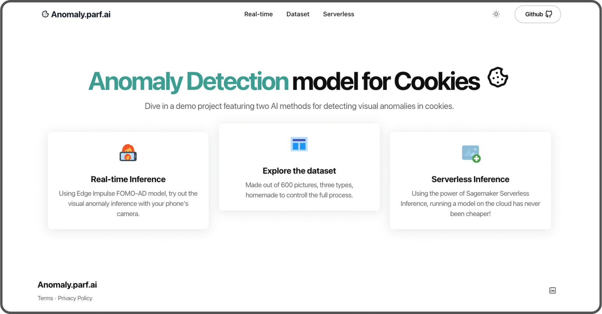

It also features a dataset explorer that showcases the data used for benchmarking:

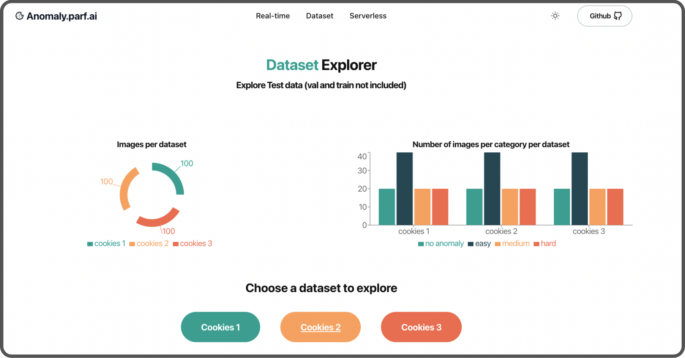

It includes all the images, scores, predictions, and timings for all the models and cookies.

## Improvements

One key improvement could be enhancing the dataset. We used a mobile phone with a combination of natural and artificial lighting. The model's performance might improve if you create a synthetic dataset using [Onmiverse Replicator](https://docs.omniverse.nvidia.com/extensions/latest/index.html) featuring different lighting conditions, backgrounds, and more.

It will eliminate manual processing, and you won't need to run 10 km to burn off all the cookies you've eaten.

