# Gesture Appliances Control with Pose Detection - BrainChip AKD1000 

Created By:
Christopher Mendez

[Edge Impulse Studio Public Project](https://studio.edgeimpulse.com/public/425288/live)

## Introduction

Industries, stores, workshops and many other professional environments have to manage an inventory, whether of products or tools, this need is normally addressed with a limited digital or manual solution. This project aims to contribute to the cited need with a smart approach that will let you know the products/tools quantity and their exact location in the rack, box or drawer.

[Project Thumbnail]()

The system will be constantly tracking the terminal blocks on a tray, counting them and streaming a live view in a web server, in addition, you will have real-time location feedback on an LED matrix.

## Hardware and Software Requirements

To develop this project we will use the following hardware:

- [Akida™ PCIe Board](https://shop.brainchipinc.com/products/akida%E2%84%A2-development-kit-pcie-board)
- [PCIe Slot For Raspberry Pi 5 Extension Adapter Board](https://52pi.com/products/p02-pcie-slot-for-rpi5)
- [Raspberry Pi 5](https://www.raspberrypi.com/products/raspberry-pi-5/)
- [Camera Module 3 - IMX708](https://www.raspberrypi.com/products/camera-module-3/)
- [RGB LED Matrix](https://wiki.seeedstudio.com/Grove-RGB_LED_Matrix_w-Driver/)
- [Grove Base Hat for Raspberry Pi (Optional)](https://www.seeedstudio.com/Grove-Base-Hat-for-Raspberry-Pi.html)
- [Custom 3D parts]()

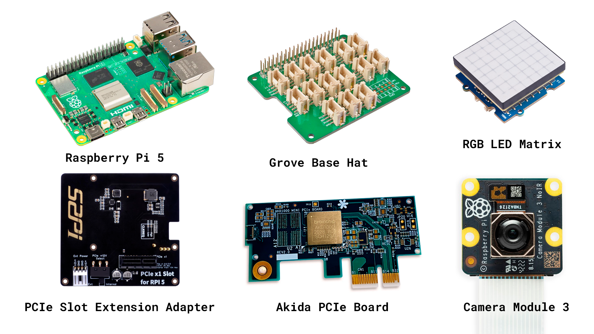

### Akida™ PCIe Board

It should be noted that the **AKD1000 Neuromorphic Hardware Accelerator** is the main component of this project thanks to some interesting characteristics that make it ideal for this use case. 

Considering that our project will end up being deployed in industrial and commercial environments, it's crucial that it can do its job efficiently and with very low energy consumption. This is where BrainChip's technology makes sense. Akida™ neuromorphic processor mimics the human brain to analyze only essential sensor inputs at the point of acquisition—processing data with unparalleled performance, precision, and economy of energy.

### Software
To develop the project model we are going to use:

- [Edge Impulse Studio](https://studio.edgeimpulse.com/)

## Hardware Setup

To fully assemble the project:

- Stack the PCIe Slot Extension Adapter Board under the Raspberry Pi and connect the flat cable accordingly ([dedicated instructions](https://wiki.52pi.com/index.php?title=EP-0219)).
- Screw the 3D-printed arm to the Raspberry Pi using the available spacers thread.
- Screw the MIPI camera to the 3D-printed arm and connect the flat cable from the camera to the CAM0 slot on the Raspberry Pi.
- Stack the Grove Base Hat on the Raspberry Pi 40 pins header.
- Connect the Grove cable from the LED Matrix to an I2C connector on the Grove Base Hat.
- Screw the cooling fan holder in the PCIe Slot Extension Adapter Board and connect it to +5V and GND on the 40 pins header (Optional).


## Raspberry Pi 5 Setup

With the Raspberry Pi Imager, flash a micro-SD card with the Raspberry Pi OS Lite (64-bit), enter the OS Customisation menu by typing `Ctrl + Shift + X` and add your login credentials, enable the wireless LAN by adding your WiFi credentials and verify that the __SSH__ connection is enabled in the __Services__ settings.

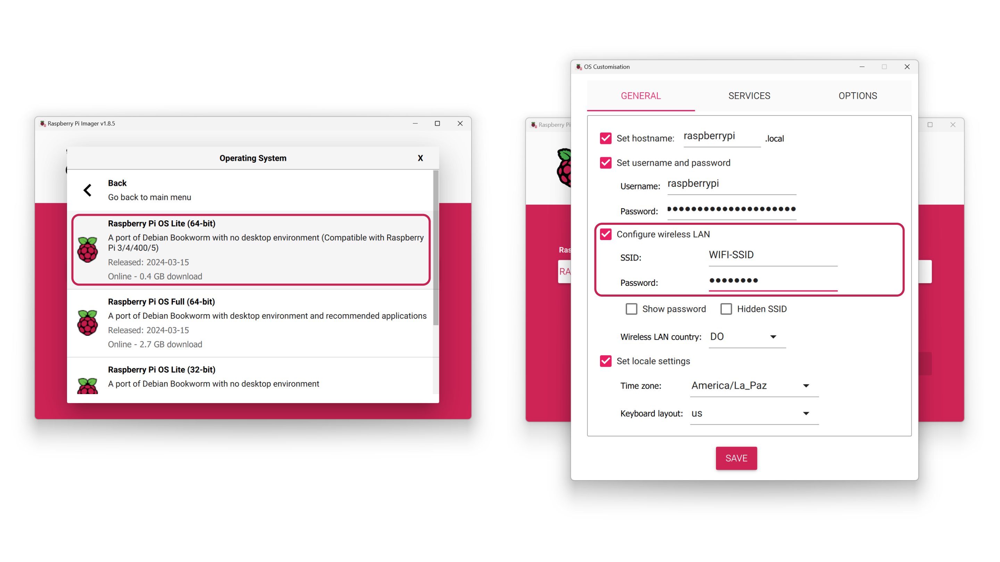

Once the micro-SD card is flashed and verified, eject it and install it on your Raspberry Pi 5 slot.

## Setting up the Development Environment

Once the system is powered up and connected to the internet (I used WiFi), you can access it by an SSH connection: you will need to know the device's local IP address, in my case, I got it from the list of connected devices of my router. 

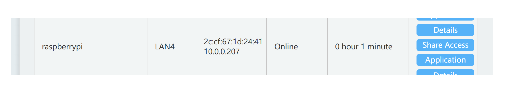

To start setting up the device for a custom model deployment, let's verify we have installed all the packages we need.

I am using Putty for the SSH connection. Log in using the set credentials, in this case, the username is **raspberrypi** and the password is **raspberrypi**.

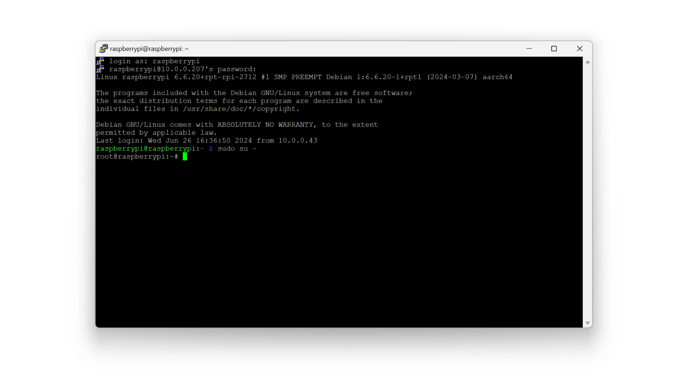

Once in, verify that the Akida PCIe board is detected:

```bash
lspci | grep Co-processor # will check if the PCIe card is plugged in correctly.
```

Create a __virtual environment__:

```bash
python3 -m venv .venv --system-site-packages #create virtual env
source .venv/bin/activate  #enter virtual env
```

Install the Akida driver:

```bash
apt-get install -y git # install git to be able to clone the driver repository
git clone https://github.com/Brainchip-Inc/akida_dw_edma # clone the repository
sudo apt install build-essential linux-headers-$(uname -r) # install system dependencies
cd akida_dw_edma # enter the repository
sudo ./install.sh # run the driver installation script
apt-get install python3-pip -y # install the pip tool
```

With the driver modules already mounted and the tools ready, install the Akida driver:

```bash
python3 -m pip install akida
```
Once installed, verify it is installed correctly and if it detects the mounted AKD1000 PCIe card.

```bash
pip show akida # prints out the driver version
akida devices # search for compatible Akida devices
```
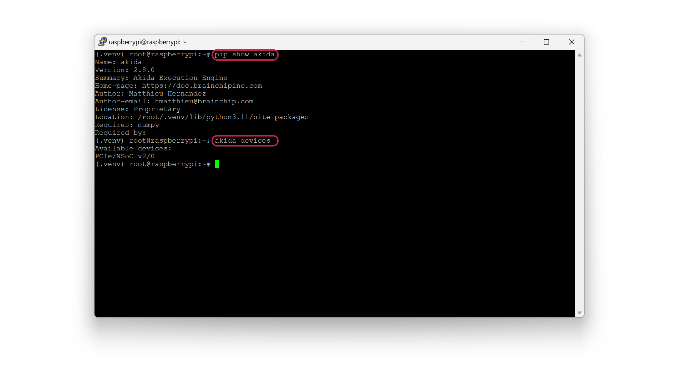

Install some specific project dependencies:

```bash
python3 -m pip install scipy
python3 -m pip install --upgrade pip setuptools wheel
pip install h5py --only-binary h5py
python3 -m pip install tensorflow
python3 -m pip install matplotlib
python3 -m pip install imageio
python3 -m pip install IPython
python3 -m pip install opencv-python
python3 -m pip install Flask
```

> **You can clone the public Edge Impulse project if you will from this [link](https://studio.edgeimpulse.com/public/425288/live).**

## Data Collection

First, we need to create an [Edge Impulse Studio](https://studio.edgeimpulse.com) account if we haven't yet, and create a new project:

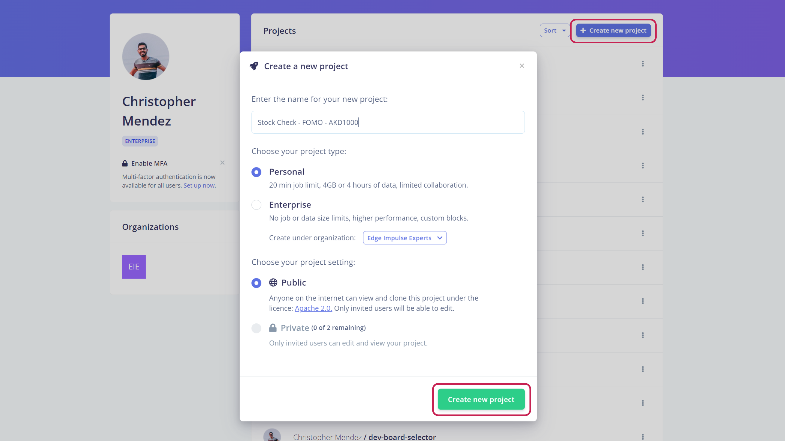

For the creation of the dataset of our model, we have several options, uploading the images from the Raspberry Pi with a USB camera or using our computer or phone. In this case, I chose to take them from the phone using its camera.


The dataset consists of 1 class in which we capture the "piece", a terminal block in this case, from several angles and perspectives. Use the __Labeling queue__ to easily label all the pieces in one frame.

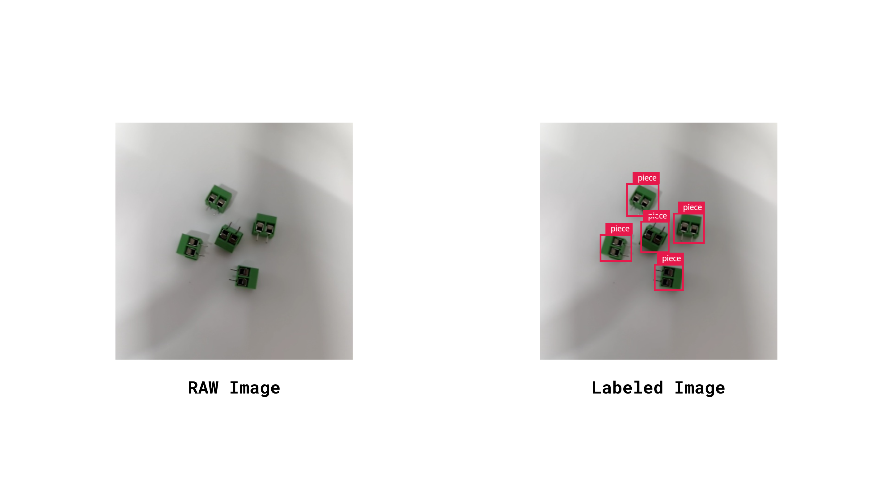

> **Taking at least +95 pictures of the piece class will let you create a robust enough model**

## Impulse Design

After having the dataset ready, it is time to define the structure of the model.

In the left side menu, we navigate to **Impulse design** > **Create impulse** and define the following settings for each block, respectively:

### Input block (Image data):

- Image width: 224
- Image height: 224
- Resize mode: Fit shortest axis

### Processing block (Image):

Add an __Image__ processing block since this project will work with images as inputs.

### Learning block (BrainChip Akida)

We are going to use an __Object Detection__ learning block developed for Brainchip Akida hardware.

Finally, we save the **Impulse design**, it should end up looking like this:

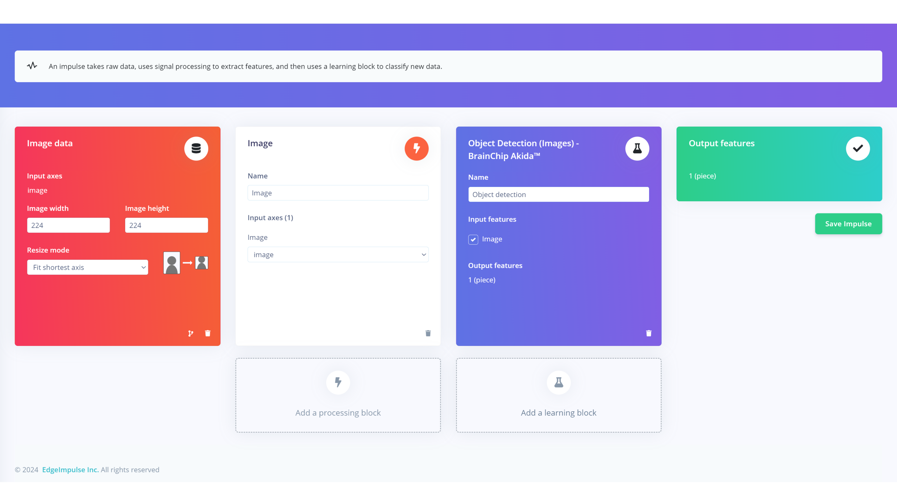

## Model Training

After having designed the impulse, it's time to set the processing and learning blocks. 

In the **Image** processing block, we set the "Color depth" parameter to **RGB**, click on **Save parameters** and then **Generate features**. 

In the **Object Detection** learning block, define the following settings:

- Number of training cycles: 60
- Learning rate: 0.0005 

In the Neural network architecture, select the **Akida FOMO AkidaNet(alpha=0.5 @224x224x3)**.

Click on the __Start training__ button and wait for the model to be trained and the confusion matrix to show up.

### Confusion Matrix 

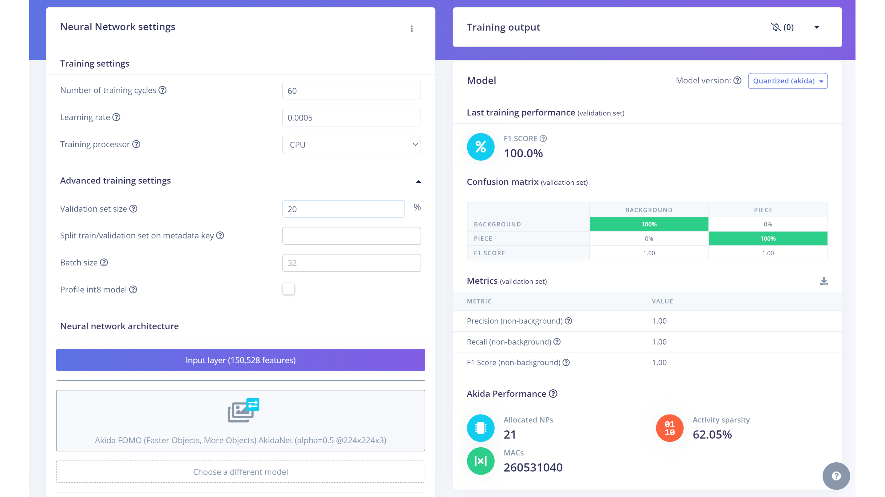

The results of the confusion matrix can be improved by adding more samples to the dataset. After some try and error testing different models I was able to get one stable and robust enough for the application.

## Project Setup

To be able to run the project, we need to go back to our SSH connection with the device and clone the project from the [Github repository](https://github.com/mcmchris/brainchip-inventory-check.git), for this, use the following command:

```bash
git clone https://github.com/mcmchris/brainchip-inventory-check.git
```

Enter the repository directory:

```bash
cd brainchip-inventory-check
```
We are going through the content in detail later.

> **It is recommended that you install Edge Impulse for Linux following this [link](https://docs.edgeimpulse.com/docs/edge-ai-hardware/cpu/raspberry-pi-5#id-2.-installing-dependencies) or the steps below:**

```bash
sudo apt update
curl -sL https://deb.nodesource.com/setup_20.x | sudo bash -
sudo apt install -y gcc g++ make build-essential nodejs sox gstreamer1.0-tools gstreamer1.0-plugins-good gstreamer1.0-plugins-base gstreamer1.0-plugins-base-apps
sudo npm install edge-impulse-linux -g --unsafe-perm
```
Then to update npm packages:

```bash
sudo npm install -g npm@10.8.1
```
```bash
edge-impulse-linux --version
```
It should show you the installed version (1.8.0 at writing time)

To activate the MIPI camera support run the following command:

```bash
sudo raspi-config
```

Use the cursor keys to select and open Interfacing Options, then select Camera, and follow the prompt to enable the camera. Reboot the Raspberry Pi.


## Deployment

> **If you want to test the model as it is without any modification, jump to the [Run Inferencing](#run-inferencing) section.**

Once the project is cloned locally in the Raspberry Pi, you can download the project model from Edge Impulse Studio by navigating to the **Dashboard** section and downloading the **MetaTF** `.fbz` file.


Once downloaded, from the model download directory, open a new terminal and copy the model to the Raspberry Pi using `scp` command as follows:

```bash
scp <model file>.fbz raspberrypi@<Device IP>:~ # command format
scp akida_model_2.fbz raspberrypi@10.0.0.207:~ # actual command in my case
```
> _You will be asked for your Linux machine login password._

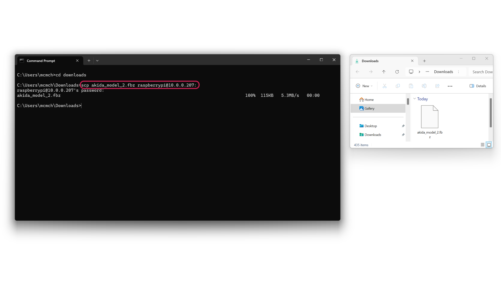

Now, the model is on the Raspberry Pi local storage `(/home/raspberrypi)` and you can verify it by listing the directory content using `ls`.

Move the model to the project directory with the following command `(from /home/raspberrypi)`:

```bash
mv akida_model_2.fbz /root/brainchip-inventory-check/model
```

Here we have the model on the project directory, so now everything is ready to be run.

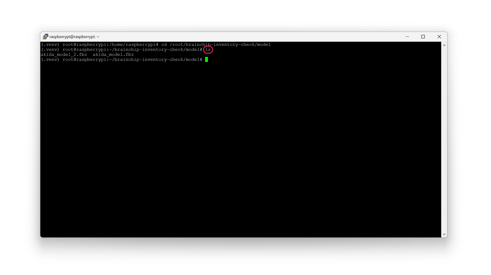

## Run Inferencing

In the project directory, there are several script options with the following characteristics:

- `inventory.py`: is the original program, it uses a MIPI camera feed to run the inference. 
- `stock.py`: is an optimized version of the original program, also uses a MIPI camera but the object markers are bigger.
- `low-power.py`: is a lower program but with half of energy consumption, and also uses a MIPI camera.
- `usb-inference.py`: is a version that uses a USB camera instead of a MIPI camera (no Matrix control).

There are other auxiliary scripts for testing purposes:

- `mipi_inference.py`: this program runs the FOMO model without controlling the LED Matrix.
- `matrix_test.py`: this program tests the LED matrix displaying colors and patterns.

To run the project, type the following command:

```bash
python3 <your prefered program>
# to run the original program:
python3 inventory.py
```

> **The .fbz model is hard coded in the script, so if you want to use the custom one you downloaded, update the "model_file" variable in the python script**.

The project will start running and streaming a live view of the camera feed plus showing you in the LED matrix the location of detected objects.

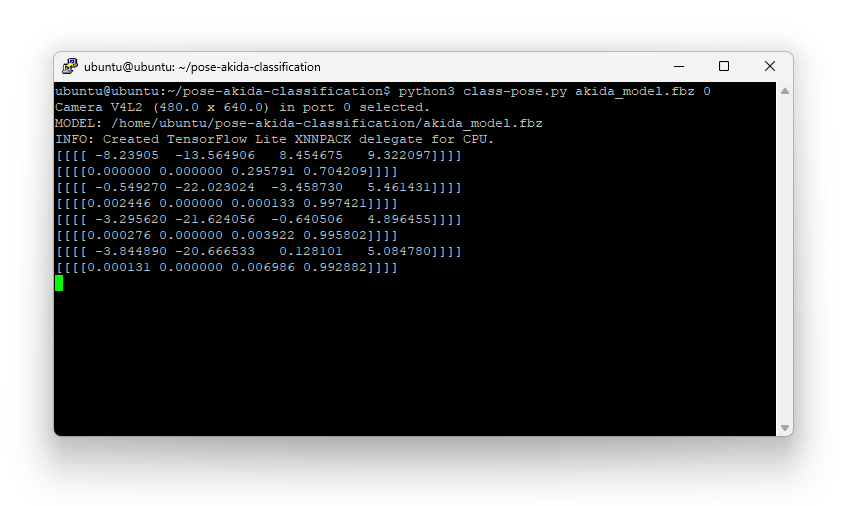

To watch a preview of the camera feed open your favorite browser and enter:

`<Raspberry IP>:8080`

Finally, you will be able to see the camera preview alongside the FOMO inference results, object count, frames per second and energy consumption.

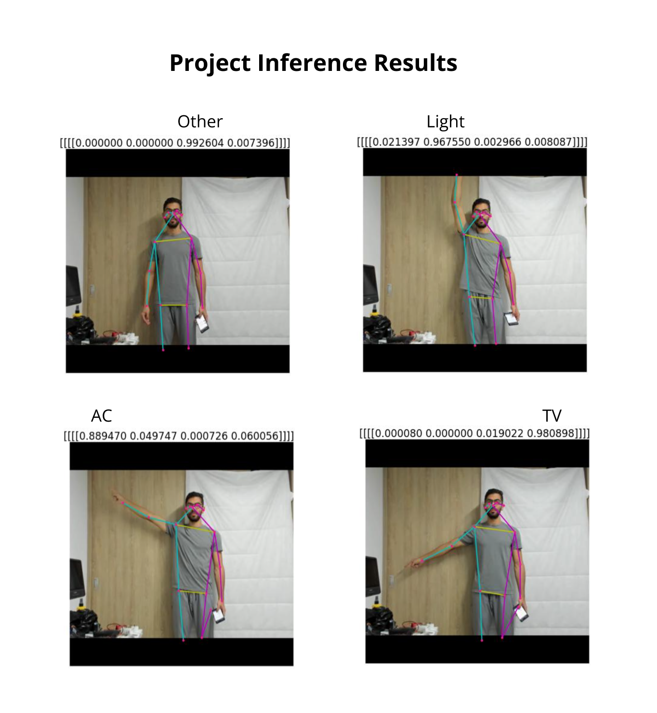

## Demo

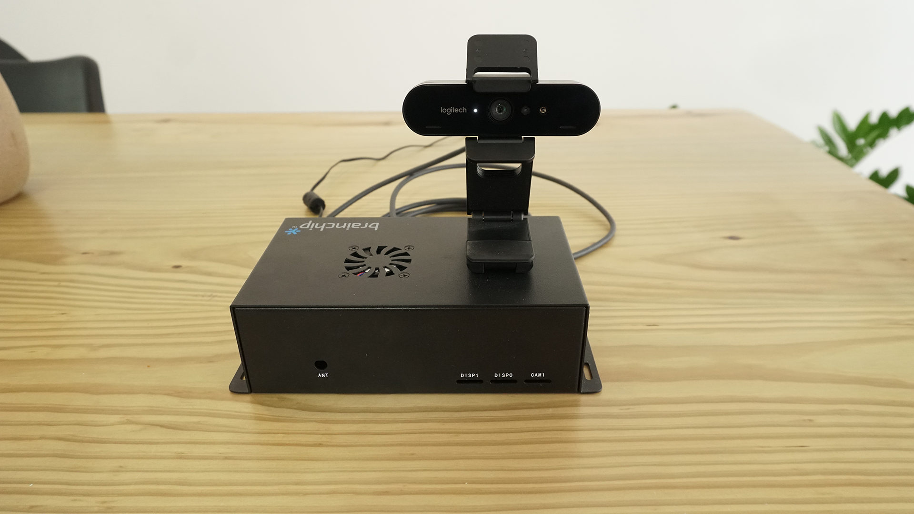

Here I show you the whole project working and controlling appliances when they are pointed.



## Conclusion

This project leverages the Brainchip Akida Neuromorphic Hardware Accelerator to propose an innovative solution to home automation. It can be optimized to work as a daily used gadget that may be at everyone's house in the near future.
