# Getting Started with the Edge Impulse Nvidia TAO Pipeline - Renesas EK-RA8D1

Created By: Peter Ing

Public Project Link: [https://studio.edgeimpulse.com/public/568291/latest](https://studio.edgeimpulse.com/public/568291/latest)

## Introduction

The Renesas RA8 series is the first product to implement the Arm Cortex-M85, a high-performance MCU core tailored for advanced AI and machine learning at the edge. Featuring Arm Helium technology and enhanced ML instructions, it delivers up to 4x the ML performance of earlier M-series cores. With high clock speeds, energy efficiency, and TrustZone security, it's ideal for tasks like speech recognition, anomaly detection, and image classification on embedded devices. 

Edge Impulse includes support for Nvidia TAO transfer learning and deployment of Nvidia Model Zoo models to the Renesas RA8D1.

This project provides a walkthrough of how to use the Renesas EK-RA8D1 Development kit with Edge Impulse using an Nvidia TAO-enabled backend to train Nvidia Model Zoo models for deployment onto the EK-RA8D1. By integrating the EK-RA8D1 with Edge Impulse's Nvidia TAO training pipeline, you can explore advanced machine learning applications and leverage the latest features in model experimentation and deployment.

## Hardware 

Renesas EK-RA8D1 - [Evaluation Kit for RA8D1 MCU Group](https://www.renesas.com/en/products/microcontrollers-microprocessors/ra-cortex-m-mcus/ek-ra8d1-evaluation-kit-ra8d1-mcu-group?srsltid=AfmBOoovp-039RtY9ng5rk2nFEVNOQuruTXKineI1JmVl9tDr64N7Ao2)

## Platform

Edge Impulse [Visit](https://edgeimpulse.com)

## Software

Edge Impulse CLI [Download](https://docs.edgeimpulse.com/docs/edge-impulse-cli/cli-installation)
JLink Flashing Tools [Download](https://www.segger.com/downloads/jlink)
Edge Implulse Firmware for EK-RA8D1 [Download](https://cdn.edgeimpulse.com/firmware/renesas-ek-ra8d1.zip)

## Getting Started

### Renesas EK-RA8D1 

Renesas supports developers building on the RA8 with various kits, including the EK-RA8D1, a comprehensive evaluation board that simplifies prototyping. 

As part of the Renesas Advanced (RA) series of MCU evaluation kits, the EK-RA8D1 features the RA8 Cortex-M85 MCU which is the latest high-end MCU from Arm, superseding the Cortex M7.  The Cortex M85 is a high-performance MCU core designed for advanced embedded and edge AI applications. It offers up to 4x the ML performance of earlier Cortex-M cores, powered by Arm Helium technology for accelerated DSP and ML tasks.

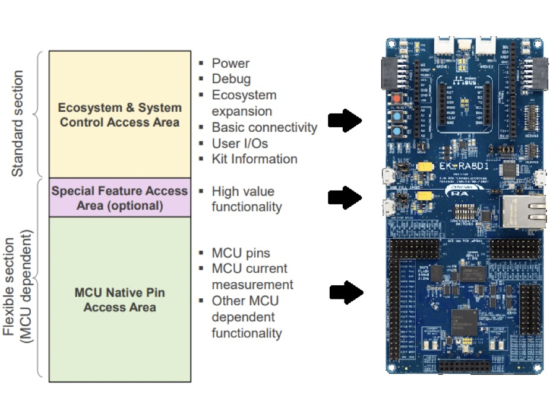

The Renesas EK-RA8D1 evaluation kit is a versatile platform designed for embedded and AI application development. It features USB Full-Speed host and device support with 5V input via USB or external power supply, along with onboard debugging through Segger J-Link® and support for ETM, SWD, and JTAG interfaces. Developers can utilize 3 user LEDs, 2 buttons, and multiple connectivity options, including Seeed Grove® (I2C & analog), Digilent Pmod™ (SPI & UART), Arduino™ Uno R3 headers, MikroElektronika™ mikroBUS, and SparkFun® Qwiic® (I2C). An MCU boot configuration jumper further enhances flexibility, making the EK-RA8D1 ideal for rapid prototyping and testing. 

The kit also features a camera and full color LCD display, making it ideal for the development and deployment of edge AI solutions allowing on-device inference results to be rendered to the onboard LCD.

The EK-RA8D1 is an officially supported target in Edge Impulse, which means it can be used to collect data directly into Edge Impulse. Follow [this guide](https://docs.edgeimpulse.com/docs/edge-ai-hardware/mcu/renesas-ek-ra8d1) to enable the EK-RA8D1 to connect to a project.

## Edge Impulse & Nvidia TAO

### Create Edge Impulse Project

To get started create a project and be sure to select Enterprise or Professional Version as the Nvidia TAO Training Pipeline requires the either an Professional or Enterprise subscription. For more info [see here](https://edgeimpulse.com/pricing). 

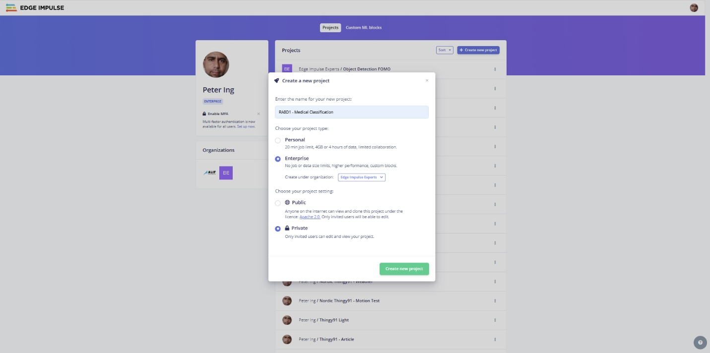

### Connect your device

There two ways to connect the board either using the Edge Impulse CLI or directly from within the Studio UI.
To access via the CLI run the command edge-impulse-daemon and provide login credentials and then select the appropriate Studio project to connect your board.

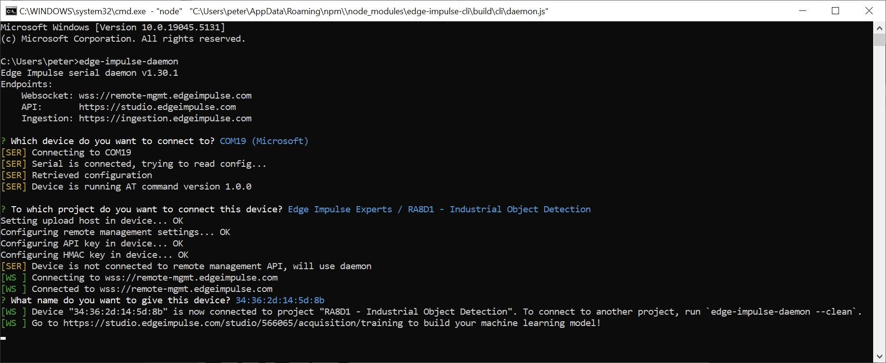

Alternatively clicking the Data acquisition menu item in the left navigation bar presents the data collection page. Select 320x240 to get the maximum resolution out of the camera on the EK-RA8D1 when capturing samples. 

Edge Impulse will ask you if the project is object detection project. Select No to configure the project as object detection alternatively selecting no configures the project as a Image classification project when using image data. The label name can be set to anything when using object detection.

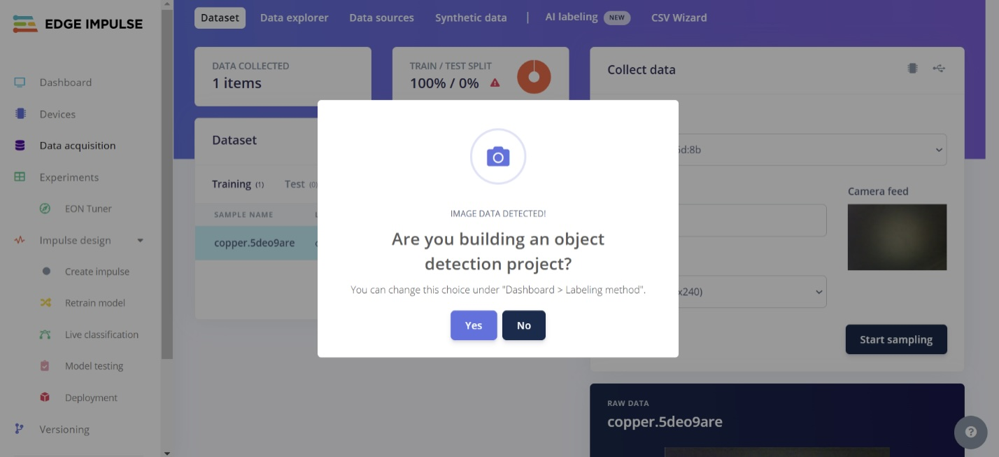

Alternatively go the Dashboard page by clicking Dashboard on the left navigation and select One label per data item from the Labeling method dropdown

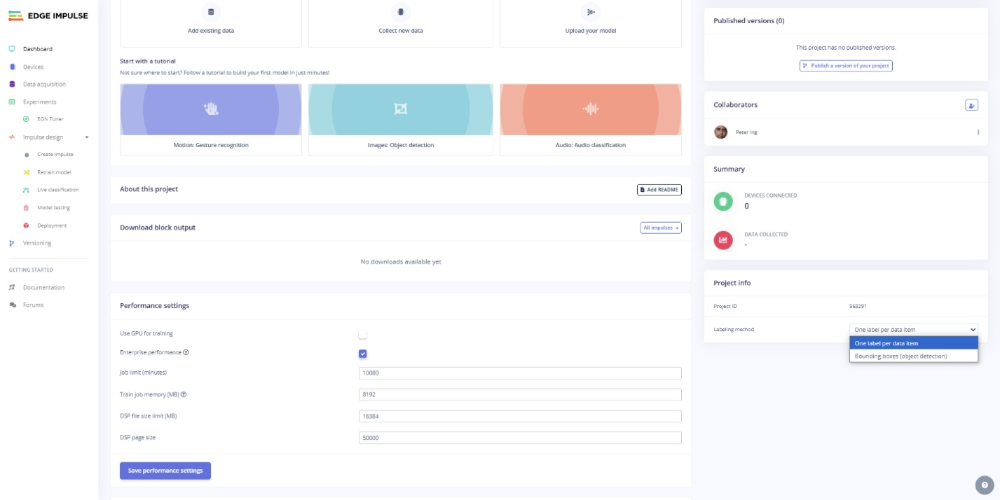

Capture sample images by presenting objects to the camera that you wish to use detect and click Start sampling button to capture the an a full color image from the board.

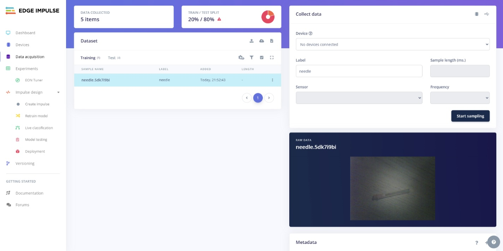

Different types or classes of object can be captured and these can be added by changing the label string in the text Label text box. For example another class called needle_sealed is created by setting the label to this name and then capturing pictures of the sealed needles.

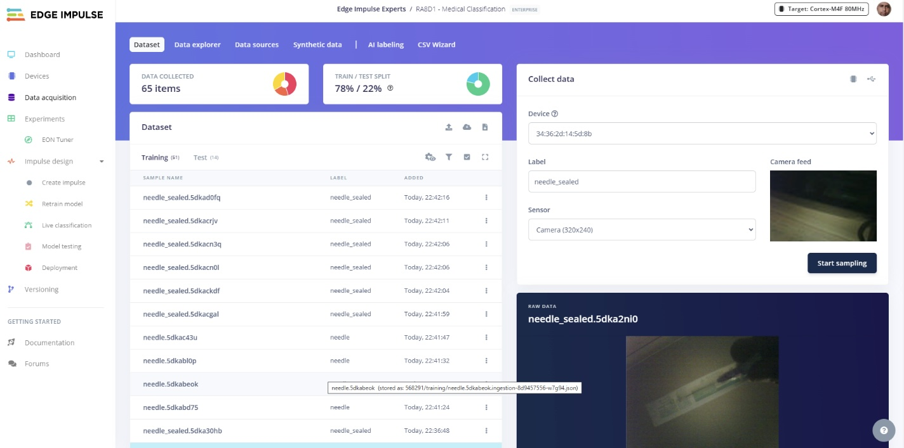

Once all images are annotated you can balance your data so that you split your data set between a training and test set. This is done by selecting the Dashboard from the navigation pane one the left and then scrolling down to find and click the Perform train / test split button. Edge Impulse will try to get as close to a 80/20 split as possible depending the size of your dataset.

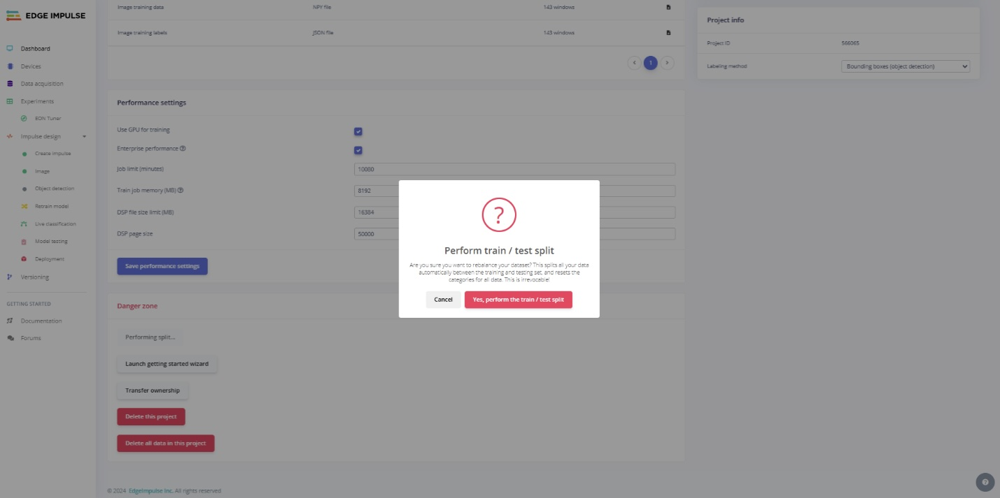

The data split can be seen at the top of the Data acquisition page where you can not only see the split of data items collected by label as a pie chart under the DATA COLLECTED element but also the resulting split under the TRAIN / TEST SPLIT element.

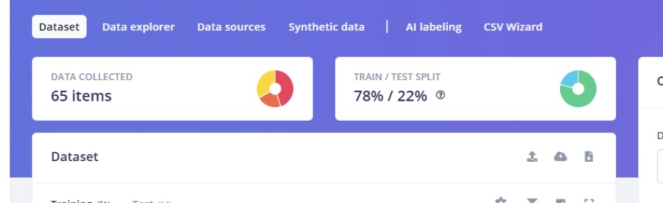

### Create Impulse

The next step is to create a new Impulse which is accessed from the Create Impulse menu. Select the Renesas RA8D1 (Cortex M85 480Mhz) as the target, doing so automatically targets the EK-RA8D1 which is the RA8D1 based board supported by Edge Impulse.

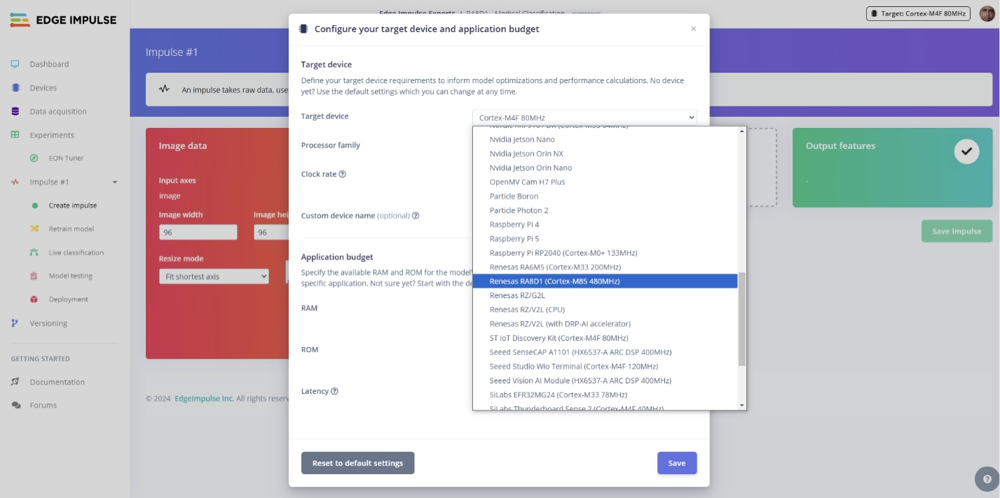

Set the image width and height to 224 x 224 to match the pretrained backbone dimensions in Nvidia TAO Model Zoo:

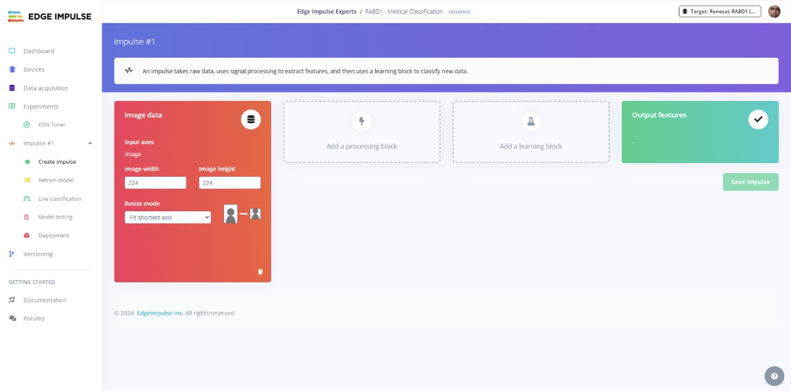

### Feature Generation

Classification requires an Image processing block this is added by clicking Add a processing block and then selecting Image from the options presented

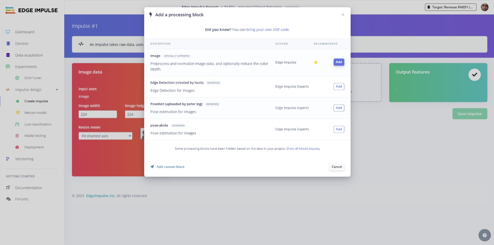

Once the Image processing block is added the Generic Transfer Learning Block needs be added by selecting Add a learning block and then choosing the first option Transfer Learning (Images).  Nvidia TAO is based on transfer learning so selecting this block is the first step towards activating the Nvidia TAO classification pipeline in the backend.

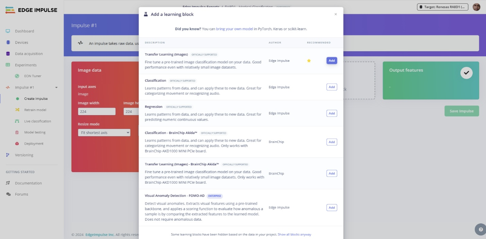

The resulting Impulse should look as follows before proceeding.

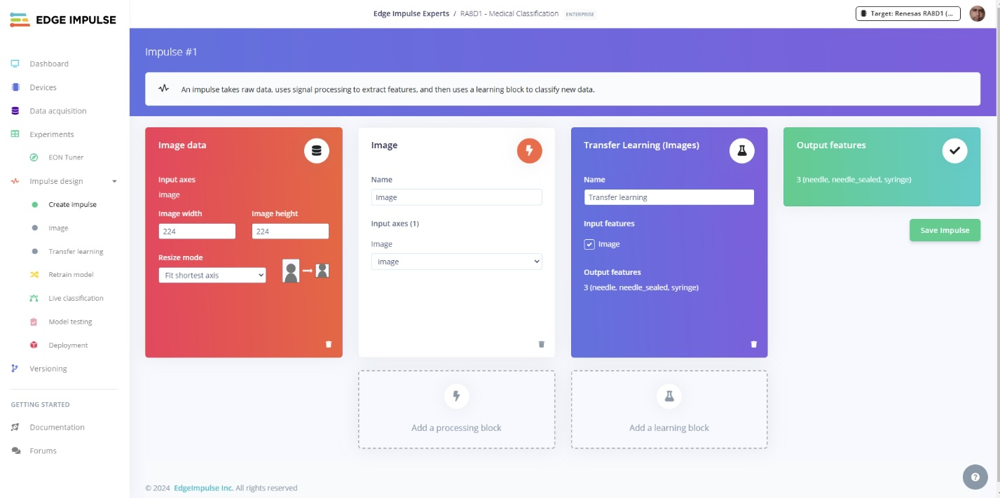

The next step is to generate the raw features that will be used to train the model. First click Save Impulse then select the Image submenu from the Impulse Design menu in the left hand navigation to access the settings of the Image processing block.

In the Parameters tab, leave the color depth as RGB as the TAO Models use 3 channel RGB models:

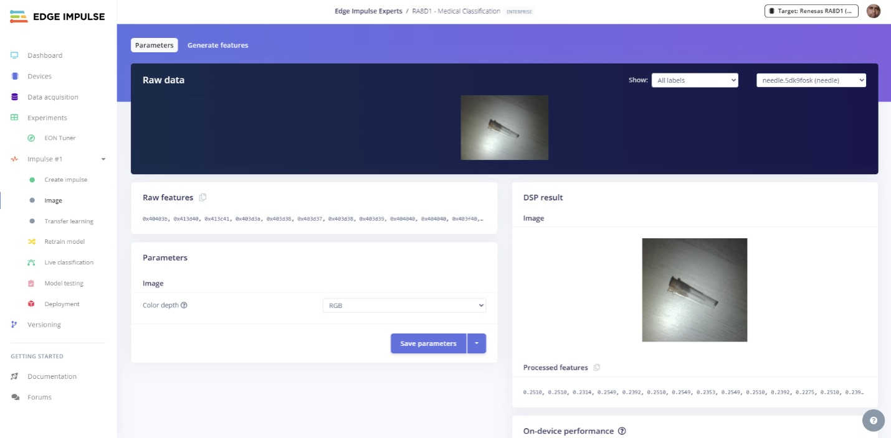

Under the Generate features tab simply click the Generate features button to create the scaled down 224x224 images that will be used to with TAO to train and validate the model.

The process will take a few seconds to minutes depending on the dataset size. Once done the results of the job are shown and the reduced images are stored in the backend as features to be passed to the model during training and validation.

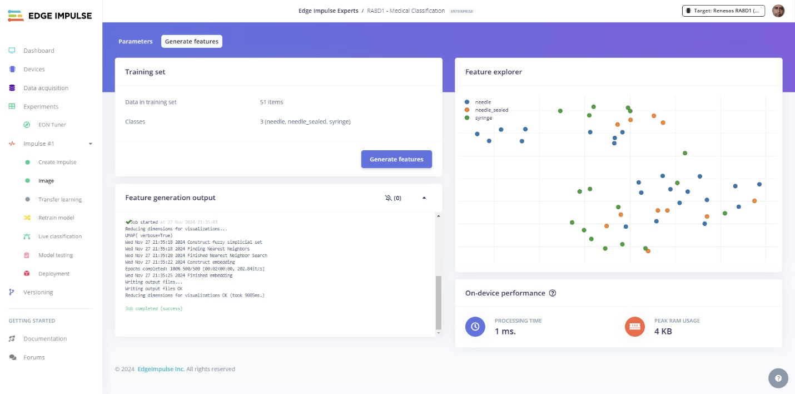

### Nvidia TAO Classification

Once the image features are done a green dot appears next to Images in the Impulse design navigation the Transfer Learning Submenu is activated and can be accessed by clicking Transfer learning in the navigation pane under Impulse design, this takes you to the configuration area of the learning block.

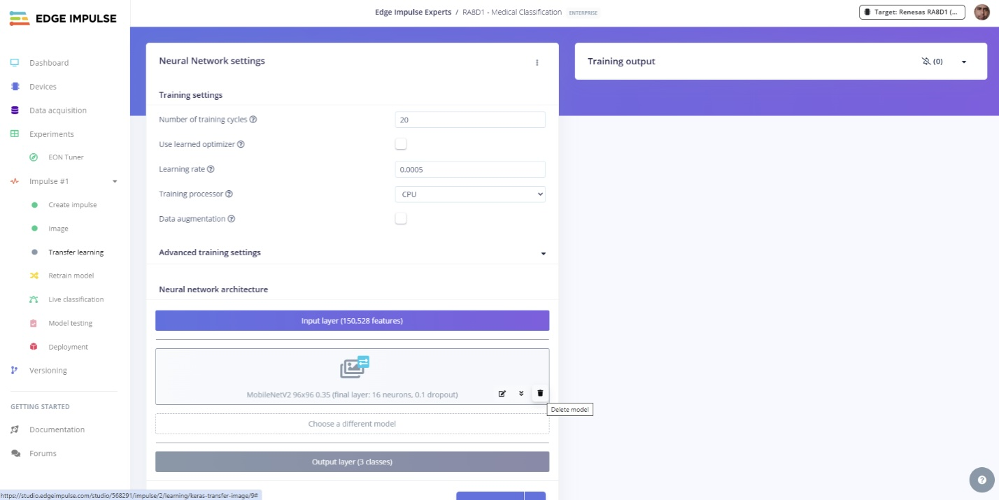

To activate Nvidia TAO in the project the default MobileNetV2 model architecture needs to be deleted by clicking the trash can Delete model icon on the lower right corner of the model. 

Once this is done you will see there is no model architecture activated for the project and just button titled Choose a different model will be shown in place of the deleted MobileNet model.

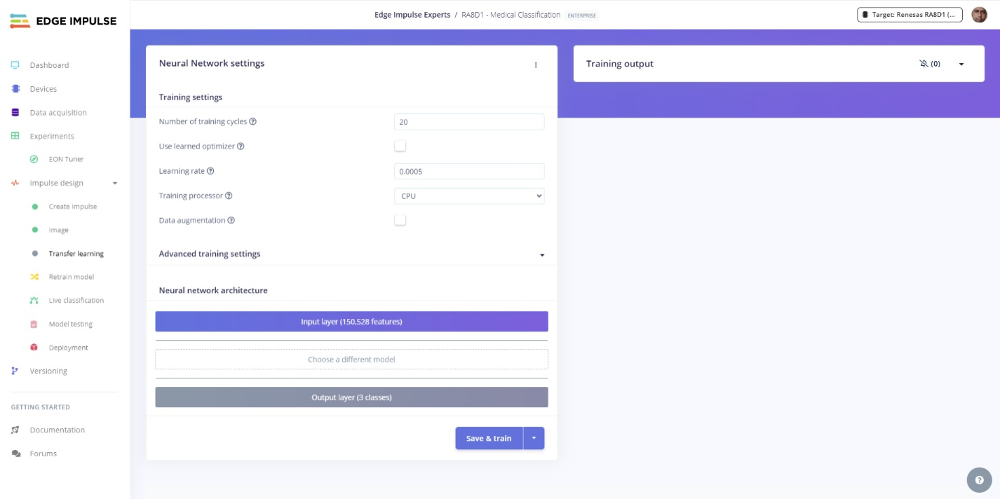

Clicking the Choose a different model button will present a list of model architectures available in Edge Impulse. Since the project is configured as Classification, only classification model architectures are available. To access the Nvidia TAO Classification Model scroll down to the bottom.

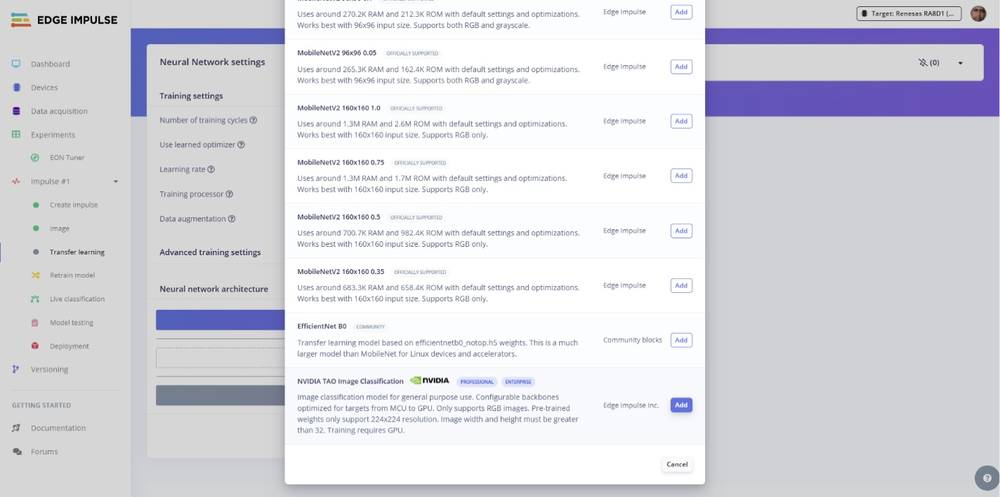

The Nvidia TAO models are only available under Professional and Enterprise subscriptions as shown by the labels. For this project we are going to use NVIDIA TAO Image Classification. Selecting any of the Nvidia TAO models like this activates the Nvidia TAO training environment automatically behind the scenes in the project.

### Training

Once the Nvidia TAO Classification model is selected all the relevant hyperparameters are exposed by the GUI. The default training settings are under the Training settings menu and the Advanced training settings menu can be expanded to show the full set of parameters specific to TAO.

All of the relevant settings available in TAO including Data augmentation and backbone selection are available from the GUI. The data augmentation features of TAO can be accessed by expanding the Augmentation settings menu. Backbone selection is accessed from the Backbone dropdown menu and for this project we will be using the MobileNet v2 (800K params) backbone.

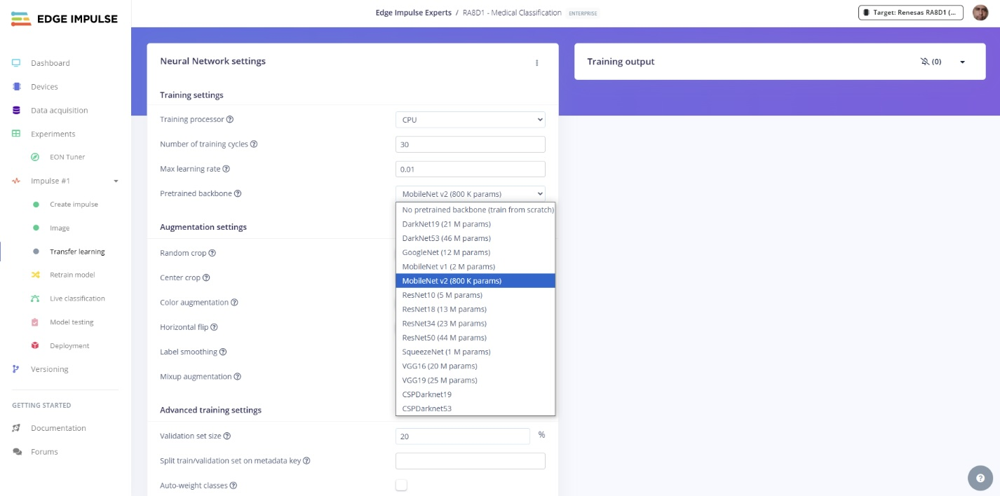

Its also essential to select GPU for training as TAO only trains on GPU’s. Also set the number of training cycles (epochs) to a higher number than the default. Here we start with 300.

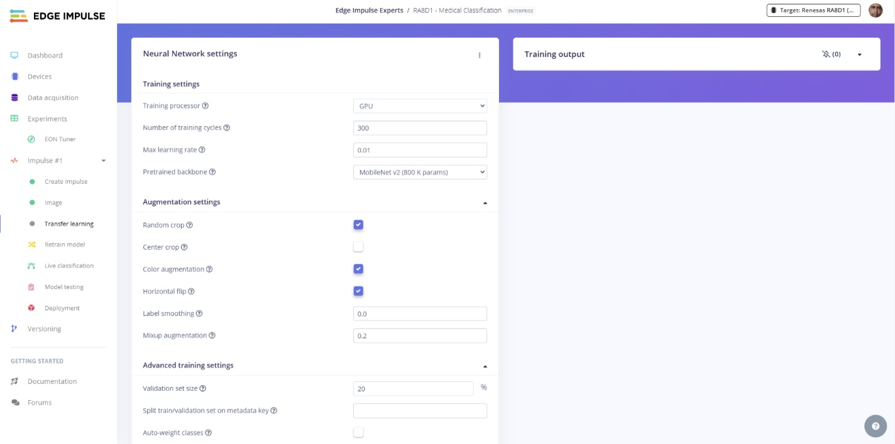

All that’s left to do is click Save and train button to commence training. This can take from 1 to several hours depending the dataset size and other factors such as backbone etc.

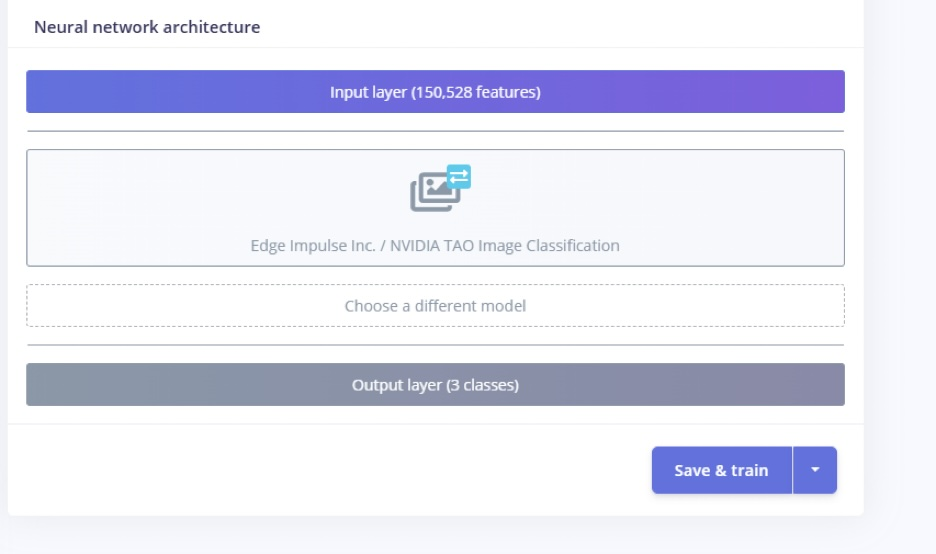

Once training is completed the results are shown:

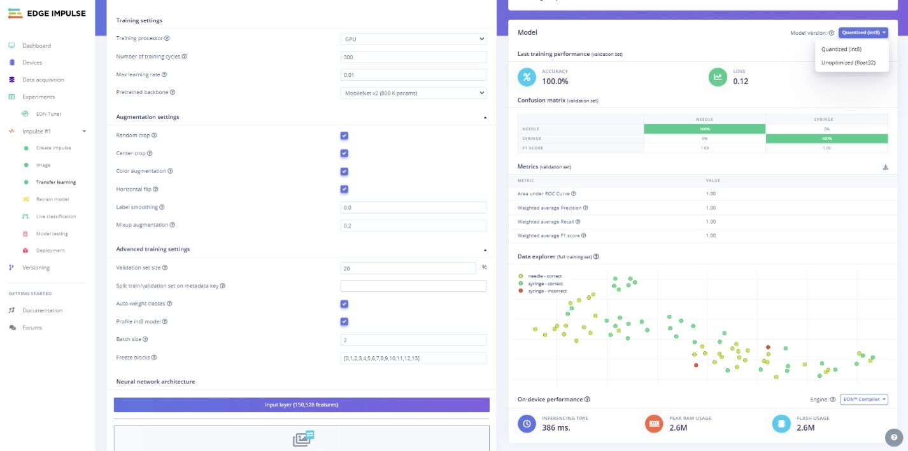

The accuracy and confusion matrix, latency and memory usage are shown for both Unoptmized (float32) and Quantized (int8) which will be used with the EK-8AD1. Take note of the PEAK RAM USAGE and FLASH USAGE statistics at the bottom. These indicate if the model will fit within RAM and ROM on the target. 

### Model Testing

Before deploying the model to the development kit first the model can be tested by accessing the Live classification menu on the left navigation, clicking the Classify all button runs the dataset through the model and shows the results on the right:

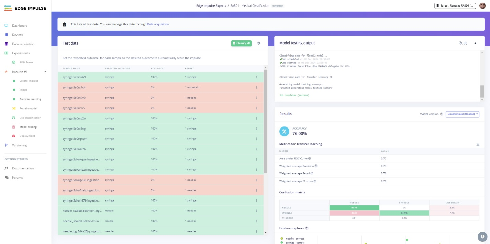

The results of are visible in the right pain and can give a good indication of the model performance against the captured dataset.

The Model testing page allows you to perform realtime classification using uploaded files by selecting a file from the Classify existing test sample dropdown menu and clicking the Load sample button.

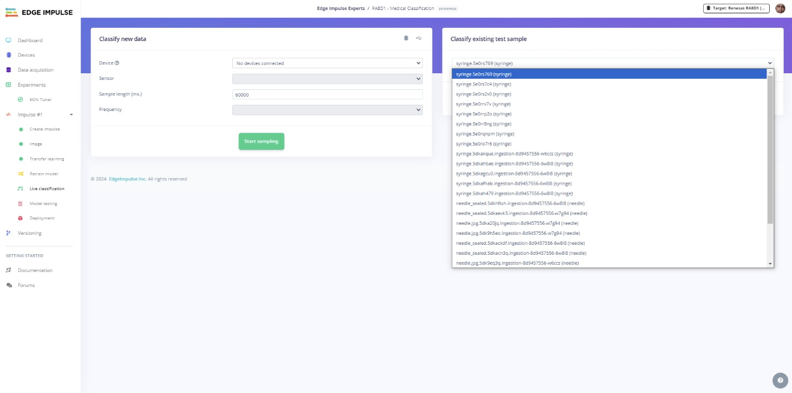

The results shown when doing this are from the classification being performed in the Edge Impulse back end and not on the device.

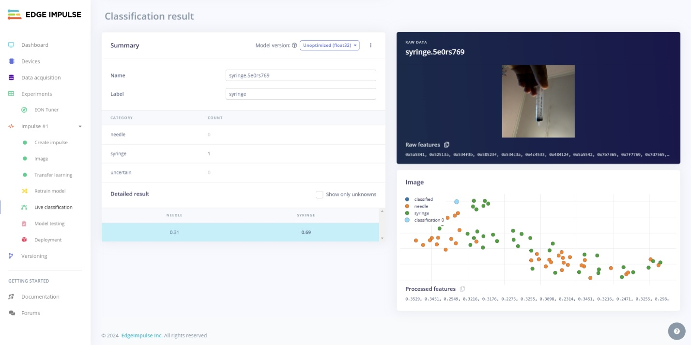

If you wish to test the camera on the EK-RA8D1 but still run the model in the Edge Impulse backend, you can connect the camera using the edge-impulse-daemon CLI command to connect the camera just as you would when you do perform data acquisition.

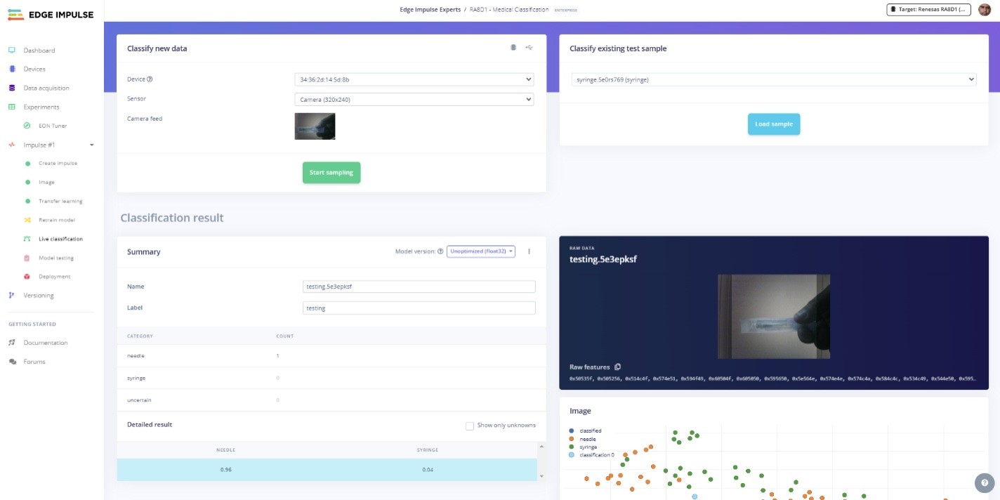

You can iteratively improve the model by capturing more data and choosing the Retrain model sub menu item which takes you to the retrain page where you can simply click the Train model button to retrain the model with the existing hyperparameters.

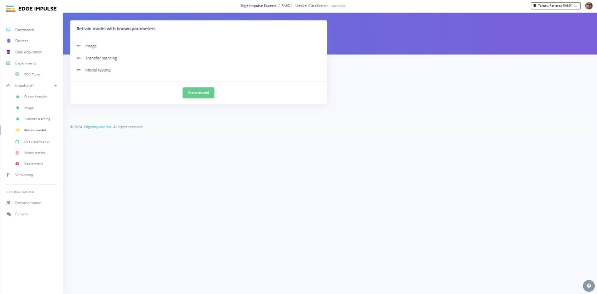

## Deployment

To test the model directly on the EK-RA8D1go to the Deployment page by clicking the Deployment sub menu item in the left navigation. In the search box type Renesas.

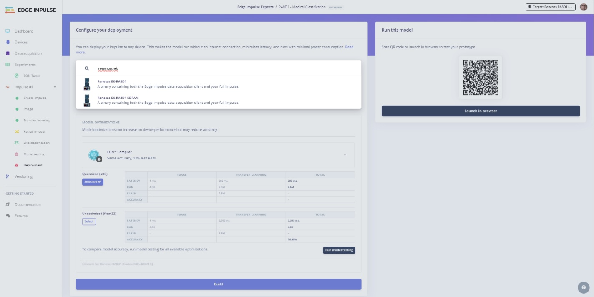

The drop down menu will filter out all the other supported boards and give you two options for the EK-RA8D1. The RA8D1 MCU itself has 2Mb of FLASH for code storage and 1Mb of RAM integrated. The EK-RA8D1 development kit adds 64Mb of external SDRAM and 64Mb of external QSPI FLASH to support bigger models.

The Quantized (int8) model should be selected by default and the RAM and ROM usage is shown which is what you would have seen in the training page when training completed.

Renesas EK-RA8D1 target – This builds binary for when RAM and ROM usage fits within the RA8D1 MCU’s integrated RAM and FLASH memory. 

Renesas EK-RA8D1 SDRAM target – This builds a binary that loads the model into the external SDRAM when the model is over 1Mb. (Note there is a slight performance penalty as the external RAM has to be accessed over a memory bus and is also SDRAM vs the internal SRAM)

When you click the Build button the backend builds the project and generates a zip archive containing the prebuild binary and supporting files which downloads automatically when completed.  

This archive contains the same files as the Edge Impulse firmware you would have downloaded when following this guide at the begging of the project when you were connecting your board for the first time. The only difference is that the firmware (.hex) now contains your model vs the default model.
To flash the new firmware to your board replace the contents of the folder where you have the firmware with the contents of the downloaded archive.

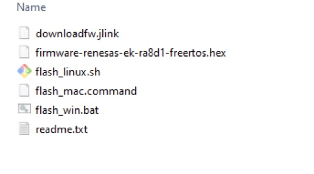

Note you need to make sure have connected the USB cable to the JLink port (J10).

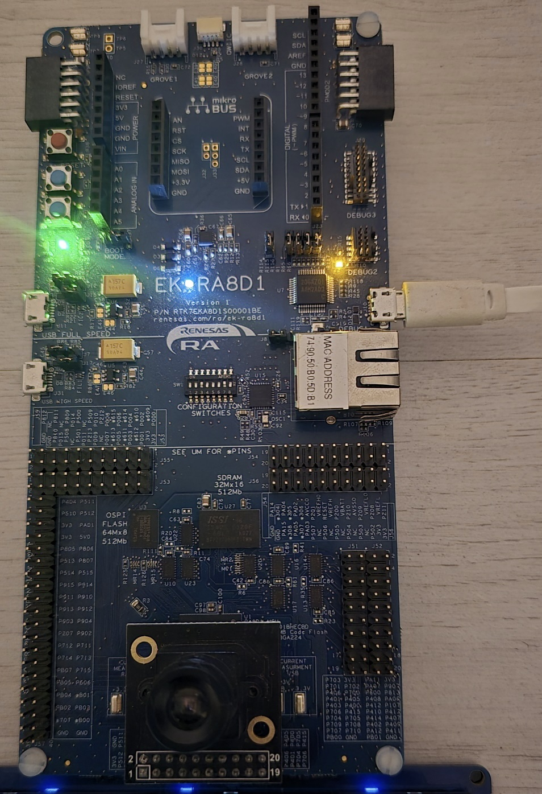

Run the appropriate command to flash the firmware to the board.

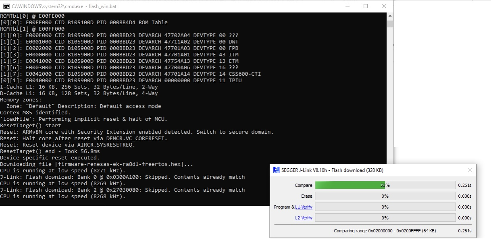

To test the performance of the image classification on the board and see inference latency and DSP processing time, connect the USB cable to J11.

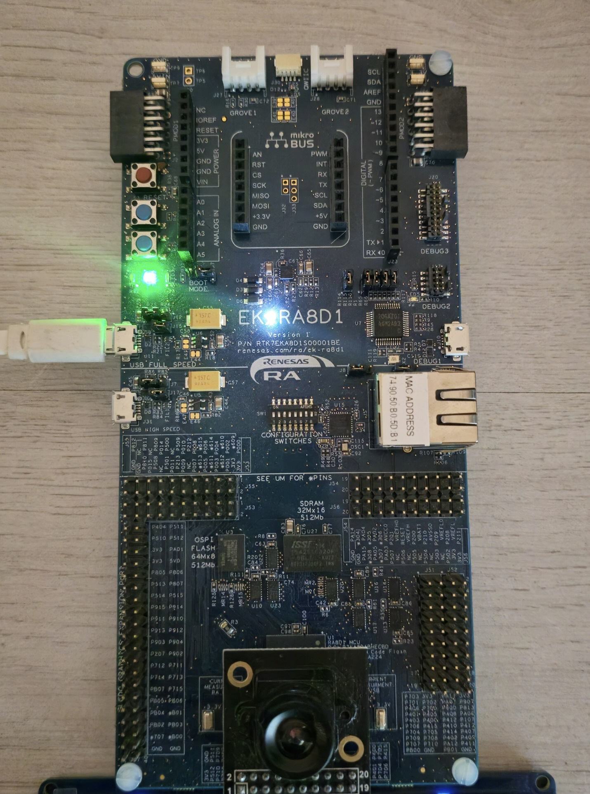

Then run the run the `edge-impulse-run-impulse` CLI command:

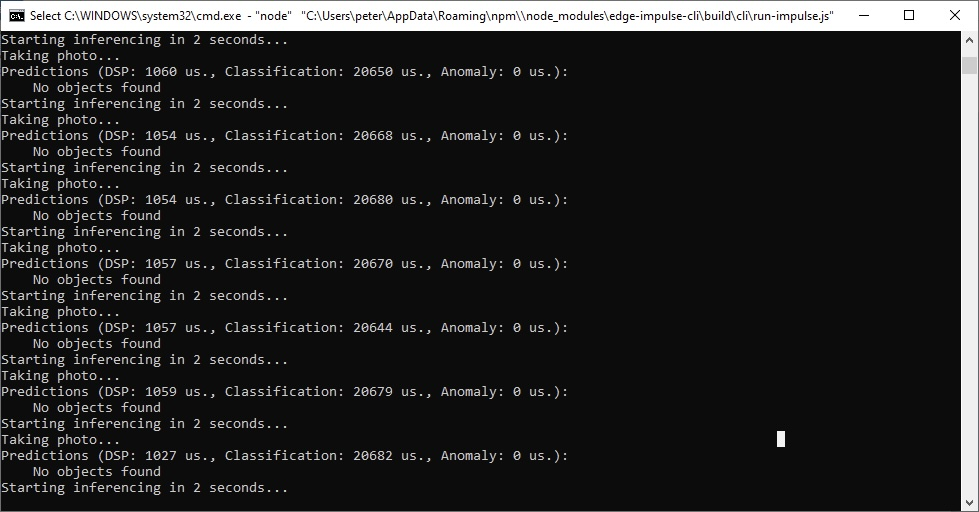

The inference execution time and results are then shown in the cli.

## Conclusion

In this guide we have covered the step by step process of using Edge Impulse’s seamless integration of Nvidia TAO’s transfer learning image classification model from Nvidia’s model zoo and to deploy this model to the Renesas EK-RA8D1 Arm Cortex M85 MCU development kit. In this way we have shown how Edge Impulse makes it possible to use Nvidia image classification models on an Arm Cortex M85 MCU.
