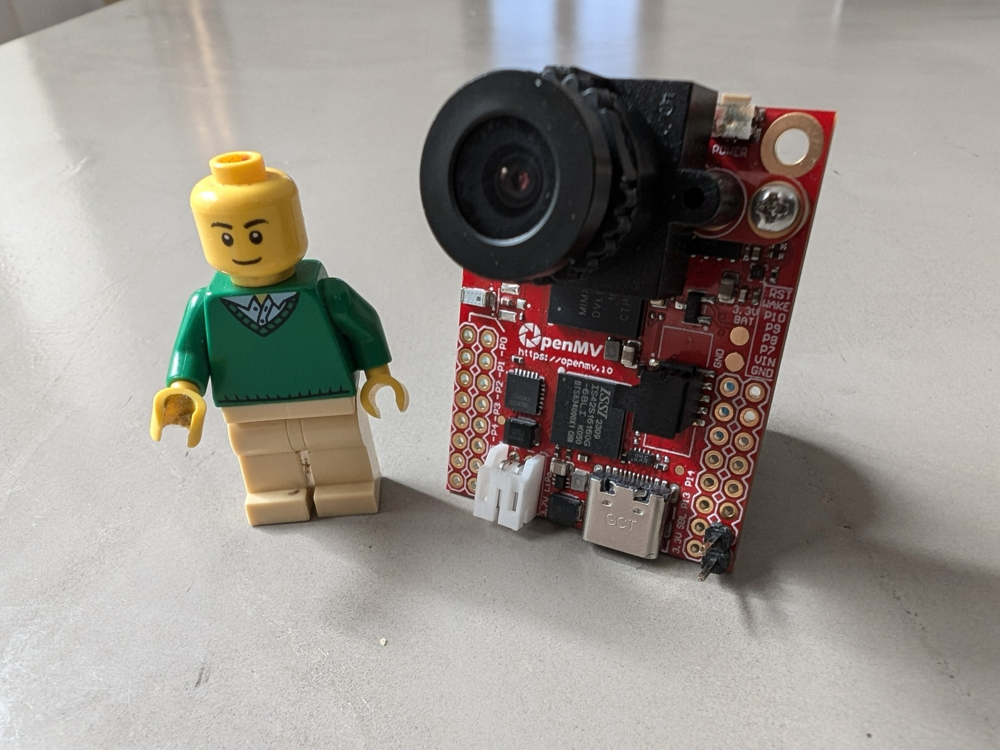
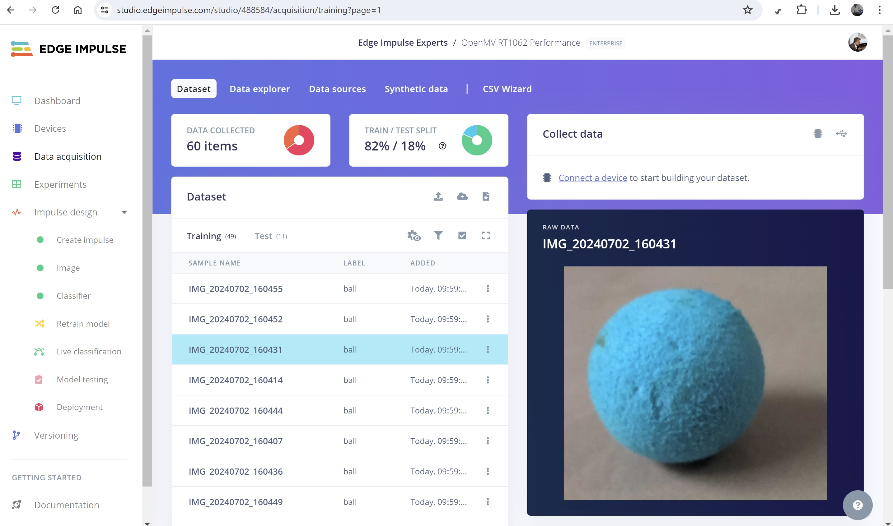
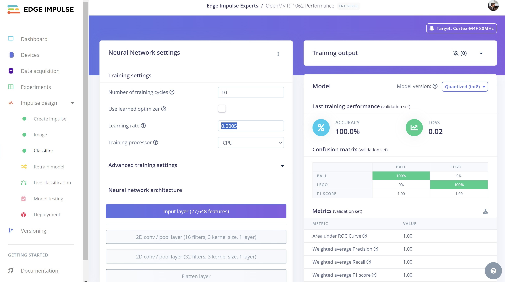
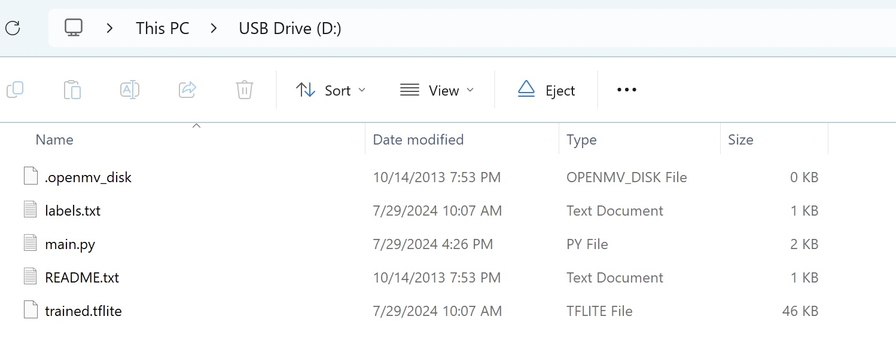
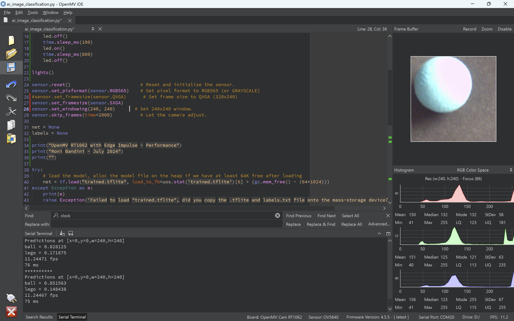
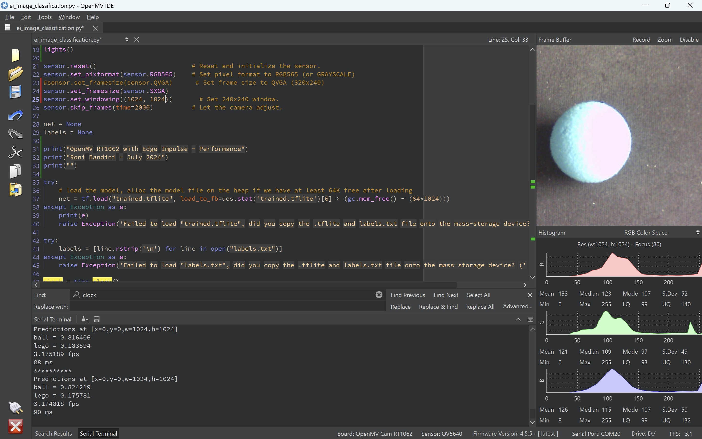
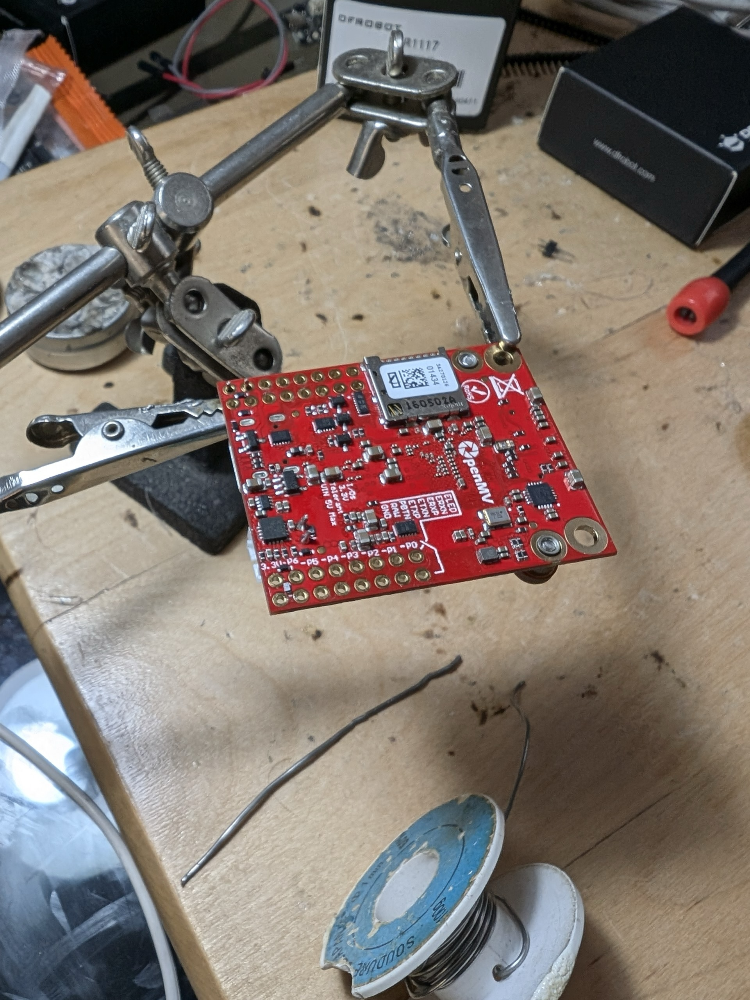
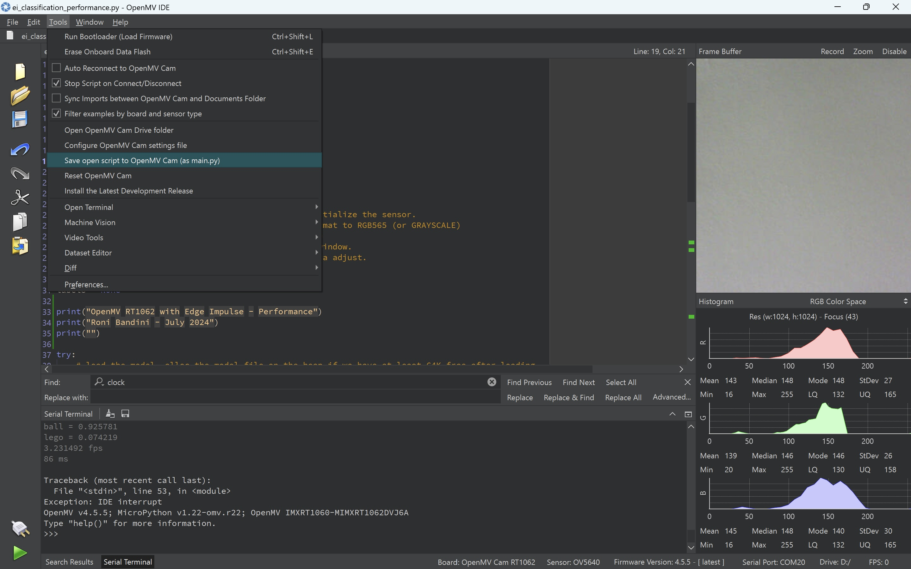
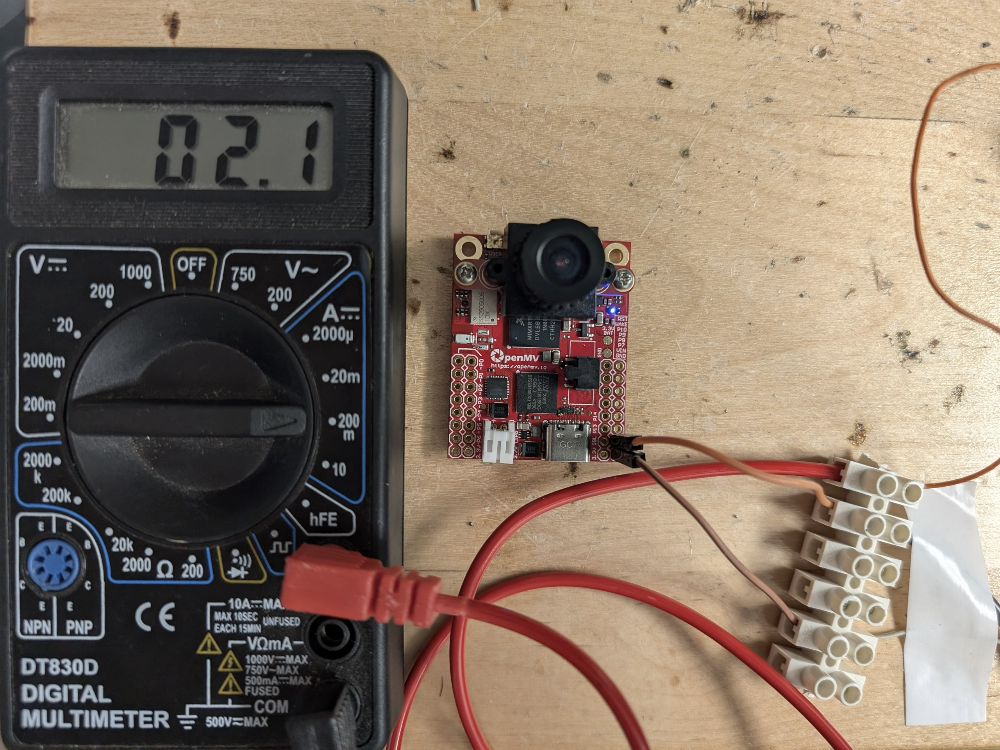
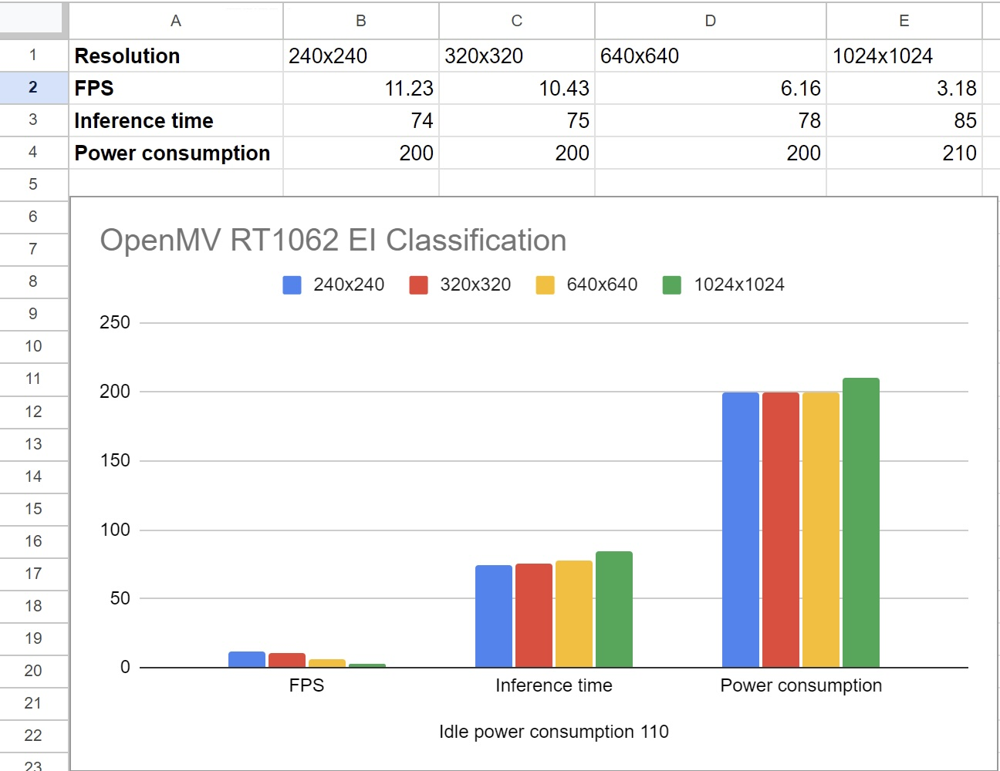

# Getting Started with the OpenMV RT1062

Created By: Roni Bandini

GitHub Repository: [https://github.com/ronibandini/openMVClassificationPerformance ](https://github.com/ronibandini/openMVClassificationPerformance )

## Introduction

The open source, MCU-based OpenMV cameras and shields are popular devices for computer vision projects due to their low cost, user-friendly documentation, and excellent community.  They are also easy to program, with Python and the OpenMV IDE.  The new OpenMV RT1062 is the most powerful version yet; its features are truly outstanding:

- ARM Cortex M7 processor running at 600 MHz 
- OV5640 image sensor capable of taking 2592x1944 (5MP) images
- 32MBs SDRAM, 1MB of SRAM and 16 MB of program/storage flash 
- I/O pins 
- microSD slot capable of 25MB/s reads/writes
- A SPI bus that can run up to 60Mb/s 
- An onboard RTC which keeps running when the system is in low-power mode
- A 12-bit X/Y/Z accelerometer (2/4/8g)
- Onboard WiFi (a/b/g/n - 11/54/65 Mb/s) and Bluetooth (v5.1 – BR/EDR/BLE)
- Onboard 10/100 Mb/s Ethernet
- A LiPo battery connector

But how easy is it to work with this OpenMV RT1062? And how well does it perform in terms of inference time and power consumption when running machine learning vision projects built with Edge Impulse?  Let’s find out.

## Classification Models

For this project I have trained a simple classification model using Edge Impulse. I took 30 pictures of a Lego figure and 30 pictures of a small blue ball. I have created an Impulse with 96x96 px images and a Classification Learning Block.  These items are very distinct from one another so the classification is quite easy from a machine learning perspective, but that is because we are more interested in evaluating the performance and ease of use of the OpenMV RT1062 here. In the future we could always explore more difficult ML tasks.

I have trained the model with 10 cycles at 0.0005 learning rate, which was enough again due to the disparity between the chosen objects. After testing I chose “OpenMV Library” on the Deployment page.

Next I extracted the `.zip` file that was generated and downloaded. I connected the OpenMV camera to my computer with a USB-C cable, and copied the `labels.txt` and trained `.tflite` files to the camera, which conveniently exposes itself as a USB drive when connected.

## OpenMV Setup

I have downloaded the OpenMV IDE from [https://openmv.io/pages/download](https://openmv.io/pages/download). The IDE is available for Windows, Mac and Ubuntu Linux.

I have created a MicroPython script based on the example classification script included in the .zip file, but with small modifications to measure inference time.

I have clicked the Connection icon, and then executed the script with “Ctrl+R”. In the upper right window, a live view of the camera was presented, and I was also able to view console messages like inference time and FPS.

The default script has a configured resolution of 240x240. In order to change the resolution for higher values, I had to change sensor frame size to `SXGA`.

After this change I was able to increase the resolution up to 1024x1024.

## Measuring Power Consumption

The OpenMV FAQs state that the OpenMV Cam consumes about 100 mA while idle, and 140 mA when processing images. However, it’s important to note that there are several OpenMV Cam models (such as the RT1062, H7 Plus, and H7 R2) and ML inferences could increase the power consumption, so I soldered two headers to VIN and GND pins and I put a Multimeter in series with the power lines to make my own tests.

Given that I couldn't use the USB cable for this step, I needed some way to automatically execute the MicroPython script at start. I clicked **Tools, Save Open Script to OpenMV cam**, then I selected **Tools, Reset OpenMV Cam**.

At this point the script was automatically run when powering on the device, and I was able to measure IDLE and Inference power consumption for every resolution.

As expected, Inference time varies while using a higher frame size, but there is not much difference in regards to power consumption. 

> Note: Because I utilized the low resolution ammeter feature of a general-purpose multimeter, the measurement of power consumption may not be entirely accurate and precision equipment should be used for highly detailed investigation if needed.

## OpenMV Status

The OpenMV Cam has an on-board LED with blinking patterns related to different board states.

- Green: Bootloader is running
- Blue: The board is executing `main.py` script
- White: Firmware is panicking from a hardware failure

If for any reason your OpenMV RT1062 becomes bricked during firmware updates, you have to make a small bridge between the SBL pin and 3.3v pin. Then you will be able to re-flash (functional) firmware via the OpenMV IDE.

## Visual Anomaly and OpenMV

Edge Impulse recently included Visual Anomaly detection but, but for now this is not supported on the OpenMV RT1062.  Perhaps in the future this functionality can be added.
 
## Final Notes

The new OpenMV RT1062 camera is an excellent choice for edge AI projects, because the 5MP resolution allows you not only to make inferences but also to capture high-quality snapshots for your dataset, and store them on a microSD card or send them to your Edge Impulse project via WiFi. Additionally, its power configuration can be fine-tuned for efficiency (with low consumption to start) thanks to the board’s RTC/sleep features. And of course, using a high-level programming language like MicroPython simplifies any development considerably.

The MicroPython used for this project is available in this GitHub repository: [https://github.com/ronibandini/openMVClassificationPerformance](https://github.com/ronibandini/openMVClassificationPerformance ) 

## References

[https://docs.openmv.io/](https://docs.openmv.io/)

[https://openmv.io/pages/faq#:~:text=The%20OpenMV%20Cam%20consumes%20about,140%20mA%20when%20processing%20images](https://openmv.io/pages/faq#:~:text=The%20OpenMV%20Cam%20consumes%20about,140%20mA%20when%20processing%20images)

[https://www.edgeimpulse.com/blog/automated-manufacturing-inspection-with-fomo-ad/](https://www.edgeimpulse.com/blog/automated-manufacturing-inspection-with-fomo-ad/)

[https://www.joulescope.com/blogs/blog/challenges-measuring-energy-consumption-with-a-multimeter](https://www.joulescope.com/blogs/blog/challenges-measuring-energy-consumption-with-a-multimeter)

[https://docs.edgeimpulse.com/docs/run-inference/running-your-impulse-openmv](https://docs.edgeimpulse.com/docs/run-inference/running-your-impulse-openmv)
