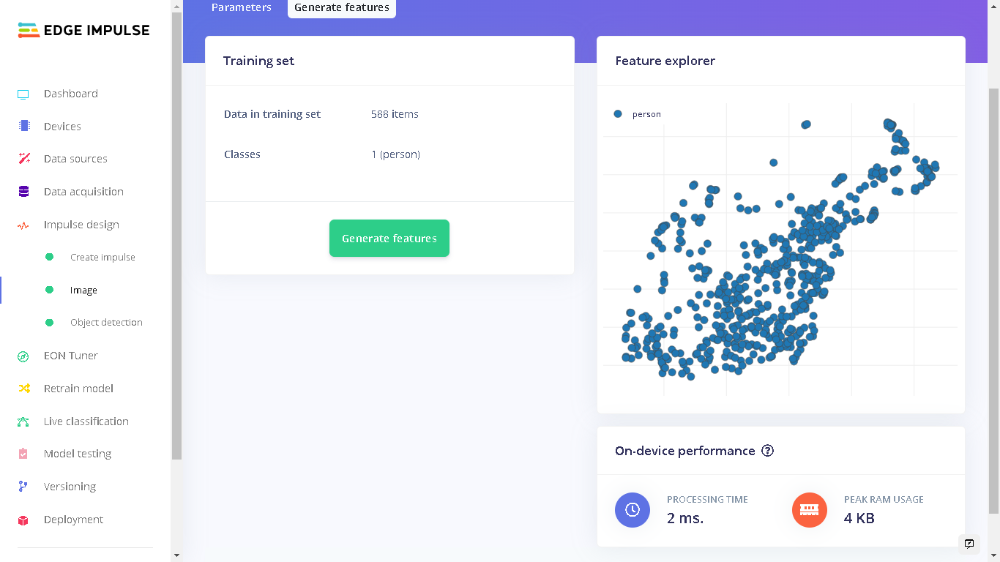

# Monitoring Retail Checkout Lines with Computer Vision on the RZ/V2L

Created By: Solomon Githu

Public Project Link: [https://studio.edgeimpulse.com/public/166649/latest](https://studio.edgeimpulse.com/public/166649/latest)

## Monitoring checkout lines with Computer Vision

No one likes waiting in lines! Research shows that people wait in lines three to five days a year. Long queues at supermarkets cause shopper fatigue, reduce the customer experience and can lead to cart abandonment.

Existing surveillance cameras can be used in stores near the checkout area. Using Computer Vision models , the camera will be able to understand how many customers are in a queue. When the line reaches a certain threshold of customers, this can be identified as a long queue, so staff can take action and even suggest that another counter should be opened.

A branch of mathematics known as **queuing theory** investigates the formation, operation, and causes of queues. The arrival process, service process, number of servers, number of system spaces, and number of consumers are all factors that are examined by queueing theory. The goal of queueing theory is to strike a balance that is efficient and affordable.

For this project, I developed a solution that can identify when a long queue is forming at a counter. If a counter is seen to have 51 percent of the total customers then the system flags this as a long queue with a red indicator. Similarly the shortest serving counter is indicated with a green indicator signaling that people should be redirected there.

You can find the public project here: [Person Detection with Renesas DRP-AI](https://studio.edgeimpulse.com/public/166649/latest). To add this project to your Edge Impulse projects, click “Clone” at the top of the window.

## Dataset Preparation

For my dataset, I sourced images of people from public available datasets such as [Kaggle](https://www.kaggle.com/datasets/constantinwerner/human-detection-dataset). This dataset contains images of people in retail stores and various other environments.

In total, I had 588 images for training and 156 images for testing.


With 744 images it would be tiresome to draw bounding boxes and give a name for all instances where a person appears. Edge Impulse offers various [AI-assisted labeling](https://www.edgeimpulse.com/blog/3-ways-to-do-ai-assisted-labeling-for-object-detection) methods to automate this process. In my case, I chose YOLOv5 and it was able to annotate more than 90% of people. To use this feature, in the Labeling queue select "Classify using YOLOv5" under "Label suggestions".


## Impulse Design

An [Impulse](https://docs.edgeimpulse.com/docs/edge-impulse-studio/impulse-design) is a machine learning pipeline that indicates the type of input data, extracts features from the data, and finally a neural network that trains on the features from your data.

For the YOLOv5 model that I settled with, I used an image width and height of 320 pixels and the "Resize mode" set to "Squash". The processing block was set to "Image" and the learning block set to "Object Detection (Images)".


Under "Image" in Impulse design, the color depth of the images is set to RGB and the next step was to extract features.



Here in the "Features" tab we can see the on-device performance for generating features during the deployment. These metrics are for the Renesas RZ/V2L(with DRP-AI accelerator). The [Renesas RZ/V2L Evaluation Board Kit](https://www.edgeimpulse.com/blog/edge-impulse-launches-official-support-for-the-renesas-rzv2l-evaluation-board) was recently supported by Edge Impulse. This board is designed for vision AI applications and it offers powerful hardware acceleration through its Dynamically Reconfigurable Processor (DRP) and multiply-accumulate unit (AI-MAC).

Currently, all Edge Impulse models can run on the RZ/V2L CPU which contains Arm Cortex-A55 cores. However, so that I can benefit from the DRP-AI hardware acceleration, I chose a YOLOv5 model. Note that on the training page you have to select the **RZ/V2L (with DRP-AI accelerator)** before starting the training in order to tell the Edge Impulse Studio that you are training the model for the RZ/V2L. This can be done on the top right in the Training page or by changing target device in the Dashboard page.


I used 100 training cycles with a learning rate of 0.015. For better results however, it is advised to train a YOLOv5 model using more than 1500 photos per class and more than 10,000 instances per class to produce a robust YOLOv5 model. But this dataset will be enough to get started with.

After the training process, I got a precision score of 88%. Precision is the number of True Positives divided by the number of True Positives plus the number of False Positives.


## Model Testing

After training the model, I did a test with the unseen (test) data and the results were impressive, at 85% accuracy.


In this test sample which has a precision score of 64%, we can see that the model was able to detect 6 out of 8 people in the image. This could of course be improved with more sample image data, and more training.


## Deploying to Renesas RZ/V2L Evaluation Kit

The Renesas Evaluation Kit comes with the RZ/V2L board and a 5-megapixel Google Coral Camera. To setup the board, Edge Impulse has prepared a [guide](https://docs.edgeimpulse.com/renesas/development-platforms/officially-supported-cpu-gpu-targets/renesas-rz-v2l) that shows how to prepare the Linux OS image, install [Edge Impulse CLI](https://docs.edgeimpulse.com/docs/edge-impulse-for-linux/edge-impulse-for-linux) and finally connecting to Edge Impulse Studio.

.jpg>)

To run the model locally on the RZ/V2L, we can run the command `edge-impulse-linux` and then `edge-impulse-linux-runner` which lets us log in to our account and select the cloned Public project.

We can also download an executable of the model which contains the signal processing and ML code, compiled with optimizations for the processor, plus a very simple IPC layer (over a Unix socket). This executable is called an [.eim model](https://docs.edgeimpulse.com/docs/edge-impulse-for-linux/edge-impulse-for-linux#.eim-models)

To do a similar method, create a directory and navigate into the directory:

```
mkdir monitoring_retail_checkout_lines && \
cd monitoring_retail_checkout_lines
```

Next, download the `.eim` model with the command:

```
edge-impulse-linux-runner --download modelfile.eim
```


Now we can run the executable model locally using the command:

```
edge-impulse-linux-runner --model-file modelfile.eim
```

We pass the directory and name of the downloaded file **modelfile** in the command.


We can go to the local URL provided and we will see the feed being captured by the camera as well as the bounding boxes if present.

## Renesas RZ/V2L CPU vs DRP-AI Performance

Currently, all Edge Impulse models can run on the RZ/V2L CPU which is an SoC based on Cortex-A55 cores. In addition, you can bring your own model to Edge Impulse and use it on the device. However, if you would like to benefit from the DRP-AI hardware acceleration support, there are a couple of models that you can use for both object detection and image classification.

In the midst of the rapid evolution of AI, Renesas developed the [AI accelerator](https://www.renesas.com/eu/en/application/key-technology/artificial-intelligence/ai-accelerator-drp-ai#overview) (DRP-AI) and the software (DRP-AI translator) that delivers both high performance and low power consumption, and has the ability to respond to evolution. Combining the DRP-AI and the DRP-AI translator makes AI inference possible with high power efficiency.

1. **Performance with RZ/V2L CPU** - I first trained another model but with the target device being RZ/V2L (CPU). Afterwards, I downloaded the `.eim` executable on the RZ/V2L and run live classification with it.


With this, the CPU has a latency of around 1966ms which is equal to roughly 0.5 fps.

1. **Performance with RZ/V2L (DRP-AI Accelerator)** - running the same inference test, but with the downloaded `.eim` with DRP-AI acceleration enabled gave a latency of around 250ms, or roughly 4 fps.


There are a couple of factors that determine the performance of the model. First a larger image means there are more features that are required to be processed. Next is hardware resource utilization. For comparison, MobileNetV2 with an image input of 96x96 was found to have around 11 MBs of flash storage and had a latency of around 642ms which is \~1.56 fps.

Our YOLOv5 model has an image input size of 320x320 and takes 45.5 MBs of flash storage. Even with MobileNetV2 processing less features and consuming less flash storage, our Yolov5 model was able to perform twice as fast as MobileNetV2.

Also, we can see that running the YOLOv5 model with the DRP-AI Accelerator is 8 times (800%) faster than using the CPU. This is very impressive.

## A Smart Application to Monitor Checkout Lines

Using the `.eim` executable and [Python SDK](https://docs.edgeimpulse.com/docs/edge-impulse-for-linux/edge-impulse-for-linux#sdks) for Edge Impulse for Linux, I developed a Web Application using [Flask](https://flask.palletsprojects.com/en/2.2.x/) that counts the number of people at each queue and computes a distribution of total counts across the available counters which enables identifying long and short queues.

The application shows which counter is serving more than 51 percent of the total number of people with a red indicator. At the same time the counter with the lowest number of customers is shown with a green indicator, signaling that people should be redirected there.

For the demo I obtained publicly available video footage of a retail store which shows 3 counter points. A snapshot of the footage can be seen below.


The application obtains the bounding boxes coordinates (x and y) for each detected person using the Edge Impulse Python SDK. From the video footage I identified where the checkout lines for the 3 cashiers appear in the 'x' coordinate. These form 3 regions of interest. Next, the Python script checks how many bounding boxes' 'x' coordinates appear in each region of interest and increments the person count accordingly.

Note that if you are using another surveillance footage then you will need to identify the location of the region(s) of interest.


You can clone the public [GitHub repository](https://github.com/SolomonGithu/retail-checkout-lines-management-with-Edge-Impulse) to your RZ/V2L board. The installation steps are in the repository. You can run the Flask application or the binary executable built with [PyInstaller](https://pyinstaller.org/en/stable/) for the Aarch64 platform.

Afterwards, I projected the demo footage from a monitor to the 5-megapixel Google Coral camera attached to the RZ/V2L board. The colored circles on the right are responsive and they can be red, green or orange. Red implies that the cashier has 51% of the total number of people in the queues while green shows the cashier with the lowest number of customer(s). Orange shows the cashier who has a count that is in the middle of the highest and lowest. This enables us to easily identify when long queues are forming at a cashier.


## Conclusion

Implementing Computer Vision models comes with some challenges. Some challenges in this particular use-case might be identifying accompanying guests (people shopping in a pair), distinguishing customers who are near the line but not in the queue and not shopping, complexity of the checkout process per customer, and more.

A future work for this project can be to predict queueing times for different days and particular times of the day.

With Edge Impulse, developing ML models and deploying them has always been easy. Knowledge on machine learning and microcontrollers is not known by everyone but the [Edge Impulse platform](https://www.edgeimpulse.com) provides easy, smarter and faster tools that we can use to create build edge ML solutions quickly.
