# Object Detection and Visualization with the Seeed Studio Grove Vision AI Module

Created By: David Tischler

Public Project Link: [https://studio.edgeimpulse.com/public/223085/latest](https://studio.edgeimpulse.com/public/223085/latest)

## Introduction

The [Seeed Studio Grove Vision AI Module](https://www.seeedstudio.com/Grove-Vision-AI-Module-p-5457.html) is a small TinyML-capable board equipped with a Himax HX6537-A processor and an OV2640 camera, capable of running computer vision models directly on the board. There is also a microphone, accelerometer, and gyroscope, and Arduino library support for simple programming. The board is also fully supported by Edge Impulse, so you can build and deploy machine learning models with ease.

In this project, we’ll build a machine learning model that can identify Batman versus Superman, deploy the model to a Grove Vision AI, capture the inference results from the board, and send the results to a Ubidots cloud dashboard for visualization.

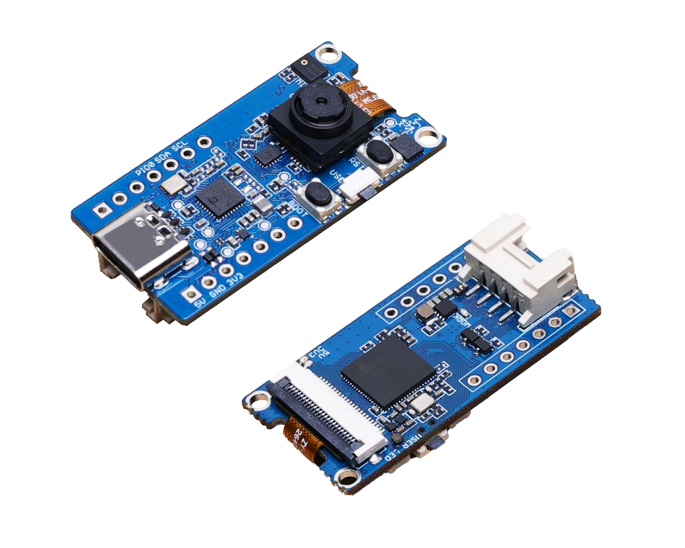

## Prerequisites

1. Create an [Edge Impulse Project](https://studio.edgeimpulse.com).
2. Install the [Edge Impulse CLI](https://docs.edgeimpulse.com/docs/edge-impulse-cli/cli-installation).
3. Flash the latest Edge Impulse Firmware to the Grove Vision AI, as described here: [https://docs.edgeimpulse.com/docs/development-platforms/officially-supported-mcu-targets/seeed-grove-vision-ai#1.-update-bl702-chip-firmware](https://docs.edgeimpulse.com/docs/development-platforms/officially-supported-mcu-targets/seeed-grove-vision-ai#1.-update-bl702-chip-firmware)
4. Create a [Ubidots account](https://stem.ubidots.com) and add a Device (a “Blank Device” will work fine).


## Data Acquisition

Machine learning projects typically begin with building a dataset. Capturing and collecting data can be time consuming, but better data will result in a better model, so this is a crucial step. To get started, attach the Grove Vision AI to your development machine via USB (make sure you have completed Prerequisite #3 above), and click on Data Acquisition on the left side of the Edge Impulse Studio. Next, over towards the right side of the page that is loaded, click on the USB icon, which will allow the Studio to directly connect to the Grove Vision AI board and access it’s camera.

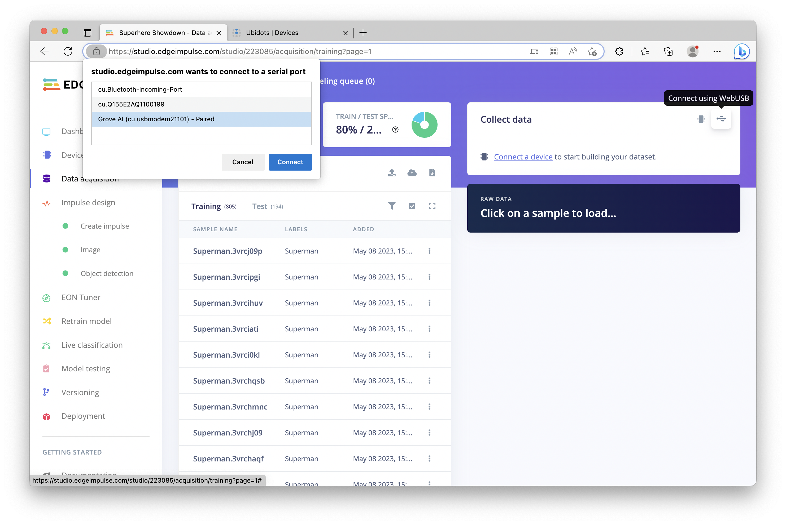

You can now take pictures of your target objects, which in this project, will be Superman and Batman, though any object could be used, and the functionality will remain the same. Click on the “Start Sampling” to capture images, and add them to your dataset.

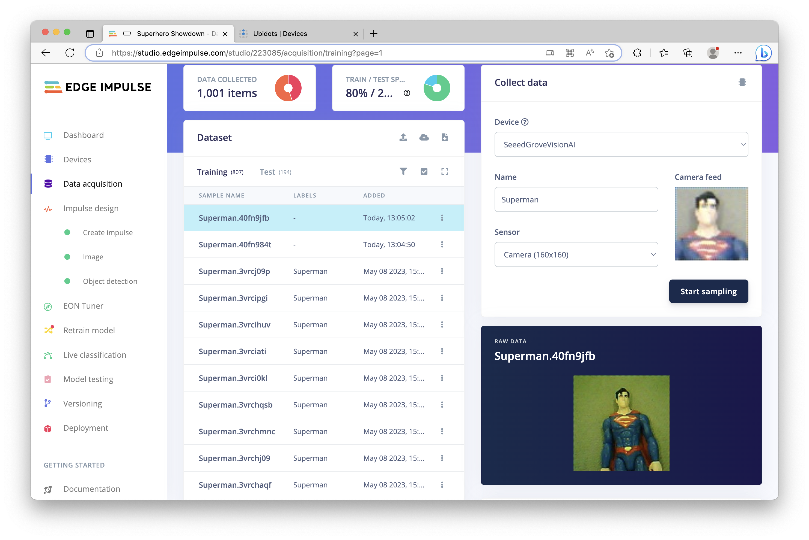

Next, you will need to draw Bounding Boxes around the object of interest in the captured images. Click on “Labeling Queue” near the top, and draw a box around your object, then provide a Label. Click the “Save labels” button to proceed to the next image in the queue. This goes fairly quickly, as the Edge Impulse Studio will attempt to follow the object from image to image; only on occasion will you need to move or resize a box.

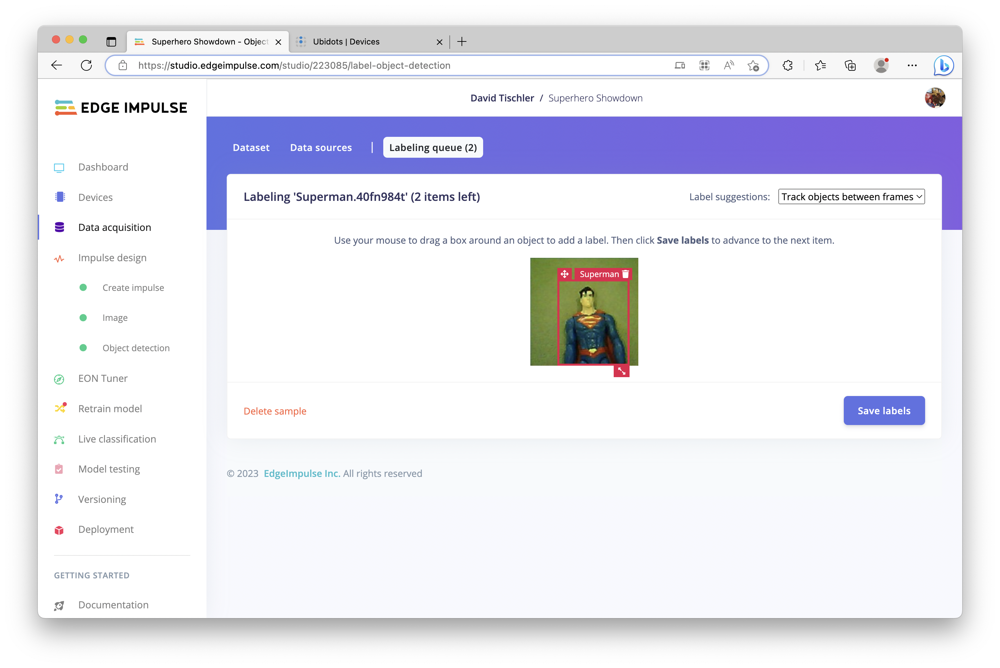

To ensure a robust model that generalizes well gets created, it helps to vary lighting conditions, backgrounds, orientation, and distance from camera to object. Ideally, several hundred pictures of each object should be captured, but you can likely still achieve acceptable results with fewer.

## Impulse Design

Once you have a few hundred images captured and labeled, it is time to build an Impulse, which is the machine learning model that will ultimately run on the Grove Vision AI Module. An Impulse consists of a Processing Block and a Learning Block. These can vary depending upon the type of project you are building, but as this is an object detection project, we’ll add an Image Block and Object Detection Block, make sure the Image Width and Height are set to 160 pixels in the Image Data block, and then click the “Save Impulse” button towards the right.

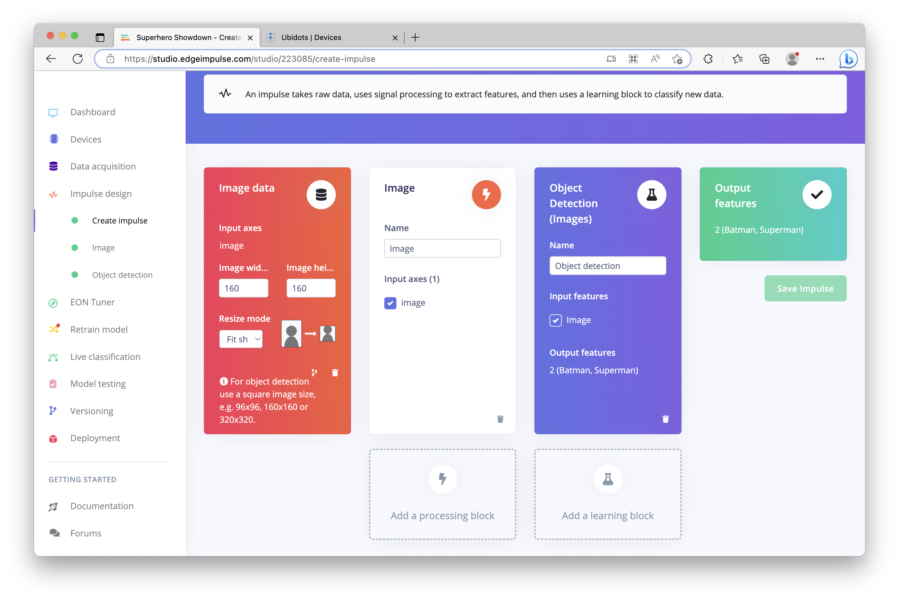

Next, we’ll configure the Image Block. The Studio will generate Raw Features for the images, and you can select from color (RGB) or grayscale. You can save memory if necessary by choosing grayscale, but leave it on RGB for now and click “Save Parameters”

The following page allows you to build a visual representation of your data. Click on the “Generate Features” then wait a few moments while the Feature Explorer is built and populated, providing you insight into how your data is represented.

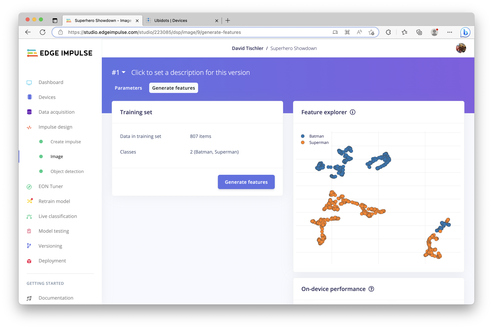

Once complete, click on “Object Detection” on the left navigation menu, to configure the Object Detection Block.

In the Neural Network Settings, you can set the number of training cycles (epochs) to iterate through, and the Learning rate, which will determine how fast the neural network learns. You can also select from a variety of architectures and sizes, such as MobileNet, YOLO, FOMO, or even custom models. To be able to fit within the memory constraints of the Grove Vision AI, I’ve selected FOMO based on MobileNetV2 0.35. Once you are ready, click on the green “Start Training” button.

It will take a few minutes for the model to build, but after it has finished you will be presented with a Confusion Matrix for the validation set, showing the accuracy achieved. You’ll also be presented with approximate RAM and Flash usage for the model.

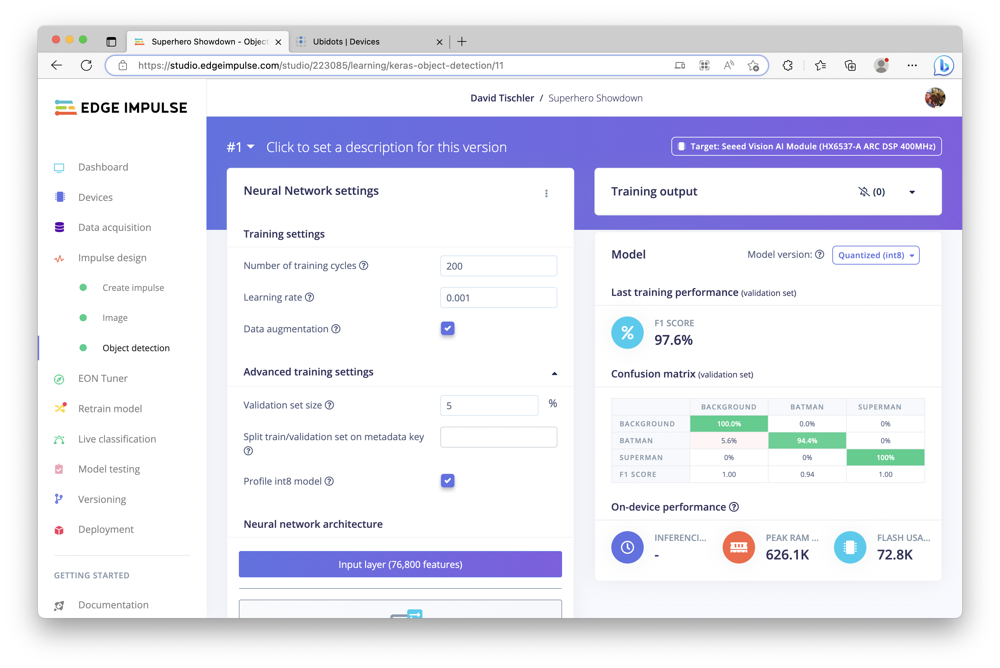

## Firmware Deployment

With the computer vision model created and promising results shown in the Confusion Matrix, we can now build firmware and load it onto the Grove Vision AI Module. Click on “Deployment” on the left navigation, then scroll down and click “Build” (the Grove Vision AI Module should already be selected. If not, simply choose it.) and wait a moment for the process to complete.

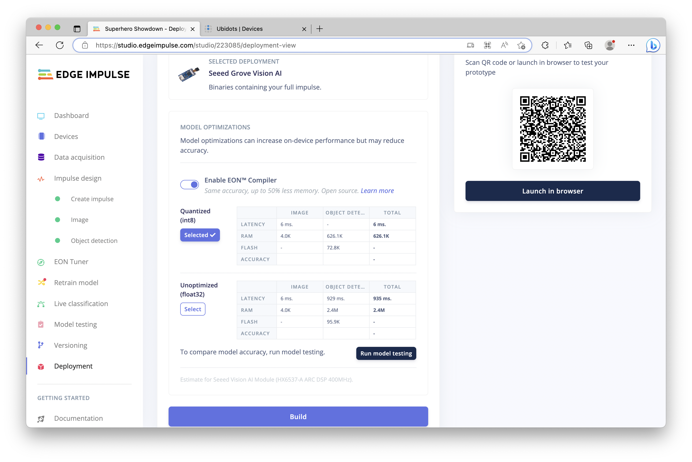

A `.zip` file will be generated and downloaded. Unzip it, and you will find a file named `firmware.uf2`. To transfer it to the Grove Vision AI, double click the “boot” button on the board, to place the device into storage mode. A new storage location should show up on your computer, essentially like a USB drive. Then, you can simply drag-and-drop the firmware file into the storage device. The file will copy over, and once it’s complete, the device will reset and the drive will unmount itself.

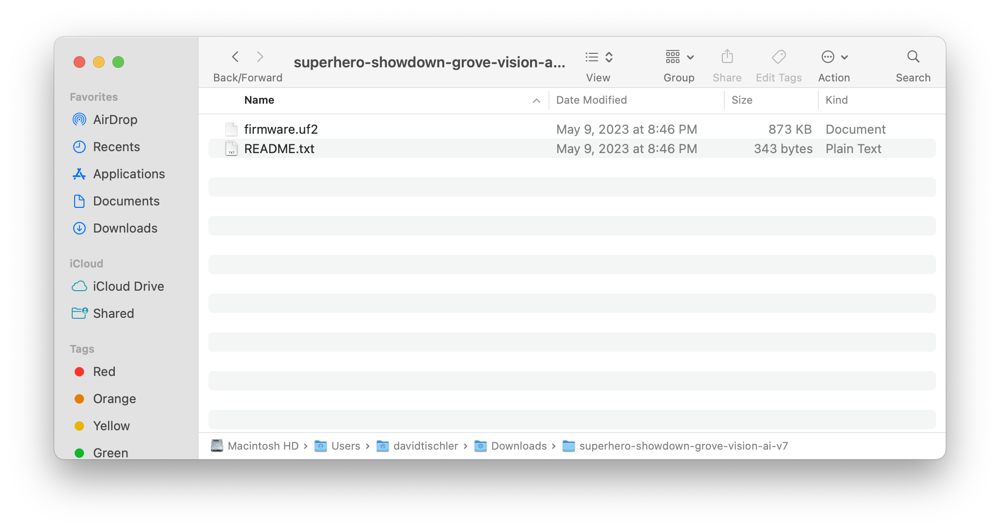

## Model Testing

With the new firmware flashed to the board, we can now use the Edge Impulse CLI to start inferencing on the Grove Vision AI. Make sure the Grove Vision AI Module is still attached via USB, and open up a terminal on your development computer, and run `edge-impulse-run-impulse --debug` to start inferencing (make sure you installed the CLI tooling as outlined in Prerequisite #2 above). Aim the Grove Vision AI at your object, Superman in this case, and you should see the Label and x-y coordinates of the detection in the image if identification is successful.

The console will continue to print out inference results while the object is detected in the camera frame.

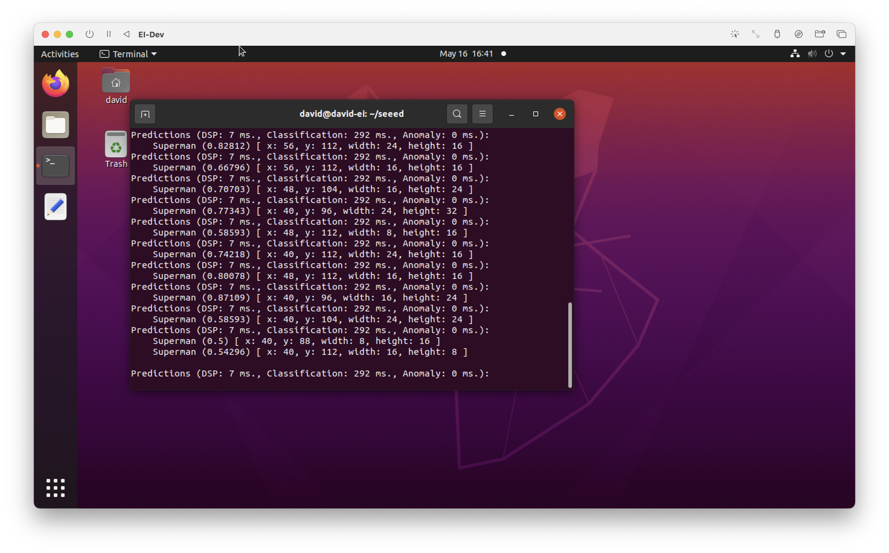

## Application and Dashboard

This console output of the inference results is a nice start, but it’s also useful to visualize the results and quantify the data over time. For this, a dashboard that collects and aggregates the inference data is helpful. There are many options for gathering and storing data, including options from AWS and Azure, but for this project we’ll use Ubidots, which has a user-friendly implementation and is built with IoT and Edge devices in mind.

As the `edge-impulse-run-impulse` command is already outputting the data we are interested in, a small python application that captures the results and sends them to Ubidots is all we need. The following python snippet will dump the results into a file, parse the file for our objects of interest, and then send _only_ the data (not the actual image) to Ubidots. You’ll need to modify the code to parse for your Labels, and, to provide your Ubidots API Auth Token. Save the file locally on your development machine as `grove-ai.py`.

```
import subprocess
import time
# Replace the path with the actual path to edge-impulse-run-impulse executable
path_to_executable = 'edge-impulse-run-impulse'

# Replace output.txt with the desired name and path for your output file
output_file = open('output.txt', 'w')

# Launch the executable using subprocess and pipe the output to the output file
subprocess.Popen([path_to_executable], stdout=output_file)

# Continuously parse the output file for prediction results
        
import requests
import json

def send_to_ubidots(name, confidence):
    url = "https://industrial.api.ubidots.com/api/v1.6/devices/groveai"
    payload = {
        name: {
            "value": confidence,
        }
    }
    headers = {
        "Content-Type": "application/json",
        "X-Auth-Token": “ABCD-abcdefghijklmnopqrstuvwxyz”
    }
    response = requests.post(url, headers=headers, data=json.dumps(payload))
    return response.status_code

with open("output.txt", "r") as f:
    lines_seen = set()
    while True:
        line = f.readline()
        if not line:
            time.sleep(1)
            continue
        if ("Batman" in line or "Superman" in line) and line not in lines_seen:
            print(line)
            parts = line.split()
            name = parts[0]
            confidence = float(parts[1][1:-1])
            status_code = send_to_ubidots(name, confidence)
            if status_code != 200:
                print("Error sending data to Ubidots: status code {}".format(status_code))
            lines_seen.add(line)
```

In the Ubidots website, you can easily create a quick dashboard that reads the incoming values from the device. Click on the Data drop-down menu, click on Dashboards, then click the “+” sign over on the right. More information on Dashboard creation is available in their documentation, located here: [https://help.ubidots.com/en/articles/2400308-create-dashboards-and-widgets](object-detection-ubidots-seeed-grove-ai.md)https://help.ubidots.com/en/articles/2400308-create-dashboards-and-widgets

I have added widgets that collect the Confidence value for each Label, and, a Total Count that simply increases by one each time an inference is performed. This value increases quickly, so you might want to implement a small delay within the python snippet if necessary for your use-case.

With the API Key added to the “X-Auth-Token” line, and appropriate Labels in place, you can run the python code quite simply in a terminal with `python3 grove-ai.py`. Once the script has begun running, aim the Grove Vision AI Module at the objects of interest once again, and if all goes well the Dashboard you create will begin updating in real-time.

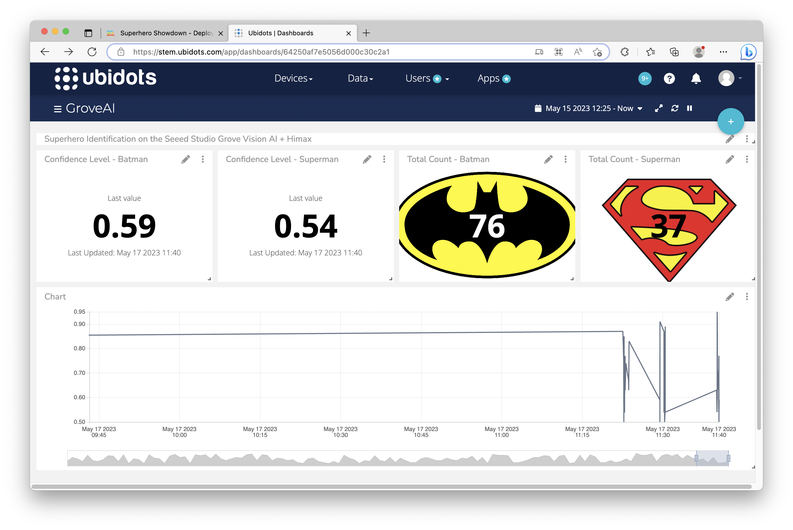

## Summary

This proof of concept demonstrates how to collect data, build a computer vision model, and deploy it to the Seeed Studio Grove Vision AI Module. Once the model is flashed to the device, we then use a small bit of python to capture the results and render the inferencing data on a cloud Dashboard with Ubidots, for easier visualization.
