# Counting for Inspection and Quality Control - Nvidia Jetson Nano (TensorRT)

Created By: Jallson Suryo

Public Project Link: [https://studio.edgeimpulse.com/public/320746/latest](https://studio.edgeimpulse.com/public/320746/latest)

GitHub Repo: [https://github.com/Jallson/PizzaQC_Conveyor_Belt](https://github.com/Jallson/PizzaQC_Conveyor_Belt)

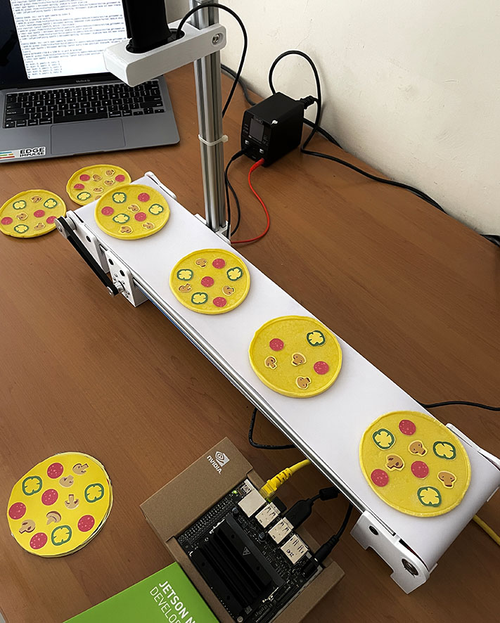

## Problem Statement

The Quality Control process, especially those involving visual-based calculations and carried out repeatedly, is time consuming and prone to errors when performed by humans. Using sensors to count or calculate presence also does not provide a solution if the object you want to detect is an object made up of multiple components, each needing measurement.  Food products, finished goods, or electronic manufacturing processes could be examples of this type of scenario.

## Our Solution

A computer vision system for quality/quantity inspection of product manufacturing on a conveyor belt. The setting of this project will be in a hypothetical mass-production pizza factory where a Jetson Nano with a camera will detect and count the number of toppings for each pizza that passes by on a conveyor belt to ensure the quantity of toppings (pepperoni, mushroom, and paprika) meets a predefined quality standard. Speed, reliability, and cost efficiency are the goals for this project.

## Description

This project uses Edge Impulse's FOMO (Faster Objects, More Objects) algorithm, which can quickly detect objects and use them as a quality/quantity check for products on a running conveyor belt. FOMO's ability to know the number and position of coordinates of an object is the basis of this system. This project will explore the capability of the Nvidia Jetson Nano's GPU to handle color video (RGB) with a higher resolution (320x320) than some other TinyML projects, while still maintaining a high inference speed. The machine learning model (`model.eim`) will be deployed with the TensorRT library, which will be compiled with optimizations for the GPU and will be setup via the Linux C++ SDK. Once the model can identify different pizza toppings, an additional Python program will be added, to check each pizza for a standard quantity of pepperoni, mushrooms, and paprikas. This project is a proof-of-concept that can be widely applied in the product manufacturing and food production industries to perform quality checks based on a quantity requirement of part in a product.

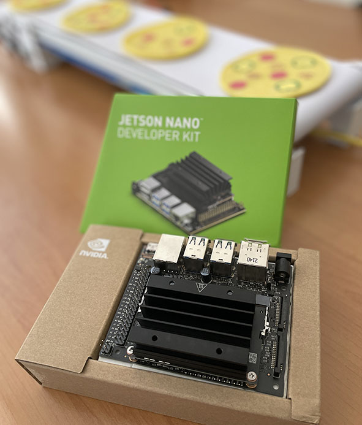

### Hardware Components

- Nvidia Jetson Nano with dedicated power adapter
- USB camera/webcam (eg. Logitech C270)
- Mini conveyer belt system (10cm x 50cm or larger)
- Camera stand/holder
- Objects: For this example, mini pizza with toppings (dough or printed paper)
- Ethernet cable
- PC/Laptop to access Jetson Nano via SSH

### Software & Online Services

- Edge Impulse Studio
- Edge Impulse Linux, Python, C++ SDK
- Ubuntu OS/Nvidia Jetpack
- Terminal

## Steps

### 1. Prepare Data / Images

In this project we can use a camera (webcam) connected to a PC/laptop to capture the images for data collection for ease of use. Take pictures of your pizza components from above, with slightly different angles and lighting conditions to ensure that the model can work under different conditions (to prevent overfitting). While using FOMO, object size is a crucial aspect to ensure the performance of this model. You must keep the camera distance from objects consistent, because significant differences in object size will confuse the FOMO algorithm.


### 2. Data Acquisition and Labeling

Go to [http://studio.edgeimpulse.com](http://studio.edgeimpulse.com), login or create an account, then create a new project.

Choose the **Images** project option, then **Classify Multiple Objects**. In **Dashboard > Project Info**, choose **Bounding Boxes** for the labeling method and **Nvidia Jetson Nano** for the target device. Then in **Data acquisition**, click on the **Upload Data** tab, choose your photo files that you captured from your webcam or phone, choose **Auto split**, then click **Begin upload**. 

For Developer (free) accounts, next click on the **Labelling queue** tab, then start dragging a box around each object and label it, then save it. Repeat until all images are labelled.  More information on this process, is located here: [https://docs.edgeimpulse.com/docs/edge-impulse-studio/data-acquisition/labeling-queue](https://docs.edgeimpulse.com/docs/edge-impulse-studio/data-acquisition/labeling-queue)

For Enterprise (paid) accounts, you will instead click on **Auto-Labeler** in _Data Acquisition_. This auto-labeling segmentation / cluster process will save a lot of time over the manual process above. Set the min/max object pixels and sim threshold (0.9 - 0.999) to adjust the sensitivity of cluster detection, then click **Run**. Next, you can label each cluster result as desired. If something doesn’t match or if there is additional data, labeling can be done manually as well.

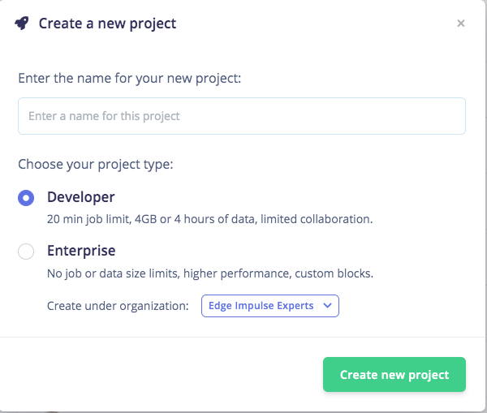

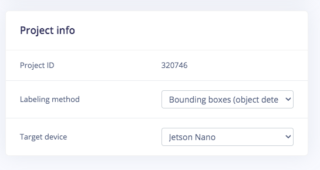

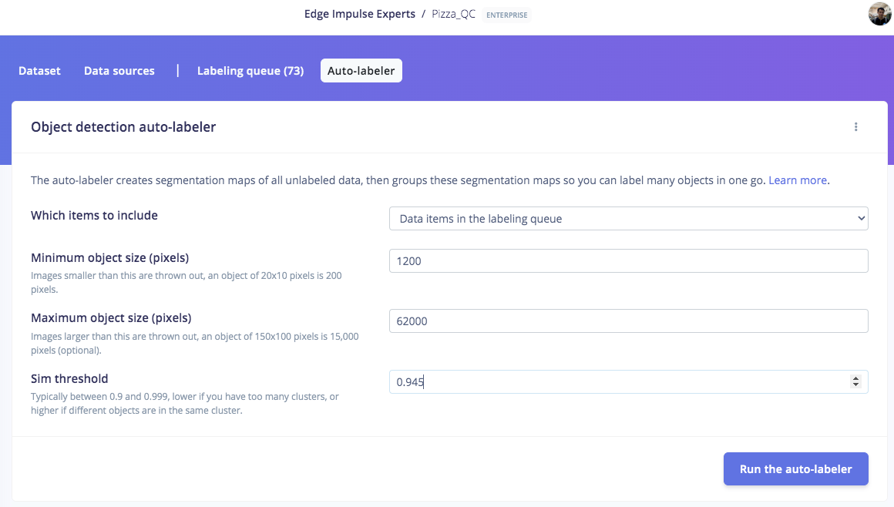


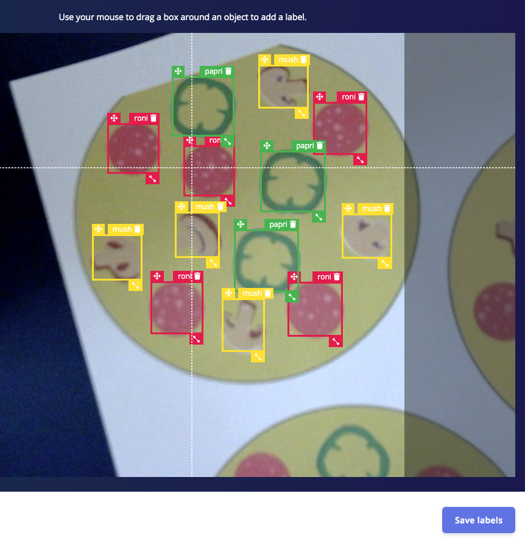


### 3. Train and Build Model using FOMO Object Detection

Once you have the dataset ready, go to **Create Impulse** and in the Image block, set **320 x 320** as the image width and height. Then choose **Fit shortest axis**, and choose **Image** and **Object Detection** as Learning and Processing blocks.

In the _Image_ parameters section, set the color depth as **RGB** then press **Save parameters**. Then click on **Generate** and navigate to the **Object Detection** block setup using the left navigation. Leave the training setting for Neural Network as it is or check our settings — in our case everything is quite balanced, so we'll leave them alone and choose **FOMO (MobileNet V2 0.35)**. Train the model by pressing the **Start training** button. You can see the progress of the training in the log to the right.

If everything is OK, the training will job will finish in a short while, then we can test the model.  Go to the **Model Testing** section and click **Classify all**. Our result is above 90%, so we can move on to the next step — Deployment.

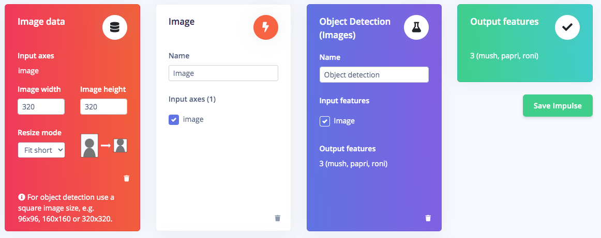

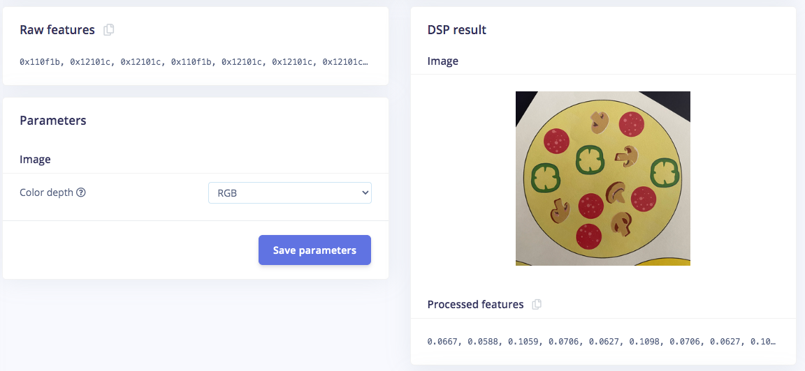


### 4. Deploy Model to NVIDIA Jetson Nano GPU

Click on the **Deployment** tab then search for _TensorRT_, then select _Float32_ and click **Build**. This will build an Nvidia TensorRT library for running inference, targeting the Jetson Nano's GPU. Once the build finishes and the file is downloaded, open the `.zip` file, then we're ready for model deployment with the Edge Impulse C++ SDK on the Jetson Nano side.

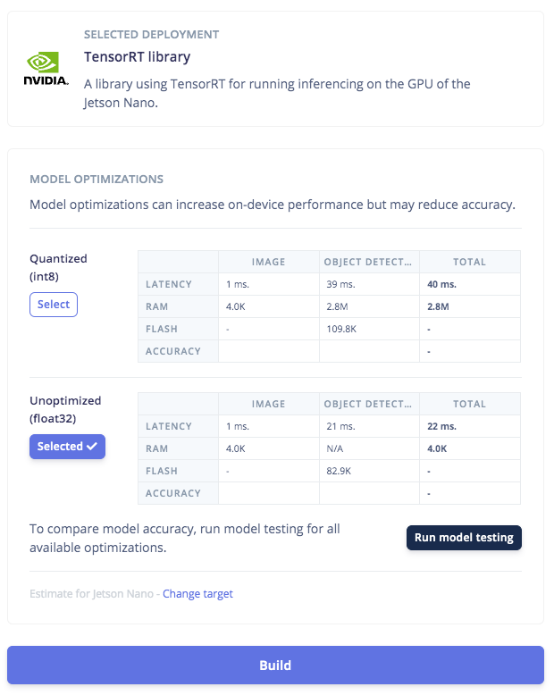

On the Jetson Nano, there are several things that need to be done. Flash the Nvidia-provided Ubuntu OS with JetPack, which can be downloaded from the Nvidia Jetson website, to an SD Card. Insert the SD Card and power on the board, go through the setup process to finish the OS configuration, and connect the board to your local network.  Then `ssh` from your PC/laptop and install the Edge Impulse tooling via the terminal:

```
wget -q -O - https://cdn.edgeimpulse.com/firmware/linux/jetson.sh | bash
```

Then install `Clang` as a C++ compiler:

```
sudo apt install -y clang
```

Clone this GitHub repository and install these submodules:

```
git clone https://github.com/edgeimpulse/example-standalone-inferencing-linux
cd example-standalone-inferencing-linux && git submodule update --init —recursive
```

Then install OpenCV:

`sh build-opencv-linux.sh`

Now make sure the contents of the TensorRT folder you downloaded from the Edge Impulse Studio have been unzipped and moved to the `example-standalone-inferencing-linux` directory. For FOMO, we need to edit the variables in the `source/eim.cpp` file with:

```
const char *model_type = "constrained_object_detection";
```

To build a specific model targeting the Jetson Nano GPU with TensorRT, using Clang:

```
APP_EIM=1 TARGET_JETSON_NANO=1 CC=clang CXX=clang++ make -j
```

The resulting model will be `./build/model.eim`

If your Jetson Nano is run with a dedicated power supply, its performance can be maximized by this command:

```
sudo /usr/bin/jetson_clocks
```

Now the model is ready to run in a high-level language such as the Python program we'll use in the next step. To ensure this model works, we can run the Edge Impulse Runner with the camera setup on the Jetson Nano and turn on the conveyor belt. You can see what the camera observes via your browser; the local IP address and port will be shown when the Linux Runner is started. Run this command:

```
edge-impulse-linux-runner --model-file ./build/model.eim
```

The inferencing time is about 5ms, which is an incredibly fast detection speed.

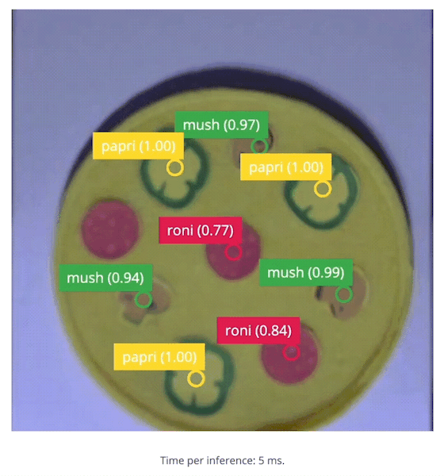

To compare, I have also used the Linux Runner with the CPU version of the model, downloaded via `edge-impulse-linux-runner --download modelfile.eim` then running it with the same command as above.

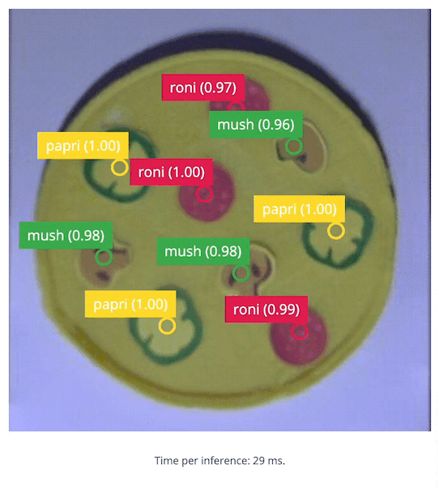

You can see the difference in inferencing time, which is almost 6-times faster when we compile and run on the GPU. Impressive!

### 5. Build the Application

With the impressive performance of live inferencing shown by the Linux Runner, now we will create a Python program to be able to calculate the number of toppings on a pizza compared to a desired amount, and that will provide an **OK** or **Bad** output if the number of toppings is incorrect.

Because we'll use Python, we need to install the Edge Impulse Python SDK and clone the repository with the Edge Impulse provided examples. Follow the steps here [https://docs.edgeimpulse.com/docs/edge-impulse-for-linux/linux-python-sdk](https://docs.edgeimpulse.com/docs/edge-impulse-for-linux/linux-python-sdk) to install the Python SDK.  Once the SDK is installed, be sure to `git clone https://github.com/edgeimpulse/linux-sdk-python` as well, so that you have the samples locally.

The program I made (`topping.py`) is a modification of Edge Impulse's `classify.py` in the `examples/image` folder from the `linux-python-sdk` directory.


My program will change the moving object detection input from the model file (`model.eim`), for example: `0 0 2 3 3 1 0 1 3 3 3 2 0 0 0 2 3 3 2 0 0 2 5 5 1 0 0 2 3 3 1 0 0 1 2 2 0 0` will record **0** as the sequence separator and record the peak value in each sequence.  As an example, if the correct number of toppings on a pizza (per quality control standards) is **3**, and we know that a 0 is a seperator, and anything other than 3 is bad...then `0 3 0 3 0 3 0 5 0 3 0 2 0` is: `OK OK OK BAD OK BAD`

My Python program (`topping.py`) can be downloaded at this link: [https://github.com/Jallson/PizzaQC_Conveyor_Belt/blob/main/topping.py](https://github.com/Jallson/PizzaQC_Conveyor_Belt/blob/main/topping.py)

To run the program, use the command along with the path where `model.eim` file is located.  Be sure to use the one built for the GPU, in case you have both on the Nano still:

```
python3 topping.py ~/build/model.eim
```

To see the process in action, have a look at the demo video availaCheck our demo video: 



## Conclusion:

We have successfully implemented an object detection computer vision model targeting Nvidia Jetson Nano's GPU, in a food/product manufacturing setting. The FOMO object detection with RGB color and 320x320 resolution is handled by the Jetson Nano's GPU accurately, with an inference time of only 5ms. This would allow it to be applied with higher resolution for more complex objects, faster conveyor belts, and higher speed cameras (>100fps). Embedding TensorRT models with high-level languages such as Python make it easy to apply to specific use-cases and provides the capability to control display, lights, alarms or servos for automation and manufacturing systems, as well.
