# Counting Retail Inventory with Computer Vision on the RZ/V2L

Created By: Solomon Githu

Public Project Link: [https://studio.edgeimpulse.com/public/165074/latest](https://studio.edgeimpulse.com/public/165074/latest)

## Introduction

The primary method of inventory management in retail, warehouse, manufacturing, and logistics is simply counting parts or stock. This procedure ensures that the inventory on the sales floor, or in the warehouse meets requirements for production, sale, or spare capacity. In retail, this is done to ensure there are enough goods available for sale to consumers. Even with many technology advancements and improved production and capacity planning, physical inventory counting is still required in the modern world. This is a time consuming and tedious process, but machine learning and computer vision can help decrease the burden of physical inventory counting.

To demonstrate the process of inventory counting, I trained a machine learning model that can identify a bottle and a box/carton drink on store shelves, and their counts are displayed in a Web application.

For the object detection component, I used [Edge Impulse](https://edgeimpulse.com/) to label my dataset, train a YOLOv5 model, and deploy it to the [Renesas RZ/V2L Evaluation Board Kit](https://www.edgeimpulse.com/blog/edge-impulse-launches-official-support-for-the-renesas-rzv2l-evaluation-board). You can find the public Edge Impulse project here: [Inventory Tracking in Retail with Renesas DRP-AI](https://studio.edgeimpulse.com/public/165074/latest).

## Dataset Preparation

For the dataset, I used the [SKU110K](https://github.com/eg4000/SKU110K\_CVPR19) image dataset. This dataset focuses on object detection in densely packed scenes where images contain many objects.

From the dataset, I chose to use a bottle and boxed/carton drinks. This is because these objects are not too similar, and they have not been as densely packed as some of other items in the dataset. This is a proof-of-concept using only two items, but the dataset includes much more that could also be used.

In total, I had 145 images for training and 36 images for testing. Certainly not a huge amount, but enough to get going with. I simply called the two classes: **bottle** and **box\_drink**.

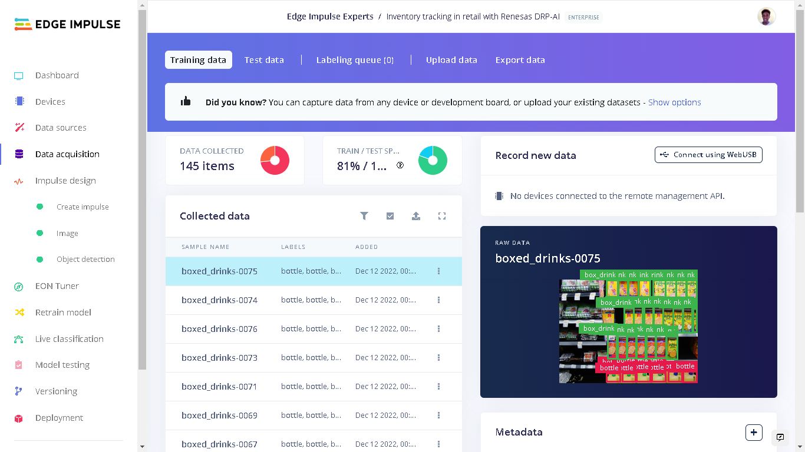

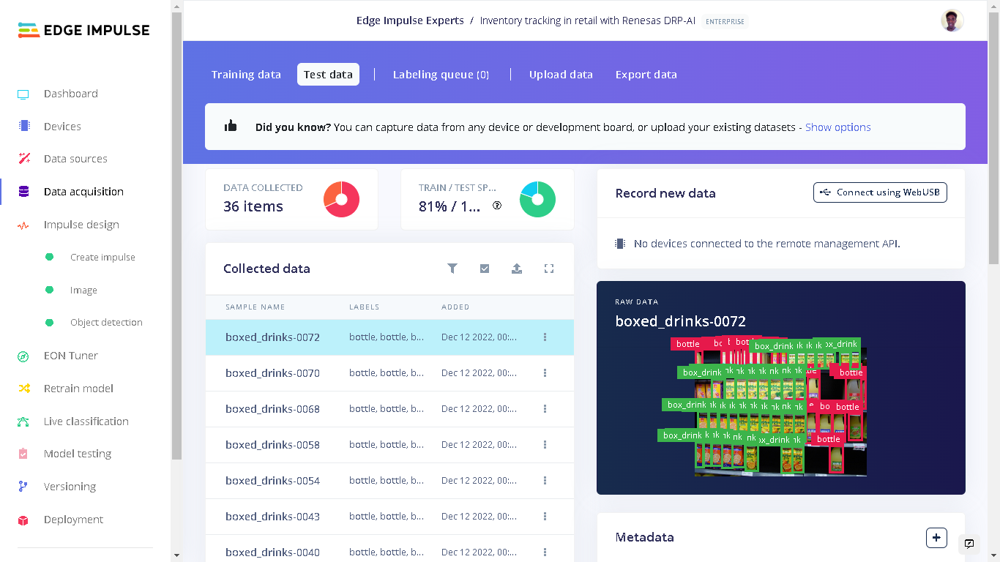

With 181 images it would be tiresome to draw bounding boxes for all the objects. Edge Impulse offers various [AI-assisted labeling](https://www.edgeimpulse.com/blog/3-ways-to-do-ai-assisted-labeling-for-object-detection) methods to automate this process. In my case, I chose YOLOv5. To use this feature, in the **Labeling queue** select "Classify using YOLOv5" under "Label suggestions".

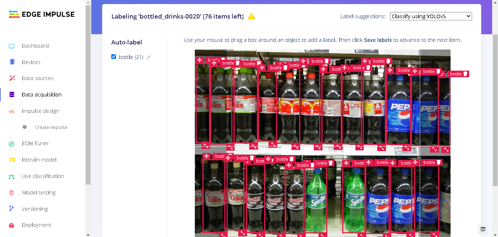

## Impulse Design

An [Impulse](https://docs.edgeimpulse.com/docs/edge-impulse-studio/impulse-design) is a machine learning pipeline that indicates the type of input data, extracts features from the data, and finally includes a neural network that trains on the features from your data.

For my YOLOv5 model, I used an image width and height of 320 pixels and the "Resize mode" set to "Squash". The processing block was set to "Image" and the learning block set to "Object Detection (Images)".

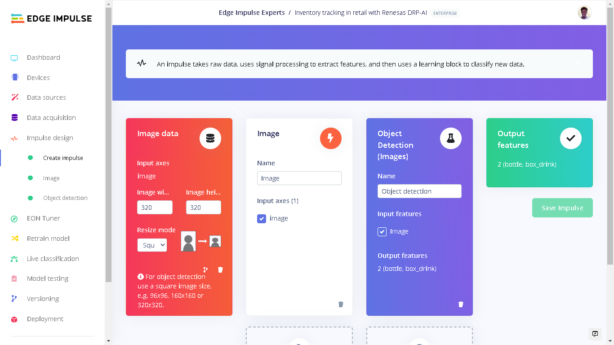

Under "Image" in Impulse design, the color depth of the images is set to RGB and the next step was to extract features.

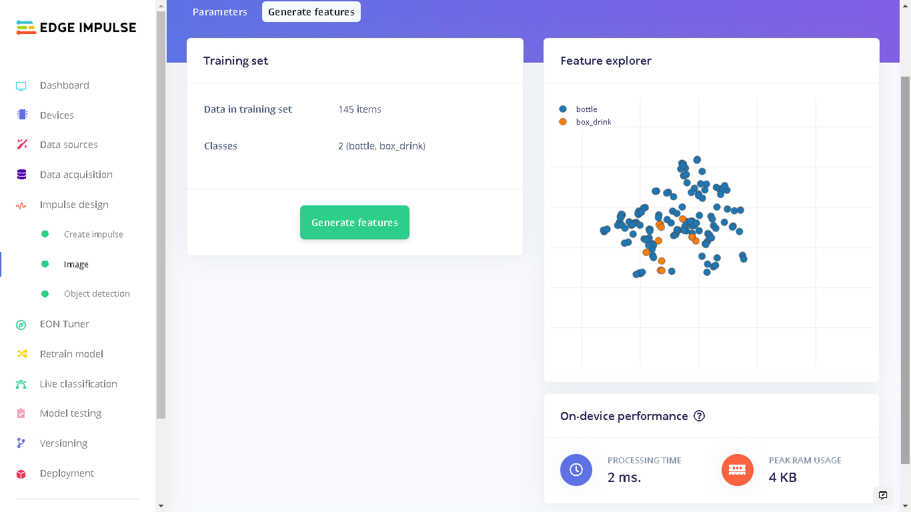

Here in the Features tab we can see the on-device performance for generating features during the deployment. These metrics are for the Renesas RZ/V2L (with DRP-AI accelerator). The [Renesas RZ/V2L Evaluation Board Kit](https://www.edgeimpulse.com/blog/edge-impulse-launches-official-support-for-the-renesas-rzv2l-evaluation-board) was recently supported officially by Edge Impulse. This board is designed for vision AI applications and it offers powerful hardware acceleration through its Dynamically Reconfigurable Processor (DRP) and multiply-accumulate unit (AI-MAC).

Currently, all Edge Impulse models can run on the RZ/V2L CPU which is a dedicated Cortex A55. However, so that I can benefit from the DRP-AI hardware acceleration, I chose a YOLOv5 model. Note that on the Training page you have to select the RZ/V2L (with DRP-AI accelerator) before starting the training in order to tell the Studio that you are training the model for the RZ/V2L. This can be done on the top right in the Training page or by changing target device in the Dashboard page.

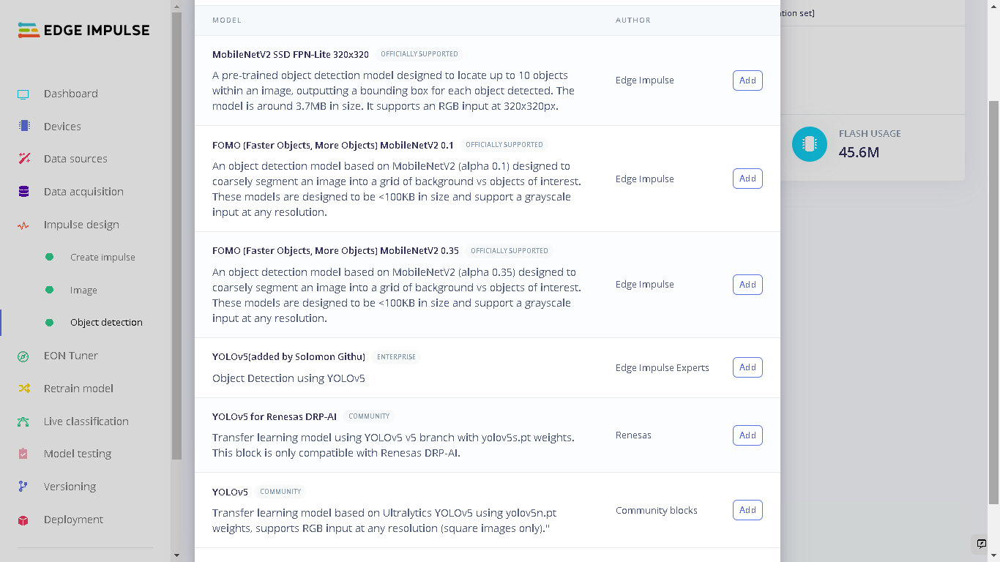

I used 200 training cycles with a learning rate of 0.001. It is however advised to train a YOLOv5 model using more than 1500 photos per class and more than 10,000 instances per class to produce a robust YOLOv5 model. Though as mentioned earlier, this is a proof-of-concept and we are using a limited quantity of data (though the SKU110K dataset is 11gb and has many more images to make use of!).

After the training process, I got a precision score of 89%. Precision is the number of True Positives divided by the number of True Positives plus the number of False Positives.

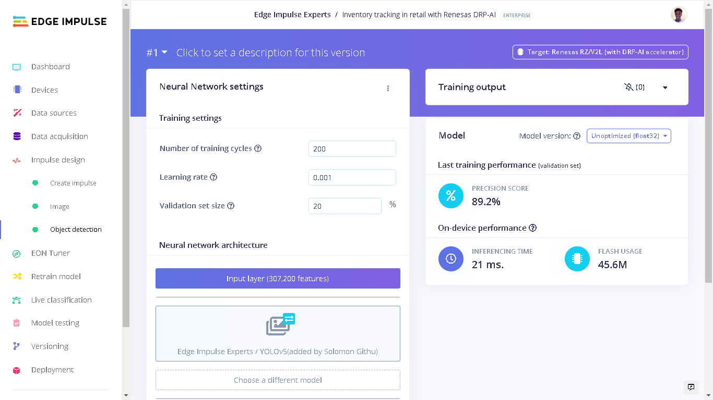

## Model Testing

After training a model, we need to do a test with some unseen (test) data. When we uploaded our data earlier, the images that were set aside into the Test category were not used during the training cycle, and are unseen by the model. Now they will be used. In my case, the model had an accuracy of 91% on this Test data. This accuracy is a percent of all samples with a precision score above 90%.

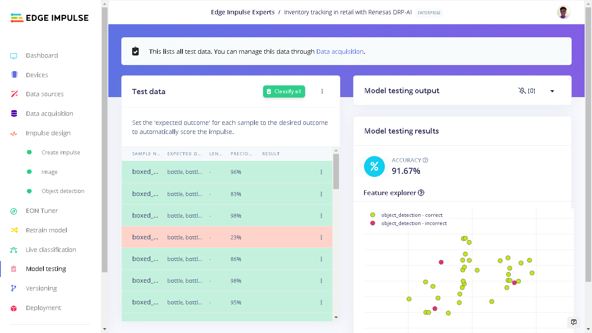

I felt this was an acceptable performance and proceeded to deploy the model to the Renesas RZ/V2L board.

## Deploying to Renesas RZ/V2L Evaluation Kit

The Renesas Evaluation Kit comes with the RZ/V2L board and a 5-megapixel Google Coral Camera. To setup the board, Edge Impulse has prepared a [guide](https://docs.edgeimpulse.com/renesas/development-platforms/officially-supported-cpu-gpu-targets/renesas-rz-v2l) that shows how to prepare the Linux Image, install the [Edge Impulse CLI](https://docs.edgeimpulse.com/docs/edge-impulse-for-linux/edge-impulse-for-linux), and finally connect to the Edge Impulse Studio.

.jpg>)

To run the model locally on the RZ/V2L we can run the command `edge-impulse-linux-runner` which lets us log in to our Edge Impulse account and select the project.

Alternatively, we can also download an executable of the model which contains the signal processing and ML code, compiled with optimizations for the processor, plus a very simple IPC layer (over a Unix socket). This executable is called an [.eim model](https://docs.edgeimpulse.com/docs/edge-impulse-for-linux/edge-impulse-for-linux#.eim-models).

To go about it in this manner, create a directory and navigate into the directory:

```
mkdir monitoring_retail_inventory && \
cd monitoring_retail_inventory
```

Next, download the `.eim` model with the command:

```
edge-impulse-linux-runner --download modelfile.eim
```

Now we can run the executable model locally using the command:

```
edge-impulse-linux-runner --model-file modelfile.eim
```

Here, we pass the name of the downloaded file **modelfile** in the command.

We can go to the provided URL and we will see the video feed being captured by the camera, as well as the bounding boxes if any detected objects are present.

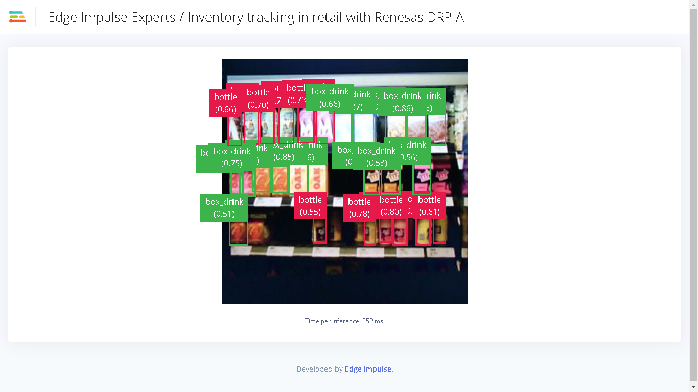

In my case I got a latency of 250ms which is around 4 FPS. There are a couple of factors that determine the performance of the model. First, a larger image means there are more features that are required to be processed. Next is hardware resource utilization. The YOLOv5 model has a image input size of 320x320px and takes 45.6 MBs of flash storage.

The choice of the large image size is due to the fact that the images from a store shelf have various objects. Reducing the image input size would mean that meaningful data is distorted which can decrease the training and test performance of the model.

In a separate test, I deployed a [FOMO](https://docs.edgeimpulse.com/docs/edge-impulse-studio/learning-blocks/object-detection/fomo-object-detection-for-constrained-devices) model to the RZ/V2L. This model, with an image input size of 48x48px, was found to have a latency of 5ms which is around 200 FPS. Impressive!

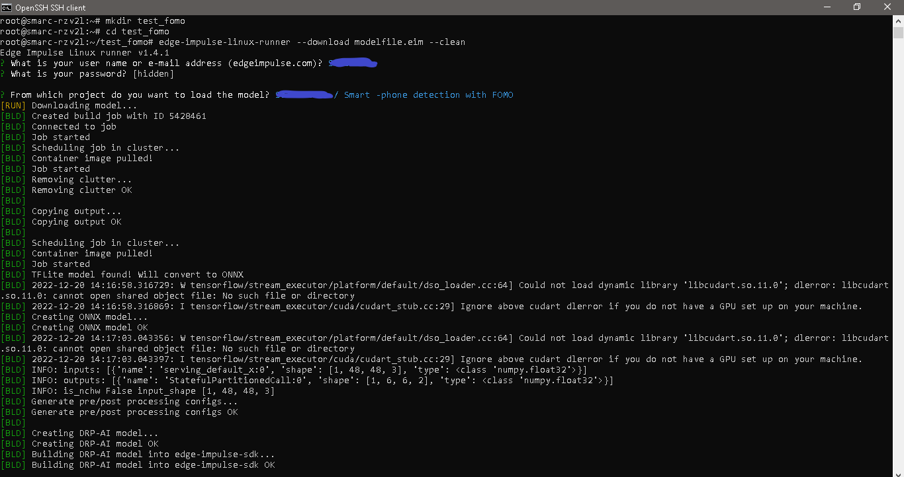

## A Smart Application to Count Shelf Items

Using the `.eim` executable and the [Edge Impulse Python SDK](https://docs.edgeimpulse.com/docs/edge-impulse-for-linux/edge-impulse-for-linux#sdks), I developed a Web application using [Flask](https://flask.palletsprojects.com/en/2.2.x/) that counts the number bottles and box drinks in a camera frame. The counts are then displayed on a webpage in real-time.

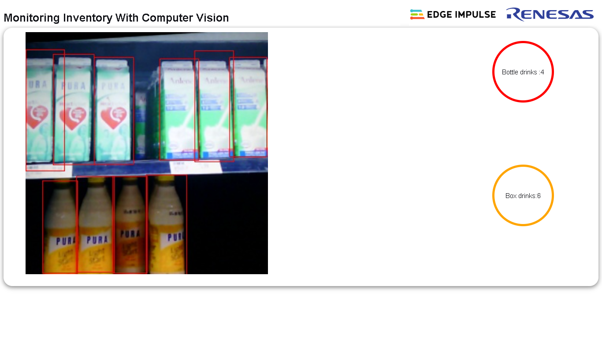

For the counting process, the application only shows the counts from the object detection with a camera facing the shelf. However in a retail store, products are placed on a shelf in rows of multiple depths, with more items immediately behind the front item. If the number of rows of known, then a total count can be acquired by simply multiplying the detected objects by the number of known rows.

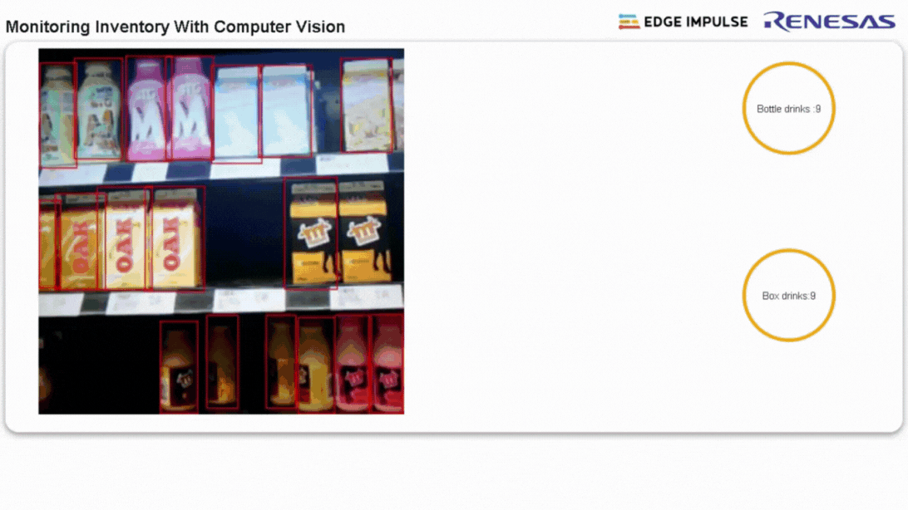

In a retail store, this application can be used with the surveillance cameras that see the various shelves. Another image source can be cameras mounted on shopping carts enabling views of where the surveillance cameras can't see. A manager can then be monitoring the inventory from the Web application and take any required actions if products are missing from their spaces or a count reaches a minimum threshold.

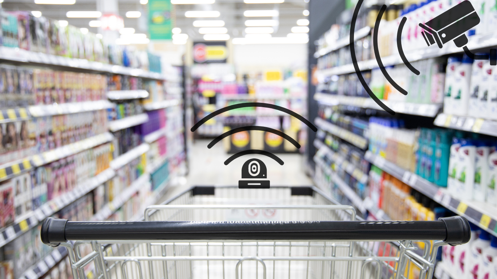

You can clone the public [GitHub Repository](https://github.com/SolomonGithu/inventory-tracking-with-Edge-Impulse) to your Renesas RZ/V2L board. The installation steps are in the repository. You can run the Flask application or the binary executable built with [PyInstaller](https://pyinstaller.org/en/stable/) for the Aarch64 platform.

## Conclusion

The suggested structure can be used in crowded retail establishments. This can assist in reducing the amount of time spent performing inventory counting, and help identify patterns in consumption.

The Renesas RZ/V2L provides an accelerator designed exclusively for Computer Vision applications, enhancing performance for rule-based image processing that can run concurrently with networks that are powered by the DRP-AI, in a low-power and easy-to-use format.
