# ROS 2 Pick and Place System - Arduino Braccio++ Robotic Arm and Luxonis OAK-D

Created By: Naveen Kumar

Public Project Link: [https://studio.edgeimpulse.com/public/178900/live](https://studio.edgeimpulse.com/public/178900/live)

GitHub Repository: [https://github.com/metanav/EI_Pick_n_Place/tree/main/pnp_ws/src/braccio_description/urdf](https://github.com/metanav/EI_Pick_n_Place/tree/main/pnp_ws/src/braccio_description/urdf)

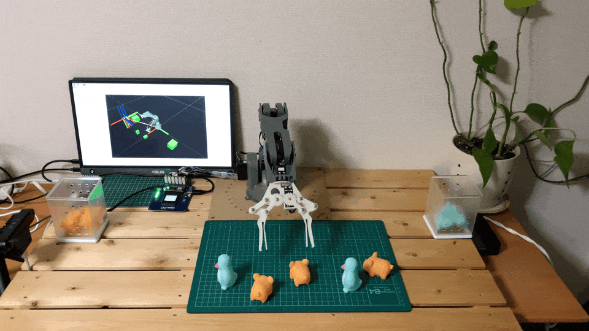

## Introduction

In this project, we will design and implement a system capable of performing pick-and-place tasks using a robot arm and a 3D depth camera. The system can recognize and locate objects in a cluttered and dynamic environment, and plan and execute grasping and placing actions. The system consists of the following components: 

- A 3D camera that can capture images of the scene and provide 3D information about the objects and their poses. 
- A robot arm that can move and orient its end-effector according to the desired position and orientation. 
- A gripper that can attach and detach objects of various shapes and sizes. 
- A control system that can process the 3D images, perform object recognition and localization, plan the grasping and placing strategies, and control the robot arm and the gripper.

The system can be used for various pick-and-place applications, such as bin picking, assembly, sorting, or packaging. The system can also be adapted to different scenarios by changing the camera, the robot arm, the gripper, or the software. The system can provide flexibility, accuracy, and efficiency for industrial or domestic tasks. This project might seem simple at first glance, but is surprisingly complex. We will be utilizing plastic toys to sort them. Sorting is a crucial task, from manufacturing to logistics, and requires a great deal of precision and attention to detail. By using these plastic toys, we will be able to test and refine our sorting techniques in a safe and controlled environment. 

## Hardware Selection

We are using [Arduino Braccio ++](https://www.arduino.cc/education/braccio/) for the robotic manipulation. 

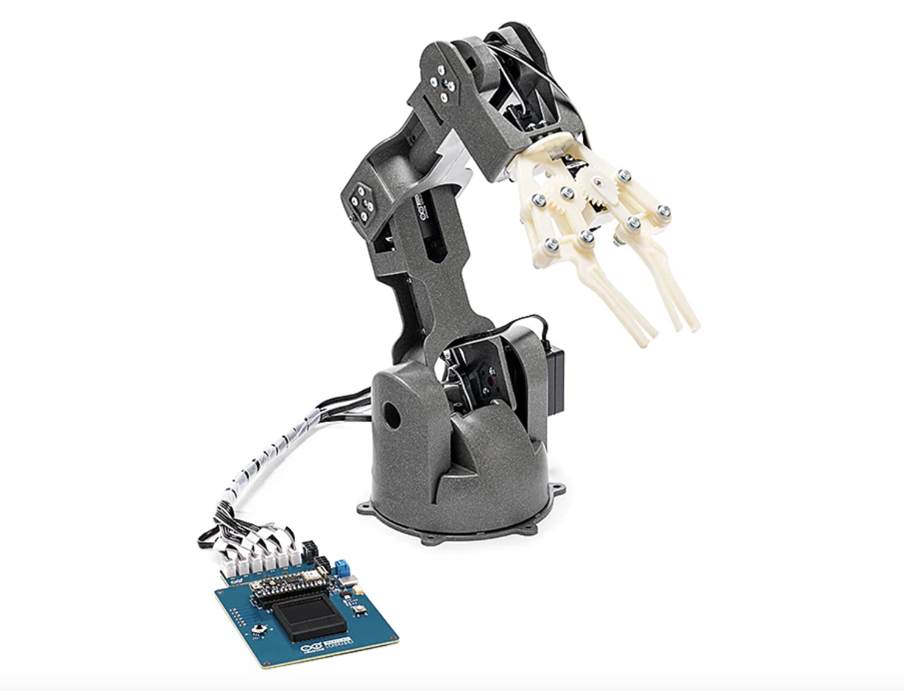

For a depth camera, we will be utilizing the [Luxonis OAK-D](https://docs.luxonis.com/projects/hardware/en/latest/pages/BW1098OAK/), which will be doing object recognition and localization. An object detection model trained using the Edge Impulse Studio will be deployed directly on the OAK-D camera.

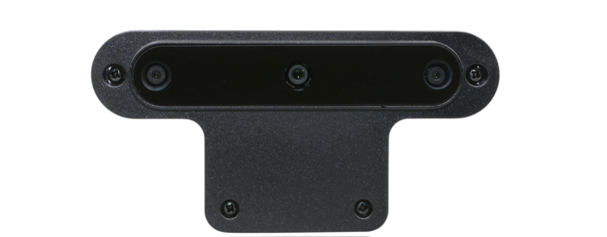

A Raspberry Pi 5 will be used as a main controller, to host ROS 2 nodes and an interface between the robotic arm and the depth camera.

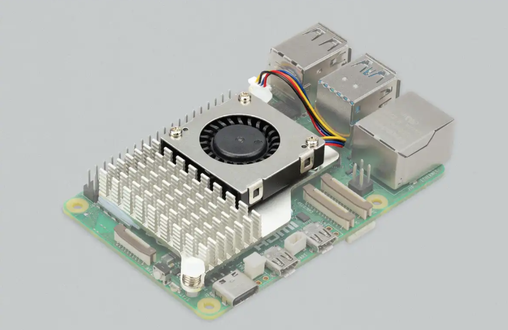

Instead of sticking with the same old boring color cubes 🧊 that you see everywhere online for a pick-and-place demo, we’re going to have some fun sorting through these colorful plastic toys,  **Penguins** 🐧 and **Pigs** 🐷!

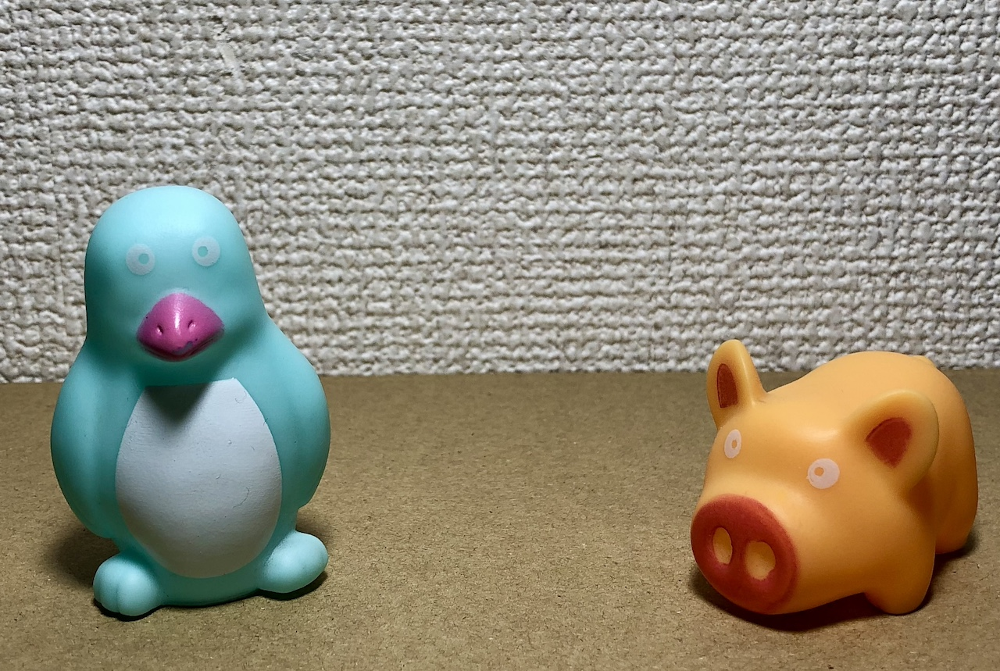

## Setting up the Development Environment

We can use the [Raspberry Pi Imager](https://www.raspberrypi.com/software/) to install the Raspberry Pi OS (64-bit, Bookworm) on an SD card. The Raspberry Pi Imager allows for easy setup of user accounts, Wi-Fi credentials, and SSH server.

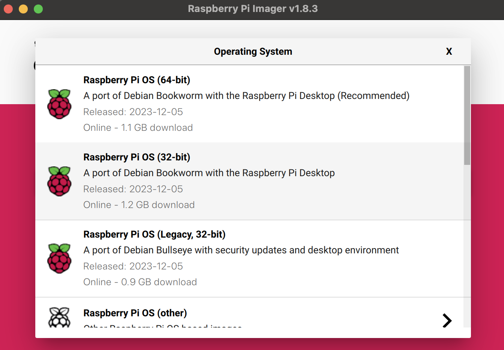

After the installation is completed, we can insert the SD card back into the kit and power it on. Once it boots up, we can log in via ssh. 

## Installing ROS 2 Humble

The Robot Operating System (ROS) is a set of software libraries and tools for building robot applications. We will use ROS 2 Humble for this project since it is stable on the Raspberry Pi OS. The ROS 2 binary packages are not available for Raspberry Pi OS, so we need to build it from the source. Please follow the steps below to install it.

### Set locale

Make sure we have a locale that supports `UTF-8`.

```
$ locales

LANG=en_US.UTF-8
LANGUAGE=
LC_CTYPE="en_US.UTF-8"
LC_NUMERIC="en_US.UTF-8"
LC_TIME="en_US.UTF-8"
LC_COLLATE="en_US.UTF-8"
LC_MONETARY="en_US.UTF-8"
LC_MESSAGES="en_US.UTF-8"
LC_PAPER="en_US.UTF-8"
LC_NAME="en_US.UTF-8"
LC_ADDRESS="en_US.UTF-8"
LC_TELEPHONE="en_US.UTF-8"
LC_MEASUREMENT="en_US.UTF-8"
LC_IDENTIFICATION="en_US.UTF-8"
LC_ALL=en_US.UTF-8
```

Otherwise,  run the following command to open the Raspberry Pi Configuration CLI:

```
$ sudo raspi-config
```

Under `Localisation Options` > `Local`, choose `en_US.UTF-8`. 

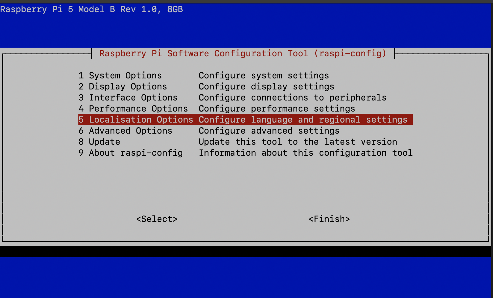

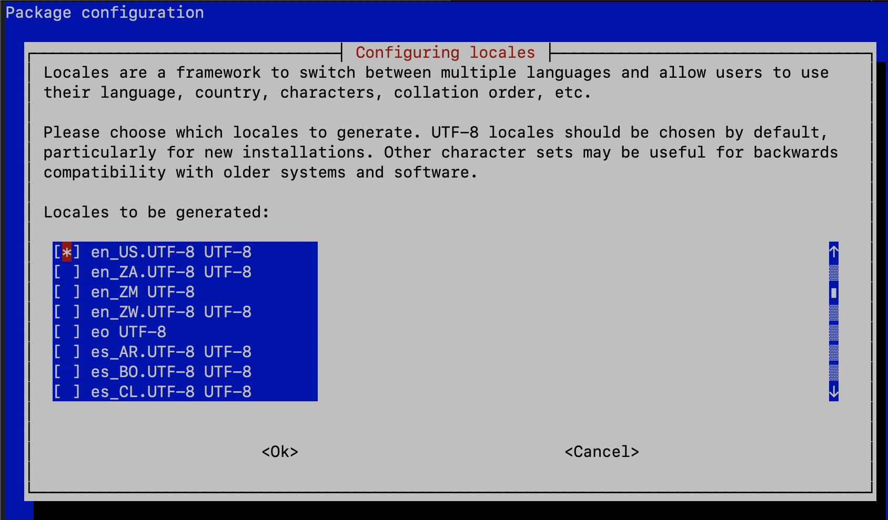

### Add the ROS 2 apt repository 

```
$ sudo apt install software-properties-common
$ sudo add-apt-repository universe
$ sudo apt update && sudo apt install curl -y 
$ sudo curl -sSL https://raw.githubusercontent.com/ros/rosdistro/master/ros.key -o /usr/share/keyrings/ros-archive-keyring.gpg
$ echo "deb [arch=$(dpkg --print-architecture) signed-by=/usr/share/keyrings/ros-archive-keyring.gpg] http://packages.ros.org/ros2/ubuntu $(. /etc/os-release && echo $VERSION_CODENAME) main" | sudo tee /etc/apt/sources.list.d/ros2.list > /dev/null

```

### Install development tools and ROS tools

```
$ sudo apt update && sudo apt install -y \
  python3-flake8-docstrings \
  python3-pip \
  python3-pytest-cov \
  ros-dev-tools
 
$ sudo apt install -y \
   python3-flake8-blind-except \
   python3-flake8-builtins \
   python3-flake8-class-newline \
   python3-flake8-comprehensions \
   python3-flake8-deprecated \
   python3-flake8-import-order \
   python3-flake8-quotes \
   python3-pytest-repeat \
   python3-pytest-rerunfailures
```

### Build ROS 2 Humble

```
$ mkdir -p ~/ros2_humble/src && cd ~/ros2_humble
$ vcs import --input https://raw.githubusercontent.com/ros2/ros2/humble/ros2.repos src
$ sudo apt upgrade
$ sudo rosdep init
$ rosdep update
$ rosdep install --from-paths src --ignore-src -y --skip-keys "fastcdr rti-connext-dds-6.0.1 urdfdom_headers"
$ colcon build --symlink-install
```

## MoveIt 2 Installation

**MoveIt 2** is the robotic manipulation platform for ROS 2 and incorporates the latest advances in motion planning, manipulation, 3D perception, kinematics, control, and navigation. We will be using it to set up the robotic arm and the motion planning.

```
$ sudo apt install python3-colcon-common-extensions
$ sudo apt install python3-colcon-mixin
$ colcon mixin add default https://raw.githubusercontent.com/colcon/colcon-mixin-repository/master/index.yaml
$ colcon mixin update default
$ mkdir -p ~/ws_moveit2/src && cd ~/ws_moveit2/src
$ git clone --branch humble https://github.com/ros-planning/moveit2_tutorials
$ vcs import < moveit2_tutorials/moveit2_tutorials.repos
$ sudo apt update && rosdep install -r --from-paths . --ignore-src --rosdistro $ROS_DISTRO -y
$ cd ~/ws_moveit2
$ source ~/ros2_humble/install/setup.bash
$ colcon build --mixin release
```

## DepthAI ROS Installation

**DepthAI ROS** is a ROS 2 package that allows us to:

- Use the OAK-D camera as an RGBD sensor for the 3D vision needs.
- Load Neural Networks and get the inference results straight from the camera.

The following script will install depthai-core, update USB rules,  and install depthai device drivers.

```
$ sudo wget -qO- https://raw.githubusercontent.com/luxonis/depthai-ros/main/install_dependencies.sh | sudo bash
```

Execute the following commands to set up a DepthAI ROS 2 workspace.

```
$ mkdir -p dai_ws/src && cd dai_ws/src
$ git clone --branch humble https://github.com/luxonis/depthai-ros.git
$ cd ..
$ rosdep install --from-paths src --ignore-src -r -y
$ source ~/ros2_humble/install/setup.bash
$ MAKEFLAGS="-j1 -l1" colcon build
```

## micro-ROS

The **micro-ROS** stack integrates microcontrollers seamlessly with standard ROS 2 and brings all major ROS concepts such as nodes, publishers, subscriptions, parameters, and lifecycle onto embedded systems.  We will use micro-ROS on the **Arduino Nano RP2040 Connect** mounted on the **Braccio Carrier** board. The Arduino Nano RP2040 will publish the joint states and subscribe to the arm manipulation commands. It will communicate to ROS 2 on the Raspberry Pi 5 over serial port transports.

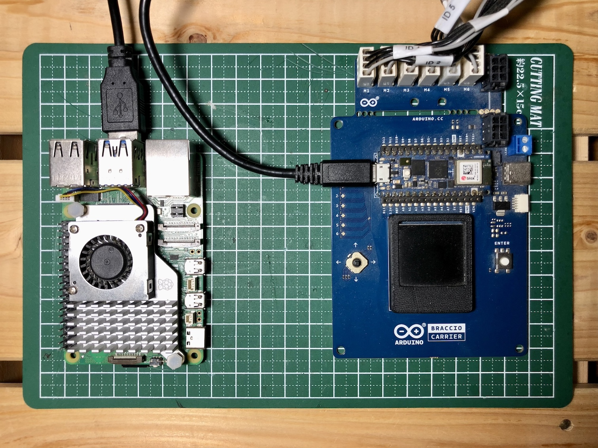

### micro-ROS Agent Installation

The **micro-ROS agent** is a ROS 2 node that receives and sends messages from micro-ROS nodes and keeps track of the micro-ROS nodes, exposing them to the ROS 2 network. Execute the following command to install the micro-ROS agent on the Raspberry Pi 5.

```
$ mkdir ~/microros_ws && cd microros_ws
$ source ~/ros2_humble/install/setup.bash
$ git clone -b humble https://github.com/micro-ROS/micro_ros_setup.git src/micro_ros_setup
$ sudo apt update && rosdep update
$ rosdep install --from-paths src --ignore-src -y
$ colcon build
$ source install/local_setup.bash
$ ros2 run micro_ros_setup create_agent_ws.sh
$ ros2 run micro_ros_setup build_agent.sh
```

## Data Collection

We captured 101 images of the pigs and penguins using the OAK-D camera and uploaded them to Edge Impulse Studio.

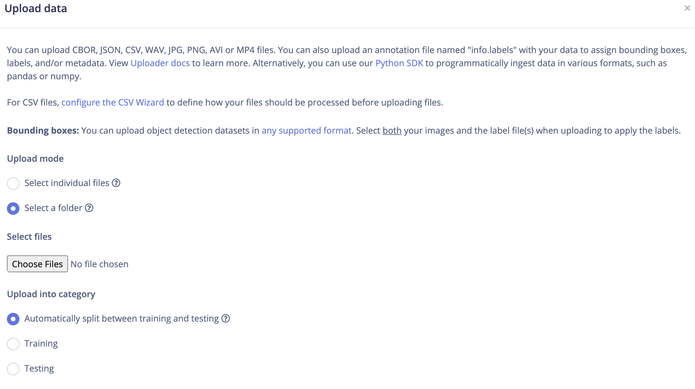

We can see the uploaded images on the **Data Acquisition** page.

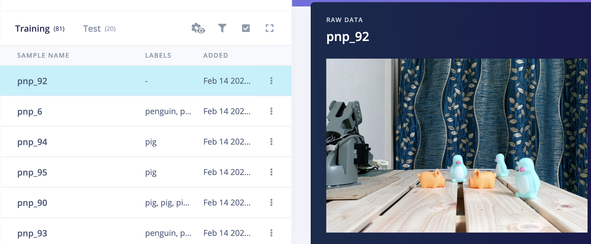

We can now label the data using bounding boxes in the **Labeling Queue** tab, as demonstrated in the GIF below.

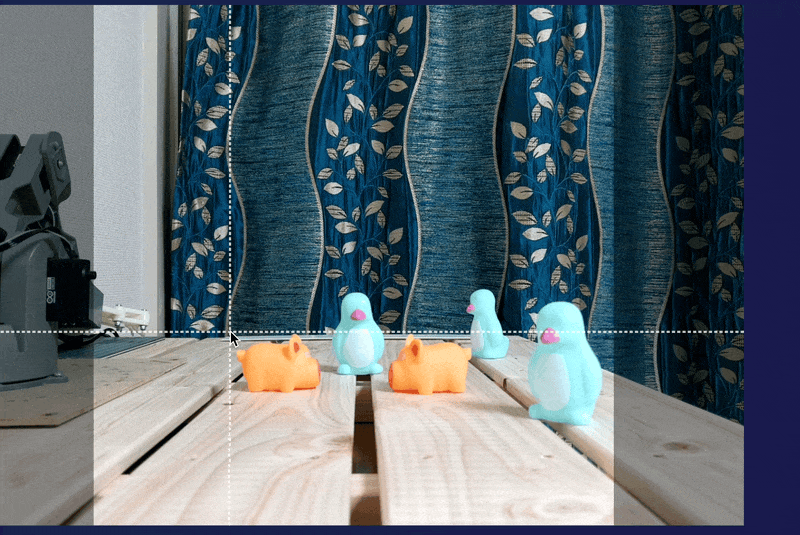

## Model Training

To create an Impulse, follow these steps:

- Go to the **Impulse Design** section, then select the **Create Impulse** page. We have opted for a 320x320 pixel image size in the "Image Data" form fields to achieve better accuracy.
- Click on "Add a processing block" and choose "Image". This step will pre-process and normalize the image data while also giving us the option to choose the color depth.
- Click on "Add a learning block" and choose "Object Detection (Images)".
- Finally, click on the "Save Impulse" button to complete the process.

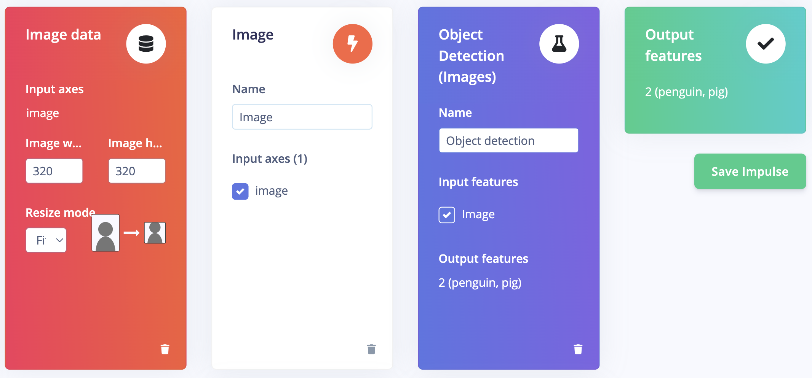

On the **Image** page, choose *RGB* as color depth and click on the **Save parameters** button. The page will be redirected to the **Generate Features** page.

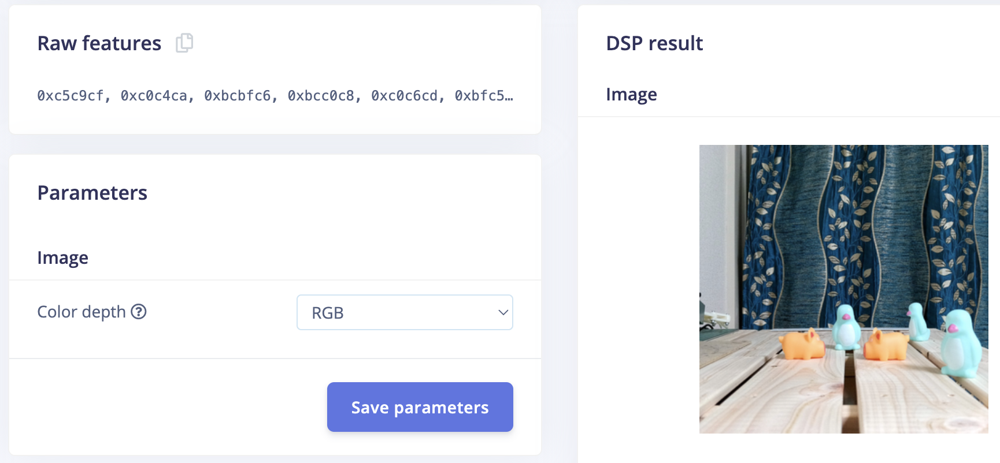

Now we can initiate feature generation by clicking on the **Generate features** button. Once the feature generation is completed, the data visualization will be visible in the **Feature Explorer** panel.

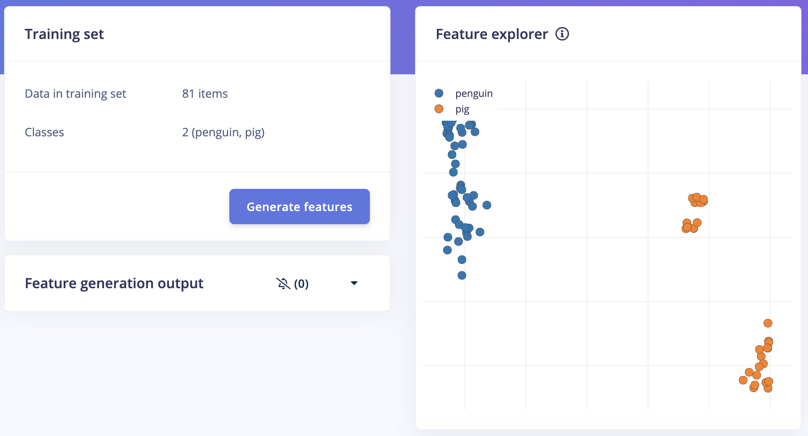

Go to the **Object Detection** page, then click "Choose a different model" and select the **YOLOv5** model. There are 4 variations of the model size available, and we selected the **Nano** version with 1.9 million parameters. Afterward, click the "Start training" button. The training process will take a few minutes to complete.

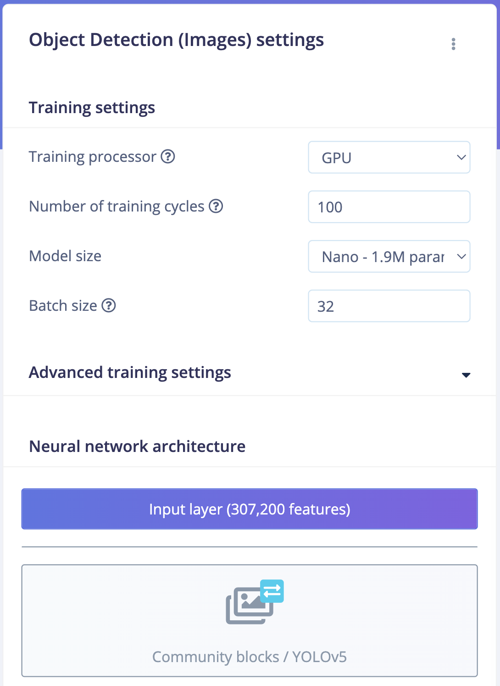

Once the training is completed we can see the precision score and metrics as shown below.

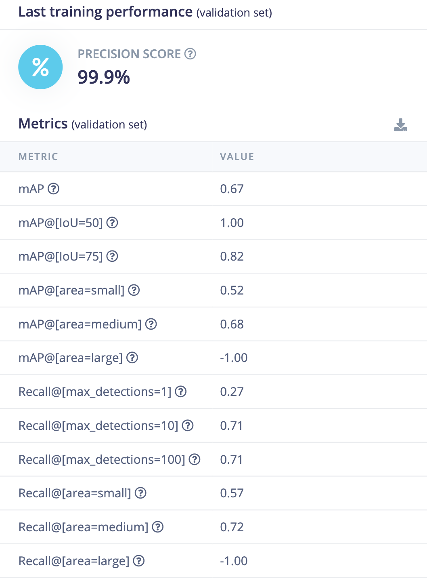

## Model Testing

On the **Model testing** page, click on the "Classify All" button which will initiate model testing with the trained float32 model. The testing accuracy is **100%**.

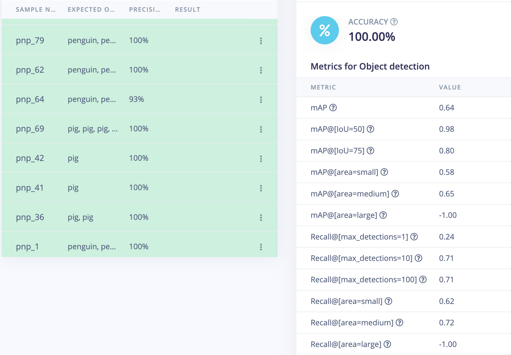

## Model Deployment

To verify the model, we will run the inferencing on the Raspberry Pi 5 (CPU) before deploying it to the OAK-D device. Execute the following commands to install the Edge Impulse Linux Runner.

```
$ curl -sL https://deb.nodesource.com/setup_18.x | sudo bash -
$ sudo apt install -y gcc g++ make build-essential nodejs sox gstreamer1.0-tools gstreamer1.0-plugins-good gstreamer1.0-plugins-base gstreamer1.0-plugins-base-apps
$ sudo npm install edge-impulse-linux -g --unsafe-perm
```

Execute the following commands to use the OAK-D as a USB webcam for the Edge Impulse Linux Runner. 

```
$ git clone https://github.com/luxonis/depthai-python.git
$ cd depthai-python
$ python3 -m venv .
$ source bin/activate
$ python3 examples/UVC/uvc_rgb.py
Device started, please keep this process running
and open a UVC viewer to check the camera stream.

To close: Ctrl+C
```

To download the `eim` model and start the inferencing, run the following command and follow the instructions.  

```
$ edge-impulse-linux-runner
Edge Impulse Linux runner v1.5.1
? What is your user name or e-mail address (edgeimpulse.com)? <email address>
? What is your password? [hidden]
? From which project do you want to load the model? Edge Impulse Experts / Pick and Place
[RUN] Downloading model...
[RUN] Downloading model OK
[RUN] Stored model version in /home/naveen/.ei-linux-runner/models/178900/v3/model.eim
[RUN] Starting the image classifier for Edge Impulse Experts / PnP (v3)
[RUN] Parameters image size 320x320 px (3 channels) classes [ 'penguin', 'pig' ]
[GST] checking for /etc/os-release
[RUN] Using camera Luxonis Device starting...
[RUN] Connected to camera

Want to see a feed of the camera and live classification in your browser? Go to http://192.168.3.10:4912
```

We can see the inferencing output on the web browser.  Also, we can monitor the terminal logs.

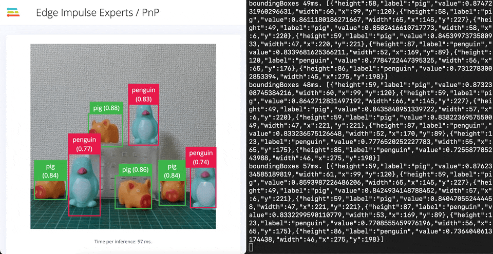

To allow DepthAI to use our custom-trained model, we need to convert them into a MyriadX blob file format so that they are optimized for the Movidius Myriad X processor on the OAK-D.

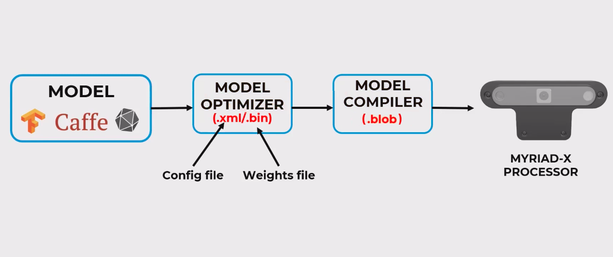

The Edge Impulse Studio helps us save a step by providing the ONNX format for the trained YOLOv5 model that we can download from the project's **Dashboard** page.

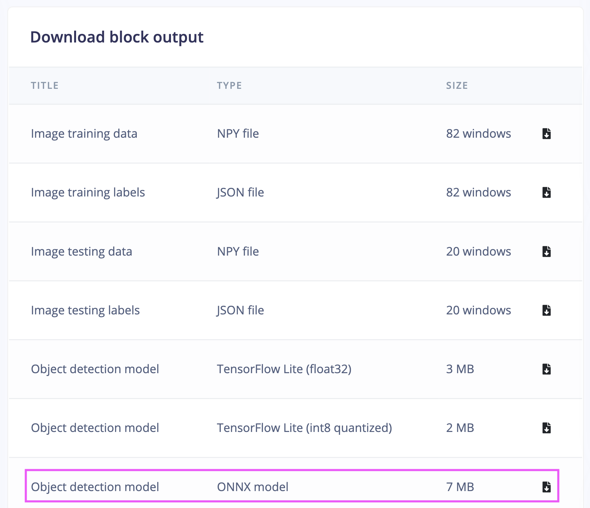

We will utilize the **OpenVINO** model optimizer for conversion on an x86 Linux machine. OpenVINO is an open-source software toolkit for optimizing and deploying deep learning models. Execute the following commands to install all prerequisites for the conversion process.

```
$ virtualenv --python=python3.8 ~/openvino_env
$ source ~/openvino_env/bin/activate
$ python3 -m pip install --upgrade pip
$ pip3 install openvino-dev==2022.1
$ pip3 install blobconverter
```

Decoding a custom YOLOv5 model on the device is not simple. We need to add a few operations to the nodes in the exported ONNX file and then prune the model. The following Python script automates this process.

```
import onnx
import os

onnx_path = 'ei-pnp_yolov5n_320_batch32_epoch100.onnx'
onnx_model = onnx.load(onnx_path)

conv_indices = []
for i, n in enumerate(onnx_model.graph.node):
  if "Conv" in n.name:
    conv_indices.append(i)

input1, input2, input3 = conv_indices[-3:]

sigmoid1 = onnx.helper.make_node(
    'Sigmoid',
    inputs=[onnx_model.graph.node[input1].output[0]],
    outputs=['output1_yolov5'],
)

sigmoid2 = onnx.helper.make_node(
    'Sigmoid',
    inputs=[onnx_model.graph.node[input2].output[0]],
    outputs=['output2_yolov5'],
)

sigmoid3 = onnx.helper.make_node(
    'Sigmoid',
    inputs=[onnx_model.graph.node[input3].output[0]],
    outputs=['output3_yolov5'],
)

onnx_model.graph.node.append(sigmoid1)
onnx_model.graph.node.append(sigmoid2)
onnx_model.graph.node.append(sigmoid3)

base, ext = os.path.splitext(onnx_path)
onnx.save(onnx_model, f'{base}_prune{ext}')
```

The ONNX model can be large and architecture-dependent. For the on-device inferencing,  we need to convert the model to the OpenVINO Intermediate Representation (IR) format which is a proprietary model format of OpenVINO. The model conversion API translates the frequently used deep learning operations to their respective similar representation in OpenVINO and tunes them with the associated weights and biases from the trained model. The resulting IR contains two files:

- `.xml` - Describes the model topology.
- `.bin` - Contains the weights and binary data.

Execute the following command to generate the IR files.

```
$ mo --model_name ei-pnp_yolov5n_320 \
--output_dir IR \
--input_shape [1,3,320,320] \
--reverse_input_channel \
--scale 255 \
--output "output1_yolov5,output2_yolov5,output3_yolov5" \
--stream_output \
--input_model ei-pnp_yolov5n_320_batch32_epoch100_prune.onnx
```

After converting the model to OpenVINO’s IR format, run the following script to compile it into a `.blob` file, which can be deployed to the OAK-D device.

```
import blobconverter
import shutil

blob_dir = "IR"
binfile = f"{blob_dir}/ei-pnp_yolov5s_320.bin"
xmlfile = f"{blob_dir}/ei-pnp_yolov5s_320.xml"

blob_path = blobconverter.from_openvino(
    xml=xmlfile,
    bin=binfile,
    data_type="FP16",
    shaves=6,
    version="2022.1",
    use_cache=False
)

shutil.move(str(blob_path), blob_dir)
```

This will create the *ei-pnp_yolov5n_320_openvino_2022.1_6shave.blob* file in the IR directory. We should copy this blob file to the `~/EI_Pick_n_Place/pnp_ws/src/ei_yolov5_detections/resources` folder on the Raspberry Pi 5. We can test the generated model using the depthai-python library: 

```
$ pip3 install -U pip
$ pip3 install --extra-index-url https://artifacts.luxonis.com/artifactory/luxonis-python-snapshot-local/ depthai
$ export DISPLAY=:0
$ cd ~/EI_Pick_n_Place/pnp_ws/src/ei_yolov5_detections/src
$ python3 ei_yolov5_spatial_stream.py 
```

The Python script can be found in the GitHub repository:

https://github.com/metanav/EI_Pick_n_Place/blob/main/pnp_ws/src/ei_yolov5_detections/src/ei_yolov5_spatial_stream.py

Take a look at the GIF below, which displays the RGB and spatial depth detections side by side. The RGB detections indicate the 3D location (X, Y, Z)  with bounding boxes, while the depth image shows the bounding boxes with a 25% scale factor for accurate object localization. For depth (Z), each pixel inside the scaled bounding box (ROI) is taken into account. This gives us a set of depth values, which are then averaged to get the final depth value. Also, the depth image is wider than the RGB image because they have different resolutions.

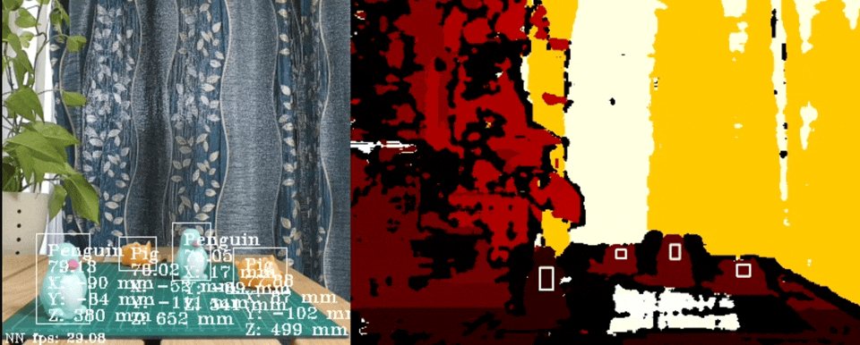

## Setup the Robotic Arm

### Build a visual robot model

First, we need to define a visual model of the Arduino Braccio ++ using the URDF (Unified Robot Description Format) which is a file format for specifying the geometry and organization of robots in ROS 2. We will be using the [publicly available](https://github.com/metanav/EI_Pick_n_Place/tree/main/pnp_ws/src/braccio_description/stl) STL files for the parts of the robot.  We can see one of the STL parts (shoulder) in the following GIF.

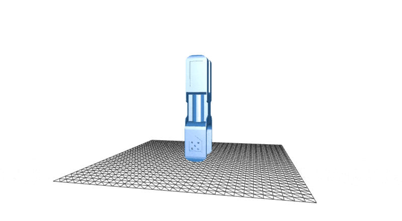

We created a ROS 2 package `moveit_resources_braccio_description` to keep all STL files and  URDF for reusability. The robot model URDF can be found in the GitHub repository for this project:

https://github.com/metanav/EI_Pick_n_Place/tree/main/pnp_ws/src/braccio_description/urdf

### Verify the robot model

We can verify if the URDF is functioning as expected by publishing simulated joint states and observing the changes in the robot model using the RViz 2 graphical interface. Execute the following commands to install the `urdf_launch` and `joint_state_publisher` packages and launch the visualization.

```        
$ cd ~/ros2_humble/src
$ git clone https://github.com/ros/urdf_launch.git 
$ git clone -b ros2 https://github.com/ros/joint_state_publisher.git
$ cd ~/ros2_humble
$ colcon build --packages-select urdf_launch joint_state_publisher_gui
$ source install/setup.sh
$ cd ~
$ git clone https://github.com/metanav/EI_Pick_n_Place.git
$ cd ~/EI_Pick_n_Place/pnp_ws
$ colcon build --packages-select moveit_resources_braccio_description
$ ros2 launch moveit_resources_braccio_description display.launch.py
```

By adjusting the sliders for the joints, we can observe the corresponding changes in the robot model.

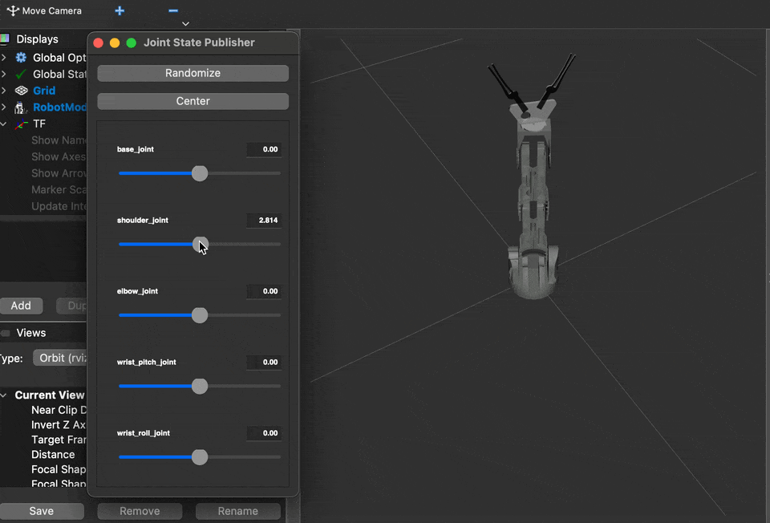

### Generate configuration using the MoveIt Setup Assistant 2.0

The MoveIt Setup Assistant 2.0 is a GUI for configuring the manipulator for use with MoveIt 2. Its primary function is generating a Semantic Robot Description Format (SRDF) file for the manipulator, which specifies additional information required by MoveIt 2 such as planning groups, end effectors, and various kinematic parameters. Additionally, it generates other necessary configuration files for use with the MoveIt 2 pipeline. 

To start the MoveIt Setup Assistant 2.0, execute the commands below.

```
$ source ~/ros2_humble/install/setup.sh
$ source ~/ws_moveit2/install/setup.sh
$ ros2 launch moveit_setup_assistant setup_assistant.launch.py
```

Click on the **Create New MoveIt Configuration Package** and provide the path of the `braccio.urdf` file from the `moveit_resources_braccio_description` package.

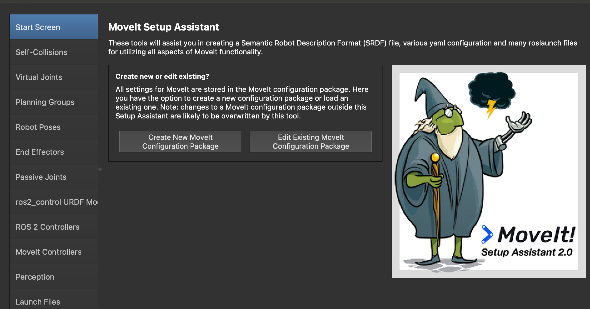

To generate the collision matrix, select the **Self-Collisions** pane on the left-hand side of the MoveIt Setup Assistant and adjust the self-collision sampling density. Then, click on the **Generate Collision Matrix** button to initiate the computation. The Setup Assistant will take a few seconds to compute the self-collision matrix, which involves checking for pairs of links that can be safely disabled from collision checking.

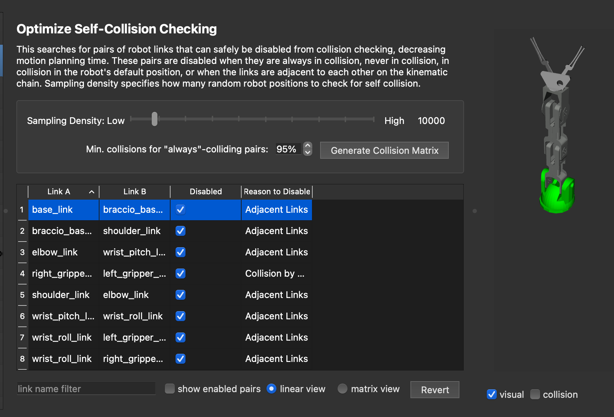

We will define a `fixed` virtual joint that attaches the `base_link` of the arm to the `world` frame. This virtual joint signifies that the base of the arm remains stationary in the world frame.

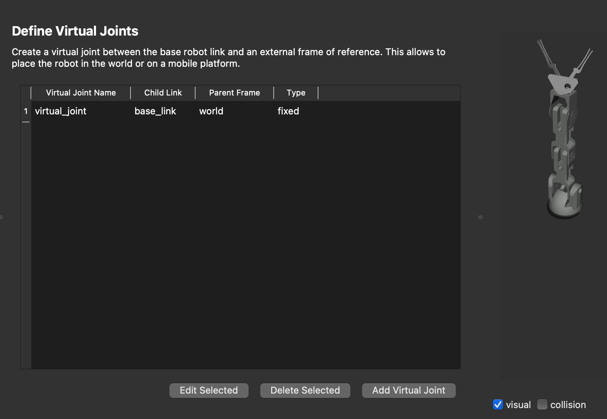

Planning groups in MoveIt 2 semantically describe different parts of the robot, such as the arm or end effector, to facilitate motion planning.

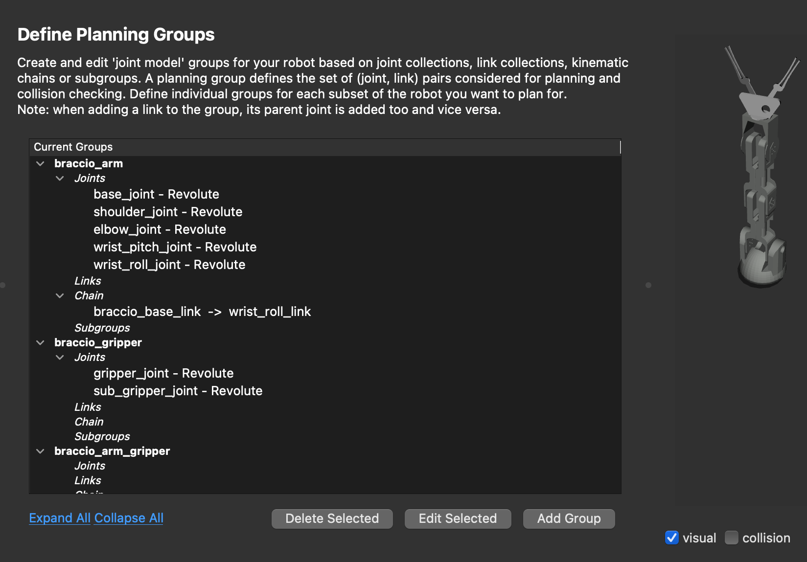

The Setup Assistant allows us to add predefined poses to the robot’s configuration, which can be useful for defining specific initial or ready poses. Later, the robot can be commanded to move to these poses using the MoveIt API. Click on the **Add Pose** and choose a name for the pose.

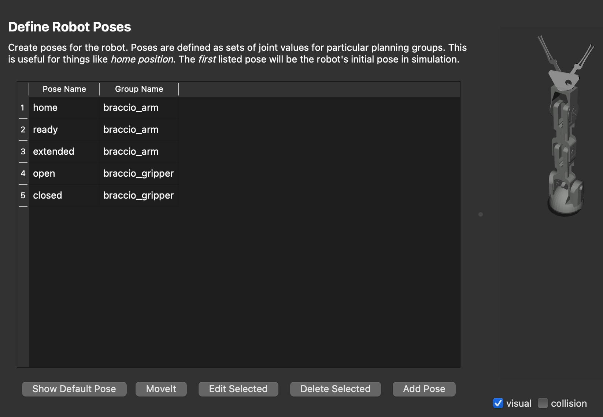

The robot will be in the default pose, with all joints set to their zero values. Move the individual joints around until we find the intended pose and then **Save** the pose.


Now we can designate the  `braccio_gripper`  group as an end effector. The end effectors can be used for attaching objects to the arm while carrying out pick-and-place tasks.

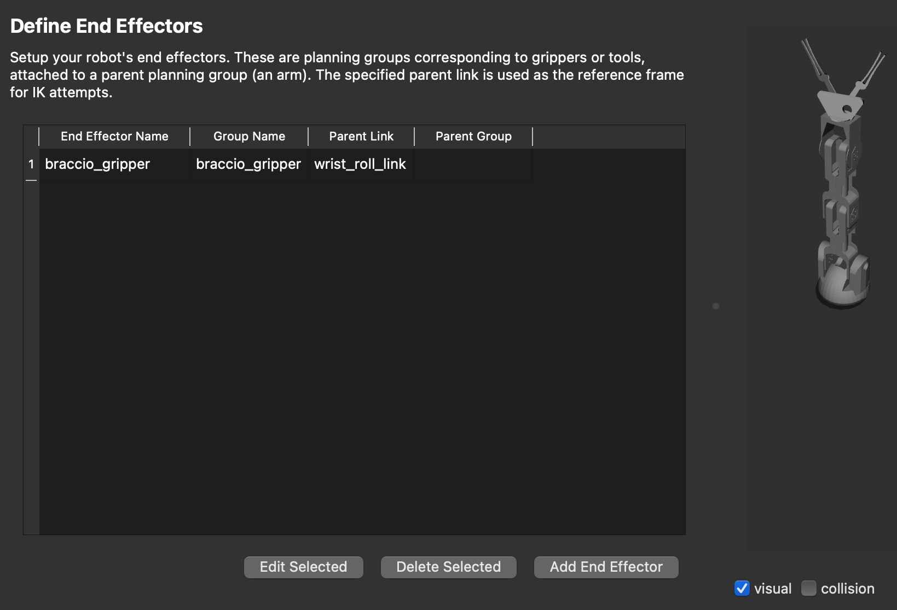

## Arduino Braccio++ Controller Firmware

Please follow the instructions [here](https://www.arduino.cc/en/software) to download and install the Arduino IDE. After installation, open the Arduino IDE and install the board package for the **Arduino Mbed OS Nano Boards** by going to **Tools** > **Board** > **Boards Manager**. Search the board package as shown below and install it.

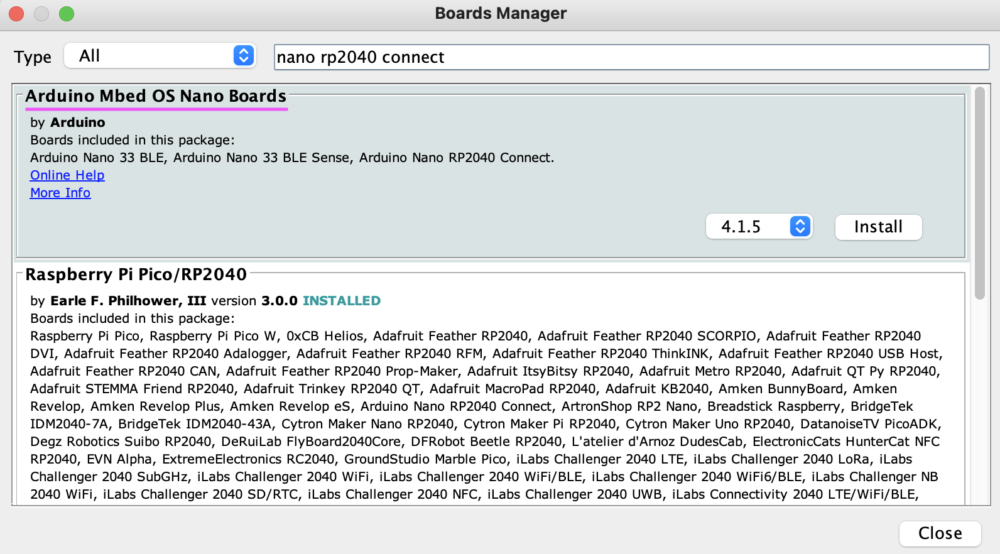

After completing the board package installation, choose the **Arduino Nano RP2040 Connect** from **Tools** > **Board** > **Arduino Mbed OS Nano boards** menu. We must install **[Arduino_Braccio_plusplus](https://github.com/arduino-libraries/Arduino_Braccio_plusplus) (1.3.2)** and **[micro_ros_arduino]([micro_ros_arduino](https://github.com/micro-ROS/micro_ros_arduino)) (humble)** libraries. The firmware sketch can be found in the GitHub repository:

https://github.com/metanav/EI_Pick_n_Place/blob/main/Arduino/braccio_plus_plus_controller_final_v3.1/braccio_plus_plus_controller_final_v3.1.ino.

Now we should build and upload the firmware to the Arduino Nano RP2040 connect. During startup, the application attempts to connect to the micro-ROS agent on the Raspberry Pi 5 over serial port transports. It then initiates a node that publishes real-time states of the robotic arm joints to the `/joint_states` topic and subscribes to the `/gripper/gripper_cmd` and `/arm/follow_joint_trajectory` topics.

## Launch ROS 2 Nodes

We should launch the ROS 2 nodes on separate terminals on the Raspberry Pi 5 by executing the following commands step-by-step.

1. ##### Launch micro-ROS agent

   The micro-ROS agent exposes the publishers and action server running on the Braccio ++ MCU to ROS 2.

   ```
   $ source ~/ros2_humble/install/setup.sh 
   $ source ~/microros_ws/install/setup.sh
   $ ros2 run micro_ros_agent micro_ros_agent serial --dev /dev/ttyACM0
   ```

2. ##### Launch ei_yolov5_detections node

   The `ei_yolov5_detections` node detects the objects and publishes the detection results using the Edge Impulse trained model on the OAK-D depth camera.

   ```
   $ source ~/ros2_humble/install/setup.sh 
   $ source ~/dai_ws/install/setup.sh 
   $ source ~/pnp_ws/install/setup.sh 
   $ ros2 launch ei_yolov5_detections ei_yolov5_publisher.launch.py
   ```

   We can check the spatial detection message as follows.

   ```
   $ ros2 topic echo /ei_yolov5/spatial_detections
   
   ---
   header:
     stamp:
       sec: 1708778065
       nanosec: 719748991
     frame_id: oak_rgb_camera_optical_frame
   detections:
   - results:
     - class_id: '0'
       score: 0.0
     bbox:
       center:
         position:
           x: 163.0
           y: 232.5
         theta: 0.0
       size_x: 54.0
       size_y: 91.0
     position:
       x: 0.0026015033945441246
       y: -0.05825277045369148
       z: 0.35132256150245667
     is_tracking: false
     tracking_id: ''
   ```

   

3. ##### Launch pick_n_place node

   The `pick_n_place` node plans a pick and place operation using [MoveIt Task Constructor](https://github.com/ros-planning/moveit_task_constructor/tree/ros2/). MoveIt Task Constructor provides a way to plan for tasks that consist of multiple different subtasks (known as stages as shown in the image below). 


   This node subscribes to the `/ei_yolov5/spatial_detections` topic and plans the pick and place operation. While bringing up this node, we need to provide command line parameters for the exact (X, Y, Z) position of the camera in meters from the base of the robot. 

   ```
   $ source ~/ros2_humble/install/setup.sh 
   $ source ~/ws_moveit2/install/setup.sh 
   $ source ~/pnp_ws/install/setup.sh 
   $ ros2 launch pick_n_place pick_n_place.launch.py \
   	cam_pos_x:=0.26   \
   	cam_pos_y:=-0.425 \
   	cam_pos_z:=0.09   \
   	cam_roll:=0.0     \
   	cam_pitch:=0.0    \
   	cam_yaw:=1.5708   \
   	parent_frame:=base_link
   ```

   The launch file also brings up the `robot_state_publisher` and `move_group` nodes to publish the robot model and provide MoveIt 2 actions and services respectively.

4. ##### Launch RViz 2

   We can see the real-time motion planning solution execution visualization using the **RViz 2**.

   ```
   $ source ~/ros2_humble/install/setup.sh 
   $ source ~/ws_moveit2/install/setup.sh 
   $ source ~/pnp_ws/install/setup.sh 
   $ export DISPLAY=:0
   $ ros2 launch pick_n_place rviz.launch.py 
   ```

## Live Demo


## Conclusion

This project successfully demonstrates the design and implementation of a sophisticated pick-and-place system using a robot arm equipped with a 3D depth camera. The system's ability to recognize and locate objects in a cluttered and dynamic environment, coupled with its precise grasping and placing actions, showcases its potential for various industrial and domestic applications. This project underscores the complexity and importance of sorting tasks in various sectors, from manufacturing to logistics, and demonstrates how advanced robotic systems can meet these challenges with high efficiency and accuracy.

