# Solar Panel Defect Detection with FOMO on an Arduino Portenta

Created By: Manivannan Sivan

Public Project Link: [https://studio.edgeimpulse.com/public/126645/latest](https://studio.edgeimpulse.com/public/126645/latest)

## Problem Statement

### Reasons for Solar Panel Damage

* Microscopic fractures, hot spots and cracks can appear on the surface of solar panel glass cells, and can grow in size over time. These cracks can reduce the effectiveness of solar cells. The lamination, panel frame and waterproofing of the solar system may remain in good condition despite the cracks, making it hard to identify the cause of the problem.
* Storm, hail, snow pressure, lightning and other weather conditions can cause extensive damage to solar modules. External damage may also occur due to fire, animal activity, broken tree branches, icy conditions and excessive heat or cold.
* The scratches from fallen debris can dramatically lower your panels’ energy output. Scratches can hinder sunlight from shining directly onto the cells, and that decreases the amount of solar energy each panel is able to absorb. That, in turn, can increase utility bills, which is one reason to install solar panels in the first place.

### Challenges in Solar Panel Monitoring

* To monitor solar panel and look for damage, manual inspection needs to be done every month or few months.
* In larger areas, monitoring solar panels periodically needs more people, and the time between inspections might be reduced (more inspection needed).
* Manual inspection is more time consuming and less efficient.

## Solution

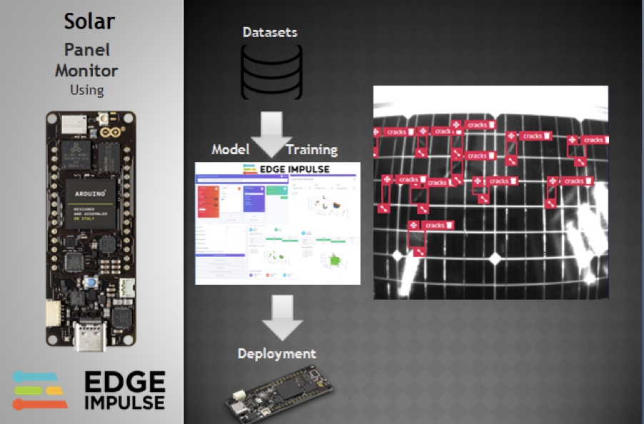

I have developed a TinyML model using Edge Impulse and deployed the model onto an Arduino Portenta H7. This model is trained with solar panel images with cracks on them. In Edge Impulse, I have labeled the cracks in the images and trained using a [FOMO](https://www.edgeimpulse.com/blog/announcing-fomo-faster-objects-more-objects) based model.

### Advantages over Manual Inspection

* It is efficient and less time consuming
* Hourly monitoring is possible using automated inspection
* This prototype, if combined with a drone or self driving robot, can inspect entire solar farms.

## Hardware Required

* Arduino Portenta H7
* Portenta Vision Shield
* Solar panel

## Architecture

For this prototype development, I have used a FOMO-based object detection model to detect the cracks in the solar panel. The below diagram explains the overview of the model development.

The major steps that need to be followed for the model development are:

* Data Acquisition
* Model Training
* Model Testing
* Deployment

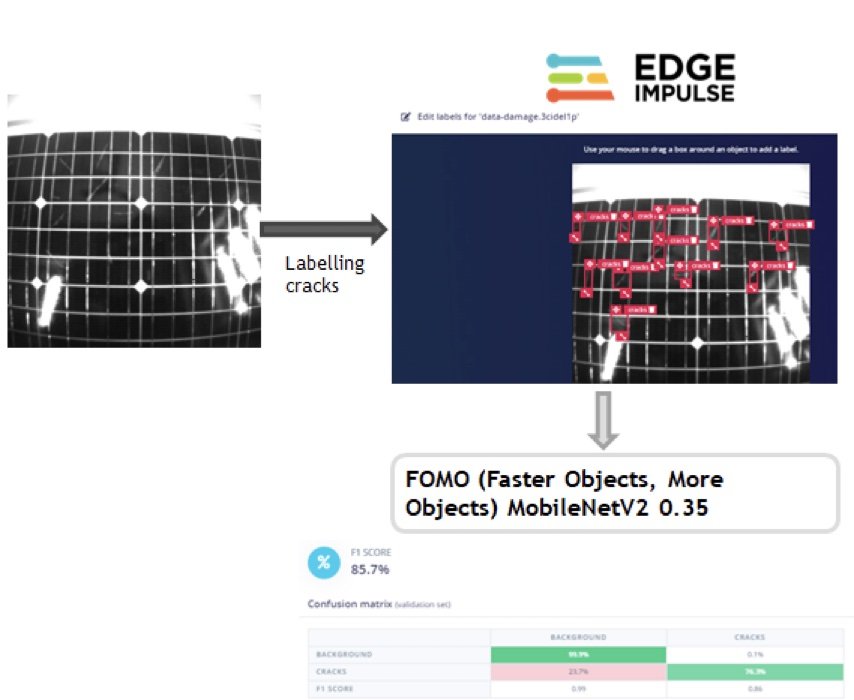

## Data Acquisition

For data acquisition, I have collected the real images of solar panels with cracks using the Arduino Portenta H7 and Vision Shield.

To connect the Portenta for the first time, follow the below steps:

1. Download the zip file [https://cdn.edgeimpulse.com/firmware/arduino-portenta-h7.zip](https://cdn.edgeimpulse.com/firmware/arduino-portenta-h7.zip)
2. Press the Reset button twice to put the device into "boot loader" mode
3. Flash the downloaded firmware by opening the included script (`flash_windows.bat`, `flash_mac.command` or `flash_linux.sh`)
4. After flashing, press the Reset button once.
5. Open a command prompt and run the command `edge-impulse-daemon`

Now the Portenta is connected to the Edge Impulse account. I have placed the solar panel with cracks in front of the Arduino Portenta plus Vision shield. The distance between solar panel and Portenta is adjusted so that it captures the entire solar panel region.

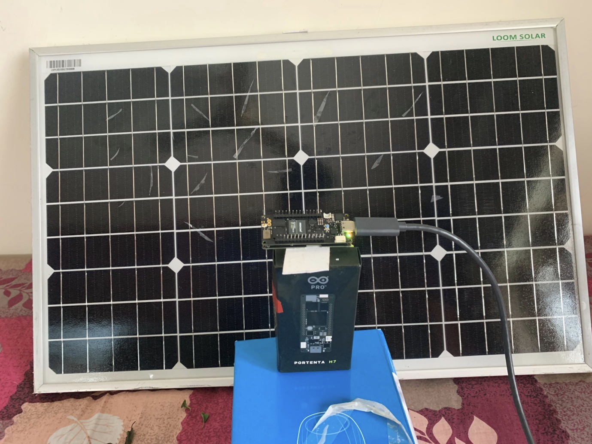

Go to the _Data Acquisition_ section in Edge Impulse and [capture images](https://docs.edgeimpulse.com/docs/edge-impulse-studio/data-acquisition).

Then go to _Labeling queue_ in the _Data acquisition_ section to draw bounding boxes around the cracks in the collected images.

You can read more about the Labeling queue at this link: [https://docs.edgeimpulse.com/docs/edge-impulse-studio/data-acquisition/labeling-queue](https://docs.edgeimpulse.com/docs/edge-impulse-studio/data-acquisition/labeling-queue)

In the Labelling queue, all the raw images are shown, and we need to drag and drop the markings and label the cracks.

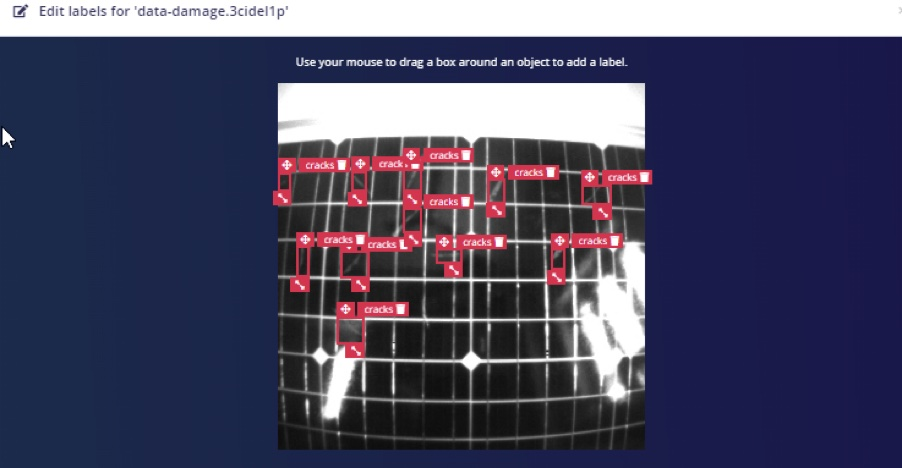

So ideally, we add all the cracks as objects in the image.

Once labeling is completed for all images in the dataset, split the dataset into 80:20 ratios for training and testing data.

You can click any dataset and move it to the test data.

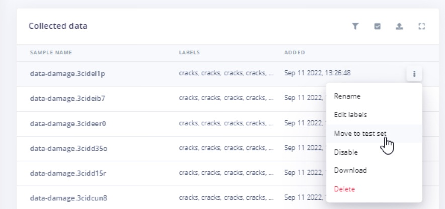

So I made the ratios close to 80:20.

## Create Impulse

In the _Create Impulse_ section, I have selected Object detection and set a Pixel size of 96x96.

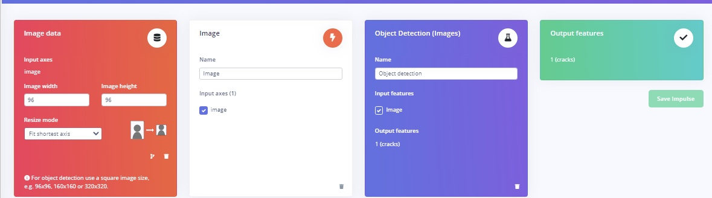

Then in the _Image_ section, I have selected the color depth as “ Grayscale”.

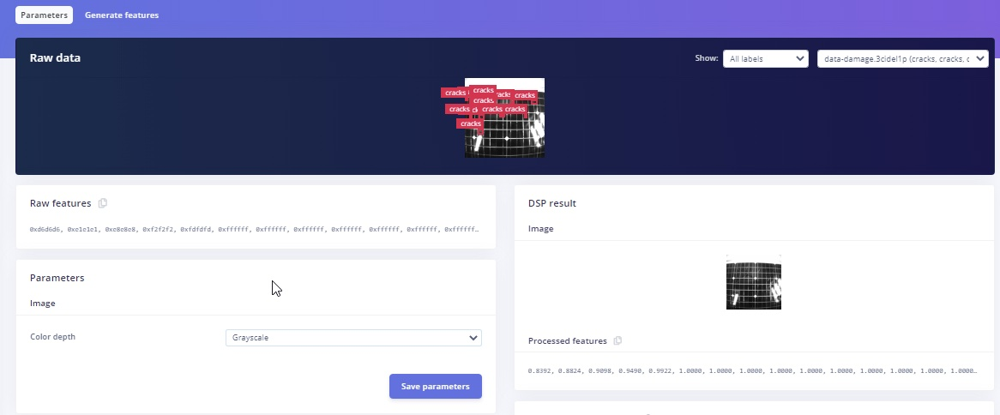

## Model Training

In the _Object detection_ section, I have selected the FOMO model -- FOMO (Faster Objects, More Objects) MobileNetV2 0.35

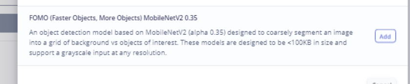

This FOMO model can run Object Detection on resource constrained microcontrollers. For more details about FOMO, refer to the following link: [https://docs.edgeimpulse.com/docs/edge-impulse-studio/learning-blocks/object-detection/fomo-object-detection-for-constrained-devices](https://docs.edgeimpulse.com/docs/edge-impulse-studio/learning-blocks/object-detection/fomo-object-detection-for-constrained-devices)

In _Training settings_, I have selected 200 training cycles and a Learning rate as 0.005

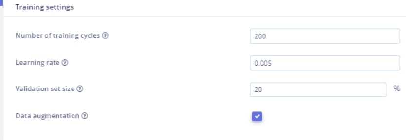

The Neural network architecture is FOMO model.

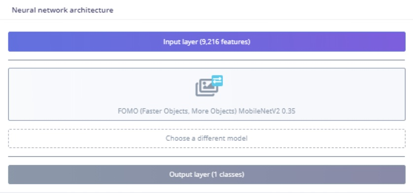

## Training Output

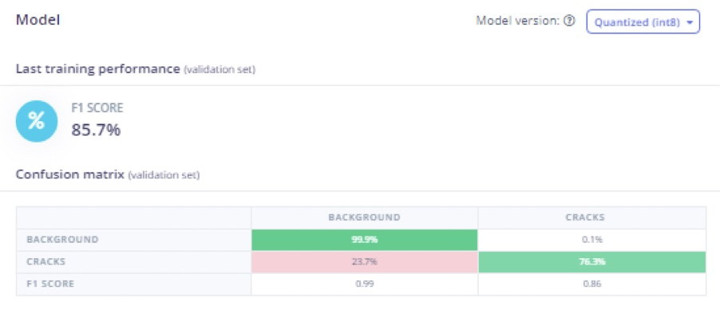

In the training output, the model achieved 85.7% accuracy. Around 23.7% of cracks were identified as background, so, there is room for improvement.

The reason for the misclassification is that cracks and PV cells boundary lines look similar in some cases. In those situations, the model predicts the cracks as background.

To improve the accuracy, data augmentation is selected and data acquisition is done with different camera angles to better predict the cracks in the solar panel.

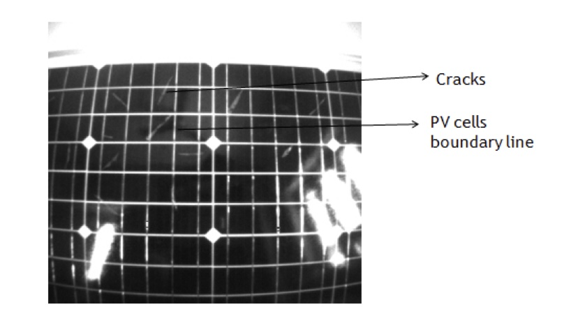

## Model Testing

In _Model testing_, the model is able to identify cracks in solar panel images. In two of the testing data, it did miss identifying some cracks in the panels. This is normally due to lighting differences and camera angle, but it performs decently with 77.8% accuracy in Model testing.

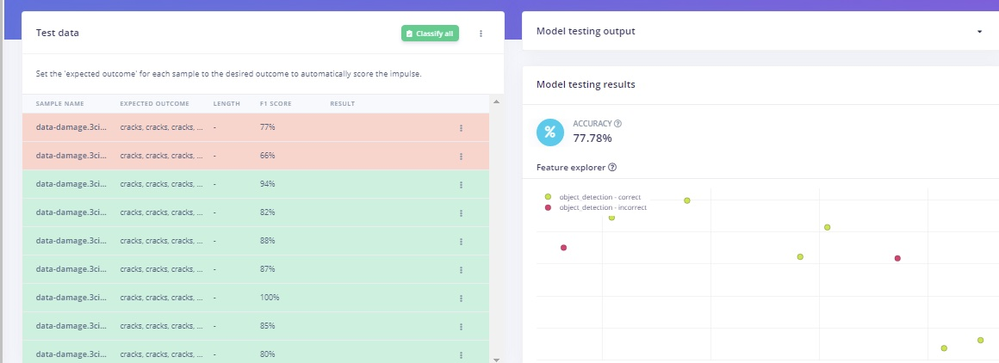

## Deployment

Go to the _Deployment_ section and select _Build firmware_ with Arduino Portenta H7 and download the firmware. Then press the Reset button twice to get into the boot loader mode again and open the downloaded script to flash it, similar to earlier.

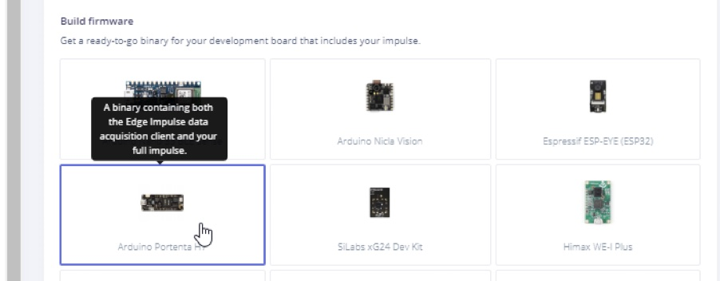

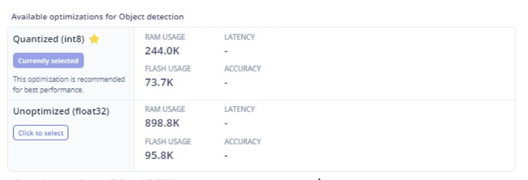

On my Windows system, I opened the `.bat` file to flash it to the Portenta.

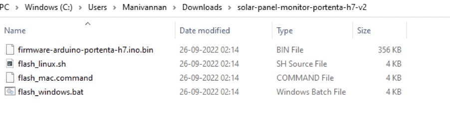

When complete, press the Reset button once. Finally, open a terminal and run the following command: `edge-impulse-run-impulse`

## Summary

This TinyML model based on FOMO is able to identify cracks in solar panels. One of the key advantages is that it can run on constrained devices like microcontrollers, due to the use of Edge Impulse FOMO. This model can also be ported to other devices such as Sony Spresense, ESP–EYE, or larger systems like an Nvidia Jetson Nano.
