# Smart City Traffic Analysis - NVIDIA TAO + Jetson Orin Nano

Created By: Jallson Suryo

Public Project Link: [https://studio.edgeimpulse.com/public/310628/live](https://studio.edgeimpulse.com/public/310628/live)

GitHub Repo: [https://github.com/Jallson/Traffic_Analysis_Orin_Nano/](https://github.com/Jallson/Traffic_Analysis_Orin_Nano)

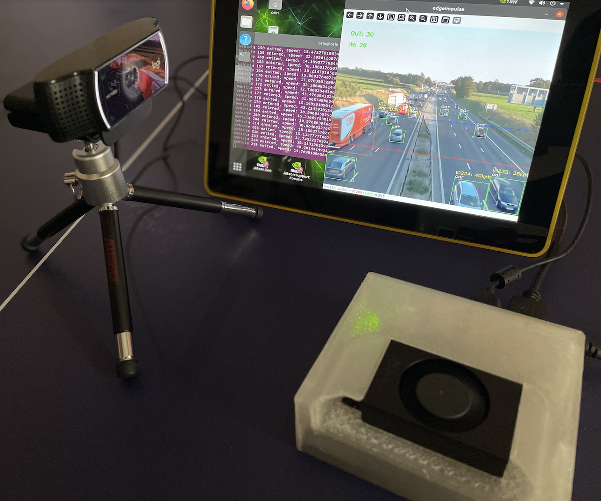

## Problem Statement

In a smart-city system, analyzing vehicle and traffic flow patterns is crucial for a range of purposes, from city planning and road design, to setting up traffic signs and supporting law enforcement. Current systems often depend on manpower, police or separate devices like speed sensors and vehicle counters, making them less practical. Even when object detection is applied, it typically requires powerful, energy-hungry computers or cloud-based systems, limiting widespread adoption of traffic analysis systems. To address this, a low-energy, edge-based Object Detection Traffic Analysis system can be developed. By integrating this into existing cameras at intersections, highways, and bridges, traffic data can be collected more efficiently, enabling broader implementation at lower costs and energy use.

## Our Solution

An object detection model from Edge Impulse is one way of addressing this problem, as model inference output will contains data labels, object coordinates, and timestamps. From this data, we will derive the object's speed and direction, as well as count objects entering or exiting. To simplify the process, we will use an NVIDIA TAO - YOLOv4 pre-trained neural network to build our model, then deploy on to an NVIDIA Jetson Orin Nano. This method grants access to a wide range of pre-trained models, enabling you to leverage existing neural network architectures and weights for your specific tasks. Therefore, the amount of data we need to collect is less than what's typically required when training and building an object detection model from scratch. The Edge Impulse model, combined with NVIDIA TAO, are optimized for efficient performance, achieving faster inference speeds through the Tensor RT library embedded in Orin Nano, which is essential for real-time applications. Overall, this approach can greatly accelerate the development cycle, enhance model performance, and streamline the process for Edge AI applications.

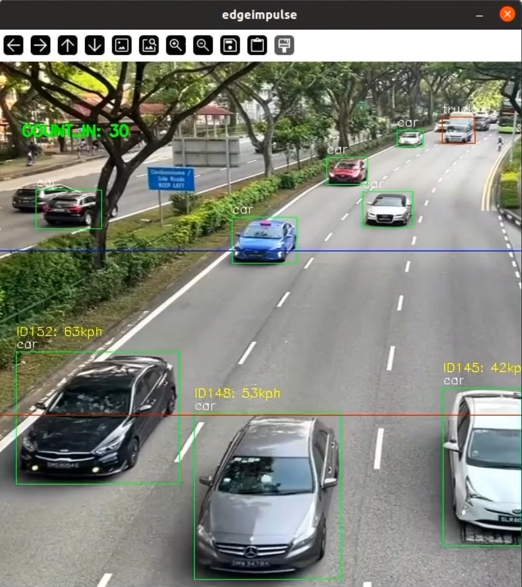

### Hardware Requirements:

- NVIDIA Jetson Orin Nano Developer Kit (8GB)
- USB Camera/webcam (eg. Logitech C270/ C920)
- DisplayPort to HDMI cable
- Display/monitor
- Tripod
- Keyboard, mouse or PC/Laptop via ssh
- Orin Nano case ( 3D print file available at [https://www.thingiverse.com/thing:6068997](https://www.thingiverse.com/thing:6068997) )

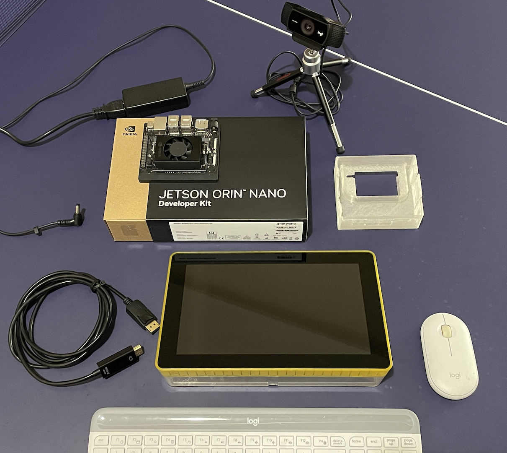

### Software & Online Services:

- NVIDIA Jetpack (5.1.2)
- Edge Impulse Studio
- Edge Impulse Linux CLI & Python SDK
- Terminal

## Steps

### 1. Collecting Data (Images/Video)

In the initial stage of building a model in Edge Impulse Studio, we need to prepare the data, which can be in the form of images or videos that will later be split into images. The image and video data can be sourced from free-license databases such as the COCO dataset or Roboflow, which can then be used for object detection training. Alternatively, you can collect your own data to better suit the purposes of your project. Here, I will provide an example of how to upload data in Edge Impulse Studio for both scenarios (see the images below). For those who are not familiar with Edge Impulse Studio, simply visit [https://studio.edgeimpulse.com](https://studio.edgeimpulse.com), login or create an account, then create a new Project. Choose _Images_ when given a choice of project type, then _Object detection_. In Dashboard > Project Info, choose _Bounding Boxes_ for the labeling method and **NVIDIA Jetson Orin Nano** for the target device. Then move to Data acquisition (on the left hand navigation menu), and click on the _Upload Data_ tab.

> Note: When collecting data samples, it's important to remember that the images of vehicles (trucks or cars) to be labeled should not be too small, as the model we're building can only recognize objects with a minimum size of 32x32 pixels.

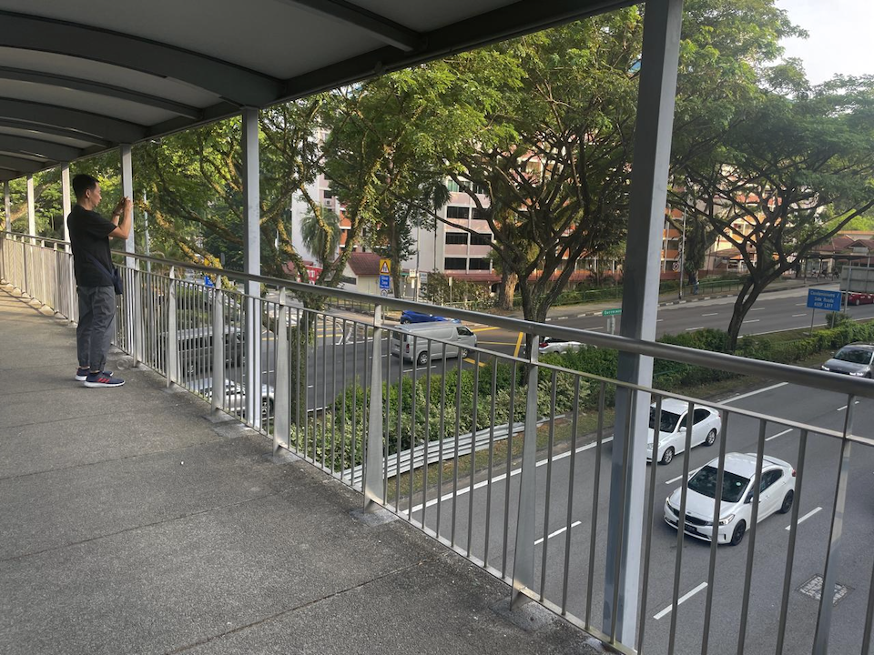

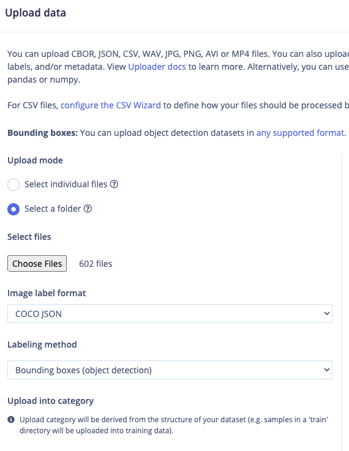

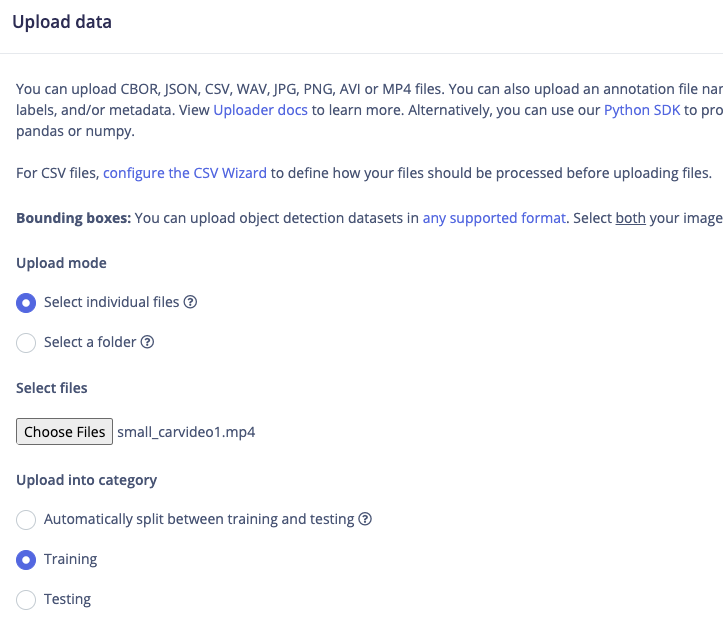

### 2. Labeling

The next step is labeling. If you're using data from a COCO JSON dataset that has already been annotated, you can skip this step or simply review or edit the existing labels. For other methods, click on _Data acquisition_, and before labeling video data, you’ll need to split the video into images. Right-click on the three dots to the right, select _Split Into Images_, then click _Yes, Split_. Enter the number of frames per second from the video — usually around 1 or 2 — to avoid having too many nearly identical images.

Once the images are ready, you'll see a labeling queue, and you can begin the process. To simplify this, you can select Label suggestions: Classify using YOLOv5, since cars and trucks will be automatically recognized. Turn off other objects if YOLOv5 detects them incorrectly, then click _Save label_. Repeat this process until all images are labeled.

After labeling, it's recommended to split the data into Training and Testing sets, using around an 80/20 ratio. If you haven't done this yet, you can go back to the Dashboard, and click on _Train / Test Split_ and proceed. As shown here, I only used 150 images, as we'll be training the model with the help of pre-trained NVIDIA TAO-YOLO based models.

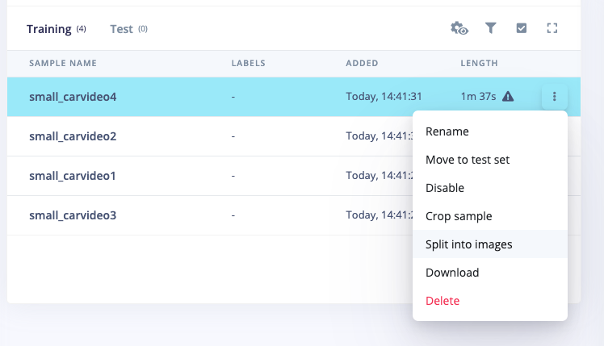

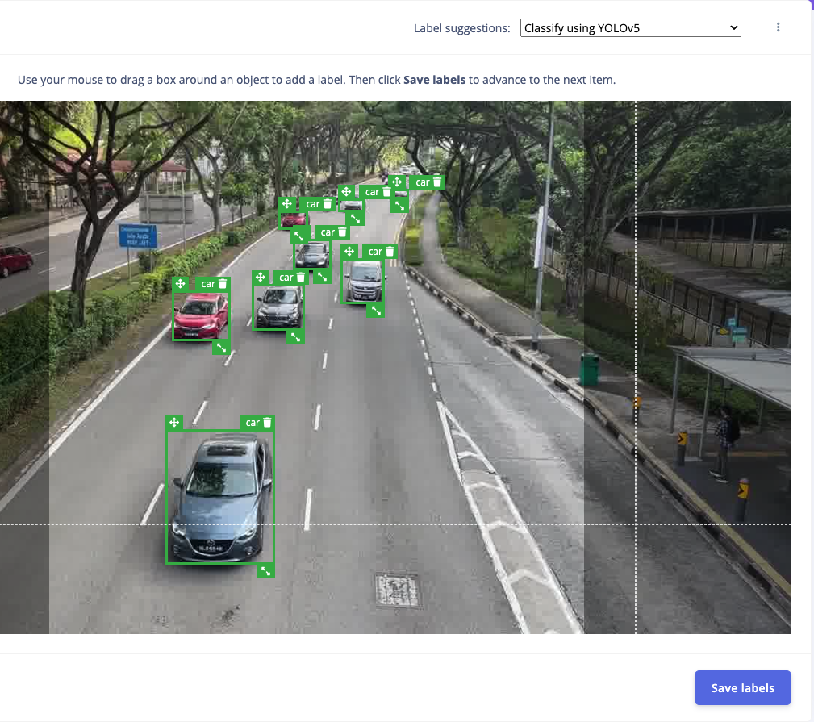


### 3. Train and Build Model

Once your labelled dataset is ready, go to Impulse Design > Create Impulse, and set the image width and height to 320x320. Choose _Fit shortest axis_, then select **Image** and **Object Detection** as the Learning and Processing blocks, and click _Save Impulse_. Next, navigate to the Image Parameters section, select _RGB_ as the color depth, and press _Save parameters_. After that, click on _Generate_, where you'll be able to see a graphical distribution of the two classes (car and truck).

Now, move to the _Object Detection_ navigation on the left, and configure the training settings. Select **GPU** as the compute option and **MobileNet v2 (3x224x224)** as the backbone option. Set the training cycles to around 400 and the minimum learning rate to 0.000005. Choose **NVIDIA TAO YOLOv4** as the neural network architecture — for higher resolutions (eg. 640x640), you can try YOLOv5 (Community blocks) with a model size of medium (YOLOv5m) — Once done, start training by pressing _Start training_, and monitor the progress.

If everything goes well and the precision result is around 80%, proceed to the next step. Go to the _Model Testing_ section, click _Classify all_, and if the result is around 90%, you can move on to the final step — Deployment.


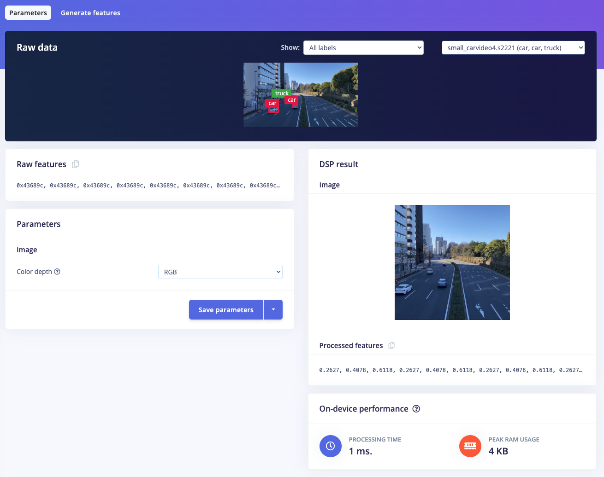

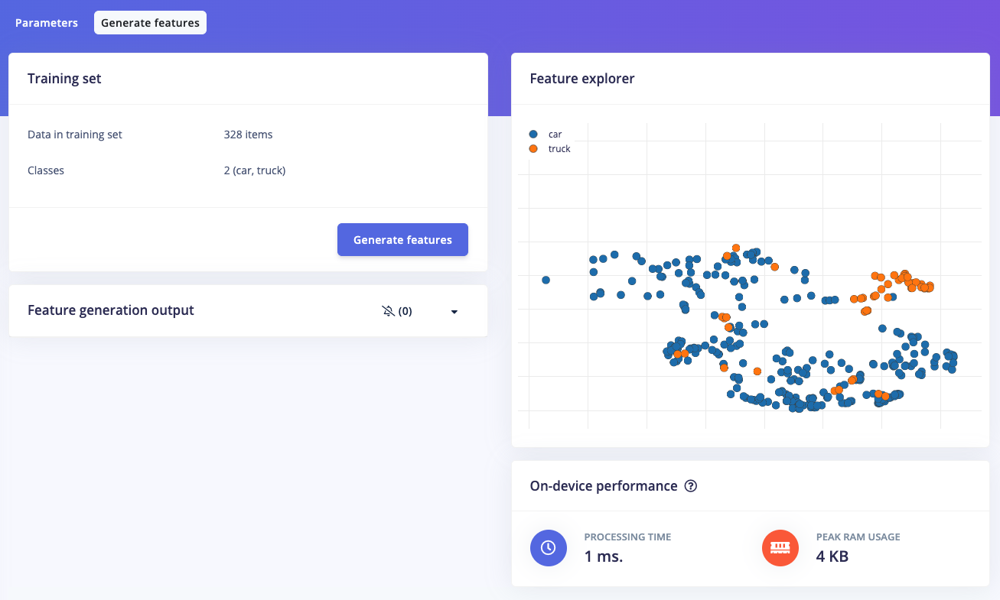

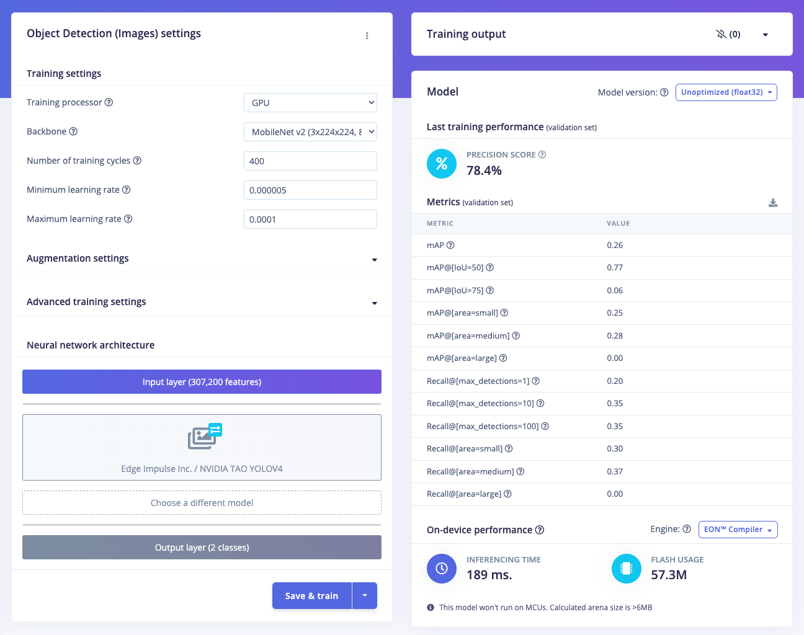

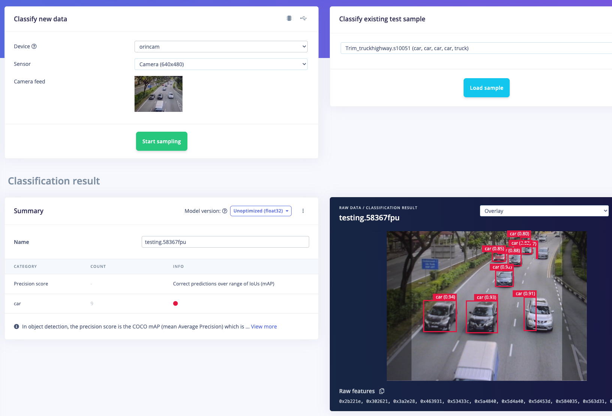

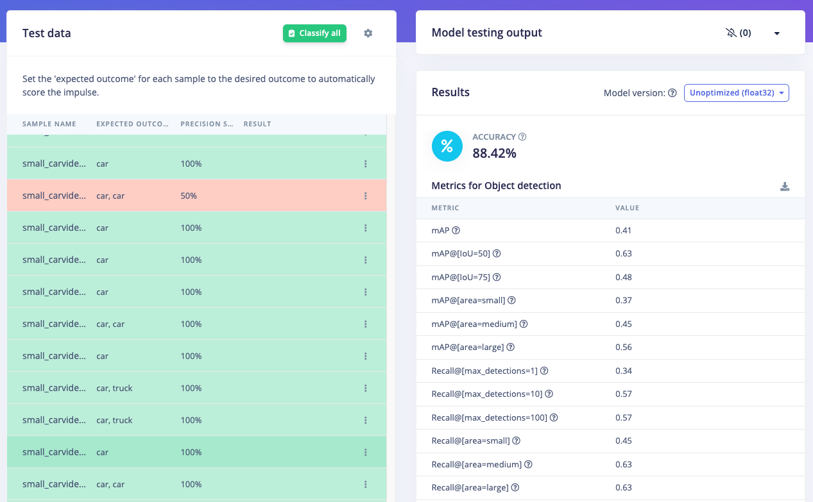

### 4. Deploy Model Targeting Jetson Orin Nano GPU

Click on the _Deployment_ tab, then search for **TensorRT**, select _(Unoptimized) Float32_, and click _Build_. This will generate the NVIDIA TensorRT library for running inference on the Orin Nano's GPU. Once downloaded, unzip the file, and you'll be ready to deploy the model using the Edge Impulse SDK on to the NVIDIA Jetson Orin Nano.

Alternatively, there's an easier method: simply ensure that the model has been built in Edge Impulse Studio. From there, you can test, download the model, and run everything directly from the Orin Nano.

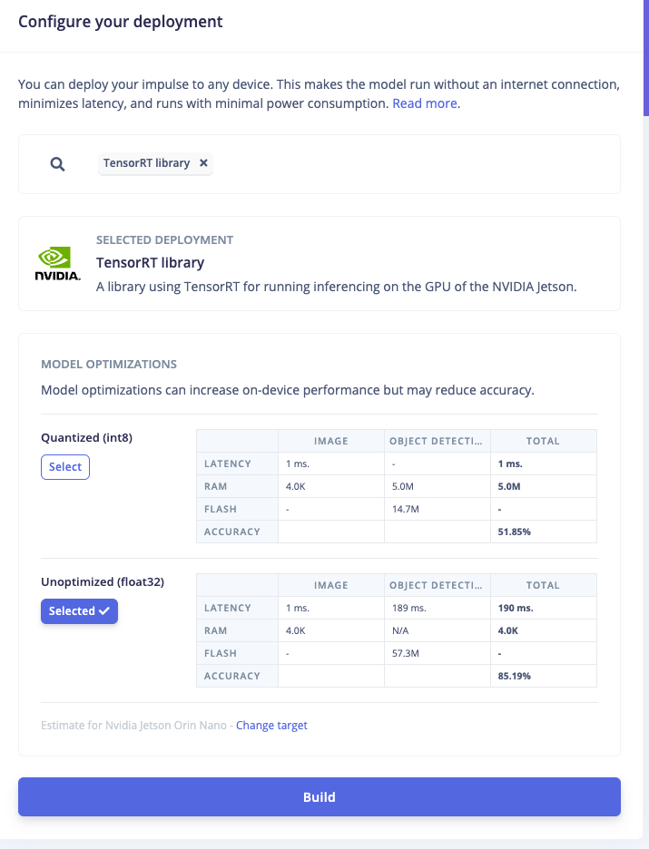

On the Orin Nano side, there are several things that need to be done. Make sure the unit uses JetPack — we use Jetpack v5.1.2 — which is usually pre-installed on the SD card. Then open a Terminal on the Orin Nano, or ssh to the Orin via your PC/laptop and setup Edge Impulse tooling in the terminal.

```
wget -q -O - https://cdn.edgeimpulse.com/firmware/linux/orin.sh | bash
```

You also need to install the Linux Python SDK library (you need Python >=3.7, which is included in JetPack), and it is possible you may need to install Cython to build the Numpy package: `pip3 install Cython`, then install the Linux Python SDK: `pip3 install pyaudio edge_impulse_linux`. You'll also need to clone the examples: `git clone https://github.com/edgeimpulse/linux-sdk-python`

Next, build and download the model.

#### Option A. Build .eim Model with C++ SDK:

Install Clang as a C++ compiler: `sudo apt install -y clang`

Clone the following repository and install these submodules:

`git clone https://github.com/edgeimpulse/example-standalone-inferencing-linux`

`cd example-standalone-inferencing-linux && git submodule update --init --recursive`

Then install OpenCV:

`sh build-opencv-linux.sh`

Now make sure the contents of the TensorRT folder from the Edge Impulse Studio `.zip` file download have been unzipped and moved to the `example-standalone-inferencing-linux` directory.

Build a specific model targeting Orin Nano GPU with TensorRT:

`APP_EIM=1 TARGET_JETSON_ORIN=1 make -j`

The resulting file will be in `./build/model.eim`

#### Option B. Download the Model via the Linux Runner:

Open a terminal on the Orin Nano or ssh from your PC/laptop then run `edge-impulse-linux-runner --clean`, which will allow you to select your project. Log in to your account and choose your project. This process will download the `model.eim` file, which is specifically built with the TensorRT library targeting the Orin Nano GPU. During the process, the console will display the path where the `model.eim` has been downloaded. For example, in the image below, it shows the file located at `/home/orin/.ei-linux-runner/models/310628/v15`.

For convenience, you can copy this file to the same directory as the Python program you'll be creating in the next steps. For instance, you can use the following command to copy it to the home directory: `cp -v model.eim /home/orin`

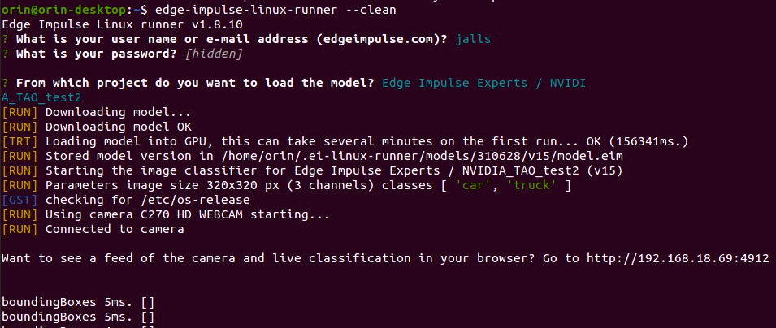

Now the model is ready to run in a high-level language such as the Python program used in the next step. To ensure this model works, we can run the Edge Impulse Linux Runner with a camera attached to the Orin Nano. You can see a view from the camera via your browser (the IP address location is provided when the Edge Impulse Linux Runner is started). Run this command to start it now: `edge-impulse-linux-runner --model-file <path to directory>/model.eim`

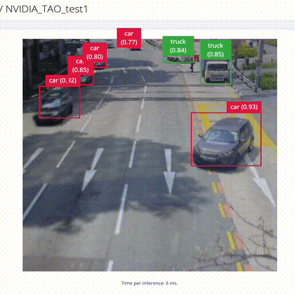

The inferencing time is around 6ms, which is incredibly fast for object detection projects.

### 5. Build a Simple Traffic Analysis Program (Python)

With the impressive performance of live inferencing using the Linux Runner, we can now create a Python-based Traffic Analysis program to calculate cumulative counts, and track the direction and speed of vehicles. This program is a modification of the `Classify.py` script from Edge Impulse's examples in the `linux-python-sdk` directory. We have adapted it into an object tracking program by integrating a tracking library, which identifies whether the moving object is the same vehicle or a different one by assigning different IDs. This prevents miscounts or double counts.

For speed calculation, we also use this tracking library by adding two horizontal lines on the screen. We measure the actual distance between these lines and divide it by the timestamp of the object passing between the lines. The direction is determined by the order in which the lines are crossed, for example, A —> B is IN, while B —> A is OUT.

In the first code example, we use a USB camera connected to the Orin Nano and run the program with the following command:

```
python3 traffic.py <path to modelfile>/model.eim
```

If we want to run the program using a video file as input (e.g., video.mp4), we use the path to the video file when executing the program:

```
python3 traffic2.py <path to modelfile>/model.eim <path to videofile>/video.mp4
```

> Note: For video/camera capture display, you cannot use the headless method from a PC/laptop. Instead, connect a monitor directly to the Orin Nano to view the visuals, including the lines, labeled bounding boxes, IN and OUT counts, and vehicle speeds.

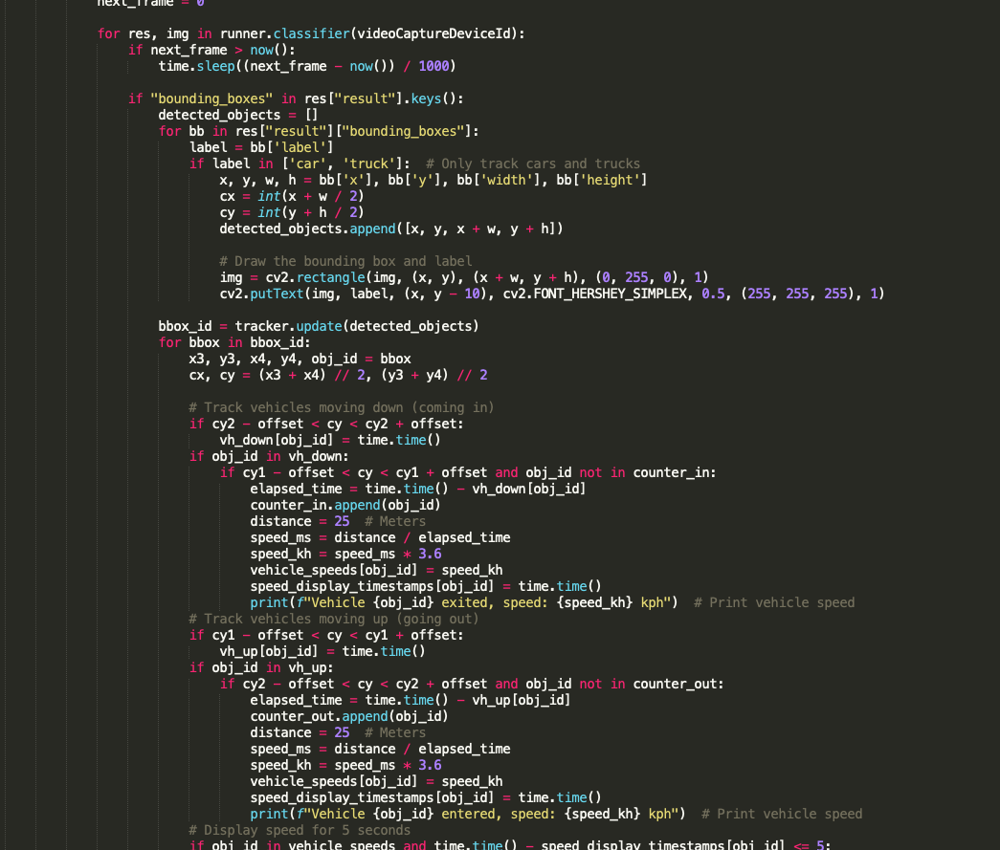


The Python code and the tracking library is avaialable and can be accessed at [https://github.com/Jallson/Traffic_Analysis_Orin_Nano](https://github.com/Jallson/Traffic_Analysis_Orin_Nano)

Here are two demo videos, showing the results: 





## Conclusion

In conclusion, we have successfully implemented an Edge Impulse model using pre-trained **NVIDIA TAO - Yolo** object detection within a Vehicle Traffic Analysis program, running locally on the Orin Nano. It's important to note that the speed figures provided may not be entirely accurate, as they are based on estimates without on-site measurements. To ensure accuracy, measurements should be taken on-site at the camera deployment location. However, this project serves to simulate a concept that can be further developed. The positions of the lines, distance values, angle settings, and other parameters can be easily adjusted in the Python code to better fit the specific conditions of the environment. Finally, it's worth mentioning that we achieved this with a minimal amount of data, and the low memory requirements of the implemented model result in extremely fast inference times. So, we can confidently say that the project's objectives — to enhance speed, simplify processes, and operate with low energy and cost — have been successfully met, making this method suitable for widespread application.
