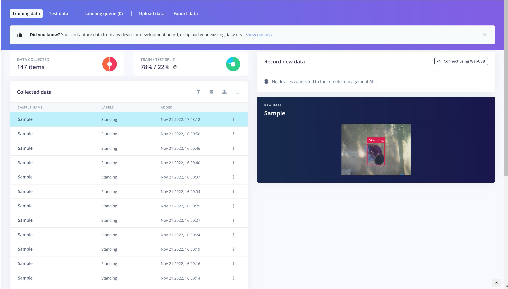
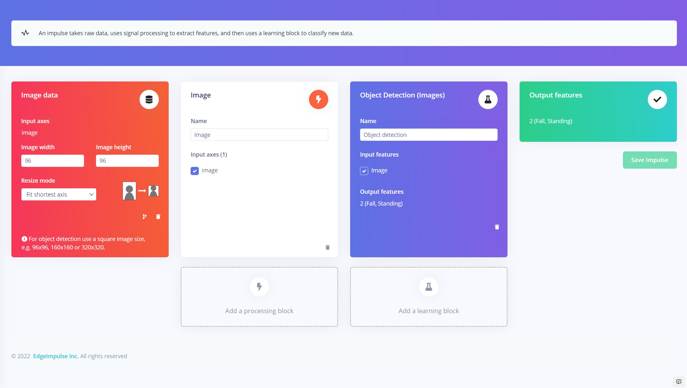
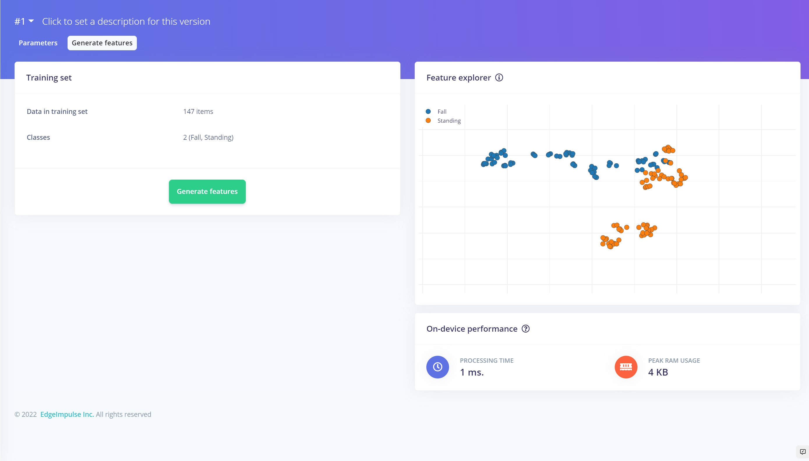
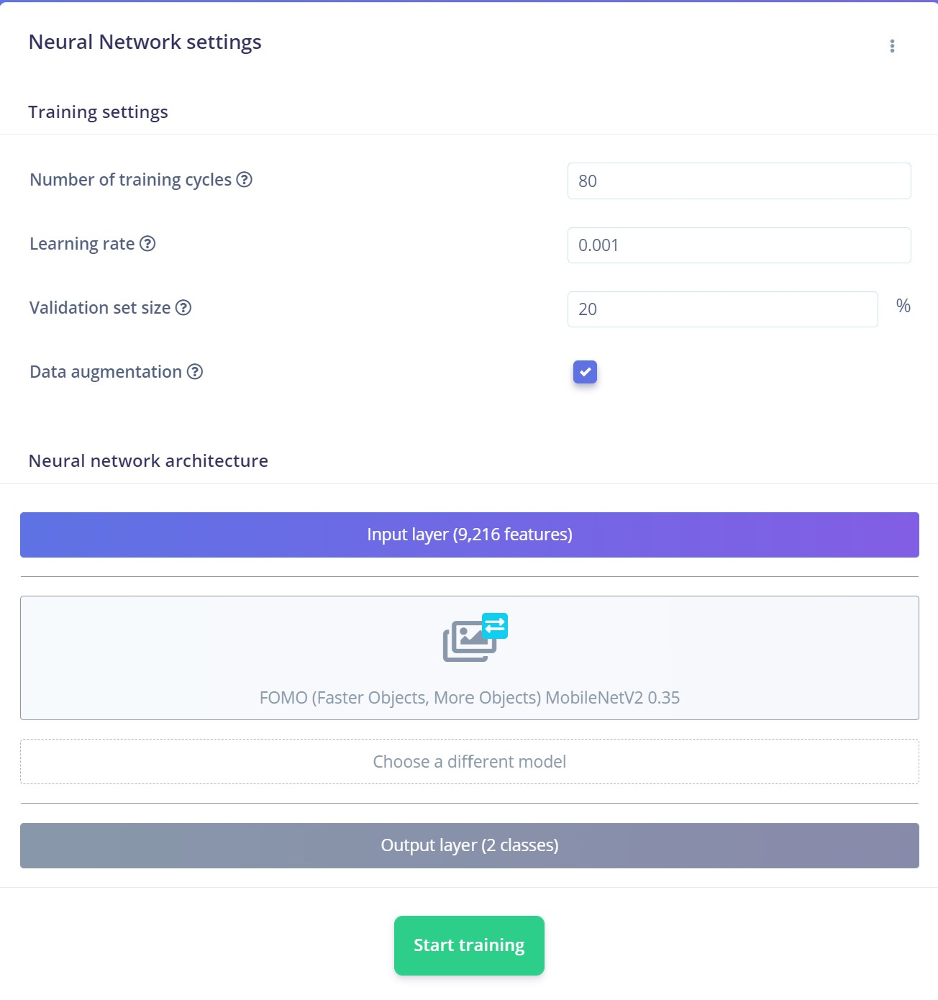
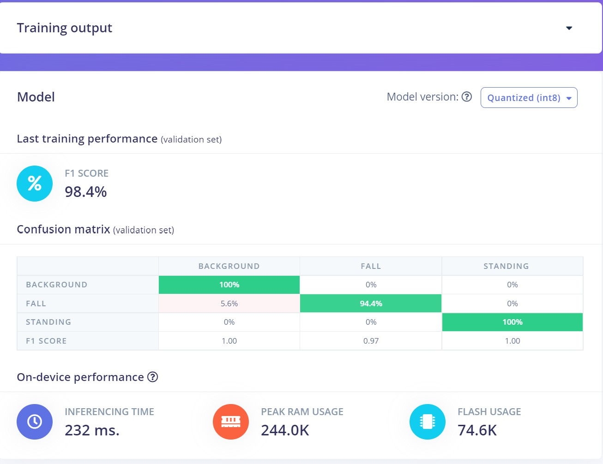
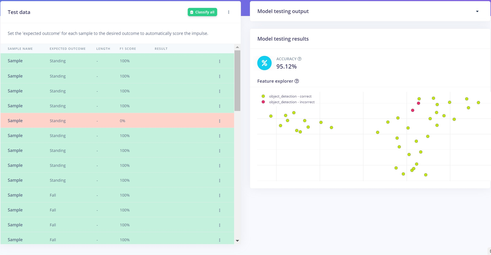
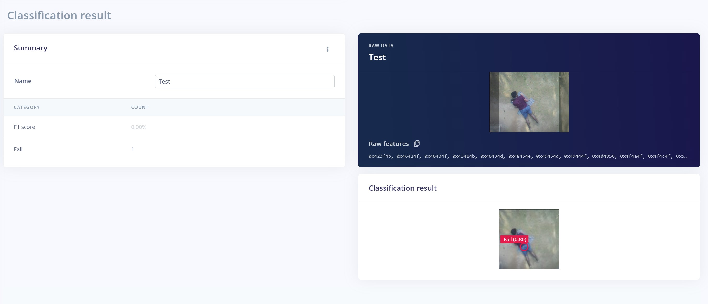
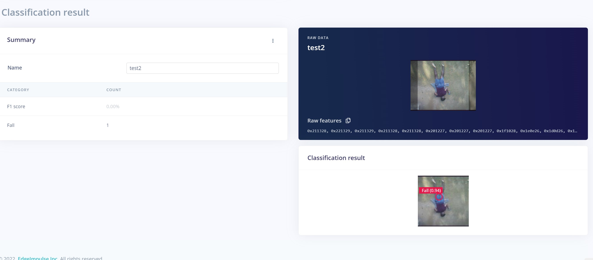
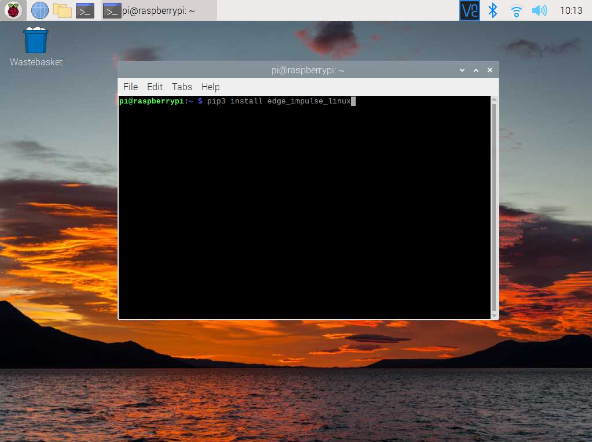

# Fall Detection using Computer Vision for Industrial Workers

Created By: Nekhil R.

Public Project Link: [https://studio.edgeimpulse.com/public/158336/latest](https://studio.edgeimpulse.com/public/158336/latest)

GitHub Repository: [https://github.com/CodersCafeTech/Worker-Fall-Detection](https://github.com/CodersCafeTech/Worker-Fall-Detection)

## Story

In the manufacturing and construction industries, workers face serious health and safety risks every day. Workers on a job site or manufacturing floor can trip on materials and equipment or be struck by falling objects. Falls can cause serious injuries when they are not detected early.

As a solution to this, we are developing a device that can quickly detect falls in a monitored area and alert a designated person with the specific area or position of the fall.

The device consists of a Raspberry Pi 4 and a camera module, running with a FOMO model that is capable of detecting the fall down in real-time.

At the implementation level, this FOMO-based machine learning model can be applied to the video output from cameras which are installed in a monitored area.

## Data Acquisition and Labeling

Data collection is the first step in every machine-learning project. Proper collection of data is one of the major factors that influence the performance of the model. It is helpful to have a wide range of perspectives and zoom levels for the items you are collecting. You may capture data from any device or development board, or upload your own datasets, for [data acquisition in Edge Impulse](https://docs.edgeimpulse.com/docs/edge-impulse-studio/data-acquisition).

As we have our own datasets, we upload them using the Data Acquisition tab.

First, we linked the Raspberry Pi to Edge Impulse and captured images by attaching the camera to the roof of the building. To link the Raspberry Pi with the Edge Impulse Studio please follow this [tutorial](https://docs.edgeimpulse.com/docs/development-platforms/officially-supported-cpu-gpu-targets/raspberry-pi-4).

The more data that neural networks have access to, the better their ability to recognize the object.

After collecting enough images to build a dataset, we move onto the labeling queue. In our case we have only two labels - Standing and Fall. Edge Impulse will attempt to automate this procedure by running an object tracking algorithm in the background in order to make the labeling procedure easier, helping to speed up the process of doing your labeling.

Then we split the images between a Test and Training set, which is very essential to validate our model later. There we kept the default setting which was a 78/22 ratio, thus setting aside enough data to test the model performance later.

## Impulse Design

Here is our Impulse. As you can see, we used 96x96 pixel images and set the resize mode to "Fit to shortest axes", which works very well for FOMO-based models.

In the Image tab, we used Grayscale as the color depth, to save memory, as color is not really necessary in this use-case. Then we generated the Features for our images. Even though the objects are the same, the features are distinguishable.

## Model

Now it's time to start training the machine learning model. Generating a machine learning model from scratch requires significant time and effort. Instead, we will use a technique called **"transfer learning"** which uses a pre-trained model on our data. That way we can create an accurate machine learning model, with fewer data inputs.

We are using **FOMO (MobileNet V2 0.35)** as the neural network.

And here is our training output. We got 98% accuracy.

By examining the confusion matrix, it is clear that the model works very well, but we need to check if there is a possibility of over-fitting. Here are our Model Testing results under the "Model testing" tab, showing that the model is working very well with the test data that we set aside earlier, also.

## Testing

For testing real world results, we used additional images which had not been uploaded in the dataset and thus were not part of the training or testing of the model. Here we are testing 2 sample images, let's see how our model performs:

In each of our testing samples, the model performed very well, so we can go ahead and deploy it to the device. We'll use the Linux Python SDK for that.

## Linux Python SDK

By using this Python library we can run our machine learning models on Linux machines (such as the Raspberry Pi 4) using Python. For doing that we need to follow this [installation guide](https://docs.edgeimpulse.com/docs/edge-impulse-for-linux/linux-python-sdk) to get started.

Then we [download the model from the Edge Impulse using these instructions](https://docs.edgeimpulse.com/docs/edge-impulse-for-linux/linux-python-sdk#classifying-data) and modified the sample code to make our project run.

## Code

The entire code and assets are provided in this [GitHub repository](https://github.com/CodersCafeTech/Worker-Fall-Detection).
