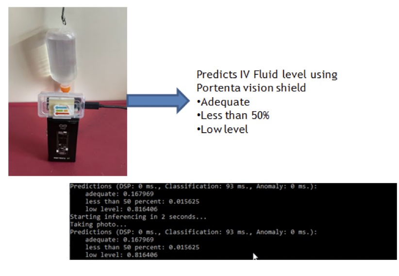
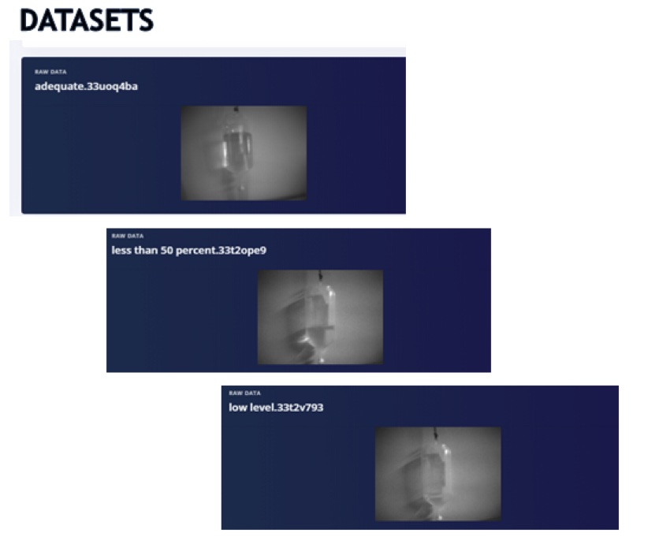
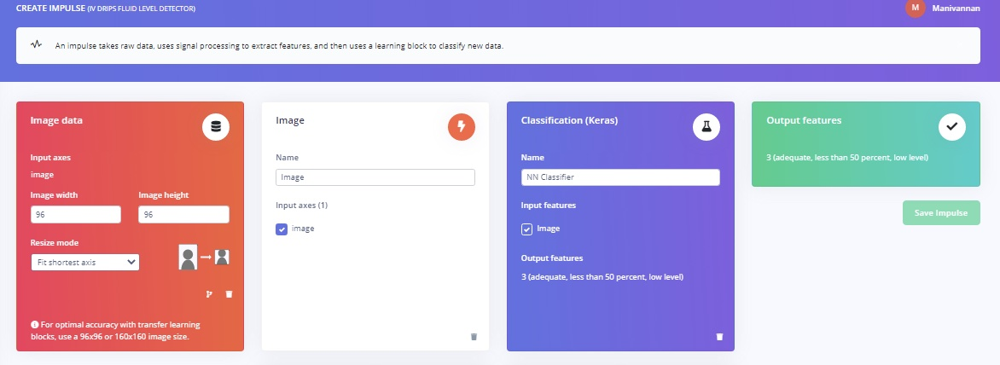
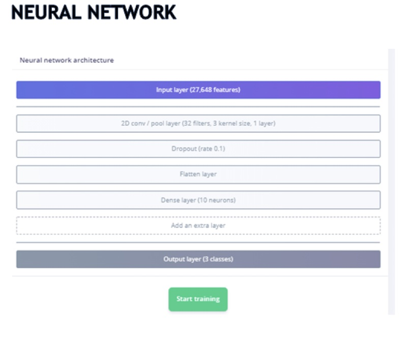
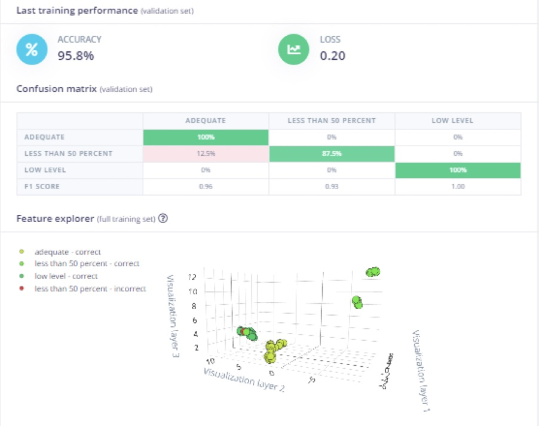
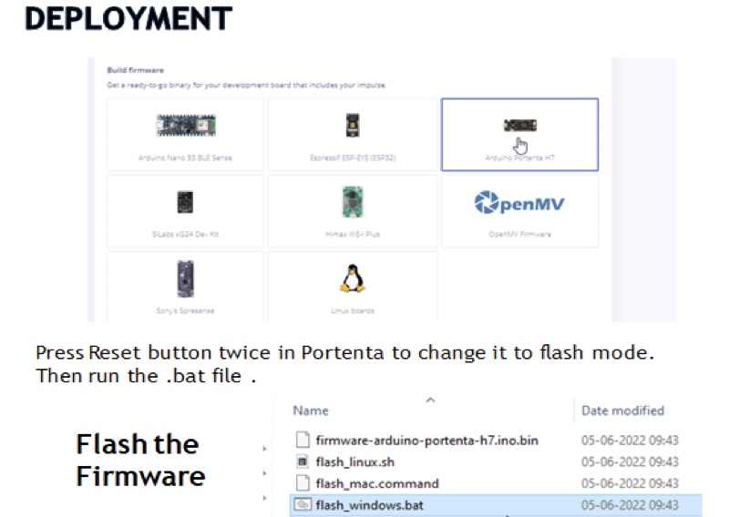
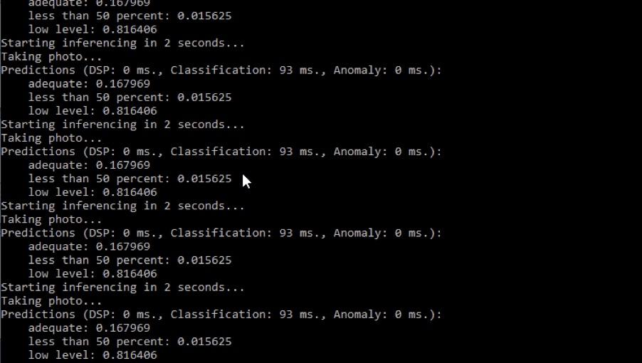

# IV Drip Fluid-Level Monitoring 

Created By:
Manivannan Sivan 

Public Project Link:
[https://studio.edgeimpulse.com/public/107293/latest](https://studio.edgeimpulse.com/public/107293/latest)



## Project Demo



## Problem statement

An empty IV bag can pose several issues, both medical and operational:

 - Extra pressure on the bag may exceed atmospheric within the bag, allowing air to continue to infuse into the patient once the bag is empty (if gravity fed). For the same reason, a bag that has been disconnected from the IV set should never be re-connected, as any extra air that may enter the flask could lead to embolism.
 - Periodic monitoring by staff can be challenging depending upon staffing level and size of facility.
 
## Solution

The prototype for this project will classify the IV fluid level into three categories:

1. Adequate
2. Less than 50%
3. Low level

This simple categorization can allow for the output or results of this model to be integrated via communication protocols like BLE or LoRa, to stream the results to a central system in a hospital. The nursing staff can monitor the IV fluid levels of all patients in one place. Hence, it can save a lot of effort and time going to monitor or check the fluid level of each individually.


In this prototype hardware setup, the Portenta H7 with Vision Shield is placed 15cm from the IV drips fluid.  Then, connect the Portenta to the host system, and type the below command.

`edge-impulse-daemon`

Now, the Portenta is connected to your Edge Impulse account.


For initial setup of the Portenta, follow the steps outlined here: [https://docs.edgeimpulse.com/docs/development-platforms/officially-supported-mcu-targets/arduino-portenta-h7](https://docs.edgeimpulse.com/docs/development-platforms/officially-supported-mcu-targets/arduino-portenta-h7)


## Dataset

I have collected 117 images of an IV fluid bag in various states, consisting of “adequate”, “less than 50%”, and “low level”.



In the above image , you can visualize that the adequate has more than 50% fluid and low level is almost empty.

## Create Impulse:

In the “Create Impulse” section, configure the settings as shown here.



## Neural Network

In “Neural Network”, I have used a single 2D convolution layer with flatten – DNN (10 neurons). The reason to go with one set of 2D Conv instead of more layers in 2D Conv, is memory consumption. 

Due to memory constraints on the device, I have one included one 2D Conv layer.



The model achieved an accuracy of 95% with loss of 0.2



The reason for deviation in the “less than 50 percent” category is due to different light exposure, which created a drop in accuracy. Additional images, images taken at various times of day, and other lighting conditions could help build a stronger model if needed.  However, the focus for the project is detecting “low level” fluid bags, so that is where effort should be spent improving accuracy and dataset.

## Deployment

In the “Deployment” section , select “Firmware – Portenta H7” and download it.



Once the firmware is flashed to the board, then open a Command Prompt window and type the below command to start inferencing:

```
edge-impulse-run-impulse
```



## Summary

This project demonstrated a cost effective solution to detect the fluid level in an IV bag, using an Arduino Portenta H7 and Vision Shield plus Edge Impulse.  The concept could even be expanded, and applied to machinery, industry, or other places; using computer vision to translate or interpret the analog, legacy, or physical world.  The computer vision portion of the project is demonstrated, and it could easily be expanded or scaled to more units.  The last piece would be to investigate aggregating data from the devices and rendering on a dashboard, to help reduce the burden on medical staff and improve efficiency in a hospital or medical facility.


