# Keyword Spotting on the Nordic Thingy:53 

Created By:
Nekhil R. 

Public Project Link:
[https://studio.edgeimpulse.com/public/170378/latest](https://studio.edgeimpulse.com/public/170378/latest)

## Story

In any industry with safety requirements, workers need to be able to report accidents that occur in the workplace. In this project, we are developing a device where employees can simply speak into a microphone to report an accident. The device will be loaded with a machine-learning model that can recognize an accident-reporting keyword. This “keyword spotting” implementation can speed up the reporting process, or make it easier for employees who may not be able to write due to work conditions or literacy.  We are only focused on the capability of the device to learn and then recognize our selected keyword here, but future work could include the ability to log events, record audio reports of the incident that has occurred, or other applications.

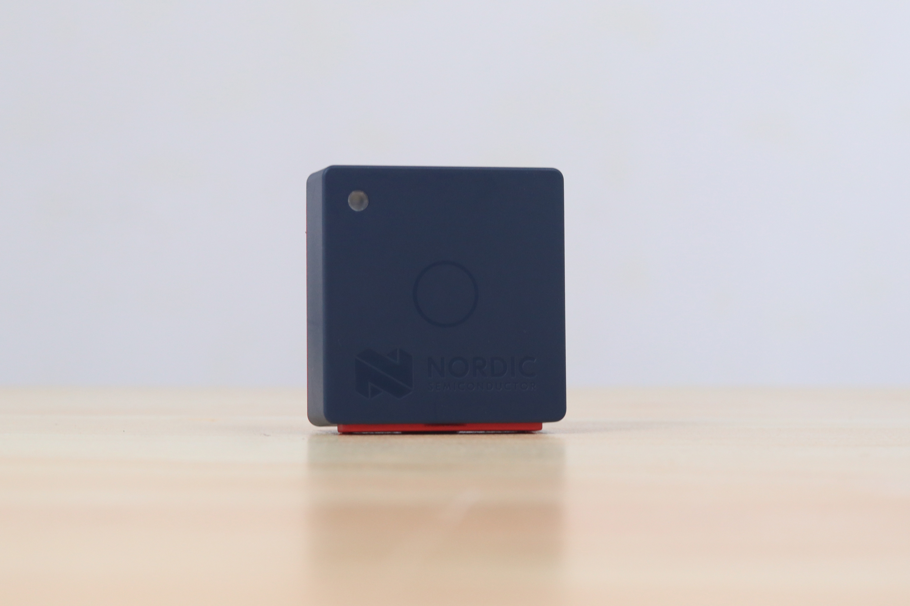

## Hardware

The development board used in this project is the [Nordic Thingy:53](https://www.nordicsemi.com/Products/Development-hardware/Nordic-Thingy-53). It allows you to create prototypes and proof of concept devices without building customized hardware. Its twin Arm Cortex-M33 processors provide enough processing power and memory to execute embedded machine learning (ML) models directly on the development platform.

The Nordic Thingy:53 can be linked to an Edge Impulse Studio account using the nRF Edge Impulse app. It enables you to download trained ML models to the Thingy:53 for deployment and local inferencing, and wirelessly communicate sensor data to a mobile device through Bluetooth LE. It also supports a wired serial connection for to a computer, for use in Edge Impulse Studio. To learn more about configuring the Thingy:53, you can [check out the Docs here](https://docs.edgeimpulse.com/docs/development-platforms/officially-supported-mcu-targets/nordic-semi-thingy53).

## Data Collection

Data Collection is one of the most important steps in a machine learning project. In this project, we used the **nRF Edge Impulse** app for the Data collection, making it easy to capture input data. The main keyword used here for reporting an accident, is literally the word **Accident** itself. Below, you can see our data collection settings. We recorded 10 seconds of data, at 16Khz frequency.

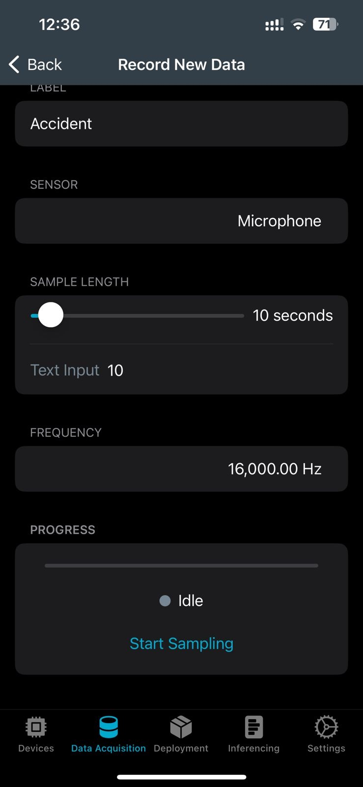

This is our keyword collected, along with some noise.

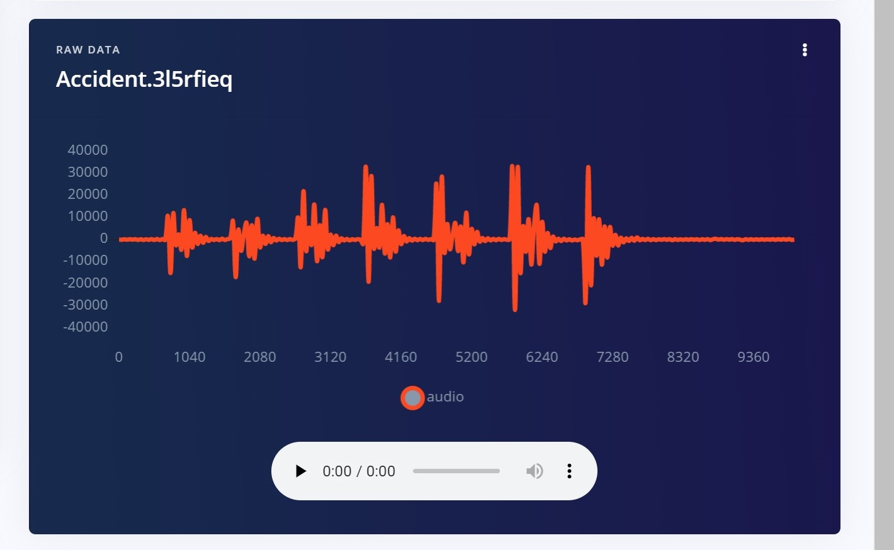

We were able to omit the noise by splitting the sample. So we got our exact keyword, only the piece that we wanted. To make the machine learning model more robust, we collected this same data (the word Accident) from more people.  Different ages, different genders, and different talking speeds help make the data better. 

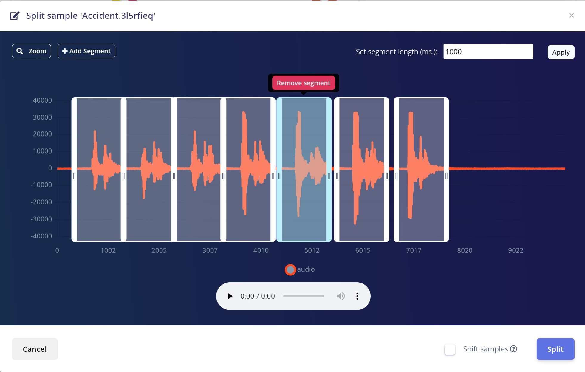

In addition to the keyword we'll also need audio that is **not** our keyword. Background noise, a television ('noise' class), and humans saying other words ('unknown' class) help provide data for the other classes. A machine learning model requires a certain level of "uniformity" in the data it is exposed to, as otherwise it will not be able to learn effectively. The more diverse your data is, the better your machine learning algorithm will perform. So for the **Unknown** and **Noise** classes we also made use of [this Edge Impulse dataset](https://cdn.edgeimpulse.com/datasets/keywords2.zip). To add this data to our project we used the direct Upload method by browsing from the local computer. More information on this dataset [can be found here](https://docs.edgeimpulse.com/docs/pre-built-datasets/keyword-spotting).

We ended up with about 24 minutes of data, which is split it between the Training and Testing:

19m 35s data for Training.

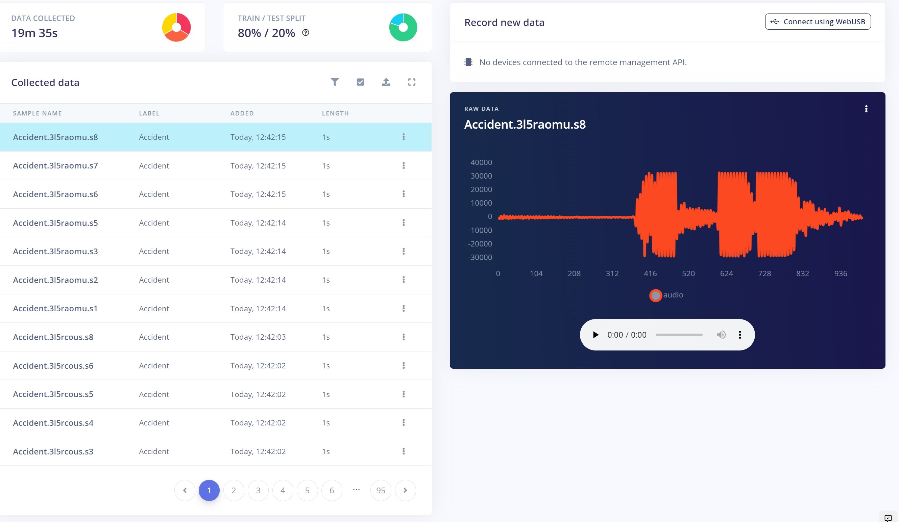

4m 47s data for Testing.

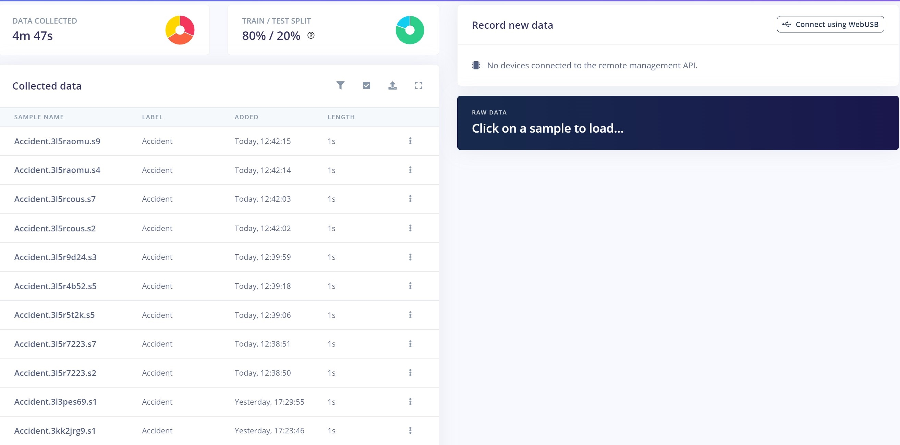

## Data Explorer

With the Edge Impulse Data explorer, you can represent your dataset visually, detect outliers, and label unlabeled data. This gives us a quick overview of our complete dataset. To learn more about the Data explorer, you can [review the documentation here](https://docs.edgeimpulse.com/docs/edge-impulse-studio/data-explorer).

This is our dataset visualization that was generated using the Data explorer. 

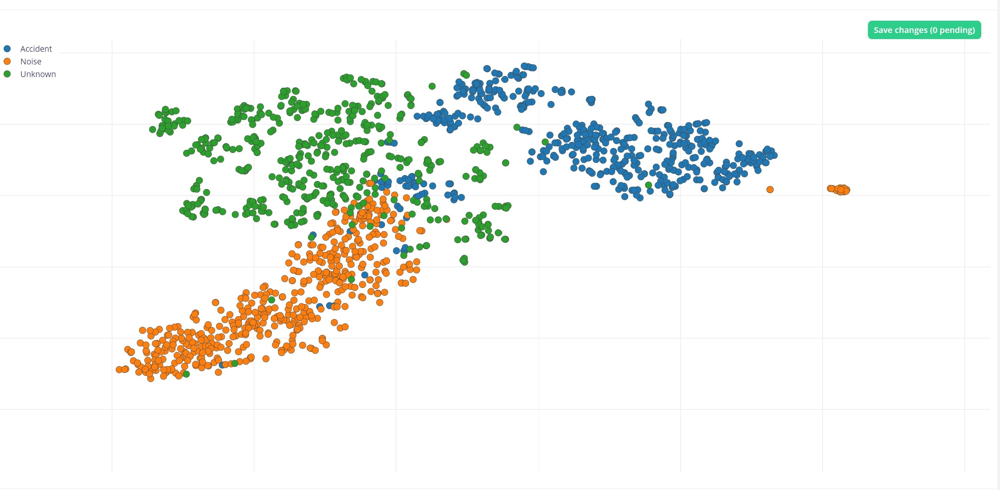

In this project we only care about the “Accident” keyword, and “Unknown” and “Noise” are not useful for us. As you can see, some of our “Accident” keywords are located in the “Noise” cluster, and a few of them also reside in the “Unknown” cluster of data. Upon examining the ones residing in the Noise cluster a bit closer, we observed that some of them are noises that came about as a result of improper keyword splitting. The remaining items are audio that is unclear or hard to discern the word being spoken, that's how they ended up in the Noise class. Here is one example we found that is indeed an “Accident” keyword that is misclassified in the Noise cluster.  

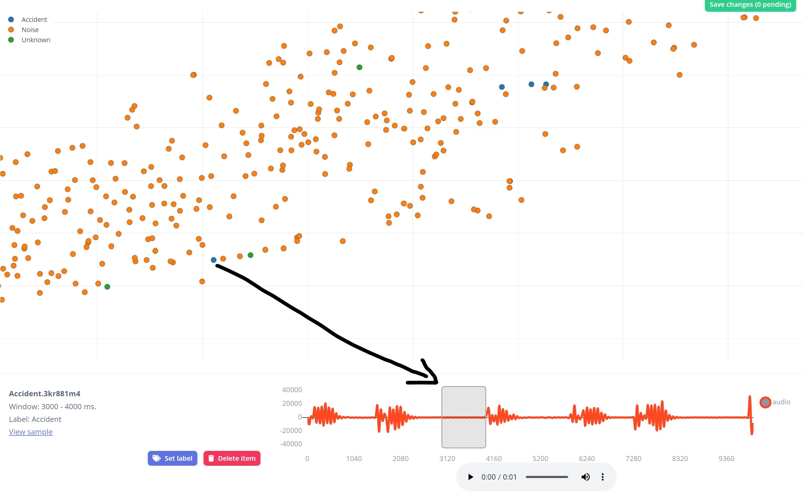

So we deleted the extreme outlying “Accident” keywords that are misclassified and rebalanced the dataset, making it look much cleaner.

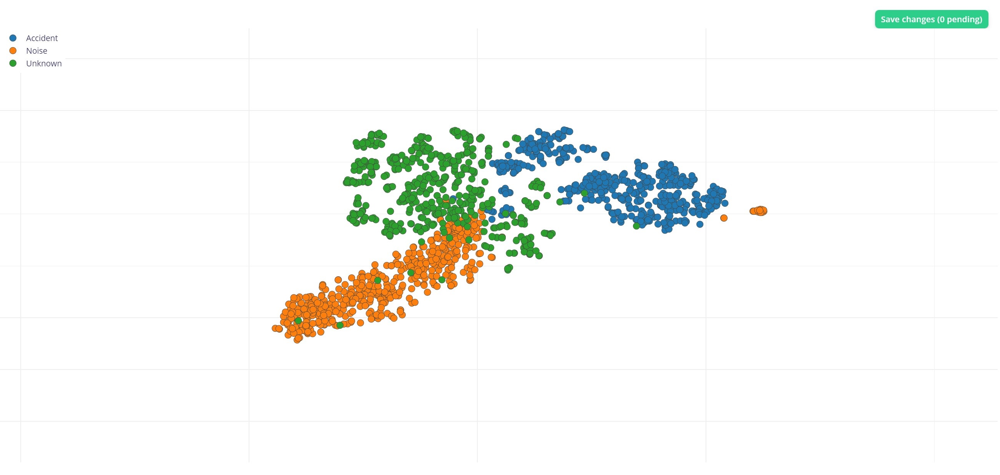

## Impulse Design

Now it is time to create an Impulse, which is the machine learning pipeline built by Edge Impulse.

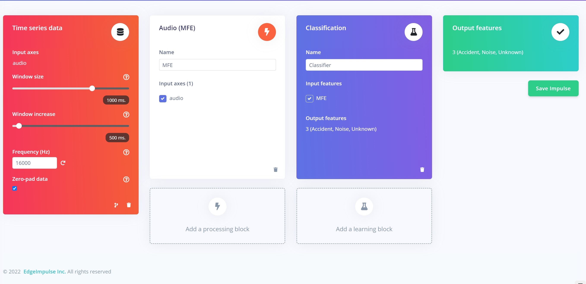

For our Processing block, we used Audio (MFE), which is great for the keyword spotting and worked very well with our data.

This is the MFCC Feature generation details page, presented after clicking **Save Impulse**.

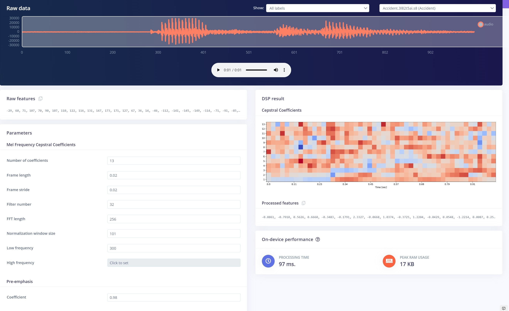

On the right side, we can see the Mel Cepsteral Coefficients of the data, and on the left side the hyper parameters for generating the Mel Frequency Cepstral Coefficients. We are going to leave the default parameters, because they work very well for keyword spotting.

These are the Features generated for our data, shown in a similar format as the Data explorer, for quick visual reference. 

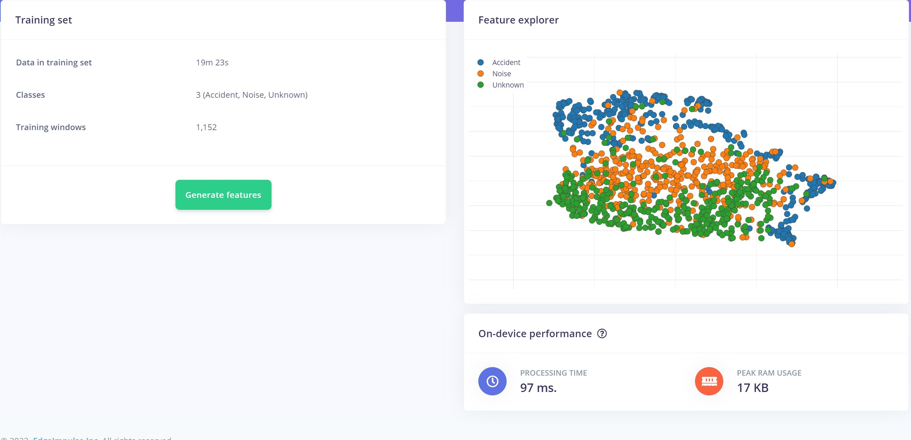

With all our data processed, it's time to start training a neural network.

## Neural Network

To build our neural network, we simply start by clicking **Classifier** on the left.  The Neural Network default settings might work ok, but you can fine tune them if you need to.  More information on the settings can be found in the [documentation located here](https://docs.edgeimpulse.com/docs/edge-impulse-studio/learning-blocks/classification).

Here are our neural network settings and architecture, which work very well for our data.

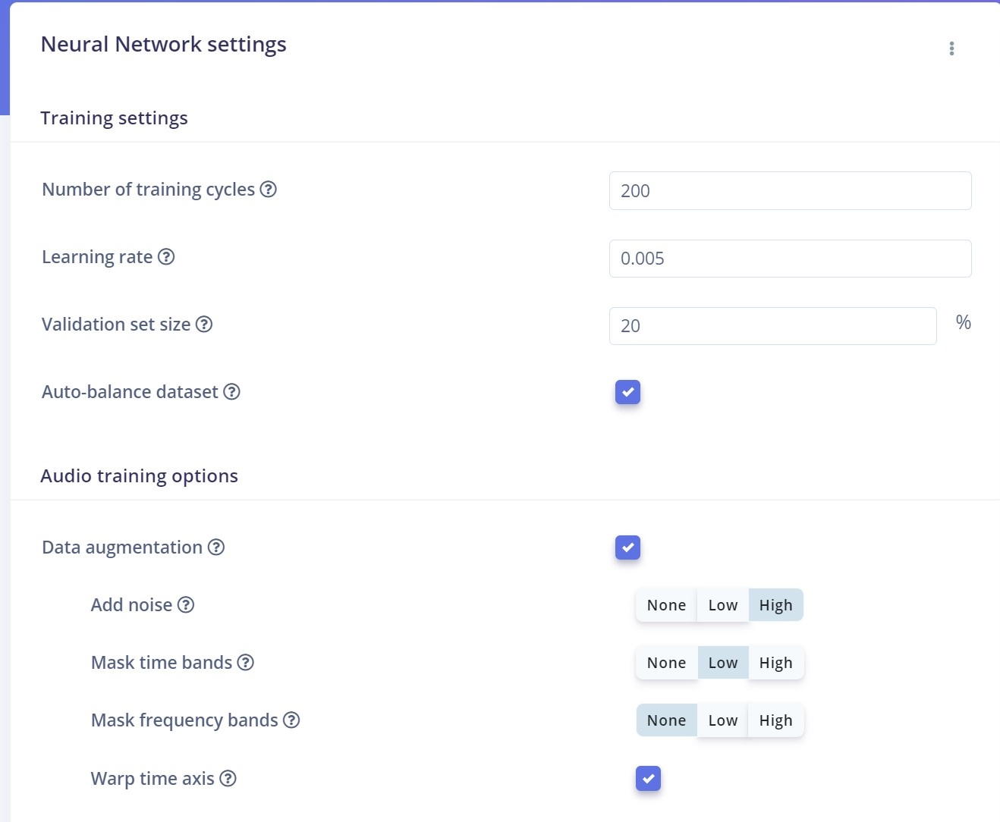

By enabling **Data augmentation**,  Edge Impulse will make small changes and variations to the dataset, making it more resilient and improving the overall performance by preventing overfitting. Here we used 1-D convolutional architecture which works great for keyword spotting. Let’s take a look at the resulting performance to validate our mode and ensure it’s doing what we expect.

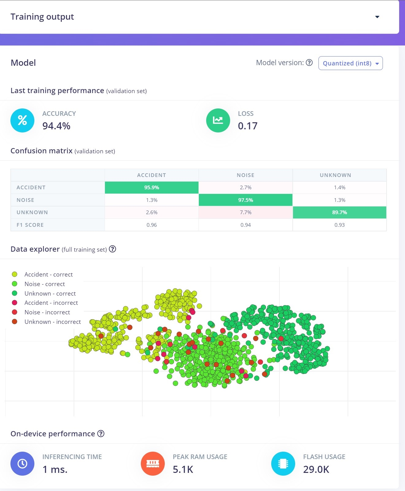

Our dataset is not really that large, and yet we got 94.4% accuracy, so this is pretty good and we can proceed with this model.

## Classifying New Data

The next step in the process is to test the model on some new, unseen data before deploying it in the real world. 

When we collected data, we set aside that 4 minutes and 47 seconds of data for Testing, which was not used in the creation and training of the model.  Now it can be used for Testing, by simply clicking on **Model Testing** on the left.

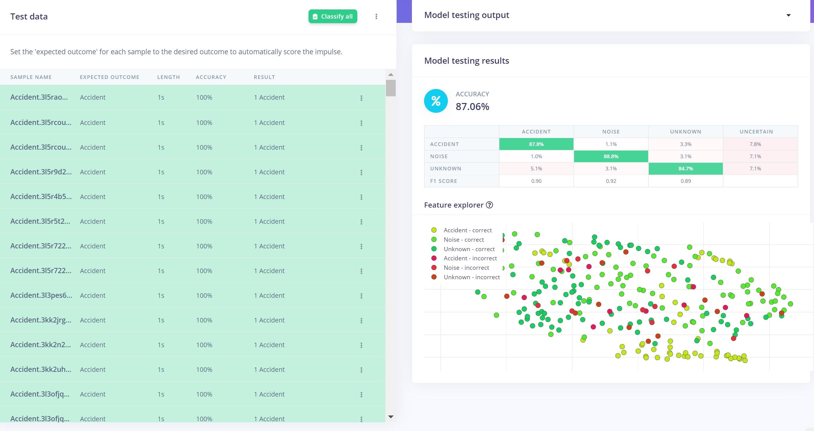

After letting it run, it looks like we got around 87% accuracy. Not as high as our predicted 94% accuracy, but still very good.

## Deployment

To deploy our model onto the device, back in the mobile App you can simply go to the **Deployment** tab and click on the **Build** option. The App will start building our project, and then deploy the firmware directly to our Thingy:53 upon completion.

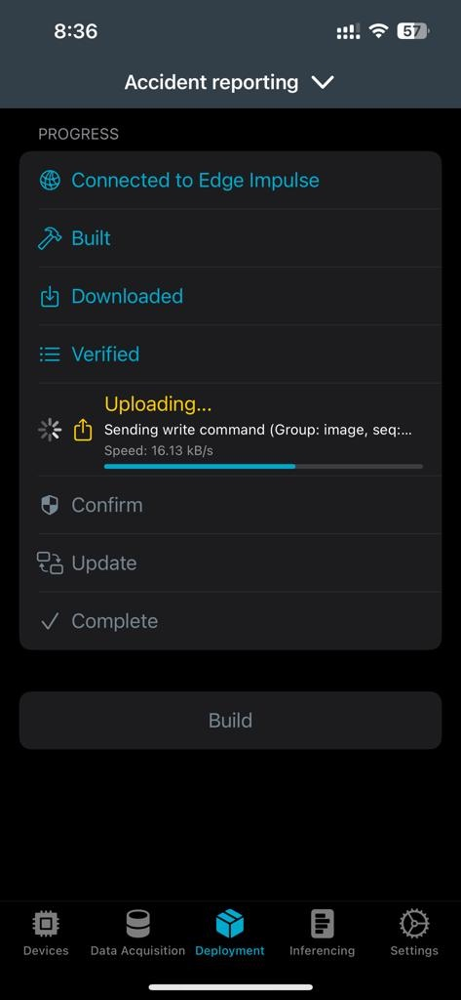
 
## Real-World Inferencing

After successfully deploying the model to the device, we can start our inferencing by switching to the **Inferencing** tab in the App. 

This video shows real-time inferencing in the Thingy:53.



## Conclusion

This project showed how to teach a Thingy:53 to recognize a keyword, commonly known as “keyword spotting”.  The process began with recording the word we are interested in recognizing, ensuring we have enough data for a quality dataset, building an Edge Impulse machine learning model, then deploying the model to the device.  The keyword used in this project was “Accident”, though any word could be used.  Further work on this topic could then add new capabilities beyond the keyword spotting to add voice recording, logging to a dashboard, or similar expanded functionality.

