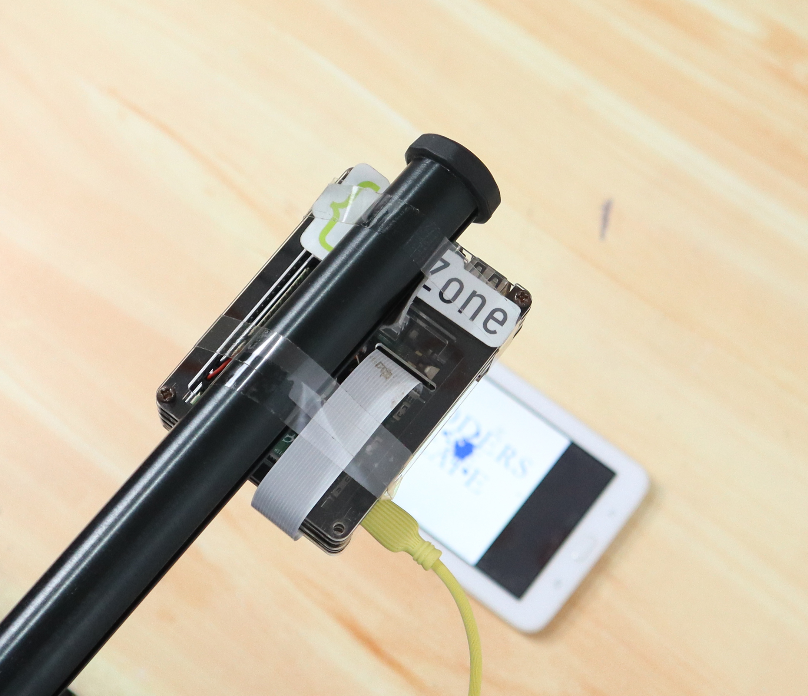
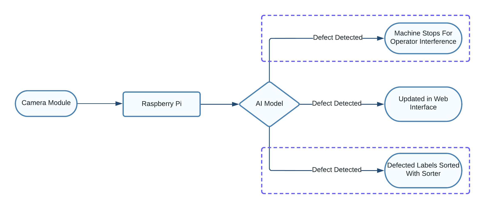
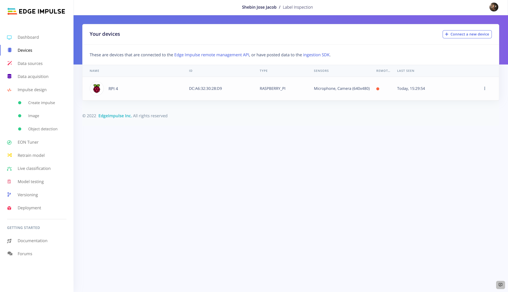
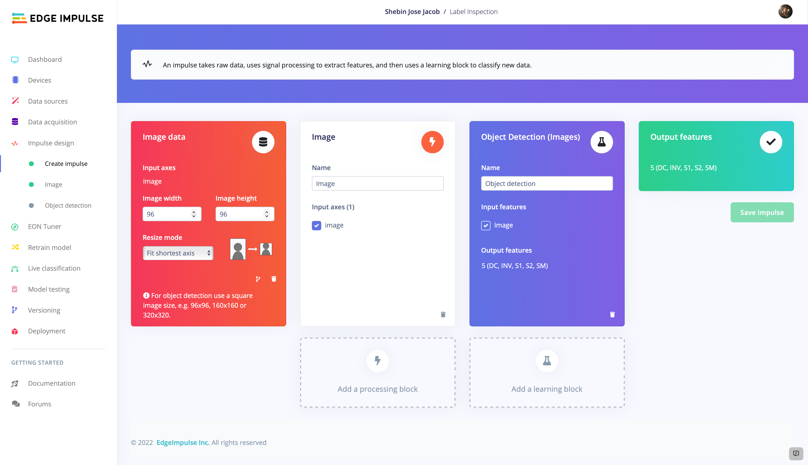
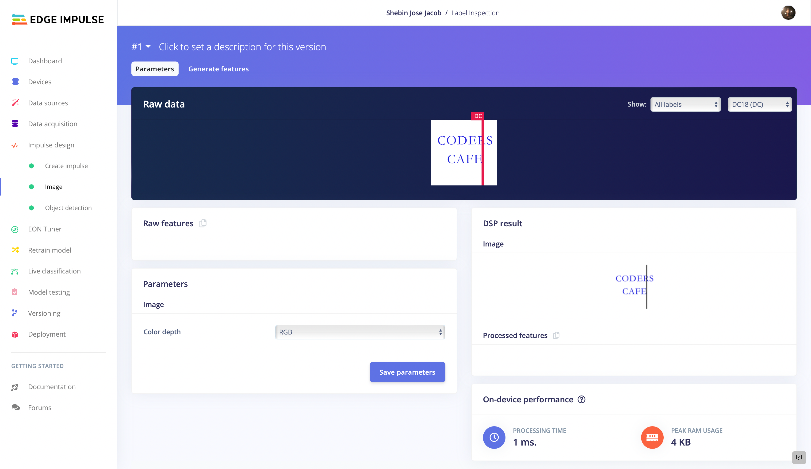
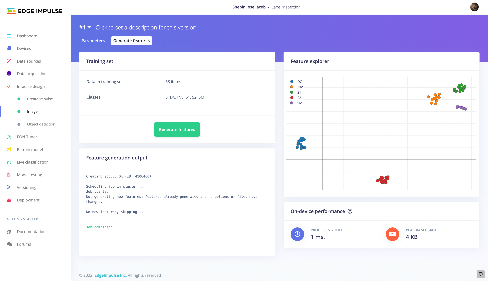
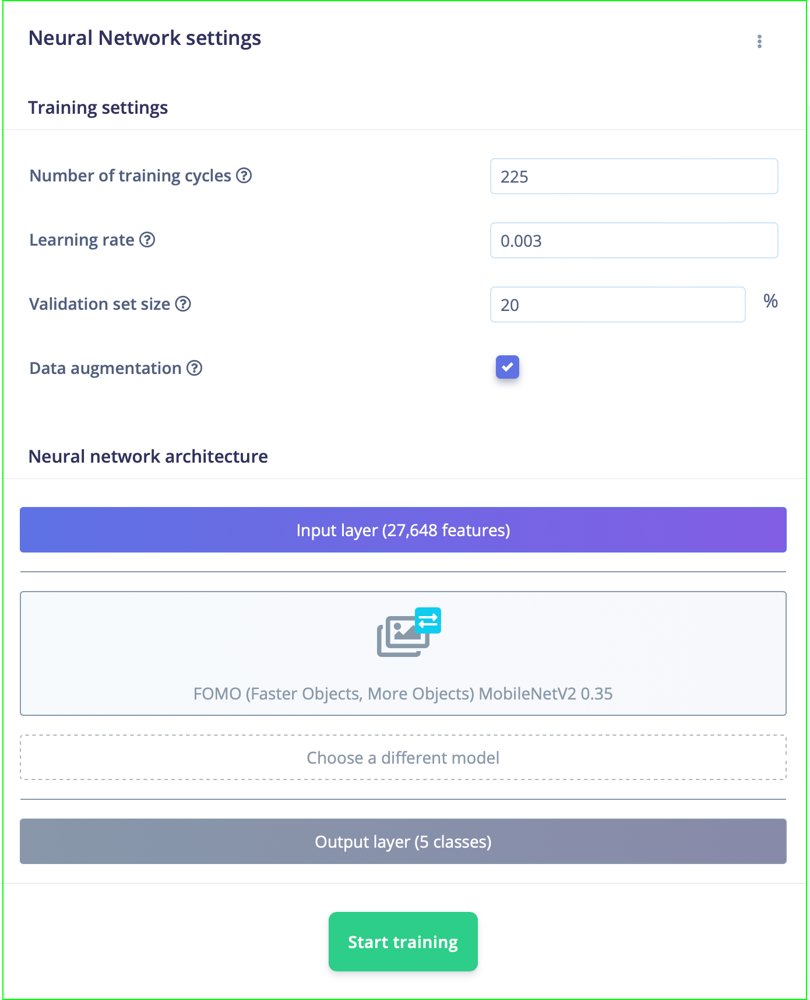
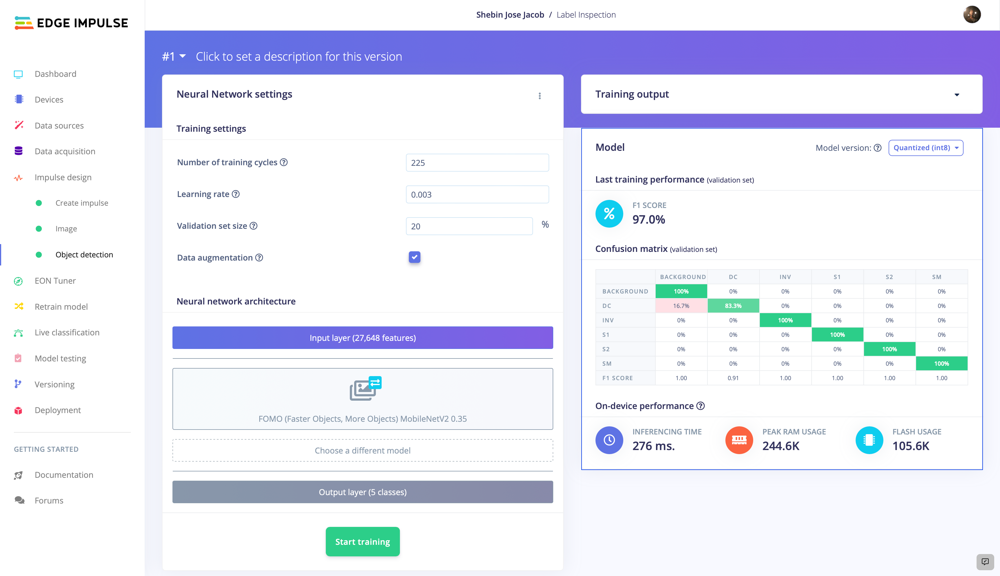
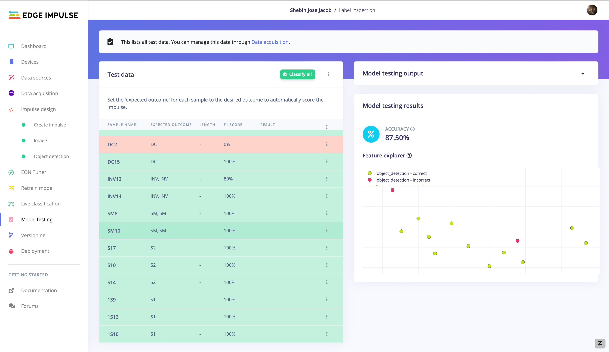
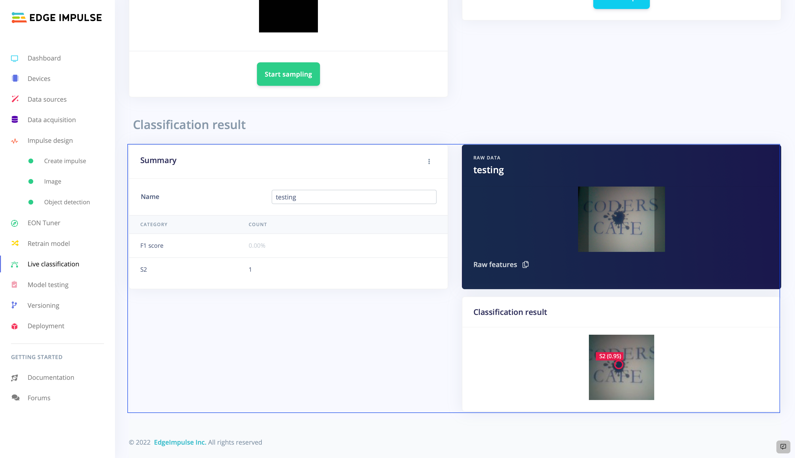

# Automated Label Inspection With FOMO 

Created By:
Shebin Jose Jacob

Public Project Link:
[https://studio.edgeimpulse.com/public/140432/latest](https://studio.edgeimpulse.com/public/140432/latest)

## Project Demo



## Intro

Every day, billions of variable data labels are utilized to offer vital consumer information, defend brands, give brand protection and identification, and track or identify things. That's a lot of capability packed into a small area. The information written on labels, whether they act as a routing barcode on a postal item or are used to help identify products, must be clear and accurate, and the labels themselves must be properly placed. The capabilities offered by label inspection systems ensure that these standards are met.

Print quality is greatly influenced by several factors, including machine settings, environmental conditions, and raw material quality. Mislabels, ink spills, smudged lettering, missing prints, dots, and markings are common printing-related occurrences. These flaws not only leave potential for misunderstandings and erroneous information, but they also lead to repeated client rejections and reduce the value of the brand. Inspection of print quality is a crucial step that can spare your production from that hassle.

We are trying to build a fast and accurate automated label inspection system utilizing the capabilities of [FOMO](https://docs.edgeimpulse.com/docs/edge-impulse-studio/learning-blocks/object-detection/fomo-object-detection-for-constrained-devices) to detect ink smudges, foreign elements, unwanted dots and marks, inverted labels, and many other printing issues. As FOMO is fast and accurate, the automated label inspection system can be built for a very low price with immense accuracy and speed.




## How Does It Work

Our system consists of a Raspberry Pi 4 along with a compatible 5 MP camera module. The system runs an AI model built using FOMO. The model is currently capable of detecting Ink Spills, Ink Smudges, Die Cutting, and Inverted Labels. More classes can be easily added and the system can be made more robust. 

If the system detects any of the known defects it generates an alert in a web interface, which can be easily monitored. This system can be easily tweaked in such a way that whenever a defect is detected in the printing machine itself, the machine is stopped instantaneously for operator assistance, which reduces the chance of any such defects due to machine error. Or, this system can be easily employed to categorize the defective labels from a collection of printed labels using a sorter device.



## Hardware requirements
* Raspberry Pi 4
* 5 MP Camera Module

## Software requirements
* Edge Impulse 
* Python

## Hardware Setup

The hardware setup is pretty simple. It consists of a Raspberry Pi 4 Model B and a compatible 5 MP camera module.


## Software Setup

The Raspberry Pi 4 comes with a quick Getting Started Guide [here](https://docs.edgeimpulse.com/docs/development-platforms/officially-supported-cpu-gpu-targets/raspberry-pi-4), that will help you to set up Edge Impulse on your device. Follow the instructions and get your device connected to the Edge Impulse Dashboard.



## Build The TinyML Model

Once we have set up our hardware and software, now it's time to build the tinyML model. Let's start by collecting some data.

### 1. Data Acquisition and Labeling

Our data consists of four classes: **Ink Smudges, Ink Spill, Die Cutting and Inverted Label.**


We have collected 20 images belonging to each class and uploaded them using the **Data Uploader**. Label them from the **Labelling Queue** and split them into Training and Testing sets, in the ratio of 80:20, which forms a good dataset to start model training.  More images is better, but 20 is enough to get started with.

### 2. Impulse Architechture

We are using FOMO as our object detection model, which performs better with 96 X 96 pixel images, so we set our image width and height to 96px. Keeping **Resize Mode** to **Fit shortest axis**, add an **Image** processing block and an **Object Detection (Images)** learning block to the impulse.





Move on by keeping the settings as they are, and use **Feature Explorer** to see how well your data collection and classes are separated.



### 3. Model Training and Testing

Once we have designed our impulse, let's continue training the model. The model training settings we used are shown in the figure below. You can tweak the parameters in such a way that the trained model shows a greater accuracy but beware of overfitting when playing with model training settings.



In this case, we are using **FOMO (MobileNet V2 0.35)** as the neural network, which outputs a fast, lightweight, and reliable machine learning model. We are using 225 learning cycles with a learning rate of 0.003 to build a fully functional model.



The trained model has an accuracy of 97%, which is pretty awesome. Now let's test how the model works with some previously unknown data. Move on to **Model Testing** and **Classify All** to evaluate the model's performance. 



We've got 87.5% accuracy, quite promising. Now let's verify it again with some live classification. Navigate to **Live Classification** and collect some image samples from your Raspberry Pi or upload some test data. 

### 4. Live Classification

Here we are collecting some data from our RPI 4 and let's test it out:



The model is working perfectly. Now let's deploy it back to the device.

## Firebase Realtime Database

For our project, we used a Firebase real-time database that allows us to rapidly upload and retrieve data without any waiting. In this case, we took advantage of the `Pyrebase` package, a Python wrapper for Firebase.

To install Pyrebase, 
```
pip install pyrebase
```

In the database, follow these steps:

* Create a project. 
* Then navigate to the Build section and create a realtime database. 
* Start in test mode, so we can update the data without any authentication.
* From Project Settings, copy the config.

Now add this piece of code by replacing the config details, into your python file to access data from Firebase.

```python
import pyrebase
config = {
  "apiKey": "apiKey",
  "authDomain": "projectId.firebaseapp.com",
  "databaseURL": "https://databaseName.firebaseio.com",
  "storageBucket": "projectId.appspot.com"
  }
firebase = pyrebase.initialize_app(config)
```

## Web Interface

We are using a webpage created using HTML, CSS, and JS to display the defects in real time. The data updated in **Firebase Realtime Database** is updated on the webpage in real-time. The webpage displays various defects with their occurrences so that the operator can easily look for the particular issue.


## Code

The code for this project is developed using Python and the Edge Impulse Python SDK. The entire code and assets are available in [this GitHub repository](https://github.com/ShebinJoseJacob/Label-Inspection-With-FOMO).


