# Liquid Classification with TinyML

Created By:
Thomas Vikstrom 

Public Project Link:
[https://studio.edgeimpulse.com/public/222160/latest](https://studio.edgeimpulse.com/public/222160/latest)

## Introduction

Inspired by how Benjamin Cabé's amazing [artificial nose](https://blog.benjamin-cabe.com/2021/08/03/how-i-built-a-connected-artificial-nose) can recognize different scents, I thought it would be interesting to find out if it was possible to simulate the tastebuds of a human tongue to detect different types of - more or less - drinkable liquids. This tutorial shows how low-cost water quality sensors, together with WIO Terminal, were used to successfully detect five different liquids with help of TinyML (Tiny Machine Learning).
  


## Use-case Explanation

This project belongs mainly to basic research and thus I don't have a real problem to solve. However, many ideas have popped up for how the learnings from this project could be taken further for real use:

- Use in olfactory (smell and taste) training for patients suffering from loss of smell and taste (see *below)
- Use in wine tasting, for this an additional pH sensor is probably needed
- Use in water quality verification, e.g. for waste water treatment 

**A lot of people are unfortunately suffering from partial or complete anosmia (loss of smell) and ageusia (loss of taste). The reasons for the loss vary, but especially during the last few years Covid-19 has been recoqnized as one significant contributor. While most of the people having suffered through Covid-19 or other respitarory illnesses eventually fully recover their taste and smell capabilities, [one study](https://www.bmj.com/company/newsroom/millions-of-covid-patients-may-have-long-term-smell-and-taste-problems/#:~:text=They%20found%20that%20smell%20loss,of%20patients%20reported%20taste%20recovery) reports that approximately 5 % of patients having recovered from Covid-19 have a persisting loss of smell and/or taste a long time after.*

## Sensors Used in this Project

The two sensors that are used in this project are (see next chapter for further links):
- Grove TDS Sensor
- Grove Turbidity Sensor

**What is TDS and why should you care**

TDS = Total Dissolved Solids, is a measure of the dissolved combined content of all inorganic and organic substances present in water. Typically, the higher the TDS value, the more substances dissolved in water. Hence, higher levels of Total Dissolved Solids (TDS) can indicate that water has more contaminants that can pose health risks. *(Source [Seeedstudio](https://www.seeedstudio.com/Grove-TDS-Sensor-p-4400.html?queryID=8b51e6082631abe27d9dc97a983936bc&objectID=4400&indexName=bazaar_retailer_products))*

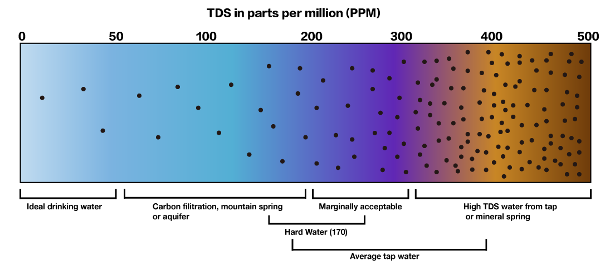

**What is turbidity**

The Grove turbidity sensor can measure the turbidity of the water (the number of suspended particles).

The optical sensor of this module can measure the density of turbid water and the concentration of extraneous matter using the refraction of wavelength between photo transistor and diode. By using an optical transistor and optical diodes, an optical sensor measures the amount of light coming from the source of the light to the light receiver, in order to calculate turbidity of water. *(Source [Seeedstudio](https://wiki.seeedstudio.com/Grove-Turbidity-Sensor-Meter-for-Arduino-V1.0/))*

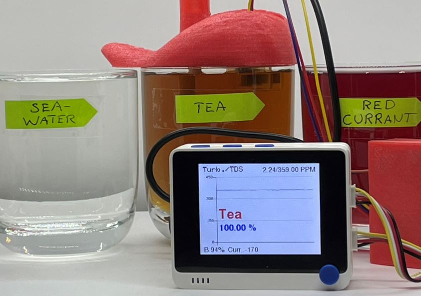

## Components and Hardware Configuration

### Components

#### Required

- [Wio Terminal](https://www.seeedstudio.com/Wio-Terminal-p-4509.html?queryID=9771732d93468a0f30dbfc5262e76c34&objectID=4509&indexName=bazaar_retailer_products), SKU 102991299
- [Grove - TDS Sensor/Meter For Water Quality](https://www.seeedstudio.com/Grove-TDS-Sensor-p-4400.html?queryID=4a630ba8b2d70bcfca1375237f32fc0d&objectID=4400&indexName=bazaar_retailer_products), SKU 101020753
- [Grove - Turbidity Sensor](https://www.seeedstudio.com/Grove-Turbidity-Sensor-p-4399.html?queryID=83279b52ae522a495d8f87efd2c3784c&objectID=4399&indexName=bazaar_retailer_products), SKU 101020752

#### Optional but Recommended

- [Wio Terminal Chassis - Battery (650mAh)](https://www.seeedstudio.com/Wio-Terminal-Chassis-Battery-650mAh-p-4756.html?queryID=2b0ff4e58b77c003e5bc9e13352a3459&objectID=4756&indexName=bazaar_retailer_products), SKU 103990564
- 3D-printer to print tongue and case 
    - While PETG- or PLA-filaments also work, TPU-filament is recommended due to its softness and flexibility. For example, the case and the lid for the PCB boards fits perfectly together as they can be squeezed a bit when attaching to each other.
    - If you don't want to 3D-print a case for the PCB boards, at least put them in separate match boxes or similar to minimize the risk of liquids dropping on them. Electronics and liquids don't play well together...
    - The Turbidity sensor has holes on the top, so it's not water tight = do not immerse it completely in liquids. By a 3D-printed tongue, or by your own sensor case design, the sensors can be held at proper depth and thus minimizing the risk that the turbidity sensor breaks due to liquids inside it. Make it almost fool-proof by also putting hot glue or adhesive putty (Blu tack) on the holes.

## Hardware Configuration

- Put the PCB boards into the 3D-printed case first
- Connect the cable for the TDS-sensor to Grove port A2, and the cable for the Turbidity sensor to Grove port A4 on the battery chassis
    - you can of course use any other analog port as long as you change the relevant defines in the code (`#define TDS_Pin A2` and 
`#define turbidity_Pin A4`). If not using Grove ports or the battery chassis, you can use the 40-Pin GPIO Header at the back.
- Double-check the connections

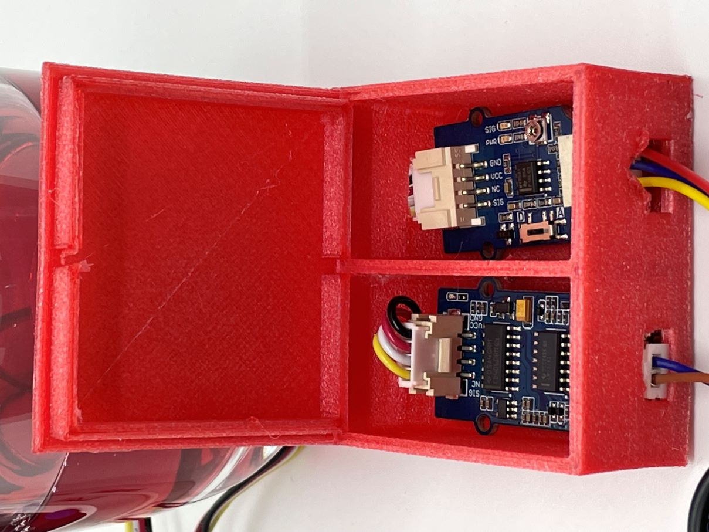

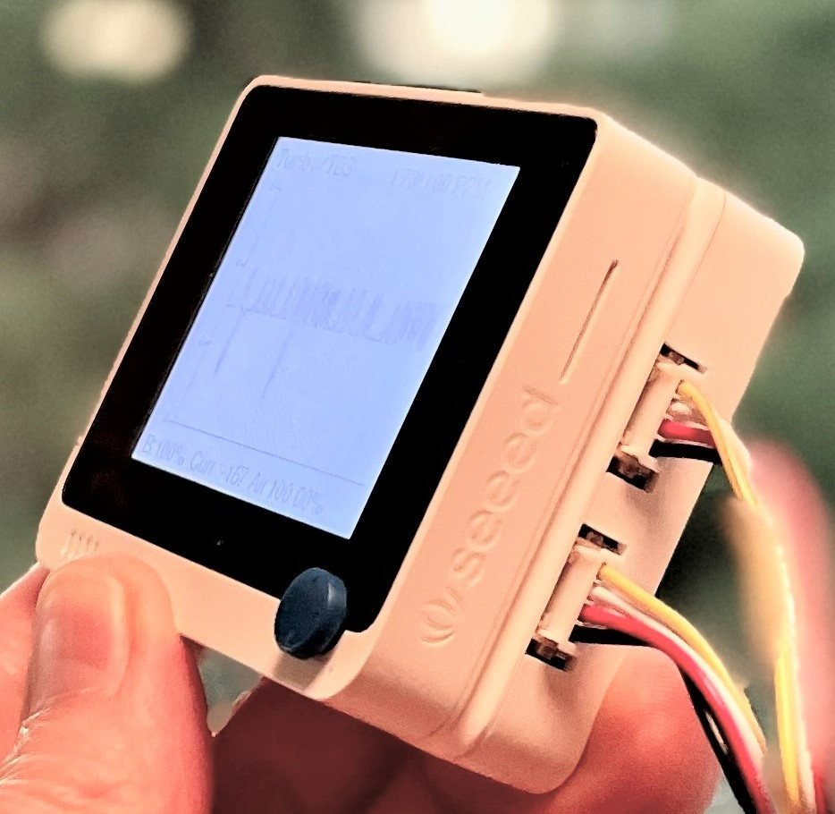

### 3D-printing the Tongue and the PCB Case

- The different STL-files are found at the [GitHub repository](https://github.com/baljo/Tongue/tree/main/3D%20Model/STL-files)
    - [PCB case](https://github.com/baljo/Tongue/blob/main/3D%20Model/STL-files/PCB%20case.stl)
    - [PCB lid](https://github.com/baljo/Tongue/blob/main/3D%20Model/STL-files/PCB%20lid.stl)
    - [Tongue top](https://github.com/baljo/Tongue/blob/main/3D%20Model/STL-files/Tongue_top.stl)
    - [Tongue bottom](https://github.com/baljo/Tongue/blob/main/3D%20Model/STL-files/Tongue_bottom.stl)
- I used TPU-filament (from CCTree) for the first time and was surprised that it worked without issues on my budget Bowden-tube equipped 3D-printer. I did though not dare to go full speed (100 mm/s), instead used a moderate 50 mm/s, and a temperature of 220 °C. Print with high quality, I chose the max quality of 100 microns (0.1 mm), which made the printer working for hours with each part. 
- No support is needed, a brim or raft is though recommended. TPU-filament sticks better to the print bed than PLA, so a heated bed is probably not necessary, my printer is anyhow not having one.
- The "tongue" is split in two parts, the bottom part is not strictly needed, but provides some protection when the equipment is not in use, and makes it look more like a real tongue! If you are printing with very flexible TPU-material, you might want to make the bottom part a tad thicker than in the design files.

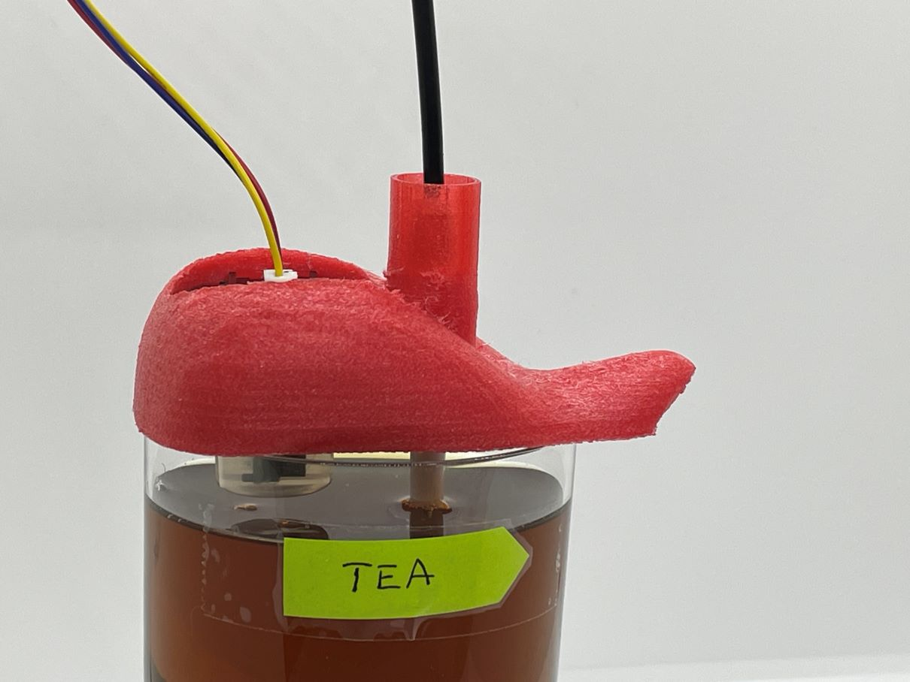

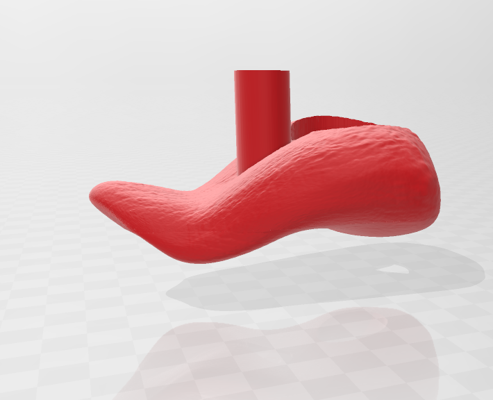

## Installing Software

To be able to gather data, and later to test the setup in practice, you need to prepare the WIO Terminal:

- Follow the steps in this [tutorial](https://wiki.seeedstudio.com/Wio-Terminal-TinyML-EI-1/)
- Add following libraries through the Arduino IDE via `Sketch > Include Library > Add .ZIP library`:
    - [ei-tongue-arduino-1.0.2.zip](https://github.com/baljo/Tongue/blob/main/ei-tongue-arduino-1.0.2.zip)
    - If using the battery chassis, and you want to see the battery status: [SparkFun BQ27441-G1A LiPo Fuel Gauge Arduino Library](https://github.com/sparkfun/SparkFun_BQ27441_Arduino_Library/tree/master) 
    - Visit [Seeed_Arduino_Linechart](https://github.com/Seeed-Studio/Seeed_Arduino_Linechart) and download the entire repo to your local drive. Then add the .ZIP-file as above

# Data Collection Process

To collect data using Edge Impulse, there's only a few steps to take:

**Preparations**

- Find at least two liquids, e.g. tap water and sea water. Do not use any liquids that might damage the sensors like oil, acids, or very corrosive liquids. 
    - After you have immersed the sensors in a liquid, rinse them carefully with water and wipe them dry. 
- Compile and upload the main program [Tongue.ino](https://github.com/baljo/Tongue/blob/main/Tongue.ino) to your WIO Terminal
    - This program is used both for collecting data, and later for inferencing. The program writes sensor data to the terminal which will be collected by the data forwarder in next step.
- Use the Edge Impulse [data forwarder](https://docs.edgeimpulse.com/docs/edge-impulse-cli/cli-data-forwarder), force the frequency to be 5 Hz by `edge-impulse-data-forwarder --frequency 5`
    - When you see this message `2 sensor axes detected (example values: [3,1.79]). What do you want to call them? Separate the
 names with ',':`, type `TDS, Turbidity` as these are the sensor labels used in the program.
    - More info about how the data forwarder works can be found [here](https://docs.edgeimpulse.com/docs/edge-impulse-cli/cli-data-forwarder).

**Collect Data**

- Head over to Edge Impulse, create a project if not already done so, and go to `Data acquisition`

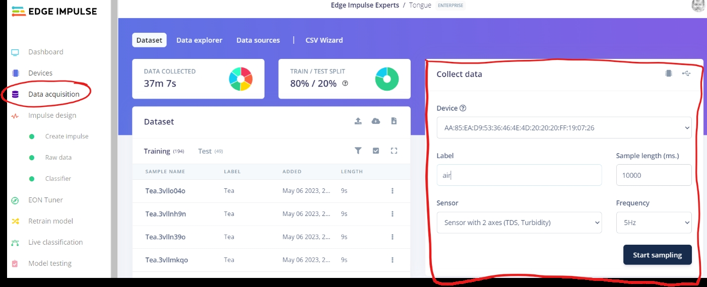

- Your device should now be visible on the right side.
- Use a sample length of 10000 ms (= 10 seconds), the frequency is automatically 5 Hz as you forced it to be in the preparation steps.
- The first label you should record data for is `air` that is, do not immerse the sensors in any liquid, just keep them in the air.
    - It is often necessary to have a label that serves as *other* or *background*. In this case the label `air` is even "hard coded" in the program, but the program will technically work fine even if you don't use `air` as label.
- Click on `Start sampling` to collect data, I collected roughly 6 minutes of data for each label, but I recommend you start with a minute or so for each label. Machine learning is most often an iterative process, so start small and adjust if needed.
- When collecting data from liquids, ensure the sensors are immersed deep enough.
    - Check the animation in the beginning of this tutorial, the liquids are very close to the glass rims.
    - Name the liquids, preferably with a shortish label as they will be displayed on the WIO Terminal later.
    - Try to collect roughly same amount of data for each liquid.

**Important**

- You want to put aside some of the data samples as test data that will be used later. Depending on how you are collecting data, this will happen automatically or not. If the pie chart at the top shows 100%/0% as Train/Test split, you'll need to manually intervene. One way is to separately click on `Test` in the `Dataset` section and collect data there, but especially the first time it is easier to select ´Dashboard`, scroll down and then click `Perform train/test split`. This will create an ideal split of 80%/20%.

## Training and Building the Model

After collecting some data you are now ready to build and train a ML model:

**Create an Impulse and Generate Features**
- Select `Create impulse` from the menu, set the Window size to 2000 ms, Window increase to 500 ms, and frequency to 5 Hz.
- Select `Raw Data` as `Processing block` and `Classification` as `Learning block`
- Click `Save impulse`

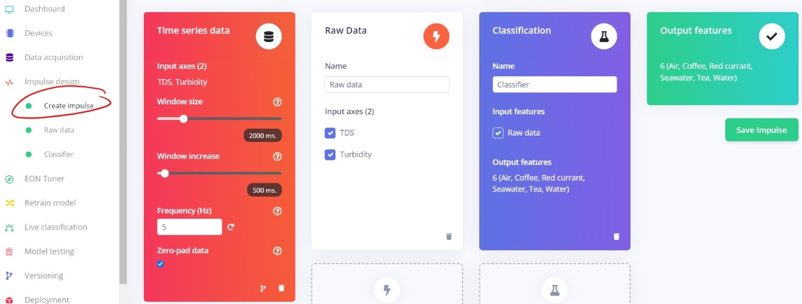

- Select `Raw data` from the menu
- Click `Generate features`
    - After a while you'll see a graphical representation in the Feature explorer at the right. The more separated the classes are, the easier it will be for the model to classify. In this case the exact same liquid concentrations were used for each sample, this explains the nice separations. In most real cases though, the concentrations will to some degree vary from time to time, e.g. you probably never manage to brew tea with exactly same strength every time.

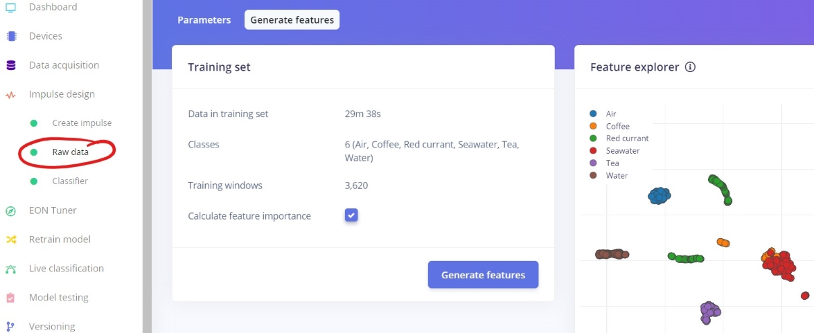

**Train the Model**

- Select `Classifier` from the menu
- Change the settings as in the picture, most important changes are the Dense layers and the Dropout rate, but feel free to play around with other settings.
- The unoptimized float32 model will with these settings be very tiny, so there's no need to profile an quantized int8 model.
    - In my case the int8 accuracy has actually been extremely poor and useless, I haven't though investigated why, as the float32 model works just fine.
- Click on `Start training`, unless you have lots of data and/or a very huge neural network, the training will in this case take just a few minutes.
- Depending on your data quality/quantity and your model settings, you might or might not achieve a satisfying accuracy.
    - If you get a very poor accuracy with the unoptimized float32 model, you might need to collect more data, but in this case you should also check that the turbidity sensor (the wider one), really is immersed enough in the liquid, otherwise the optics might "see" only air.
    - After you have collected new data, click on `Retrain model`. This way you don't need to yourself generate new features.

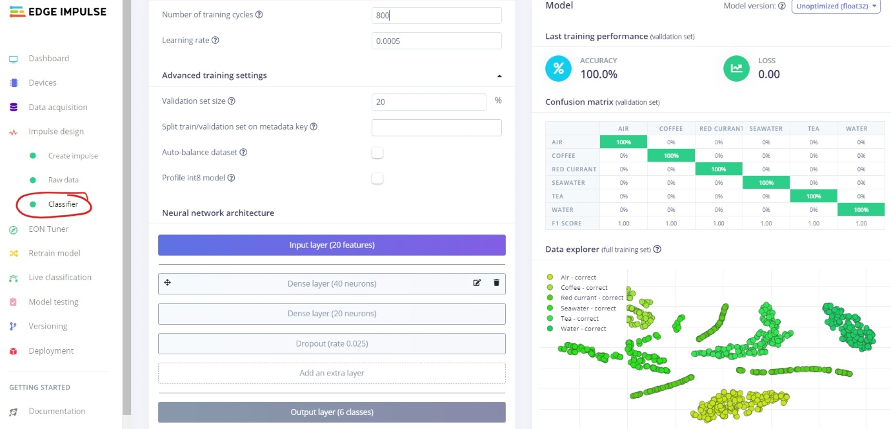

**Test the Model**

For a dry test (literally dry in this case !), you will utilize test data that the ML model has not seen before. This will be as close to testing in real life as it can get.

- Select `Model testing` and click `Classify all`.
- Again you'll need to wait for a short while before seeing how the model performs on unseen data. Often the accuracy might be slightly worse than in the training phase, but sometimes it might even be better. The final truth will though be revealed first during wet testing.
- If the accuracy is much worse than in the training phase, the reason is often that the model is overfitting i.e., it models the training data too well and is not able to generalize.
    - In this case it might help to make the model less complex (reduce amount of neurons), increase the dropout rate, or if you have just a few data samples, collect more data.

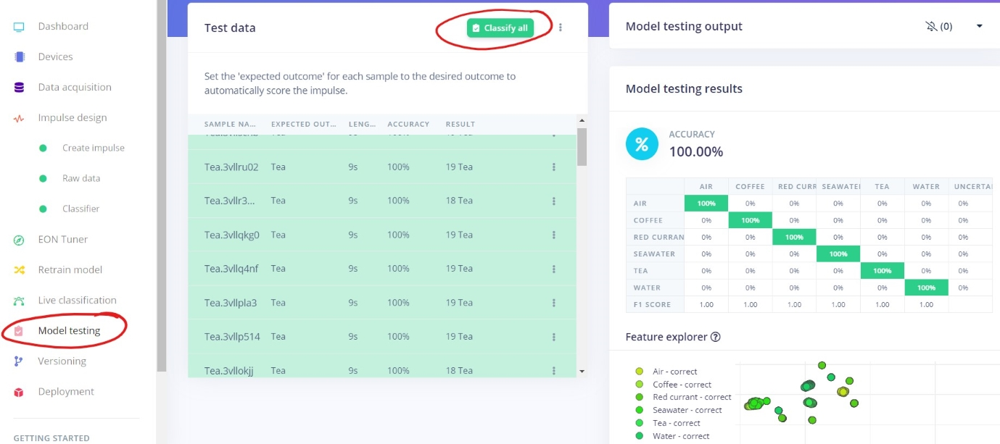

## Model Deployment (Wet Testing)

When you are ready to test the model in real life, in this case with WIO Terminal, Edge Impulse has again made it very easy for you:

- Select `Deployment` from the menu
- Select `Arduino library`
- Select `Unoptimized (float32)`, and click `Build`

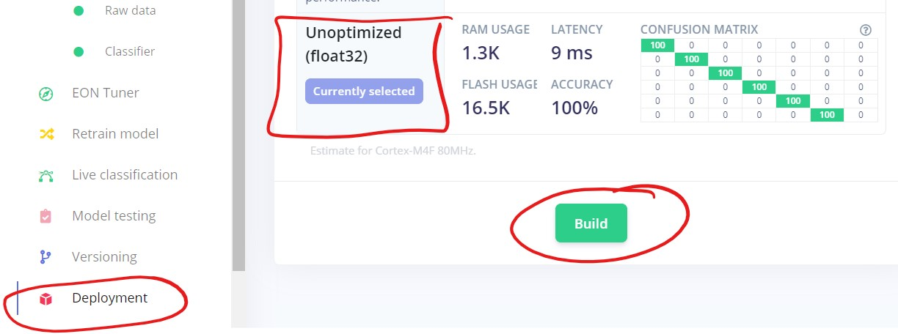

- After a few minutes, a window will pop up, showing you how to include the Arduino library into your own code.
    - In this case, you should again open the file `Tongue.ino` in Arduino IDE, include the new library as instructed, and then replace `<Tongue_inferencing.h>` with your own library's header file. If you named your project e.g. `Liquids` in Edge Impulse, you'd put `<Liquids.h>` here.

```
/* Includes ---------------------------------------------------------------- */
#include <Tongue_inferencing.h> // <<===============--------------------------- REPLACE this with your own library's header file
#include <SparkFunBQ27441.h>   // to read battery info
#include "seeed_line_chart.h"  //include the line chart library
#include "TFT_eSPI.h"
```

- Finally compile and upload the program to WIO Terminal. 
    - If everything works you should on the device itself see a line chart with slightly varying data
    - The sensor data is also shown in the Arduino IDE terminal window

**Notes about the `Tongue.ino` program:**

- It finds the maximum classification value and takes that as the final prediction
- It is not using any uncertainty threshold i.e., it will classify everything it senses into one of the classes. Feel free to add uncertainty classification code into the Arduino program if you see a need for it, you only need to compare the classification value to a given uncertainty percentage threshold, e.g. 60 %.

## Results

The first results I got when testing the model in wet conditions were very mixed. Sometimes the model could always classify a liquid correctly, sometimes it completely failed. As I suspected I had not initially paid attention to having the turbidity sensor at proper and consistent depth, I started over from scratch by filling all glasses almost to the rims before data collection. This seems to have been the resolution to the problem as the model now works 100 % correctly. Again, this shows that machine learning as a paradigm is often an iterative process and it's better to start with a smaller amount of data, build and test a ML model, and then adjust if needed. 

As mentioned earlier, the quantized int8 model performs extremely poorly and is useless. This is interesting as the unoptimized float32 model has a 100 % accuracy both in theory as well as in practice. I've not investigated this further, but would be interested in learning why this huge discrepancy occurs, and how to correct it.

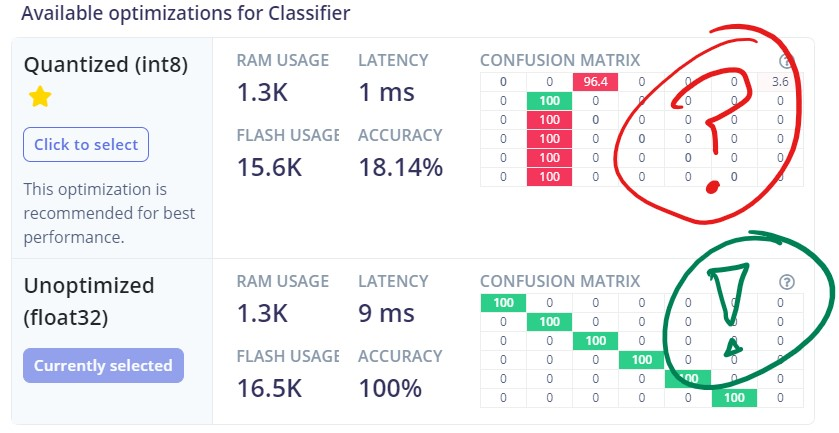

In addition, I have not tested the model with different concentrations, and suspect it might struggle with very diluted liquids. To overcome this potential issue, one would need to collect data from liquids with different dilutations and retrain the model. Do also note that there most probably are completely different liquids that happen to have same characteristics as measured by the two sensors used. When both sensors measure similar values, even from completely different liquids, the liquids will from the model point of view be one and the same. This problem can be overcome by using "sensor fusion" that is, adding more or different type of sensors like e.g. gas sensors for scenting. With WIO Terminal and Grove-components this should actually be quite easy to do.

Despite above mentioned potential shortcomings, I was positively surprised that the model as such worked perfectly and consistently.

## Conclusion

In this project you've learned how to build a functioning ML project able to classify different liquids with a good or hopefully perfect accuracy. You are recommended to explore this more and take it a step further by adding more and different types of sensors, and especially try to find use cases where this type of technology can make a difference.


### *Attributions*

*The tongue 3D-design is an adaptation from this [3D-file](https://www.thingiverse.com/thing:644879) found at Thingiverse. All 3D-files I've created are licensed similarly as the original creator's (Attribution-ShareAlike 3.0 Unported/CC BY-SA 3.0).*
