# Location Identification using Sound

Created By:
Swapnil Verma 

Public Project Link:
[https://studio.edgeimpulse.com/public/150467/latest](https://studio.edgeimpulse.com/public/150467/latest)

## Project Demo



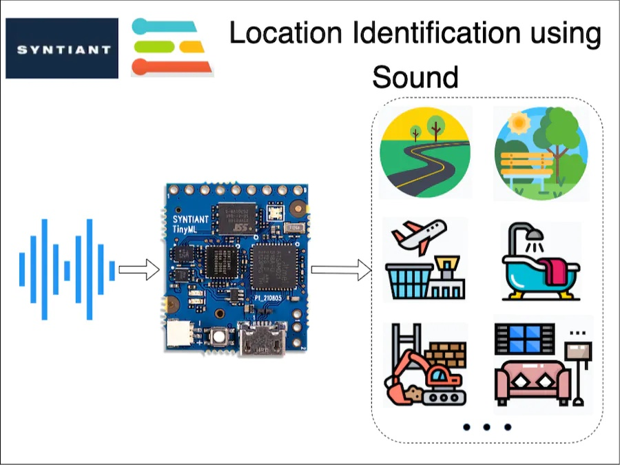

## Story

### Problem

Many times in an application, we want to identify the environment of a user, in order to automatically carry out certain tasks. For example, automatically switching on/off ANC (Automatic Noise Cancellation) in a headphone based on the user's environment. Or, in some applications leaving GPS turned on might be overkill and drain a battery's charge.

In situation's like this, can we detect a user's local environment without the use of GPS?

### A Solution

We, humans, are good at understanding our environment just by using auditory sensory skills. I can identify a multitude of sound sources and also guess an environment just by listening. In this project, I am trying to replicate the same behaviour using a TinyML board with a microphone, running a machine-learning model.

### Hardware

This is an interesting problem and I decided to use equally interesting hardware in this project:  The [Syntiant TinyML Board](https://www.syntiant.com/tinyml). This board is designed for voice, acoustic event detection, and sensor machine learning application.

It is equipped with an ultra-low-power [Syntiant NDP101 Neural Decision Processor](https://www.syntiant.com/ndp101), a SAMD21 Cortex-M0+ host processor, an onboard microphone and a 6-axis motion sensor on an SD-card size package. This board is extremely small and perfect for my application.

The cherry on top is that [Edge Impulse officially supports this board](https://docs.edgeimpulse.com/docs/development-platforms/officially-supported-mcu-targets/syntiant-tinyml-board).

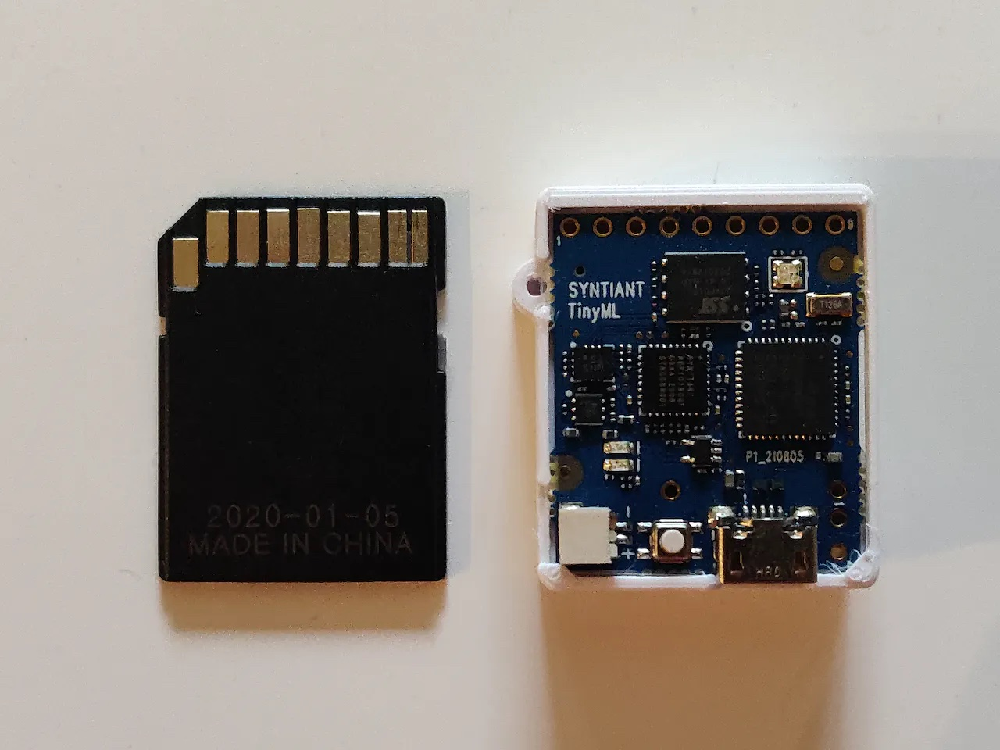

## Training Pipeline

As you might have guessed already, I am using Edge Impulse for building a TinyML model. Let's explore our training pipeline.

### 1. Data Collection

A good machine learning model starts with a high-quality dataset. I am using the [ESC-50] public dataset, to prepare my own dataset.

I have prepared a total of 7 classes denoting various locations, by combining some of the classes from the ESC-50 dataset. The classes I have prepared are:

- Airport (aeroplane and helicopter sound)
- Bathroom (brushing and toilet flush sound)
- Construction (jackhammer sound)
- Home (washing machine and vacuum cleaner sound)
- Road (siren, car horn and engine sound)
- Work (mouse click and keyboard typing sound)
- Anomaly (quiet environment sound)

I have used only the ESC-50 dataset to prepare a new dataset for this project. The sound samples contained within any of these classes are not the only representation of that class. They can be improved by adding more sounds from different sources.

The *[Data acquisition](https://docs.edgeimpulse.com/docs/edge-impulse-studio/data-acquisition)* tab of the Edge Impulse Studio provides the facility to upload, visualise and edit the dataset. This tab provides simple functions such as splitting data into training and testing, and a lot of advanced functions such as filtering, cropping, splitting data into multiple data items, and many more.

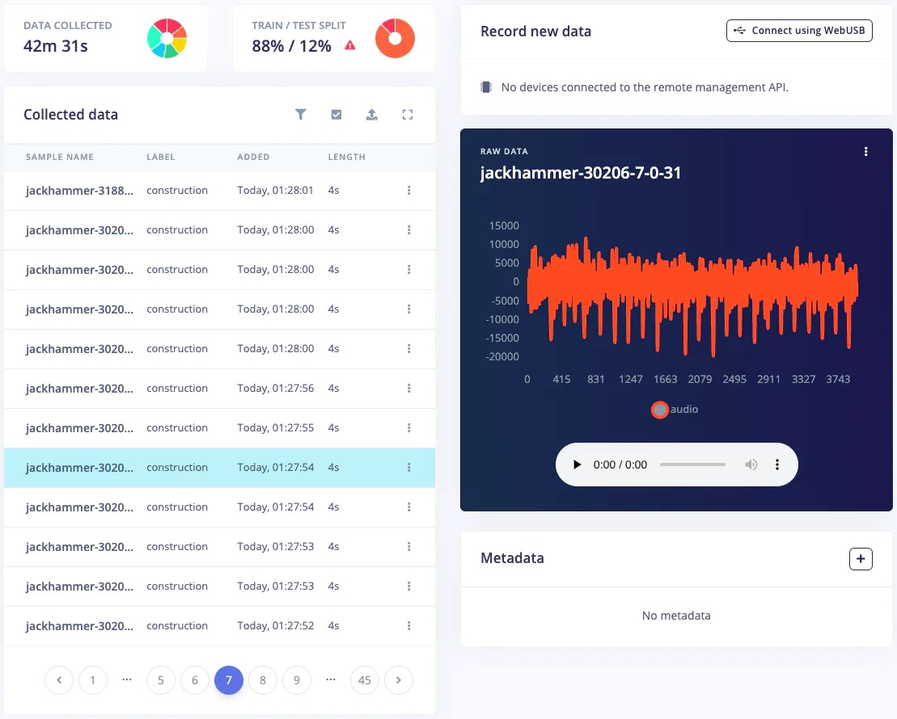

### 2. Impulse Design and Preprocessing

The first thing to do for training an ML model is Impulse design. It can also be thought of as a pipeline design from preprocessing to training.

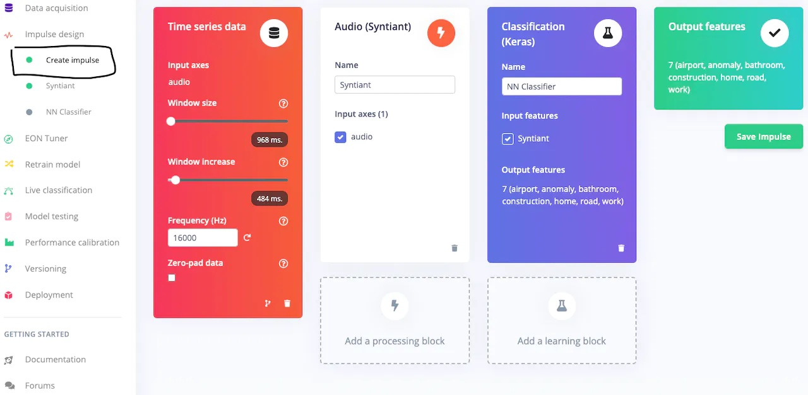

The dataset is an *audio* type, which is time-series data and therefore the Impulse design tab automatically added the first block. Next is the [pre-processing](https://docs.edgeimpulse.com/docs/edge-impulse-studio/processing-blocks?q=preprocessing) block. Syntiant has prepared a pre-processing block called [Audio Syntiant](https://docs.edgeimpulse.com/docs/edge-impulse-studio/processing-blocks/audio-syntiant?q=preprocessing) specifically for the NDP101 chip which is similar to [Audio MFE](https://docs.edgeimpulse.com/docs/edge-impulse-studio/processing-blocks/audio-mfe) but performs some additional processing. Next is the [learning block](https://docs.edgeimpulse.com/docs/edge-impulse-studio/learning-blocks) - the [classification (Keras) block](https://docs.edgeimpulse.com/docs/edge-impulse-studio/learning-blocks/classification) is perfect for this use case. The last block shows the Output features, i.e. classes.

In the pre-processing block, start with the default parameters. If required then change the parameters to suit your needs. In this project, the default parameters worked perfectly, so I just used them.

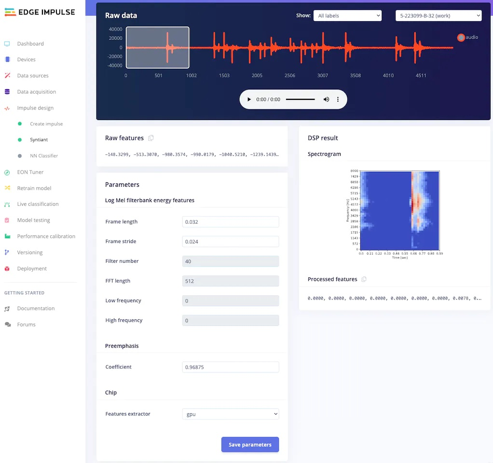

After adjusting the parameters, click on Generate features.

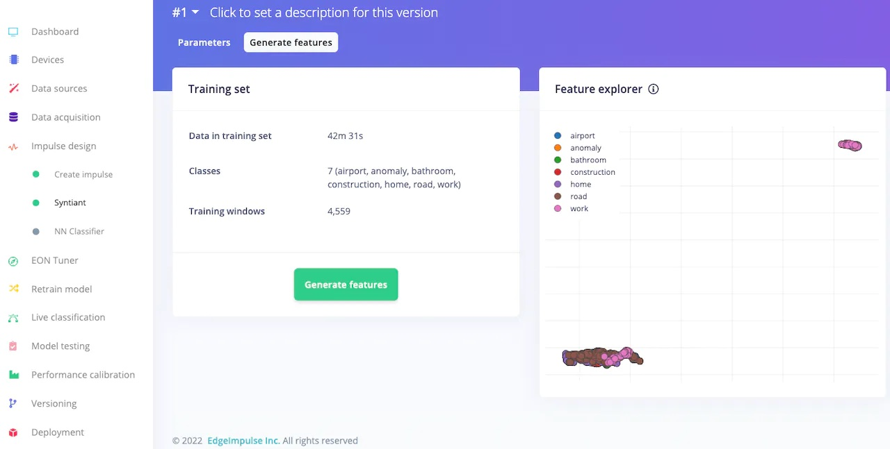

### 3. Model Training

After pre-processing the dataset, it's time to train a model. In the [NN Classifier](https://docs.edgeimpulse.com/docs/edge-impulse-studio/learning-blocks/classification) tab, adjust the training cycles, learning rate, etc. For the Syntiant TinyML board, the neural network architecture is fixed. I usually start with the default parameters, and based on the performance of the network I adjust the parameter.

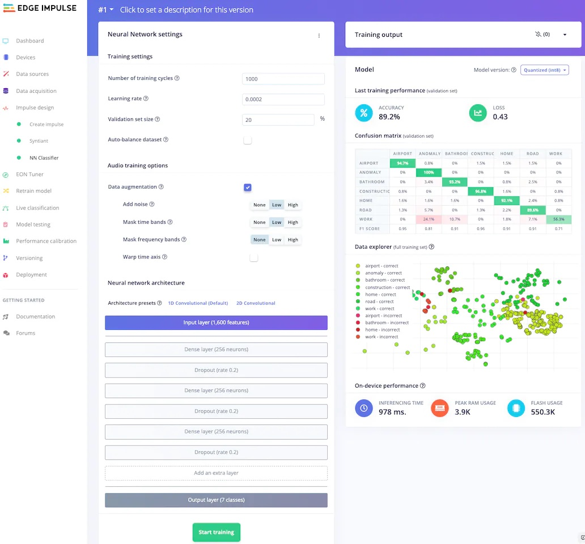

My model, trained with 1000 epochs and 0.0002 learning rate has 89.2% accuracy, which is not bad. This tab also shows the confusion matrix, which is one of the most useful tools to evaluate a model. This confusion matrix shows that the *work* class is the worst-performing class in our dataset.

At this moment, I realised that the *work* class contains sound samples of only keyboard and mouse operation, assuming people only work on computers. This is called [bias](https://scholar.google.co.uk/scholar?hl=en&as_sdt=0%2C5&as_vis=1&q=bias+in+machine+learning&btnG=), and I have inadvertently included bias in my machine-learning model. To correct my mistake, I disabled the work class from the training and test sets using the *filters* provided by the data acquisition tab.

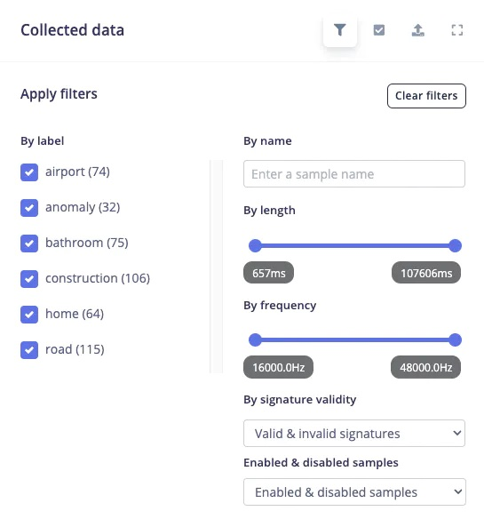

The pre-processing and NN classifier tab automatically adjusted itself for 6 classes instead, after the dataset was modified.

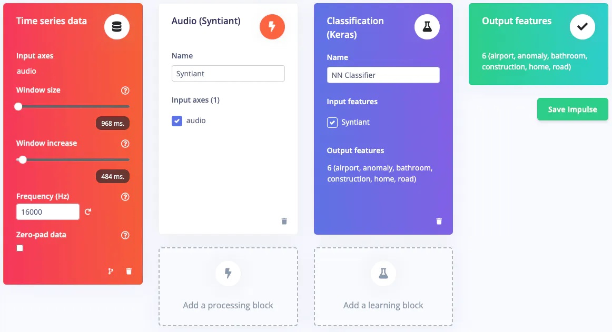

### 4. Model Retraining

After updating the dataset, go to the [Retrain model](https://docs.edgeimpulse.com/docs/edge-impulse-studio/retrain-model) tab and click on the "Train model" button.

This will re-run the pre-processing block and learning block in one click, with the latest parameters.

After retraining the model with these parameters, the training accuracy is now 92.1%.

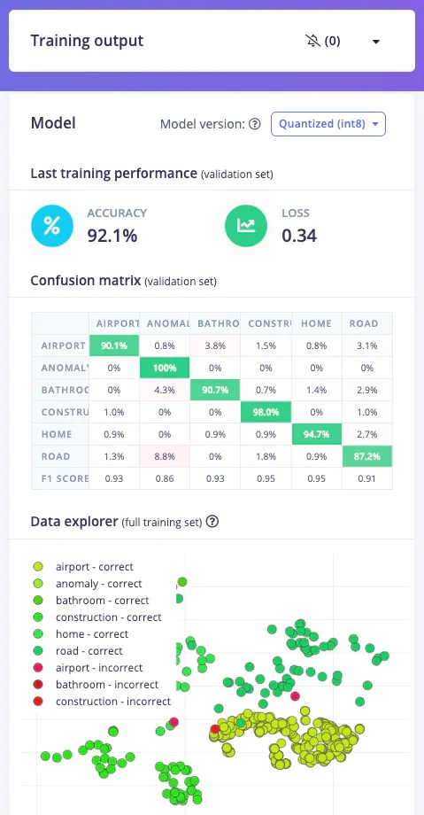

### 5. Model Testing

To test the model, jump over to the [Model testing](https://docs.edgeimpulse.com/docs/edge-impulse-studio/model-testing) tab and click on *Classify all*. It will automatically pre-process and perform inferencing on the set-aside data, using the last trained model. The testing performance of the model in my case is 84.91%.

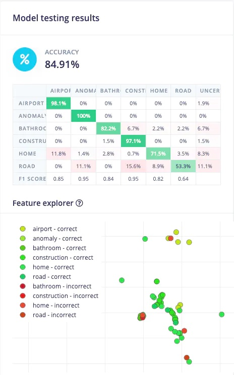

Thee *Road* class has the worst performance. Let's investigate why. Scroll to a sample which was classified incorrectly, and click on the 3 dots to get a menu, and then click on *Show classification*.

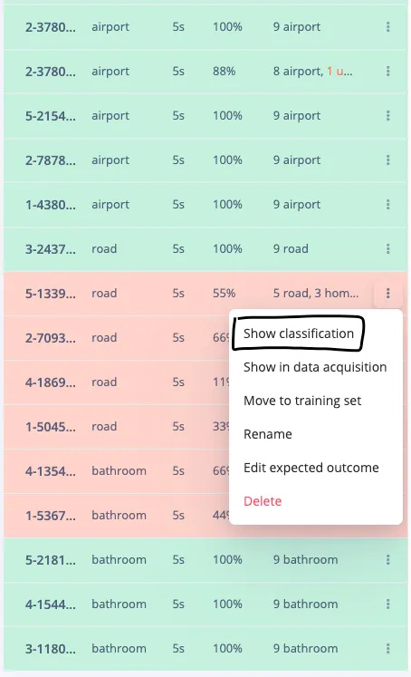

This will show the result of each window of that sample. In the *Raw data* section, we can also play the audio corresponding to that window, giving us more insight into why the sample was incorrectly classified.

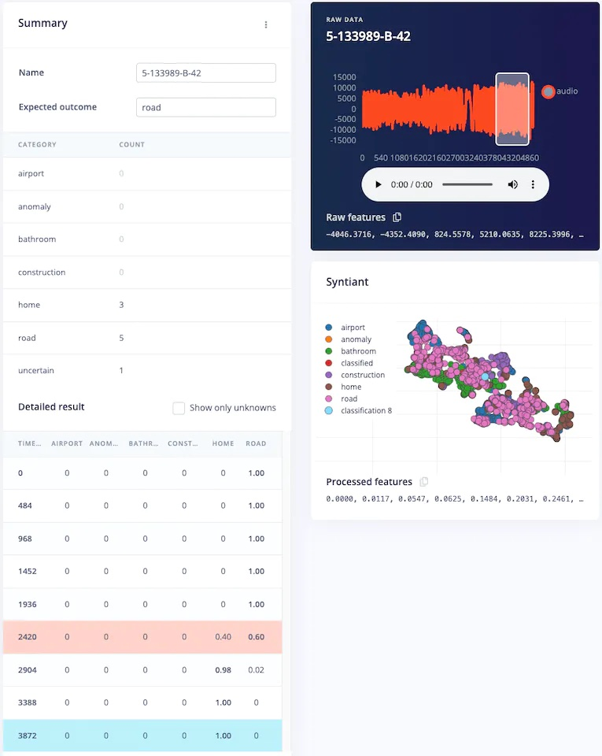

### 6. Deployment

To deploy the model to the target hardware (Syntiant TinyML in this case), go to the *[Deployment](https://docs.edgeimpulse.com/docs/edge-impulse-studio/deployment)* tab. The Syntiant TinyML board requires finding posterior parameters before building firmware. For other hardware, it is not required. Select the deployment option (library or firmware) and click Build to generate output. The firmware is built, downloaded to your computer, then you can flash it to the board.

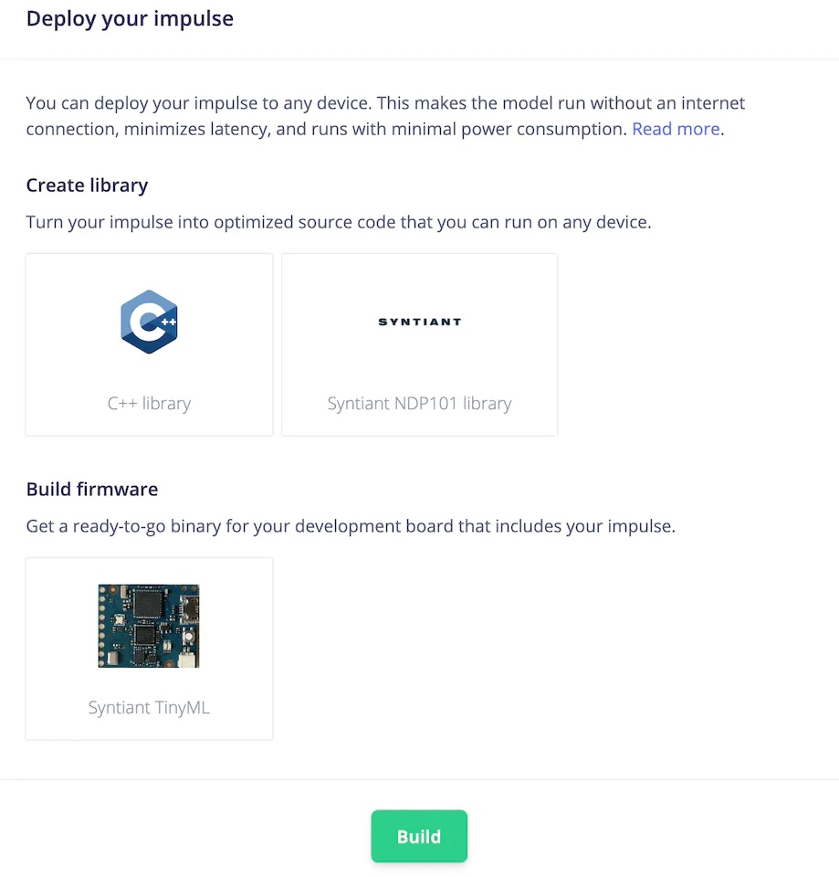

## Live Testing

Let's test the model after deploying it on the Syntiant TinyML board.  You can check it out in the below video.



## 3D-Printable Case

To download a protective 3D-printable case for the Syntiant TinyML board, please follow the below link:

[https://discourse.syntiant.com/t/tinyml-board-3d-printable-case/70](https://discourse.syntiant.com/t/tinyml-board-3d-printable-case/70)

## Edge Impulse Project

To clone this Edge Impulse project please follow the below link:

[https://studio.edgeimpulse.com/public/150467/latest](https://studio.edgeimpulse.com/public/150467/latest)

