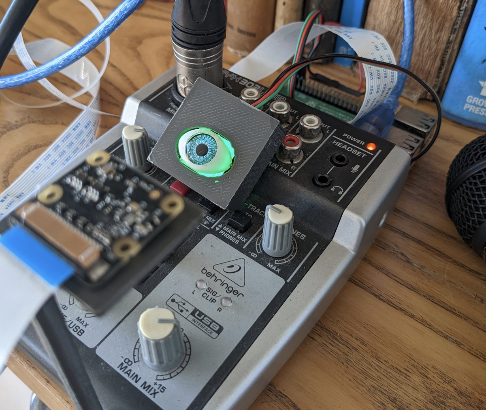
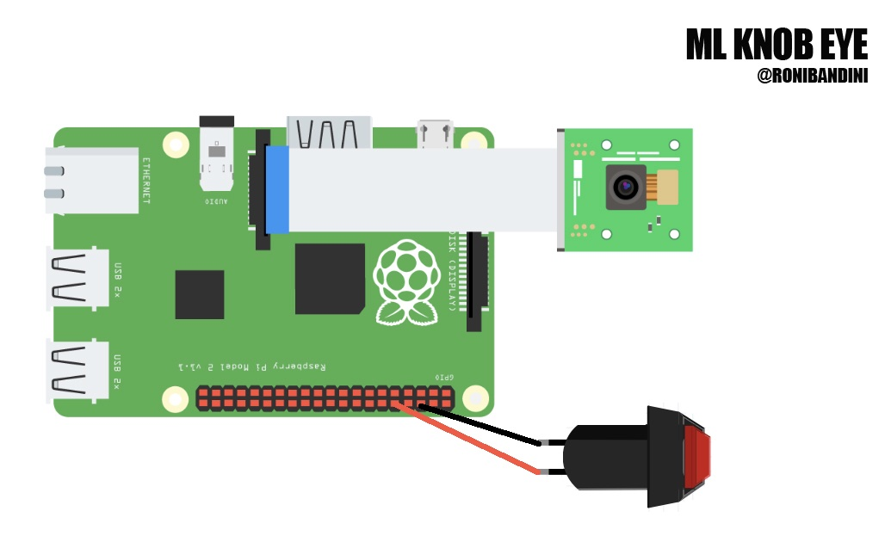
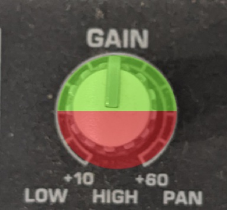
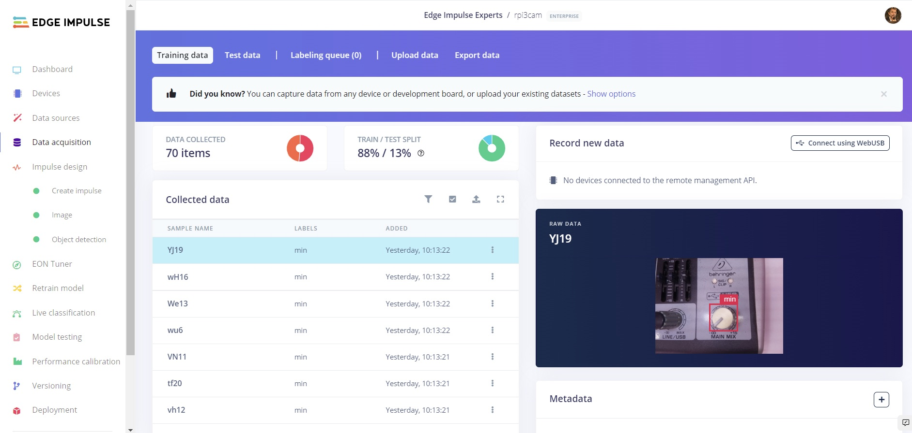
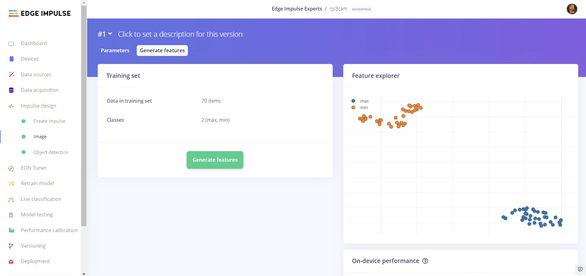
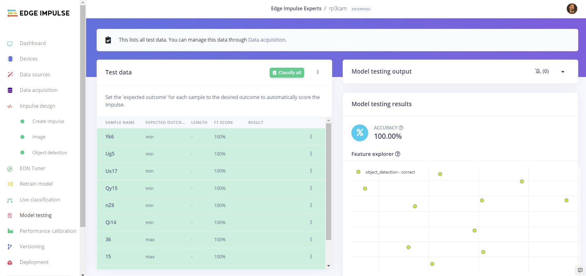
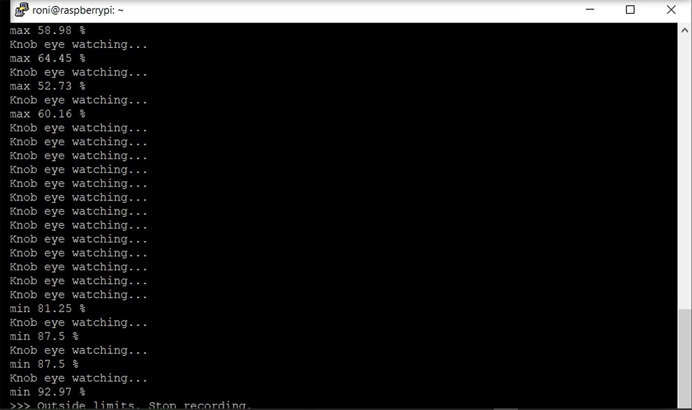
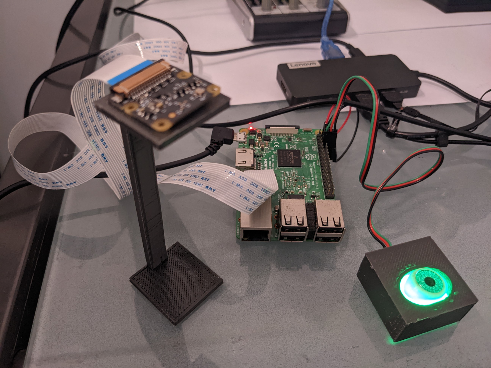

# Knob Eye: Monitor Analog Dials and Knobs with Computer Vision

Created By:
Roni Bandini 

Public Project Link:
[https://studio.edgeimpulse.com/public/130291/latest](https://studio.edgeimpulse.com/public/130291/latest)

## Project Demo





## Intro

Making a bridge between analog equipment and digital data used to be complex and intrusive procedure until Machine Learning came into the picture. With Machine Learning, features of pictures are extracted and patterns are identified resulting in a reliable way of reading analog panels, even small knobs.

A recording studio typically has an Analog Behringer console that is used for different type of works. Sometimes long recording sessions are made with a knob in the wrong position (high peaks, wrong equalization, etc.), resulting in wasted time, effort, and ultimately, money.

The following project will try to read console knobs and take actions. 

## Hardware 

- Raspberry Pi 3 
- Raspberry Pi Cam v2 
- DFRobot Led Switch button 
- Analog audio console

*Note: The Behringer Xenyx 302USB used in this project is able to send audio through USB, but all knobs and controls are still analog and cannot be read or controlled digitally.*

## Circuit



Connect the Raspberry Pi Camera using the ribbon cable (lettering should be pointing to Raspberry USB connectors).

Connect Switch button to GND and GPIO15. If you are using DFRobot buttons with an LED light included, also connect the red cable to a 5V Pin on the Raspberry Pi.

## 3D Printed Case

If desired, print these 2 parts: Button case, and a camera stand. [https://cults3d.com/en/3d-model/gadget/analog-knob-reading-with-machine-learning](https://cults3d.com/en/3d-model/gadget/analog-knob-reading-with-machine-learning) 

## Raspberry Pi Setup

A Raspberry Pi running Linux will receive console audio out through a USB port, and record a `.wav` file. At the same time, a connected camera will take pictures and run inference against an Edge Impulse machine learning model. If knobs are detected in the wrong position, the recording will be automatically aborted.

To being, install the latest version of the Raspberry Pi OS.  You can use the "minimal" version, which does not have a desktop, as we won't need that. Then run the following series of commands:

```
sudo apt-get install python3-pip
sudo apt install git
pip install picamera
sudo apt install python3-opencv
sudo apt-get install libatlas-base-dev libportaudio0 libportaudio2 libportaudiocpp0 portaudio19-dev 
git clone https://github.com/edgeimpulse/linux-sdk-python
sudo python3 -m pip install edge_impulse_linux -i https://pypi.python.org/simple
sudo python3 -m pip install numpy
sudo python3 -m pip install pyaudio
```

## Model Training

The Behringer's main mix knob will be used. If this knob is too low or too high, a recording is considered wasted, so it should be aborted. 

To start the training, a good number of pictures with variations of the knob in both low and high positions is required. For other Machine Learning projects related to analog readings, one image is obtained and then digitally manipulated to add, for example, a needle in different positions. I have decided to use a different approach: a script for image acquisition with pauses to move the knob. Why? It is an effort to digitally manipulate an image, and if you are using knobs instead of gauges, the knob height could produce different shadows making the digital manipulation more complicated.

You can download a sample data acquisition script, and the recording script from:

[https://github.com/ronibandini/MLAnalogKnobReading](https://github.com/ronibandini/MLAnalogKnobReading)

Place the camera in the 3d printed arm, around 10cm over the knob, with good lighting. Place the knob in the "Minimum" (low) position. Then on the Raspberry Pi, run:

```
sudo python3 acquisition.py
```

When the message “move” appears on the screen, move the knob to another unsafe position.

Repeat the procedure to get at least 40 pictures. Then repeat the same process to capture around 40 pictures of "Maximum" (high) positions. 

Upload all of the "Minimum" images to Edge Impulse using the [Data Uploader](https://docs.edgeimpulse.com/docs/edge-impulse-studio/data-acquisition/uploader) tab. Then, go to the [Labeling Queue](https://docs.edgeimpulse.com/docs/edge-impulse-studio/data-acquisition/labeling-queue). Drag a bounding-box square over the knob in the image. In subsequent images the square will be auto-placed, but a small adjustment could be required. Do the same with the "Maximum" pictures.





Now go to *Create Impulse*. Choose *Image Data*, and use a 96x96 pixel size, fitting the Shortest axis. Save the Impulse, and on the next screen, the Processing Block, choose a *Color Depth* of RGB. Then click "Generate Features". 



At this point, you are ready to begin [Training your model](https://docs.edgeimpulse.com/docs/edge-impulse-studio/learning-blocks/transfer-learning-images), using Images.

At the end of the process, you can move and test your model's performance:



## Deployment

From the Deployment page on the left menu, select the "Linux Boards" deployment options. Select "Linux (ARMv7)", and download the generated firmware (`.eim` file), then copy the file to the Raspberry Pi.  Once on the Pi, you may need to change the file permissions of the `.eim` file to `744`.

## Usage

At this point, we are ready to connect the Behringer to the Raspberry Pi, via a USB cable. Then, on the Pi, run:

`sudo python record1.py`

Console output will be recorded to a `.wav` file. 



```
process = subprocess.Popen("arecord --device=hw:1,0 --format S16_LE --rate 44100 -c1 record.wav", shell=True, stdout=subprocess.PIPE, preexec_fn=os.setsid)
```

If you press the button, whenever the main mix knob is placed into a unsafe position, the recording will be interrupted. You can monitor all activities from the console.

```
if (bb['value']>detectionLimit and buttonRead == True):
                            print(">>> Outside limits. Stopping recording.")
                            os.killpg(os.getpgid(process.pid), signal.SIGTERM)
                            sys.exit()
```

## Code Settings

```
# button Gpio pin 
buttonPin=15

# confidence limit 90%
detectionLimit=0.90

# .eim file name
model = "rpi3cam-linux-armv7-v7.eim
```



## Conclusion

ML Knob Eye is an example of Machine Learning used to interface analog equipment with the digital world. Big industrial knobs, gauges and panels are even easier to read than small console knobs, so the possibilities with the extracted data are endless: reporting, alerting, using the data to create new ML models, sending alerts and triggering applications and complex scripts, to name a few.

For this proof-of-concept project only one knob was used, but the Edge Impulse [FOMO](https://docs.edgeimpulse.com/docs/edge-impulse-studio/learning-blocks/object-detection/fomo-object-detection-for-constrained-devices) algorithm provides the X, Y coordinates of the detection in an image, so you can also read multiple knobs with just one picture.
