# MLOps with Edge Impulse and Azure IoT Edge

Created By:
David Tischler 

## Introduction

In order to build an effective and high-quality MLOps lifecycle, three major components or phases need to be considered.  First, data science and dataset curation tasks must be accomplished, to build, grow, and maintain effective data being fed into the machine learning model creation.  Second, model training, and re-training as more data is captured and analyzed, is necessary to build more accurate and effective algorithms and models.  Finally, edge device management and update methodologies are needed to push new models to endpoints when needed.  The most successful edge AI projects ensure each of these three components are understood, and the right investments are made.

In this project, we'll demonstrate an MLOps pipeline consisting of Edge Impulse and [Microsoft Azure IoT Edge](https://azure.microsoft.com/en-us/products/iot-edge), to build a scalable, enterprise-grade edge AI deployment.  Edge Impulse will be used to address the first two components, consisting of the dataset curation and the machine learning model creation, and then the final component, the device management and model deployment, will be performed by Azure IoT Edge.  We'll wrap the code in Docker containers, so we'll make use of small Linux-powered devices as our endpoints, and update them over-the-air for model deployments.

### Software Used in this Tutorial:

 - Edge Impulse
 - Azure IoT Edge
 - Docker
 - Docker Hub

### Hardware Requirements:

 - Raspberry Pi (or other Linux device)
 - USB Webcam

## Edge Impulse

Artificial intelligence (AI) and machine learning (ML) used to require complex software, highly-specialized and expensive GPU servers, and lots of development time.  But platforms like Edge Impulse have brought down the barrier significantly, democratizing machine learning for any developer to make use of sensor data, build anomaly detection applications, or perform computer vision tasks like image classification or object detection.  This project will make use of object detection, which is easy to accomplish in the Edge Impulse Studio.  Specifically, we will use Edge Impulse to collect a dataset of images and train a machine learning model to identify an apple.  Then, we will augment our dataset with images of a banana, teach the neural network how to identify the banana, and then push this new updated model to the device with Azure.

First, we'll need to create an Edge Impulse account, or login if you already have an account.  Click "Login" at the top right of the page, on [http://edgeimpulse.com](http://edgeimpulse.com).

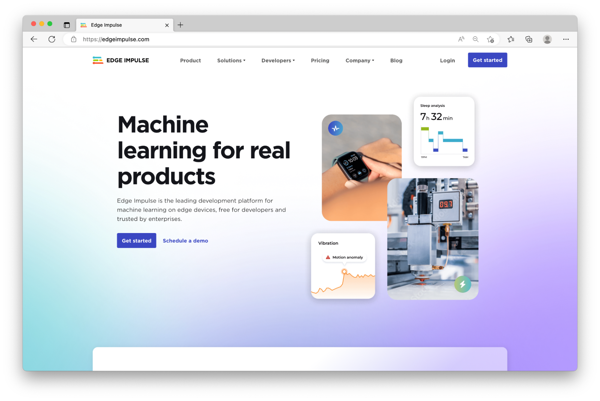

Click on the "Create New Project" button, provide a name for the project, and choose between Developer or Enterprise project type:  we'll use Developer (which is free) in this tutorial.

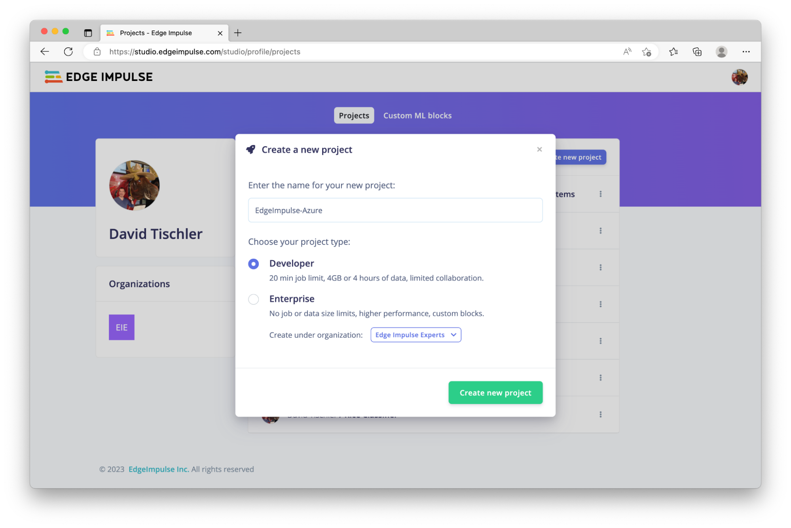

Once the project has been created, we can choose from some quick settings to guide us to an Object Detection project.

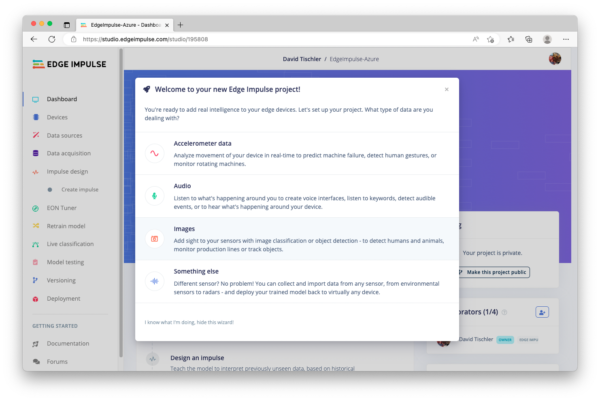

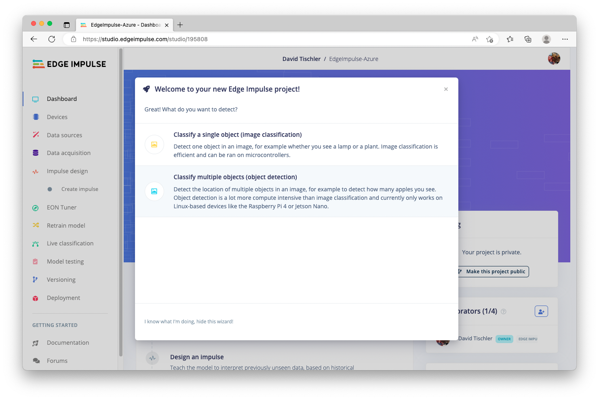

After you make your selections and the pop-up modal is dismissed, click on "Keys" near the top, and make note of your API Key, it will be used later when building the Docker container.  For now you can either copy/paste it over to a notepad, or, just return here later in the tutorial to retrieve it.

Once complete, we can begin the process of getting our hardware up and running, and connected to Azure IoT Edge.  For simplicity, we'll use a pair of Raspberry Pi 4B's in this demo, but any Linux-capable device will work.  The Raspberry Pi will work as a proof-of-concept, but more enterprise-grade hardware should likely be used for real-world deployments.  Vendors such as Advantech, Aaeon, Toradex, OnLogic, ADLink and others produce hardware options that are purpose-built for edge AI scenarios.

## Raspberry Pi Setup

Proceeding on with using a Raspberry Pi for this tutorial, the standard installation and setup procedure for a Raspberry Pi can be followed, as documented here:  [https://projects.raspberrypi.org/en/projects/raspberry-pi-setting-up](https://projects.raspberrypi.org/en/projects/raspberry-pi-setting-up).  Ultimately this consists of downloading Raspberry Pi OS 64-bit, flashing the downloaded image to an SD Card, inserting it into the Pi, and powering it on.  Upon boot, you will choose a language, provide a username, connect to WiFi, and can choose to run any updates.  Also make sure your USB Webcam is attached.  Once completed, you'll arrive at the desktop and it will be time to move on to the Azure IoT Edge installation steps.

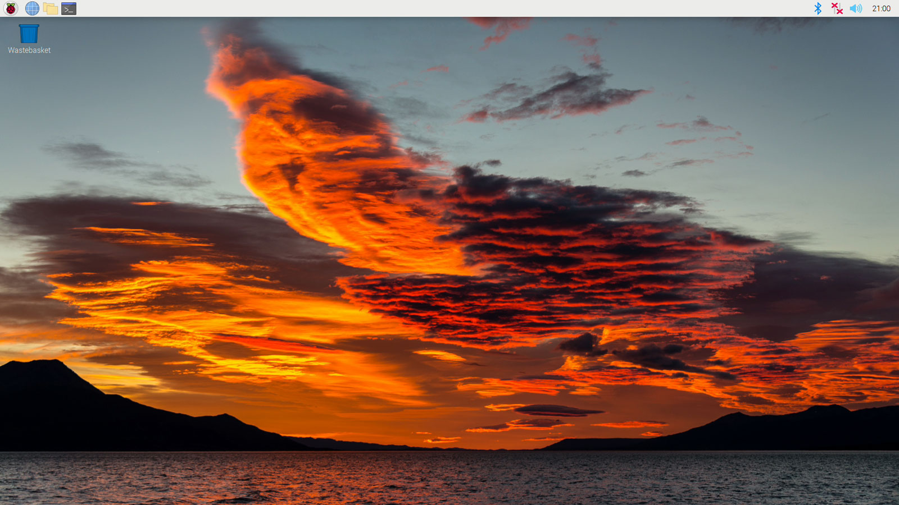

## Azure IoT Edge

Next we will connect the Raspberry Pi to Azure IoT Edge, so that we can remotely deploy software to the Pi, no matter where it is located.  The Azure IoT platform has many more capabilities and features as well, such as remote monitoring, digital twins, integrations with other Azure services, and more.  You can read about the rest of the platform on their website, at [https://azure.microsoft.com/en-us/products/iot-edge](https://azure.microsoft.com/en-us/products/iot-edge).  For deploying applications to a device, the Azure IoT Edge tooling installs a Docker-compatible container runtime on the target device (the Raspberry Pi in this case), and then orchestration and decisions about what containers are sent to the device are performed either via the Azure CLI, VSCode, or directly from the Azure Portal GUI.

Setup begins by heading to [https://portal.azure.com/](https://portal.azure.com/), and creating an Azure account if you don't already have one, or logging in to an existing account.  You can follow [Azure's official documentation for any setup steps](https://learn.microsoft.com/en-us/azure/) or other account requirements.  Once logged in, you will arrive at the main portal.

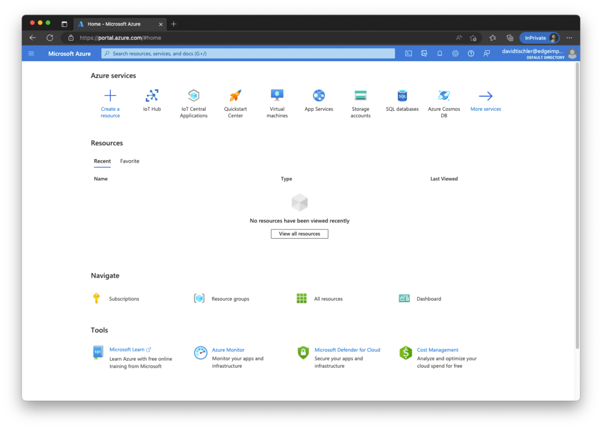

Click on "Create a resource", and then in the left navigation click on "Internet of Things".  This will load the IoT products in the Azure ecosystem, and "IoT Hub" should then be the first option.  Click on "Create" to setup an IoT Hub Resource.

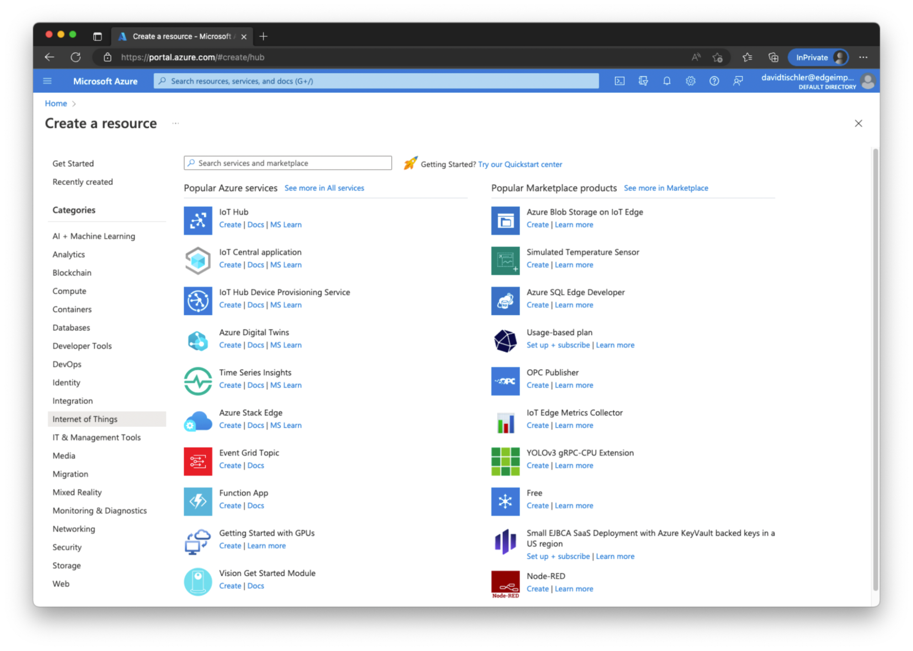

You'll provide a name, choose a Region, and a Tier.  We're using the Free Tier in this demonstration, so choose that from the drop-down menu and also set the Daily Message Limit to the free ($0) option.  Again, you can [refer to the Azure documentation for any other specific options](https://learn.microsoft.com/en-us/azure/) and settings as needed.  Click "Review + create" to continue, and the setup process will continue with the creation of the resource and IoT Hub.  This takes a moment to complete, but will result in your IoT Hub being built and ready to be populated.

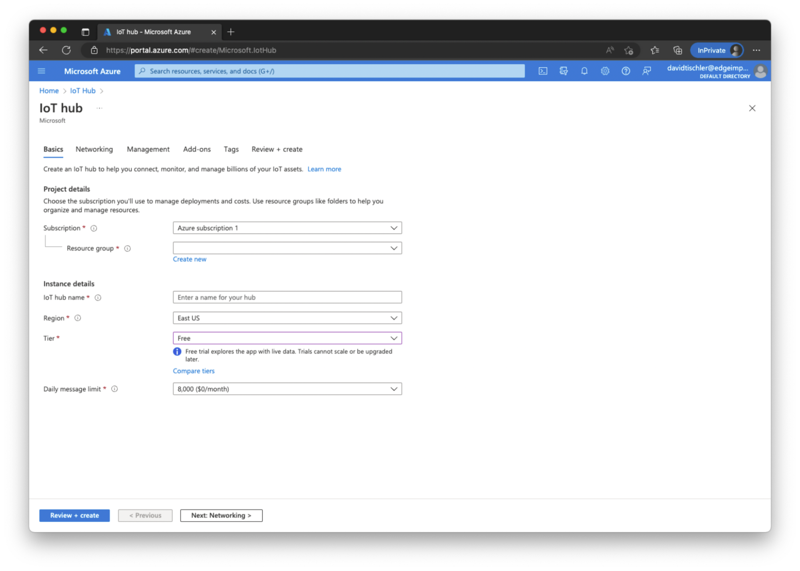

After the IoT Hub has finished being built, it is time to add Devices.  This will let Azure know that a device exists, and should be onboarded and managed. This can actually be done in bulk for scale-out deployments, though we will only add two devices at the moment, so we will use the GUI.  On the left navigation, click on "Devices" (you might have to first refresh the page or navigate again to the IoT Hub, once the Resource finishes being created in the previous step).

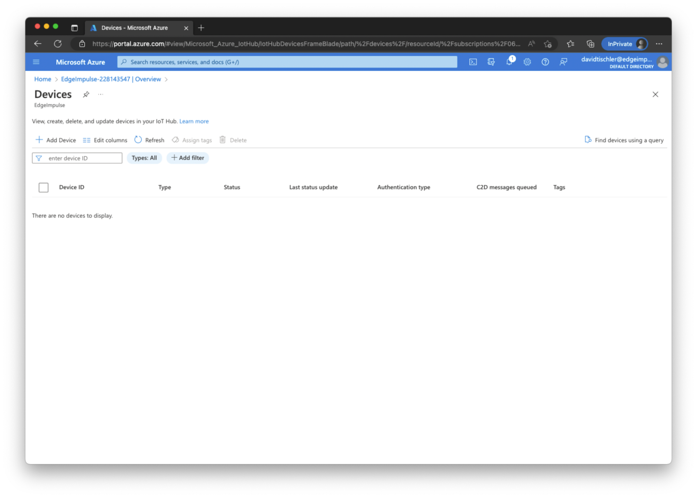

Click on "Add Device", and you will be asked to provide a name ("Device ID"), and be sure to check the box below that labeled "IoT Edge Device" which will let Azure know this is an edge device running Linux, ready for containers (known as Modules in the Azure terminology).  For this demonstration, "Symmetric key" is fine for authentication, but real production systems should use certificates for increased security.  See Azure's documentation for information on provisioning keys and certificates.  Click "Save" and the device will be created in the IoT Hub portal.  You can repeat the process, to add additional devices.

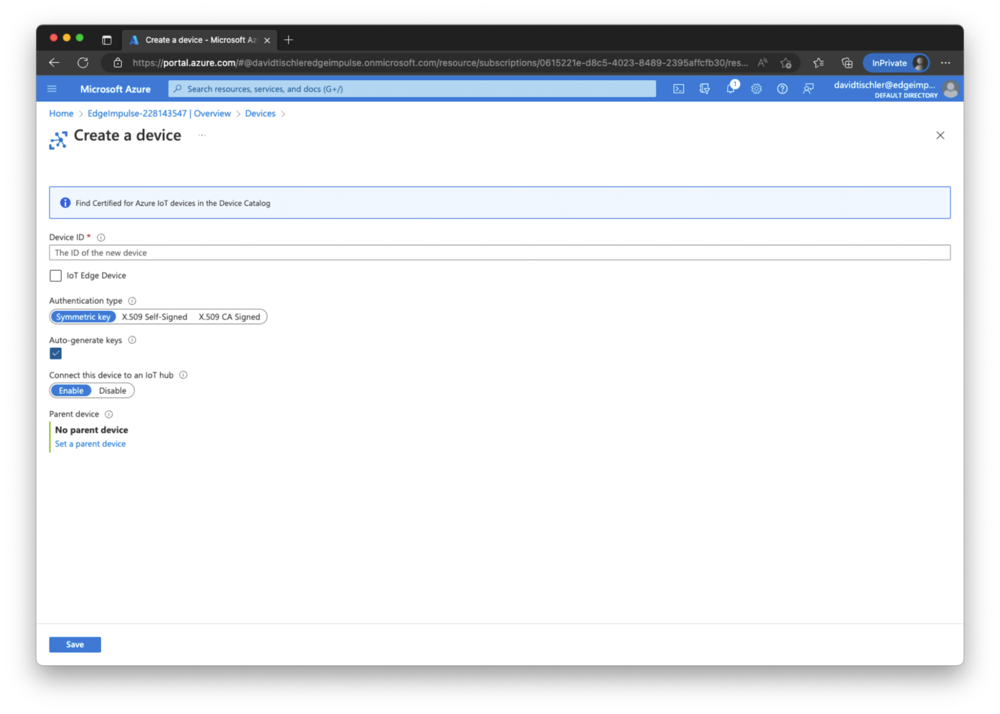

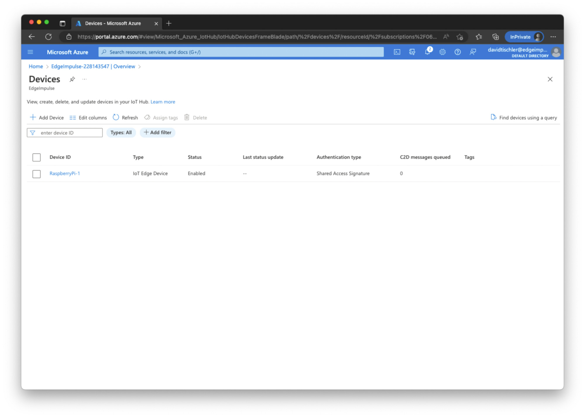 

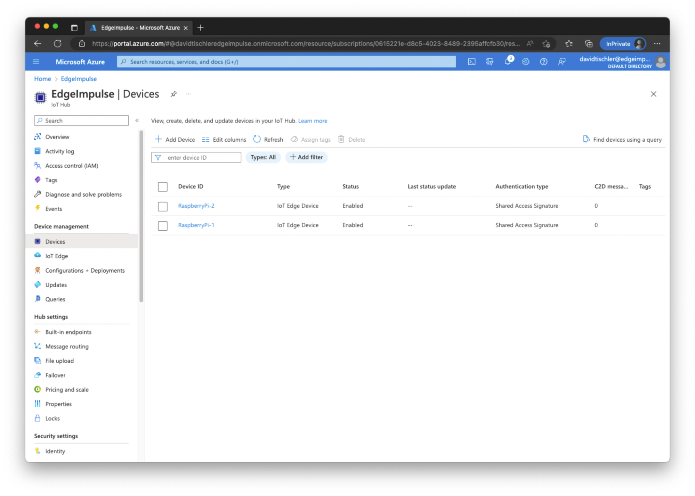

After the devices have been added, click on one of them to reveal some detailed information that Azure has generated.  Because we used Symmetric Keys, Azure has created some random strings for us to use to then link the Raspberry Pi to Azure, so that it can be managed and workloads pushed to the device.  Of interest is the "Primary connection string", which will be needed in a moment on the Raspberry Pi.

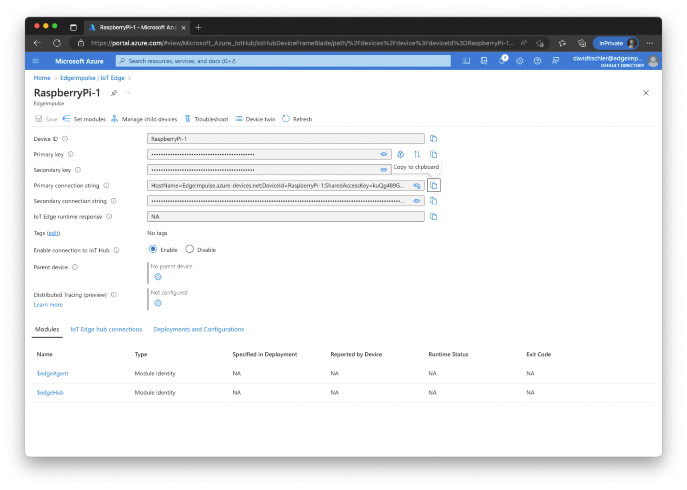 

Back on the Raspberry Pi, we can now install the Azure IoT Edge tooling.  For ease of use and copy/paste ability, SSH is helpful, though you could type these commands locally on the Raspberry Pi if you have a monitor, keyboard, and mouse connected and you'll end up with the same result.

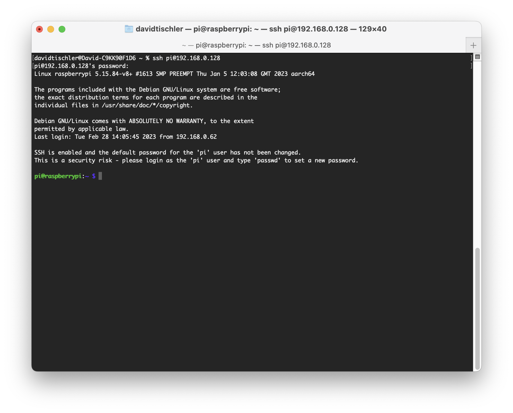

These next steps all come [directly from the Azure Documentation](https://learn.microsoft.com/en-us/azure/iot-edge/how-to-provision-single-device-linux-symmetric?view=iotedge-1.4&tabs=azure-portal%2Cubuntu), so refer to their official docs if you receive any errors.  This tutorial uses a Raspberry Pi, which is based upon Debian Linux, so the Debian steps are used.  Options exist for Ubuntu, RedHat, and Windows devices as well.  First, grab the repository setup file and install it:

```

curl https://packages.microsoft.com/config/debian/11/packages-microsoft-prod.deb > ./packages-microsoft-prod.deb

sudo apt install ./packages-microsoft-prod.deb

```

Next, install Moby, which is a container runtime:

```

sudo apt-get update; \

  sudo apt-get install moby-engine

```

Then run the IoT Edge installation script:

```

sudo apt-get update; \

  sudo apt-get install aziot-edge defender-iot-micro-agent-edge

```

At the end of the installation, the IoT Edge package will alert you that the next step is to provide your connection string, which we generated a moment ago in the Azure Portal when adding the Device.

```

sudo iotedge config mp –connection-string ‘HostName=EdgeImpulse.azure-devices.net;DeviceId=RaspberryPi-1;SharedAccessKey=abc123def456xxxxxxxxxx'

```

Simply fill in your connection string in place of that sample, placed between the single quotes, that comes from the Portal.

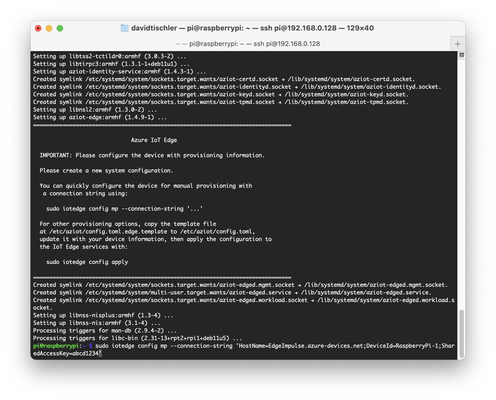

Lastly, apply this change and save it with:

```

sudo iotedge config apply

```

The Raspberry Pi, or whichever type of device you chose to use, is now fully setup and linked to Azure IoT Edge.  If you refresh the Azure Portal, you should see the device is now connected, though no Modules (workload) exists on the device yet.

## Step 1 - Initial Data Collection

The first step in our MLOps loop is going to be data collection and building a high quality dataset to train our model with.  Now that Edge Impulse, Azure IoT Edge, and the hardware are setup, we can begin the process and enter this feedback loop.

The Edge Impulse project that we created earlier is still empty, but is ready to accept data.  There are lots of ways to connect devices to Edge Impulse, and many ways to capture data.  Some of the very easiest methods involve connecting supported devices directly to your computer via USB, and capturing data directly inside the Studio.  Smartphones are another great way to easily upload pictures for image classification and object detection computer vision projects.  You can [refer to the Edge Impulse documentation](https://docs.edgeimpulse.com/) for more information.  In this tutorial we'll take a less direct approach, but with the benefit of bulk deployment at scale and pushing new models over-the-air later, thanks to Azure.

On your development machine, you will need to install Docker.  The official documentation is located at [https://docs.docker.com/engine/install/](https://docs.docker.com/engine/install/), so follow their guidance to reach a point that Docker is up and running on your machine.  You should be able to do a `docker run hello-world` and get confirmation that everything is working, then you're ready to proceed.

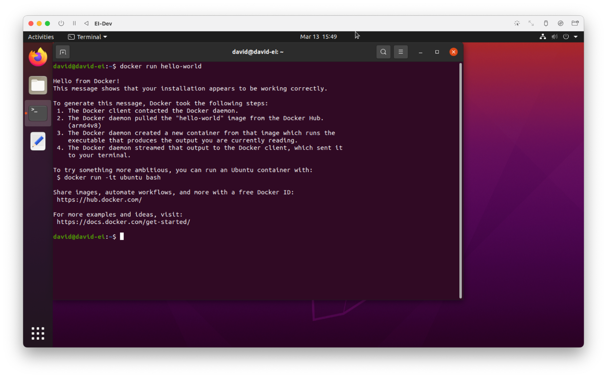

Next, we will write a Dockerfile.  If you are new to Docker, you'll want to read and learn about how to craft containers, the Dockerfile syntax, best practices, and more.  That type of info can all be found in their Docs, and there are many other great resources online for learning Docker as well.  When you are ready, make a new directory, create a new file, and copy in this code:

```

FROM arm64v8/ubuntu:22.04

RUN apt update && apt-get install -y python3 v4l-utils curl sudo libcamera-dev

# Edge Impulse Linux

RUN curl -sL https://deb.nodesource.com/setup_14.x | sudo bash -

ENV DEBIAN_FRONTEND noninteractive

RUN apt update && apt-get install -y gcc g++ make build-essential nodejs sox \

    gstreamer1.0-tools gstreamer1.0-plugins-good gstreamer1.0-plugins-base gstreamer1.0-plugins-base-apps

RUN npm config set user root && sudo npm install edge-impulse-linux -g --unsafe-perm    

# Edge Impulse SDK (optional)

RUN apt update && apt-get install -y libatlas-base-dev libportaudio2 libportaudiocpp0 portaudio19-dev \

    python3-pyaudio python3-psutil python3-pip ffmpeg libsm6 libxext6 udev usbutils pulseaudio

# (See https://exerror.com/importerror-libgl-so-1-cannot-open-shared-object-file-no-such-file-or-directory/)  

RUN pip3 install edge_impulse_linux -i https://pypi.python.org/simple

RUN pip3 install six

WORKDIR /usr/src/app

COPY start.sh ./

RUN chmod +x start.sh

ENV UDEV=1

EXPOSE 4912

CMD ["sh","./start.sh"]

```

This is our Dockerfile, and it will install some basic utilities for the Linux container we're building, then install NodeJS, install the Edge Impulse tooling, open up a port, and run a small script we'll create in the next step, called `start.sh`.  This Docker file can be saved, call it literally  `dockerfile` when you save it, and we'll move on to creating the `start.sh` script.

Again make a new file, and copy / paste in this code:

```

#!/bin/sh

/lib/systemd/systemd-udevd --daemon

sleep 5

udevadm trigger

sleep 5

edge-impulse-linux --api-key ei_1234567890abcdefghijkl --disable-microphone

```

This is where we need our API Key that we made note of near the beginning of the tutorial.  You can easily retrieve it by simply clicking on "Dashboard", then on "Keys" in the Edge Impulse Studio, and it's displayed for you.  Copy / paste the key, and place your key into the last line of the script where the sample one is currently.  We need to also make a note here, that this key should be kept secure, and here in this tutorial we are placing it directly into the `start.sh` file, and are going to place it into the Docker Hub in a Public repository.  This is not secure, nor a best practice.  However, if you use a Private repository, that would be fine.  Or, even better, is to use a variable here and then provide that variable as an input to the Docker container creation, over in Azure.  That methodology has the added advantage of quickly being able to switch among Edge Impulse projects simply by altering the variable.  However, for demonstration purposes, we'll leave this key in the `start.sh` script, and proceed.

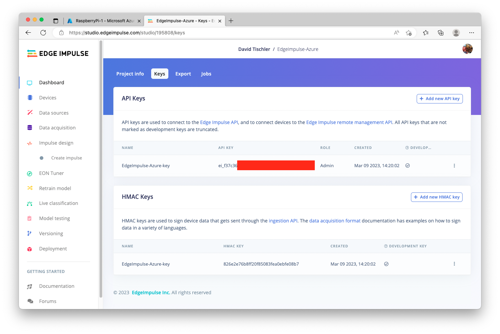

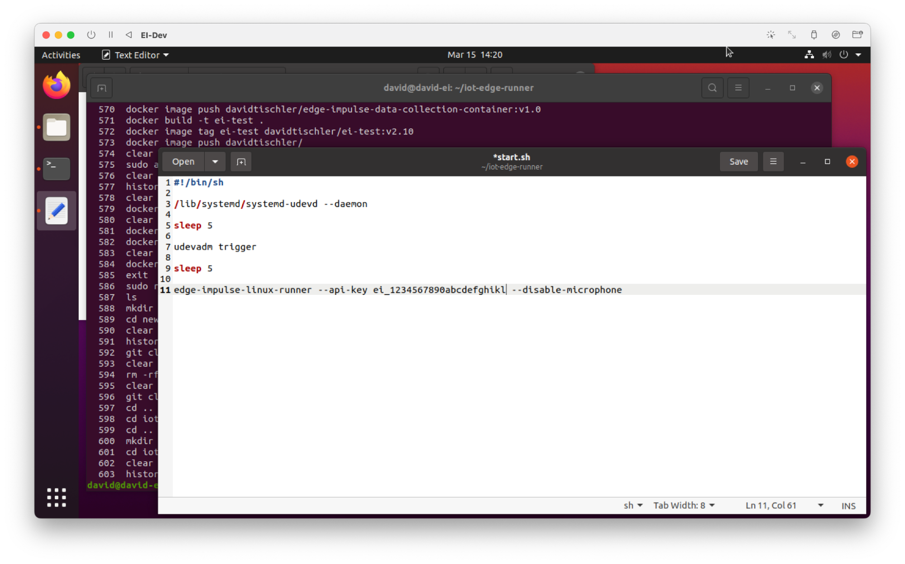

Save the file, calling it `start.sh`.  With our Dockerfile and the startup script, this container will connect to the Edge Impulse Studio as a camera device, so that we can begin taking pictures of apples, or for more enterprise deployments, collect data from the field.  The goal at this point is still go collect data and build a high-quality dataset, and this container will start us on that path.  We're now ready to build the container, and then place it somewhere that Azure can reach it.

### Docker Hub

Depending on your experience with Docker, or as you may have seen while reading their documentation, containers get built and placed into container registries.  You can host a container registry yourself, and store all of your containers on a private server, or even your own local desktop or laptop.  However, many developers choose to use existing container registries like [Docker Hub](https://hub.docker.com/), or the [Azure Container Registry](https://azure.microsoft.com/en-us/products/container-registry).

We'll choose Docker Hub here, as it's a popular platform that's easy to use.  If you don't already have an account at [https://hub.docker.com/](https://hub.docker.com/), create one (again, a Free account works perfectly fine for this tutorial), log in, and click on your username at the top-right to view the drop-down menu.  Click on Account Settings, then click on Security on the left, and then click the "New Access Token" button.  This will be used to login to Docker Hub from the command line on your development machine.

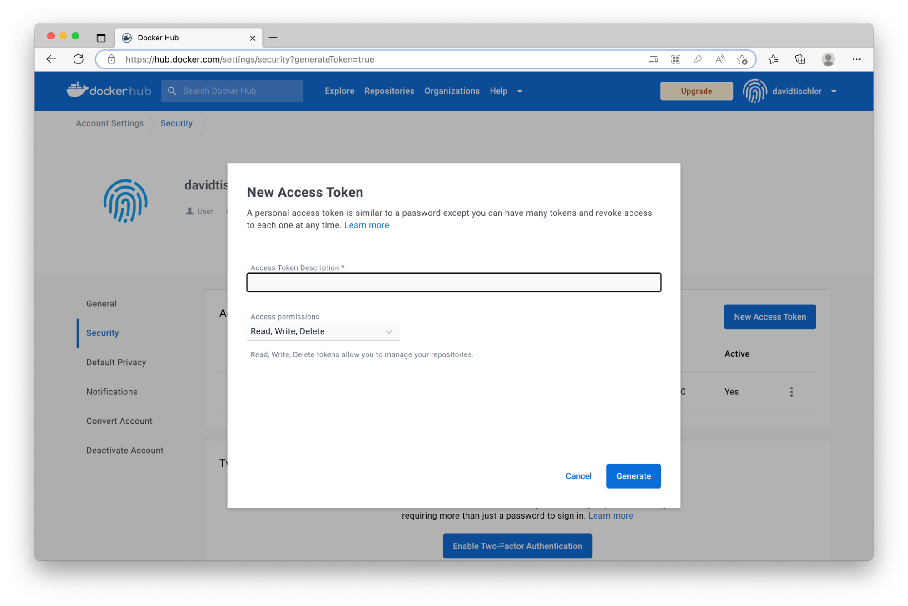

In the New Access Token window, provide a name and click "Generate".  You will receive a randomly-generated password, that is only shown once.  Let's use this to login immediately, then.

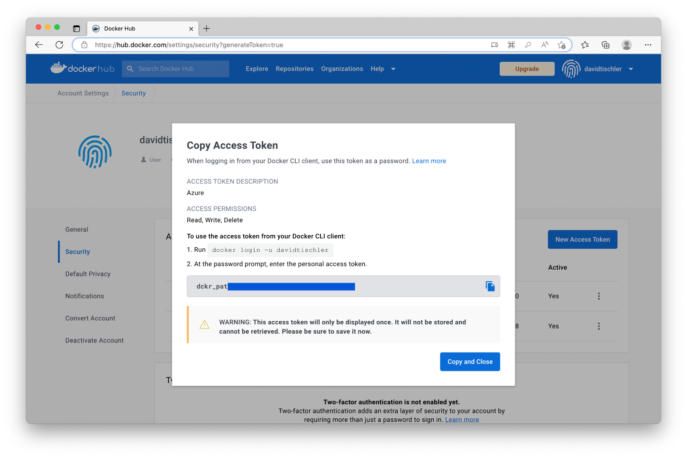

In a terminal, type:

```

docker login -u YourUsernameThatYouCreated

```

You will be prompted for a password, use the one shown in the New Access Token window.  Once logged in, you are ready to build and upload your containers.

Start by first building your container.  Be sure to make note of the trailing dot on the end of the line, indicating the current directory.  The first build might take a while, but subsequent builds go quicker as layers get cached:

```

docker build -t edge-impulse-data-collection-container .

```

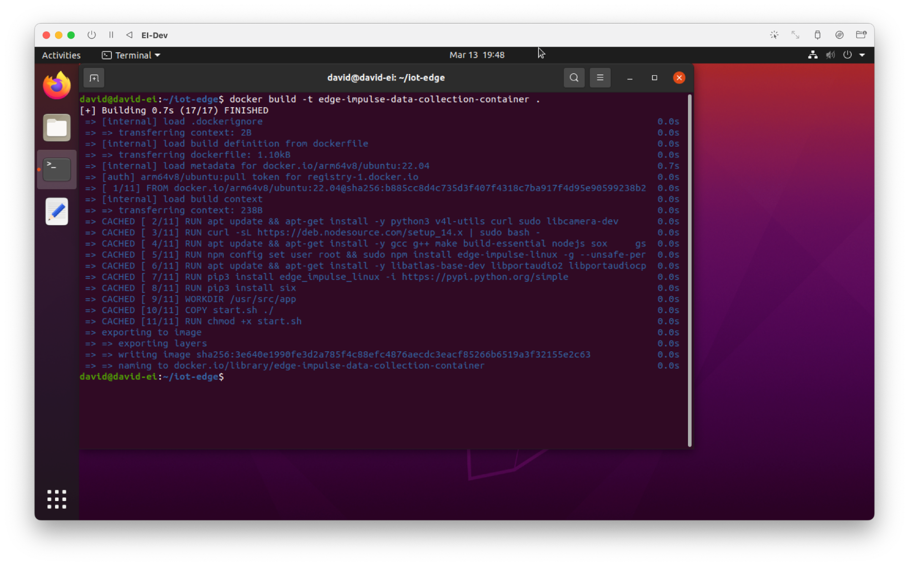

Next, tag the image with:

```

docker image tag edge-impulse-data-collection-container YourUsernameThatYouCreated/edge-impulse-data-collection-container:v1.0

```

And finally it can be uploaded, by running:

```

docker image push YourUsernameThatYouCreated/edge-impulse-data-collection-container:v1.0

```

Similarly, the first upload could take a while, but later uploads are quicker as layers are cached.

Refreshing the Docker Hub, you will see the new container repository that was just created, and you can click on it to see some details about it:

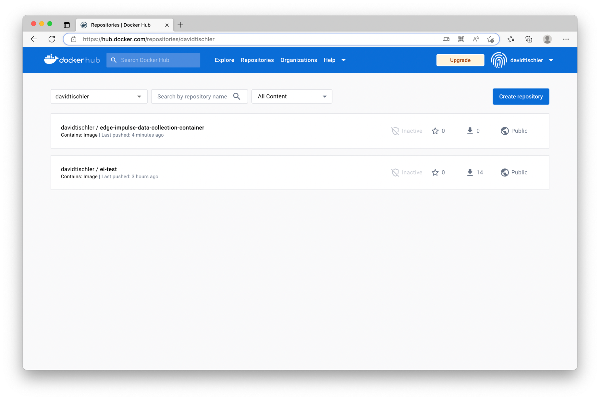

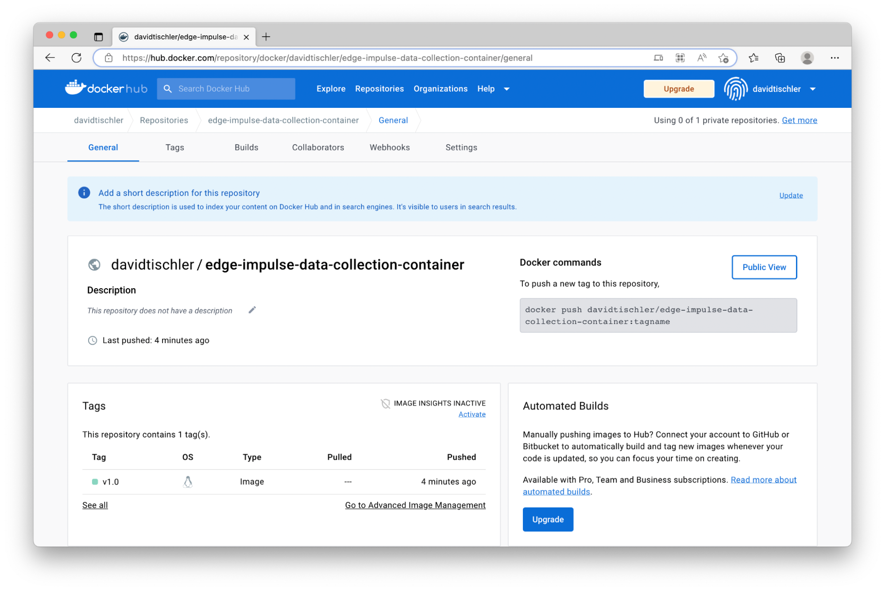

The Container is hosted and ready for deployment at this point.  To push it to the Raspberry Pi, it is time to return to the Azure Portal.

### Azure IoT Edge Modules

Azure IoT Edge uses the term "Modules" to refer to the containers and services that are orchestrated and run on devices.  Modules can be pushed over-the-air to one device, or many devices, and there are very detailed methods for controlling the creation and running of services.  We will keep things rather simple in this tutorial, but [refer to the documentation for extremely granular deployment options](https://learn.microsoft.com/en-us/azure/iot-edge/?view=iotedge-1.4) and advanced capabilities of Azure IoT Edge.

In the Azure Portal, click once again on Devices, then click on the name of one of your devices.  We'll start off deploying to only one of the Raspberry Pi's, to ensure everything is working.  Click on "Set Modules" near the top:

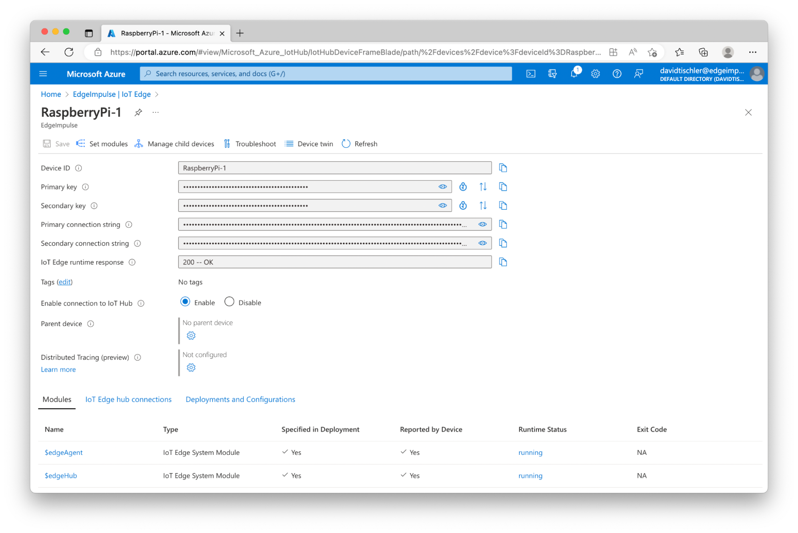

Then, near the middle of the page, click on the "+ Add" drop down menu, and choose "IoT Edge Module":

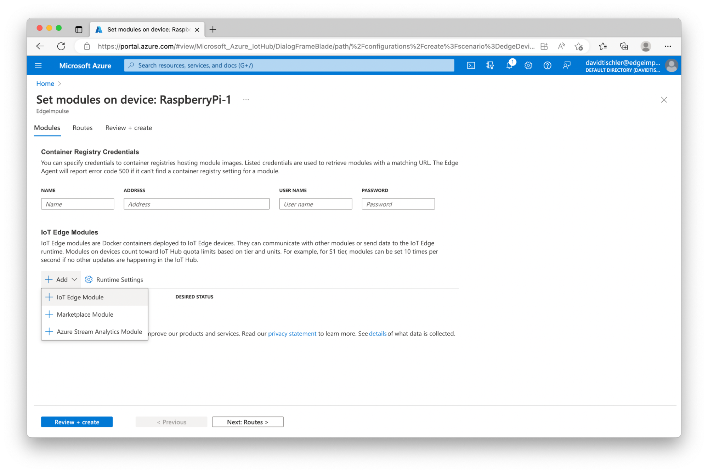

This is where we will instruct Azure to look for the container we pushed to Docker Hub, and we'll add a few extra instructions to open up a port, set the container to "Privileged" so that it can access the USB Webcam (the are more secure methods to expose *only* specified pieces of hardware from the host system, so be sure to read the Docker documentation on the topic for enterprise deployments), and give it a friendly name to identify the service.  Make note that the URL to enter into the "Image URI" field is slightly different:  `docker.io` is used here, as opposed to `hub.docker.com`.  Thus, you will use `docker.io/YourUsernameThatYouCreated/edge-impulse-data-collection-container:v1.0`:

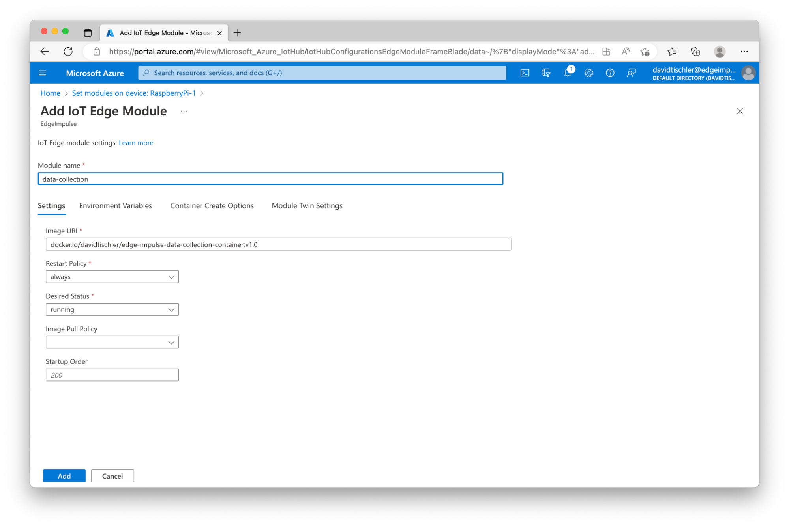

Next click on "Container Create Options", in the middle of the page, and copy / paste in this JSON to add the features we need:

```

{

    "Env": [

        "UDEV=1"

    ],

    "HostConfig": {

        "Privileged": true,

        "PortBindings": {

            "4912/tcp": [

                {

                    "HostPort": "4912"

                }

            ],

            "4912/udp": [

                {

                    "HostPort": "4912"

                }

            ]

        }

    }

}

```

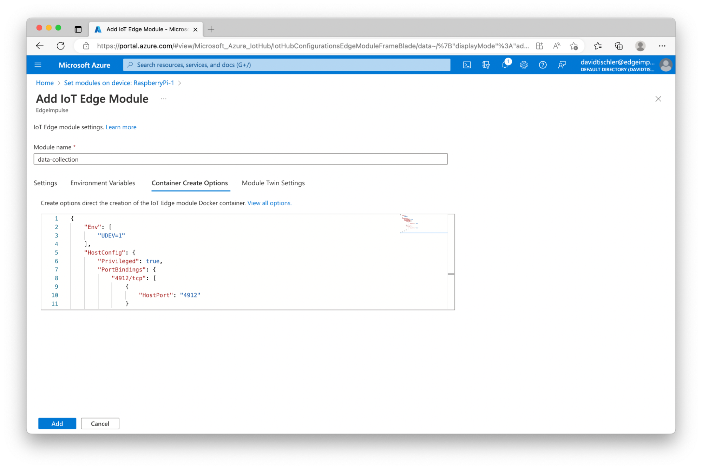

Finally, click "Add", then back on the Set Modules page click "Review + Create".  You will be presented with a summary of the deployment, and you can click "Create" to start our container deployment.  After a moment, you can refresh the Device Details page, and see that the Module is now "Running".  (The first container download may take a few minutes, later downloads are quicker again due to layer caching).

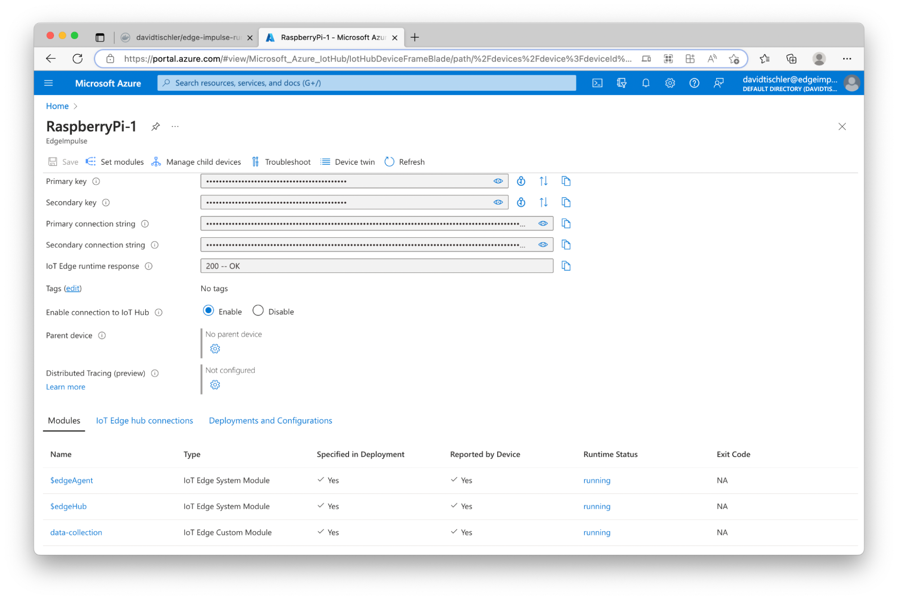

The dashboard says that the Module is "running", so, we should have our data pipeline created and we should be able to start collecting data over-the-air from the Raspberry Pi.  Data in this project consists of images of apples, but your data could of course be anything:  images, video, sensor data, audio, IMU, or any other information collected at the edge.


To determine if the process did indeed work, in the Edge Impulse Studio navigate to "Devices", and the Raspberry Pi should have appeared in the list:

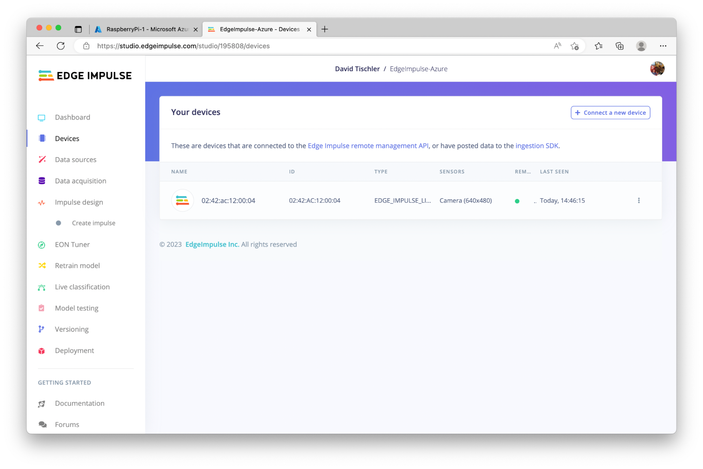

Next, click on "Data Acquisition".  You should see a preview of the camera feed, and type in a Label for the type of data that you are collecting, in this case "apple".  When you are ready, click on "Start Sampling" and the picture will be taken, and placed into your dataset.

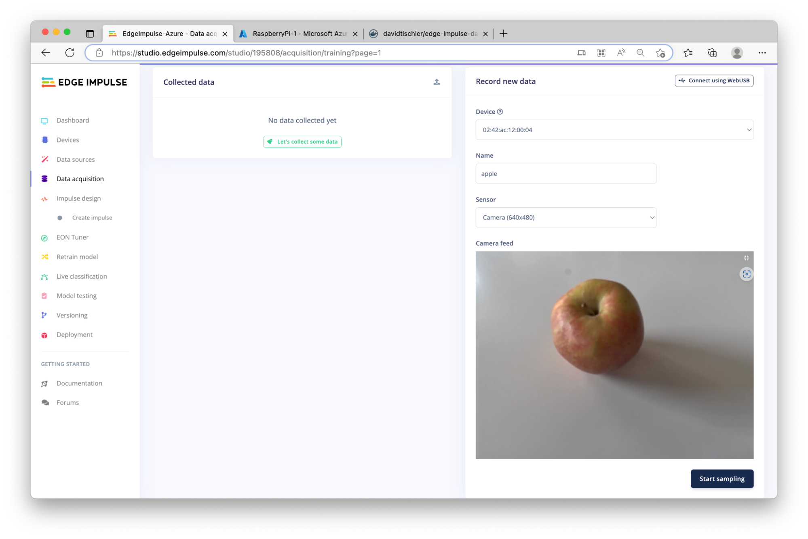

Having one picture of an apple is a nice start, but a high-quality dataset consists of hundreds, or even thousands of samples.  There should also be adequate variation in the data, for example different angles and movement of the apple, different levels of lighting, pictures that are taken closer, and some that are taken farther away.  There should also be variation in the apples, so using many different apples is helpful, as their patterns, colors, and shapes will vary.  The background should also be varied, so that the neural network doesn't start to believe that all objects in a specific setting or backdrop are an apple (or whatever object you are using).

Thus, this data collection process needs to be treated with care, and attention should be paid to the quantity and quality of the data; it will take time to build a robust dataset that produces a high-quality model.  In the field, it may be necessary to collect a few weeks worth of sensor data, depending upon the frequency of collection and variation in the data.

For this exercise, go ahead and collect approximately 100 to 150 pictures of the apple, rotating it, moving it, and changing the angle and lighting a bit if possible as well.


Once the pictures are collected, we need to "Label" the apple, and identify the location of the apple within the frame.  This information will be used later in when the neural network is created and model is built.  Click on "Labeling Queue" at the top, to begin this process.  The first image is loaded, and you can click and drag a bounding box around the apple in the image.

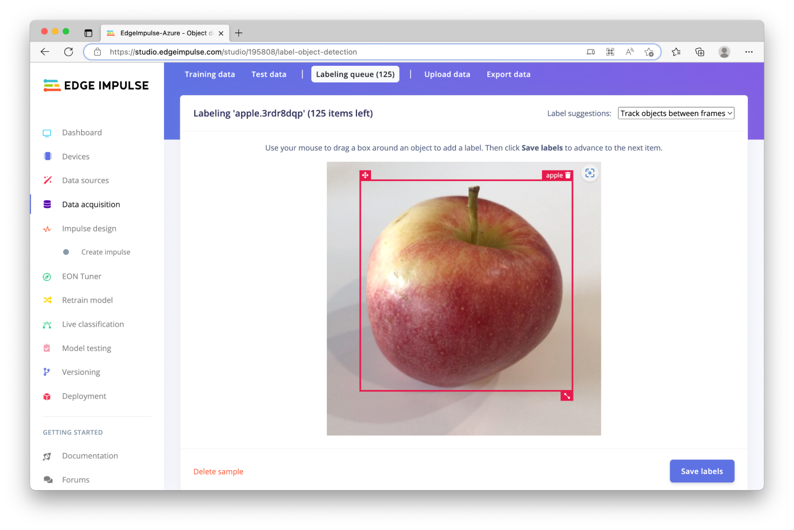

Click on "Save labels" once the box is drawn, and the next image in the dataset will automatically load, with the bounding box retained.  You can move the box a bit if you need to, and then click "Save labels" once again.  Repeat this until all of the pictures have been labeled, it will go quickly with the help of the bounding box following the apple from image to image.

When you reach the end of the Labeling Queue, and all of the pictures have a bounding box, click on "Impulse Design" on the left menu, to begin constructing a neural network.

On the "Impulse Design" page, the first item is already pre-populated, "Image Data".  You can bump up the Input Resolution from 96 pixels x 96 pixels, and instead enter 320 x 320 pixels, which will give us better accuracy, at the cost of performance.  However, the Raspberry Pi is strong enough to still run this; it is more critical to evaluate performance versus power consumption and hardware capability when using microcontrollers, or when environmental considerations need to be accounted for (limited power, solar and battery scenarios, heat produced by the device, etc.)

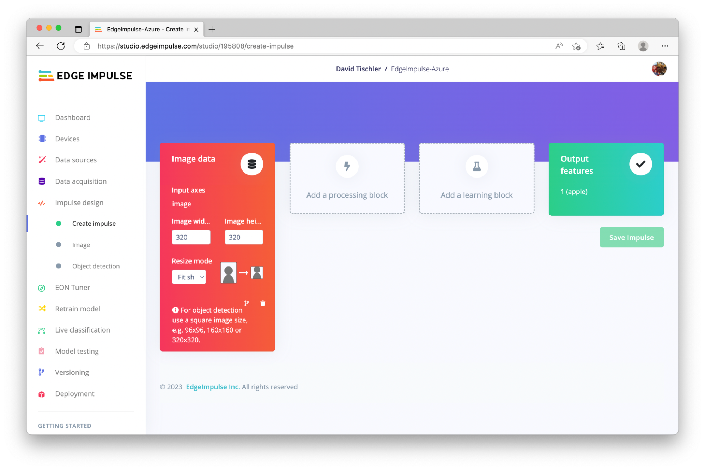

With the resolution increased to 320 pixels by 320 pixels, click on "Add a processing block".

The Studio will only offer one selection here, "Image", so go ahead and click "Add" to add it into the pipeline.  Next, in the Learning Block, click to add a Block, and then select "Object Detection (Images)".  You may see a few other options for hardware specific accelerators, and if you are using one of those you might see increased performance on that hardware, but for this Raspberry Pi the standard selection is what is needed.  In the end your pipeline will be ready, and you can click on "Save Impulse".

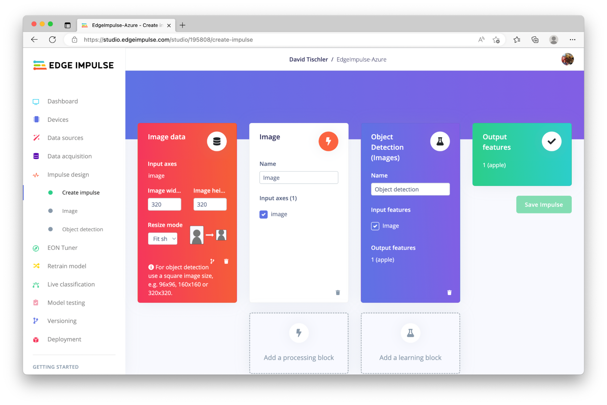

Next, on the left-hand navigation, click on "Image", to configure the Block and set a few options.  On the first panel, you can choose whether to use color (RGB) or Grayscale, again having enough computer power with the Raspberry Pi, we will choose RGB.  Click "Save parameters".

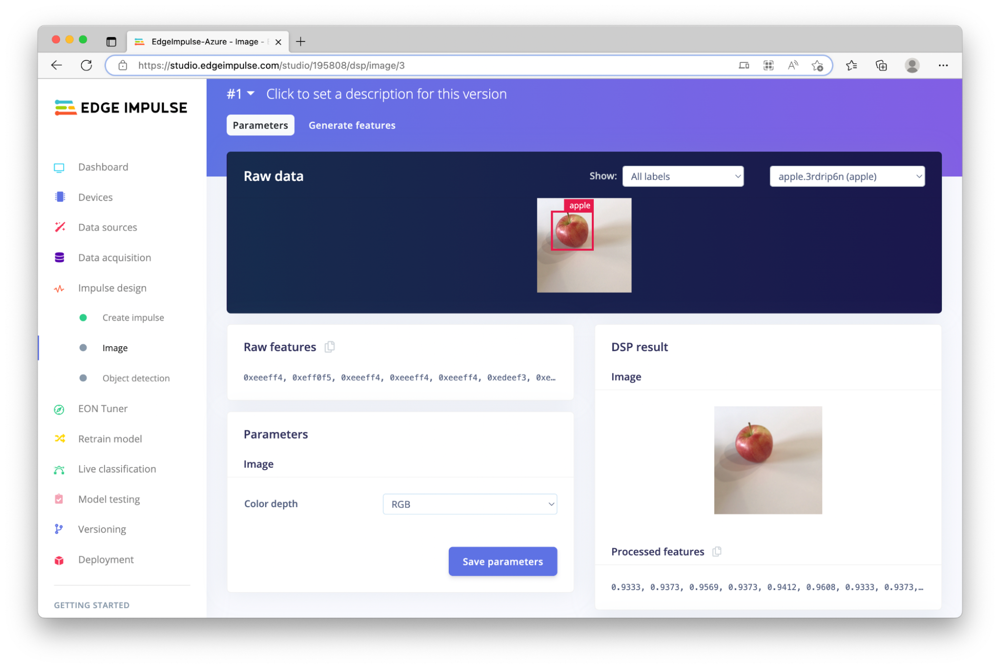

Once saved, click on "Generate features" near the top, and then click the green "Generate features" button to start the process.

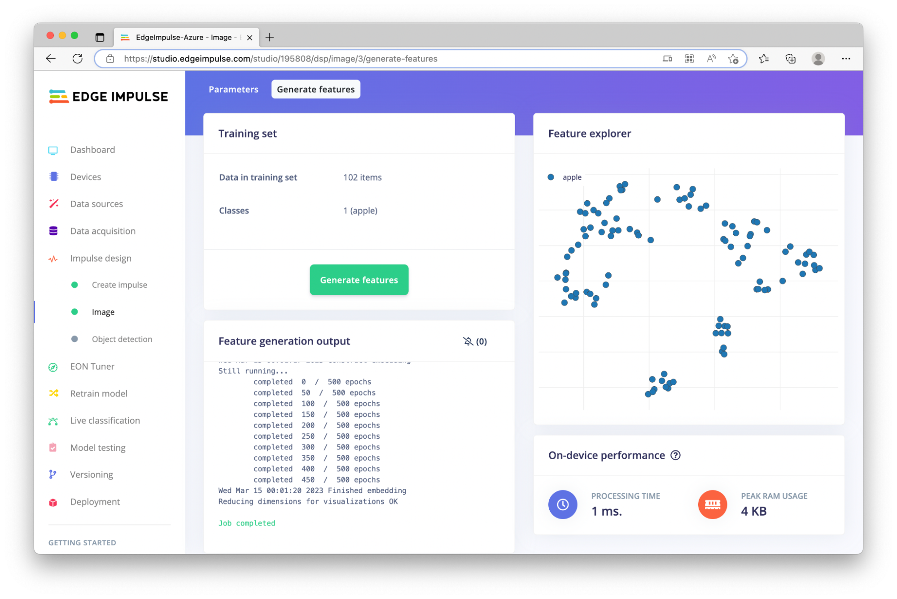

Upon completion, we'll receive a visual representation of the dataset, in this particular case there is only one class (apple), so it's not terribly interesting, though this feature is very useful to visually check for data clustering on larger and more diverse datasets.  When ready, you can click on "Object Detection" on the left, to begin the model setup and training.

On the "Object Detection" page, default values will be entered for Number of Training Cycles (epochs), Learning Rate, and Validation set size.  Leave them alone for now, but if the model accuracy is too low, we can come back and alter them to improve our model.  In the "Neural network architecture" section, FOMO is automatically selected.  However, FOMO is designed for more resource-constrained devices like MCU's, so for this demonstration we will increase to the larger MobileNetV2 SSD model.  Click on "Choose a different model" and select "MobileNetV2 SSD FPN-Lite 320x320".  Then click the "Start Training" button.

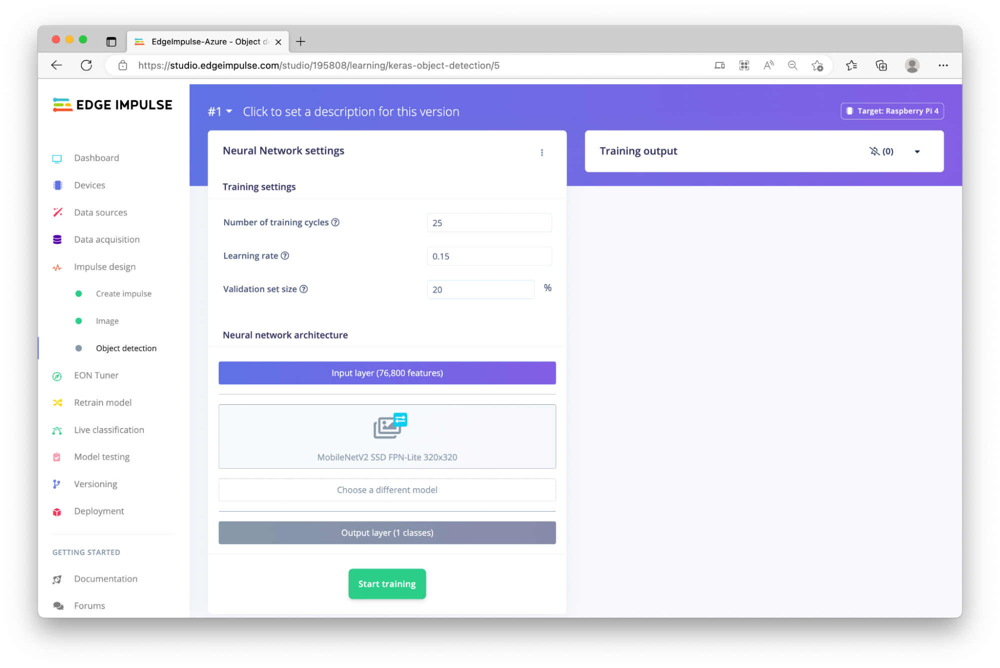

It will take a few minutes for the model to be built, but at the end of the process you should see "Job completed" and receive an F1 Score, which is an estimation of the model's accuracy.

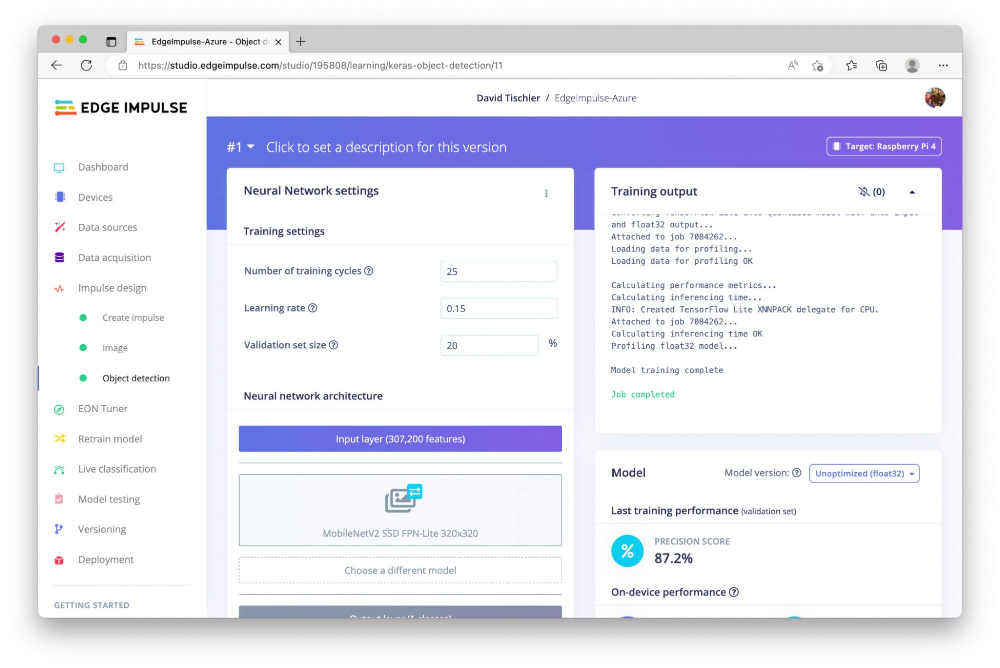

This model resulted in an 87.2% accuracy estimation, which is not too bad and definitely sufficient for this demonstration.  With all of the data collected, labeled, and a model built, the first part of the MLOps lifecycle is complete, and we can move on to the next part of the loop, deploying our model.

## Step 2 - Model Deployment

At the moment, our Raspberry Pi is setup to collect data and upload results into the Edge Impulse Studio.  So, we'll need to make a change to the workload running on the Raspberry Pi, and instead direct the device to perform local inferencing using the Edge Impulse object detection model we just built in the previous step.

The steps to make this change are quite similar to what we've already done:  We will create a Docker container, upload that container to Docker Hub, and then provision it over-the-air using Azure Iot Edge.  These steps will actually be very easy, thanks to the work we've already done.

To begin, make a new folder on your development machine, and copy / paste the existing `dockerfile` and `start.sh` files we used in the last step, into the new folder.  Open up the `start.sh` script, and make one small (but important!) change.  On the last time, change `edge-impulse-linux` to `edge-impulse-linux-runner`, like so:


Save the file, keeping in mind the same note we discussed earlier about the use of the Key directly in the `start.sh` file here.  When going to production and scaling enterprise applications, this is fine if you use a Private container repo, or even better is to replace this with a variable.  But for demonstration purposes, we'll go ahead and leave it in the script so you can see how it works.  Next, we will do a similar Docker "build", "image tag", and "image push", like we did previously.  Specifically, from within this new directory with newly updated `start.sh`, run the following commands:

```

docker build -t edge-impulse-runner-container .

docker image tag edge-impulse-runner-container davidtischler/edge-impulse-runner-container:v1.0

docker image push davidtischler/edge-impulse-runner-container:v1.0

```

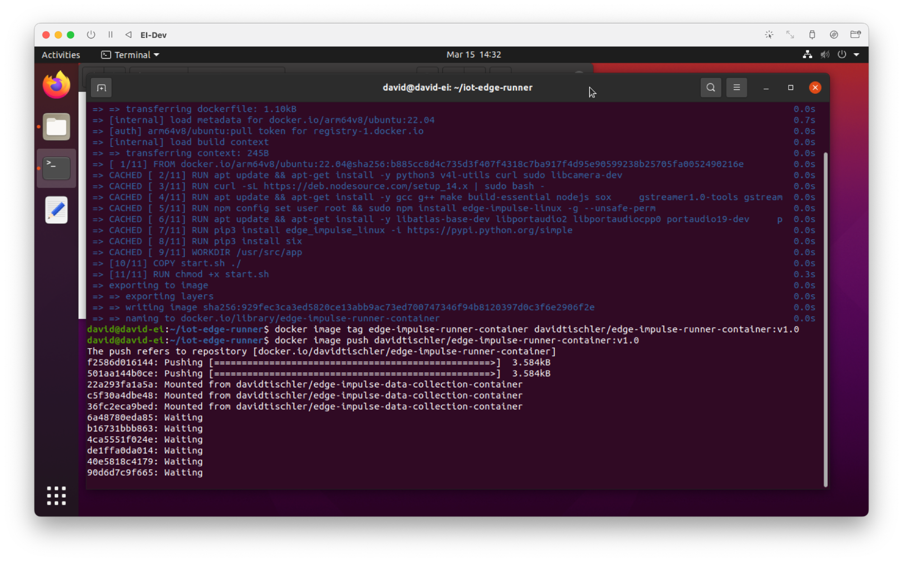

Once this completes, in Docker Hub, you will have the new container ready for use:


And then back in Azure, we can push the container to the Raspberry Pi (or any number of Raspberry Pi's or your selected device type), by heading back to the device details page and once again clicking on "Set modules", clicking the drop-down menu called "+ Add", and choosing "IoT Edge Module".

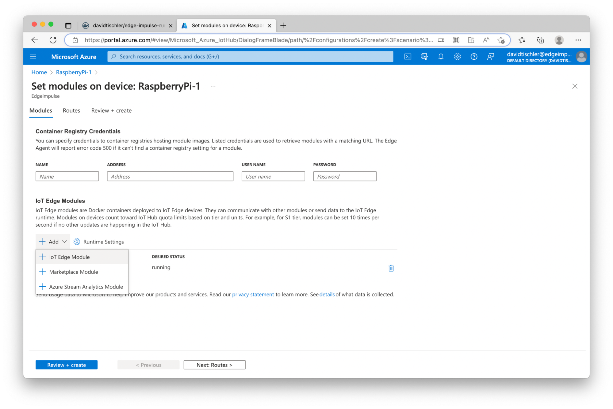 

In the container creation details, we will again use very similar settings as used during the data-collection container setup.  First, provide a Module name that identifies the container, then provide the Image URI, which will be `docker.io/YourUsernameThatYouCreated/edge-impulse-runner-container:v1.0`.  Then, click on "Container Create Options" and insert the same snippet we used earlier, which opens the port and sets the container to "Privileged" (again, recall, there are more secure ways of exposing only specific pieces of hardware, but for simplicity in this demo we'll give it this access).

```

{

    "Env": [

        "UDEV=1"

    ],

    "HostConfig": {

        "Privileged": true,

        "PortBindings": {

            "4912/tcp": [

                {

                    "HostPort": "4912"

                }

            ],

            "4912/udp": [

                {

                    "HostPort": "4912"

                }

            ]

        }

    }

}

```

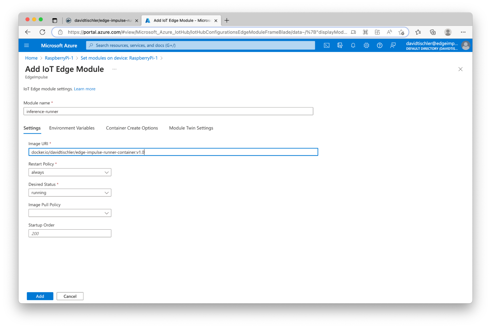

Click the "Add" button at the bottom of the page,, to return to the "Set modules" page.  You'll notice that both the "data-collection" and "inference-runner" containers are displayed, but we no longer need the "data-collection" container and intend to replace it.  To the right, you can click the "trash can" icon, to remove the "data-collection" container from our deployment.


Finally, click "Review + Create", then confirm the details by clicking "Create".  Within a few minutes, Azure will instruct the device to delete the existing container, and will download the new workload from Docker Hub.  This could also take a few minutes, but then refresh the device details page and you will see the new Module has replaced the previous Module:


With this new service running, our inferencing should be occurring.  Check to see if this is the case by going to the IP address or hostname of the Raspberry Pi (assuming you are on the same network, or a fully qualified domain name if your device is remote), followed by port 4912.  In this example, the device is on the same network, so http://192.168.0.128:4912 is the URL to use.

Sure enough, our object detection model is running, and we are detecting apples with about 95 to 97 percent accuracy!

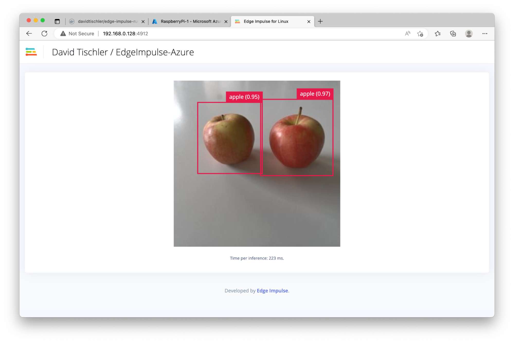

This completes the first iteration of the loop, and we've now fully demonstrated a data collection, model creation, and model deployment pipeline or pass through an MLOps loop.

However, running this model indefinitely is not feasible, as data can continue to be collected, and environmental conditions might change.  This is why the ability to update devices and add improved models, added features, or new capabilities is critical.  To demonstrate the need to adapt, let's now imagine some new, previously unseen data has been identified: a banana.

## Step 3 - Model Retraining, and Redeployment

Introducing a banana exposes a flaw of our existing model.  It thinks nearly **anything** placed in front of the camera, is an apple.

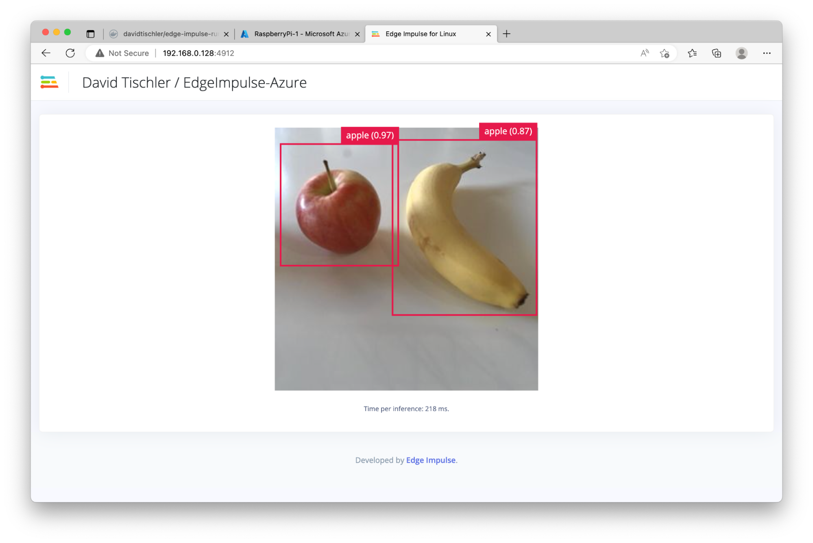

Thus, we need to provide more and varied data to build a stronger neural network, and ultimately a better model.  With Edge Impulse, Azure IoT Edge, and Docker, you simply pass through your MLOps loop again to mitigate this issue.  We'll collect new data (and label it), build a new model, and push it once again over-the-air to the device, increasing the intelligence and adding the ability to identify and locate the new object, a banana in this case.

First, we can revert our running inference container to our "data-collection" container, to place our device back into a state where it collects images and uploads them to the Edge Impulse Studio.  In Azure, click on the device, click on "Set Modules", click on the drop-down menu called "+ Add", and choose "IoT Edge Module", and then on the "Add module" page enter the same URI used in Step 1: `docker.io/YourUsernameThatYouCreated/edge-impulse-data-collection-container:v1.0`.  Also as usual, click on "Container Create Options" and of course enter the same JSON snippet to open ports and set Privileged:

```

{

    "Env": [

        "UDEV=1"

    ],

    "HostConfig": {

        "Privileged": true,

        "PortBindings": {

            "4912/tcp": [

                {

                    "HostPort": "4912"

                }

            ],

            "4912/udp": [

                {

                    "HostPort": "4912"

                }

            ]

        }

    }

}

```

Click the "Add" button at the bottom, then back on the "Set modules" page click the trash can icon next to the "inference-runner" container, to remove that one from the deployment.  Click "Review + Create", and confirm the choices with the "Create" button.  As usual, give it a few minutes for the device to update.


This should once again give us access to the device inside of the Edge Impulse Studio, for image acquisition.  Head back to the Studio, click on Data Acquisition, and sure enough you can see the camera feed.  Click "Start Sampling" to take pictures of the banana, preferably in varying positions, with varying lighting, and zooming in and out to get closer and further.  Like before, a high-quality dataset, leads to a high-quality model.

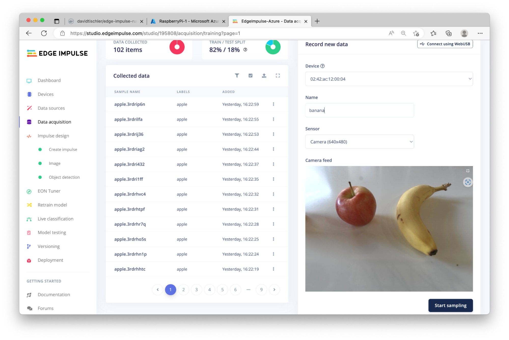

Once you have enough images collected, click on Labeling Queue at the top, and again draw bounding boxes around the items of interest, and then click "Save labels", like so:

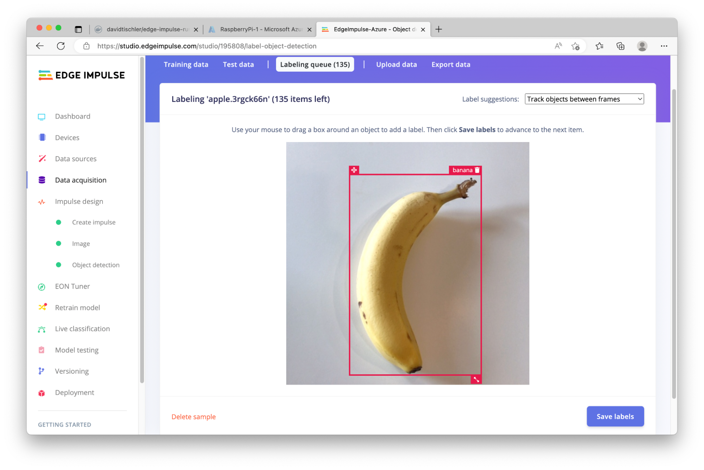

Repeat the process for all the images, like last time the bounding box will attempt to follow the object that you are labeling, so it should move along quickly.  Once finished and there are no more images in the queue,, click on "Create Impulse" on the left.

When the Impulse page loads, you will notice that the right-hand column now reflects two classes, "apple" and "banana", as opposed to only apple previously.

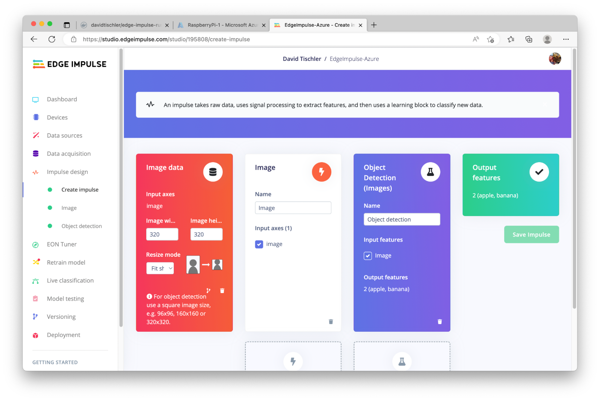

Click on "Image" on the left, to load the details of the Image Processing block.  There is no real difference here, once again we will use RGB, so you can click the "Save Parameters" button and then click on the "Generate Features" button on the next page.


When this is done, you can proceed to building the model, by clicking on "Object detection" on the left-hand navigation.  The settings here will be the same as what was used on the last training run, and if the defaults worked well for you the first time around, there is no need to change them.  Be sure that "MobileNetV2 SSD FPN-Lite 320x320" is  still selected for the "Neural network architecture", and click on "Start Training".  Like before, this will take some time to complete, and you may need to increase the number of epochs, or alter the settings a bit to improve accuracy if your model is not working well.  These are all documented in the Edge Impulse docs at [https://docs.edgeimpulse.com/docs/](https://docs.edgeimpulse.com/docs/).

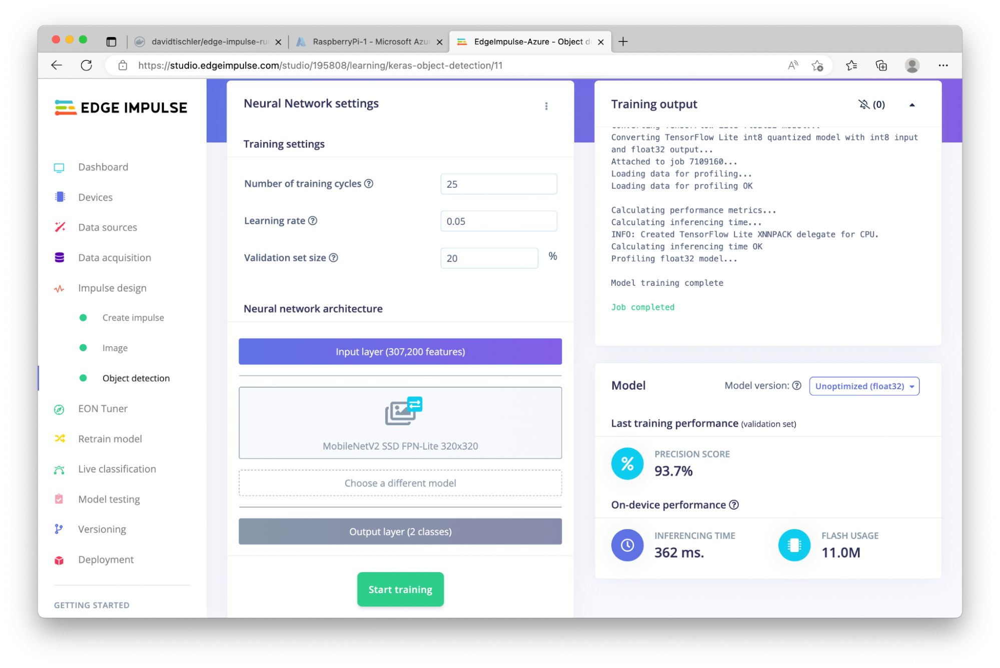

Upon completion, this model is scoring 93.7%, which will be fine for demonstration purposes, so we'll proceed to deploying this new model to the Raspberry Pi.  Back in Azure, we will follow the same steps as previously, of removing the existing container and adding back our inferencing container instead.  In Azure, click on your device, click on "Set modules", click on the trash can icon next to "data-collection", click the "+ Add" drop-down, click "IoT Edge Module", and once again provide a name, insert the URI `docker.io/YourUsernameThatYouCreated/edge-impulse-runner-container:v1.0`, click "Container Create Options", and add the same JSON snippet we've been using:

```

{

    "Env": [

        "UDEV=1"

    ],

    "HostConfig": {

        "Privileged": true,

        "PortBindings": {

            "4912/tcp": [

                {

                    "HostPort": "4912"

                }

            ],

            "4912/udp": [

                {

                    "HostPort": "4912"

                }

            ]

        }

    }

}

```

Then click on the "Add" button, then "Review + Create", then "Create" to redistribute our existing inferencing container back to the Raspberry Pi.


This time, once the container loads (in a few minutes), it will download the newer version of the model that we just created.  This newer model should have the ability to detect bananas, if everything goes according to plan.  To check, again visit the IP address or hostname of the Raspberry Pi, followed by port 4912, like this as an example:  http://192.168.0.128:4912 

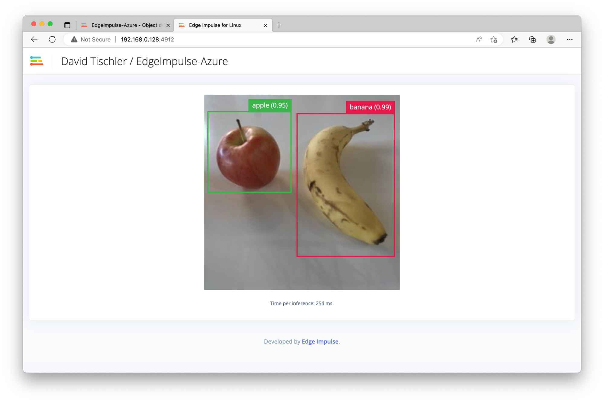

Sure enough, the new model is running, and we have successfully added net-new capability via an over-the-air deployment of an updated computer vision model.

We have also completed another loop in the MLOps lifecycle, and this process can be repeated continually as new data is gathered, model accuracy improves with additional training, or new application features are developed.  Azure IoT Edge gives you the ability to easily update entire fleets of devices, no matter where they are located.

## Conclusion

This project is an example of how to build and utilize an MLOps workflow to continually improve and iterate a computer vision application and distribute it to a fleet of edge AI devices.  We set up a device (Raspberry Pi), installed Azure IoT Edge, and then used Docker containers and the Docker Hub container registry to install both an Edge Impulse data collection utility, as well as an Edge Impulse inferencing application.  We demonstrated how to successfully collect images, build a high-quality dataset, discussed best practices, and walked through the object detection model creation process in Edge Impulse.  We showed how to deploy that model via Azure, showed how to then collect more data, retrain the neural network, and finally redeploy the new model to the device, completing a second loop around the MLOps lifecycle.  There are many more features and capabilities available within both Edge Impulse and Azure IoT Edge, to allow for enterprise edge AI solutions to be built easily at scale.


