# Wearable for Monitoring Worker Stress using HR/HRV DSP Block - Arduino Portenta

Created By: Roni Bandini

Public Project Link: [https://studio.edgeimpulse.com/studio/558080](https://studio.edgeimpulse.com/studio/558080)

GitHub Repo: [https://github.com/ronibandini/hr-hrv](https://github.com/ronibandini/hr-hrv)

## Introduction

During the Apollo missions astronauts wore ECG sensors to monitor their stress levels and assess their ability to perform complex tasks. These ECG signals were manually monitored from Earth, over a distance of 238,855 miles away, making the process challenging due to delays and data transmission errors. Today, advancements in technology have led to the development of small, inexpensive, offline wearable devices that utilize machine learning to determine stress levels. These modern devices can alert when a worker is unable to perform a critical task, ensuring safety and efficiency without the need for remote monitoring.

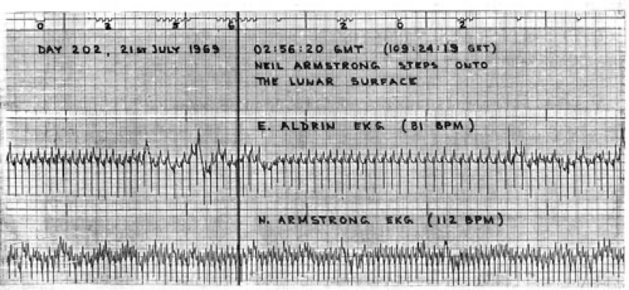

How complicated is it to obtain ECG data, extract specific features with the Edge Impulse HR/HRV Processing Block, train a model, and deploy the model to create an Arduino wearable?  Let's investigate and find out!


**Disclaimer**: This project is experimental and it is not intended to diagnose or treat any medical conditions.


## Requirements

1 x Arduino Portenta H7
1 x AD8232 SparkFun Single Lead Heart Rate Monitor
5 x female-female jumper cables
Edge Impulse Account

> Note: All Edge Impulse users (Community, Professional, and Enterprise) can extract heart rate and HRV features using this block for testing purposes. However, the Deployment option is only available for Enterprise users.

### Circuit

Connect AD8232  Output to A0
Connect AD8232  Lo – to D2 
Connect AD8232  Lo + to D3 

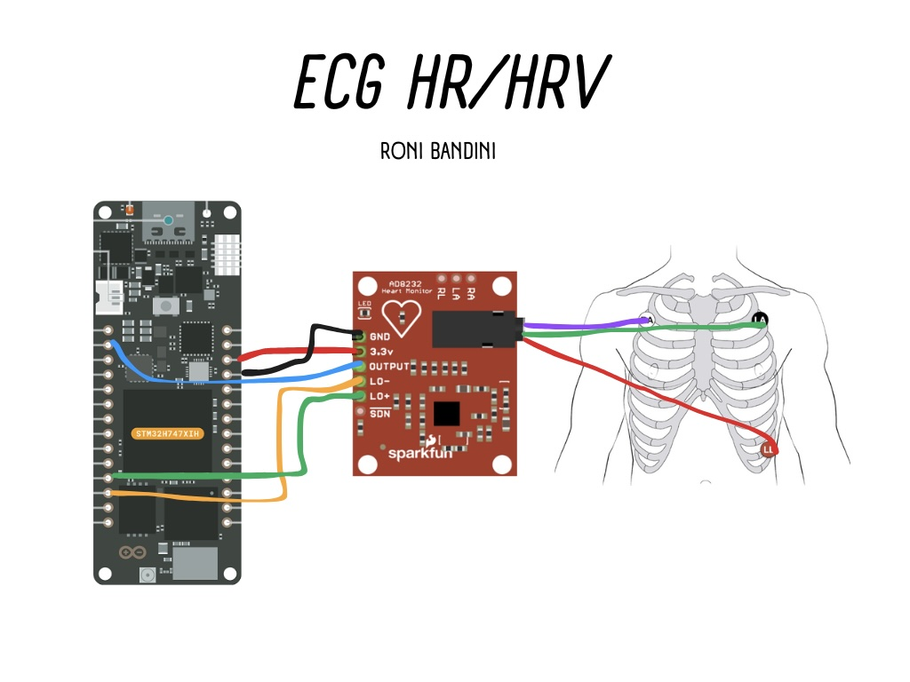

Lo means "Leads off" detection. The AD8232 also includes a shutdown pin (SDN) that is not used for this case. A logic level signal can be applied to SDN to switch to shutdown mode, even when the supply is still on.

Connect the pads jack right all way to the end, disconnect the AC from the laptop and move away all radio devices before sampling. Use good quality, new pads for each measurement. 

## ECG Intervals

The ECG is separated into two basic intervals: the PR Interval and the QT Interval. The PR interval is the initial wave generated by an electrical impulse traveling from the right atrium to the left. Then inside the QT there is a complex process that generates the signature "beep" in cardiac monitors. During QRS both ventricles begin to pump. After the initial contraction comes the ST segment (the time where the ventricals waiting to be "re-polarized"). Finally the T wave becomes present to actively "re-ploarize", or relax the ventricles.

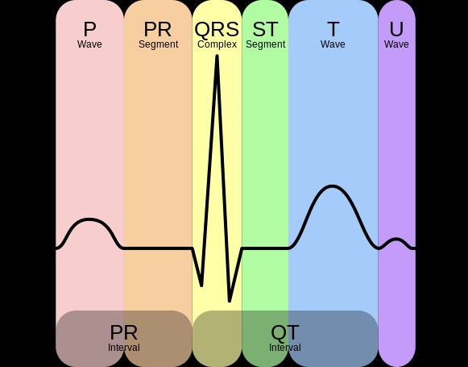

## Data Acquisition

For this project, the data will be the electrical activity of the heart. The AD8232 sensor is designed to extract, amplify, and filter small biopotential signals in the presence of noisy conditions, such as those created by motion or remote electrode placement.

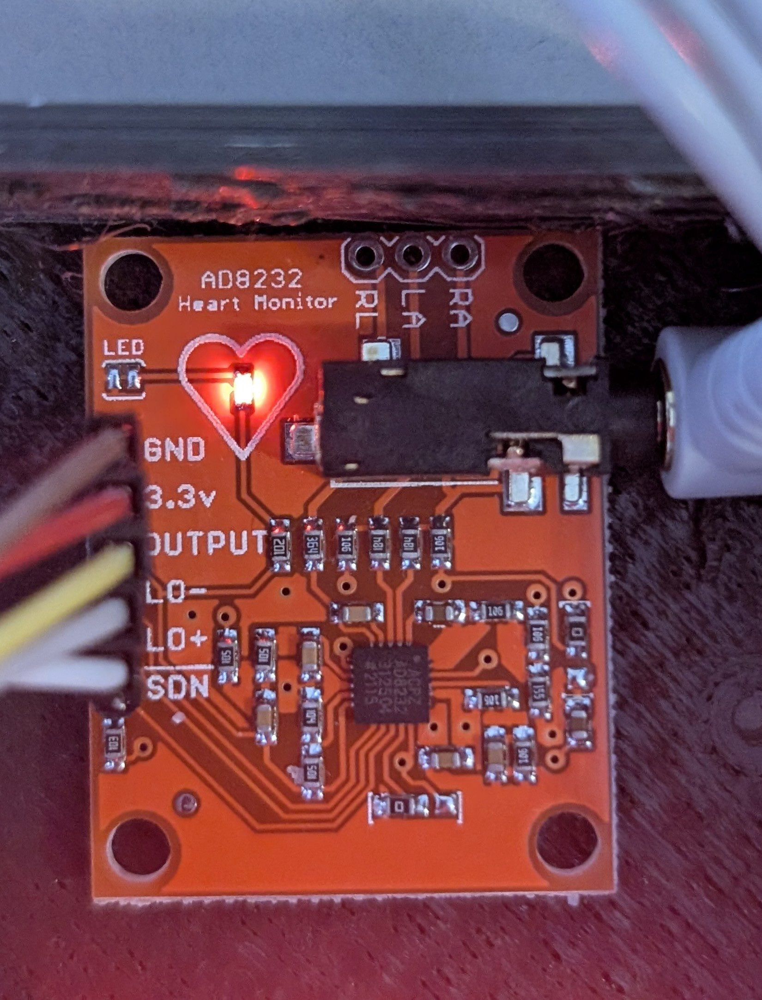

The ECG signal can also be combined with data from an accelerometer for enhanced diagnostics. Some Arduino boards, like the Arduino BLE 33 Sense, have an onboard accelerometer, so with a small code modification, that data can also be used to train the model.

The pads should be connected as follow:

- Yellow pad to the left.
- Red pad to the right.
- Green pad below the red pad.

> Note: Remember to disconnect the AC from the laptop before sampling. 

Upload the Data Forwarding acquisition script to the Arduino Portenta using the Arduino IDE.

Check that the values being obtained are stable in the Serial Monitor (Center value of about ~500 with spikes between +300/-200)

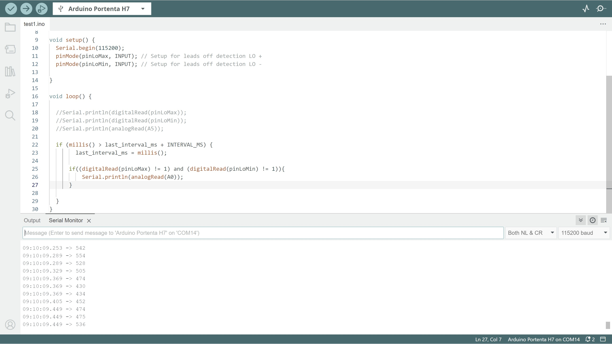

> Note: Even with all these precautions, the AD8232 module could still produce a noisy signal. For a real deployment it is recommended to use professional equipment like the Elemyo EMG/ECG module MYO v1.5. For this Public Project synthetic data was used.

Close the Serial Monitor and run `edge-impulse-data-forwarder`.

Select the Edge Impulse project and check that the frequency shows `[SER] Detected data frequency: 50Hz`.

Go to [https://studio.edgeimpulse.com/studio/Your-Project-ID/acquisition/training](https://studio.edgeimpulse.com/studio/Your-Project-ID/acquisition/training)

Select **Length 120.000 ms** and take around 10 to 20 samples for each category to classify. For example, regular working versus stressed. Set aside 10% of the samples for testing. 

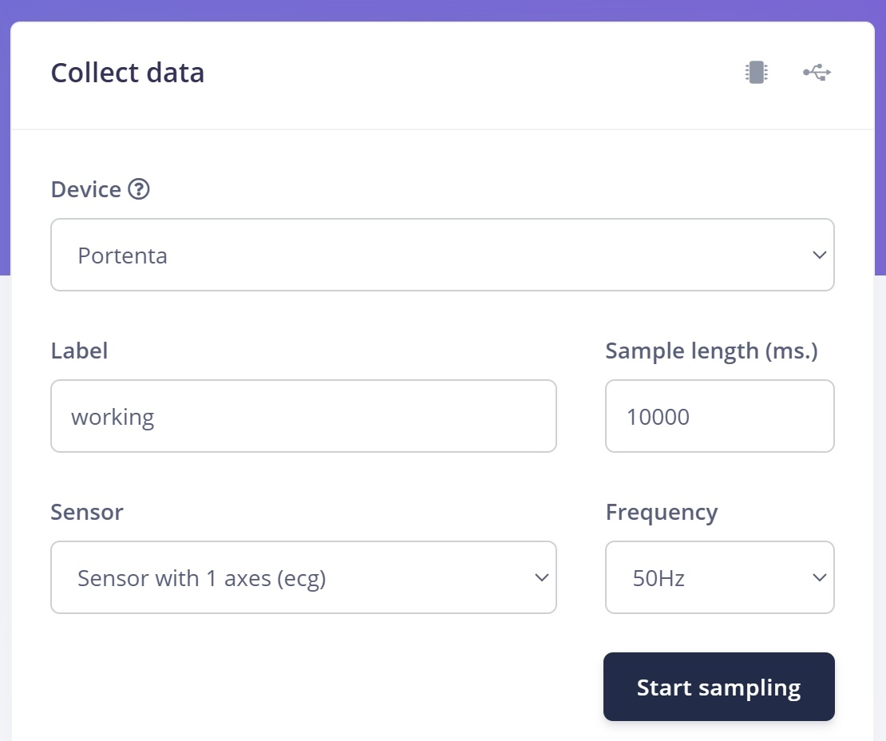

## The HR-HRV Block

Edge Impulse recently added a learning block specifically designed for this scenario.

The **HR/HRV Features** block processes physiological signals like the electrocardiogram (ECG), with optional accelerometer inputs for enhanced accuracy in motion-prone applications, to extract key metrics such as heart rate (HR) and heart rate variability (HRV). HR measures the number of beats per minute, while HRV measures the time variance between successive heartbeats, also known as the interbeat interval (IBI). The block offers real-time HR estimation and HRV analysis on resource-constrained edge devices and leverages cutting-edge algorithms for precise feature extraction. The extracted features can be used on their own or to inform downstream machine learning tasks such as stress detection or heart health analysis.

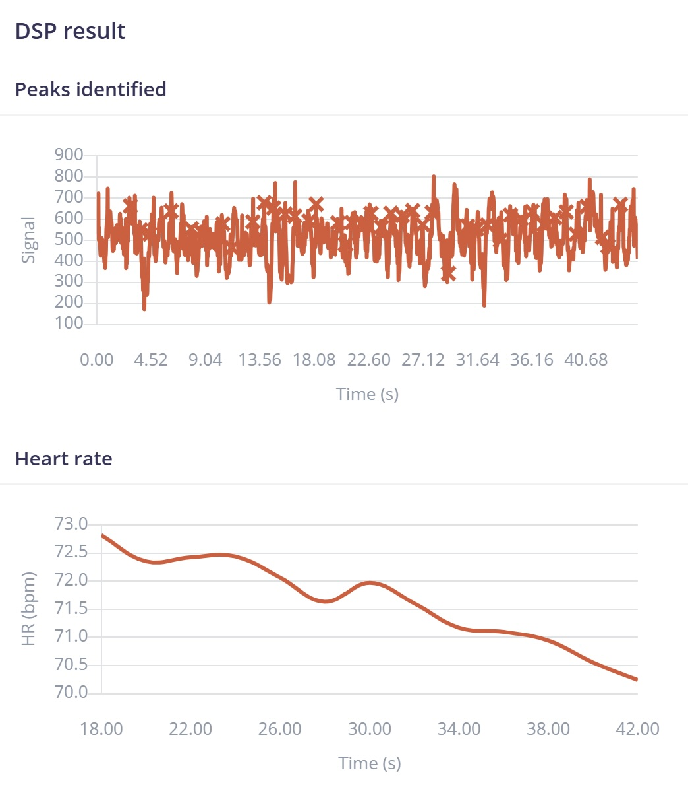

For this project, stress detection is performed with a classification algorithm, as the model has already been trained with ECG data from both regular working conditions and stressed conditions. However, if you extract all the HRV features, you can also determine stress by analyzing frequency domain features such as Raw VLF Energy, Raw LF Energy, Raw HF Energy, Relative VLF Energy, and the LF/HF Ratio Peak Energy. Just note that you will need a window size of 90 seconds (10 seconds for RMSSD and 30 seconds for time domain analysis).

Time-domain features are: IBI Slope, HR Mean, HR Slope, RMSSD Slope, RMSSD, AVNN, SDNN, Range NN, MAD NN and pNN50.

Frequency-domain features are: Raw VLF Energy, Raw LF Energy, Raw HF Energy, Raw Total Energy, Relative VLF Energy, Relative LF Energy, Relative HF Energy, LF/HF Ratio, Peak VLF Energy, Peak LF Energy, Peak HF Energy

I have used ECG, filter preset 1, window size 40 and no HRV features.

## Model Training

The training could require some parameters to be modified from the defaults. I have found the following parameters to work well for my dataset, with a 89.3% accuracy. Training cycles **40**, learning rate **0.005**, bacth size **30** and no auto weight. 

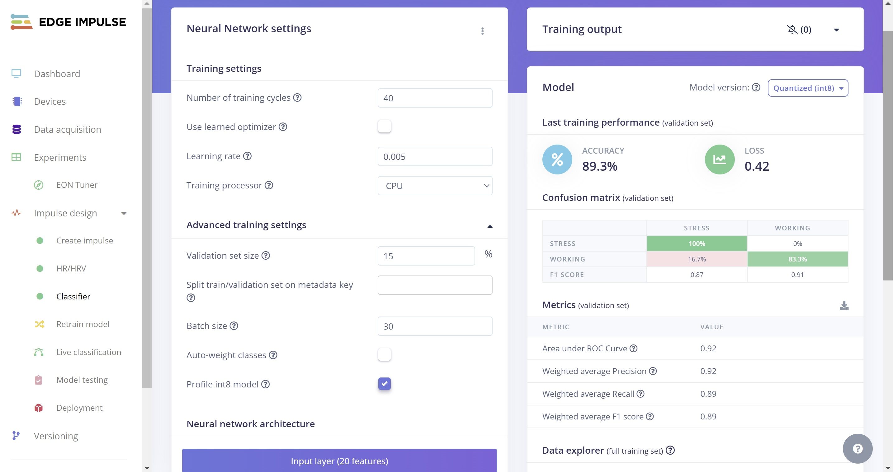

## Deployment

For projects using the Edge Impulse HRV DSP block, a license to deploy is required, so there is a button to authorize this feature. 

After the authorization you will be able to get the model as an Arduino library. However, an intermediate step is required.

1. Unzip the deployment file into a local folder on your laptop.
2. Download a zip containing all files from [https://github.com/edgeimpulse/example-hr-lib-arm](https://github.com/edgeimpulse/example-hr-lib-arm).
3. Unzip the files and copy them to the local folder you created in Step 1.
4. Zip the folder, now with the additional files included, back into a single archive / `.zip` file
5. Add the new `.zip` file as a library in the Arduino IDE (_Skectch, Include Library, Add Zip library_)

Now you will be able to use the model library with your own code. A sample ECG monitor script using the compiled .zip file can be found at [https://github.com/ronibandini/hr-hrv/blob/main/ecg2.ino](https://github.com/ronibandini/hr-hrv/blob/main/ecg2.ino)

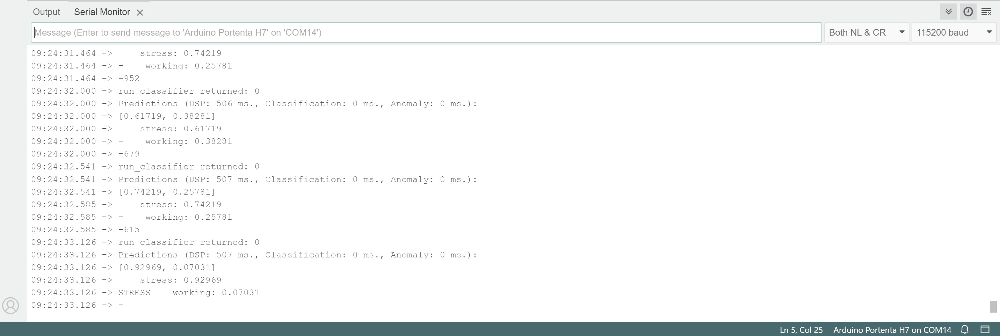

> Note: If Arduino Portenta shows `Exit status 74`, double click "Reset", and select the correct port.

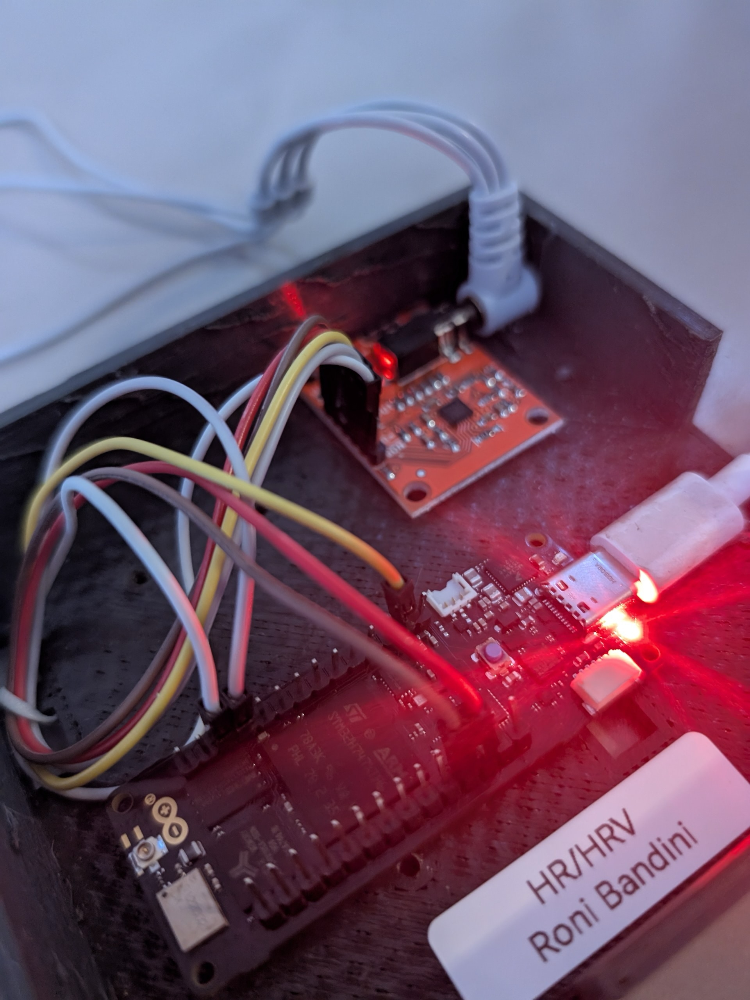

## Final Notes

Thanks to machine learning, monitoring ECG signals no longer requires transmitting data to a remote computer for expert analysis. Instead, subtle health conditions can be detected by small, offline, wearable devices equipped with machine learning capabilities. These devices can identify over-stressed workers who may be unable to perform their tasks effectively, thus preventing serious harm or consequences.

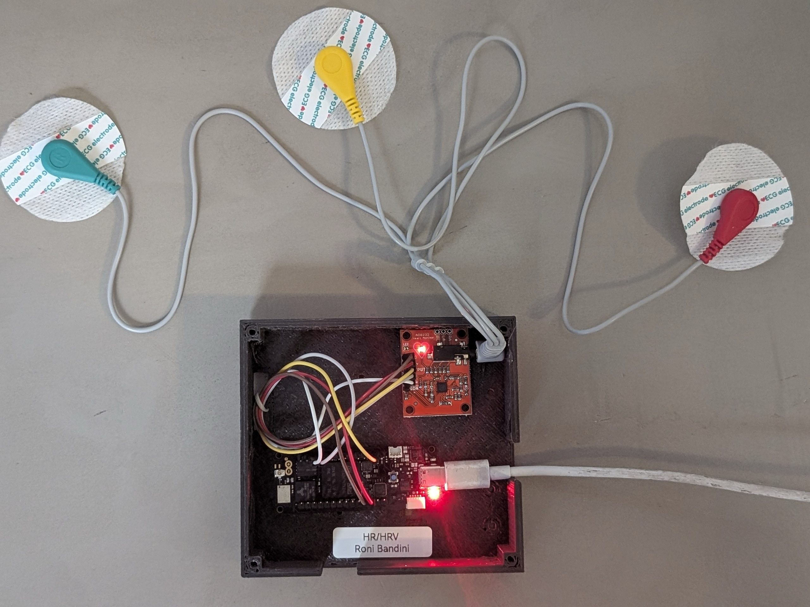

## Files and Project Link

[https://studio.edgeimpulse.com/studio/558080](https://studio.edgeimpulse.com/studio/558080) 
[https://github.com/ronibandini/hr-hrv/](https://github.com/ronibandini/hr-hrv/) 

## References

[https://docs.edgeimpulse.com/docs/edge-impulse-studio/processing-blocks/hr-hrv-block](https://docs.edgeimpulse.com/docs/edge-impulse-studio/processing-blocks/hr-hrv-block)
[https://docs.edgeimpulse.com/docs/edge-ai-hardware/mcu/arduino-portenta-h7](https://docs.edgeimpulse.com/docs/edge-ai-hardware/mcu/arduino-portenta-h7)
[https://www.edgeimpulse.com/blog/unraveling-the-depths-of-hr-and-hrv-edge-impulses-technical-insights/](https://www.edgeimpulse.com/blog/unraveling-the-depths-of-hr-and-hrv-edge-impulses-technical-insights/)
[https://learn.sparkfun.com/tutorials/ad8232-heart-rate-monitor-hookup-guide](https://learn.sparkfun.com/tutorials/ad8232-heart-rate-monitor-hookup-guide)
[https://pmc.ncbi.nlm.nih.gov/articles/PMC10098909/](https://pmc.ncbi.nlm.nih.gov/articles/PMC10098909/)
[https://www.theatlantic.com/science/archive/2019/07/apollo-11-moon-heart-rates/593971/](https://www.theatlantic.com/science/archive/2019/07/apollo-11-moon-heart-rates/593971/)
[https://elemyo.com/support/start_info/myo_v1_4](https://elemyo.com/support/start_info/myo_v1_4)
