# EdgeML Energy Monitoring - Particle Photon 2

Created By: Brennan Dayberry



## Introduction

The demand for efficient energy consumption management has never been greater. From enhancing the operational efficiency of utility grids, to ensuring the well-being of individuals in healthcare facilities, or even to providing predictive maintenance to mitigate preventable failures in industrial environments, the insights derived from monitoring energy consumption are invaluable. 

This project explores the transformative power of edge machine learning in deciphering energy consumption patterns, providing a step-by-step guide on how to create an energy monitoring solution that can individually identify which devices are being used on a shared AC line, based on energy-draw signatures. 

Current products on the market that provide this feature require an individual connection to each device, typically in the form of a smart plug, which is sufficient for basic consumer functions but not feasible for more complex use cases. With Edge Impulse and the Particle Photon 2, the same features are amplified, requiring just one measurement location for a power strip, circuit breaker, or even entire homes and buildings. 

### Why Use Edge AI for Energy Monitoring? 

Sending energy-monitoring data to the cloud for retrieval comes with several pitfalls, especially privacy-related and security concerns, bandwidth and latency issues, and cost considerations. In contrast, the emergence of embedded devices with sufficient processing capabilities to handle powerful machine learning algorithms on-device has several advantages, including enhanced privacy because data is collected locally and remains on device. Local data also provides a real-time analysis and decision-making benefit, ensuring timely responses to critical events or anomalies. Furthermore, reduced bandwidth usage and offline capabilities make the edge a powerful solution to unlock the full potential of energy monitoring, while maximizing efficiency.

## Getting Started

Materials List:
- [Particle Photon 2](https://store.particle.io/products/photon-2)
- Appliances
- Power strip with enough outlets for all the appliances being monitored
- Current clamp, non-invasive, such as [https://sparkfun.com/products/11005](https://sparkfun.com/products/11005)
- Method to reduce voltage and amplify current clamp signals for suitable measurement on ADC (see Analog Front End schematic for one way to accomplish this)
- Computer with internet access
- Edge Impulse account

Creating an energy-monitoring solution begins with measuring the AC voltage and current of a surge protector or entire circuit breaker, then utilizing machine learning to characterize the on/off states of all devices to identify which ones were consuming power.

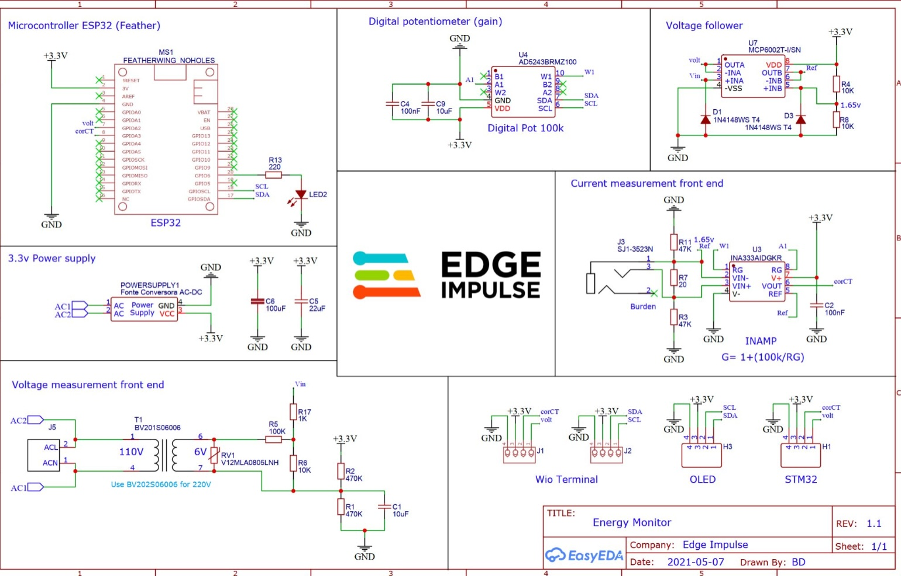

## Data Collection

For demonstration purposes, we utilized a lamp, desk fan, mini refrigerator, blender, and a toaster, collecting data on a combination of appliance states. The energy usage details will be detected via a current clamp, connected to the Particle Photon 2. The analog front end, in the simplest sense, captures and conditions the voltage and current signals in such a way that the low-voltage ADC inputs of the Photon 2 can measure them safely and accurately. Plug all the devices into one power strip, with the current clamp connected to the main power cord on the power strip.

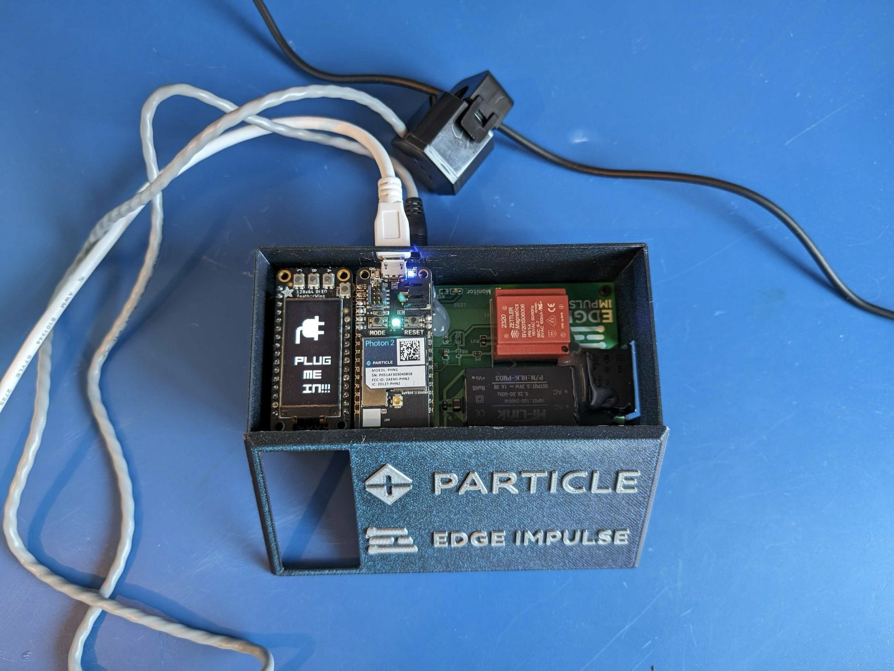

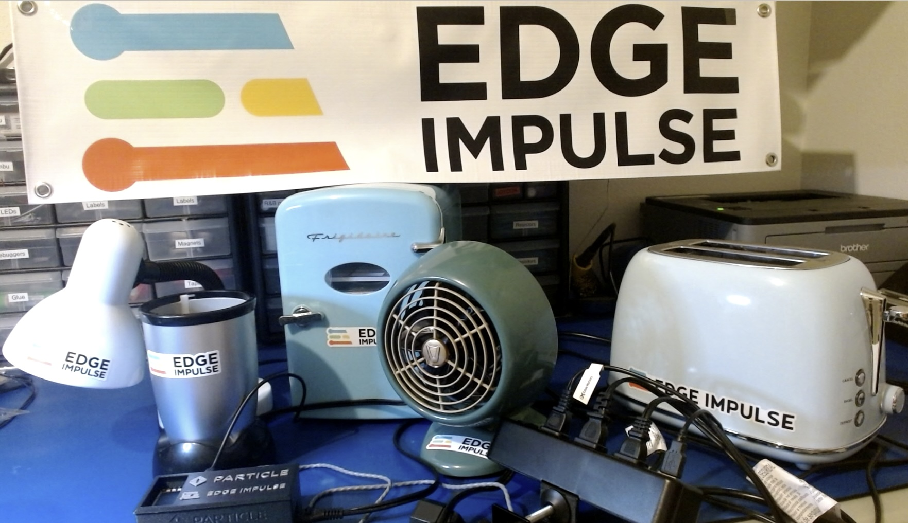

After setting up the Particle Webhook builder with the appropriate API keys and header settings, the Webhook takes the data coming from the device and forwards it to the Edge Impulse API data ingestion service.

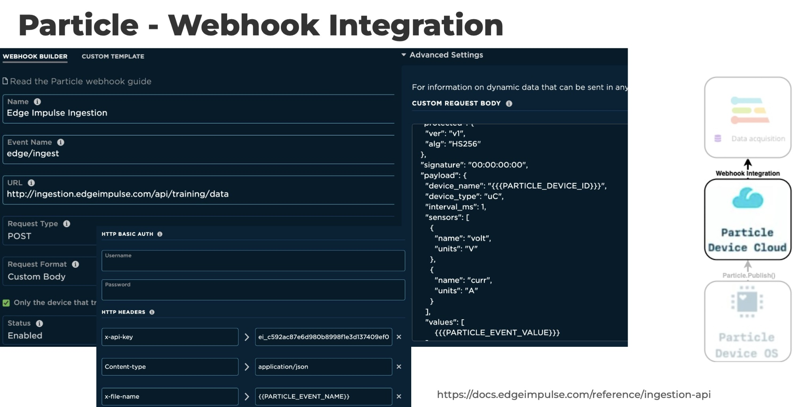

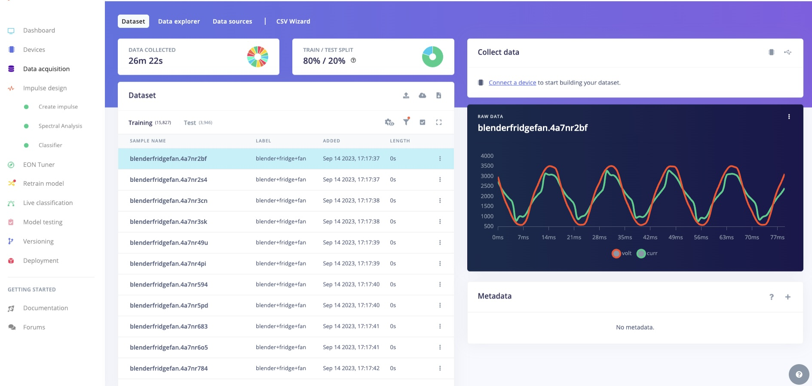

The data then moves quickly to Edge Impulse Studio; we've set it to send at twice per second through the entire path and up to our service. It’s easy and simple.

## Impulse Design and Model Training

In Edge Impulse, the Impulse is the whole pipeline, from collected data all the way to the output, demonstrating the data, digital signal processing, classifiers, and any output features that are utilized.

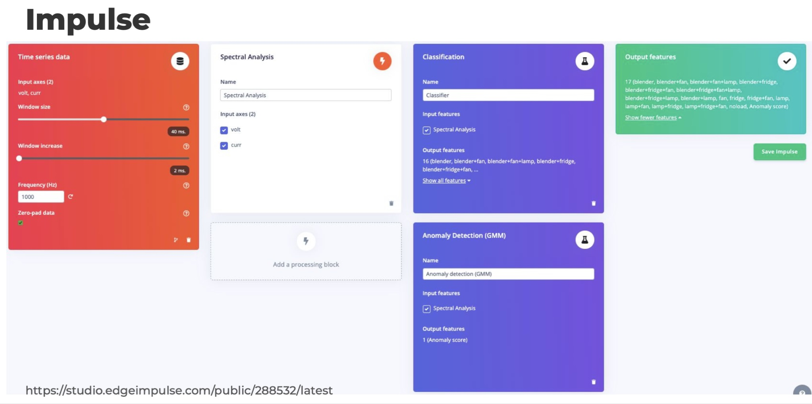

## Spectral Analysis 

Once the Impulse design and model training phases are complete, it's time to move into spectral analysis, which pulls out the valuable information about which devices are on. 

In this case, we’re interested in the harmonics, up to the seventh or about 420 Hertz (in the United States). Harmonics, based on the Nyquist theorem, dictate that it should be sampled twice. If it’s not, you’ll lose part of the signal and won’t capture that frequency.

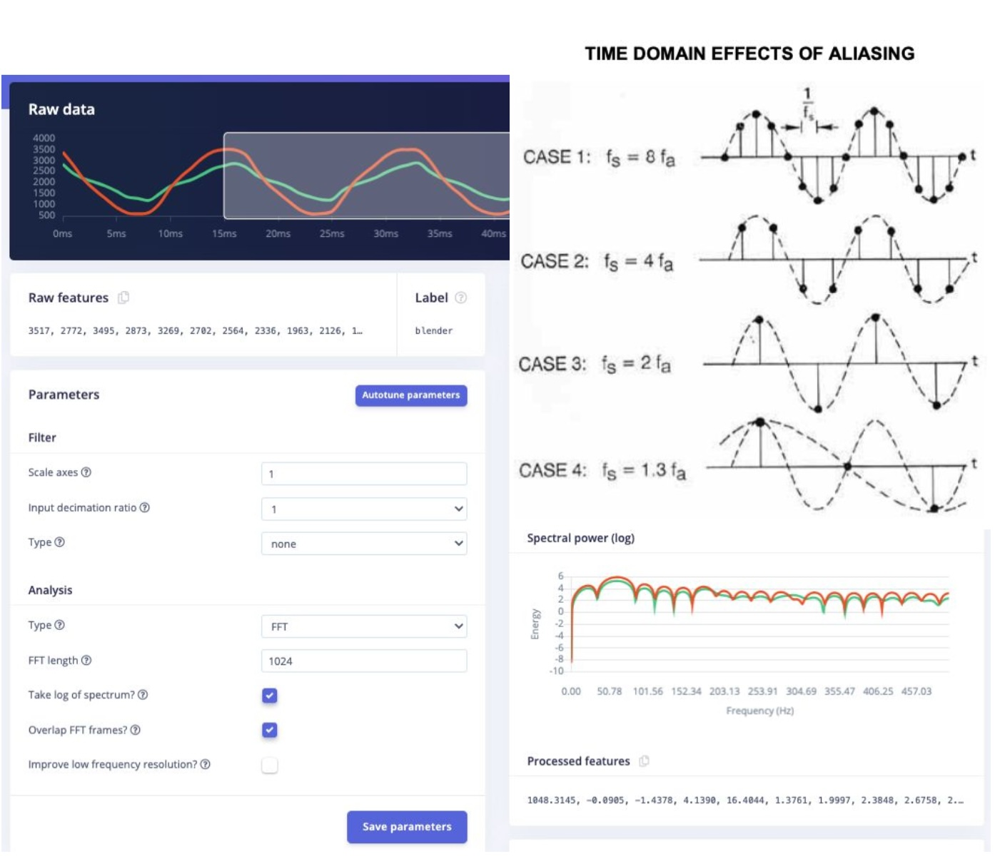

## Feature Explorer

The feature explorer is invaluable after the data has been imported. This tool highlights inconsistencies in the data. Perhaps the data was incorrectly labeled for example. The Feature Explorer helps to identify such issues.

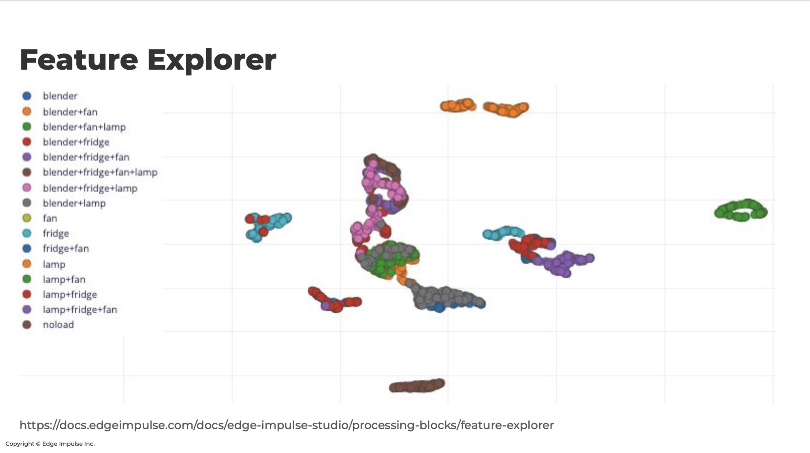

You’ll notice multiple gray and overlapping green highlights at the center of the Feature Explorer, representing the device categories: blender, lamp, and blender-fan-lamp. This visual indicates that a lot of the data is very similar, so the network classifier may have trouble with these cases.

## Anomaly Detection 

The toaster was selected to provide an idea of what anomaly detection looks like. No data is collected from the toaster (that would add 60 More combinations), and a toaster doesn't look like our other devices. Our newest type of anomaly detection is the Gaussian mixture model. Through this model, you can identify the probabilistic bands of where the data shows up. If anything falls out of this band in any of these regions, it has a higher anomaly score because it's unlike the sampled data.

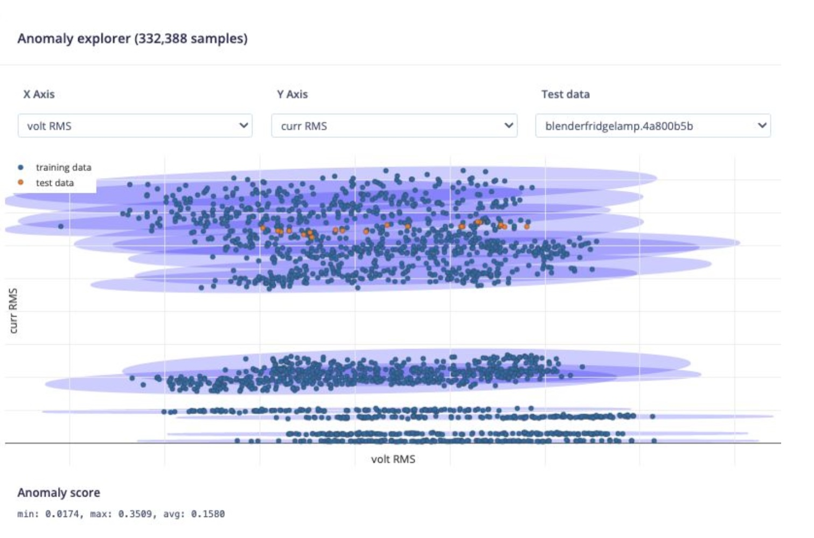

A Gaussian Mixture Model represents a probability distribution as a mixture of multiple Gaussian (normal) distributions. Each Gaussian component in the mixture represents a cluster of data points with similar characteristics. Thus, GMMs work using the assumption that the samples within a dataset can be modeled using different Gaussian distributions.
Anomaly detection using GMM involves identifying data points with low probabilities. If a data point has a significantly lower probability of being generated by the mixture model compared to most other data points, it is considered an anomaly (this will produce a high anomaly score).

## Confusion Matrix Model Training

The [Confusion Matrix](https://docs.edgeimpulse.com/docs/edge-impulse-studio/learning-blocks/classification#model-performances) is one of the most useful tools to evaluate a model. It tabulates all correct and incorrect responses a model produces given a specific set of data. The labels on the side in the following image correspond to the actual labels in each sample, and the labels on top correspond to the predicted labels from the model.

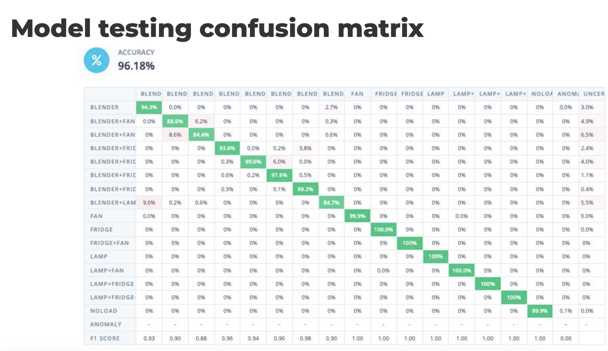

In this energy monitoring example, Confusion Matrices stem from training data selected from 10% of validation data extracted from 10% of training data. Training data is 97% accurate overall, but there were problem categories; blender-lamp and blender-fan. Roughly 10% of the time, the model confused whether it was a blender-fan or blender-fan-lamp. And that is due to the fact that the lamp didn’t consume a lot of energy, and the blender and the fan were noisy, consuming more energy.

## Improving Model Performance - Optimizing with EON Tuner

Once the model is built, it’s time to optimize, and determine what (if any) parameters need to be changed or adjusted in the pipeline. That’s where the EON (Edge Optimized Neural) Tuner comes into play. The scientific method requires changing one control variable at a time, but that can be time-consuming when optimizing entire machine learning pipelines. Additionally, the feature extraction and training jobs could take hours.

With EON Tuner that hyperparameter search is done in parallel, starting all of the possible combinations at once and then comparing all of the results side-by-side, then sorting by whichever figures of merit were most important to the application.

## Deploying on the Edge 

The steps outlined here can be adapted to other use cases including manufacturing and industrial environments. But imagine a patient hooked up to a heart rate monitor at an assisted living facility, and the machine was turned on or off. By deploying an energy monitoring system at the edge, you could capture that critical information in real-time, and your devices would still function without the need for cloud connectivity. 

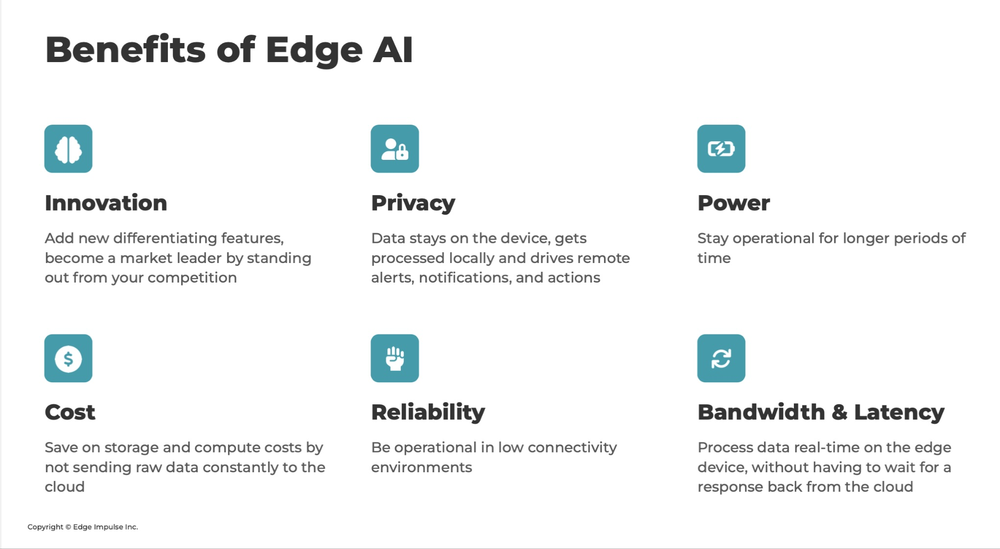

## Visualizing the Output

Adding a dashboard or data visualization element to a project always helps its usability.

In this case, there are two visualizations: a Datacake dashboard that also shows the power status of each device, alongside power consumption, wattage, and anomaly information on computer monitors via a web app, and a separate [OLED display from Adafruit](https://www.adafruit.com/product/4650) that is mounted next to the Photon 2, showing the on/off status of each device directly on the hardware.

With its native Particle integration, building a Datacake dashboard is straightforward. You simply set up a webhook to send data from the Photon 2, add and configure built-in widgets, and customize the layout to your liking. 

The dashboard’s power meter and power usage are determined by using the average of the RMS (root mean square) value of the current and multiplying by 120, the “assumed” RMS value of the voltage. This gives a rough display; a more thorough approach for measuring real and reactive power via power factor interpolation would be built into an actual use case.

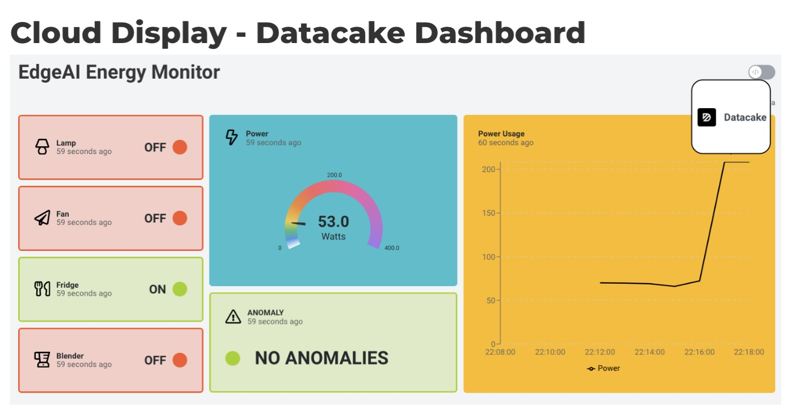

For the OLED screen, creating the associated icons for the status indicators on the OLED screen, I used PNG images from the [icons8.com](https://icons8.com) library, specifically looking for 24x24 px sizes to fit the display size. The PNG icons then need to be converted into byte arrays, in order to be used for monochrome OLED screens. For this, I used the [img2cpp tool](https://javl.github.io/image2cpp), adjusting the alpha threshold (since we are converting grayscale to black and white), and background color/color inversion. The tool will generate an Arduino-style array which can be copied to your code fairly easily.

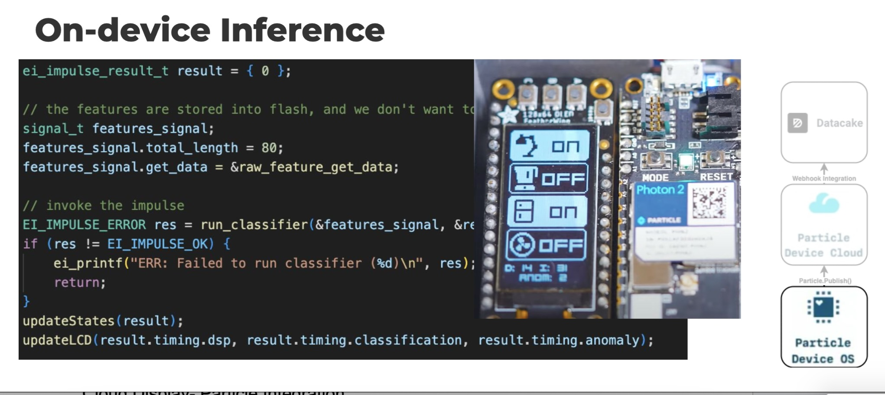

## Conclusion

This project demonstrates the potential of using edge machine learning to monitor and manage energy consumption. With the Particle Photon 2 and Edge Impulse, it is possible to create an efficient and cost-effective energy monitoring solution that identifies device-specific energy consumption patterns without additional hardware like smart plugs or separate monitoring devices. This approach not only enhances operational efficiency but also provides valuable insights for various applications, from utility grids to healthcare and industrial environments, paving the way for more intelligent and sustainable energy management practices.

