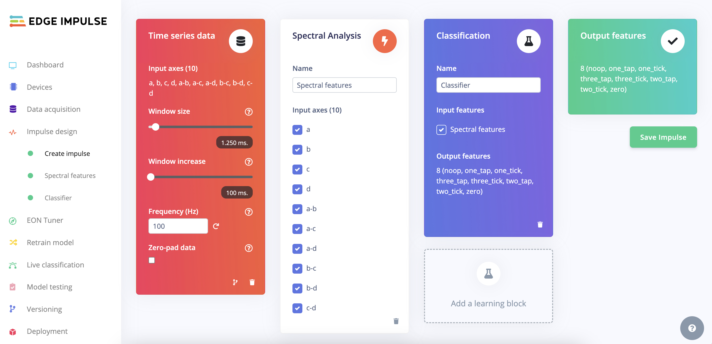
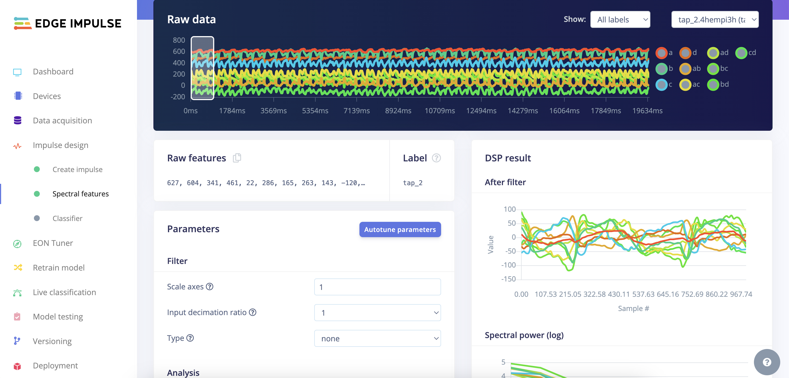
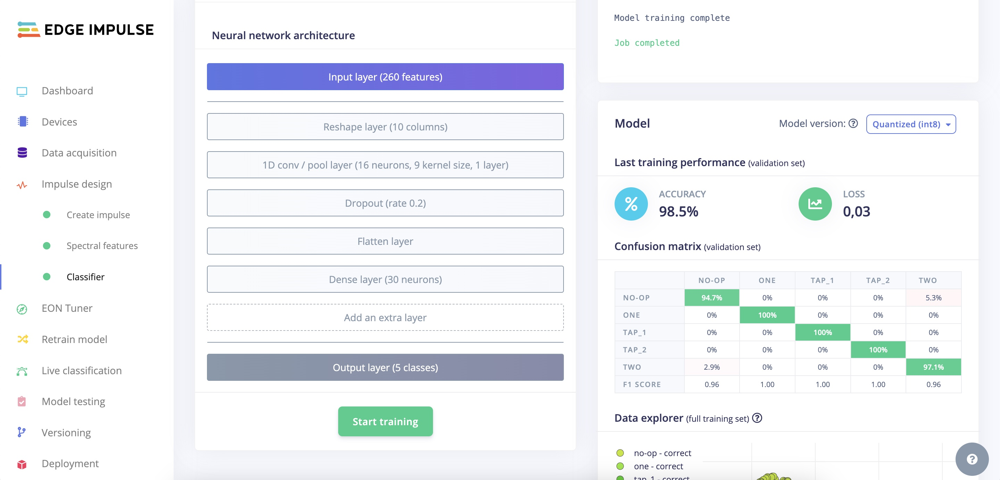

# DIY Smart Glove with Flex Sensors

Created By: Simone Salerno

Demo Video: 

## Introduction

HCI (Human Computer Interaction) is an evolving topic these days that is finding its way into the life of many people, with a large application potential in the consumer, health, and assistive technology industries.

Free-form interfaces (for example, voice and gestures) have become ubiquitous and the cost of inclusion is getting lower and lower. One type of interface that may come handy in the bleeding-edge field of AR/VR, or in the health industry for low-mobility people, is one that uses finger and hand movement to interact with a device.  Essentially: a smart glove.

A smart glove is one that is able to react to the movements of the fingers, by recognizing either their fixed position or moving patterns. In this project I'm going to build a flex smart glove - one that uses flex sensors on the fingers and an Edge Impulse TinyML model - with a BOM (Bill of Materials) that is less than $5 USD (excluding the microcontroller).

## DIY Flex Sensor

[Flex sensors](https://en.wikipedia.org/wiki/Flex_sensor) change their resistance based on the amount of "bend" they're subjected to. Commercial flex sensors for the Arduino and embedded ecosystem exist, but they cost about $15 USD each. To cover all the fingers of a single hand it would thus cost 5 x 15, so approximately $75 USD. It may not be a prohibitive cost, but doing it yourself will cut this value down to just about one dollar USD.

Moreover, you can build flex sensors of the size you wish to use in other settings too (you could attach them to your arms or legs, for example).

Let's see how to build one!

### Velostat

There are few materials that can be used to build a flex sensor by yourself. In this project, I selected [Velostat](https://en.wikipedia.org/wiki/Velostat) because it is widely available and pretty cheap.  An [11"x11" sheet costs $5 USD on Adafruit](https://www.adafruit.com/product/1361). It is a pressure-sensitive material that can react well to bending too.

Follow this YouTube video for a step by step tutorial: [https://www.youtube.com/watch?v=FEPgLbPv6NM](https://www.youtube.com/watch?v=FEPgLbPv6NM)

You will then sew the bends to the glove to keep them in place.

## Feature Construction

Since each finger has its own flex sensor, we'll be dealing with 5 axis of data. Considering that the user can perform both still positions and moving gestures, we need to collect data over time. If we collect `N` timesteps, our feature vector will be of size 5 x N.

Our DIY flex sensors, though, are not very precise. Relying on their absolute values alone could lead to bad results because they can vary based on the stretch force applied at rest state (e.g., how we wear the glove). This is why we are augmenting the input features by adding the cross-difference among each pair of fingers. The rationale behind this is to capture the relative position/movement of one finger from the others.

So, calling F1...F5 each finger's reading, a single row in the feature vector will be made of:

```
{F1, F2, F3, F4, F5, F1 - F2, F1 - F3, F1 - F4, F1 - F5, F2 - F3, F2 - F4, F2 - F5, F3 - F4, F3 - F5, F4 - F5}
```

(size 15)

The definitive input vector will be a matrix of 15 x N.

### How long should N be?

The value of `N` depends on 2 factors:

 1. Gestures duration: how long (in seconds) is the longest gesture?
 2. Sampling frequency: how fast are you reading the flex sensors?

The faster you sample, the more granularity your data will have, but the larger the input vector (and the Edge Impulse model) will be! A good starting point is taking 100 samples/second. You can increase this value later if the model is not performing well.

How long should the longest gesture be? I recommend to start with short gestures of ~1 second. Once you have good results, you can try to increase the gesture complexity and duration. Also, start with repeating patterns (a.k.a. continous motion), not "one-shot" gestures (they're harder to recognize). 

## Data Collection

To handle the sensor readings, we're going to create a `Hand` class: this will encapsulate the actual reading and cross-difference calculations. We're also adding exponential smoothing to eliminate high frequency fluctuations.

Create a file, I've called it `hand.h`, with the following:

```
#pragma once
#define NUM_VALUES (4 + 3 + 2 + 1)
#define SMOOTH 0.8f


class Hand {
  public:
    int16_t values[NUM_VALUES];

    /**
     * 
     */
    void begin() {
      pinMode(A0, INPUT);
      pinMode(A1, INPUT);
      pinMode(A2, INPUT);
      pinMode(A3, INPUT);

      for (int i = 0; i < NUM_VALUES; i++)
        values[0] = 0;
    }

    /**
     * 
     */
    void read() {
      // read
      float a = analogRead(A0);
      float b = analogRead(A1);
      float c = analogRead(A2);
      float d = analogRead(A3);

      // smooth
      a = a * SMOOTH + (1 - SMOOTH) * values[0];
      b = b * SMOOTH + (1 - SMOOTH) * values[1];
      c = c * SMOOTH + (1 - SMOOTH) * values[2];
      d = d * SMOOTH + (1 - SMOOTH) * values[3];

      // assign
      values[0] = a;
      values[1] = b;
      values[2] = c;
      values[3] = d;
      values[4] = a - b;
      values[5] = a - c;
      values[6] = a - d;
      values[7] = b - c;
      values[8] = b - d;
      values[9] = c - d;
    }

    /**
     * 
     */
    void print() {
      Serial.print(values[0]);

      for (int i = 1; i < NUM_VALUES; i++) {
        Serial.print(',');
        Serial.print(values[i]);
      }

      Serial.println();
    }
};

```

The collection sketch is very simple: we only capture data and print it to the Serial Monitor of the Arduino IDE in CSV format. This allows use of the `edge-impulse-data-forwarder` command line tool to import the data into Edge Impulse platform.

Here is the Sketch I've created:

```
#include "Hand.h"


Hand hand;


/**
 * 
 */
void setup() {
  delay(3000);
  Serial.begin(115200);
  
  hand.begin();
}


/**
 * 
 */
void loop() {
  hand.read();
  hand.print();  
  delay(10);
}

```

Upload the Sketch, start the tool and start performing each of the positions/gestures you want to recognize.

## Impulse Design

Our data is a multi-axis time series. This usually means the processing block will be made of Spectral Features (FFT frequencies and their power spectrum). 

For the Classifier, I opted for a fully connected network with 2 layers. As you can see from the confusion matrix, you can expect to achieve a very high score on all the gestures.







## Deployment

Now move to the `Deployment` tab and download the project as an Arduino library. To run the model on our board, we're going to leverage the [EloquentArduino library](https://eloquentarduino.com/eloquent-edge-impulse/), which makes this a breeze.

After you have imported the downloaded zip as a library in the Arduino IDE, compile and upload the following Sketch:

```
#include <smart_glove_inferencing.h>

#include <eloquent.h>
#include <eloquent/tinyml/edgeimpulse.h>
#include <eloquent/tinyml/voting/quorum.h>
#include "Hand.h"

// Impulse actually runs EI model
Eloquent::TinyML::EdgeImpulse::Impulse impulse;
// ImpulseBuffer is a circular buffer to store
// the input values
Eloquent::TinyML::EdgeImpulse::ImpulseBuffer buffer;
// Quorum is a voting scheme that buffers multiple
// class labels and detects if the value is stable
// or is just a temporary mis-prediction
Eloquent::TinyML::Voting::Quorum<5> voting;
// Hand handles the sensor reading
Hand hand;


/**
 * 
 */
void setup() {
  delay(3000);
  Serial.begin(115200);
  Serial.println("init");
  
  hand.begin();
  // don't run the EI model at every new reading
  // but after a batch of 10
  buffer.batch(NUM_VALUES * 10);
  // in a votation of N, a label is
  // considered "stable" if at least N/2 + 1
  // labels are the same
  voting.atLeastMajority();
}


/**
 * 
 */
void loop() {
  hand.read();

  // when the batch is full, run prediction
  if (buffer.push(hand.values, NUM_VALUES)) {
    uint8_t classIdx = impulse.predict(buffer.values);
    int8_t stableClassIdx = voting.vote(classIdx);
    
    //Serial.print("(unstable) Predicted class: ");
    //Serial.println(impulse.getLabel());

    if (voting.isStable()) {
      Serial.print("(stable) Predicted class: ");
      Serial.println(impulse.getLabelOf(stableClassIdx));
      buffer.clear();
    }
  }
  else {
    // 100 Hz sampling frequency
    delay(10);
  }
}

```

The Sketch leverages a couple of helper classes from the **EloquentArduino** library:

 - `ImpulseBuffer` allows you to push values to a circular queue that will discard older values when new ones arrive
 - `Quorum` allows you to batch the latest `N` predictions and check that at least N/2 + 1 of them agree on the same label. This helps smooth out prediction noise.

Open the Serial Monitor and start moving your hand replicating the gestures you recorded.

## Conclusion

Using this method, we successfully built a hand gesture recognition machine learning model out of Velostat pressure-sensitive conductive sheets. Dedicated and use-specific flex sensors do exist, but they are more costly. The flex sensor is able to identify and predict finger position relative to the other fingers, and classify accordingly. This creates the opportunity to recognize gestures and use them as an interface to devices. 

