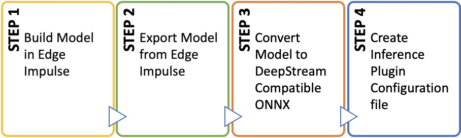
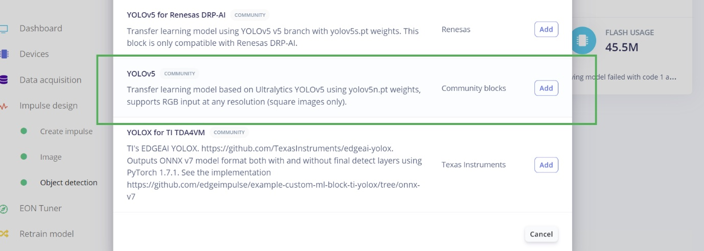
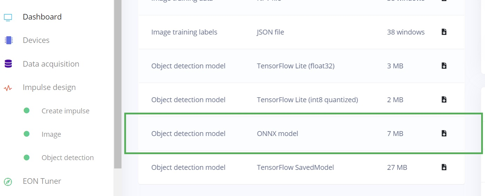
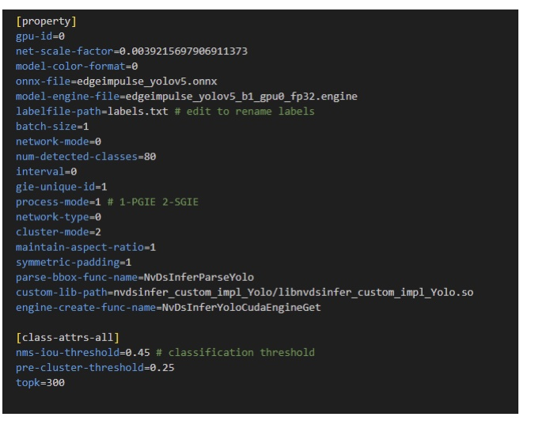
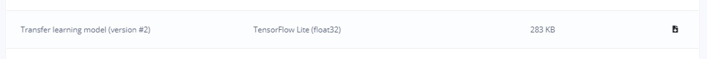
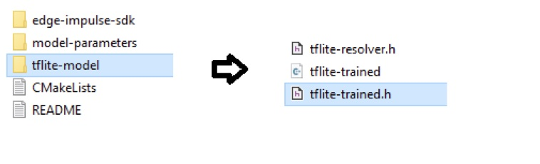
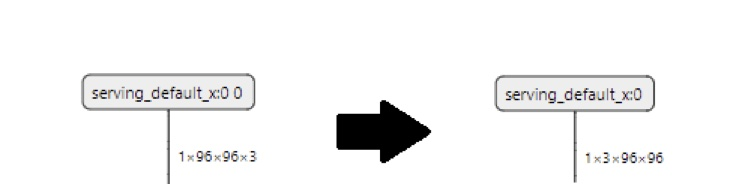
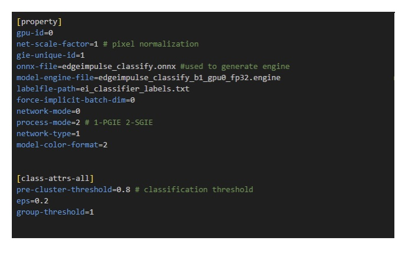
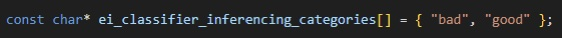

# Community Guide — Using Edge Impulse with Nvidia DeepStream

Created By:
Peter Ing

GitHub Repo:
[https://github.com/peteing/DeepStream-EdgeImpulse](https://github.com/peteing/DeepStream-EdgeImpulse)

## Introduction

Nvidia DeepStream is an audio, video, and image analytics toolkit based on GStreamer for AI and computer vision processing.  It can be used as a building block for creating applications and services that incorporate machine learning and computer vision components or capabilities, such as human-machine interfaces, self-driving and autonomous vehicles, security, and many other use-cases. Detailed information and documentation for DeepStream is located here: [https://developer.nvidia.com/deepstream-sdk](https://developer.nvidia.com/deepstream-sdk).

## Workflow Overview

The following general workflow can be followed when using Edge Impulse with Nvidia DeepStream to produce the final ONNX model and Inference Plugin Configuration files for use with your preferred deployment option.



The first step in the process is exactly the same as when you are using Edge Impulse to build TinyML models for embedded systems, up until the last stage of testing and validation. 

The process above varies depending on the type of model being used. One difference between using DeepStream vs the lower level TensorRT API is that DeepStream provides convenience for developers, with a higher level interface taking away the need to work directly with the more complex TensorRT. This convenience does come with a constraint on the model's input layer being used with DeepStream.

With TensorRT you can effectively work more freely using the **Layers API**, which adds more development overhead, whereas with DeepStream you need to ensure your ONNX Model is built with the input layer in a specific manner.

At runtime, DeepStream's Inference plugin, **`Gst-nvinfer`**, automatically transforms input data to match the model's input layer, effectively performing preprocessing that are operations similar to the DSP block when using Edge Impulse's SDK on embedded systems. DeepStream reduces the development burden by implementing design choices and this convenience requires models to have a consistent input shape.

Gst-nvinfer requires the input tensor to be in the NCHW format where:
 - N: batch size – number of frames to pass to the inference Engine for batch inference
 - C: channels – number of input channels
 - H: height – input height dimension 
 - W: width – input width
 
Edge Impulses models are not in this format by default, and some steps are required to prepare the model for use with Gst-nvinfer.

Gst-nvinfer makes use of TensorRT under the hood to do all the heavy lifting, with models needing to be converted to TensorRT engines. The simplest way to build a DeepStream TensorRT engine is to allow Gst-nvinfer to automatically build the engine which DeepStream does, if the model is in ONNX format. Preparing the model for DeepStream therefore requires the conversion of the model to ONNX format while also converting the input tensor to NCHW.

> Note: There is a TensorRT deployment option in Edge Impulse, however these models don't work directly with DeepStream because the input layer is not in NCHW format.  The TensorRT deployment is better suited for when a developer is manually building applications from the ground up, directly on top of TensorRT where there is complete control of the Inference Engine and application. This requires more coding than using DeepStream. It is also used with Edge Impulse EIM Linux deployments.

> Note: Due to TensorRT being used at heart of Gst-nvinfer, it is possible to apply all the TensorRT development capabilities to override DeepStream if it is necessary. For example, manual Engine creation in C++ or Python as well as custom input and output layers through TensorRT's C++ plugin architecture could be reason's to override DeepStream.

Since the goal of DeepStream is to make the development process easier and more efficient, no-code approaches that simplify the process of working with DeepStream are provided.

The two primary no-code TensorRT engine creation approaches are:

1. Automatic Engine Creation: Gst-nvInfer builds the TensorRT Engine automatically, and produces a serialized Engine file for Inference.

2. Manual Engine Creation: Using the `trtexec` command from the command line to manually produce serialized Engine files. 

Option 2 provides more flexibility but adds in an additional manual step. For the purpose of this guide, we going with the simplest approach using automatic Engine creation with a no-code deployment. If you wish to manually create an Engine, refer to the documentation for the `trtexec` command at [https://docs.nvidia.com/deeplearning/tensorrt/developer-guide/index.html#trtexec](https://docs.nvidia.com/deeplearning/tensorrt/developer-guide/index.html#trtexec).

All of the steps involved in model conversion can also be applied to creating models in Edge Impulse that work with the Nvidia DeepStream Python samples available as Jupyter Notebooks, or also with Custom C++ implementations which you can build directly from the command line on your Jetpack environment on your Nvidia device.

Depending on the type of model you are building (Image Classification or Audio Classification), there are some specific considerations you need to take into account related to the features and the general process of converting and preparing the model to work with DeepStream. These same steps can be followed for using Edge Impulse as your MLOps tool for building TensorRT models, beyond just DeepStream.

## Object Detection — Edge Impulse

Object detection is a category of computer vision that attempts to identify a specific item (or items) within an image or frame of video, and assigns a confidence value to the item. Items are generally shown with a bounding box around them, to indicate where in the image the object of interest is located. 

Edge Impulse currently supports 3 object detection model architectures:
 - **MobileNetV2 SSD FPN-Lite 320 x 320**: From the TensorFlow Object Detection (TFOD) family of models
 - **Faster Object More Objects (FOMO)**: Edge Impulse's custom object detection model designed run on constrained devices
 - **YOLOv5**: Standard YOLOv5 from Ultralytics

These are available natively in the Studio, or if those don't meet your needs then it is possible for you to [bring your own models](https://docs.edgeimpulse.com/docs/edge-impulse-studio/bring-your-own-model-byom) using custom learning blocks, though that will require additional effort.

The TensorFlow Object Detection (TFOD) model contains some operations that are not natively supported by TensorRT. While it is possible to make TFOD work using some workarounds, the TFOD models are not easy to use out-of-the-box with DeepStream. 

FOMO, which is designed to run directly on MCU targets, has an output layer not directly compatible with what DeepStream expects, and requires the additional step of implementing and managing a custom TensorRT output layer.

YOLOv5 is therefore the best option to use with DeepStream. The workflow is the simplest to implement, and Nvidia hardware is designed to support applications that utilize model architectures such as YOLO. YOLO performs well as an object detector due to it's ability to address depth variation and occlusion, maximizing the utilization of the hardware while also thoroughly analyzing the scene for objects or parts of objects.

## Image Models — Edge Impulse

Image models, including object detection, are machine learning models focused on visual data, as opposed to models focused on audio and sound, or sensor data coming from analog or digital measuring devices.

Image models built with Edge Impulse use raw pixels as input features. The input image is scaled down to reduce the model input layer size, in order to maintain processing throughput on lower-powered hardware. With DeepStream you are only limited by the power of the chosen Nvdia platform to run the model on. The resolution and input layer size can be made larger, and experimentation for each platform is useful to determine the best choice.

In addition to resolution, the model can be trained on RGB colour or Grayscale. Edge Impulse takes care of removing the alpha channel and allows you to select the input resolution and colour depth. Grayscale is ideal for tinyML applications due to the limited performance of most hardware, but on Nvidia hardware, color images can be utilized. 

The input features for full color images are generated by Edge Impulse in RGB format (DeepStream supports RGB or BGR). At runtime, DeepStream's Inference plugin automatically transforms input frames to match the model input resolution and colour depth, which eliminates the need to write custom preprocessing code to do this step manually.

## Object Detection — YOLO for DeepStream

For object detection projects ultimately destined for use in DeepStream, the process will begin in Edge Impulse with data collection and then move into the model creation phase.

### 1. Build and Train Model

Edge Impulse provides a few versions of YOLOv5 that have been optimized for use with different accelerators. For Nvidia, you can select the standard YOLOv5 Community model.



Training of the model is then done in the same way as other object detection projects in Edge Impulse. Documentation is located here: [https://docs.edgeimpulse.com/docs/edge-impulse-studio/learning-blocks/object-detection](https://docs.edgeimpulse.com/docs/edge-impulse-studio/learning-blocks/object-detection)

### 2. Export YOLOv5 ONNX

Once training is complete, Edge Impulse allows you to export the YOLOv5 model directly into ONNX format, which also has the correct NCHW input layer. This saves the conversion to ONNX step, as its already done for the YOLOv5 model.



### 3. Deepstream Gst-Nvinfer Integration – YOLOv5 Model

The Gst-nvinfer plugin outputs data in a standardized format that can be consumed by downstream plugins. This consists of _gst-buffer_ that Gstreamer uses to pass data between plugins, as well as Nvidia's own metadata structures that provide information about the results of the model inference. In the case of object detection, a relevant structure is _NvDsObjectMeta_ which contains the bounding box information in the form of the bounding box location, width and height amongst other relevant information for downstream plugins.

The output tensor format of YOLO varies depending on the specific implementation and model version, but I'll describe a common format used in YOLOv3 as an example.

In YOLOv3, the output tensor is a 3D array with dimensions **[batch_size, grid_size, grid_size * num_anchors, num_classes + 5]**. Since this is not compatible with DeepStream NvDsObectMeta structure, a custom output parser needs to be implemented. Fortunately Nvidia provides an SDK that allows you to create custom output parsers to support any kind of output format. Nvidia also provides an implementation for YOLOv2 and YOLOv3 and its variants, however Edge Impulse uses the later YOLOv5.

The included repo contains an implementation of a custom output parser that works with Edge Impulse's YOLO, which is based on [https://github.com/marcoslucianops/DeepStream-Yolo](https://github.com/marcoslucianops/DeepStream-Yolo).

In order to use the custom output parser it needs to be built, which can be done from the command line on your Nvidia appliance. However, CUDA versions vary by Jetpack version, and this needs to be specified using the `CUDA_VER` environment variable. The output is a .so file that then needs to be added to the Gst-nvinfer plugin configuration file using the _custom-lib-path_ parameter. The custom bounding box parsing function also needs to be specified with the _parse-bbox-func-name_ parameter. In this case the repo provides this function, called _NvDsInferParseYolo_.  The next section will cover the process of configuring the Gst-nvinfer plugin.

The Gst-Nvinfer plugin is configured by means of a plain text file which specifies all the relevant parameters required to run a model with Deepstream and TensorRT behind the scenes. This file needs to be referenced from the Deepstream Application either as a Primary GPU Inference Engine (PGIE) where it is the first Inference to take place in the pipeline or as Secondary GPU Inference Engine (SGIE) where it’s the performing secondary inference on the output of a PGIE upstream.

Object Detection (in this case the YOLOv5 model built in Edge Impulse) is usually the first instance of Gst-nvinfer, i.e. the PGIE.

The minimal working version of a PGIE using the Edge Impulse YOLOv5 ONNX export is shown below:



All paths are relative to the configuration file which can be created in a text editor and placed where it can be referenced by your application, which could either be a custom Python or C++ application or a DeepStream Reference app and sample apps.

The batch size is set to `1` in the above example, and this matches the batch size of the model. In addition the custom output parser is also specified. The model color format is also set to match the format in your Impulse’s image preprocessing/feature block.

The provided repo contains a precompiled output parser ready to run on a Jetson Nano (Jetpack 4.6). The label file needs to be edited to replace the labels with your own label names. The label names can match the label names in your Impulse's final block in the same order. YOLO uses a label file format where each label is separated by a new line. For a single object type only one entry is sufficient.

## Image Classification — DeepStream

Image classification is a more generalized use of computer vision, instead of trying to identify an object at a specific location within an image and drawing a bounding-box around it, instead image classification attempts to simply categorize a full image based on what the model has been trained to identify. A simple example could be thought of as, "this is a picture of an apple", or, "this is a picture of an airplane".

### 1. Build and Train Model

To create an Image Classification model, Select the Transfer Learning classification model, which is already pretrained on a larger dataset. This speeds up the training process, allowing you to quickly train your own model that will rapidly converge on your dataset. 


### 2. Export Image Classification Model

Once the model has been trained and tested, it is ready for deployment and can be exported for use with DeepStream. 

DeepStream supports ONNX model conversion, but the ONNX export options available such as the TensorRT Deployment are not suitable for DeepStream's specific requirements. Thus, a conversion process needs to be followed starting with the TFLite export option that is available in Edge Impulse.

A TFLite **float32** model is required, and this can be obtained by exporting from the Download Output Block on your project's Dashboard:



This is the simplest way to get the model in TFLite format, but requires that you have direct access to the project in the Edge Impulse Studio. 

Alternatively another approach is by using the C/C++ or Arduino Library Deployment options. This requires that the EON compiler is turned off, and that **Unoptimized (float32)** is selected prior to clicking **Build**.


This generates and downloads a `.zip` file that contains your TFLite model, stored as an array in a C header file called `tflite-trained.h` (located in the `tflite-model` folder). When working with an Arduino Library, this folder is located under the `src` directory.



The next step requires the TFlite model to be in the TFLite Flatbuffers format (.lite) and this requires converting the array data into a binary file. To convert to a normal Flatbuffer TFLite model, run the following code. 

```
carray2bin.py
```

_carray2bin.py_ is a python script that allows you to convert binary data payloads of c arrays to a bin file, and is provided in the /utils folder of the provided repo.

Note that this method is useful if you only have access to the C/C++ or Arduino Library export, if the export was built as **Unoptimized (float32)** as described above. 

### 3. Convert Model to ONNX

The float32 model generated by Edge Impulse has an input tensor named `x_input` with the following layout with each dimension:

[N,H,W,C]

For example, with a 160x160 pixel input image, the input tensor is float32[1,160,160,1]

This requires a transpose to be added to the input tensor to accept input images as NCHW. 

To convert the model from TensorFlow Lite to ONNX with the correct input shape for DeepStream requires the use of **"tf2onnx"**:

```
python -m tf2onnx.convert --inputs-as-nchw serving_default_x:0 --opset 13 --tflite class.lite --output edgeimpulse_candy_classify.onnx
```

Its important to note the `--inputs-as-nchw serving_default_x:0` parameter that adds the transpose to the named input layer. The input layer name must be included for this to be correctly applied. Note that older Edge Impulse Classification exports may have the input tensor named as `x_input`. If yours is named `x_input`, the command will need to be modified to reflect `inputs-as-nchw x_input`, otherwise the model input won’t be changed. The exact input layer name can be determined using Netron.

The result of the conversion should yield results similar to the following:



### 4. DeepStream Gst-nvinfer Integration

The second stage classifier instance of Gst-nvinfer (SGIE) typically receives the bounding box and optional tracking information from the upstream object detector. This is where the power of DeepStream enables the creation of applications that can perform fine-grained analysis on a scene by further classifying individual objects.

To run an Edge Impulse model from the ONNX file produced in the prior steps, the following configuration is required at a minimum for a SGIE.



To use as a SGIE to classify the output of a PGIE Object Detector set the `process-mode` to `2`:

```
process-mode=2 #SGIE
```

The label file needs to contain the list of text labels separated by semicolons. The labels should be in the same order as shown in the Edge Impulse Studio when viewing the Impulse configuration by looking in the output features.


Alternatively, the labels can be found in the Edge Impulse C++ SDK in the `ei_classifier_inferencing_categories` array in the `model_variables.h` header file.



This approach requires the ONNX model be in an accessible path on your system, and automatically builds the TensorRT as an **Engine** file after running. This is the simplest approach, only requiring the `.onnx` file.

After the first run, the TensorRT is created as an `.engine` file.  To prevent rebuilding on subsequent runs, the ONNX file can be commented out and the .engine file can instead be directly referenced. This will prevent rebuilding the engine on each run, saving time.

The major limitation of automatic conversion of the model is that it works with implicit batching, where the batch size is 1, ignoring the batch dimension in the model. This may not be ideal when you need to perform inference on batches of images, to take advantage of the hardware batch inference capabilities.

## Dynamic Batching

The underlying TensorRT runtime does support Dynamic Batching though, which means that the batch size for inference can be determined at runtime and isn't fixed in the model. 

In order to make use of Dynamic Batch sizes the model will have to be manually converted from ONNX to a TensorRT runtime using the Explicit Batch. The `trtexec` command is part of TensorRT, and allows TensorRT Engines to be manually constructed.

The command is run as follows:

```
sudo ./trtexec --explicitBatch --onnx=edgeimpulse_classify.onnx --workspace=4000 --saveEngine=edgeimpulse_class.engine
```

Here the following parameters are used at a minimum to convert your Edge Impulse Model:

 - **--explicitBatch**: used to specify that the model must be built for Dynamic Batching support with an explicit batch dimension in the input tensor. Required to use batch sizes larger than 1 with an Edge Impulse model.
 - **--onnx=**: specify the input ONNX file
 - **--workspace=4000**: specify the amount of memory allocated to the build process in MB, in this case 4GB. This gives `trtexec` enough working temporary memory to create the model engine. 
 - **--saveEngine=**: the output TensorRT runtime engine. 


