# Effective Use of Synthetic Data with Nvidia Omniverse Replicator

Created By:
[George Igwegbe](https://www.linkedin.com/in/george-igwegbe/)

Public Project Link:
[GitHub](https://github.com/gigwegbe/synthetic_data_with_nvidia_replicator_and_edge_impulse) | [Edge Impulse](https://studio.edgeimpulse.com/public/187851/latest)

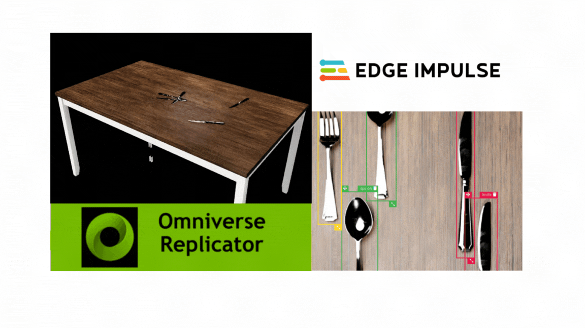

## Introduction

Building an accurate and high-quality object detection model can be tricky since it requires a large dataset. Sometimes, data can be hard to acquire, or not diverse enough to train a robust model. Synthetic data offers an alternative to generating well-represented datasets to build a quality model. By applying domain randomization, we developed photorealistic datasets, trained a neural network, and validated the model using real-world data. To create a diverse dataset, we created a variety of simulated environments with randomized properties: changing lighting conditions, camera position, and material textures. We also show that synthetic, randomized datasets can help generalize a model to adapt to the real-world environment.

## Story

We wanted to replicate the [object detection](https://www.youtube.com/watch?v=Vwv0PJPeC4s) work done by Louis Moreau, but this time using synthetic data rather than real data. The project aims to demonstrate how to build and deploy an Edge Impulse object detection model using synthetic datasets generated by Nvidia Omniverse Replicator. The Replicator is an Nvidia Omniverse extension that provides a means of generating physically accurate synthetic data.

## Why Synthetic Data?

Computer vision tasks such as classification, object detection, and segmentation require a large-scale dataset. Data collected from some real-world applications tend to be narrow and less diverse, often collected from a single environment, and sometimes data is unchanged and stays the same. In addition, data collected from a single field tends to have fewer examples of tail-end scenarios and rare events, and we cannot easily replicate these situations in the real world.

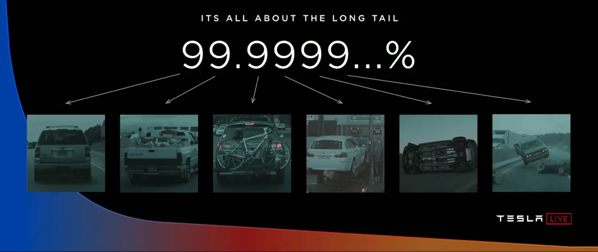

Consequently, models trained in a single domain are brittle and often fail when deployed in another environment; thus, it requires another training cycle to adapt to the new environment. It raises the question, how can we efficiently and cheaply collect generalized data across several domains? A simple effective solution is Domain Randomization, which varies the texture and colour of the foreground object, the background image, the number of lights in the scene, the pose of the lights, and the camera position etc. Domain randomization can further improve the variability in the texture of synthetic data of rare events generated in the simulator.

> The purpose of domain randomization is to provide enough simulated variability at training time such that at test time the model is able  to generalize to real-world data.” - Tobin et al, Domain Randomization for Transferring Deep Neural Networks from Simulation to the Real  World, 2017

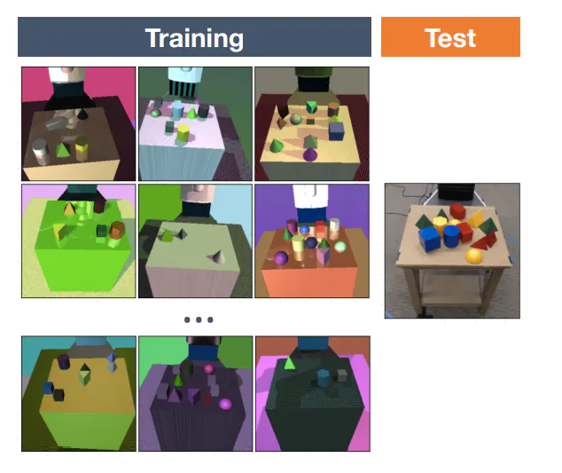

Nvidia Replicator enables us to perform Domain Randomization. The Replicator is one module within the Omniverse family, and it offers tools and workflow to generate data for various computer vision and non-visual tasks. The Replicator is a highly interoperable tool that integrates with over 40+ modelling/rendering applications across different verticals. The seamless integration is possible thanks to Pixar's Universal Scene Description (USD), which serves as a protocol for various applications such as Blender, 3DMax, Maya, Revit, C4D etc., to work with the Nvidia Replicator.

## Data-Centric Workflow
Traditional machine learning workflow is often model-centric, focusing more on the model's development by iteratively improving the algorithm design, etc. In this project, we chose the Data-centric approach, where we fixed the model and iteratively improved the quality of the generated dataset. This approach is more robust since we know our model is as good as the dataset. This method hence systematically changes the dataset performance on an AI task. At its core, it is thinking about ML in terms of data, not the model.

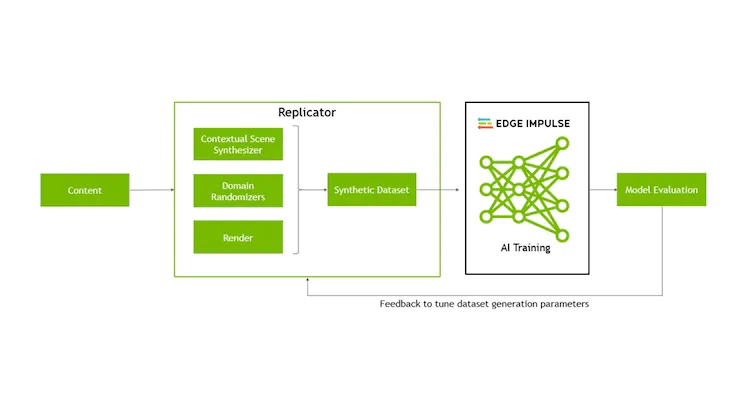

## Requirements
- Nvidia Omniverse Replicator 
- Edge Impulse Studio
- Logitech Webcam HD Pro - C920

### Hardware and Driver Setup

Nvidia Omniverse Replicator is a computation-intensive application requiring a moderate-size GPU and decent RAM. My hardware setup consists of 32GB RAM, 1TB storage space and an 8GB GPU with an Intel i9 processor.


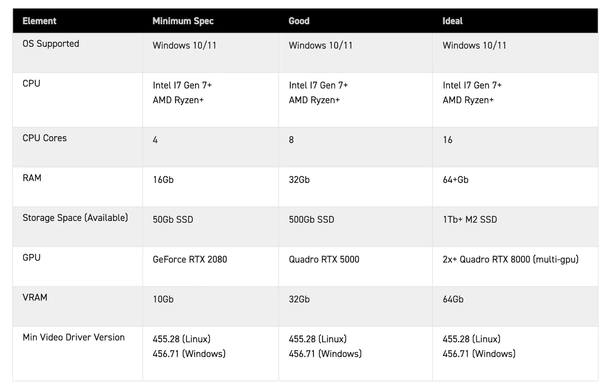

The application can run on both Windows and Linux operating systems. For this experiment, we used Ubuntu 20.04 LTS distro, given Ubuntu 18.04 is no longer supported by Nvidia Omniverse as of November 2022. In addition, we selected the appropriate Nvidia driver, v510.108.03 and installed it on a Linux machine.

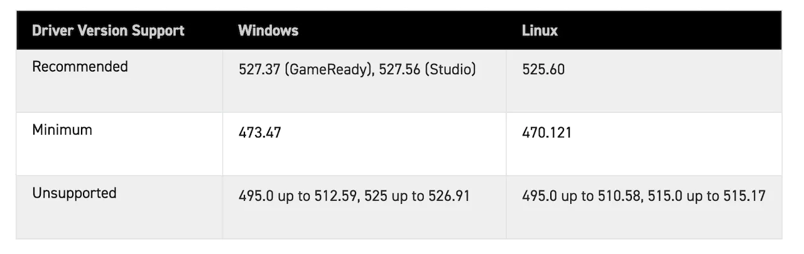

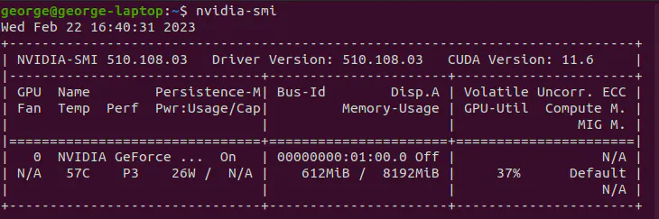

## Experiment Setup and Data Generation
The environment for the experiment consists of movable and immovable objects (dynamic and static positioning objects). The immovable object consists of Lights, a Table and two Cameras. The movable objects are the cutlery, which is a spoon, fork and knife. We will use domain randomization to alter the properties of some of the movable and immovable objects. Assets which include objects and scenes are represented in the Replicator as USD.

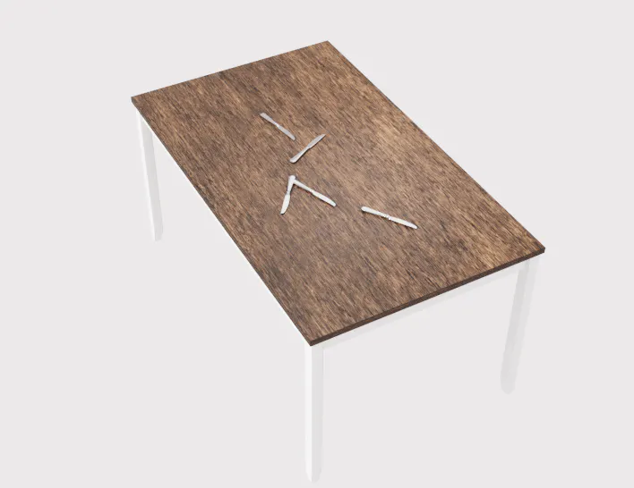

Every object in Omniverse Replicator is represented as USD. A 3D model file with varying extensions such as `.obj`, `.fbx`, and `.glif` can be imported into the Replicator using Nvidia Omniverse's CAD Importer extension. The extension converts the 3D files into USD. We imported our assets (table, knife, spoon, and fork) into the simulator by specifying the path of the assets.

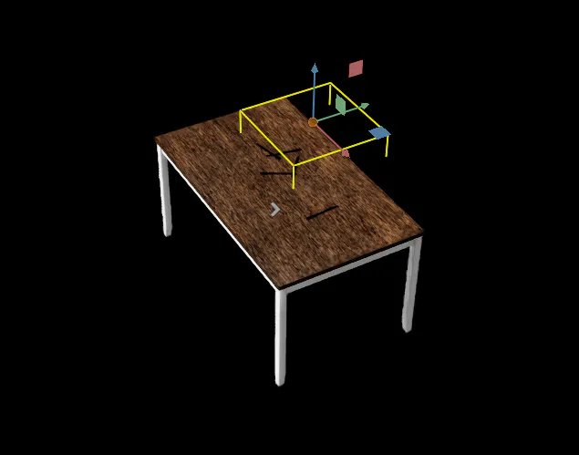

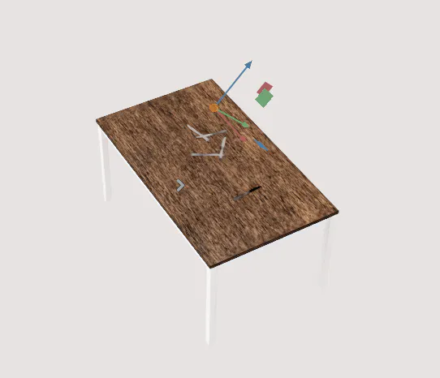

Lightning plays a crucial role in data generation. There are different built-in lighting types in the Nvidia replicator. We choose two rectangular lights and a dome light since they give us better lighting options and capabilities for generating photorealistic images. The rectangular light emulates light generated from a panel, and the dome light lets you dynamically lighten the entire scene. We randomized some light parameters such as temperature and intensity, and both parameters were sampled from a <strong>normal distribution</strong>. In addition, the scale parameter was sampled from a <strong>uniform distribution</strong> while keeping the rotation and position of the lights fixed.

```
python
# Lightning setup for Rectangular light and Dome light 

def rect_lights(num=2):
    lights = rep.create.light(
    light_type="rect",
    temperature=rep.distribution.normal(6500, 500),
    intensity=rep.distribution.normal(0, 5000),
    position=(-131,150,-134),
    rotation=(-90,0,0),
    scale=rep.distribution.uniform(50, 100),
    count=num
    )
    return lights.node

def dome_lights(num=1):
    lights = rep.create.light(
    light_type="dome",
    temperature=rep.distribution.normal(6500, 500),
    intensity=rep.distribution.normal(0, 1000),
    position=(0,0,0),
    rotation=(270,0,0),
    count=num
    )
return lights.node
```

We fixed the position and rotation, selected the tabletop materials, chose an additional <strong>Mahogany</strong> material, and alternated the material in the data generation process.

```
python 
# Import and position the table object

def table():
    table = rep.create.from_usd(TABLE_USD, semantics=[('class', 'table')])

    with table:
        rep.modify.pose(
            position=(-135.39745, 0, -140.25696),
            rotation=(0,-90,-90),
        )
    return table
```

To improve our dataset's quality further, we chose two cameras of different resolutions, which we strategically positioned in various locations within the scene. In addition, we varied the position of the cameras in a different version of the data generation process.

```python
# Multiple setup cameras and attach it to render products
camera = rep.create.camera(focus_distance=focus_distance, focal_length=focal_length, position=cam_position, rotation=cam_rotation, f_stop=f_stop)
camera2 = rep.create.camera(focus_distance=focus_distance2, focal_length=focal_length2, position=cam_position2, rotation=cam_rotation, f_stop=f_stop)

# Will render 1024x1024 images and 512x512 images
render_product  = rep.create.render_product(camera1, (1024, 1024))
render_product2  = rep.create.render_product(camera2, (512, 512))
```

Finally, for the movable objects, which include a knife, spoon, and fork, we ensure that these objects can only translate within the bound of the table. So we chose a bounding position where the objects were expected to translate and rotate with the table. We sampled position and rotation from a uniform distribution while maintaining the number of movable objects generated at each iteration to be five.

```
python 
# Define randomizer function for CULTERY assets.
    def cutlery_props(size=5):
        instances = rep.randomizer.instantiate(rep.utils.get_usd_files(current_cultery), size=size, mode='point_instance')

        with instances:
            rep.modify.pose(
                position=rep.distribution.uniform((-212, 76.2, -187), (-62, 76.2, -94)),
                rotation=rep.distribution.uniform((-90,-180, 0), (-90, 180, 0)),
            )
        return instances.node
```

At this juncture, we have instantiated all objects in our scene. We can now run the randomizer to generate 50 images at each synthetic generation cycle.

```
python
# Register randomization
with rep.trigger.on_frame(num_frames=50):
    rep.randomizer.table()
    rep.randomizer.rect_lights(1)
    rep.randomizer.dome_lights(1)
    rep.randomizer.cutlery_props(5)

# Run the simulation graph
rep.orchestrator.run()
```

To ensure we generated photorealistic images, we switched to <strong>RTXinteractive(Path Tracing)</strong> mode, which gave high-fidelity renderings.

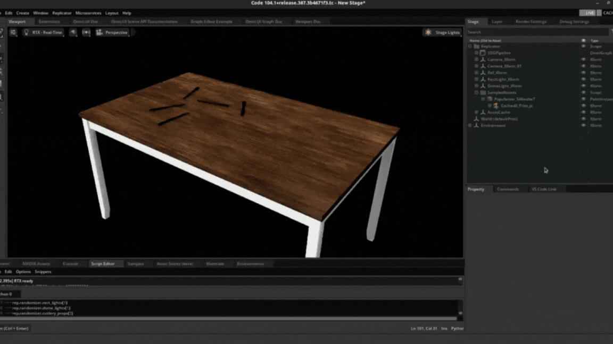

## Data Distribution and Model Building

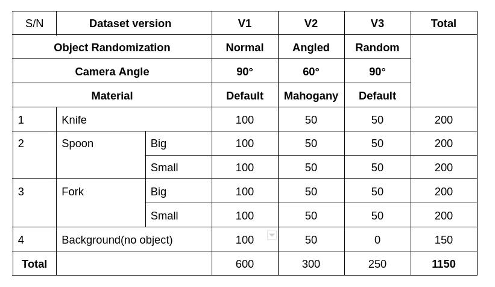

Following the data-centric philosophy, We generated three versions of the dataset. The first version, <strong>V1</strong>, consists of generated images normal to the camera position, and <strong>V2</strong> represents images generated at an angle of 60 degrees to the camera position with a mahogany table top. <strong>V3</strong> comprises images normal to the camera position while the cutlery were suspended in space.

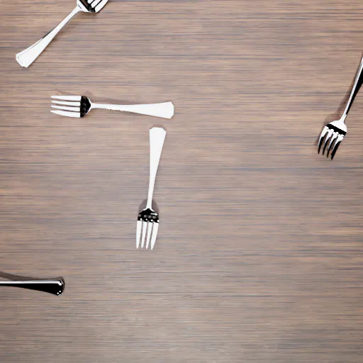

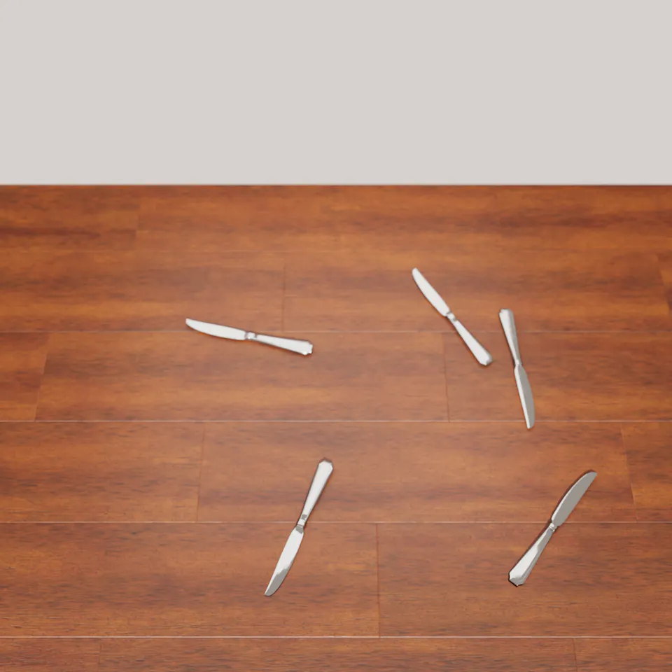

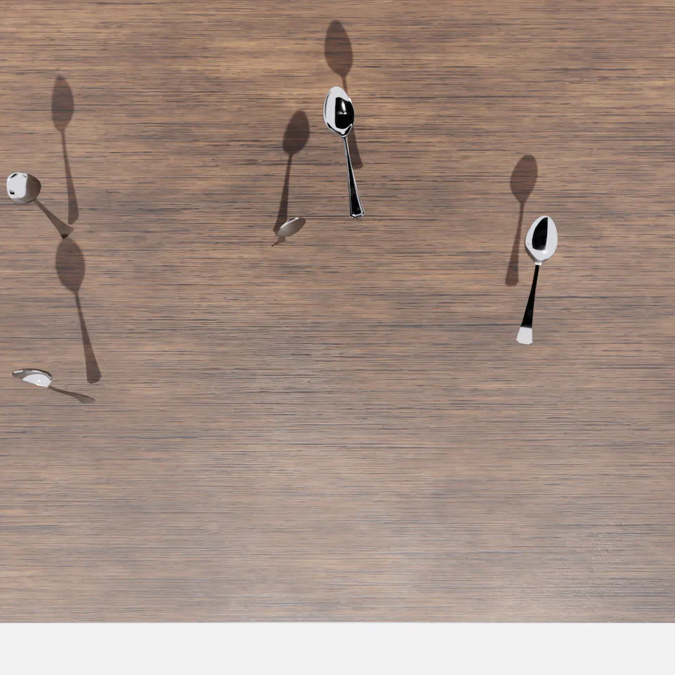

This resulted in the following Generated Dataset:

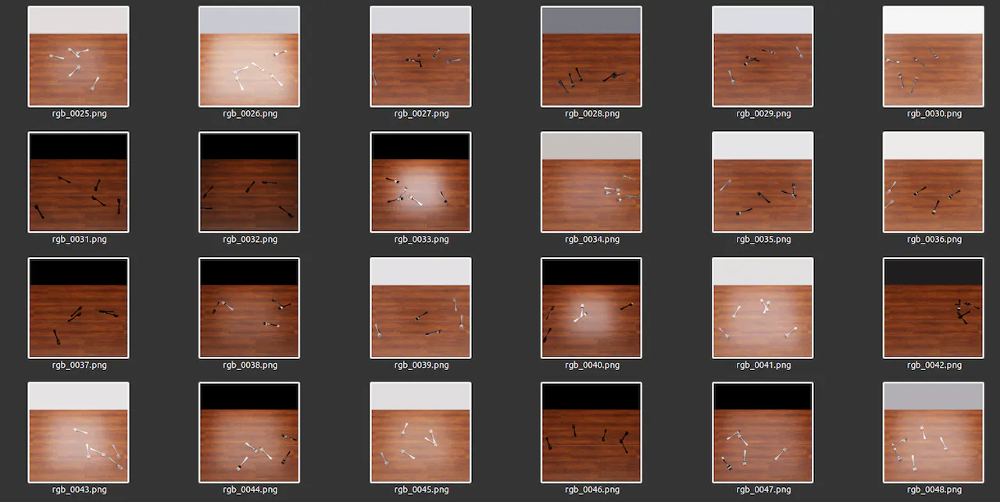

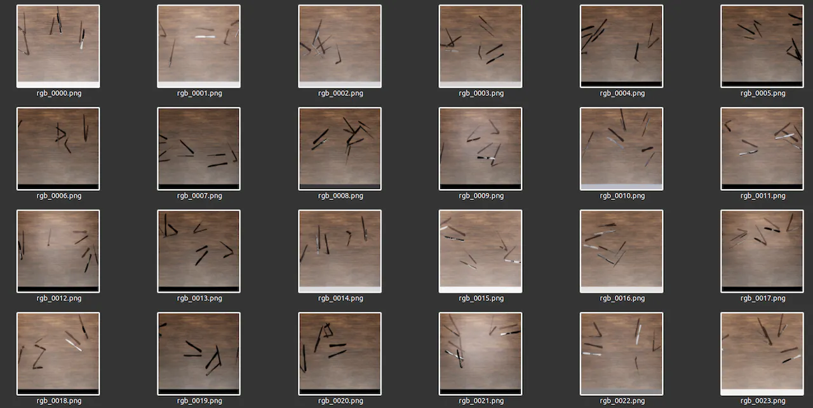

## Edge Impulse: Data Annotation and Model Building

<table>
  <tr>
     <td>Data Labeler </td>
     <td>Data Annotation</td>
  </tr>
  <tr>
    <td>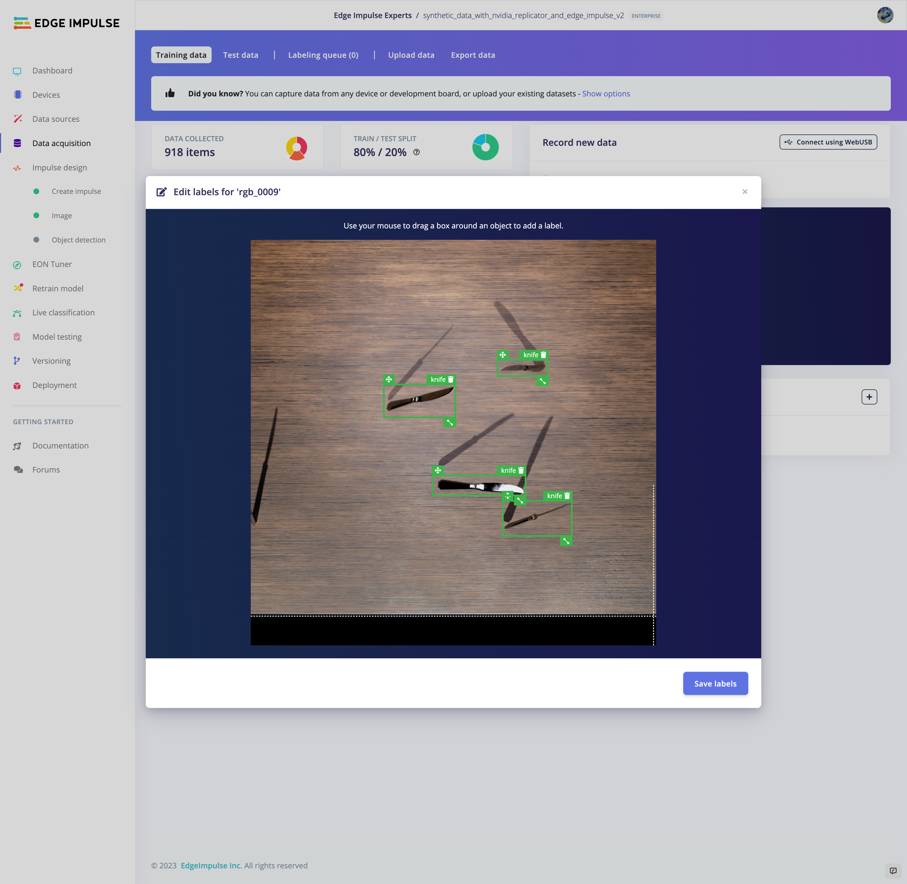</td>
    <td>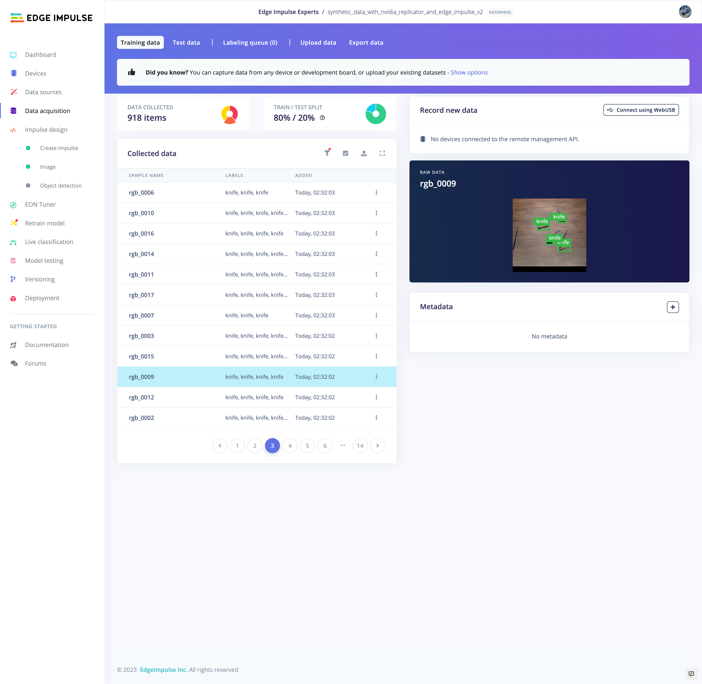</td>
  </tr>
 </table>

We uploaded the generated images to Edge Impulse Studio, where we annotated the dataset into different classes. We carefully annotated each dataset version and trained using the <strong>Yolov5</strong> object detection model. We tried a couple of input sizes ranging from 320, 512 and 1024 pixels before settling with <strong>320</strong>. Edge Impulse provided an excellent version control system for models, which enabled us to track model performance across different dataset versions and hyperparameters.

 <table>
  <tr>
     <td>Create Impulse</td>
     <td>Generate Feature </td>
  </tr>
  <tr>
    <td>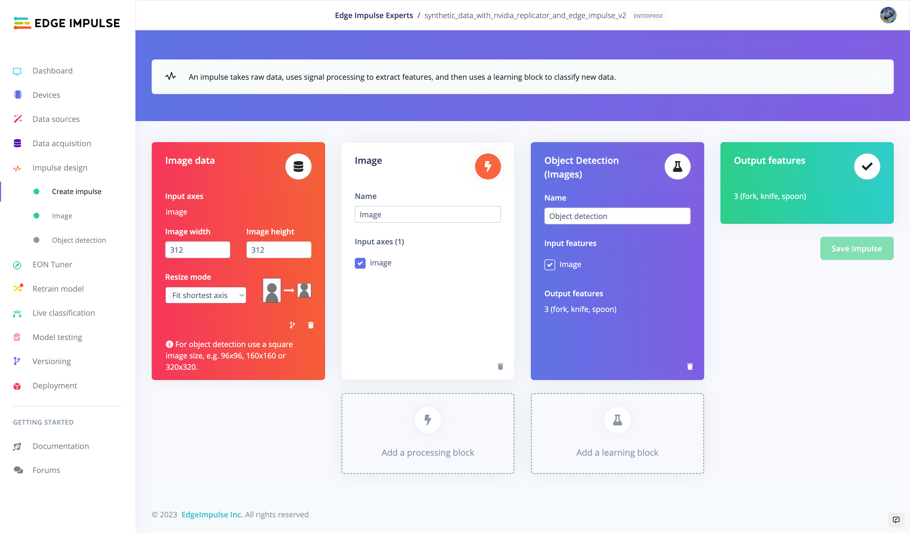</td>
    <td>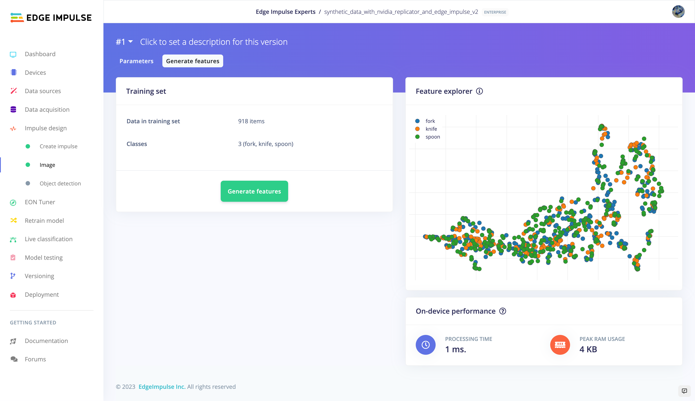</td>
  </tr>
 </table>

Version Control in Edge Impulse |
--- |
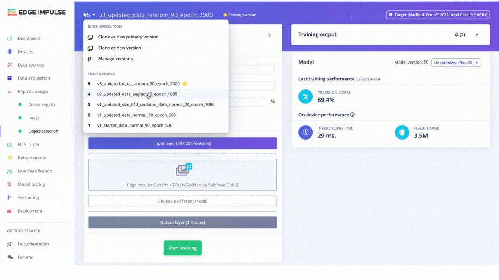 |

### Testing of Object Detection Models with Real Objects

We used the Edge Impulse CLI tool to evaluate the model's accuracy by downloading, building and running the model locally. A Logitech C920 webcam streamed the live video of objects on a table from 50 cm to 80 cm from the camera. The position of the camera remains fixed during the experiment. The clips below show that the trained model does not generalize well to real-world objects. Thus we needed to improve the model by uploading, annotating and training the model with the V2 dataset.

V1 failure - model failed to identify objects |
--- | 
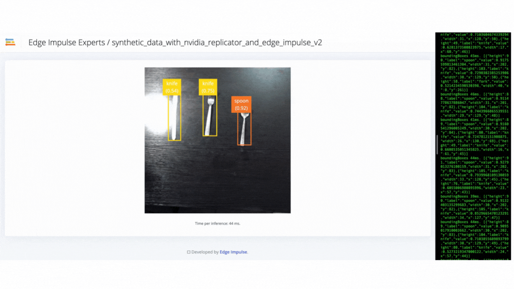 |

We observed improved model performance when trained with the V2 dataset. The model could identify various objects distinctly, although the model failed when we changed the objects' orientations. Thus, we trained the model with the remaining V3 dataset to mitigate these issues and increase other hyperparameters, such as epochs from 500 to 2000. We also tested the performance of our object detector on real objects with different background textures, and the model performed well in these conditions.
V2 success - model can identify objects |
--- |
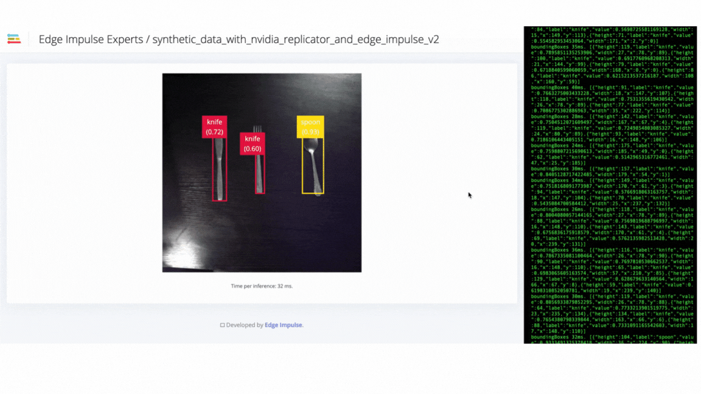 |

V2 failure - model failed to identify objects in different orientations |
--- |
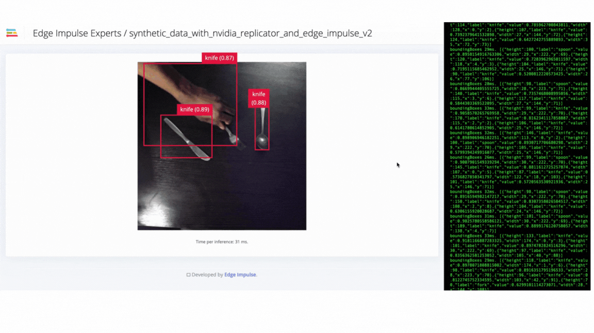 |


After several cycles of iterating over various hyperparameters, we got a model that generalizes well across different orientations.
V3 success - model can identify objects in different orientations   |
--- | 
 |

V3 success - model can identify different materials |
--- | 
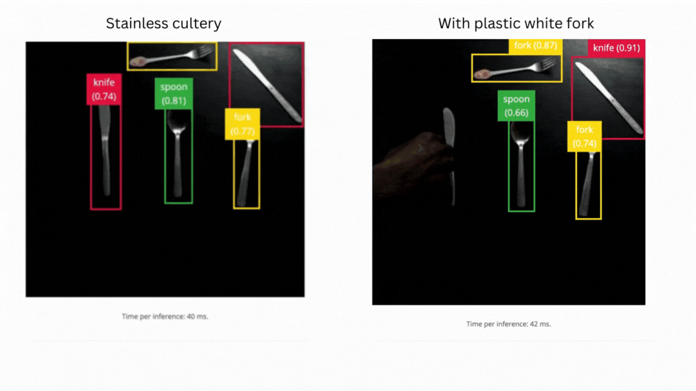 |


The core idea behind the data-centric approach to solving ML problems is to create more data around the failure points of the model. We improved the model by iteratively improving the data generation, especially in areas where the model had previously failed.


## Conclusion

In this work, we learned how the domain randomization approach helps generate quality and well-generalized datasets for the object detection task. We also demonstrated the effectiveness of data-centric machine learning workflow in improving the model performance. Although this work is restricted to visual problems, we can extend domain randomization to other sensors such as lidar, accelerometer, and ultrasonic sensors.

## Reference
- [Project on Edge Impulse](https://studio.edgeimpulse.com/public/187851/latest)
- [Introduction to Replicator](https://docs.omniverse.nvidia.com/app_code/prod_extensions/ext_replicator.html)
- [Introduction to USD](https://developer.nvidia.com/usd#usdnvidia)
- [Telsa AI Day](https://youtu.be/j0z4FweCy4M?t=5727)
- [Domain Randomization for Transferring Deep Neural Networks](https://arxiv.org/pdf/1703.06907.pdf)
- [Understanding Domain Randomization for SIM-TO-REAL Transfer](https://arxiv.org/pdf/2110.03239.pdf)

