# Delivered Packages Detection with Computer Vision

Created By:
Solomon Githu 

Public Project Link:
[https://studio.edgeimpulse.com/public/103841/latest](https://studio.edgeimpulse.com/public/103841/latest)

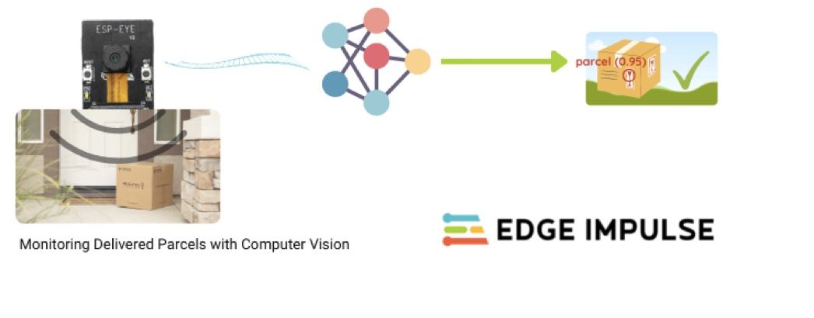

## Background

As ecommerce availability continues to expand worldwide, many people prefer to shop online and have their purchases delivered to their homes. As a result, package theft has increased along with more parcels being delivered. According to a recent [SafeWise](https://www.safewise.com/blog/metro-areas-porch-theft/) analysis, 210 million shipments will be stolen in 2021. In some cases, thieves follow delivery trucks and steal the package immediately when it has been delivered.

Although there are ways to prevent package theft, such as having packages delivered to the Post Office or giving the courier access to your home remotely, many individuals prefer door deliveries. However, we may not always be around to collect packages, or thieves may be quicker to do so!

## Monitor delivered packages with TinyML

There are a couple of techniques to prevent package theft, but we'll focus on parcels delivered to our front porches or mailboxes. We'll use Edge Impulse to create a Machine Learning model that recognizes parcels. The model will then be deployed on a low-cost, low-power device, the [ESP-EYE](https://www.espressif.com/en/products/devkits/esp-eye/overview) development board. This board has a 2MP camera that we will use to collect live video feeds of our shipments.

To develop our Machine Learning model, we will use FOMO (Faster Objects, More Objects). This is an algorithm developed by Edge Impulse to enable real-time object detection, tracking and counting on microcontrollers. FOMO is 30x faster than MobileNet SSD and runs in <200K of RAM. On a Raspberry Pi 4, live classification with FOMO achieved ~27.7 frames per second, while SSD MobileNetV2 gave ~1.56fps. 

## Things used in this project

### Hardware components

 - ESP-EYE Board

### Software

 - Edge Impulse Studio

## Quick Start

You can find the public project here: [Parcel Detection - FOMO](https://studio.edgeimpulse.com/public/103841/latest). To add this project into your account, click “Clone this project” at the top of the page. Next, go to “Deploying to ESP-EYE” section below to learn how to deploy the model to the ESP-EYE board.

Alternatively, to create a similar project, follow the next steps after creating a new Edge Impulse project.

## Data Acquisition

First, on the Project Dashboard, we set Labeling method to “Bounding boxes (object detection)”. 

We want our Machine Learning model to detect parcels in an image. To do this, we need pictures of parcels!  Note that our dataset only includes box parcels and not envelopes or poly-mailer bags. In total, the dataset has 275 images with an 80/20 split for train and test data. If you want to add more images to the dataset, Edge Impulse has an [Uploader](https://docs.edgeimpulse.com/docs/edge-impulse-cli/cli-uploader#upload-data-from-the-studio) that enables different ways of adding data to your project. Afterwards, make sure to perform a Train/test split to re-balance your dataset.

Next, we annotate the images and label a parcel in each image. 

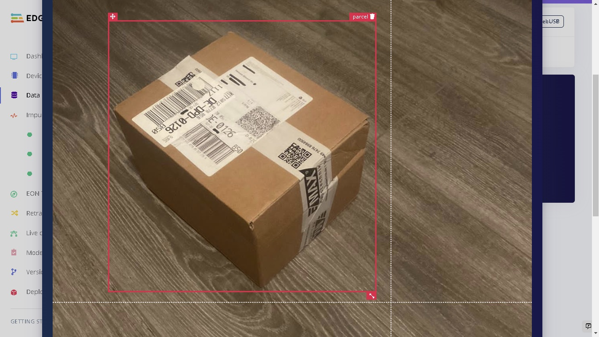

## Impulse Design

We can now use our dataset to train our model. This requires two important features: a processing block and learning block. Documentation on Impulse Design can be found [here](https://docs.edgeimpulse.com/docs/edge-impulse-studio/create-impulse).

We first click ”Create Impulse”. Here, set image width and heigh to 96x96; and Resize mode to Squash. The Processing block is set to “Image” and the Learning block is “Object Detection (images)”. Click ‘Save Impulse’ to use this configuration.

Since the ESP-EYE is resource-constrained device (4MB flash and 8MB PSRAM), we have used 96x96 image size to lower RAM usage. 

Next, we go to the processing block “Image” and set Color depth to Grayscale. "Save parameters", and this will open the “Generate Features” tab.

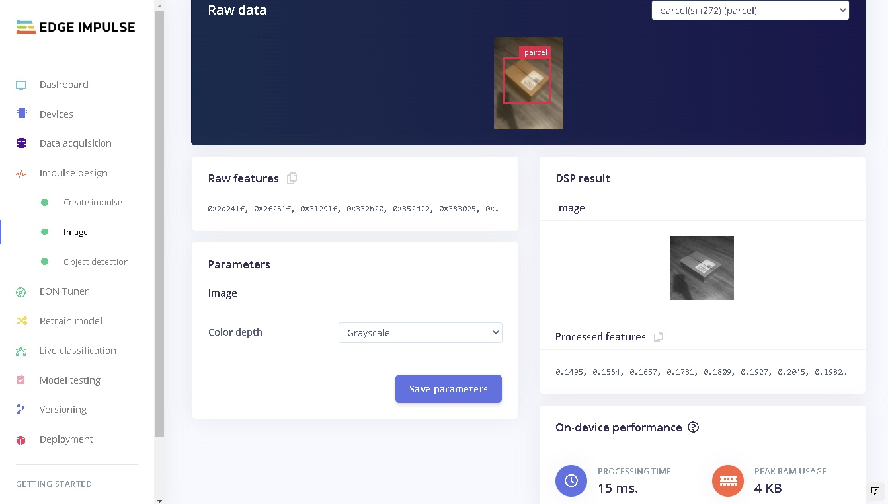

Next, we generate features from our training dataset by clicking “Generate features”.

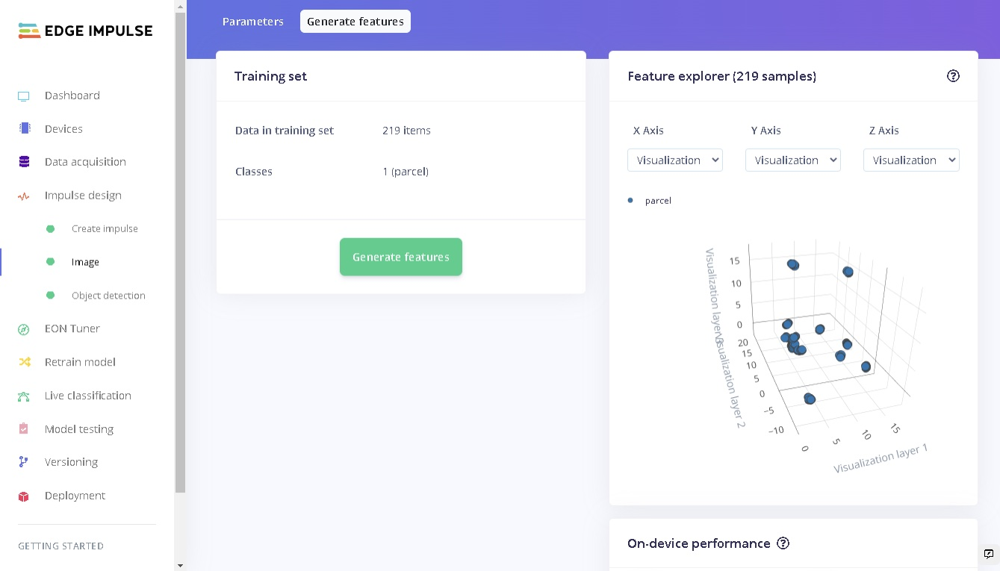

The last step is to train our model. We click “Object Detection” which is our Learning block. 60 training cycles with a learning rate of 0.001 were used for this project. We select the FOMO model, by clicking “Choose a different model”. 

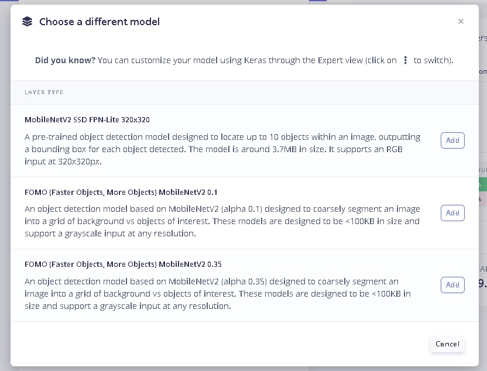

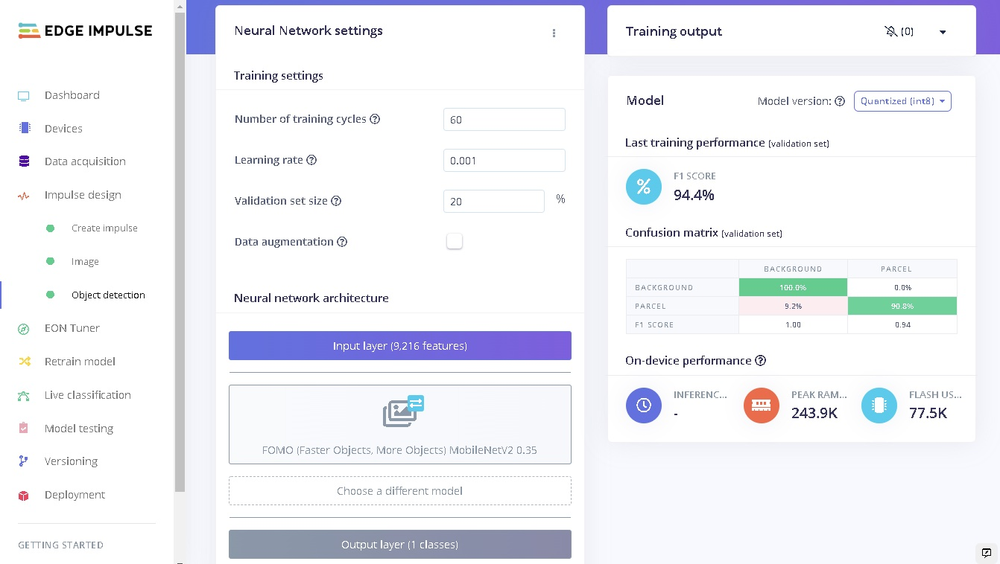

After training, the model has an F1 score of 94%. An F1-score combines precision and recall into a single metric.

## Model Testing

When training our model, we used 80% of the data in our dataset. The remaining 20% is used to test the accuracy of the model in classifying unseen data. We need to verify that our model has not overfit, by testing it on new data. If your model performs poorly, then it means that it overfit (crammed your dataset). This can be resolved by adding more dataset and/or reconfiguring the processing and learning blocks, and even adding Data Augmentation. If you need to increase performance a bit, some tips and tricks can be found in this [guide](https://docs.edgeimpulse.com/docs/tips-and-tricks/increasing-model-performance).

Click “Model testing” then “classify all”. Our current model has an accuracy of 91%, which is pretty good. 

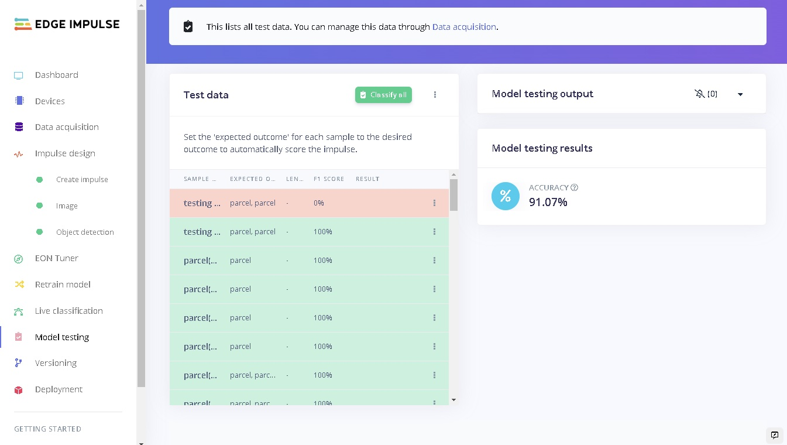

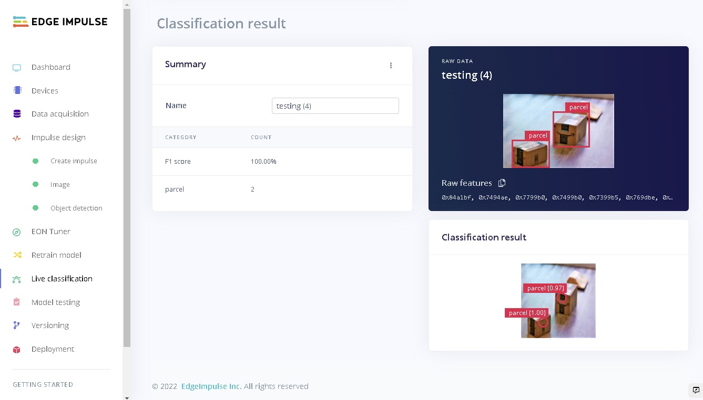

## Deploying to ESP-EYE board

To deploy our model, first go to the “Deployment” section. Next, under “Build firmware” we select Espressif ESP-EYE (ESP32) from the options. To increase performance on the board, we set “Enable EON Compiler” and chose “Quantized(int8)” optimization. This makes our model use 243.9K of RAM and 77.5K of Flash on the board. Chose “Build” and the firmware will be downloaded after the build ends.

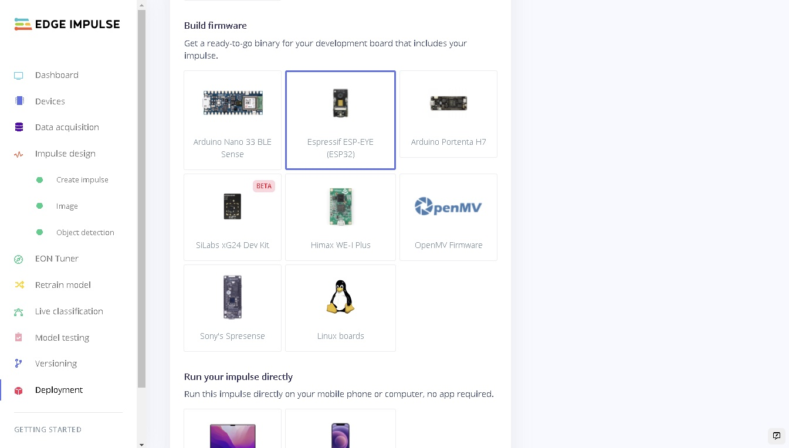

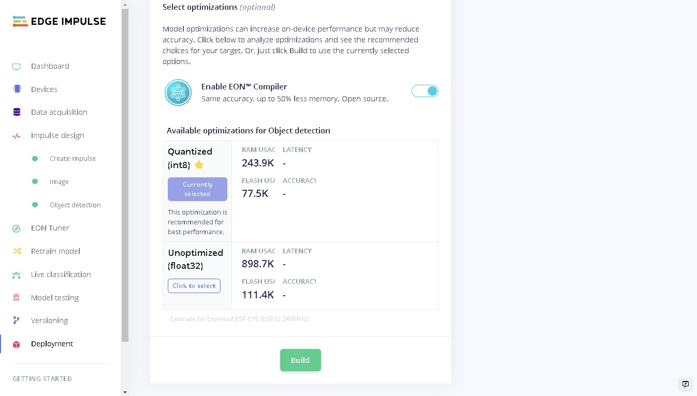

Connect an ESP-EYE board to your computer, extract the downloaded firmware and run the script in the folder, to upload it to your board. Great! Now we have our model on the ESP-EYE.

To get a live feed of the camera and classification, run the command: `edge-impulse-run-impulse --debug`

Next, enter the provided URL in a browser and you will see live feeds from the ESP-EYE.

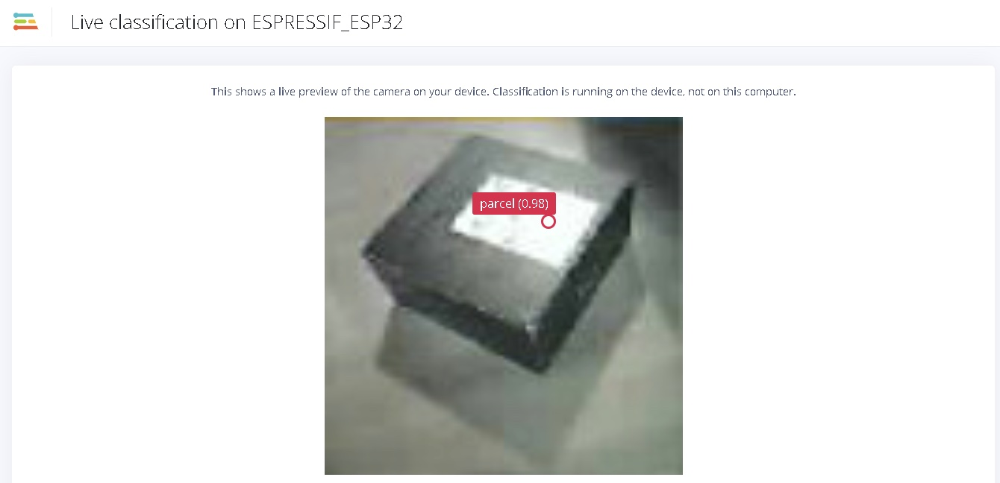

The ESP-EYE gives ~ 1 fps, using 96x96 image size. Using a 48x48 image size gives ~5fps, but the model is not accurate in this case. The performance can be related to the ESP-EYE being a constrained device with limited flash and RAM. Inference has a latency of ~850ms with 96x96 image, while ~200ms with a 48x48 image. Larger images have more bytes that need to be processed, while in lower resolutions useful data for object-detection is collapsed, thus resulting in the poor accuracy. 

For this use-case of monitoring a front porch, taking one picture every second from ESP-EYE, and analyzing it, is acceptable. However, you can also target higher performance MCUs. FOMO firmware is currently compatible with various boards such as Arduino Nano 33 BLE Sense with a camera, Portenta H7 with a Vision Shield,  Himax WE-I Plus, OpenMV, Sony’s Spresense, and Linux-based dev boards. You can also build the model as a library (C++, WebAssembly, TensorRT, Ethos-U, OpenMV, CubeMX, Simplicity Studio Component) and run it on any device!

## Taking it one step farther

We can use this model to monitor delivered parcels, and take some actions such as sounding an alarm or sending a text message when no parcel, or fewer parcels are detected. 

A build library will allow us to add custom code to the predictions. We can check if one or more parcels are predicted, save the count, and then monitor the predictions count. If predictions count goes down, that means a parcel(s) is missing and we can raise an alarm using our development board, and even send a signal to other home automation devices such as security cameras or alarms.

Edge Impulse has also developed a feature that enables sending an SMS based on inference from our model. This feature works with Development boards that support Edge Impulse for Linux, such as the Raspberry Pi. The repository and documentation can be found [here](https://github.com/zebular13/example-linux-with-twilio).

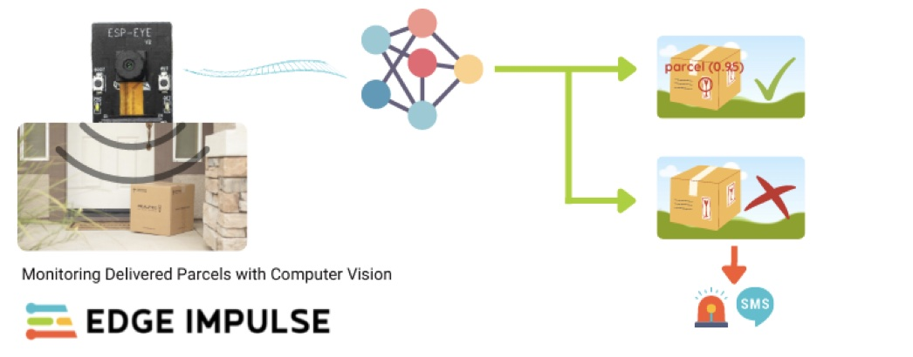

## Conclusion

Developing Machine Learning models with [Edge Impulse](https://www.edgeimpulse.com/) has always been easy! We have seen how we can create a Machine Learning model capable of detecting parcels, but also run it on a constrained-MCU such as the ESP-EYE. FOMO was chosen in this project so that the model could be small, and also fast! We can now monitor packages easily, with minimal cost and power requirements.

This demonstrates the massive  potential that TinyML offers to make the world smarter and solve endless problems. Knowledge on deep learning and microcontrollers is not known by everyone, but the Edge Impulse platform provides easy, smarter and faster tools that we can use to create and build edge ML solutions quickly.

