# Patient Communication with Gesture Recognition 

Created By:
Manivannan Sivan 

Public Project Link:
[https://studio.edgeimpulse.com/public/147925/latest](https://studio.edgeimpulse.com/public/147925/latest)

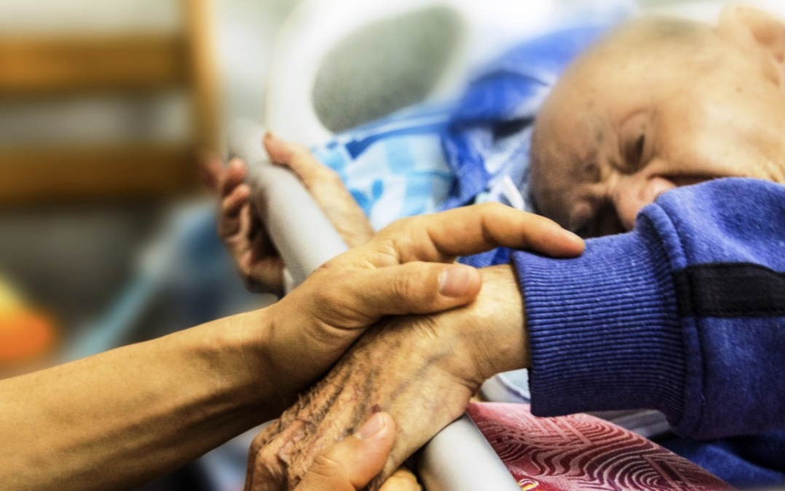

## Problem Statement

Some hospital patients, elderly people, or patients require constant monitoring might need support at any time.  However, they may have difficulty communicating due to injuries, mental ability, energy level / effort, glucose level, or other reasons.  It can also be challenging for caretakers to tend to all patients.

## TinyML Solution

I have created a wearable using a SiLabs Thunderboard Sense 2, which can be fitted to the patient’s finger. The patient can call the caretakers by tapping their finger, or rotating it, and the tinyML model running on the hardware will predict the gesture and communicate to the caretakers through BLE communication. The caretakers can get notified in the Light Blue Application on their devices.

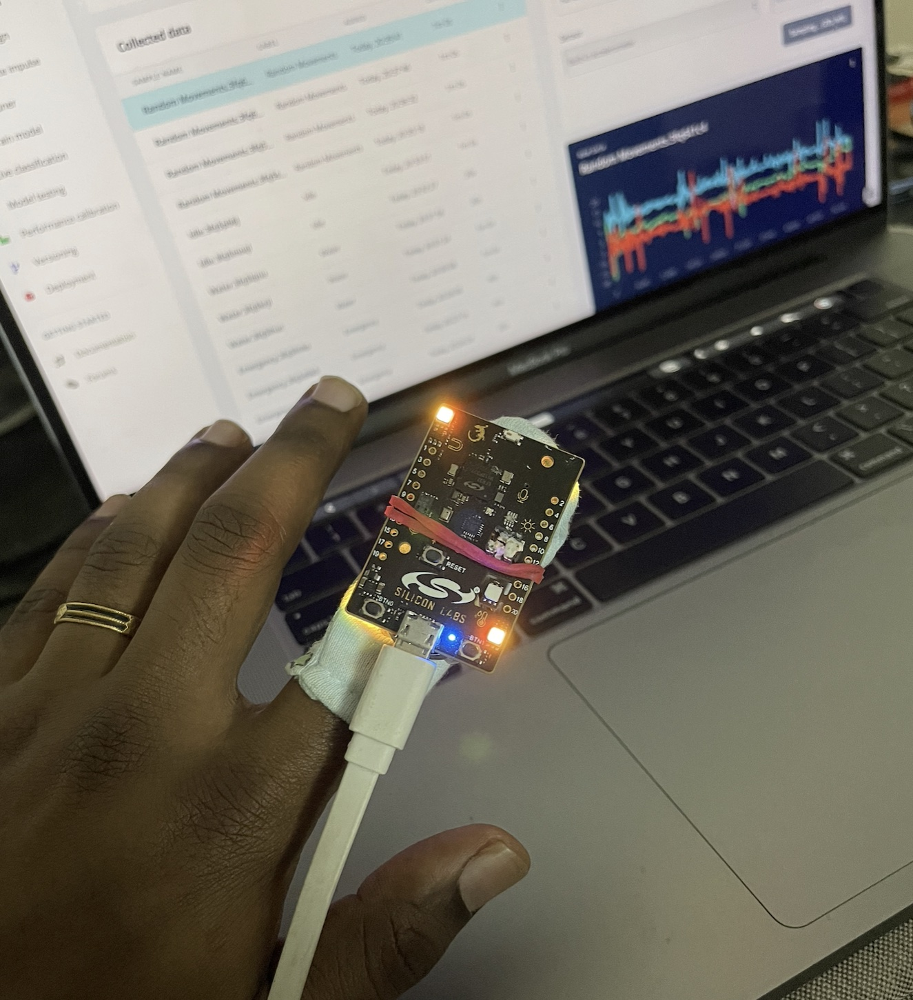

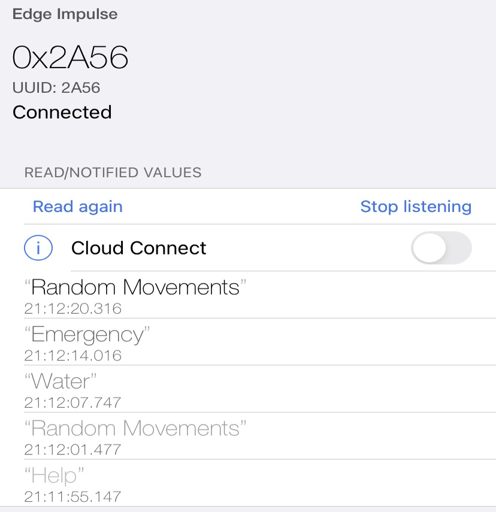

I have trained a model with different tap actions and normal hand movements, so that it can classify the normal movements and emergency tap options.

The model will predict an action in any of these categories:

- Help
- Emergency
- Water 
- Idle
- Random Movements 

Now let’s see how I trained the model and tested it on real hardware in detail.

## Data Acquisition

Connect the Thunderboard Sense 2 board to your system and flash the firmware from this link: 

[https://docs.edgeimpulse.com/docs/development-platforms/officially-supported-mcu-targets/silabs-thunderboard-sense-2](https://docs.edgeimpulse.com/docs/development-platforms/officially-supported-mcu-targets/silabs-thunderboard-sense-2)

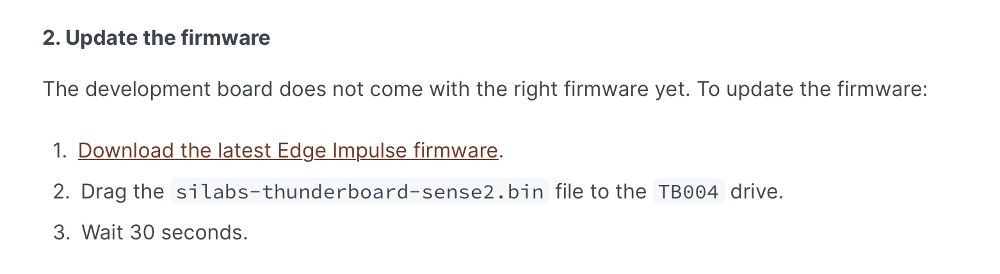

Once it is flashed, run the below command:

`edge-impulse-daemon`

Now your board is connected to your Edge Impulse account. I have used a cloth finger cover and attached the SiLabs board with a rubber band.

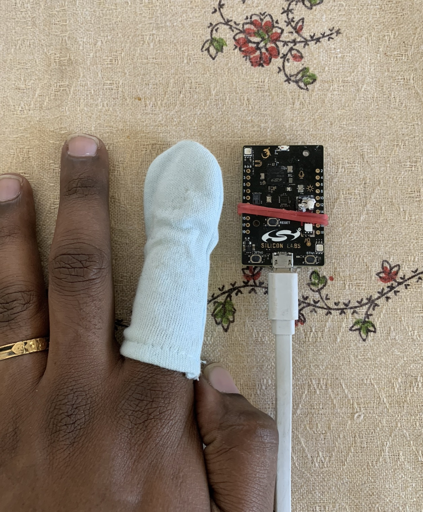

### Help

To get any support from caretakers, the patient can use this gesture.

For gesture - "Help", I have just tapped my hand on the flat surface gently with 1 second delay.
Let's say for each second, I have done one tap action. I have collected 2 minutes of "Help" data for training and 20 seconds of data for testing.

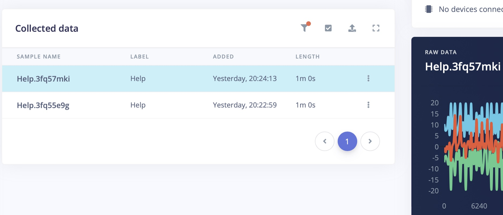

### Emergency

For "Emergency" action, I have continuously tapped the finger with a SiLabs board on a flat surface for five times without any delay.  I repeated this process for about 2 minutes to collect enough training data, and another 20 seconds for testing data.

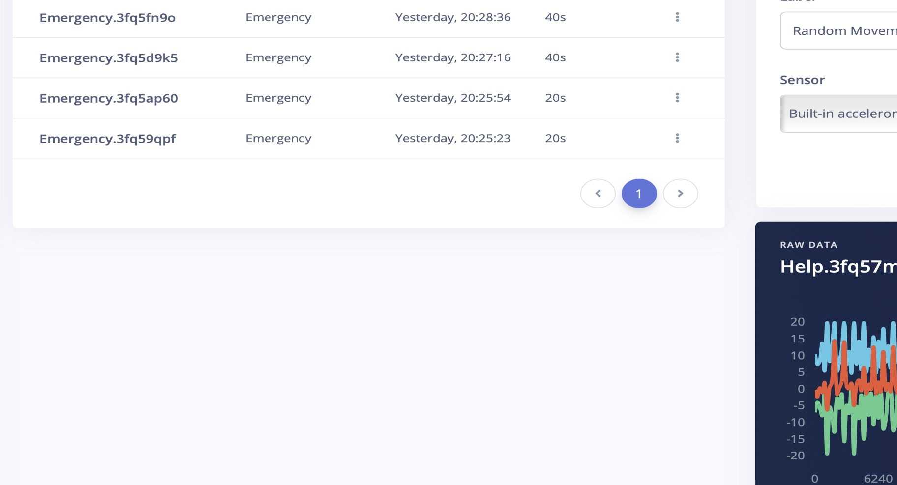

### Water

For basic needs like water, food etc. the patient can use this gesture to communicate.  This helps caretakers understand the needs in advance and bring water to them.

Lift the hand slightly from the surface, and move it sideways left and right a few times. Again, I have collected 2 minutes of data for model training, and 20 seconds data for testing.

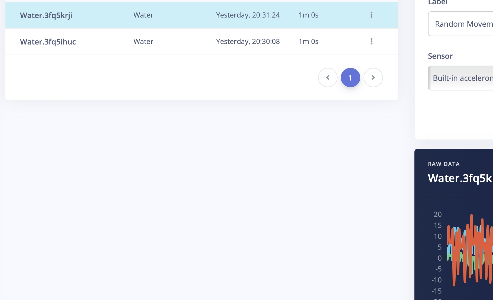

### Idle

Idle action is when the patient is sleeping or keeping their hands idle for some time. This data is collected and trained so that it is differentiated from other actions.

### Random Movements

The model is trained on other movement data like walking, combing hair, getting a drink, etc. Again this is for differentiation.

## Create Impulse

Now we have 10 minutes and 20 seconds of data. And the data is split into a 84:16 ratio as training and testing data.

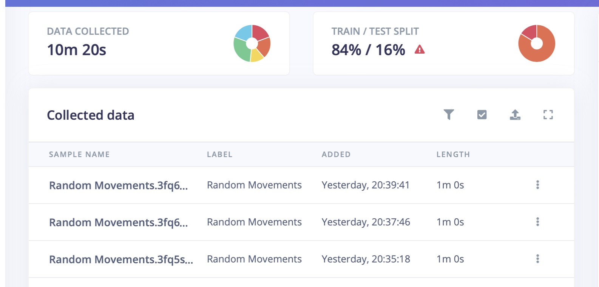

In the Create Impulse section inside the Edge Impulse Studio, the sampling window size is set to 4000ms and window increase size also increases to 4000ms.

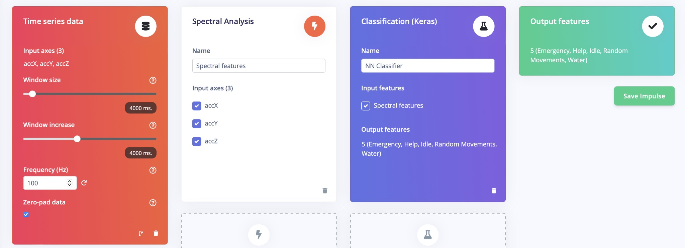

I have selected spectral features as a preprocessing block, and the Generated Features are shown below:

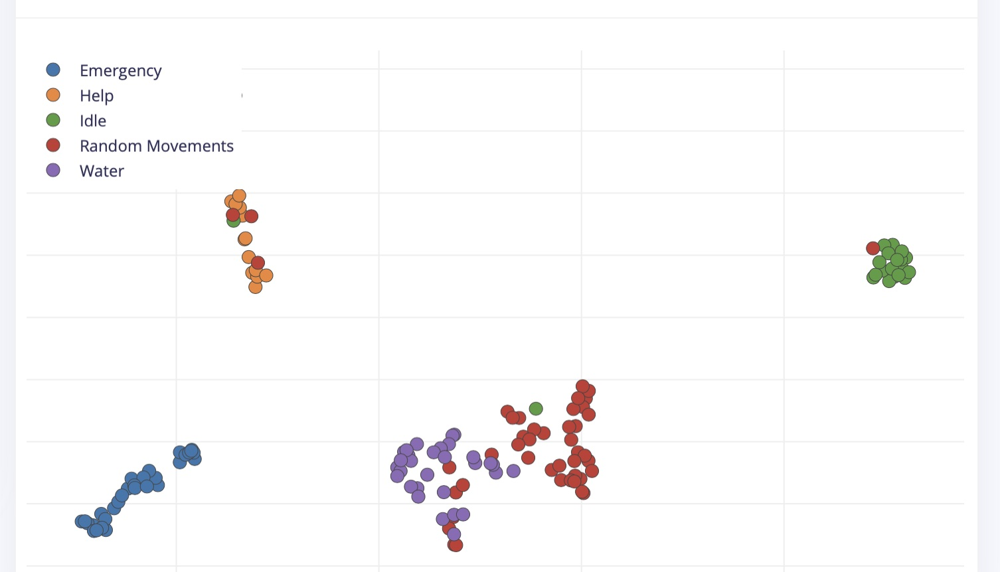

## Model Training

In Model training, I have used sequential dense neural networks, and the learning rate is set to 0.0005 and the training cycle is 100.

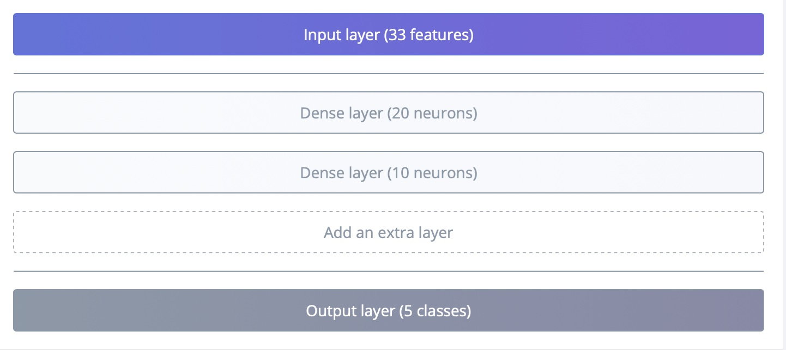

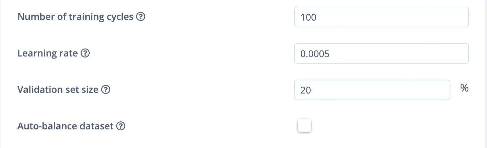

## Model Accuracy

After training, the model achieved 100% accuracy, and the F1 score is listed below:

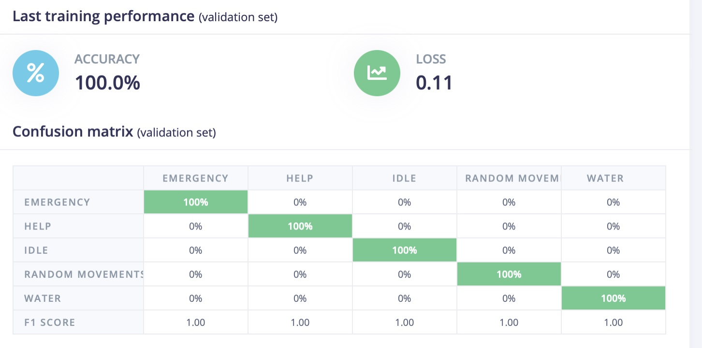

## Model Testing

In Model testing, I have used the Testing data that we set aside earlier.

The model achieved 96% in model testing data. This data was completely new and not used in training sessions. The decrease in model accuracy that we noticed does sometimes happen, in this case it looks like some of the "Random" movements were identified as "Help" actions.

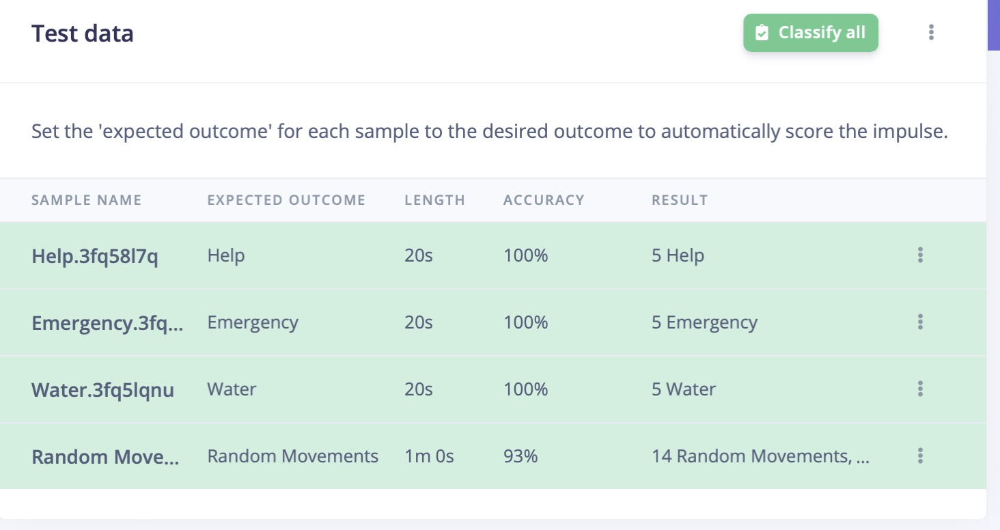

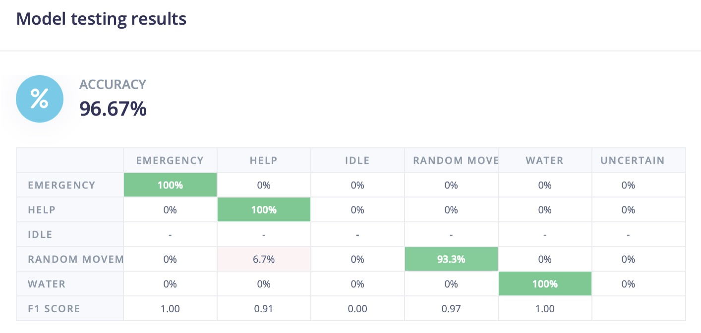

## Deployment

Go to the Deployment section and select Firmware option - Thunderboard Sense 2.  This will download the firmware to your system.

Once the Firmware file is downloaded, copy the `.bin` file and paste it in the `TB004` drive. This will flash the software onto the Thunderboard Sense 2 board. Once it is flashed, reset the board. Connect the 3v battery into it.

## Testing the Device

To test out a real scenario, download the LightBlue App from the Apple App Store or Google Play Store. This app will be used to communicate with the Thunderboard Sense 2.

Open the App and connect to the Edge Impulse service (Make sure board is powered up).

Change a few settings in the app:

- Subscribe to the 2A56 characteristic.
- Decode the message as UTF8 (click on HEX in the top right corner in LightBlue to switch).
- Connect the wearable to your finger and start performing the different gesture actions.

Enable the "listening" option in the app, as well. You will be notified only when the previous prediction result differs from the current prediction result.

Sample results in the LightBlue app are shown below:

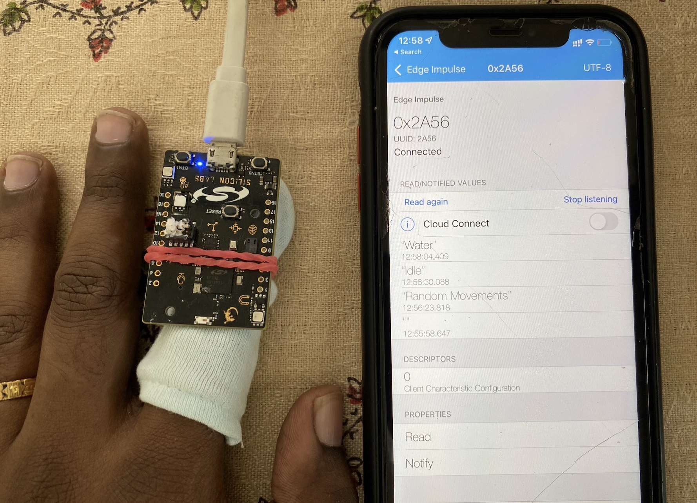

For every action , the predicted result with a timestamp is displayed in the app.

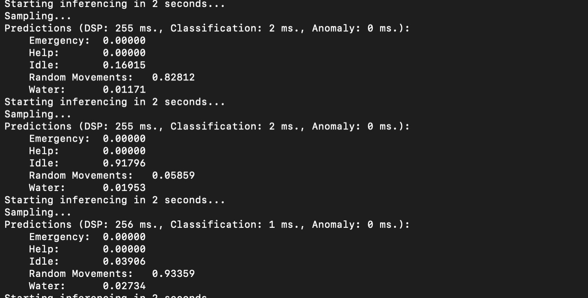

## Summary :

This TinyML-based wearable can be used by patients who can't easily communicate with caretakers for various reasons.
