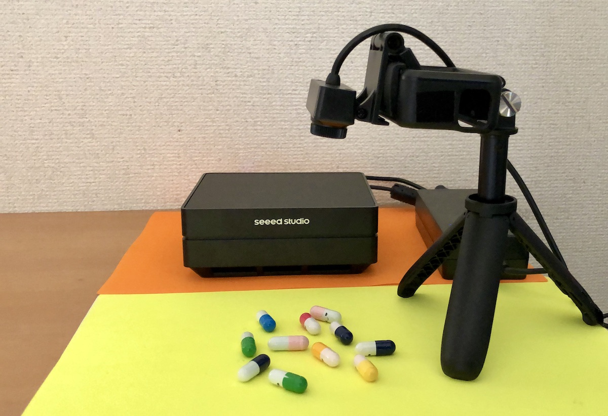
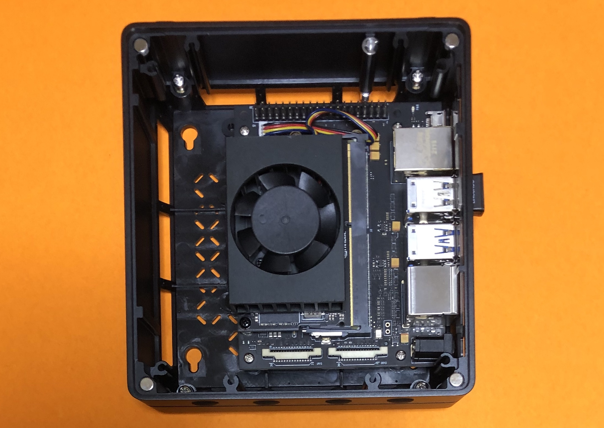
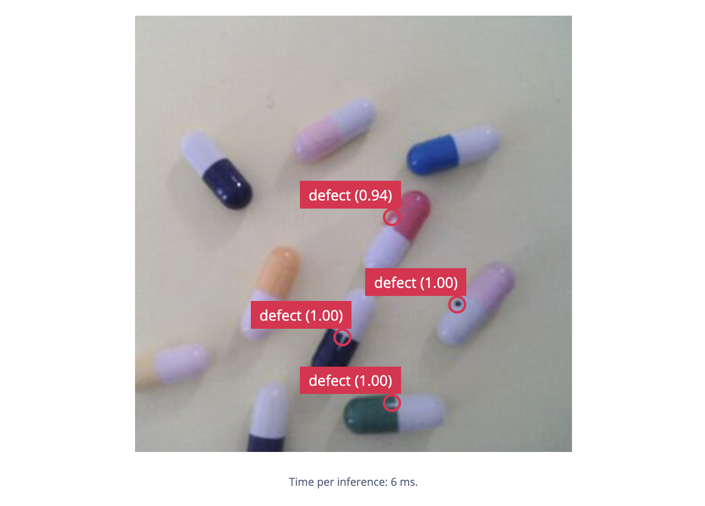
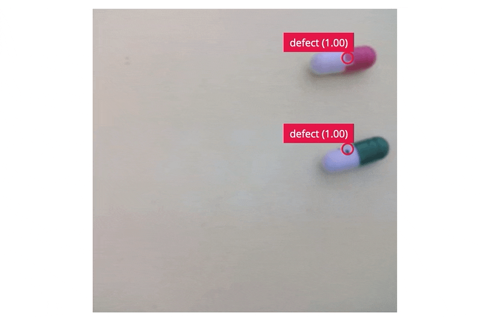

# Pharmaceutical Pill Quality Control and Defect Detection

Created By: Naveen Kumar

Public Project Link: [https://studio.edgeimpulse.com/public/172491/latest](https://studio.edgeimpulse.com/public/172491/latest)

## Project Demo



## Overview



Despite fast technological progress, pharmaceutical industries still face several problems in drug manufacturing. The conventional manufacturing process of drugs involves the possibility of human-made errors and it is not cost-effective in terms of time spent on the verification. Computer vision for quality control in automated manufacturing systems can help significantly in this task by checking for broken or imprint errors on the pills. In this project, I built a proof-of-concept of an anomaly detection system for pharmaceutical pills (capsules) using the **Edge Impulse FOMO** (Faster Objects, More Objects) algorithm. As the medication makes its way through the production line, images are taken using a web camera and transferred to a **Seeed Studio reComputer** (Jetson Xavier NX module) which processes the image using the algorithm designed to check if the pills have any anomalies. Real-time inferencing can be monitored remotely using a web browser over a WiFi network.

## Hardware Setup

This project requires high-speed inferencing in real-time to detect defects and assist the manufacturing process. The reComputer Jetson Xavier NX (8GB RAM) is used for development, and deployment as well. A 5-megapixel USB webcam is used to capture images. The headless reComputer is connected to a router using a USB WiFi dongle and is accessed using an SSH connection.



## Set up Development Environment

The reComputer comes with Ubuntu 18.04 and JetPack 4.6.2 preinstalled. To set this device up in Edge Impulse, `ssh` to the device and run the following command in the terminal.

```shell
$ wget -q -O - https://cdn.edgeimpulse.com/firmware/linux/jetson.sh | bash
```

## Data Collection

We are using a set of different color empty capsule shells for data generation. The pharmaceutical capsule shell consists of two pre-fabricated, cylindrical sections (a cap and a body) each of which has one rounded, closed-end and one open end. The body has a slightly lower diameter than the cap and fits inside the cap.


To imitate real types of defects, a dark spot on the body and crack or cuts on the cap brim are fabricated on a few samples. The normal capsule samples and plain base are treated as background and only defective samples are labeled with bounding boxes. Although in a real industrial setup there is a controlled illumination condition, we have captured the images with slightly different lighting conditions to generate resilient datasets. Also, it is assumed that in the production line (under the camera frame) there are no objects other than the background and the capsules.


We need to create a new project to upload data to Edge Impulse Studio.


With the camera connected to the reComputer run the following command.

```shell
$ edge-impulse-linux --disable-microphone
```

This will start a wizard which will ask you to log in. It will show a list of projects and we can select the newly created project from the list. Now go to the **Data Acquisition** page at the Edge Impulse Studio where we would be able to see the live camera feed in the **Training data** tab.


By clicking on the **Start sampling** button, we can capture the images for training. Now we can label the data with defects in the **Labeling queue** tab as shown in the GIF below.


We have collected 206 images; 167 images (80%) for training and 39 images (20%) for testing.


## Model Training

Go to the **Impulse Design** > **Create Impulse** page, click **Add a processing block**, and then choose **Image**, which preprocesses and normalizes image data, and optionally allows you to choose the color depth. Also, on the same page, click **Add a learning block**, and choose **Object Detection** (Images) which fine-tunes a pre-trained object detection model on your data. Since the defects are usually tiny, and knowing that the reComputer is a very powerful device, we are using a 320x320 image size for better resolution for detection. Now click on the **Save Impulse** button.


On the **Image** page, choose **RGB** as color depth and click on the **Save parameters** button. The page will be redirected to the **Generate Features** page.


Now we can start feature generation by clicking on the **Generate features** button.


After feature generation, go to the **Object Detection** page and click on **Choose a different model** and select **FOMO**. Then click on the **Start training** button. It will take a few minutes to complete the training.


## Why FOMO?

This project aims to use Edge Impulse Studio to collect data and train a model for the anomaly detection task. In the preliminary trials, the supported off-the-shelf image classification or object detection models perform poorly to detect tiny defects on the small capsules. Usually, Generative Adversarial Networks (GAN) or Autoencoder based models are used for anomaly detection for similar datasets. However, the Edge Impulse FOMO algorithm works quite well for the given task. FOMO uses an architecture similar to a standard image classification model which splits the input image into a grid and runs the equivalent of image classification across all cells in the grid independently in parallel. By default the grid size is 8x8 pixels, which means for a 320x320 image, the output will be 40x40 as shown in the image below.


For localization, it cuts off the last layers of the classification model and replaces this layer with a per-region class probability map, and subsequently applies a custom loss function that forces the network to fully preserve the locality in the final layer which essentially gives us a heat map of defects locations. FOMO works on the constraining assumption that all the bounding boxes are square and have a fixed size and the objects are spread over the output grid. In our case these assumptions are inherent and constraints become advantages.

## Confusion Matrix

Once the training is completed we can see the confusion matrix as shown below. For the unoptimized float32 model, the F1 score is 98.3% which is very good.


## Model testing

In the **Model testing** page, click on the **Classify all** button which will initiate testing with the trained float32 model. The testing accuracy is 89.74%.


## Model Deployment

To achieve the highest possible inferencing rate we will be running the model using the GPU on the Jetson Xavier NX. On the **Deployment** page, we will choose **NVIDIA TensorRT Library** from the **Deploy your impulse** section.


In the **Select Optimizations** section, we will choose the float32 model which has better latency though a bit bigger but we have plenty of memory available with the Jetson Xavier NX. The model build process starts after clicking on the **Build** button and will be downloaded automatically when complete.


We will be deploying the model in the executable **.eim** format that contains signal processing and machine learning code, compiled with optimizations for GPU plus an IPC layer (over a Unix socket). Execute the command below to set up the Linux C++ SDK and install OpenCV to build the **.eim** file.

```shell
$ git clone https://github.com/edgeimpulse/example-standalone-inferencing-linux
$ cd example-standalone-inferencing-linux 
$ git submodule update --init --recursive
$ sh build-opencv-linux.sh
```

Now unzip the downloaded model bundle from the Deployment step into this folder. For FOMO, we need to edit the variable in the source/eim.cpp file as shown below.

```
const char *model_type = "constrained_object_detection";
```

We can compile the **.eim** model with **TensorRT** using the command below.

```shell
$ APP_EIM=1 TARGET_JETSON_NANO=1 make -j
```

After the build process finishes, the `model.eim` file will be generated in the build directory.

## Run Inferencing

We will be using the [Edge Impulse command line tools](https://docs.edgeimpulse.com/docs/edge-impulse-cli/cli-overview) to run inferencing. Also, the Jetson Xavier NX power mode is changed to 20W (2 cores) for better utilization of the device.

```shell
$ sudo nvpmodel -m 6 && sudo jetson_clocks 
$ edge-impulse-linux-runner --model-file ./build/model.eim

[RUN] Starting the image classifier for Edge Impulse Experts / PPAD2 (v16)
[RUN] Parameters image size 320x320 px (3 channels) classes [ 'defect' ]
[RUN] Using camera ELECOM 5MP Webcam starting...
[RUN] Connected to camera
Want to see a feed of the camera and live classification in your browser? Go to http://192.168.3.12:4912
```

We can see the live inferencing in a web browser by using the URL in the output above.



The inferencing rate is around **165 fps** which is blazingly fast. Also, the detection seems to be working great while objects are moving.



## Conclusion

This project showcases an industrial use case for pharmaceutical pill defect detection using **Edge Impulse FOMO**, which can be reproduced with other similar kinds of datasets for anomaly detection. Although the project was created using a Seeed reComputer using a Jetson Xavier NX module with an Nvidia GPU to achieve a high inferencing rate, it can be ported easily to less powerful single-board computers with a reduced inferencing rate.
