# BrickML Demo Project - 3D Printer Anomaly Detection

Created By: Attila Tokes

Public Project Link: [https://studio.edgeimpulse.com/public/283049/latest](https://studio.edgeimpulse.com/public/283049/latest)

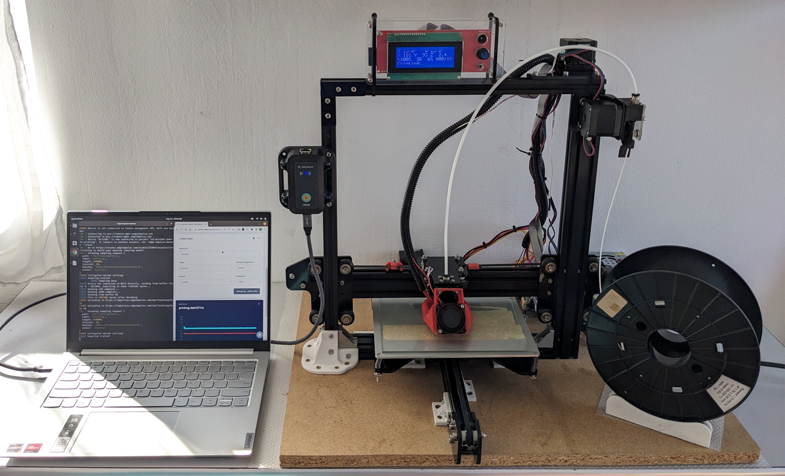

## Introduction

[**BrickML**](https://edgeimpulse.com/reference-designs/brickml) is a plug-and-play device from **Edge Impulse** and [**reloc**](http://www.reloc.it/), meant to be a reference design for Edge ML industrial applications. It is designed to monitor machine health, by collecting and analyzing sensor data locally using ML models built with Edge Impulse.

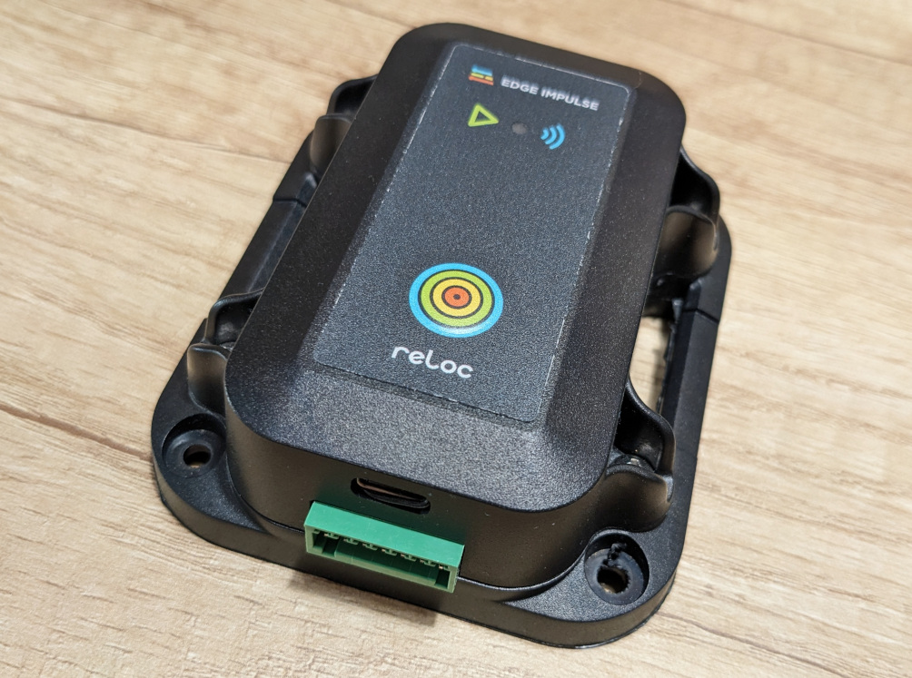

In terms of specifications BrickML comes with a powerful Cortex-M33 micro-processor, 512KB RAM and various storage options for code and data. It has CAN, LTE, UART, I2C and SPI interfaces, and supports wired and wireless connectivity over USB, Ethernet and Bluetooth 5.1. A wide selection of onboard sensors can readily be used in projects. We get a 9-axis inertial sensor (Bosch BNO055), a humidity and temperature sensor (Renesas HS3001), a digital microphone (Knowles SPH0641LU4H-1) and ADC inputs for current sensing.

BrickML comes with seamless integration with [Edge Impulse Studio](https://studio.edgeimpulse.com/). The device can be used both for data collection, experimentation and running live ML models.

## Getting Started with the BrickML

BrickML is designed to be ready to use out-of-the-box. All we need is connect the device to a Laptop / PC using the provided USB Type-C cable.

On the Laptop / PC we can use the [Edge Impulse CLI](https://docs.edgeimpulse.com/docs/tools/edge-impulse-cli) tool set to interact with the BrickML device. To install it follow the [Installation](https://docs.edgeimpulse.com/docs/tools/edge-impulse-cli/cli-installation#installation-linux-ubuntu-macos-and-raspbian-os) guide from the documentation.

Once the Edge Impulse CLI is installed, we connect to the BrickML by plugging it to an USB port, and running the `edge-impulse-daemon` command:

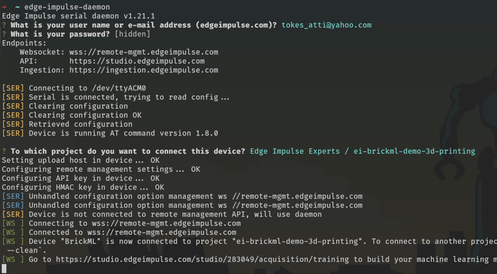

If we are not already logged in, `edge-impulse-daemon` will ask our Edge Impulse Studio email and password. After this the BrickML should be automatically detected, and we will be asked to choose a Studio project we want to use.

Once connected, the BrickML will show up in the Devices section of our Edge Impulse Studio project, and it should be ready to be used for data collection and model training.

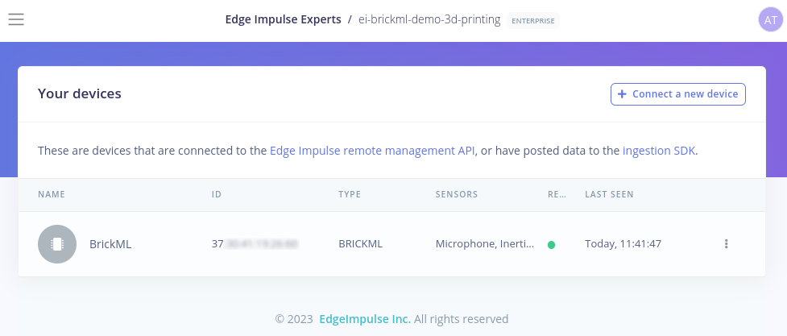

## 3D Printing Anomaly Detection

For the purpose of this tutorial, I choose to mount the BrickML on a 3D printer. The idea is use the BrickML for anomaly detection. For this, first we will teach the device how the 3D printer normally operates, after which we will build an anomaly detection model that can detect irregularities in the functioning of the 3D printer.

Installing the BrickML to the 3D printer was fairly easy. The BrickML comes in a case with four mounting holes that can be used to mount the device on various equipment. In the case of the 3D printer, I mounted the BrickML to the frame using some M4 bolts and T-nuts.

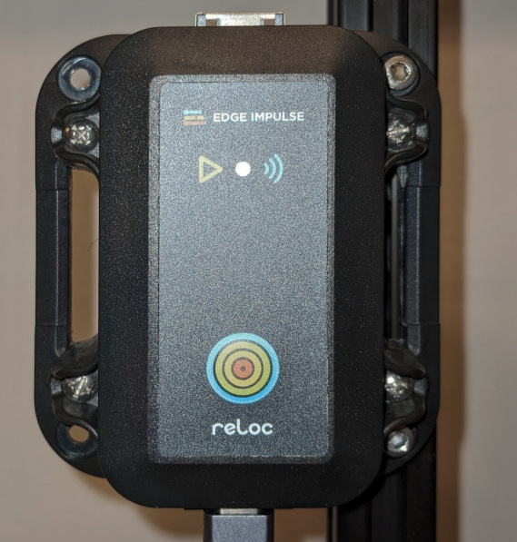

After the BrickML is mounted, we can go ahead an create a project from our [Edge Impulse projects page](https://studio.edgeimpulse.com/studio/profile/projects):

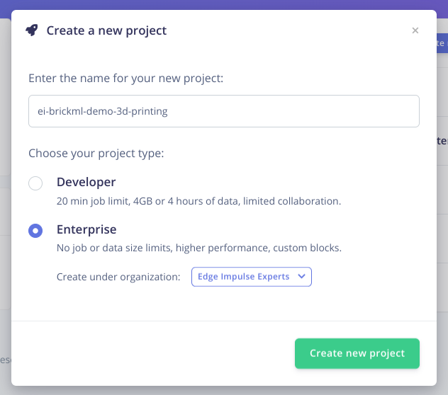

As some of the *(optional)* features we will use require an Enterprise account, I selected the aforementioned project type.

> *Note: the steps I will follow in this guide are generic, so it should be easy to apply them on similar projects.*

## Collecting Data

The first step of an AI / ML project is the data collection. In Edge Impulse Studio we do this from the **Data acquisition** tab.

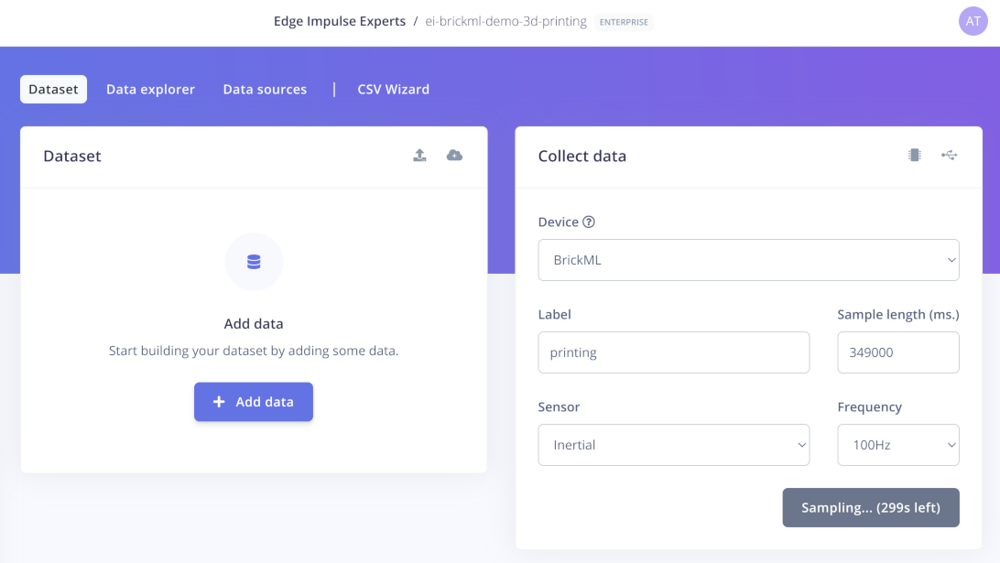

For this tutorial, I decided to collect Inertial sensor data for 3 labels, in large chunks of about ~5 minutes:
- **printing** - 7 samples, 35 minutes of data
- **idle** - 2 samples, 10 minutes of data 
- **off** - 1 sample, 5 minutes of data

In the `printing` class, I used a slightly modified G-code file from a previous 3D print, and re-played on the printer. The `idle` and `off` labels are a baseline to be able to detect when the 3D printer does nothing.

The collected samples were split into smaller chunks, and then arranged into Training and Test sets with close to 80/20 proportion:

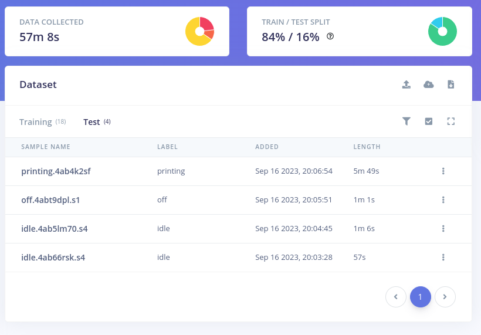


## Designing an Impulse

Now that we have some data, we can continue with the [**Impulse design**](https://studio.edgeimpulse.com/studio/283049/create-impulse) step. The [Impulse](https://docs.edgeimpulse.com/docs/edge-impulse-studio/impulse-design) represents our machine learning pipeline, which includes data collection, pre-processing and learning stages.

For this tutorial I went with the following blocks:
- [**Time Series Data**](https://docs.edgeimpulse.com/docs/edge-impulse-studio/impulse-design#input-block) input
   - with 3-axis accelerometer and gyroscope sensor data, 100 Hz frequency, 4 sec window size + 1 sec increase
- a [**Spectral Analysis**](https://docs.edgeimpulse.com/docs/edge-impulse-studio/processing-blocks/spectral-features) processing block 
   - to extract the frequency, power and other characteristics from the inertial sensor data
- a [**Classification**](https://docs.edgeimpulse.com/docs/edge-impulse-studio/learning-blocks/classification) learning block 
   - that classifies the 3 normal operating states
- an [**Anomaly Detection**](https://docs.edgeimpulse.com/docs/edge-impulse-studio/learning-blocks/anomaly-detection-gmm) learning block 
   - capable of detecting states different from normal operation
- **Output Features** consisting of 
   - Confidence scores for the 3 classes
   - Anomaly score that indicates unusual behavior

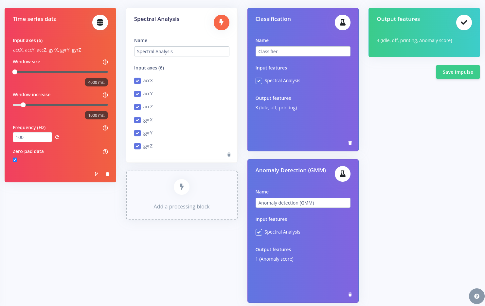

### Spectral Analysis

The [**Spectral Analysis**](https://docs.edgeimpulse.com/docs/edge-impulse-studio/processing-blocks/spectral-features)  processing block is used to extract frequency, power and other characteristics from the sensor data. It is ideal for detecting motion patterns in inertial sensor signals. In this project we are using it to process the accelerometer and gyroscope data.

Setting up Spectral Analysis is fairly easy. In most of the cases we can rely on Edge Impulse Studio to chose the appropriate parameters by clicking the  button:

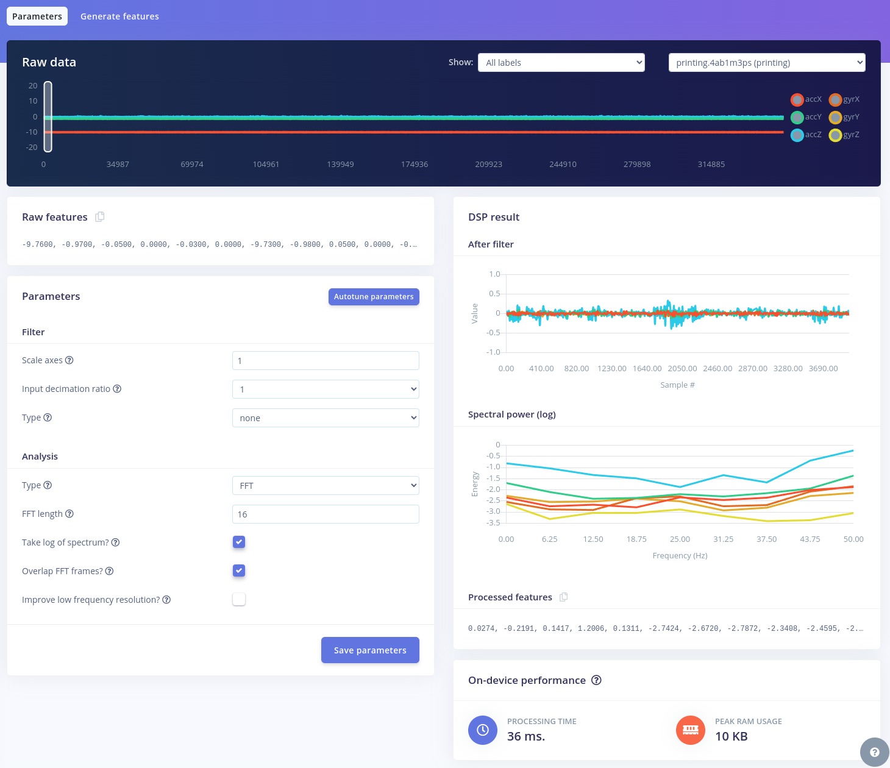

After saving the parameters, we can head over the Generate features tab and launch spectral feature generation by hitting the *"Generate features"* button. When the feature generation job completes, a visual representation of the generated features is shown in the Feature explorer section:

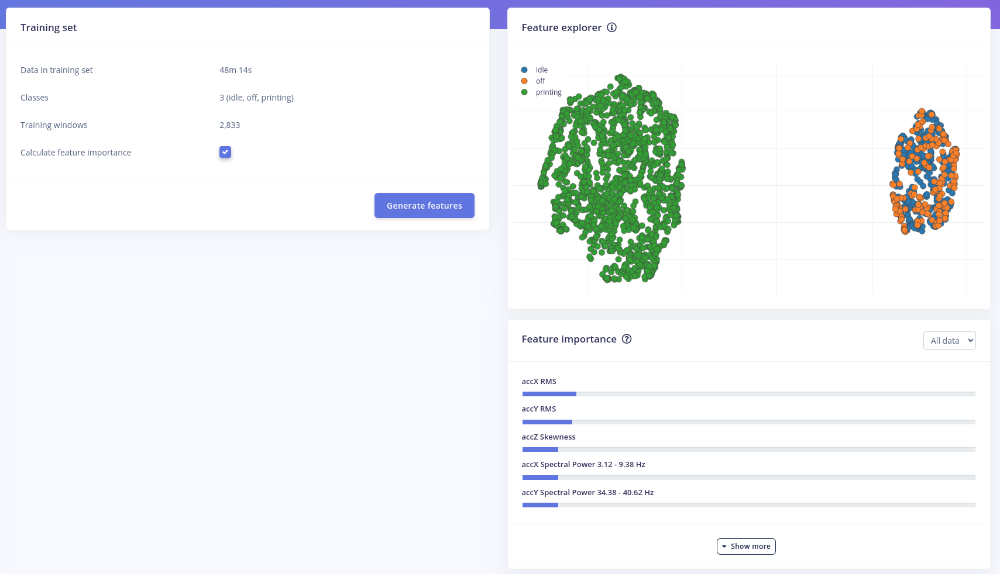

As we can see the features for the `printing`, and `idle` / `off` classes are well separated.

### Classification

After the feature generation the next step is to generate a Classifier. Here we will train a Neural Network using the default settings, which consists of an Input layer, two Dense layers, and an Output layer:

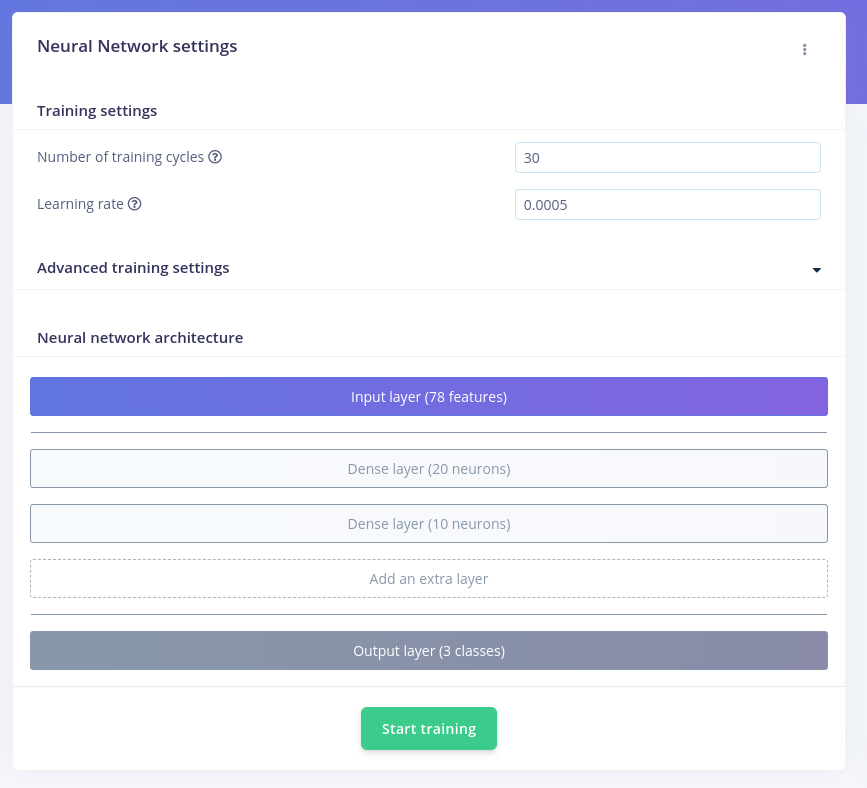

The training can be started by using the **"Start training"** button. After a couple of minutes we are presented with the results:

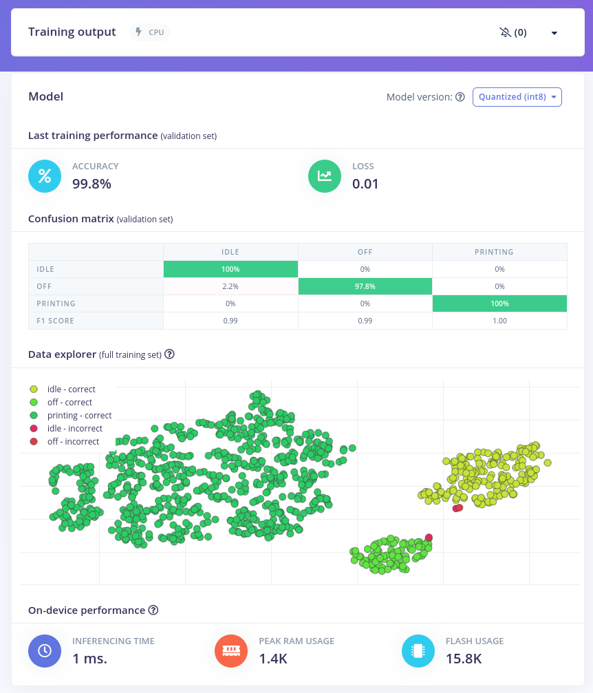

As we can see we obtained an accuracy of 99.8% with `printing`, `idle` and `off` states well separated. We have a small number of `idle` and `off` samples overlapping, but this is expected as the two categories are quite similar.

### Anomaly Detection

Anomaly detection can be used detect irregular patterns in the collected sensor data. In Edge Impulse we can implement anomaly detection using one of the two available anomaly detection blocks. For this project, I decided to go with the [**Anomaly Detection (GMM)**](https://docs.edgeimpulse.com/docs/edge-impulse-studio/learning-blocks/anomaly-detection-gmm) learning block.

In terms of parameters, we need to select a couple of spectral features we want to use for the anomaly detections. After a couple of tries, I went with 10 components with the RMS and Skewness values from the Accelerometer and Gyroscope sensors selected as features.

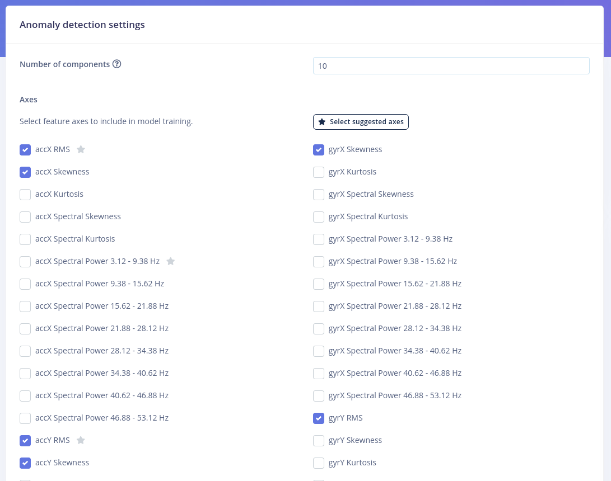

*Note: by default, the selection spectral power features for some specific frequency bins. I decided not to use these as it is not guaranteed that real world anomalies will contain these certain frequencies.*

After setting the parameters, the anomaly detection is trained in the usual way, by clicking the *"Start training"* button.


In the output we should see that the samples for known classes are in well separated regions. This means the model will be able to easily detect irregularities in the input.

## Testing

Once the training of our model is done, the next step is to test the model. Here, we can evaluate the model against our Test dataset, and we can also test it live on the BrickML device.

To test the model against the Test dataset, we should go to the [**Model testing**](https://studio.edgeimpulse.com/studio/283049/validation) tab, and click the  button. After a couple of seconds the classification results are shown:

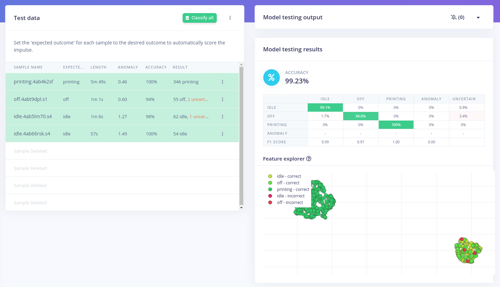

We can see that we got a very good accuracy of 99+%, with a small number of uncertainties between the `idle` and `off` states.

As the model works as expected, we should try [**Live classification**](https://studio.edgeimpulse.com/studio/283049/classification) on newly sampled data from the BrickML device. For this, first we need to connect to the BrickML device, either using `edge-impulse-daemon` or Web USB. After this, we can start collecting some sensor data, by hitting the *"Start sampling"* button with the appropriate parameters:


I tested the model in various conditions. The below screenshot shows the results when running a print:

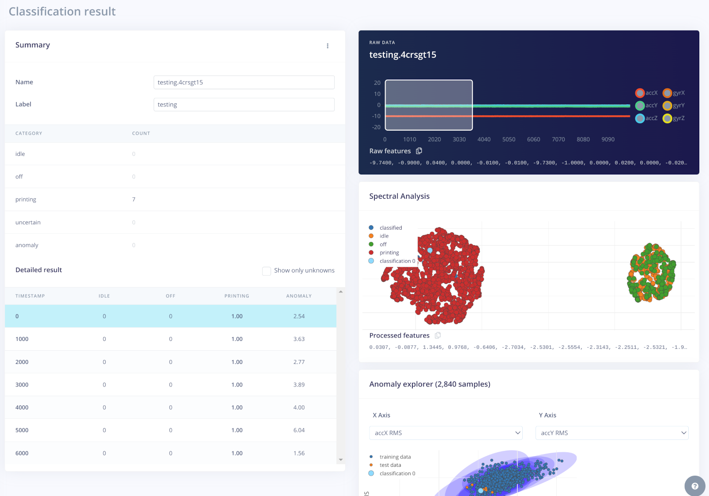

During live testing we can also check out the **Anomaly Detection** feature. For this a gave the printer a little shake. The result of this is that the Anomaly score skyrockets, indicating that some irregularity was detected:

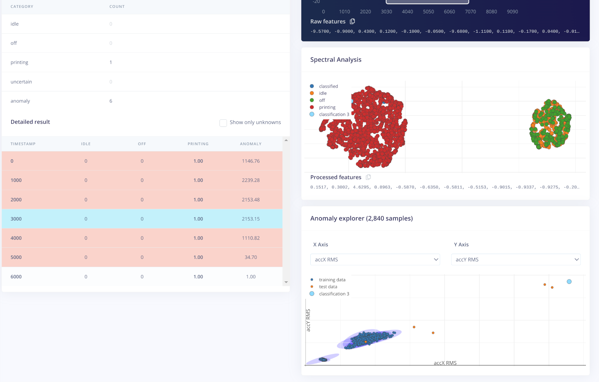


## Deploying the Model on the BrickML

The final stage of the project is to build and deploy our Impulse to the BrickML device.

To build the image we can go to the [**Deployment**](https://studio.edgeimpulse.com/studio/283049/deployment) tab. There, we need to select the BrickML / Renesas RA6M5 (Cortex-M33 200MHz) as the target, and click the *Build* button:

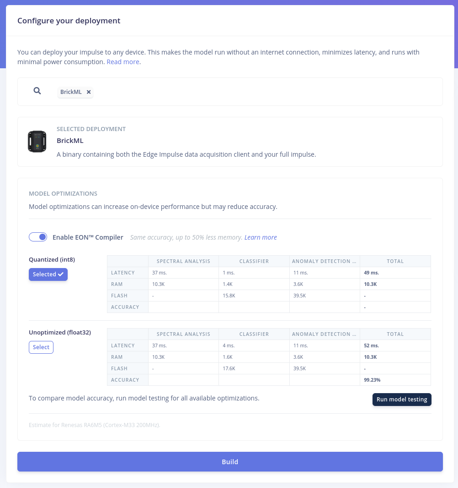

Optionally, we can enable the [EON™ Compiler](https://docs.edgeimpulse.com/docs/edge-impulse-studio/deployment/eon-compiler), which is a way to tune the model we build to the target device we selected.

The build will complete in a couple of minutes, and the output will show up the **Build output** section, and it will be ready to download.

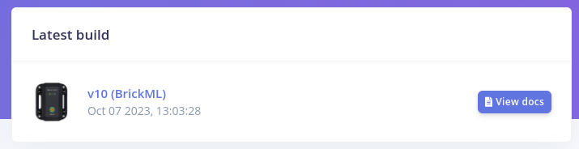


The output is a `.zip` archive containing two files: a signed binary firmware image, and an uploader script. 

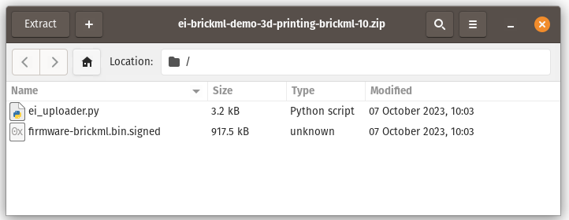


The new firmware can be uploaded to the device using the provided `ei_uploader.py` script, by running the following command:
```sh
$ python3 ei_uploader.py -s /dev/ttyACM0 -f firmware-brickml.bin.signed
```

After a quick reboot / power cycle we should be able to launch the model using the `edge-impulse-run-impulse` command.

Here is quick video showing the BrickML in action, while running the model:



## Conclusions

As our example shows, the BrickML is very capable device, that can be used to implement Edge ML solutions with very little development effort. 

Using BrickML and Edge Impulse Studio we can easily collect sensor data and train an ML model. The resulting model can be rapidly deployed to the BrickML device, which then runs the inference in real time.

To integrate BrickML into an existing solution, we can use the AT interface it exposes, or we can also chose to the extend its firmware with custom functionality.

## Resources

1. BrickML Product Page,  https://edgeimpulse.com/reference-designs/brickml
2. Edge Impulse Documentation, https://docs.edgeimpulse.com/docs/
