# Pipeline Clog Detection with a Flowmeter and TinyML

Created By: Shebin Jose Jacob

Public Project Link: [https://studio.edgeimpulse.com/public/171104/latest](https://studio.edgeimpulse.com/public/171104/latest)

GitHub Repository:

[https://github.com/CodersCafeTech/Clog-Detection-With-AI](https://github.com/CodersCafeTech/Clog-Detection-With-AI)

## Project Demo



## Intro

Pipeline clogs can have serious and destructive effects on industrial operations. Clogs can occur for a variety of reasons, such as the build-up of debris, corrosion, and other types of damage. When a pipeline clogs, it can disrupt the flow of materials and lead to costly repairs, downtime, and other problems. In this essay, we will explore the destructive effects of clogs in industrial pipelines and discuss some ways to prevent and mitigate these issues.

One of the primary effects of pipeline clogs is reduced efficiency and productivity. When a pipeline is clogged, the flow of materials is disrupted, which can lead to delays and bottlenecks in the production process. This can result in missed deadlines, reduced output, and decreased profits. Additionally, clogs can cause equipment to wear out more quickly, which can result in higher maintenance and repair costs.

Another destructive effect of pipeline clogs is environmental damage. When a pipeline clogs, it can lead to spills and leaks, which can have serious consequences for the environment. For example, if a pipeline carrying hazardous materials clogs, the materials may leak out and contaminate the surrounding area. This can have serious impacts on wildlife, ecosystems, and human health.

In addition to these effects, pipeline clogs can also pose a safety risk to workers. If a clog occurs in a pipeline carrying high-pressure fluids or gases, it can lead to explosions or other hazards. This can put workers at risk of injury or death, as well as cause damage to equipment and facilities.

As a proposed solution to the problem of pipeline clogs in industrial operations, we are introducing the use of artificial intelligence (AI) and machine learning. Our AI system uses flow rate sensor data to detect clogs in pipelines by analyzing changes in flow rates that may indicate a blockage. This approach has the potential to prevent disruptions and costly repairs, as well as reduce the risk of environmental damage and safety incidents.

To implement this solution, flow rate sensors would be installed along the length of the pipeline. These sensors would continuously measure the flow rate of materials through the pipeline and transmit the data back to the AI system. The AI system would then use machine learning algorithms to analyze the data and detect any changes that may indicate a clog. If a clog is detected, the system could alert maintenance personnel, who can then take action to address the problem.

## Hardware Requirements

* [Seeed Wio Terminal](https://www.seeedstudio.com/Wio-Terminal-p-4509.html)
* [Water Flow Sensor](https://www.dfrobot.com/product-1517.html)

## Software Requirements

* [Edge Impulse](https://edgeimpulse.com)
* [Arduino IDE](https://www.arduino.cc/en/software)

## Hardware Setup

In this project, we utilized the **Seeed Wio Terminal** development board. This particular board was chosen for its comprehensive capabilities as a complete system, including a screen, a development board, an input/output interface, and an enclosure. Essentially, the **Seeed Wio Terminal** provides everything needed for a successful project in a single, integrated package. Additionally, this development board is known for its reliability and ease of use, making it an ideal choice for our project.

We used a DFRobot **Water Flow sensor** to detect the flow state.

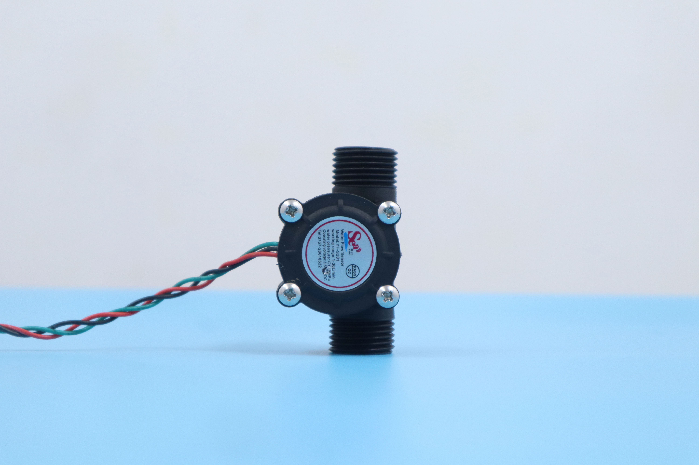

The purpose of this sensor is to measure the flow rate of a liquid as it passes through it. It accomplishes this task through the use of a magnetic rotor and a hall effect sensor. When liquid flows through the sensor, the movement of the liquid causes the magnetic rotor to rotate. The speed at which the rotor turns is directly proportional to the flow rate of the liquid. The hall effect sensor, which is positioned near the rotor, detects this rotation and outputs a pulse width signal. This pulse width signal can then be used to calculate the flow rate of the liquid. In this way, the combination of the magnetic rotor and the hall effect sensor allows for precise measurement of the flow rate of a liquid.

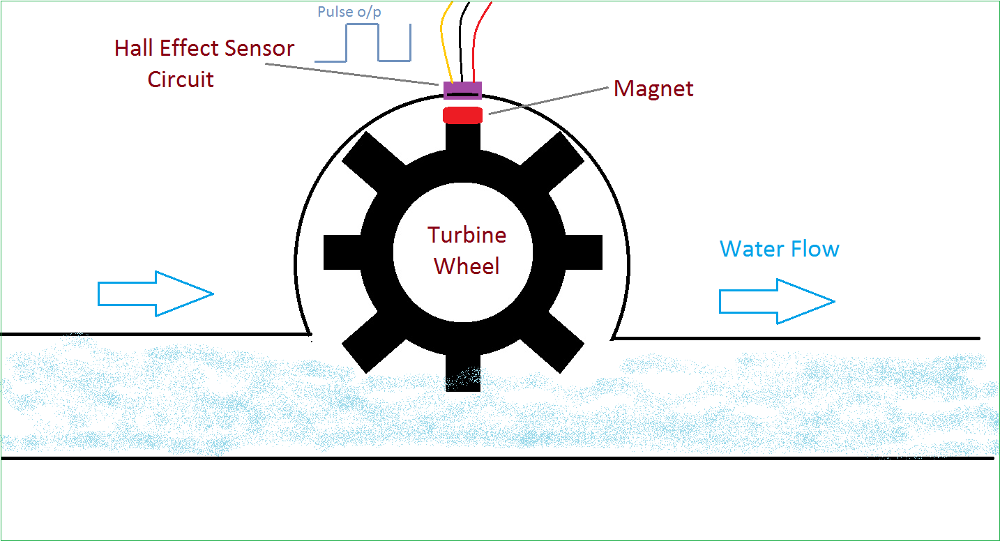

The flow setup for this system is pretty simple. Essentially, it involves attaching two pipes to the inlet and outlet of the flow sensor. The inlet pipe is used to channel the liquid being measured into the flow sensor, while the outlet pipe serves to direct the liquid out of the flow sensor after it has been measured. This simple configuration allows for the accurate measurement of the flow rate of the liquid as it passes through the flow sensor.

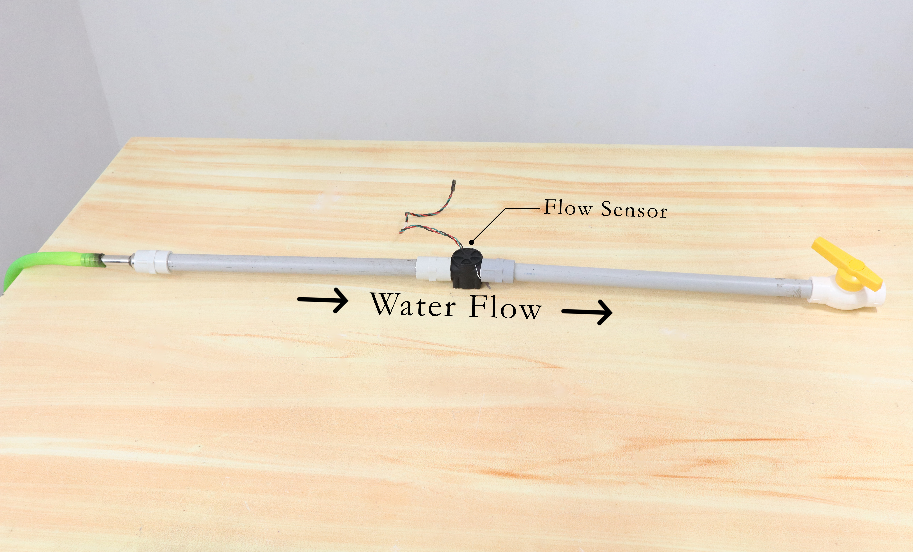

We will collect the data:

* When there is **no flow**
* When there is **a flow**
* When there is **a clog**

## Software Setup

To prepare your Seeed Wio Terminal for use with Edge Impulse, you can follow the instructions provided in the [official guide](https://wiki.seeedstudio.com/Wio-Terminal-TinyML-EI-1/). However, we have chosen to employ an alternative method for collecting data in our project. Specifically, we are using CSV files to gather data, which we then upload to Edge Impulse. From there, we follow the usual process of generating a TinyML model using the data collected in this manner. Our method allows us to collect data in a flexible, portable format that can be easily transferred to Edge Impulse for further analysis and model creation.

### 1. Data Collection

For our project, we are utilizing a water flow sensor that produces a pulse width modulation (PWM) signal as its output. Rather than collecting the analog values directly from the sensor, we have chosen to calculate the flow rate using an equation based on the PWM signal. This flow rate data is then collected as time series data, allowing us to track changes in flow rate over time. We have also collected flow rate data for three different scenarios: **no flow**, **normal flow**, and a **clog**. Through our analysis, we have determined that these three scenarios produce distinguishable patterns in the flow rate data that can be detected by our model.

To collect data for your project, follow these steps:

* Upload **DataCollection.ino** to Wio Terminal.
* Plug your Wio Terminal into the computer.
* Run **SerialDataCollection.py** in the computer.
* Press button **C** to start recording.
* When you have enough data, press button **C** again to stop recording.
* Once you have stopped recording, it will generate a CSV file on your computer. Name it according to the flow state.
* Upload the CSV file to EdgeImpulse using the **Data Acquisition Tab**.

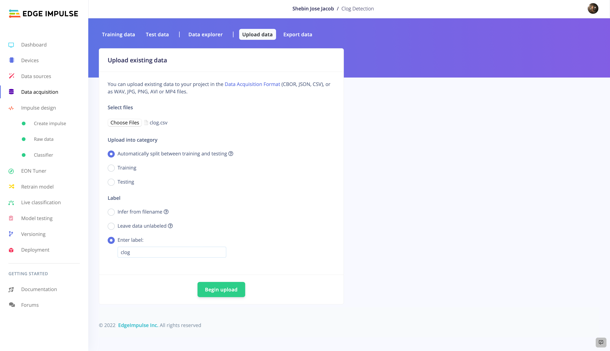

After uploading the CSV files containing our flow rate data to Edge Impulse, we divided the entire dataset into smaller samples of 6 seconds in length. This process, known as splitting the data, allows us to analyze and manipulate the data for model creation.

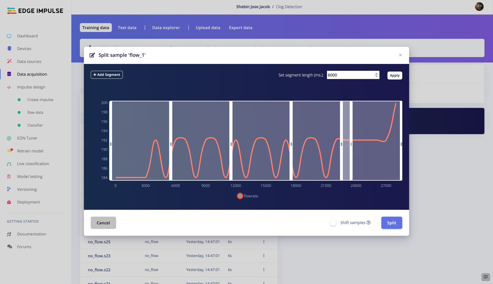

By breaking the data down into smaller chunks, we can more easily identify trends and patterns that may be relevant to our model. Additionally, this approach allows us to efficiently use the data for training and testing, as we can more easily control the input and output for each sample. One of the collected samples for each class is visualized below.

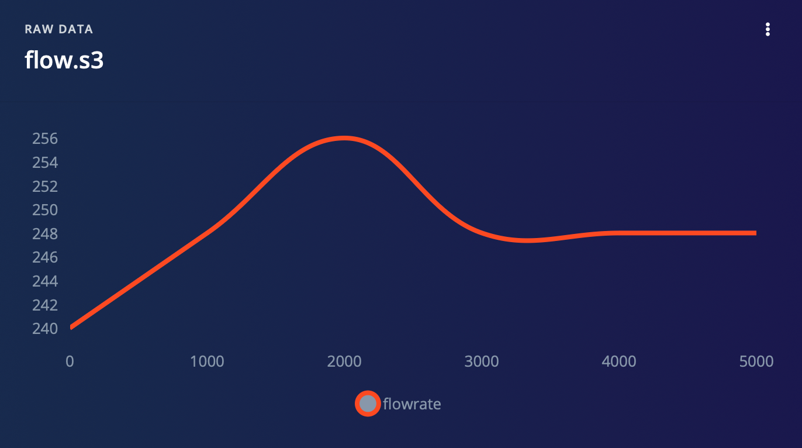

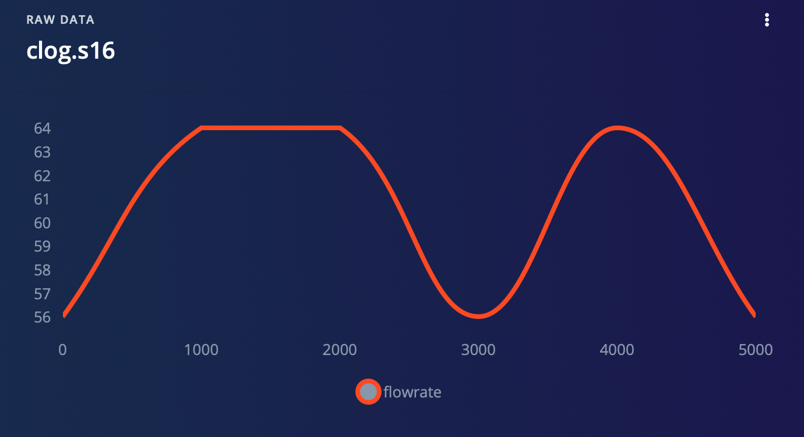

After dividing our flow rate data into smaller samples as described above, we have further split the dataset into two distinct subsets: a **training** dataset and a **testing** dataset. This process is known as data partitioning, and it is an essential step in the model creation process.

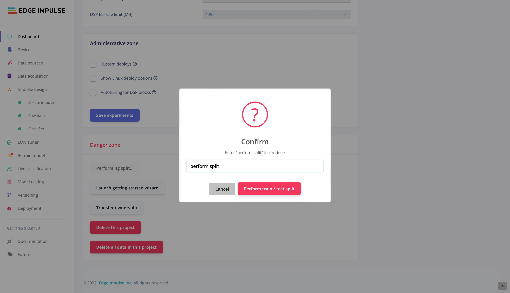

By separating the data into these two subsets, we can use the training dataset to teach our model to recognize patterns and make predictions, while the testing dataset is used to evaluate the accuracy and effectiveness of the model. By using a clean, well-organized dataset, we can be confident that our model is learning from high-quality data and is more likely to produce accurate and reliable results.

### 2. Impulse Design

An impulse is a specialized machine learning pipeline designed to extract useful information from raw data and use it to make predictions or classify new data. The process of creating an impulse typically involves three main stages: **signal processing**, **feature extraction**, and **learning**.

During the signal processing stage, the raw data is cleaned and organized in a format that is more suitable for analysis. This may involve removing noise or other extraneous information, and may also involve preprocessing the data in some way to make it more useful for the next stage of the process.

Next, the feature extraction stage involves identifying and extracting important characteristics or patterns from the processed data. These features are the key pieces of information that the learning block will use to classify or predict new data.

Finally, the learning block is responsible for categorizing or predicting new data based on the features extracted in the previous stage. This may involve training a machine learning model on the extracted features, or it may involve applying some other type of classification or prediction algorithm.

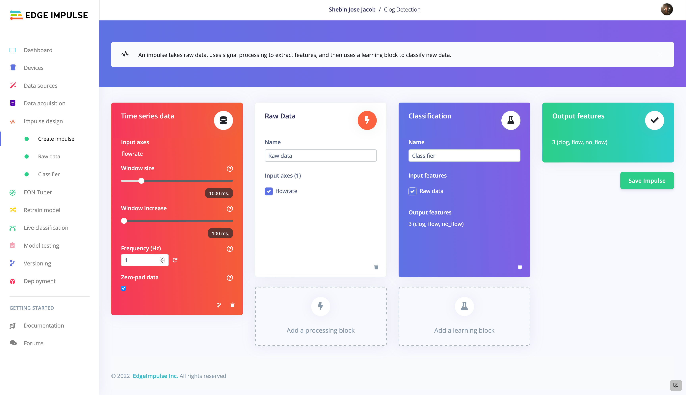

In this project, we are utilizing machine learning to classify the flow rate of a liquid into one of three distinct classes. To do this, we are using **Time Series Data** as the input block for the impulse. This type of data consists of a series of measurements taken at regular intervals over a period of time, and it is well-suited for analyzing trends and patterns in flow rate data.

For the processing block, we are using **Raw Data**, which is the unprocessed data collected directly from the flow sensor. This data is then passed through the processing block, where it is cleaned and organized in a way that is more suitable for analysis.

Finally, for the learning block, we are using a **Classifier** block. This type of algorithm is designed to assign data to one of several predefined categories, and it is well-suited for the task of classifying flow rate data into one of three categories. By using classification as the learning block, we can categorize the flow rate data into one of three classes: no flow, normal flow, or a clog.

At this point in the process, we are ready to move to the Raw Data tab and begin generating features. The Raw Data tab provides a number of options for manipulating the data, such as changing the scale of the axis or applying various filters. In our case, we have chosen to keep the default settings and proceed directly to generating features.

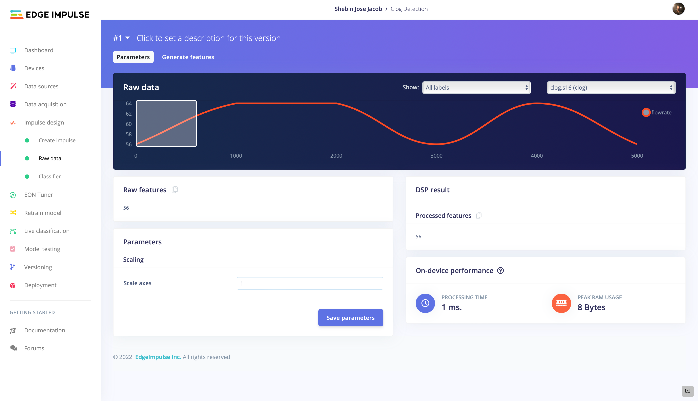

To generate features, we will apply a variety of algorithms and techniques to identify important patterns and characteristics in the data. These features will be used by the learning block of our impulse to classify the flow rate data into one of three categories. By carefully selecting and extracting relevant features, we can create a more accurate and reliable model for classifying flow rate data.

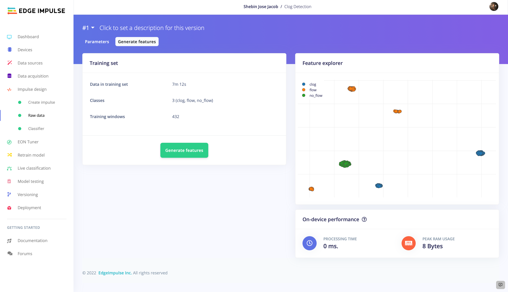

After analyzing the features, we have determined that they are well separated and there is no overlap between the classes. This is an encouraging sign, as it suggests that we have a high-quality dataset that is well-suited for model generation.

### 3. Model Training

Now that we have extracted and prepared our features, we are ready to move on to the **Classifier** tab to train our model. The **Classifier** tab provides several options for modifying the behavior of our model, including the number of neurons in the hidden layer, the learning rate, and the number of epochs.

Through a process of trial and error, we experimented with different combinations of parameters until we were able to achieve a training accuracy that met our standards. This process involved adjusting the number of neurons in the hidden layer, the learning rate, and the number of epochs, among other things. Ultimately, we were able to find a set of parameters that resulted in a model with desired training accuracy which is shown in the figure.

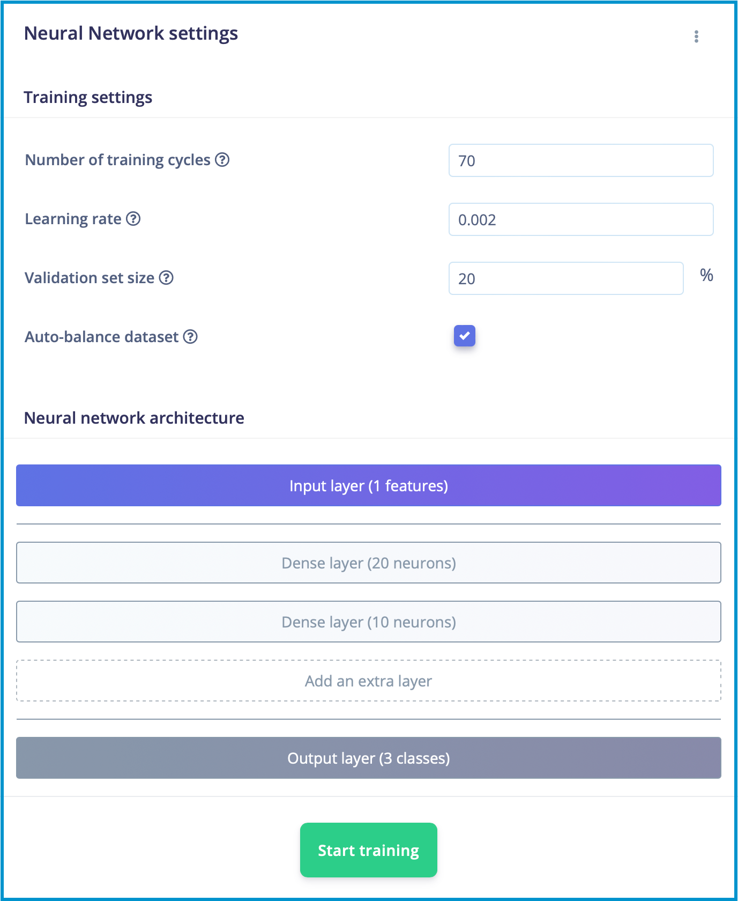

After training the model for a total of 70 cycles with a learning rate of 0.002, we were able to produce an output model with 100% training accuracy and a loss of 0.03.

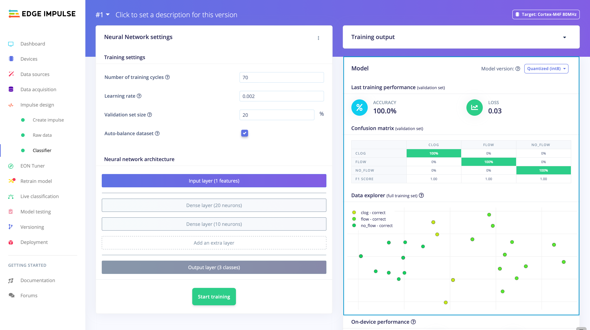

This level of accuracy is extremely high, indicating that our model is capable of accurately classifying flow rate data into one of three categories. Additionally, the low loss value suggests that our model is able to make predictions with a high degree of confidence, further increasing the reliability of our results.

### 4. Model Testing

Having trained and fine-tuned our model to achieve a high level of accuracy, we are now ready to test its performance on some previously unseen data. To do this, we will navigate to the **Model Testing** tab and use the **Classify All** feature to evaluate the model's performance.

By applying the model to a new set of data, we can determine whether it is capable of accurately predicting flow rate patterns and classifying the data into one of three categories. If the model performs well on this test data, we can be confident that it will be able to provide useful and reliable insights when applied to real-world situations.

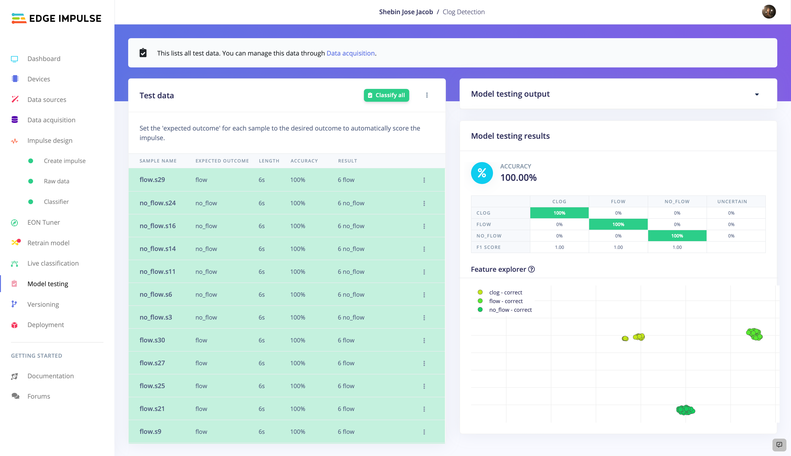

Upon running the test, we were pleased to see that the model performed exceptionally well, accurately classifying the flow rate data into one of three categories with a high degree of accuracy. These results are a strong indication that our model is well-functioning and capable of providing valuable insights for industrial pipeline management.

### 5. Deployment

Now that we have created and tested a well-functioning model for predicting and classifying flow rate patterns in industrial pipelines, we are ready to deploy it as an **Arduino Library**.

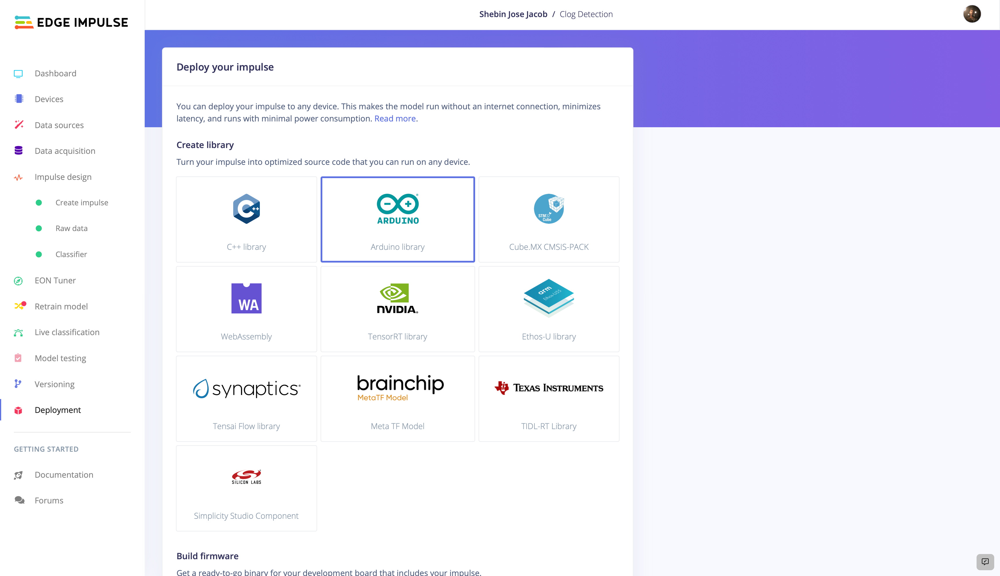

To do this, we will navigate to the **Deployment** tab and follow the instructions provided there to build an **Arduino Library** for our model.

During the process of building the library, we have the option of enabling optimizations with the **EON Compiler**. This feature allows us to further improve the performance of our model by optimizing the code for efficient execution on the device. While this is an optional step, it can be useful for increasing the speed and efficiency of our model, particularly if we plan to use it in resource-constrained environments.

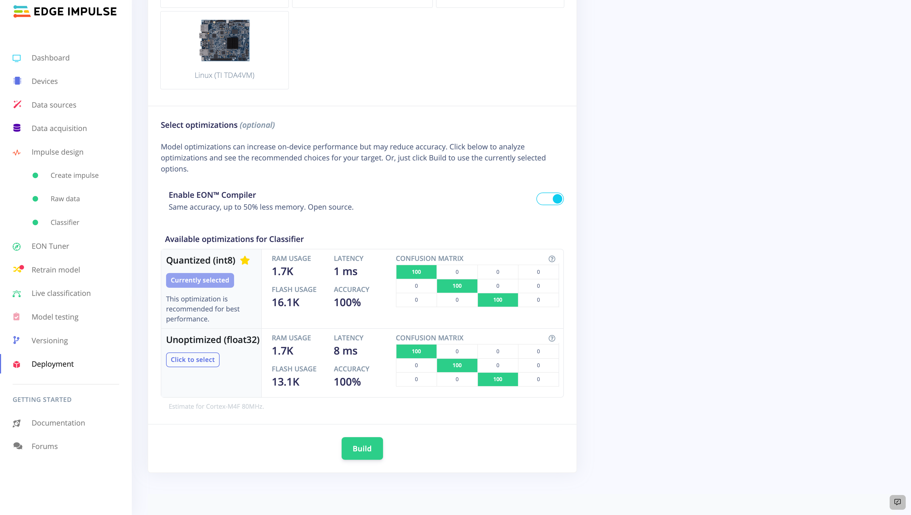

After completing the process of building an Arduino library for our model, we will be presented with a .zip file containing the model itself, as well as a number of examples demonstrating how to use the model in various contexts. To add the library to the Arduino Integrated Development Environment (IDE), we can simply navigate to **Sketch > Include Library > Add .ZIP Library** in the IDE, and select the .zip file produced by the build process. This will install the library and make it available for use in our Arduino projects.

We need to modify the `static_buffer.ino` file located in the Arduino Integrated Development Environment (IDE) for the purpose of enabling dynamic inferencing. We can begin by opening the Arduino IDE and navigating to **File > Examples > Your Project Name > static\_buffer > static\_buffer.ino**.

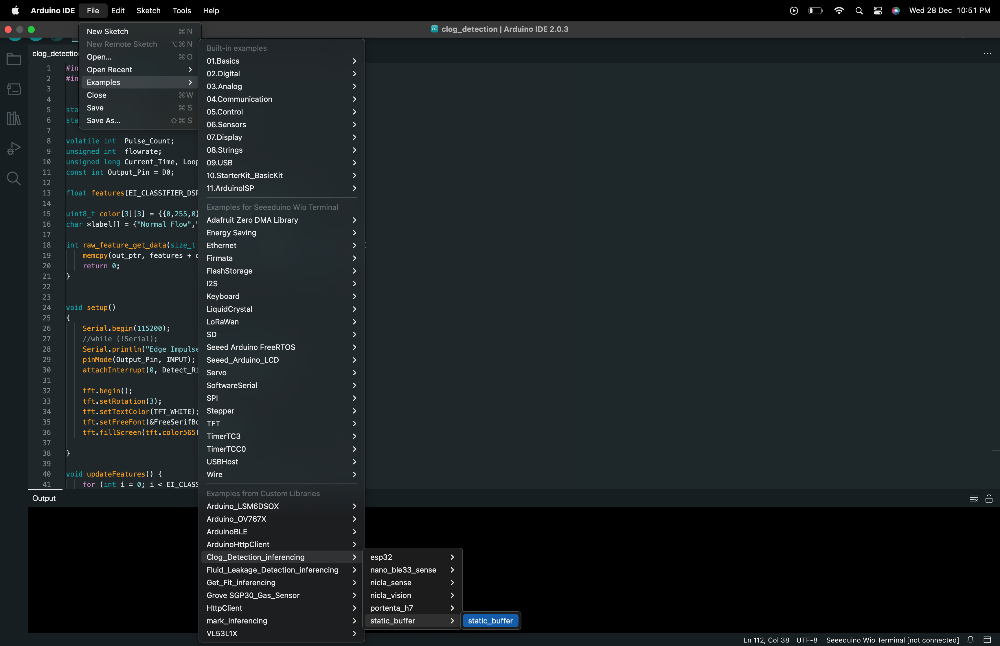

This will open the `static_buffer.ino` file in the editor window, allowing us to make changes to the code as needed.

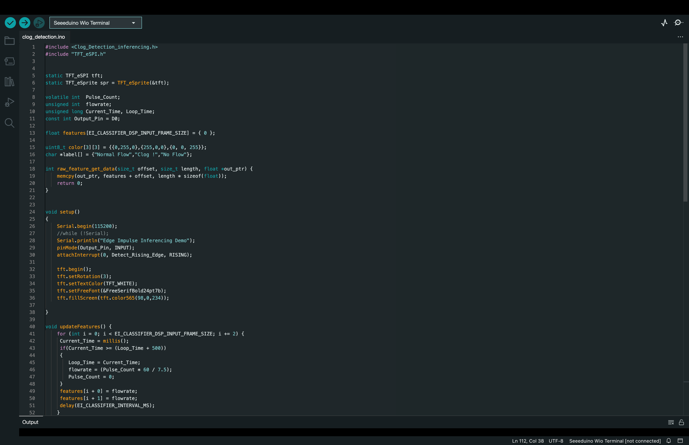

Dynamic inferencing involves making predictions or classifications in real-time as new data is received, so we will need to modify the code to allow for real-time data processing and prediction. This may involve adding code to handle incoming data streams, applying machine learning algorithms to the data, and making predictions or classifications based on the results. We may also need to make other modifications to the code to support dynamic inferencing, depending on the specific requirements of our application. Once we have made the necessary changes to the code, we can save the modified file and use it to perform inferencing with our model, providing valuable insights for industrial pipeline management. The code for our project is available in the below GitHub repository.

## Code

All of the assets for this project, including the code, documentation, and any other relevant files, are available in this [github repository](https://github.com/CodersCafeTech/Clog-Detection-With-AI).

## Conclusion

This project uses a flowmeter to measure the rate of flow of a liquid through a pipe, then predicts if a clog is detected using a machine learning algorithm that has been deployed on a Seeed Wio Terminal. Followup work could include the development of an application or dashboard to render the time-series data from the flowmeter, highlight possible clogs or reduced flow readings, or integrate into a larger pipeline management system.
