# Predictive Maintenance with the Nordic Thingy:91 

Created By:
[Zalmotek](https://zalmotek.com) 

Public Project Link:
[https://studio.edgeimpulse.com/public/96183/latest](https://studio.edgeimpulse.com/public/96183/latest)

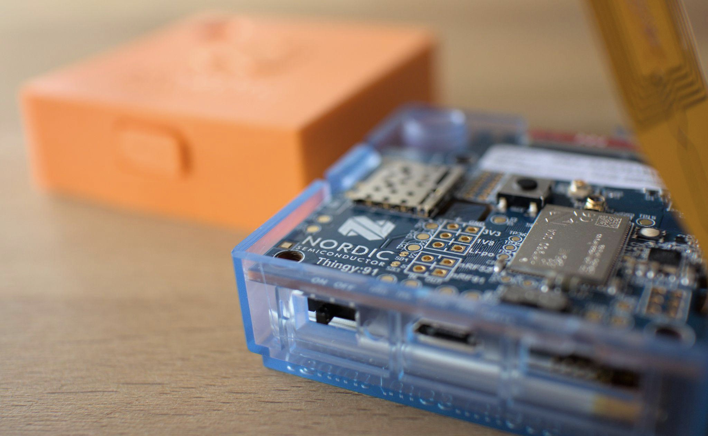

## Intro

Untimely critical machinery failure is one of the biggest troubles a plant manager must deal with when running a production facility. Because heavy machinery parts are expensive and lead times for replacement are getting longer and longer due to the supply crisis, employing preventive measures like equipping machinery with a predictive maintenance solution greatly improves the Overall Equipment Effectiveness (OEE). 

Such a solution measures key health indicators of machinery like vibration, temperature, and noise, analyzes them using AI algorithms and sends alerts way before machinery breaks down, allowing the facility to reduce operating costs and increase production capacity.

## Our Solution

To show you a real world use-case of predictive maintenance we have decided to use the Nordic Thingy:91, an easy-to-use prototyping dev kit for IoT projects, packed with a multitude of sensors relevant for our application: Low-power accelerometer, temperature, and pressure sensors. 

The on-board nRF9160 System-in-Package (SiP) supports LTE-M, NB-IoT and GNSS if you wish to send the data in the cloud and the nRF52840 allows the development of Bluetooth LE applications.

The 64 MHz Arm® Cortex®-M33 CPU is great for running a TinyML model on the edge used to detect anomalies while the machinery is running.

Our approach to building a predictive maintenance solution based on the Nordic Semi Thingy:91 is to attach it mechanically to a machine and collect accelerometer data during normal functioning. After a proper data set is acquired, we will train a TinyML model based on an **Anomaly Detection Neural Network** using Edge Impulse that will detect anomalies.

### Hardware requirements
 - Nordic Semi Thingy:91
 - Micro-USB cable for Thingy:91
 - J-link debugging probe
 
### Software requirements
 - Edge Impulse account
 - nRF Connect for Desktop v3.7.1
 - [Edge Impulse CLI](https://docs.edgeimpulse.com/docs/cli-installation)
 - A working Zephyr RTOS build environment achieved by installing nRF Connect SDK
 - GNU ARM Embedded Toolchain (version 9-2019-q4-major)

## Hardware Setup

The Thingy:91 comes equipped  with all the required sensors for this use-case so there is not much wiring to do. Plugging a micro-USB cable in the prototyping board is enough to do the data acquisition and to deploy the model back on the edge. If you wish to run it completely wireless, the 1359 mAh Li-Po battery is big enough to run the inference on the target for a while, varying based on the sensor reading frequency and the communication protocol used.

Our aim is to detect faulty operation or an approaching critical machinery failure in an extruding-based machine. For this, we have attached the Nordic Semi Thingy:91 to a 3D printer in order to better schedule our maintenance operations like unclogging the nozzle, oiling the linear bearings, dusting the fan etc. Using the same principles the use case can be adapted to other much larger extruders or machines that involve any type of motors that are vibrating when functioning.


## Software Setup

First thing first, to collect our dataset, we must upload the Thingy:91 firmware provided by Edge Impulse on the dev kit.
 
1. Install the latest version of [nRF Connect for Desktop](https://www.nordicsemi.com/Products/Development-tools/nrf-connect-for-desktop) from the official source on your OS of choice. 
1. Install [Edge Impulse CLI](https://docs.edgeimpulse.com/docs/edge-impulse-cli/cli-installation). This is a suite of tools that is used to control local devices, act as a proxy to synchronize data for devices that are not connected to the internet and to facilitate uploading and converting local files.
1. Afterwards, [download the latest Edge Impulse firmware](https://cdn.edgeimpulse.com/firmware/nordic-thingy91.zip) and extract the archive somewhere convenient.
1. Turn on the Thingy:91 while pressing on the multi-function button placed in the middle of the board. Release the button, connect it to the PC, launch nRF Connect for Desktop and open the Programmer.

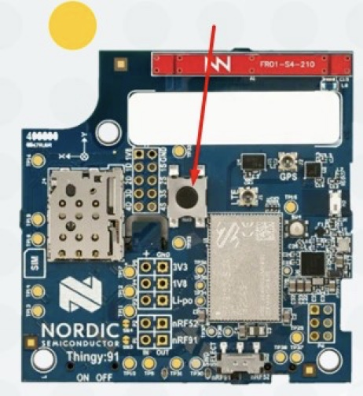

Click on Select Device, select Thingy:91 and once returned to the programmer screen, make sure that Enable MCUboot is checked.

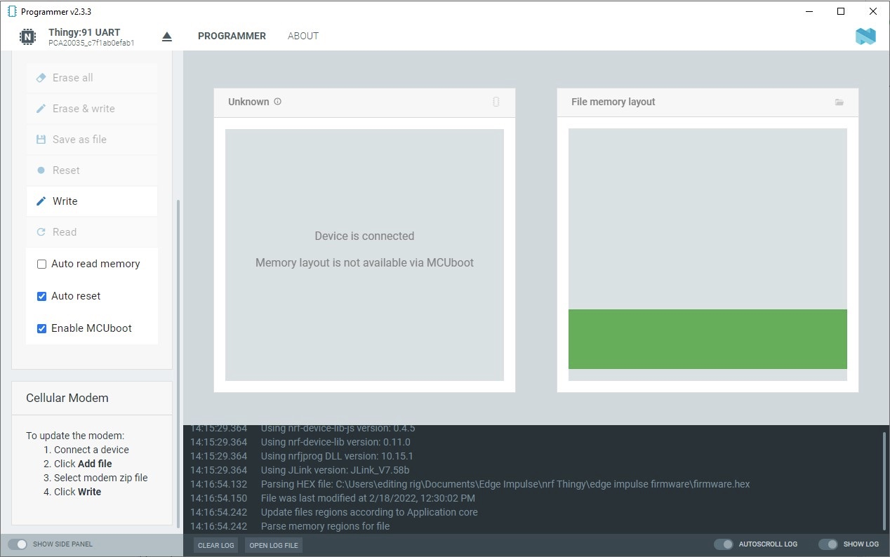

1. In the Programmer navigation bar, click Select device.
1. In the menu on the right, click **Add HEX file > Browse**, and select the firmware.hex file from the firmware previously downloaded at step 3.
1. Scroll down in the menu on the right to Device and click **Write**:

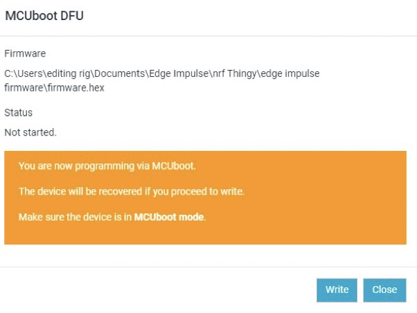

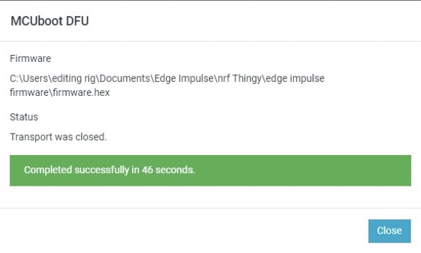

Right now, we have everything we need to connect the dev kit to our Edge Impulse project, collect the data and train the model. Next up, we must install all the prerequisites necessary for the Deployment Phase of this project. Take note that these are necessary only if you wish to build your own custom application.

1. Install the [nRF Connect SDK](https://www.nordicsemi.com/Software-and-tools/Software/nRF-Connect-SDK). Follow the steps in the [official documentation](https://developer.nordicsemi.com/nRF_Connect_SDK/doc/latest/nrf/gs_installing.html) and instead of installing a build IDE, set up the command-line build environment.
1. Download and extract the GNU ARM Embedded Toolchain (version 9-2019-q4-major) and extract it in /home/USER/gnuarmemb
1. Install the [nRF command line tools](https://www.nordicsemi.com/Products/Development-tools/nrf-command-line-tools/download) and [Segger J-Link tools](https://www.segger.com/downloads/jlink/#J-LinkSoftwareAndDocumentationPack) that will enable us to flash the board using the west command line interface.

### Creating an Edge Impulse Project

The first step towards building your TinyML Model is creating a new Edge Impulse Project.

Once logged in to your Edge Impulse account, you will be greeted by the Project Creation screen.

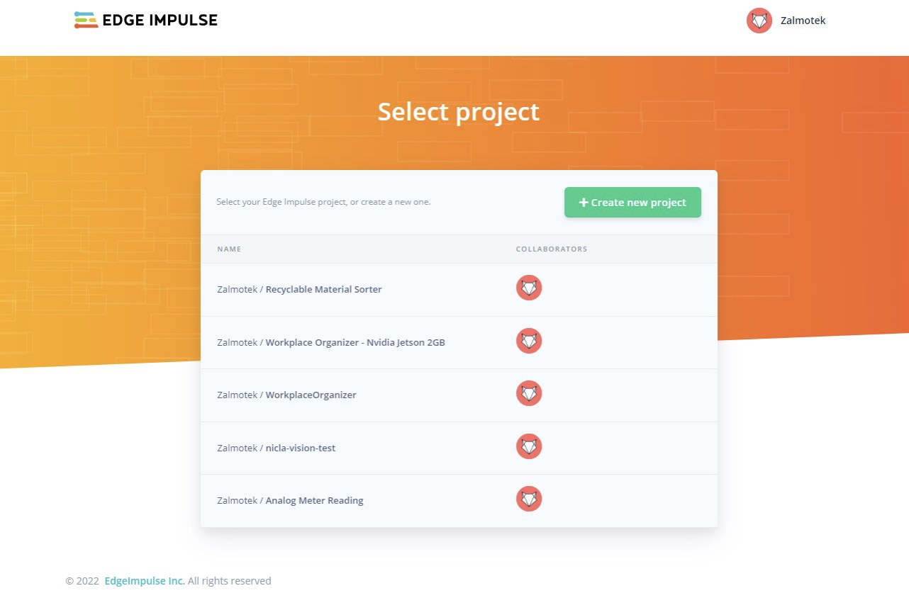

Click on **Create new project**, give it a meaningful name, select **Developer** as your desired project type and press **Create new project**.

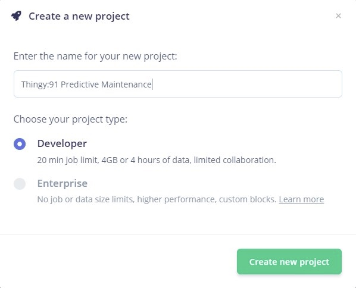

Afterward, select **Accelerometer** data as the type of data you wish to use.

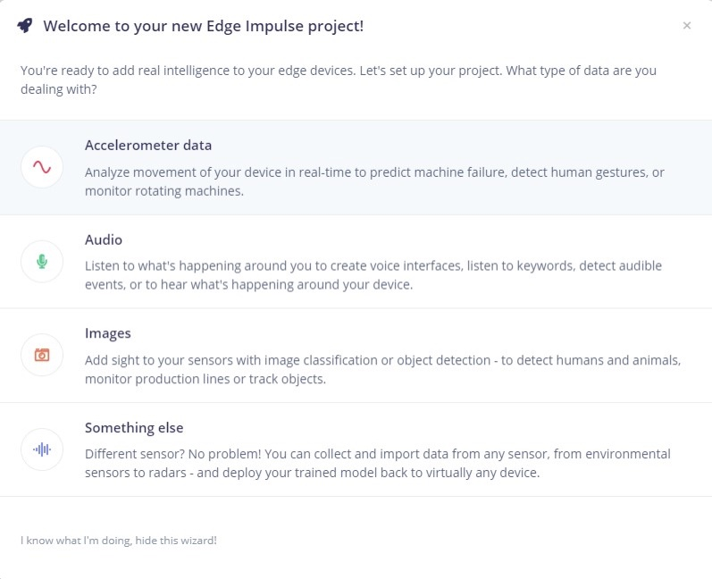

### Connecting the device

With the project created, it’s time to connect a device to it. Power up the Thingy:91 and connect it via a USB cable to the PC. Open up a terminal and run:

```
edge-impulse-daemon --clean
```

You will be prompted with a message to insert your username and password and then you will be asked to select which device you would like to connect to.

```
Edge Impulse serial daemon v1.14.10
? What is your user name or e-mail address (edgeimpulse.com)? <your user>
? What is your password? [hidden]
```

You may notice that the Thingy:91 exposes multiple UARTs. Select the first one and press ENTER.

```
? Which device do you want to connect to? (Use arrow keys)
> /dev/ttyACM0 (Nordic Semiconductor) 
  /dev/ttyACM1 (Nordic Semiconductor) 
```

Next up, select the project you wish to connect the device to, press Enter and give it a recognisable name.

If you head back to Edge Impulse Studio, you will notice that the device shows up in the **Devices** Tab.

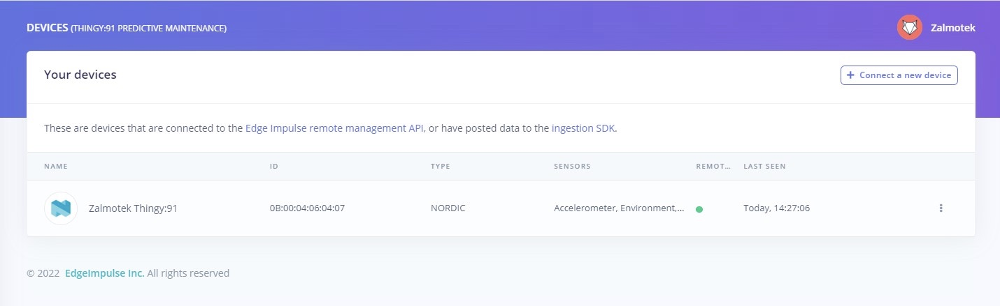

### Collecting the dataset

When monitoring an industrial system, purposefully running it in a faulty manner to collect data dedicated to training a model for failure detection is not possible since breaking would be out of the question. Instead, our approach is collecting data in a time where the machine operates nominally / is idling / is powered off and create an anomaly detection algorithm that will detect when something is out of order.

With the device connected, head over to the Data acquisition tab. Before acquiring data we must set a Sample Length and a Reading Frequency. 

When sensors or other devices take measurements of some physical quantity, the process of converting this analogue signal into a digital representation is known as sampling. In order for the resulting digital signal to be an accurate representation of the original, it is important to respect the Nyquist–Shannon sampling theorem when carrying out this process. The Nyquist frequency is twice the highest frequency present in the signal being sampled, and Nyquist's theorem states that if the sampling frequency is not equal to or higher than the Nyquist frequency,  then aliasing will occur. This means that high-frequency components in the signal will be misrepresented in the digital version, leading to errors in the measurements.This being said, we will pick the highest frequency available, to avoid the aliasing phenomenon.

When building the dataset, keep in mind that machine learning leverages data, so when creating a new class, try to record at least 3 minutes of data.

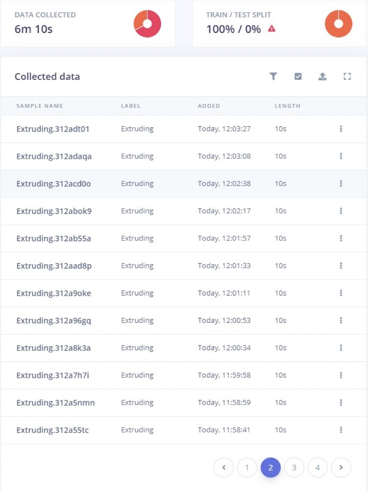

Also, remember to gather some samples for the testing data set, as to achieve a distribution of at least 85-15% between training and testing set sizes.

### Designing an impulse

Once the data acquisition phase is over, the next step is designing an **Impulse**. What an Impulse does is take raw data from your dataset, split it up in manageable bites, called **“windows”**, extract features using signal processing blocks and then, classify new data by employing the learning block.

For this example, we will make use of the **Spectral analysis** signal processing block and the **Classification** and **Anomaly Detection** learning blocks.

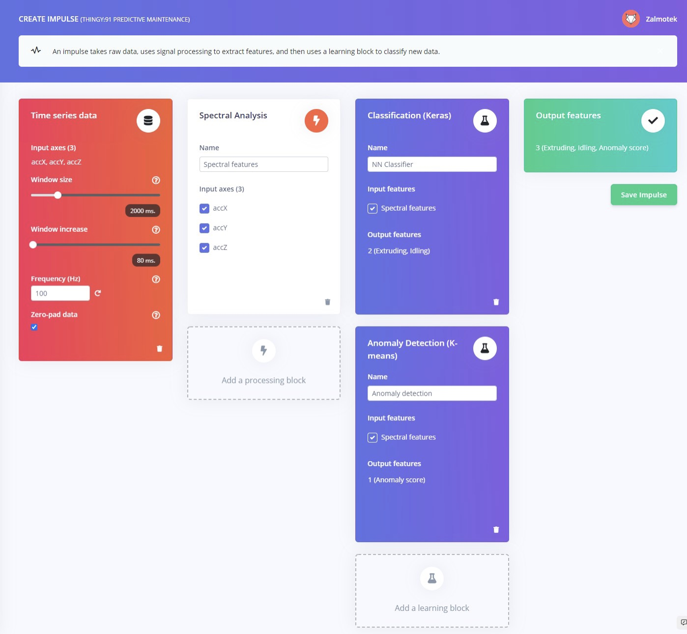

### Configuring the Digital processing block

Once the setup is done, clock on **Save impulse** and move over to the **Spectral features** tab that appeared under the **Impulse Design** menu. In this screen you can observe the raw data being displayed on the top side of the window and the results of the signal processing block on the right side. 

Digital signal processing theory is convoluted at times so we are not going to dwell too deep in this subject. Tweak the parameters with the target of obtaining similar results from similar data.

In our case, we have noticed huge improvements in the mode’s accuracy when switching from Low-pass filter to a High-pass filter and increasing the **Scale axis** factor to 30.

Once done configuring the DSP block, move forward to the **Feature generation** screen. Make sure that **Calculate feature importance** is checked and click on **Generate Features**.

The Feature explorer is one of the most powerful tools put at your disposal by Edge Impulse. It allows intuitive data exploration in a visual manner. It allows you to quickly validate whether your data separates nicely before moving over to training the model. It color-codes similar data and allows you to trace it back to the sample it came from by just clicking on the data item, making it a great perk if you are trying to find the outsiders in your dataset.

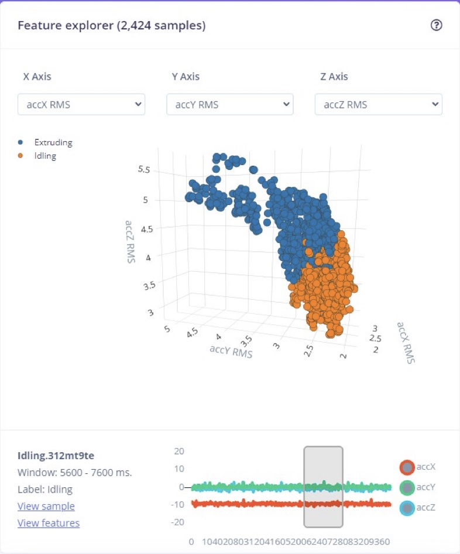

When you are working on a classification-based application, what you aim to see in the Feature explorer is clearly defined clusters of data points. In our use-case, this is not the case, and the small overlap of the data clusters does not inconvenience us as we are trying to detect when the system is running outside of those nominal parameters.

### Configure the Classifier(NN)

Once we are happy with the collected data, we will be moving forward to training a neural network. 

Neural networks are computer algorithms that are designed to recognize patterns in large amounts of raw data. Similar in many ways to the human brain, a neural network is made up of interconnected layers of highly specialized neurons. Each neuron examines a particular aspect of the raw data, such as specific frequency patterns, and then passes this information on to the next layer through weighted connections. This process allows the network to learn how to identify different types of patterns over time, adjusting its weights accordingly based on what it has learned from past experience. Thus, neural networks have the ability to accurately recognize complex and nuanced patterns in virtually any type of data.

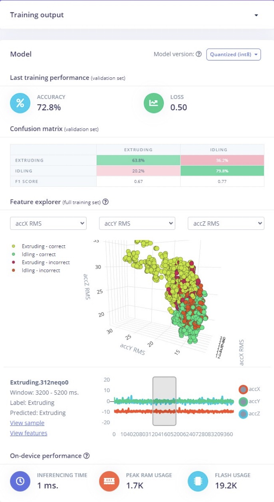

In the **NN Classifier** tab, under the **Impulse Design** menu, leave the parameters on the default settings and click on the **Start Training** button and wait for the NN to be trained. Once done, you will be presented with some training performance indices like the Accuracy and Loss. In a classification-based project we would be aiming for at least 95% Accuracy but in our case, it is not required. 

### Configure the Anomaly Detector

The Anomaly detector is a secondary Neural Network that we will employ to differentiate when data does not fit in any of the categories we have defined in the previous step.

When we were designing the impulse for this use-case, a very important step was to check the **Generate Feature Importance** before clicking on **Generate Features**. What this does is determine what are the most relevant features in the collected data, as to increase the “resolution” of our model and to reduce the amount of processing power needed.

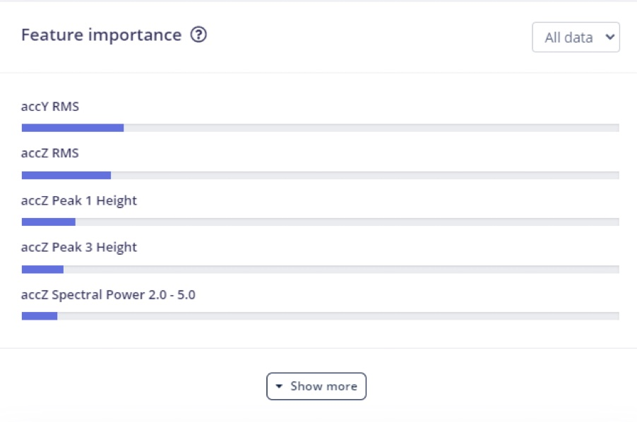

As you can see, the predominant features in our dataset are the accY RMS and accZ RMS. 

Click on the **Anomaly detection** under the Impulse Design menu. Click on **Select suggested axes**, leave the number of clusters set on 32, and click on **Start Training**. Once the training is done, you will be prompted with the training results. You can observe that the Anomaly Explorer plots the 2 most important features against each other, and defines areas around the collected data. When new data is gathered, it is placed on the same coordinate system and if it is situated around the defined clusters, it is flagged as an anomaly.

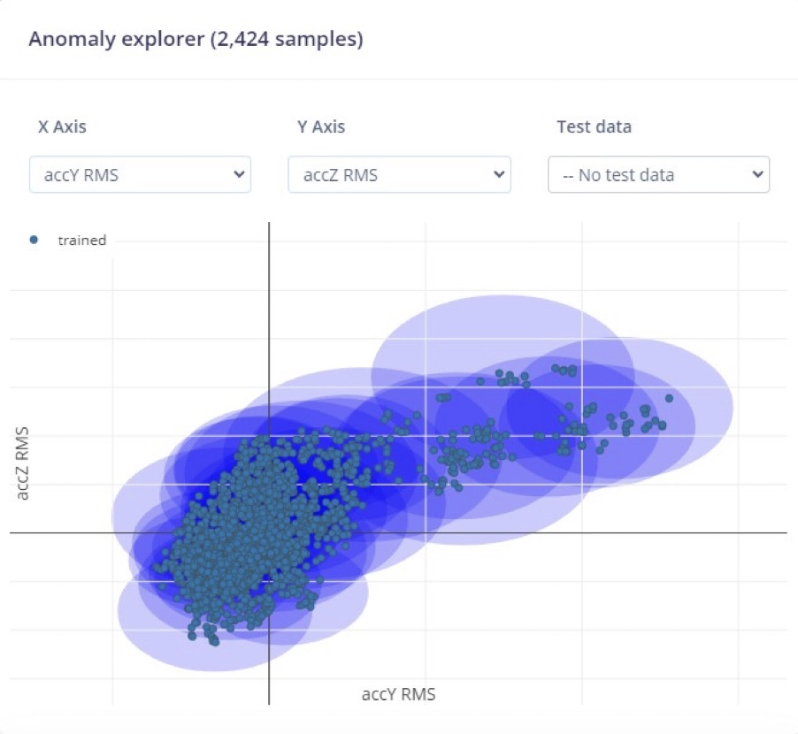

### Model testing

Even though we said earlier in this guide that purposefully running the machinery in a faulty manner is out of discussion, we have induced a small clog for 10 seconds in our machine to gather authentic data.

To test out the model, head over to the **Live Classification** tab and press the **Start Sampling** button. 

Under the Summary tab you can see the number of samples that were placed in each category, and in the right side of the screen, you can see the Raw Data, Spectral Features and the Anomaly Explorer. Head over to the **Anomaly detection** under the **Impulse Design** menu and load your newly gathered sample in the Anomaly Explorer to analyze it even further.

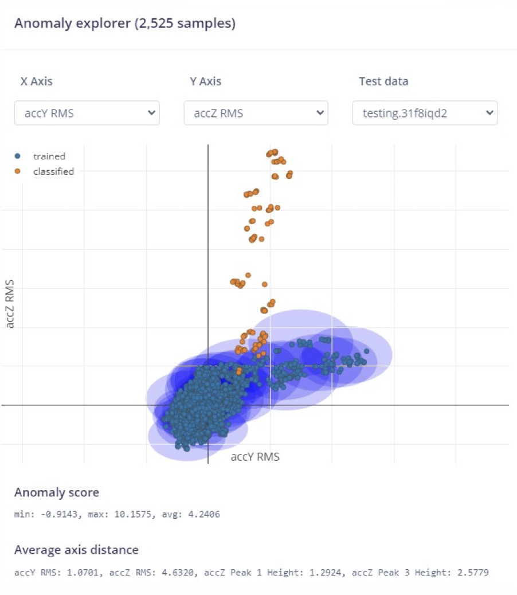

## Deploying the model on the edge

There are 2 ways going about running the Impulse we have just designed on the edge: Either deploying a pre-built binary or exporting the Impulse as a C++ library and building the binary locally. Let’s explore both in our use case and see the benefits for each:

### 1. Deploying a pre-built binary

Deploying the newly created model on the Nordic Thingy:91 implies running it without an internet connection, optimizing the power consumption of the device and minimizing latency between measurements and analyzing them.

Because the Thingy:91 board is fully supported by Edge Impulse, you can navigate to the **Deployment** tab, select the board and download a ready-to-go binary for it that includes the Impulse we have just built.

Deploying the model in this manner is a great way of evaluating the on-board performance of the Impulse with the smallest time investment possible. It allows you to go back and tweak the model until it reaches the desired performance for your application.

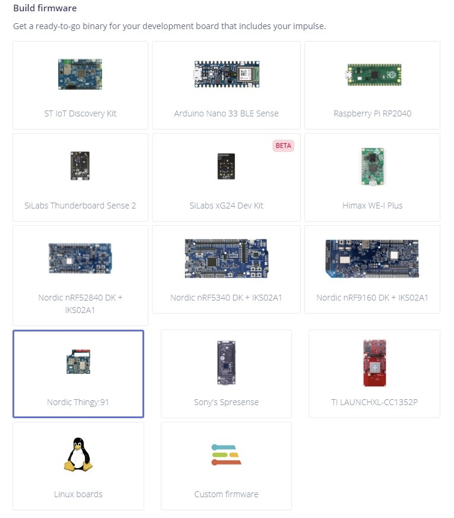

Follow the same steps you did when uploading the custom Edge Impulse firmware on the board, only this time upload the downloaded binary file.

Restart the board, connect it to your PC, launch a terminal and run:

```
edge-impulse-run-impulse
```

The Thingy:91 will start reading accelerometer data, run it through the previously configured DSP block and then classify it. 

```
? Which device do you want to connect to? /dev/ttyACM0 (Nordic Semiconductor)
[SER] Connecting to /dev/ttyACM0
[SER] Serial is connected, trying to read config...
[SER] Retrieved configuration
[SER] Device is running AT command version 1.3.0
[SER] Started inferencing, press CTRL+C to stop...
LSE
> Inferencing settings:
	Interval: 10ms.
	Frame size: 600
	Sample length: 2000ms.
	No. of classes: 2
	Starting inferencing, press 'b' to break
	Starting inferencing in 2 seconds...
	Predictions (DSP: 26 ms., Classification: 0 ms., Anomaly: 2 ms.):
	Extruding: 	0.26171
	Idling: 	0.73828
	anomaly score: 11.67579
```

Notice that we are running the edge in a 2 seconds interval. If you wish to change this parameter, navigate to the **Impulse Design** tab, select the desired window size and re-train your model.

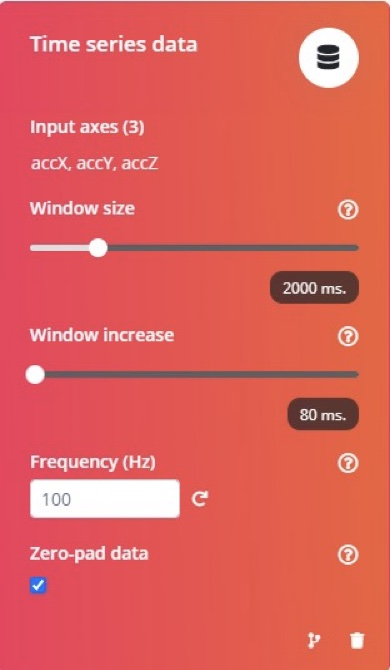

### 2. Exporting the Impulse as a C++ library and building the binary locally

When you are done testing the model and you are happy with the results you can use this method to fully integrate with other code required to make your device functioning fully stand-alone at the edge (this could include direct control of other devices, triggering alarms, logging data or sending it remotely if needed based on your demands). Choosing this method of deploying, what you get is a library that contains all the signal processing blocks, learning blocks, configurations and SDK needed to integrate the ML model in your own custom application.

You can find a great guide about how you can [Build an application locally for a Zephyr-based Nordic Semiconductor development board](https://docs.edgeimpulse.com/docs/deployment/running-your-impulse-locally/running-your-impulse-locally-zephyr) in the official Edge Impulse Documentation.

If you are curious, our main.cpp file looks like this:

```
#include <zephyr.h>
#include "edge-impulse-sdk/classifier/ei_run_classifier.h"
#include "edge-impulse-sdk/dsp/numpy.hpp"
#include <nrfx_clock.h>

static const float features[] = {
1.4318, -1.8338, -12.7388, -1.7260, 1.0885, -7.9532, -1.9417, 1.9809, -7.2471, -0.8630, 0.9414, -8.3749, -0.4707, -0.1569, -8.7966, -1.2454, 0.0686, -8.8064, -0.7845, 0.1961, -9.1300, 0.2550, -0.3432, -10.4637, 0.4805, -0.7845, -10.8854, 0.1569, 0.1373, -9.2379, -0.6472, 0.1765, -9.1300, 0.9512, -1.4220, -11.7189, 2.2948, -0.9512, -10.4735, 6.6195, 1.0885, -9.9439, 16.6027, 4.9622, -9.7576, 20.0742, 11.7778, -9.6301, 9.0712, 10.6304, -9.3163, 1.5593, 10.4931, -9.4732, -8.8946, 6.9823, -10.5716, -20.0840, 2.5399, -8.6495, -20.0840, -4.0796, -8.0709, -9.8851, 0.5198, -8.5024, -3.3539, 2.4517, -7.8257, 1.0787, 0.4511, -8.2180, 4.1286, 0.2844, -8.3749, 0.2059, -0.6374, -10.6206, 0.4217, -0.9316, -10.0714, -0.8434, 0.0981, -9.0221, -1.5691, 0.9120, -10.0420, -1.9613, 1.4612, -7.1981, -2.0692, -0.8630, -9.3163, -2.5301, 0.1275, -8.5808, -2.0300, 0.2059, -8.6789, -2.3438, 0.3236, -8.3749, -1.7750, -0.5982, -8.1787, -2.5007, 0.0294, -9.5811, -1.7456, 0.7649, -7.6982, -1.5691, 0.8826, -8.3945, -1.8338, 0.0981, -9.9439, -1.6867, -0.2157, -9.0025, -1.4710, 0.8336, -8.2768, -1.5593, 0.5198, -8.5024, -0.2157, 1.0395, -8.7868, 0.3334, 0.7257, -9.2084, -0.9709, -0.1569, -9.9930, -3.0891, 1.4023, -7.7374, -0.6472, 0.0000, -10.0518, 0.8238, -1.5396, -11.5130, 0.0000, 1.1964, -8.4533, 0.1471, 1.5495, -10.3656, -1.9613, 0.3923, -9.2575, -1.9515, -0.4217, -9.8459, -0.6374, 0.7355, -8.4828, 1.1964, 1.1474, -9.2084, 1.9319, 0.8924, -8.7671, -0.2354, 1.3043, -8.5808, -0.5884, -0.5296, -9.8949, 0.8434, 0.3040, -9.2477, 1.2454, 1.1964, -7.9532, 1.4514, 0.6178, -9.3163, 2.6674, 0.5198, -9.4046, 2.6086, 1.6671, -9.4046, 3.5010, -0.7257, -9.8361, 17.4755, 4.2365, -9.1006, 20.0742, 10.9050, -9.2575, 10.7481, 12.1995, -8.7868, 0.5786, 7.9434, -8.6887, -4.9229, 11.8464, -8.4828, -14.1216, 2.9028, -8.8456, -19.1328, -1.4906, -10.2578, -20.0840, -0.6865, -8.5318, -14.1020, 0.8826, -10.0420, -2.0986, -0.8434, -11.4051, -3.0401, -0.2648, -9.6497, 2.9028, -1.9907, -11.6111, 2.7949, 0.2059, -8.8946, 0.7257, 0.4511, -7.9532, -0.7943, 0.4119, -9.0025, -0.5198, -0.7747, -9.4046, -0.5099, 0.0785, -7.8159, -0.5982, 0.1177, -8.6397, 0.1471, -1.2258, -10.8462, -0.1863, -0.5296, -9.9930, -2.0398, 0.4805, -8.3357, -1.3141, -0.9218, -10.3852, -2.9126, -0.1569, -8.8162, -1.7162, -0.1471, -10.0616, -1.4906, 0.9709, -9.0025, -1.3631, 0.2059, -9.1594, -0.8434, 0.5688, -8.2180, 0.6767, -2.0986, -11.5032, -0.2157, -0.3432, -9.9930, -2.3046, 0.6963, -7.8551, -0.3138, 1.0199, -9.4144, 0.6374, 0.8532, -10.2087, -0.9414, -0.4021, -9.1006, -1.6769, 0.3628, -8.5024, -1.3631, -0.4217, -9.8361, -3.1479, 1.3043, -7.2177, -4.5601, 1.8240, -6.5901, -1.7848, 0.8238, -8.2670, -1.4710, 1.8829, -7.3256, -2.2261, 0.8728, -7.9630, -1.6279, 0.3628, -10.0518, -1.9417, 1.5887, -8.3749, -0.3138, 0.9218, -9.2084, -0.1079, 0.9120, -9.4242, -0.2648, 1.2258, -8.1787, 1.7946, -0.3236, -10.2087, 0.9414, -0.3236, -9.8067, 1.6377, 1.4122, -7.3746, 1.3533, 0.9611, -8.3749, 1.0395, 1.1180, -8.9241, 2.0888, 0.8336, -9.6497, 5.5408, 3.9129, -8.7083, 20.0742, 3.3931, -11.4051, 20.0742, 14.3177, -11.0913, 14.3962, 13.4253, -11.5032, 3.7363, 9.5321, -9.6301, -8.5906, 12.2779, -11.1698, -20.0840, 4.7072, -9.4144, -20.0840, -1.9417, -8.6887, -20.0840, 1.0395, -10.2578, -2.9910, 0.7845, -9.8753, -0.0392, 0.9414, -9.2281
};

int raw_feature_get_data(size_t offset, size_t length, float *out_ptr) {
    memcpy(out_ptr, features + offset, length * sizeof(float));
    return 0;
}

int main() {
    k_msleep(7000);
    // This is needed so that output of printf is output immediately without buffering
    setvbuf(stdout, NULL, _IONBF, 0);
    
#ifdef CONFIG_SOC_NRF5340_CPUAPP
    // Switch CPU core clock to 128 MHz
    nrfx_clock_divider_set(NRF_CLOCK_DOMAIN_HFCLK, NRF_CLOCK_HFCLK_DIV_1);
#endif

    printk("Edge Impulse standalone inferencing (Zephyr)\n");
    
    if (sizeof(features) / sizeof(float) != EI_CLASSIFIER_DSP_INPUT_FRAME_SIZE) {
            printk("The size of your 'features' array is not correct. Expected %d items, but had %u\n",
                EI_CLASSIFIER_DSP_INPUT_FRAME_SIZE, sizeof(features) / sizeof(float));
            return 1;
    }
    
    ei_impulse_result_t result = { 0 };
    
    while (1) {
    	// the features are stored into flash, and we don't want to load everything into RAM
    	signal_t features_signal;
    	features_signal.total_length = sizeof(features) / sizeof(features[0]);
    	features_signal.get_data = &raw_feature_get_data;
    	
    	// invoke the impulse
    	EI_IMPULSE_ERROR res = run_classifier(&features_signal, &result, true);
    	printk("run_classifier returned: %d\n", res);
    	
    	if (res != 0) return 1;
    	
    	printk("Predictions (DSP: %d ms., Classification: %d ms., Anomaly: %d ms.): \n",
    		result.timing.dsp, result.timing.classification, result.timing.anomaly);
    		
    	// print the predictions
    	printk("[");
    	for (size_t ix = 0; ix < EI_CLASSIFIER_LABEL_COUNT; ix++) {
    		ei_printf_float(result.classification[ix].value);

#if EI_CLASSIFIER_HAS_ANOMALY == 1
	    printk(", ");
#else
	    if (ix != EI_CLASSIFIER_LABEL_COUNT - 1) {
	        printk(", ");
	    }
#endif
	}
#if EI_CLASSIFIER_HAS_ANOMALY == 1
	ei_printf_float(result.anomaly);
#endif
	printk("]\n");
	
	k_msleep(2000);
    }
}
```

## Conclusion

While reactive and preventive maintenance require constant effort from the support team, predictive maintenance seems to be, in our opinion, a very good choice not only to minimize their presence on the factory floor but also help factories reduce their inventory costs by identifying spare parts that are likely to be needed in the future. As a result, predictive maintenance is a useful tool for factories that want to minimize disruptions and improve their bottom line.

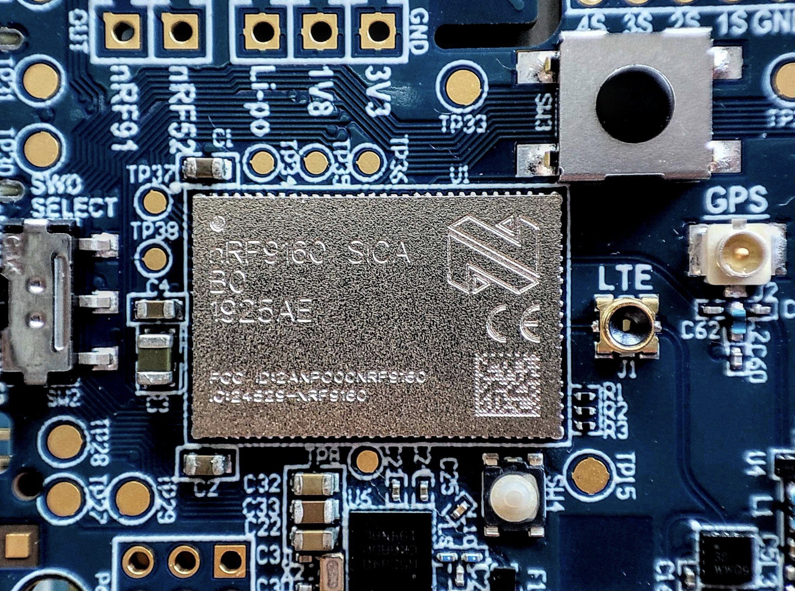

The Nordic Thingy:91 is a very good development kit for rapid prototyping offering a good number of sensors and several connectivity options making it a good candidate for many use cases both industrial or even home automation related. It's also a good choice if you are not too hardware savvy or lack the tools to assemble/test electronic modules. The recipe presented above can be quickly modified and customized to enable the monitoring of other various environmental properties that you want to keep an eye on.

If you need assistance in deploying your own solutions or more information about the tutorial above please [reach out to us](https://edgeimpulse.com/contact)!
