# Predictive Maintenance Using Audio Classification 

Created By:
Shebin Jose Jacob

Public Project Link:
[https://studio.edgeimpulse.com/public/162492/latest](https://studio.edgeimpulse.com/public/162492/latest)

## Intro

Every manufacturing environment is equipped with machines. For a better-performing manufacturing unit, the health of machines plays a major role and hence maintenance of the machines is important. We have three strategies of maintenance namely - Preventive maintenance, Corrective maintenance, and Predictive maintenance.

If you want to find the best balance between preventing failures and avoiding over-maintenance, Predictive Mainenance (PdM) is the way to go. Equip your factory with relatively affordable sensors to track temperature, vibrations, and motion data, use predictive techniques to schedule maintenance when a failure is about to occur, and you'll see a nice reduction in operating costs.

In the newest era of technology, teaching computers to make sense of the acoustic world is now a hot research topic. So in this project, we use sound to do some predictive maintenance using an Arduino Nano 33 BLE Sense.

## How Does It Work?

We use the Nano 33 BLE Sense to listen to the machine continuously. The MCU runs an ML model which is trained on two sets of acoustic anomalies and a normal operation mode. When the ML model identifies an anomaly, the operator is immediately notified and the machine may be shut down for maintenance after proper inspection. Thus, we can reduce the possible damage caused and can reduce the downtime.

## Hardware Requirements
* Nano 33 BLE Sense
* LED

## Software Requirements
* Edge Impulse
* Arduino IDE

## Hardware Setup

The hardware setup consists of a Nano 33 BLE Sense, which is placed beside an old AC motor.

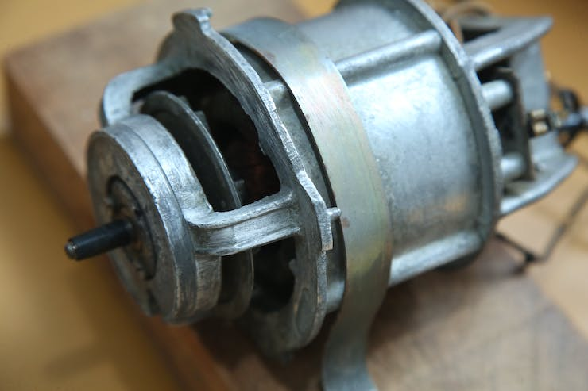

## Software Setup

If you haven't connected the device to Edge Impulse dashboard, follow [this tutorial](https://docs.edgeimpulse.com/docs/development-platforms/officially-supported-mcu-targets/arduino-nano-33-ble-sense) to get it connected. After a successful connection, it should be present in the **Devices** tab.

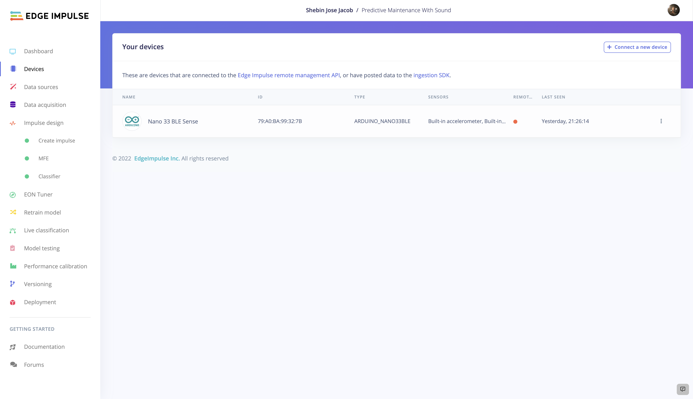

Alternatively, recent versions of Google Chrome and Microsoft Edge can collect data directly from your development board, without the need for the Edge Impulse CLI. Follow [this tutorial](https://www.edgeimpulse.com/blog/collect-sensor-data-straight-from-your-web-browser) to learn more about it.

## TinyML Model Generation

### 1. Data Collection

Clean data is the most important requirement to train a well-performing model. In our case, we have collected 3 classes of sound - two classes of anomalies, one normal operation class, and a noise class. Each sample is 2 seconds long. The raw data of these classes is visualised below.

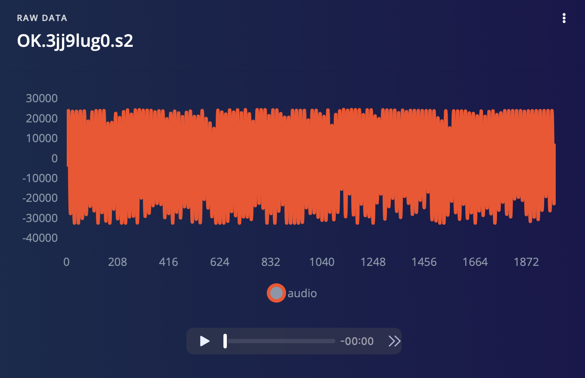

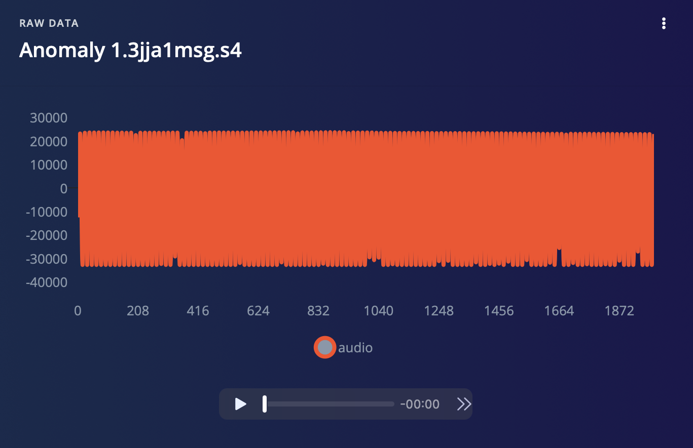

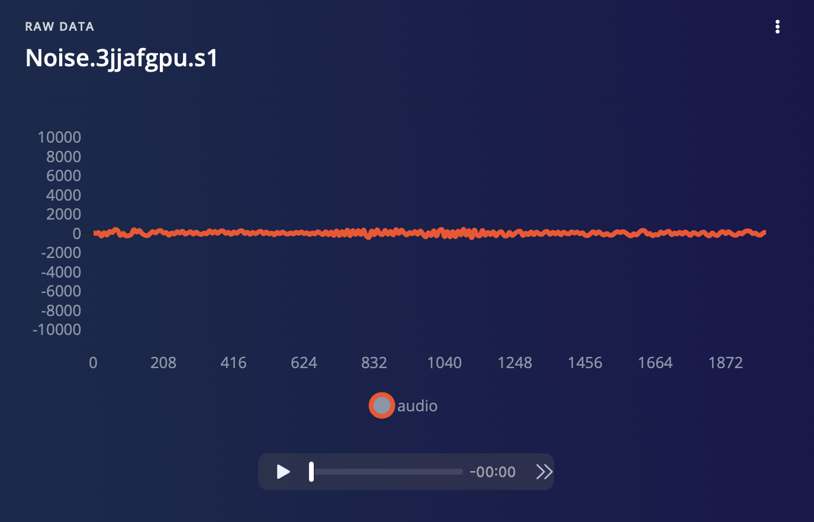

If the data is not split into training and testing datasets, split the dataset into training and testing datasets in the ratio 80:20, which forms a good dataset for model training.

### 2. Impulse Design

An Impulse is the machine learning pipeline that takes raw data, uses signal processing to extract features, and then uses a learning block to classify new data.

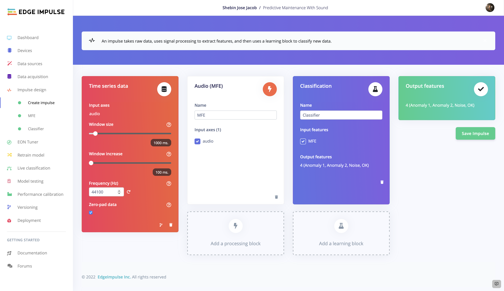

Here we are using the **Time Series data** as the input block. Now, we have two choices for the processing block - MFCC and MFE. As we are dealing with non-vocal audio and MFE performs well with non-vocal audio, we have chosen **MFE** as our processing block. We have used **Classification** as our learning block since we have to learn patterns and apply them to new data to categorize the audio into one of the given 4 classes.

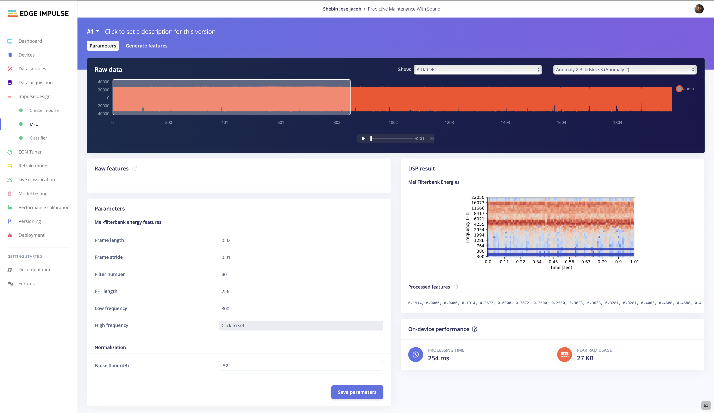

In the **MFE** tab, you can tweak the parameters if you're good with audio handling, else leave the settings as it is and generate features.

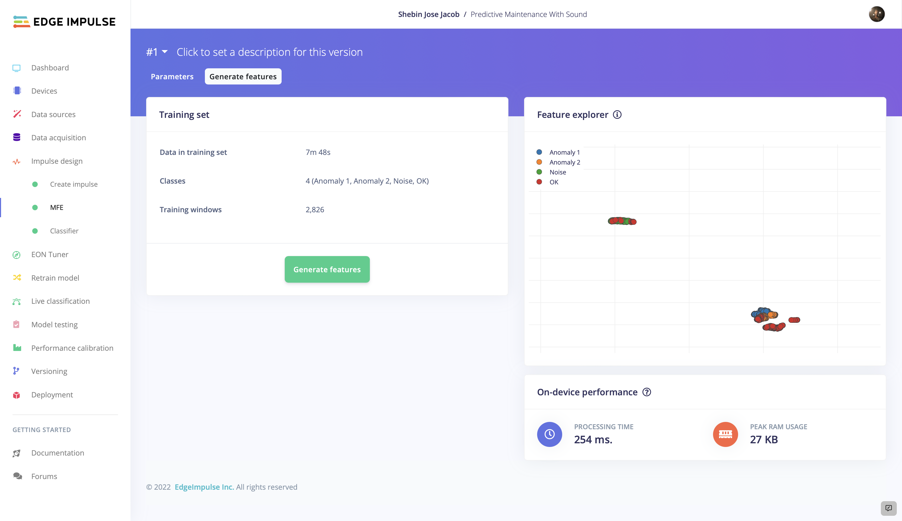

### 3. Model Training and Testing

Now that we have our Impulse designed, let's proceed to train the model. The settings we employed for model training are depicted in the picture. You can play about with the model training settings so that the trained model exhibits a higher level of accuracy, but be cautious of overfitting.

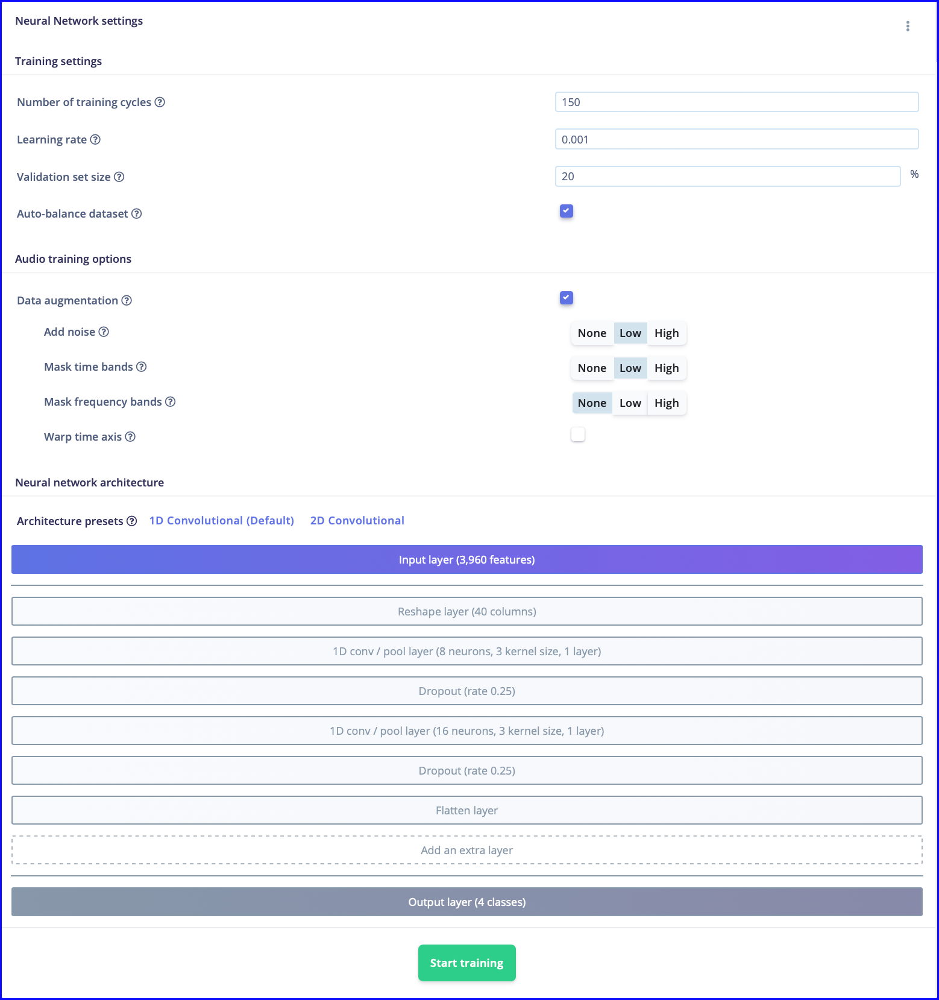

A whopping 94.7% accuracy is achieved by the trained model.

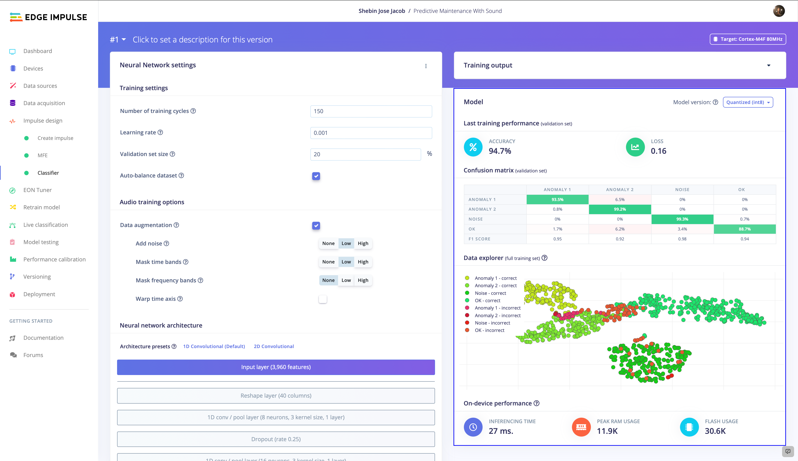

Let's now use some unknown data to test the model's functionality. To assess the model's performance, move on to **Model Testing** and **Classify All**.

We have got 95.07% testing accuracy, which is pretty awesome. Now let's test the model with some real-world data. Navigate to **Live Classification** and collect some data from the connected device.

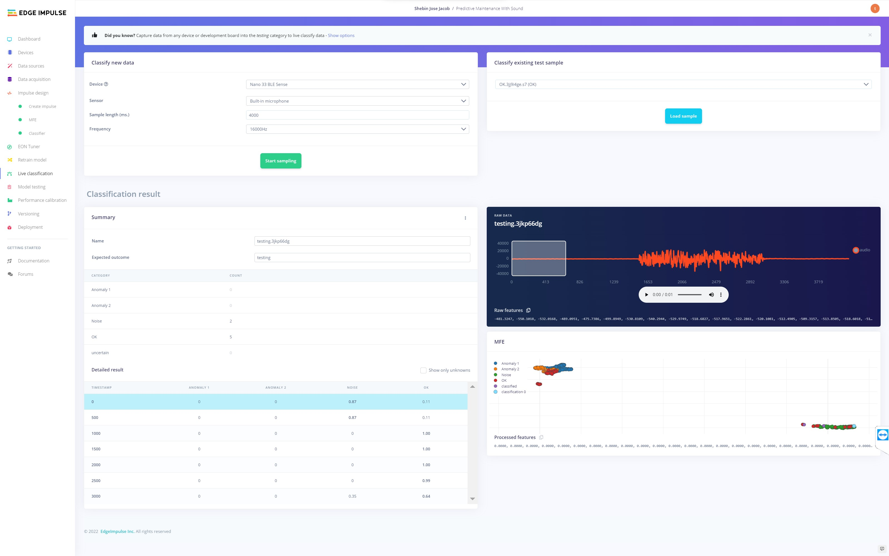

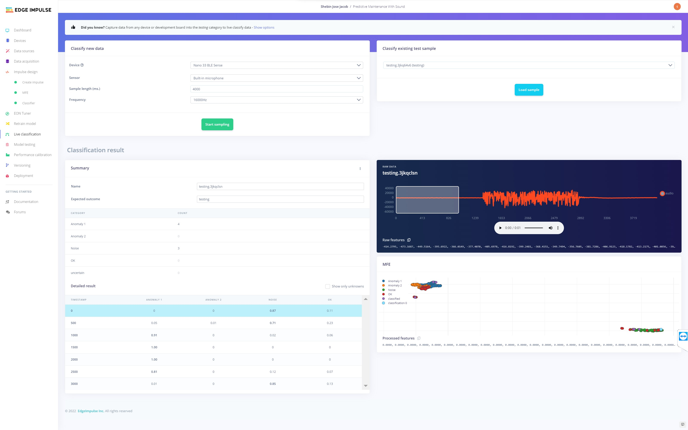

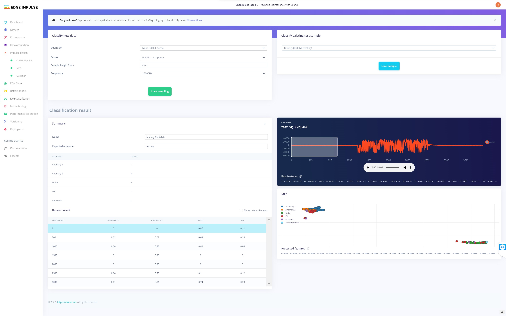

We have collected some real-world data of **Normal Operation Mode**, **Anomaly 1**, and **Anomaly 2** respectively, and all of them are correctly classified. So our model is ready for deployment.

## Deployment

For deployment, navigate to the **Deployment** tab, select **Arduino Library** and build the library. It will output a zip library, which can be added to **Arduino IDE**.

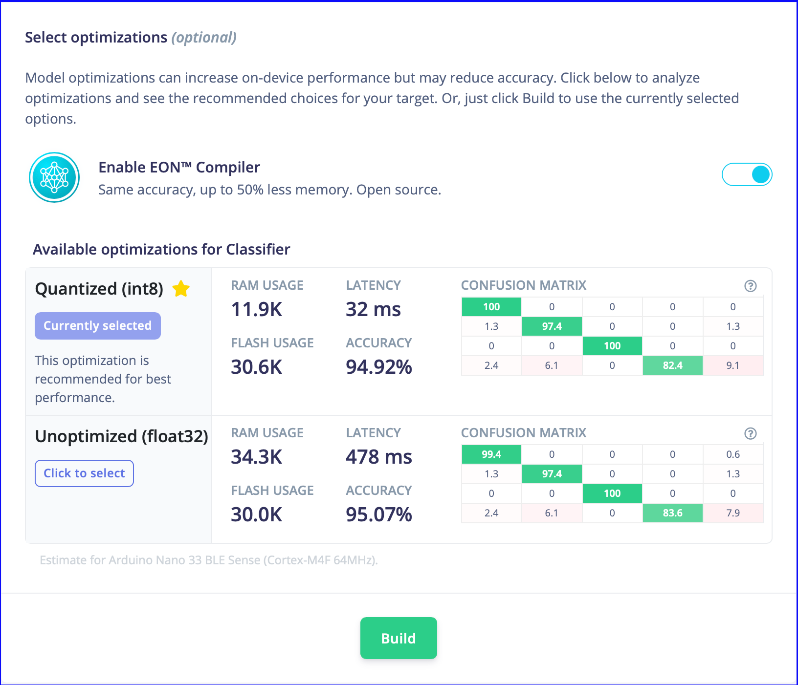

## Code

The entire assets for this project are given in this [GitHub repository](https://github.com/CodersCafeTech/Predictive-Maintenance-With-Sound).

## Final Product

Nano 33 BLE Sense along with an LED is enclosed in a 3D printed case, which is our final product. The device is capable of identifying acoustic anomalies in a machine and alerts the user using the alert LED.

