# Surgery Inventory Object Detection - Synthetic Data - Nvidia Omniverse Replicator

Created By: Eivind Holt

Public Project Link: [https://studio.edgeimpulse.com/public/322153/latest](https://studio.edgeimpulse.com/public/322153/latest)

GitHub Repo: [https://github.com/eivholt/surgery-inventory-synthetic-data](https://github.com/eivholt/surgery-inventory-synthetic-data)

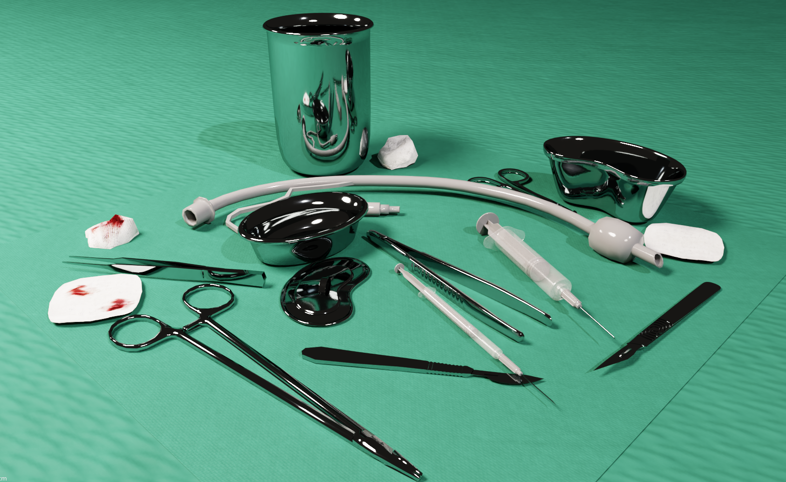

## Introduction

This wearable device keeps track of instruments and materials used during surgery. This can be useful as an additional safeguard to prevent Retained Surgical Bodies.

Extensive routines are in place pre-, during, and post-operation to make sure no unintentional items are left in the patient. In the small number of cases when items are left the consequences can be severe, in some cases fatal. This proof-of-concept explores the use of automated item counting as an extra layer of control.

Here is a demo of chrome surgical instrument detection running on an Arduino Nicla Vision:



In the following drawing we see how equipment and disposable materials are typically organized during surgery. Tools are pre-packaged in sets for the appropriate type of surgery and noted when organized on trays or tables. Swabs are packaged in numbers and contain tags that are noted and kept safe. When swabs are used they are displayed individually in transparent pockets on a stand so they can be counted and checked with the tags from the originating package. Extensive routines are in place to continuously count all equipment used; still errors occur [an estimated rate between 0.3 and 1 per 1000 abdominal operations](https://www.ncbi.nlm.nih.gov/pmc/articles/PMC5320916/).

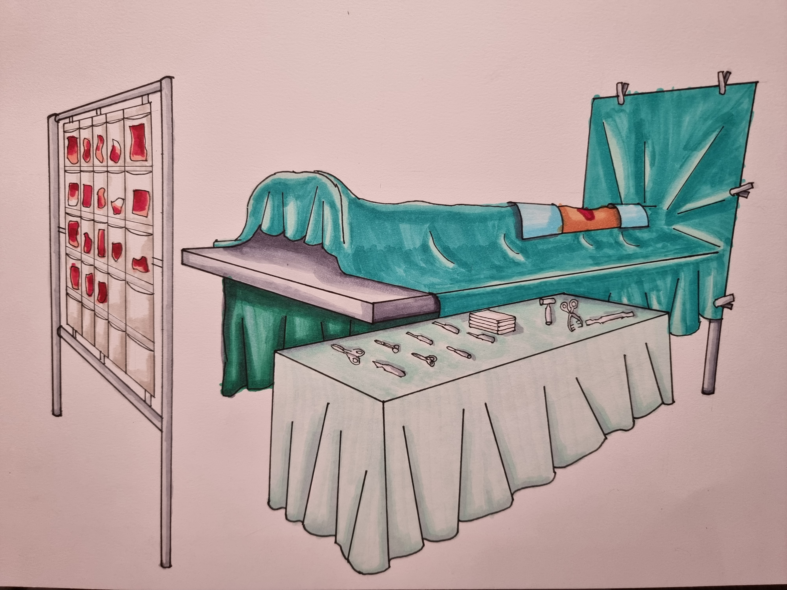

Existing solutions are mainly based on either x-ray or RFID. With x-ray, the patient needs to be scanned using a scanner on wheels. Metal objects obviously will be visible, while other items such as swabs needs to have metal strips woven to be detected and the surgery team has to wear lead aprons. Some items have passive RFID-circuits embedded and can be detected by a handheld scanner.

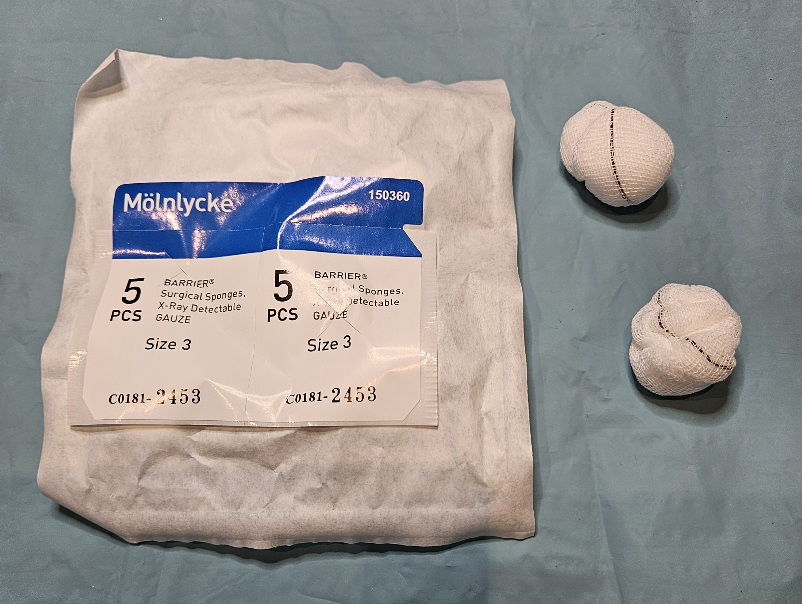

## Hardware used:

* [Arduino Nicla Vision](https://docs.edgeimpulse.com/docs/development-platforms/officially-supported-mcu-targets/arduino-nicla-vision)
* NVIDIA GeForce RTX 3090 (any RTX will do)
* Formlabs Form 2 3D printer
* Surgery equipment

## Software used:

* [Edge Impulse Studio](https://studio.edgeimpulse.com/studio)
* [NVIDIA Omniverse Code](https://www.nvidia.com/en-us/omniverse/) with [Replicator](https://developer.nvidia.com/omniverse/replicator)
* [Visual Studio Code](https://code.visualstudio.com/)
* [Blender](https://www.blender.org/)
* [Autodesk Fusion 360](https://www.autodesk.no/products/fusion-360/)

## Stationary vs. wearable object detection

Many operating rooms (OR) are equipped with adjustable lights with a camera embedded. A video feed from such a camera could make an interesting source for the object detection model. This project aims to explore the technical viability of running inference on a small wearable. A fish-eye lens could further extend visual coverage. An important design consideration is to make the wearable operable without the need for touch, to avoid cross-contamination. However, this article is scoped to the creation of an object detection model with synthetic data.

## Object detection using neural networks

[FOMO (Faster Objects, More Objects)](https://docs.edgeimpulse.com/docs/edge-impulse-studio/learning-blocks/object-detection/fomo-object-detection-for-constrained-devices) is a novel machine learning algorithm that allows for visual object detection on highly constrained devices through training of a neural network with a number of convolutional layers.

## Challenges

### Reflective surfaces

As if detecting objects on highly constrained devices wasn't challenging enough, this use case poses a potential show stopper. Most of the tools used in surgery have a chrome surface. Due to the reflective properties of chrome, especially the high specular reflection and highlights, a given item's features will vary highly judged by its composition of pixels, in this context known as features. Humans are pretty good at interpreting highly reflective objects, but there are many examples where even we may get confused.


### Number of objects and classes

Our neural network will be translated into code that will compile and execute on a highly constrained device. One of the limiting factors is the amount of RAM which will directly constrain a number of parameters. In addition to having to keep the images from the camera sensor to a mere 96x96 pixels, there is a limit on the number of classes we can identify. Also, there is a predefined limit of the number of items we can detect in a given frame, set to 10. There is room to experiment with expanding parameters, but it is better to embrace these limiting factors and try to think creatively. For instance, the goal of the device isn't to identify specific items or types of items, but rather to make the surgery team aware if item count doesn't add up. With this approach we can group items with similar shapes and surfaces. Having said that, RAM size on even the smallest devices will certainly increase in the near future. The number of images used for training the model does not affect memory usage.

## Edge Impulse Studio

Edge Impulse Studio offers a web-based development platform for creating machine learning solutions from concept to deployment.

## Manual data collection and labeling

Using the camera on the intended device for deployment, the Arduino Nicla Vision, around 600 images were initially captured and labeled. Most images contained several items and a fraction were unlabeled images of unrelated background objects.

The model trained on this data was quickly deemed useless in detecting reflective items but provided a nice baseline for the proceeding approaches.

To isolate the chrome surfaces as a problematic issue, a number of chrome instruments were spray painted matte and a few plastic and cloth based items were used to make a new manually captured and labeled dataset of the same size. For each image the items were scattered and the camera angle varied.

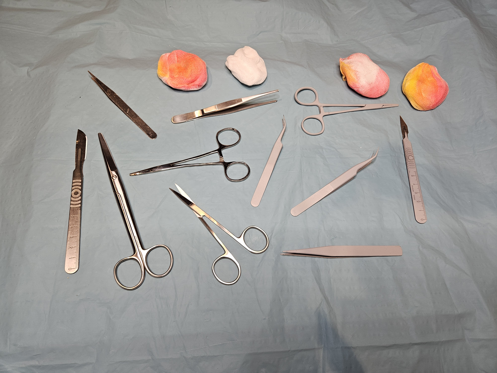

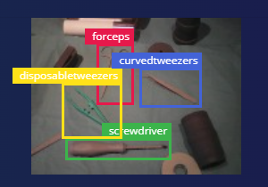

This model worked great and can be inspected [here](https://studio.edgeimpulse.com/public/94601/latest).

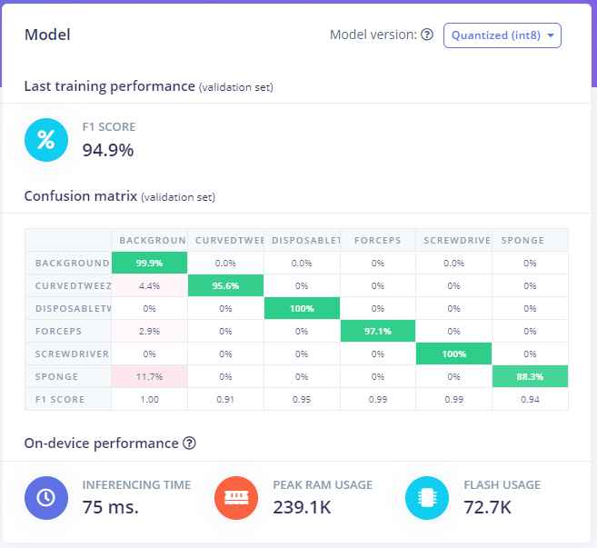

A video demonstrating live inference from the device camera can be seen here. Only trained objects are marked. Flickering can be mitigated by averaging.



**Matte objects detection demo, video Eivind Holt**

## Compensating for reflections with large set of training data

The remainder of the article answers the question whether highly reflective objects can be reliably detected on constrained hardware given enough training data.

## Synthetic training data

A crucial part of any ML-solution is the data the model is trained, tested and validated on. In the case of a visual object detection model this comes down to a large number of images of the objects to detect. In addition each object in each image needs to be labeled. Edge Impulse offers an intuitive tool for drawing boxes around the objects in question and to define labels. On large datasets manual labeling can be a daunting task, thankfully EI offers an auto-labeling tool. Other tools for managing datasets offer varying approaches for automatic labeling, for instance using large image datasets. However, often these datasets are too general and fall short for specific use cases.

### NVIDIA Omniverse Replicator

One of the main goals of this project is to explore creating synthetic object images that come complete with labels. This is achieved by creating a 3D scene in NVIDIA Omniverse and using it's Replicator Synthetic Data Generation toolbox to create thousands of slightly varying images, a concept called domain randomization. With a NVIDIA RTX 3090 graphics card from 2020 it is possible to produce about 2 ray-traced images per second. Thus, creating 10,000 images would take about 5 hours.

## Solution overview

We will be walking through the following steps to create and run an object detection model on a microcontroller devkit. An updated Python environment with Visual Studio Code is recommended. A 3D geometry editor such as Blender is needed if object 3D models are not in USD-format (Universal Scene Description).

* Installing Omniverse Code, Replicator and setting up debugging with Visual Studio Code
* Creating a 3D stage/scene in Omniverse
* Working with 3D models in Blender
* Importing 3D models in Omniverse, retaining transformations, applying materials
* Setting metadata on objects
* Creating script for domain randomization
* Creating label file for Edge Impulse Studio
* Creating an object detection project in Edge Impulse Studio and uploading dataset
* Training and deploying model to device
* 3D printing a protective housing for the device
* Using object detection model in an application

## Installing Omniverse Code, Replicator and setting up debugging with Visual Studio Code

NVIDIA Omniverse

* Install [Omniverse from NVIDIA](https://docs.omniverse.nvidia.com/extensions/latest/ext_replicator/getting_started.html).
* Install Code: Open Omniverse Launcher, go to Exchange, install Code.

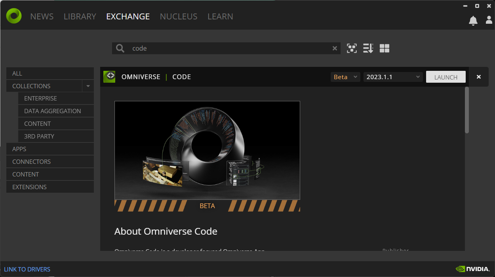

* Launch Code from NVIDIA Omniverse Launcher.

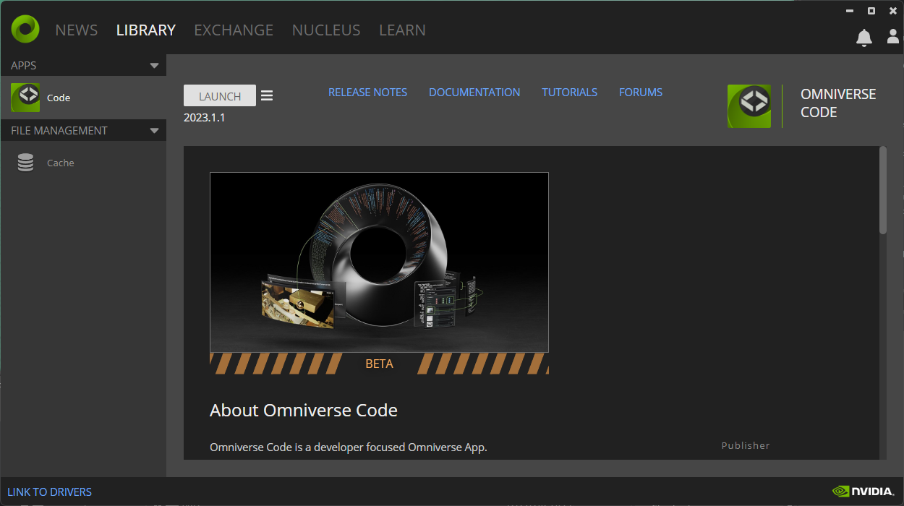

* Go to Window->Extensions and install Replicator

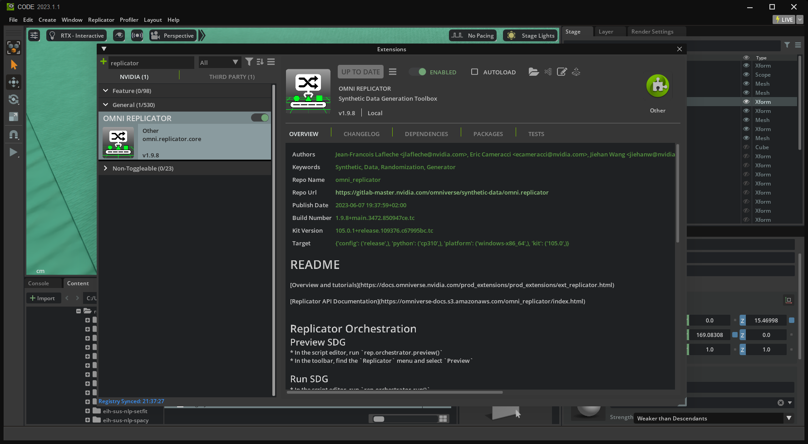

* Install [Embedded VS Code for NVIDIA Omniverse](https://github.com/Toni-SM/semu.misc.vscode)

## Creating a 3D stage/scene in Omniverse

* Create a new stage/scene (USD-file)
* Create a textured plane that will be a containment area for scattering the objects
* Create a larger textured plane to fill the background
* Add some lights

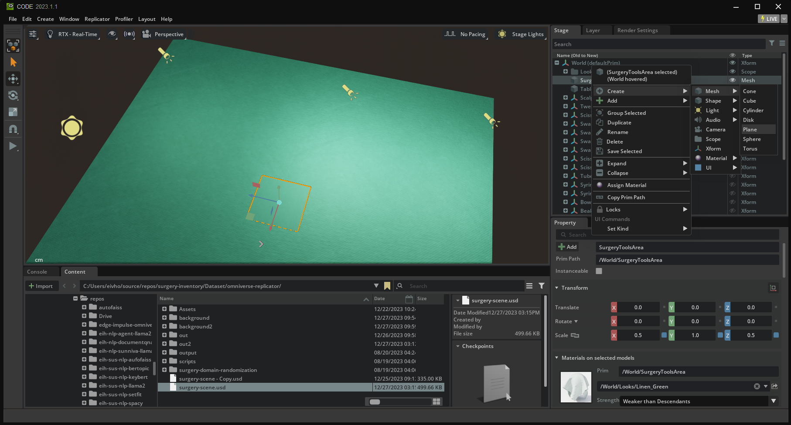

If you have a hefty heat producing GPU next to you, you might prefer to reduce the FPS limit in the viewports of Code. It may default to 120 FPS, generating a lot of heat when the viewport is in the highest quality rendering modes. Set "UI FPS Limit" and "Present thread FPS Limit" to 60. This setting unfortunately does not persist between sessions, so we have to repeat this every time projects open.

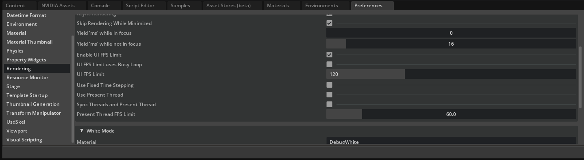

## Working with 3D models in Blender

The objects we want to be able to detect need to be represented with a 3D model and a surface (material). Omniverse provides a library of ready-to-import assets, further models can be created using editors such as Blender or purchased on sites such as [Turbo Squid](https://www.turbosquid.com/).

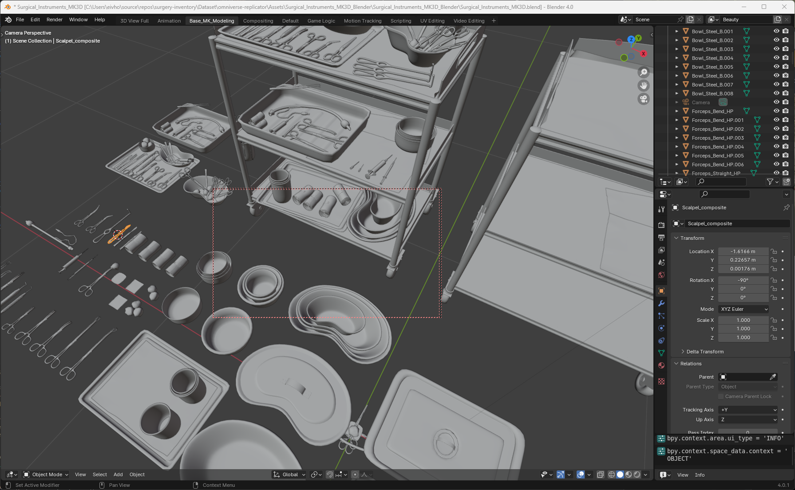

A scene containing multiple geometric models should be exported on an individual model basis, with USD-format as output.

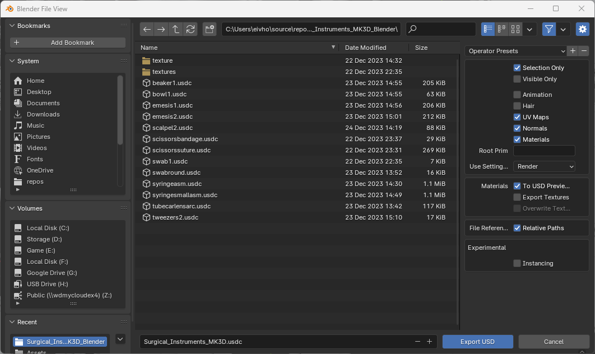

Omniverse has recently received limited support in importing BSDF material compositions, but this is still experimental. In this project materials or textures were not imported directly.

## Importing 3D models in Omniverse, retaining transformations, applying materials

To avoid overwriting any custom scaling or other transformations set on exported models it is advisable to add a top node of type Xform on each model hierarchy. Later we can move the object around without loosing adjustments.

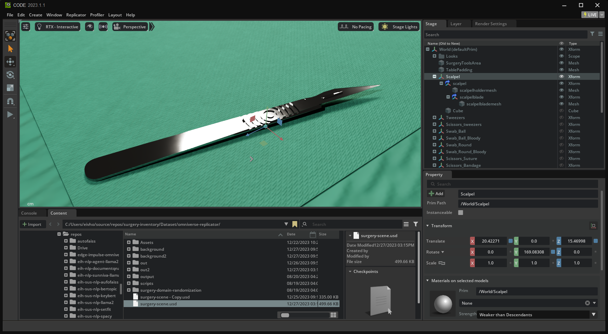

The replicator toolbox has a function for scattering objects on a surface in it's API. To (mostly) avoid object intersection a few improvements can be made. In the screenshot a basic shape has been added as a bounding box to allow some clearance between objects and to make sure thin objects are more appropriately handled while scattering. The bounding box can be set as invisible. As of Replicator 1.9.8 some object overlap seems to be unavoidable.

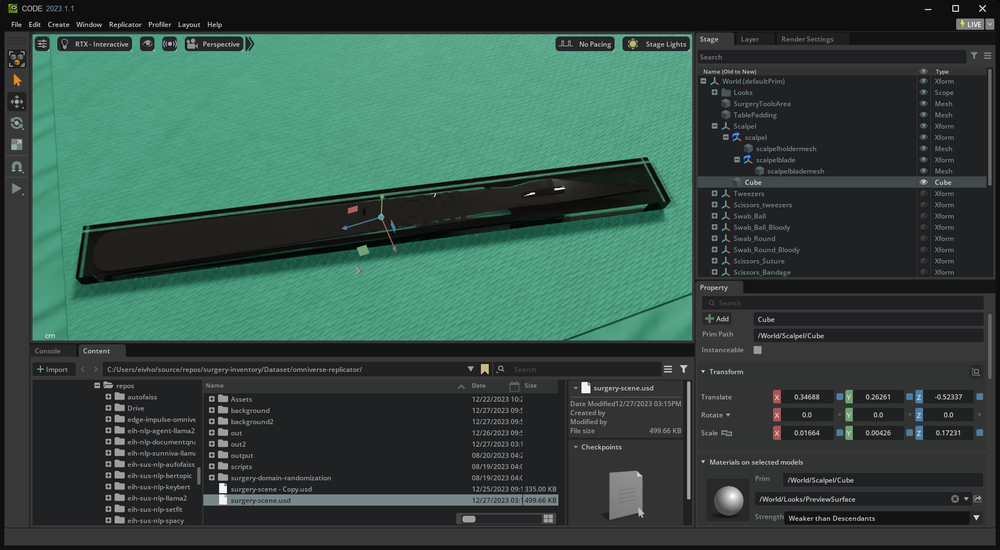

For the chrome surfaces a material from one of the models from the library provided through Omniverse was reused, look for [http://omniverse-content-production.s3-us-west-2.amazonaws.com/Materials/Base/Metals/Chrome/](http://omniverse-content-production.s3-us-west-2.amazonaws.com/Materials/Base/Metals/Chrome/) in the Omniverse Asset Store. Remember to switch to "RTX - Interactive" rendering mode to see representative ray-tracing results, "RTX - Real-Time" is a simplified rendering pipeline.

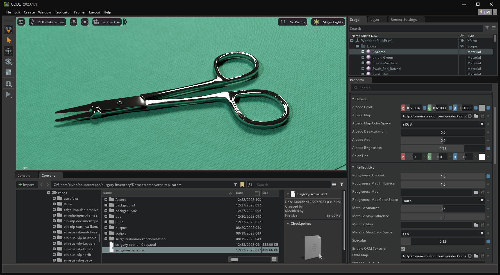

For the cloth based materials some of the textures from the original models were used, more effort in setting up the shaders with appropriate texture maps could improve the results.

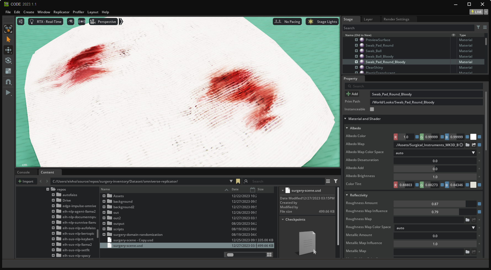

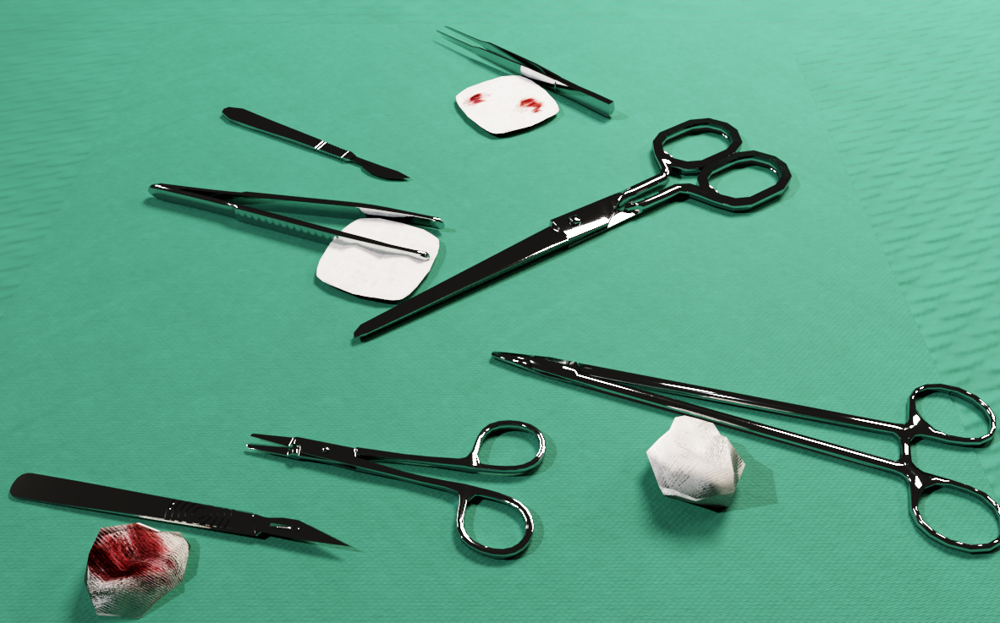

## Setting metadata on objects

To be able to produce images for training and include labels we can use a feature of Replicator toolbox found under menu Replicator->Semantics Schema Editor.

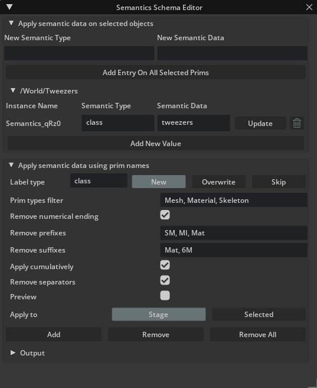

Here we can select each top node representing an item for object detection and adding a key-value pair. Choosing "class" as Semantic Type and e.g. "tweezers" as Semantic Data enables us to export these strings as labels later. The UI could benefit from a bit more exploration in intuitive design, as it is easy to misinterpret what fields shows the actual semantic data set on an item, an what fields carry over intended to make labeling many consecutive items easier.

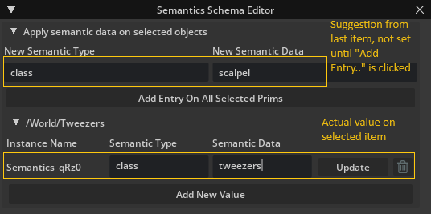

Semantics Schema Editor may also be used with multiple items selected. It also has handy features to use the names of the nodes for automatic naming.

## Creating script for domain randomization

This part describes how to write a script in Python for randomizing the images we will produce. We could choose to start with an empty stage and programatically load models (from USD-files), lights, cameras and such. With a limited number of models and lights we will proceed with adding most items to the stage manually as described earlier. Our script can be named anything, ending in .py and preferably placed close to the stage USD-file. The following is a description of [such a script replicator\_init.py](https://github.com/eivholt/surgery-inventory-synthetic-data/blob/main/omniverse-replicator/replicator_init.py):

To keep the items generated in our script separate from the manually created content we start by creating a new layer in the 3D stage:

```
python
with rep.new_layer():
```

Next we specify that we want to use ray tracing as our image output. We create a camera and hard code the position. We will point it to our items for each render later. Then we use our previously defined semantics data to get references to items, background items and lights for easier manipulation. Lastly we define our render output by selecting the camera and setting the desired resolution. Note that the intended resolution of 96x96 pixels seem to produce artifacts, so we set it a bit higher, at 128x128 pixels. Edge Impulse Studio will take care of scaling the images to the desired size.

```
python
rep.settings.set_render_pathtraced(samples_per_pixel=64)
camera = rep.create.camera(position=(0, 24, 0))
tools = rep.get.prims(semantics=[("class", "tweezers"), ("class", "scissors"), ("class", "scalpel"), ("class", "sponge")])
backgrounditems = rep.get.prims(semantics=[("class", "background")])
lights = rep.get.light(semantics=[("class", "spotlight")])
render_product = rep.create.render_product(camera, (128, 128))
```

Due to the asynchronous nature of Replicator we need to define our randomization logic as call-back methods by first registering them in the following fashion:

```
python
rep.randomizer.register(scatter_items)
rep.randomizer.register(randomize_camera)
rep.randomizer.register(alternate_lights)
```

Before we get to the meat of the randomization we define what will happen during each render:

```
python
with rep.trigger.on_frame(num_frames=10000, rt_subframes=20):
		rep.randomizer.scatter_items(tools)
		rep.randomizer.randomize_camera()
		rep.randomizer.alternate_lights()
```

`num_frames` defines how many renders we want. `rt_subframes` lets the render pipeline proceed a number of frames before capturing the result and passing it on to be written to disk. Setting this high will let advanced ray tracing effects such as reflections have time to propagate between surfaces, though at the cost of higher render time. Each randomization sub-routine will be called, with optional parameters.

To write each image and semantic information to disk we use a provided API. We could customize the writer but as of Replicator 1.9.8 on Windows this resulted in errors. We will use "BasicWriter" and rather make a separate script to produce a label format compatible with EI.

```
python
writer = rep.WriterRegistry.get("BasicWriter")
writer.initialize(
    output_dir="out",
    rgb=True,
    bounding_box_2d_tight=True)

writer.attach([render_product])
asyncio.ensure_future(rep.orchestrator.step_async())
```

Here `rgb` tells the API that we want the images to be written to disk as png-files, `bounding_box_2d_tight` that we want files with labels (from previously defined semantics) and bounding boxes as rectangles. The script ends with running a single iteration of the process in Omniverse Code, so we can visualize the results.

The bounding boxes can be visualized by clicking the sensor widget, checking "BoundingBox2DTight" and finally "Show Window".

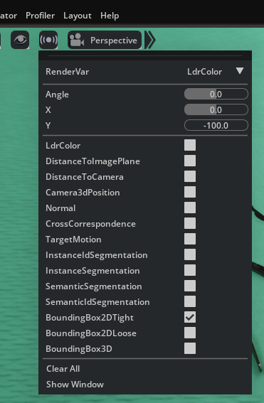

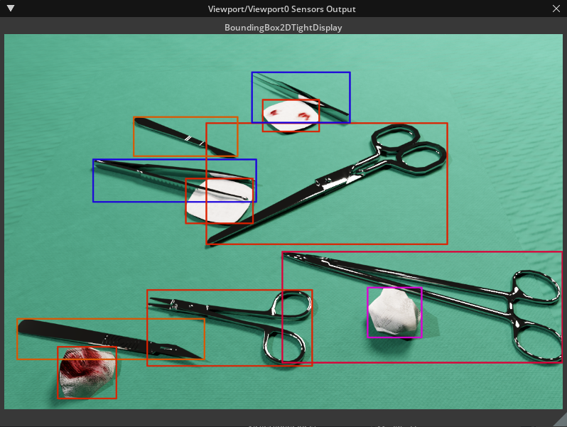

Only thing missing is defining the randomization logic:

```
python
def scatter_items(items):
    table = rep.get.prims(path_pattern='/World/SurgeryToolsArea')
    with items as item:
        carb.log_info("Tool: " + tool)
        logger.info("Tool: " + tool)
        rep.modify.pose(rotation=rep.distribution.uniform((0, 0, 0), (0, 360, 0)))
        rep.randomizer.scatter_2d(surface_prims=table, check_for_collisions=True)
    return items.node

def randomize_camera():
    with camera:
        rep.modify.pose(
            position=rep.distribution.uniform((-10, 50, 50), (10, 120, 90)),
            look_at=(0, 0, 0))
    return camera

def alternate_lights():
    with lights:
        rep.modify.attribute("intensity", rep.distribution.uniform(10000, 90000))
    return lights.node
```

For `scatter_items` we get a reference to the area that will contain our items. Each item is then iterated so that we can add a random rotation (0-360 degrees on the surface plane) and use `scatter_2d` to randomize placement. For the latter, `surface_prims` takes an array of items to use as possible surfaces, `check_for_collisions` tries to avoid overlap. The order of operations is important to avoid overlapping items.

For the camera we simply randomize the position in all 3 axis and make sure it points to the center of the stage.

With the lights we randomize the brightness between a set range of values.

Note that in the provided example rendering images and labels is separated between the actual objects we want to be able to detect and background items for contrast. The process would run once for the surgery items, then the following line would be changed from

```
python
rep.randomizer.scatter_items(tools)
```

to

```
python
rep.randomizer.scatter_items(backgrounditems)
```

When rendering the items of interest the background items would have to be hidden, either manually or programatically, and vice versa. The output path should also be changed to avoid overwriting the output.

Whether the best approach for training data is to keep objects of interest and background items in separate images or to mix them is debated, both with sound reasoning. In this project the best results were achieved by generating image sets of both approaches.

## Creating label file for Edge Impulse Studio

Edge Impulse Studio supports a wide range of image labeling formats for object detection. Unfortunately the output from Replicator's BasicWriter needs to be transformed so it can be uploaded either through the web interface or via [web-API](https://docs.edgeimpulse.com/reference/ingestion-api#ingestion-api).

Provided is a simple Python program, [basic\_writer\_to\_pascal\_voc.py](https://github.com/eivholt/surgery-inventory-synthetic-data/blob/main/omniverse-replicator/basic_writer_to_pascal_voc.py). A simple prompt was written for ChatGPT describing the output from Replicator and the [desired results described at EI](https://docs.edgeimpulse.com/docs/edge-impulse-studio/data-acquisition/uploader#understanding-image-dataset-annotation-formats). Run the program from shell with

```
python basic_writer_to_pascal_voc.py <input_folder>
```

or debug from Visual Studio Code by setting input folder in `launch.json` like this:

```
"args": ["../out"]
```

This will create a file `bounding_boxes.labels` that contains all labels and bounding boxes per image.

## Creating an object detection project in Edge Impulse Studio and uploading dataset

Look at the [provided object detection Edge Impulse project](https://studio.edgeimpulse.com/public/322153/latest) or [follow a guide to create a new object detection project](https://docs.edgeimpulse.com/docs/edge-impulse-studio/learning-blocks/object-detection/fomo-object-detection-for-constrained-devices#how-to-get-started).

For a project intended to detect objects with reflective surfaces a large number of images is needed for training, but the exact number depends on a lot of factors and some experimentation should be expected. It is advisable to start relatively small, say 1,000 images of the objects to be detected. For this project over **30,000** images were generated; this is much more than needed. A number of images of random background items are also needed to produce results that will work in the real world. This project uses other surgery equipment for convenience, they do not need to be individually labeled. Still Edge Impulse Studio will create a labeling queue for each image for which it has not received labeling data. To avoid having to click through each image to confirm they contain no labels, the program described will produce a bounding\_boxes.labels with empty labels for items tagged with semantic class "background". The factor between images of items to detect and background noise also relies on experimentation, but 1-2% background ratio seems to be a good starting point.

EI creates unique identifiers per image, so you can run multiple iterations to create and upload new datasets, even with the same file names. Just upload all the images from a batch together with the `bounding_boxes.labels` file.

This way we can effortlessly produce thousands of labeled images and witness how performance on detecting reflective objects increases. Keep in mind to try to balance the number of labels for each class.

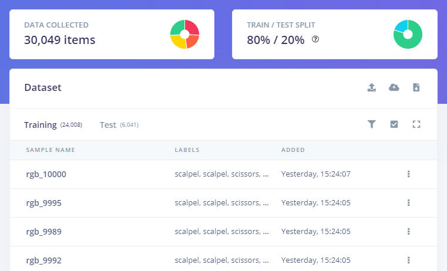

Note that EI has created a nice [GUI-based extension](https://github.com/edgeimpulse/edge-impulse-omniverse-ext/tree/main) for uploading images from Replicator directly to your project. As of the time of writing this extension only uploads images, but this might include label data in the near future.

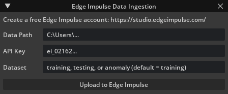

## Training and deploying model to device

Finally we can [design and train our object detection model](https://docs.edgeimpulse.com/docs/tutorials/end-to-end-tutorials/object-detection/detect-objects-using-fomo#3.-designing-an-impulse). Target device should be set and we need to remember that in the case of Arduino Nicla Vision we only have enough RAM for 96x96 pixels. Any type of "early stop" feature would be nice, but for now we need to experiment with the number of training cycles. Data augmentation should be avoided in the case where we generate thousands of images, it will not improve our results.

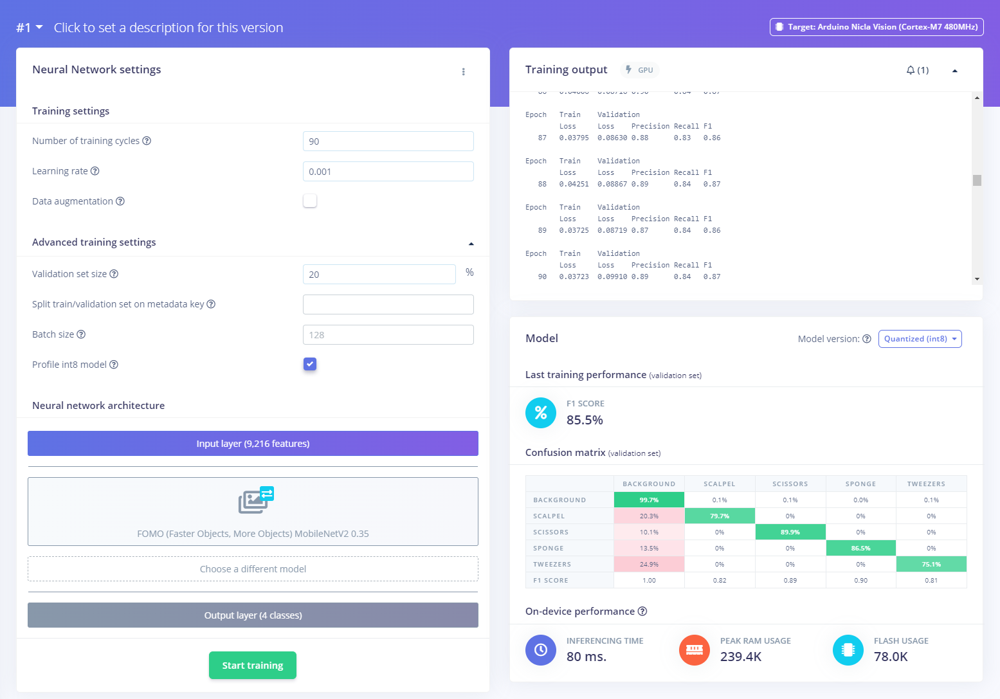

## 3D printing a protective housing for the device

To protect the device and make a simple way to wear it a housing was designed in CAD and 3D printed. It is a good practice to start by making basic 3D representations of all the components, this vastly reduces iterations due to surprises when it comes to assembly.

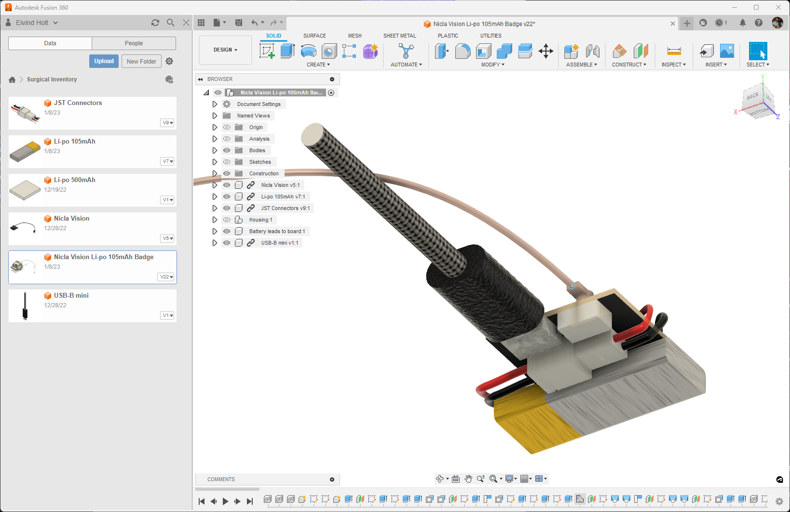

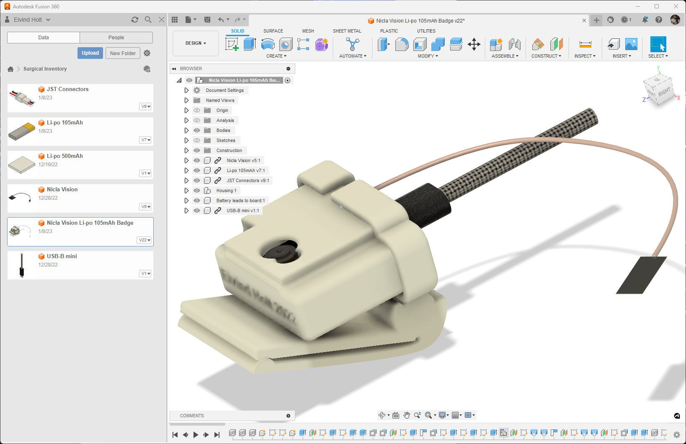

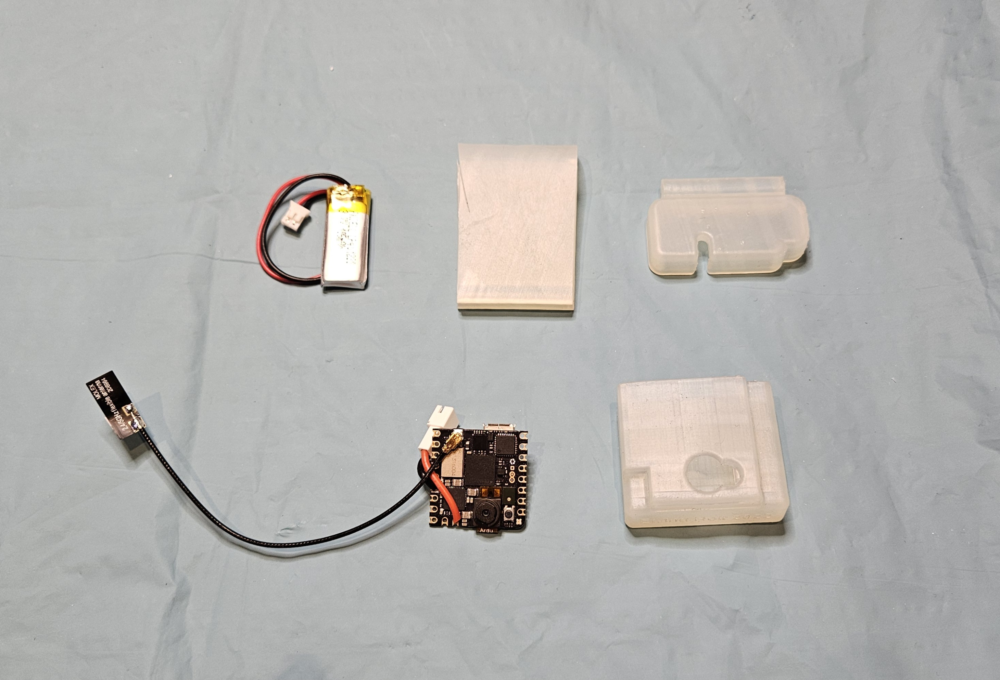

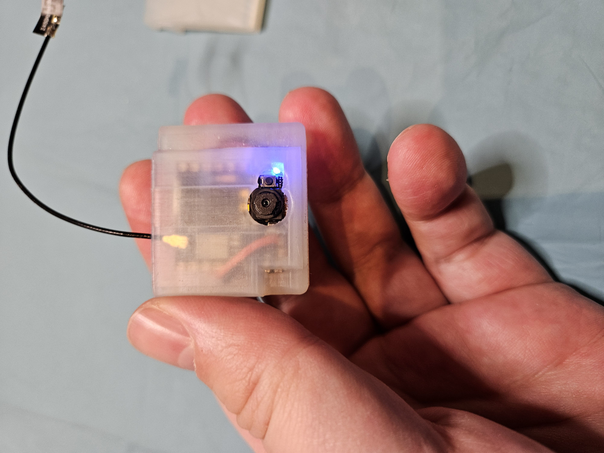

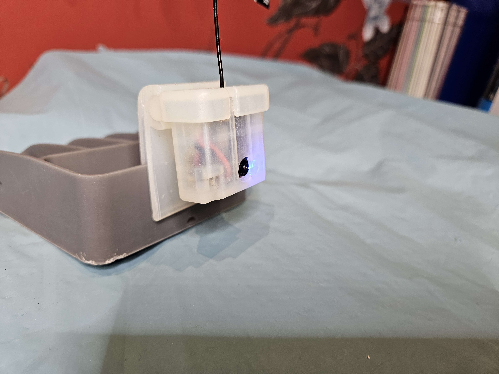

## Using object detection model in an application

A trained model can be compiled into an Arduino-compatible library. Events can trigger inference and the Arduino Nicla Vision can broadcast any number of detected objects via a Bluetooth LE service. A BLE dongle or smart phone can listen for events and route them to a web-API for further integration with other systems. For instance this application can log the detected items in an Electronic Medical Record system. The e-health standard [HL7 FHIR allows for defining devices and materials used during procedures](https://build.fhir.org/device.html). Sandbox environments such as [Open DIPS](https://open.dips.no/) are great places to start experimenting with integrations with hospital systems.

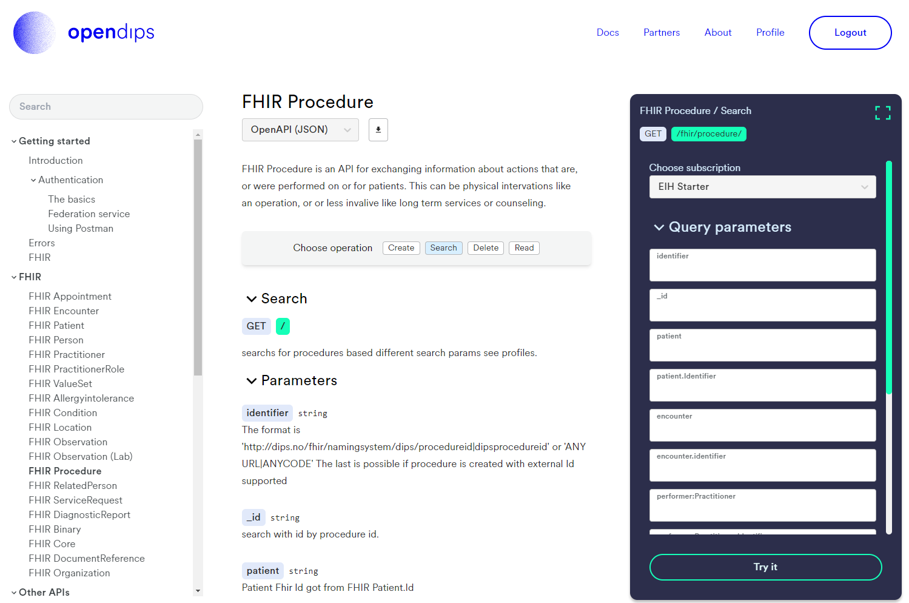

## Results

The results of this project show that training and testing data for object detection models can be synthesized using 3D models, reducing manual labor in capturing images and annotation. Even more impressive is being able to detect unpredictable reflective surfaces on heavily constrained hardware by creating a large number of images.

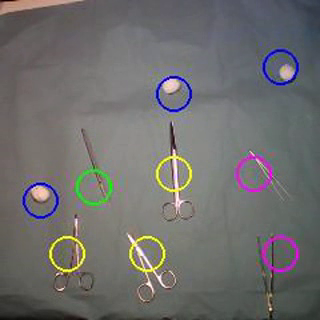

## Conclusion

The domain of visual object detection is currently experiencing a thrilling phase of evolution, thanks to the convergence of numerous significant advancements. Envision a service capable of accepting 3D models as input and generating a diverse array of images for training purposes. With the continuous improvements in generative diffusion models, particularly in the realm of text-to-3D conversion, we are on the cusp of unlocking even more potent capabilities for creating synthetic training data. This progression is not just a technological leap; it's set to revolutionize the way we approach object detection, paving the way for a new generation of highly innovative and effective object detection solutions. The implications of these advancements are vast, opening doors to unprecedented levels of accuracy and efficiency in various applications.

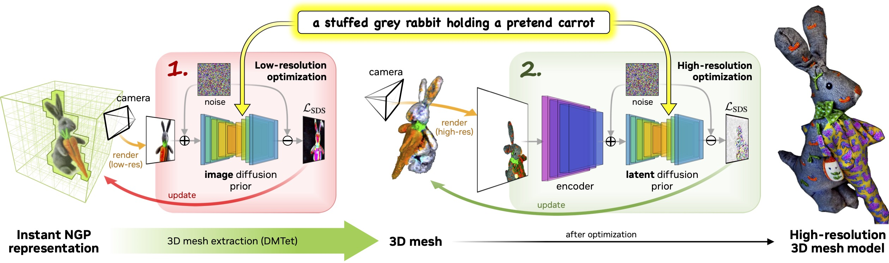

Further reading: [How to Train an Object Detection Model for Visual Inspection with Synthetic Data](https://developer.nvidia.com/blog/how-to-train-an-object-detection-model-for-visual-inspection-with-synthetic-data/)

## Appendix

I highly recommend learning how to debug Omniverse extension code. It requires a bit of work, but it will save a lot of blind troubleshooting as things get complex. Note: This procedure is for debugging extensions.

* To enable Python debugging via Visual Studio Code, in Omniverse Code, go to Extensions.
* Search for "debug" and enable "Kit debug vscode" and "A debugger for Python".


* In Code, the window "VS Code Link" should read "VS Code Debugger Unattached".

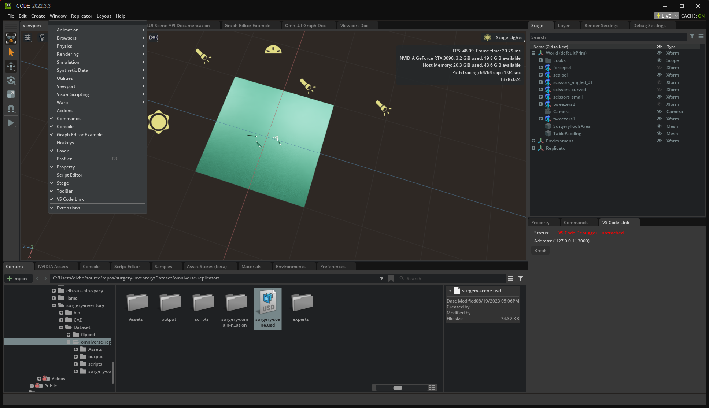

* After activating the project extension, go to the extension details and click "Open in VSCode" icon.

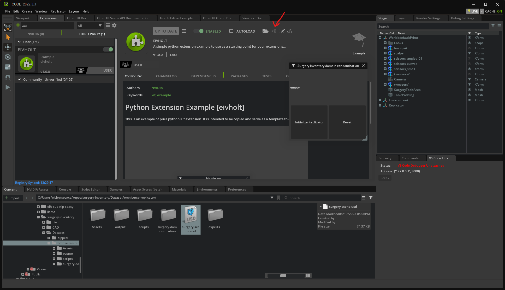

* In Visual Studio Code, make sure in `.vscode\launch.json` the two settings corresponds to what you see in the "VS Code Link" window, e.g. "host": "localhost", and "port": 3000.

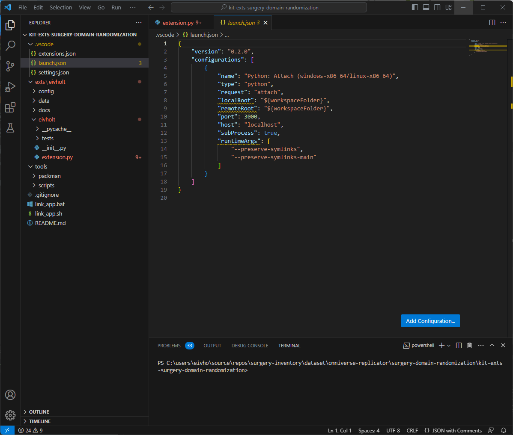

* Go to the Run and Debug pane in VSCode, make sure "Python: Attach .." is selected and press the play button.

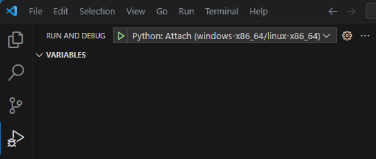

* Back in Omniverse Code, VS Code Link should read "VS Code Debugger Attached".

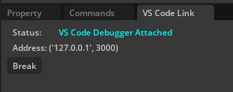

* To test, in VSCode set a breakpoint in `exts\eivholt\extension.py`, e.g. inside the function "run\_replicator".

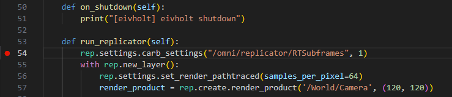

* Back in Omniverse Code, find the project extension UI and click "Initialize Replicator".

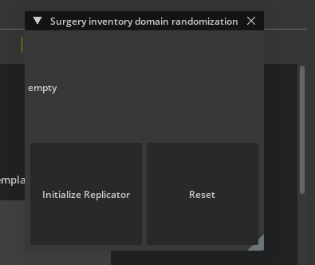

* In VSCode, you should now have hit the breakpoint.

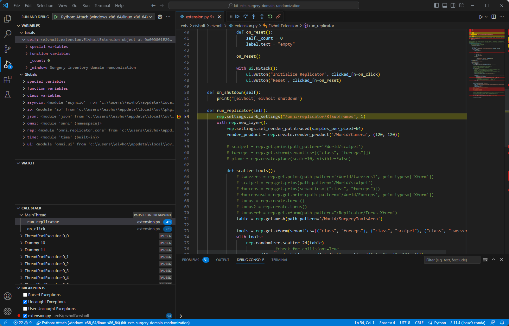

## Edge detection

Another interesting approach to the challenge of detecting reflective surfaces is using edge detection. This would still benefit from synthetic data generation.

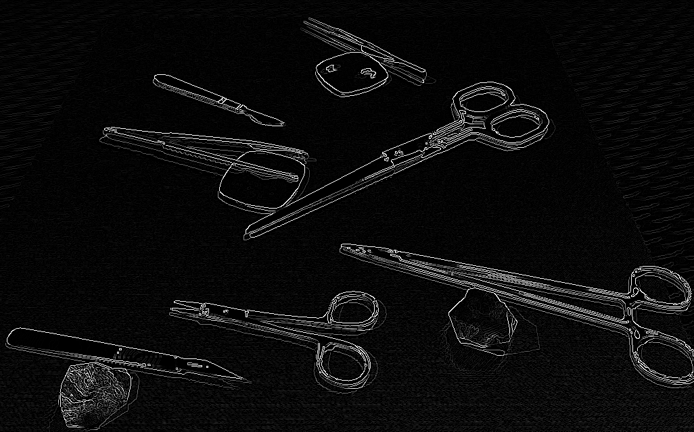

## Disclosure

I work with research and innovation at [DIPS AS](https://www.dips.com/), exploring the future of medical technology. I am a member of Edge Impulse Expert Network. This project was made on my own accord and the views are my own.
