# Refrigerator Predictive Maintenance 

Created By:
Swapnil Verma 

Public Project Link:
[https://studio.edgeimpulse.com/public/115503/latest](https://studio.edgeimpulse.com/public/115503/latest)

## GitHub Repo

[https://github.com/sw4p/Refrigerator_Predictive_Maintenance](https://github.com/sw4p/Refrigerator_Predictive_Maintenance)

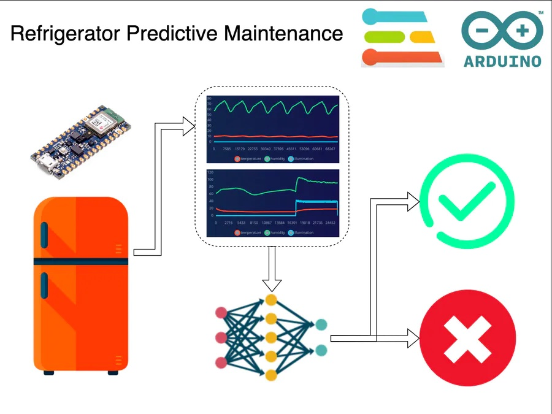

## Story

### Problem

A refrigerator is one of our home's most common and useful appliances. It has changed society and culture by improving the quality of life for people. Refrigerator has increased food accessibility, and food preservation has become so much easier, thus also reducing food wastage.

Refrigerator has another significant impact on the medical sector. It has made preserving and transporting certain medicines, including vaccines, easier, thus increasing accessibility. If a refrigerator storing medicine fails, it will spoil the medicines or reduce their effectiveness.

Considering the importance of a refrigerator in our lives, I am trying to make something to predict a refrigerator failure allowing predictive maintenance in this project.

### My Solution

My proposed solution is to use a machine learning (ML) model to identify a failure as soon as possible using the temperature and humidity changes in a refrigerator.  Project Link:  [https://studio.edgeimpulse.com/public/115503/latest](https://studio.edgeimpulse.com/public/115503/latest)

### Data

A good machine learning model starts with a good dataset. Sadly, I could not find any open dataset of temperature and humidity levels inside a refrigerator, so I decided to build one.

A machine learning model needs at least two kinds of data to identify refrigerator failure.

 - Normal operation data - Time-series data from a normally working refrigerator.
 - Abnormal operation data - Time-series data from a faulty refrigerator.

Different kinds of faults may generate a different pattern in data. For example, a non-working [compressor](https://www.hunker.com/12000409/how-does-a-refrigerator-compressor-work) will never decrease the temperature when it stops working. In contrast, a clogged or dirty coil may force the compressor to work harder than usual, taking more time to achieve the target temperature.

Unfortunately, I do not have access to a faulty refrigerator for data collection; therefore, I have simulated "abnormal operation" data by

 - Keeping the fridge door open for an extended period.

This event should increase the temperature and hopefully force the compressor to work harder, thus simulating a fault state.

`1. Dataset Preparation`

The parameters I want to capture are:

 - Temperature
 - Humidity
 - Illumination - To check the door open/close status. The ML model will not use this parameter, and it is only to help us in visualising and understanding the data.

To capture the above data, I need:

 - A temperature sensor
 - A humidity sensor
 - A light intensity sensor
 - A microcontroller board
 - An SD card module
 - A battery

I already have an Arduino BLE sense with a temperature and a humidity sensor attached to an nRF52840 microcontroller; however, I did not have an SD card module for permanent data recording. For this, I used an Arduino portenta with a vision shield which has SD card support. My convoluted data collection and recording setup is illustrated in the figure below.

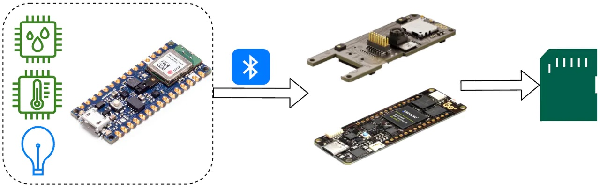

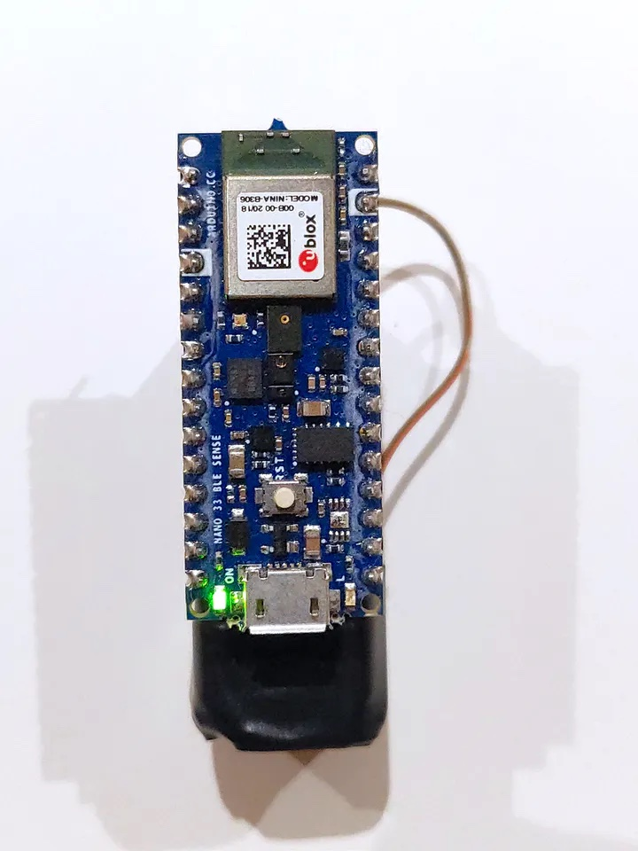

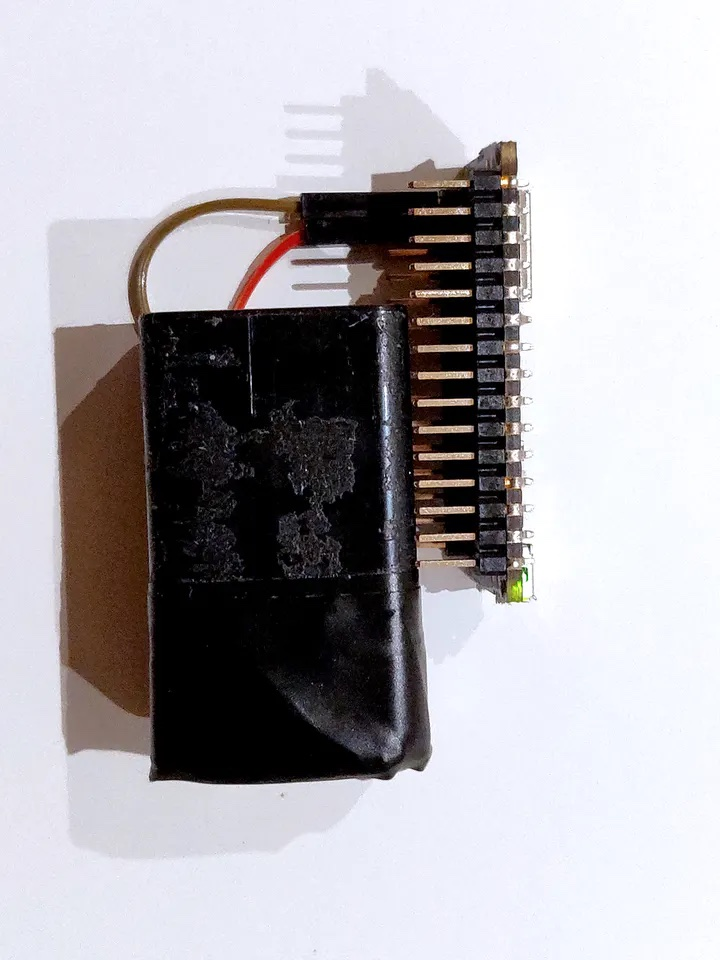

So this is my convoluted setup. The Arduino BLE sense does the data collection and data formatting and sends it over BLE to the Arduino Portenta, which then permanently records that data in a microSD card.

`2. Software for Dataset Preparation`

The software used in the Arduino BLE sense and Arduino portenta for the data collection is available from [this](https://github.com/sw4p/Refrigerator_Predictive_Maintenance) GitHub page.

`https://github.com/sw4p/Refrigerator_Predictive_Maintenance`

The *Dataset_Collector.ino* is for the Arduino BLE sense, and the *Data_Recorder.ino* is for the Arduino Portenta H7 with a Vision Shield.

The Arduino BLE sense records temperature, humidity and illumination reading every 200ms. The *illumination* data is used to detect when the fridge door is open. If *illumination* is greater than 0, then the fridge door is open.

`3. Data Visualization`

The recorded data is in CSV (Comma Separated Value) format, and it looks like this.

```
timestamp,temperature,humidity,illumination
1,9.68,69.01,0
2,9.68,69.03,0
3,9.66,68.96,0
4,9.68,69.07,0
5,9.69,68.96,0
6,9.68,68.98,0
7,9.69,68.95,0
8,9.69,69.06,0
9,9.68,69,0
10,9.68,68.99,0
11,9.64,68.97,0
12,9.71,68.89,0
13,9.64,68.99,0
14,9.69,69,0
15,9.69,68.94,0
16,9.69,68.96,0
17,9.66,68.95,0
18,9.64,68.9,0
19,9.64,68.89,0
20,9.66,68.93,0
21,9.64,68.92,0
22,9.73,68.92,0
```

Most of the data is collected continuously for 7 to 8 hours at an interval of roughly 200ms. Let's see what the data looks like by plotting it.

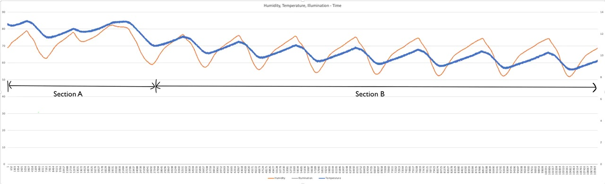

Here the orange plot is humidity, blue is temperature and grey (not visible because it is on top of the X-axis) is the illumination level in the fridge. Section A shows the temperature and humidity settling in a rhythm, and Section B shows the data in a rhythm after they have settled. Let's check another set of data.

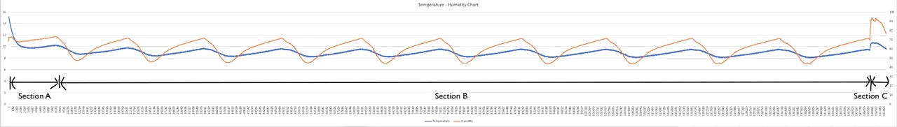

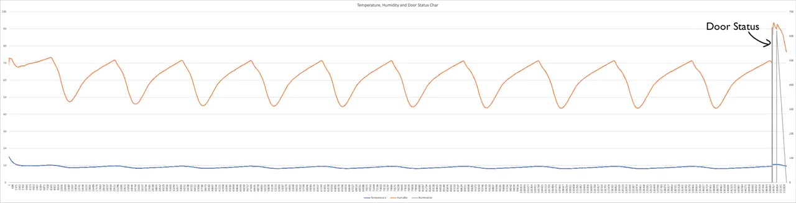

The above graph also shows data collected for 7-8 hours. In the first graph, only temperature (blue) and humidity (orange) levels are shown, whereas, in the second graph, the illumination (grey) is also illustrated. As mentioned before, illumination is recorded to capture the door opening and closing of the refrigerator. Section A is temperature and humidity levels settling, and section B is the normal working of the refrigerator, showing the rhythm of heating and cooling cycles. Section C shows the sudden rise in temperature and humidity levels because I opened the refrigerator door in the morning.

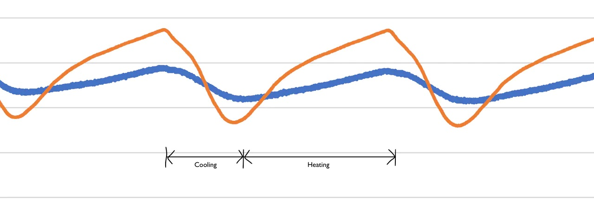

The above image shows a zoomed-in view of the normal operation of a refrigerator. We can clearly see a cooling and heating cycle. Please note that this cooling and heating cycle takes place over a long duration.

So far, we have seen data showing the normal operation; let's check data showing the abnormal operation of a refrigerator.

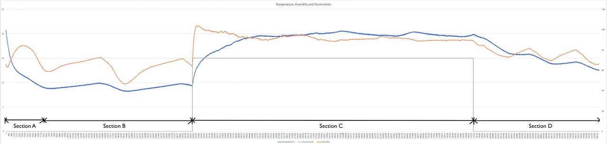

In the above graph, section A is the settling period, and section B is the normal operation period. Section C is the simulated "abnormal operation" period, where the fridge door was kept open for a long duration. Section D shows the data after the fridge door was closed.

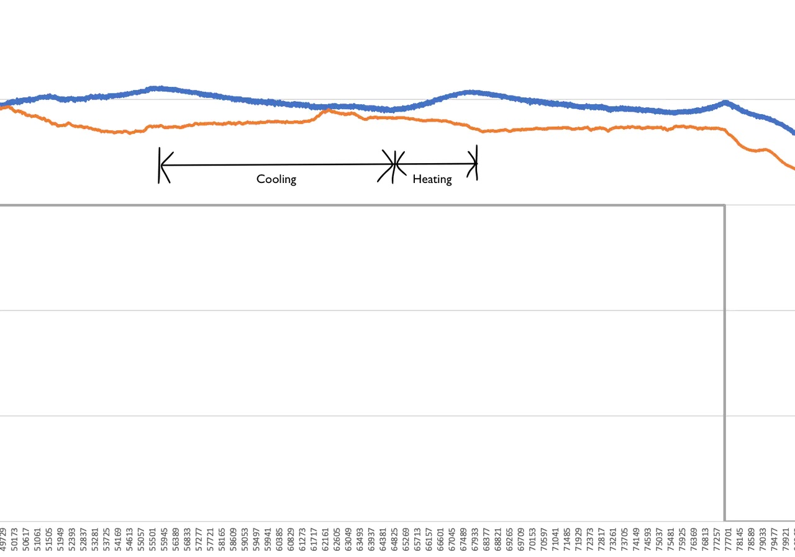

The temperature and humidity levels rose quickly when the fridge door was kept open. We can also see that compressor is trying to bring the temperature down, but it is taking a very long time, and as soon as the compressor stops working, the temperature level rise again quickly. It's almost inverse to the cooling-heating cycle of the normal operation.

`4. Data Classes`

As mentioned previously, due to the unavailability of a faulty refrigerator, I have simulated the abnormal operation using just one technique. That gives me only two classes of data - normal operation and abnormal operation. Let's make most of what I have got.

### Training

For training my ML model, I used [Edge Impulse](https://edgeimpulse.com/). Edge impulse is a fantastic tool for building ML solutions quicker.

Edge Impulse has many excellent features for all stages of building an ML solution. One such cool feature is *[Data Explorer](https://docs.edgeimpulse.com/docs/edge-impulse-studio/data-explorer)*. It makes visualising the data points very easy.

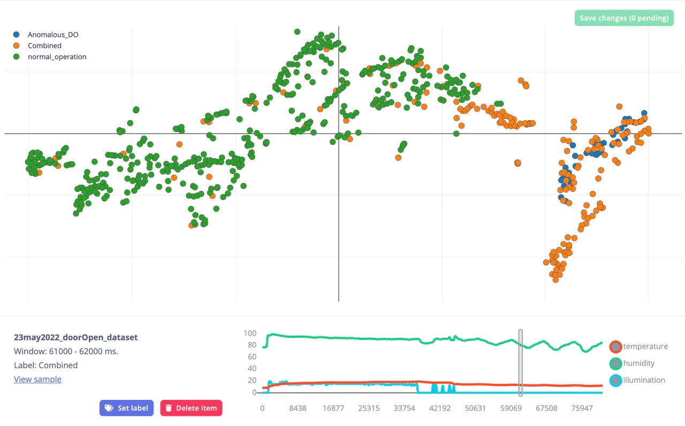

The above image shows the data explorer feature of the Edge Impulse. As you can see, I have three types of data a) normal_operation, which captures only the normal working of the refrigerator. b) Anomalous_DO, which captures only the abnormal operation and c) Combined, which captures normal and abnormal operation.

For the kind of data I have, an anomaly detection model would be perfect for this project. Thankfully, Edge Impulse provides a [K-means anomaly detection](https://docs.edgeimpulse.com/docs/edge-impulse-studio/learning-blocks/anomaly-detection#setting-up-the-anomaly-detection-block) model out of the box, so there is no need to prepare my own.

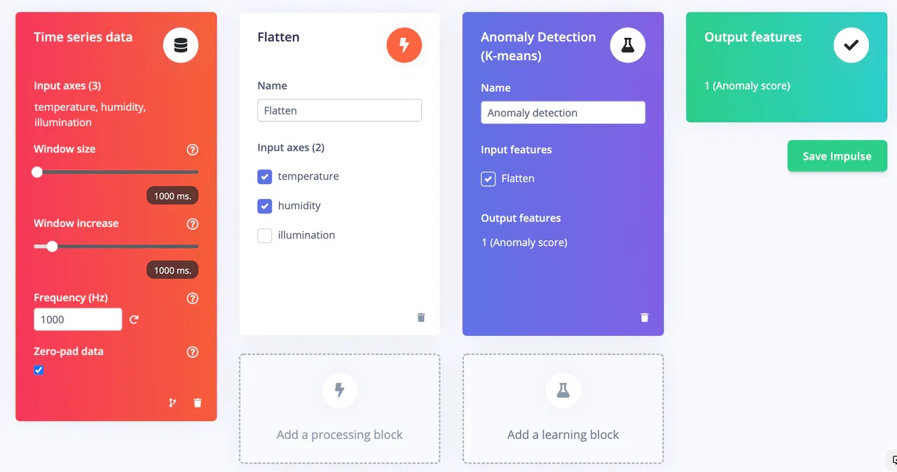

Please follow edge impulse documentation for [Impulse creation](https://docs.edgeimpulse.com/docs/edge-impulse-studio/create-impulse), data [pre-processing](https://docs.edgeimpulse.com/docs/edge-impulse-studio/processing-blocks) and [training](https://docs.edgeimpulse.com/docs/edge-impulse-studio/learning-blocks) an ML model.

### Testing

For testing the ML model, Edge Impulse provides two methods:

a) [Model testing](https://docs.edgeimpulse.com/docs/edge-impulse-studio/model-testing)

b) [Live classification](https://docs.edgeimpulse.com/docs/edge-impulse-studio/live-classification)

In this project, I have primarily used the model testing method because I already had a lot of data captured. In the [data acquisition](https://docs.edgeimpulse.com/docs/edge-impulse-studio/data-acquisition) tab, I assigned some data as test data, which are only used in the model testing.

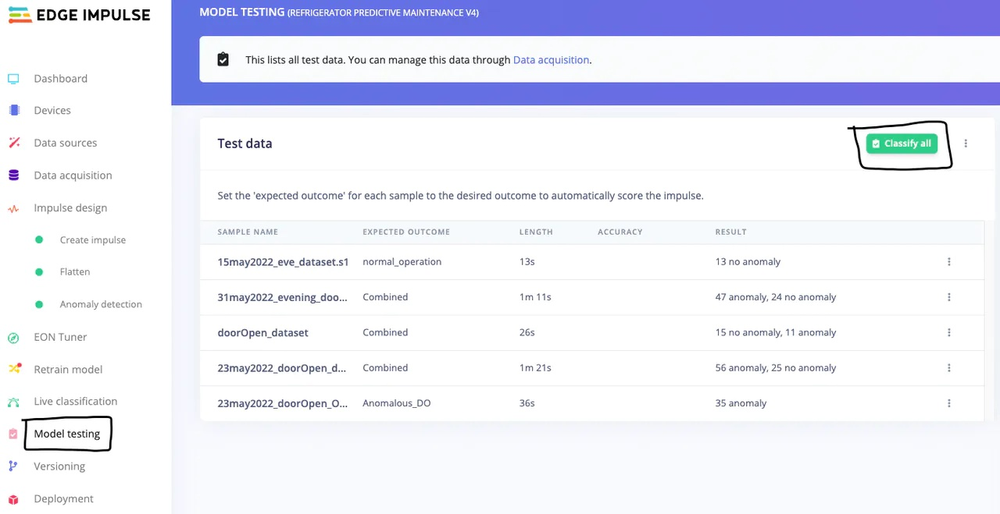

In the model testing tab, click on the *classify all* to test the model. You can also set the [confidence thresholds](https://docs.edgeimpulse.com/docs/edge-impulse-studio/model-testing#setting-confidence-threshold) by clicking on the three dots beside *classify all*.

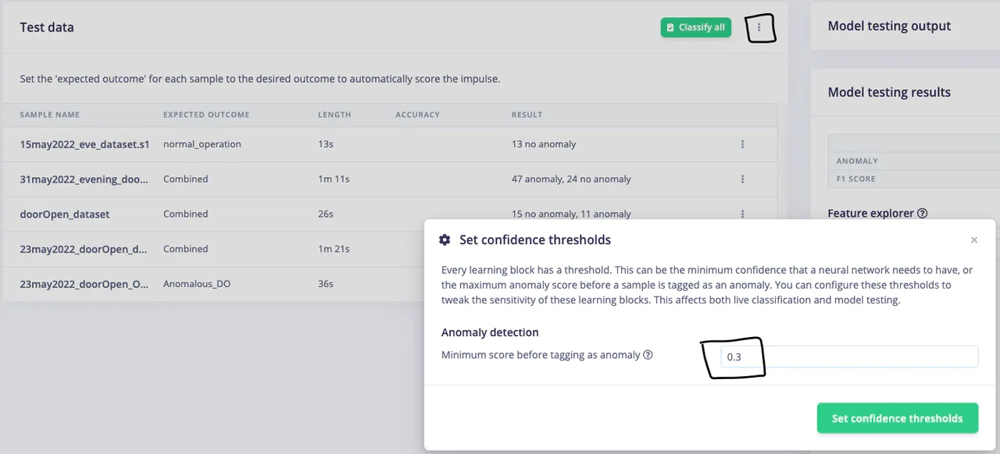

As you can see from the *model testing* image above that the ML model is performing amazingly well. It is properly classifying a *normal_operation* sample as *no anomaly* and *Anomalous_DO* as *all anomaly*. It is also correctly classifying the *combined* samples into some anomaly and some no anomaly data points.

To closely examine a classified sample, click on the three dots on a sample and select *show classification*.


That will open a classification result page where you can scroll through the data points to evaluate individual classification window and their anomaly score. This page also has helpful graphs for visualising raw, pre-processed and classified samples.


As you can see from the above *classification result*, the ML model has absolutely nailed the classification. It is correctly detecting anomalous data from a combined sample.

It is not always this perfect, though. There are some outliers which slip through. For example, in the classification result below, the model has detected some anomalies and inspecting the raw data shows that they should not be an anomaly. However, it gives me great relief that such outliers are very low in number and can easily be removed using better sensors and improving the data quality.

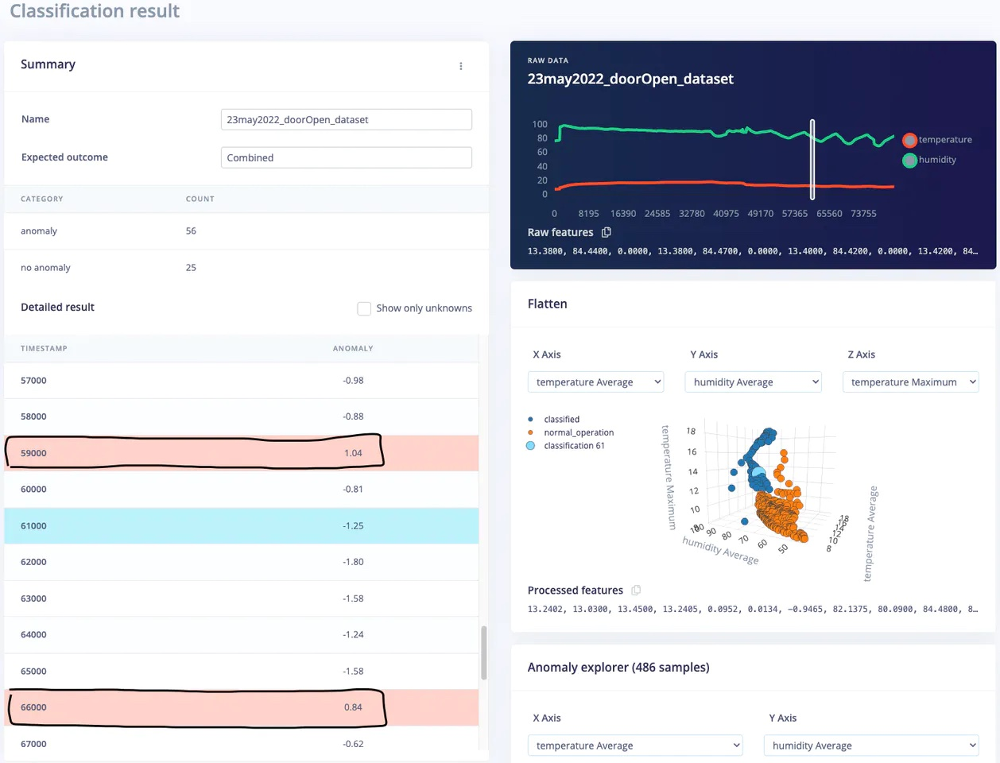

### Deployment

Edge Impulse fully supports the Arduino Nano BLE sense development board, so the best way to [deploy](https://docs.edgeimpulse.com/docs/edge-impulse-studio/deployment) this ML model would be to build firmware.

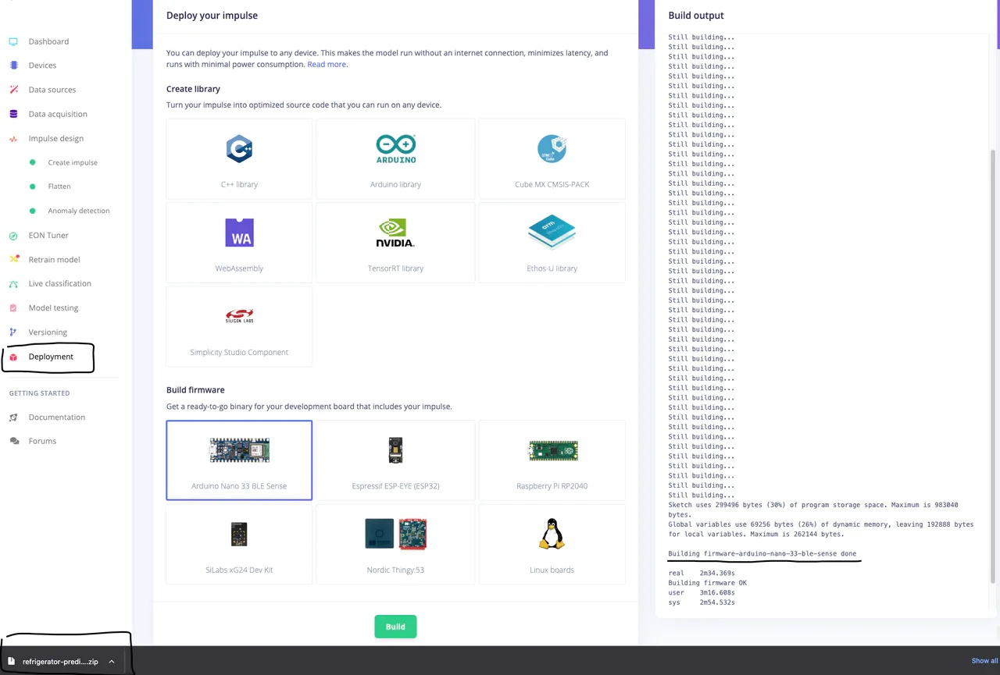

Go to the deployment page -> click on the microcontroller board or environment of choice and click build. After building the firmware, the download should start automatically.

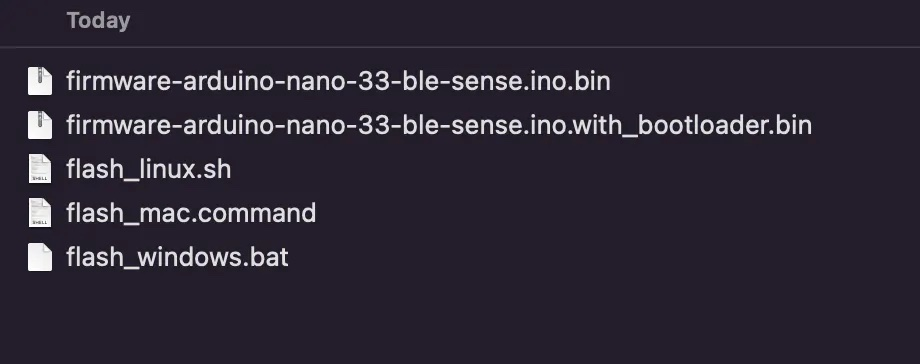

After extracting the zip folder, run the script_<os_name> file corresponding to your computer's operating system to flash the firmware onto the microcontroller board.

