# Retail Image Classification with a Jetson Nano 

Created By:
[Adam Milton-Barker](https://www.adammiltonbarker.com/) 

Public Project Link:
[https://studio.edgeimpulse.com/public/176144/latest](https://studio.edgeimpulse.com/public/176144/latest)


## Introduction

Even with the current limitations of Artificial Intelligence, it is still a very useful tool, and many tasks can be automated with the technology. As more tasks become automated, human resources are freed up, allowing them to spend more time focusng on what really matters to businesses: their customers. 

The retail industry is a prime example of an industry that can be automated through the use of Artificial Intelligence, the Internet of Things, and Robotics.

## Solution

Computer Vision is a very popular field of Artificial Intelligence, with many possible applications. This project is a proof of concept that shows how Computer Vision can be used to create an automated checkout process using the NVIDIA Jetson Nano and the Edge Impulse platform.

## Hardware

- NVIDIA Jetson Nano [Buy](https://developer.nvidia.com/embedded/jetson-nano-developer-kit)

- USB webcam

## Platform

-  Edge Impulse [Visit](https://www.edgeimpulse.com)

## Project Setup

Head over to [Edge Impulse](https://www.edgeimpulse.com) and create your account or login. Once logged in you will be taken to the project selection/creation page.

### Create New Project

Your first step is to create a new project.

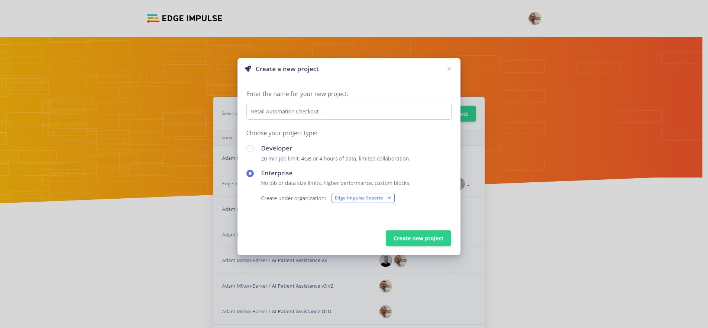

Enter a **project name**, select **Developer** or **Enterprise**, and click **Create new project**.

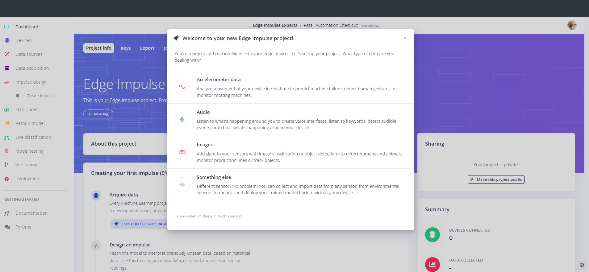

We are going to be creating a computer vision project, so now we need to select **Images** as the project type.

### Connect Your Device

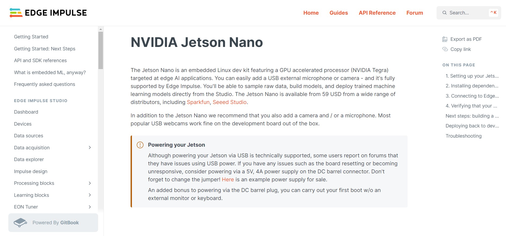

You need to install the required dependencies that will allow you to connect your device to the Edge Impulse platform. This process is documented on the [Edge Impulse Website](https://docs.edgeimpulse.com/docs/development-platforms/officially-supported-cpu-gpu-targets/nvidia-jetson-nano) and includes:

- Running the Edge Impulse NVIDIA Jetson Nano setup script
- Connecting your device to the Edge Impulse platform

Once the firmware has been installed enter the following command:

```
edge-impulse-linux
```

If you are already connected to an Edge Impulse project, use the following command:

```
edge-impulse-linux --clean
```

Follow the instructions to log in to your Edge Impulse account.

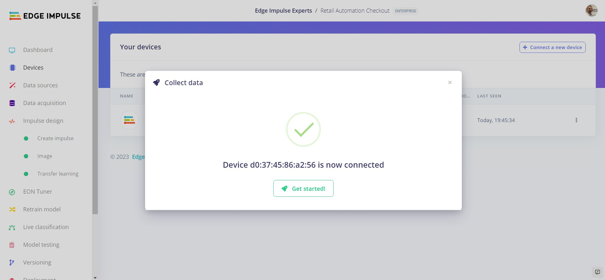

Once complete, head over to the **Devices** tab of your project and you should see the connected device.

## Dataset

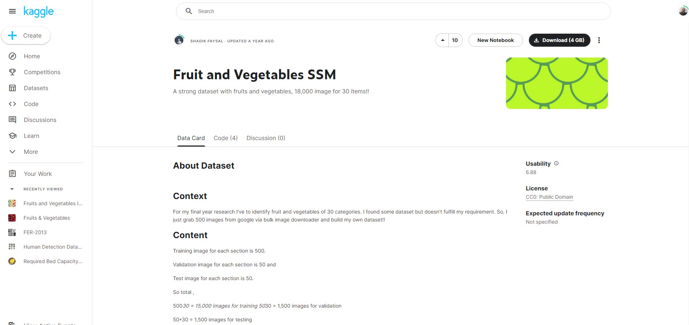

We are going to use the [Fruit and Vegetables SSM](https://www.kaggle.com/datasets/shadikfaysal/fruit-and-vegetables-ssm). This dataset has 18,000 images of various fruits and vegetables.

In this example we will use images from the Apples, Bananas, Chillis and Broccoli classes.

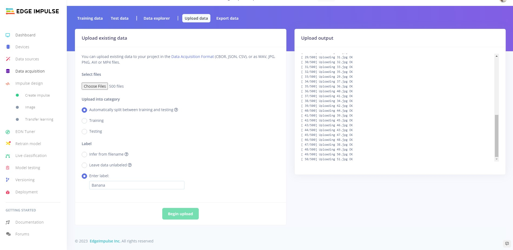

Once downloaded, uzip the data and navigate to the **Train** folder. Then proceed to upload the contents of **Train/Apples**, **Train/Bananas**, **Train/Chillis** and **Train/Brocolli**. Make sure to select **Automatically split between training and testing**, and enter the correct label.

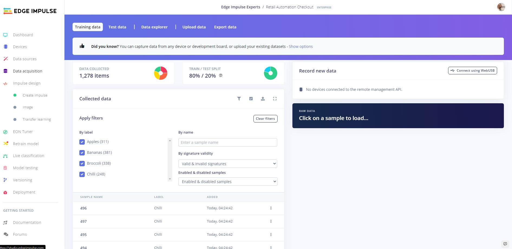

Once you have completed these steps, you should be able to see and filter your uploaded dataset.

## Create Impulse

Now we are going to create our neural network and train our model.

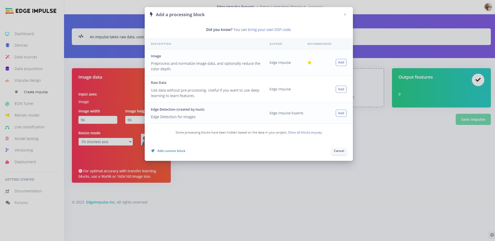

Head to the **Create Impulse** tab. Next click **Add processing block** and select **Image**.

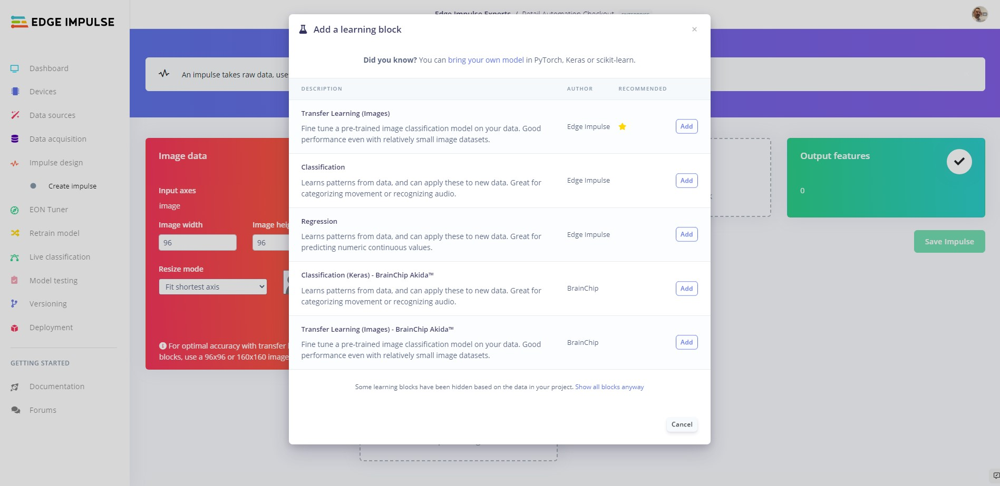 

Now click **Add learning block** and select **Transfer Learning (Images)**.

Now click **Save impulse**.

### Transfer Learning

#### Parameters

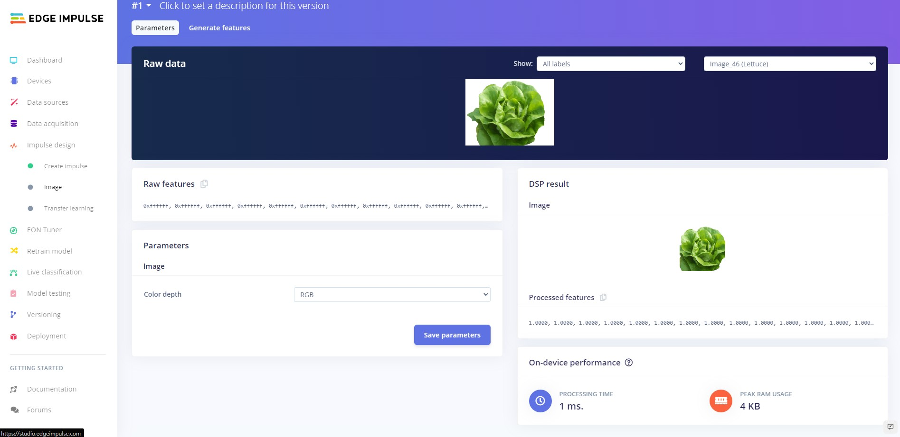

Head over to the **Image** tab and click on the **Save parameters** button to save the parameters.

#### Generate Features

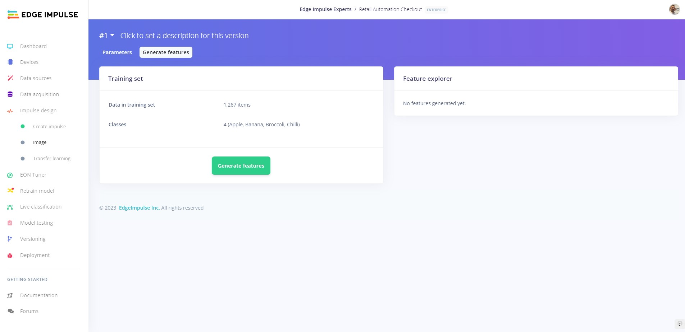

If you are not automatically redirected to the **Generate features** tab, click on the **Image** tab and then click on **Generate features** and finally click on the **Generate features** button.

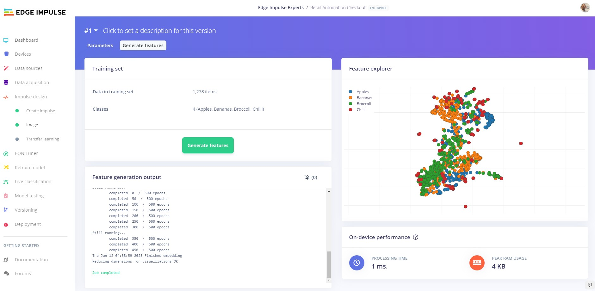

Your data should be nicely clustered and there should be as little mixing of the classes as possible. You should inspect the clusters and look for any data that is clustered incorrectly. If you find any data out of place, you can relabel or remove it. If you make any changes click **Generate features** again.

## Training


Now we are going to train our model. Click on the **Transfer Learning** tab then click **Auto-balance dataset**, **Data augmentation** and then **Start training**.

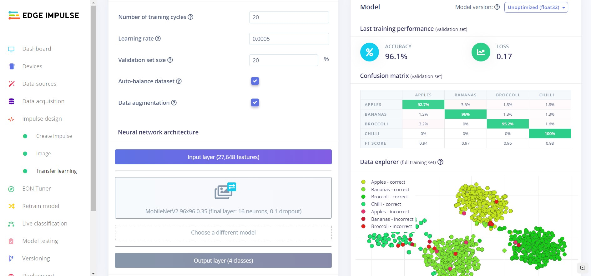

Once training has completed, you will see the results displayed at the bottom of the page. Here we see that we have 96.1% accuracy. Lets test our model and see how it works on our test data.

## Testing

### Platform Testing

Head over to the **Model testing** tab where you will see all of the unseen test data available. Click on the **Classify all** and sit back as we test our model.

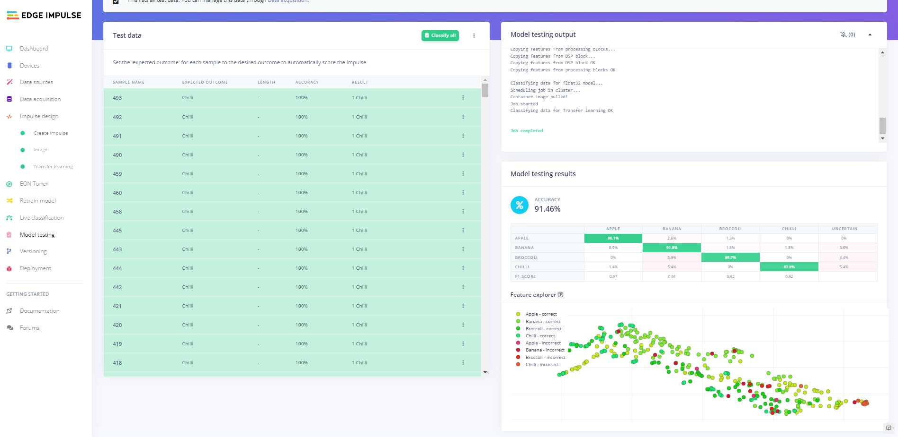

You will see the output of the testing in the output window, and once testing is complete you will see the results. In our case we can see that we have achieved 91.46% accuracy on the unseen data.

### On Device Testing

Before we deploy the software to the NVIDIA Jetson Nano, lets test using the Edge Impulse platform whilst connected to the Jetson Nano. For this to work make sure your device is currently connected and that your webcam is attached.


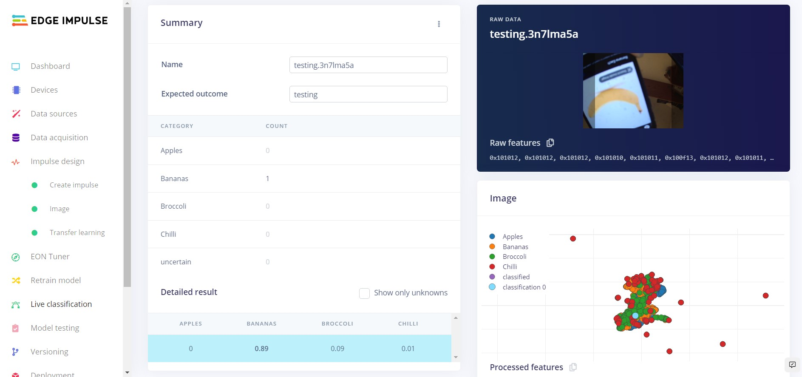

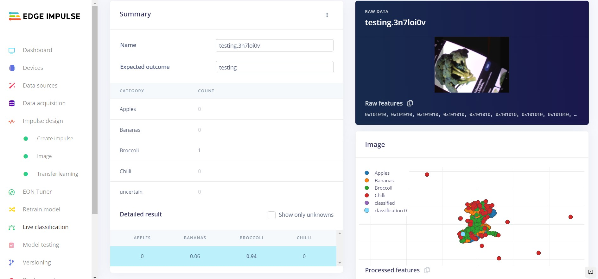

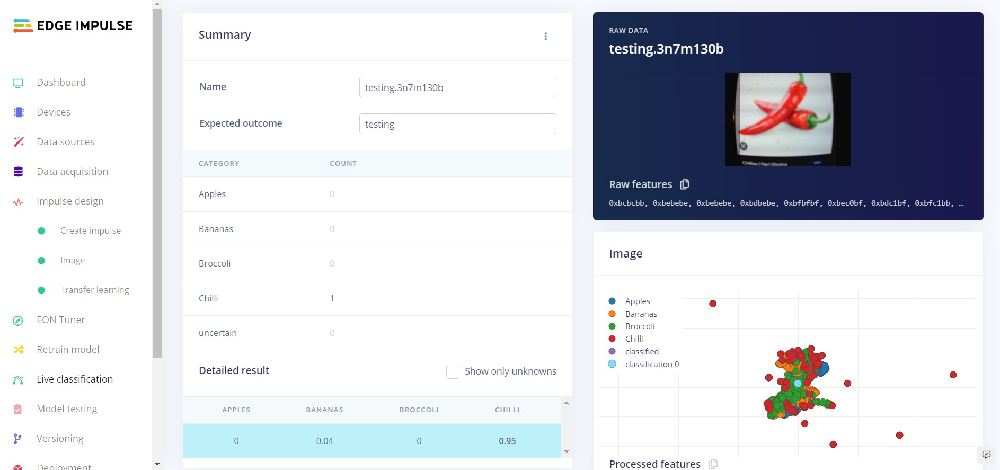

Use the **Live classification** feature to record some samples for clasification from the webcam connected to the Jetson Nano. Your model should be able to correctly identify the class for each sample.  If you are not getting accurate detections, you may need to provide more data samples, or fine tune the training parameters to increase your accuracy.  First, you will want to save a **Version** though.

## Versioning

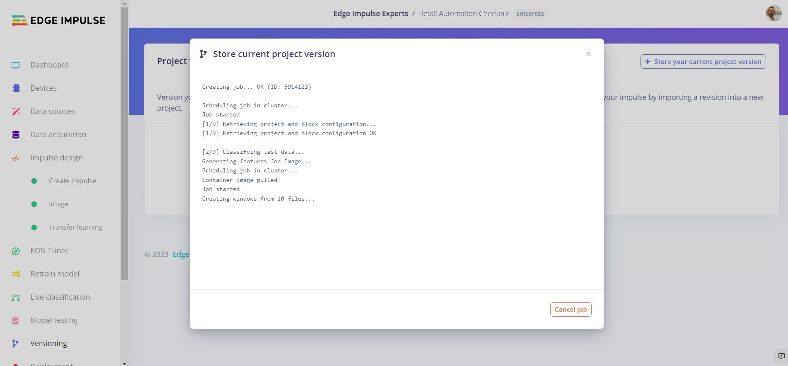

We can use the versioning feature to save a copy of the existing network. To do so head over to the **Versioning** tab and click on the **Create first version** button.

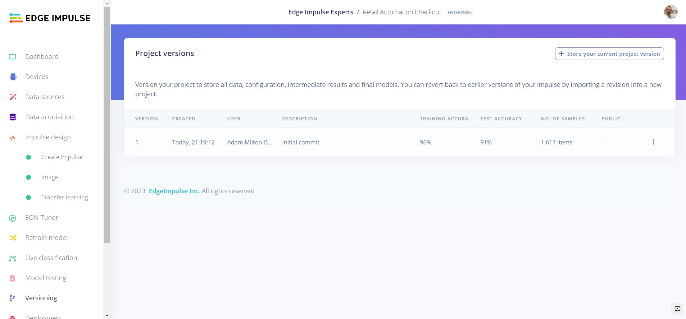

This will create a snapshot of your existing model that we can come back to at any time.

## Deployment

Now we will deploy the software directly to the NVIDIA Jetson Nano. To do this simply head to the terminal on your Jetson Nano, and enter:

```
edge-impulse-linux-runner
```

This will then download the built model from Edge Impulse and start local inferencing on the Nano. Keep an eye out for a message that gives you a URL to view the results in your browser.

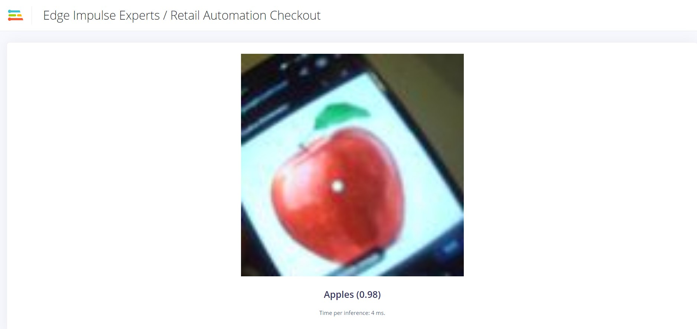

## Conclusion

Here we have created a simple but effective solution for classifiying various fruits and vegetables using computer vision powered on an NVIDIA Jetson Nano, using Edge Impulse. 

You can train a network with your own images, or build off the model and training data provided in this tutorial.
