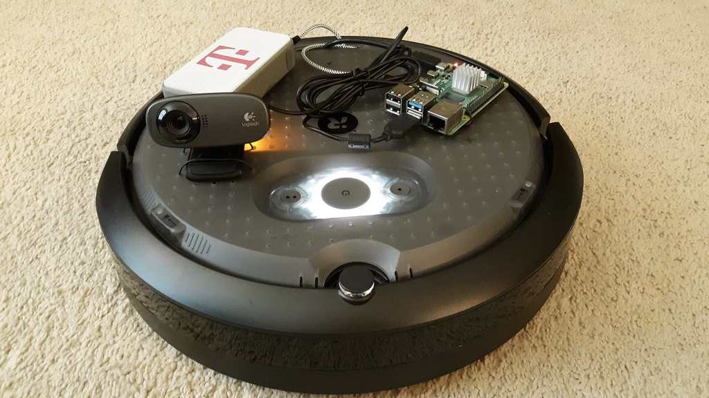
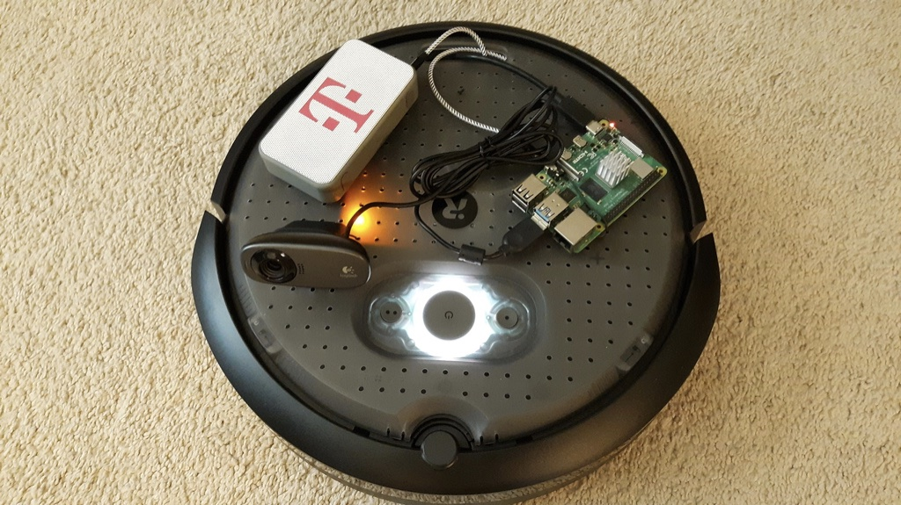
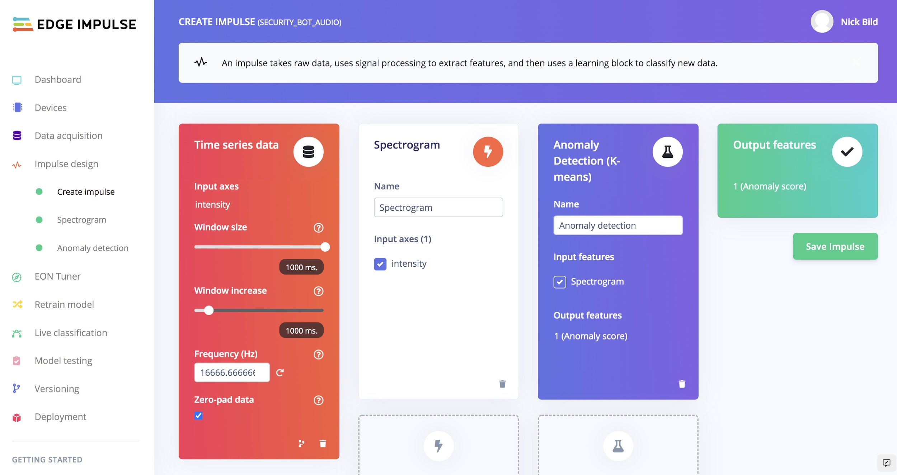
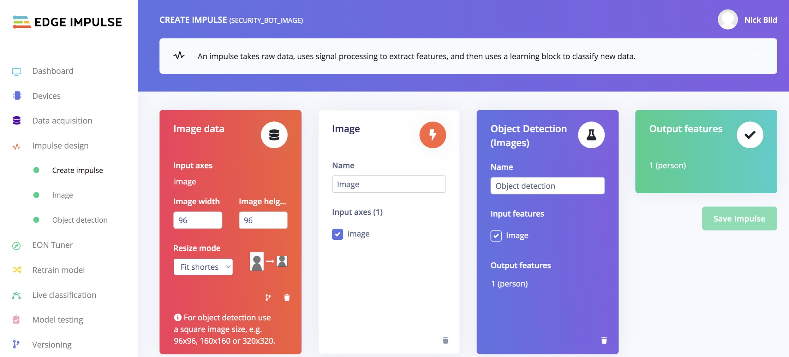

# Shield Bot Autonomous Security Robot

Created By:
Nick Bild 

Public Project Link:
[https://studio.edgeimpulse.com/public/106503/latest](https://studio.edgeimpulse.com/public/106503/latest)

Shield Bot is an autonomous security robot that listens for suspicious sounds, then goes on patrol to look for intruders. To conserve energy for when it is needed, the robot sits on its charging dock while it continually samples audio clips with its microphone. These audio clips are fed into a K-means clustering algorithm that has been trained to recognize normal sounds in its environment (e.g.: A/C turning on and off, ice maker, etc.). When an anomalous sound is detected, Shield Bot backs away from the charging dock, then goes on patrol by roaming about and periodically doing a 360 degree turn, capturing images at 90 degree increments.

Images are processed by a [FOMO object detection model](https://www.edgeimpulse.com/blog/announcing-fomo-faster-objects-more-objects) that has been trained to recognize people. If a person is detected, the robot plays a loud police siren sound and flashes a red and blue light to scare the intruder away. A notification about the incident is also sent to the robot's owner.

## Hardware

The base of the robot is an iRobot Create 3, which is basically a Roomba robot vacuum without the cleaning components. It provides a pair of motorized wheels with encoders, several infrared and bump sensors, an accelerometer, a gyroscope, and more to act as the base for any number of robotics projects. These sensors and actuators are accessible via Robot Operating System 2.

Raspberry Pi 4s and NVIDIA Jetsons are officially supported platforms to control the iRobot, and Shield Bot is controlled with a Raspberry Pi 4. This computer provides the processing power to run the machine learning algorithms, run the application logic, and handle interactions with the iRobot.

A USB webcam was chosen for capturing images, and it also contains a microphone to sample environmental sounds. A speaker was connected to the Raspberry Pi to play the alarm sound. The LED ring built into the iRobot was used for the flashing lights of the alarm.

## Data Collection

The base of the robot is an iRobot Create 3, which is basically a Roomba robot vacuum without the cleaning components. It provides a pair of motorized wheels with encoders, several infrared and bump sensors, an accelerometer, a gyroscope, and more to act as the base for any number of robotics projects. These sensors and actuators are accessible via Robot Operating System 2.

Raspberry Pi 4s and NVIDIA Jetsons are officially supported platforms to control the iRobot, and Shield Bot is controlled with a Raspberry Pi 4. This computer provides the processing power to run the machine learning algorithms, run the application logic, and handle interactions with the iRobot.
A USB webcam was chosen for capturing images, and it also contains a microphone to sample environmental sounds. A speaker was connected to the Raspberry Pi to play the alarm sound. The LED ring built into the iRobot was used for the flashing lights of the alarm.

## Audio Anomaly Detection

I built an impulse that consumes the CSVs of audio data that I previously created and feeds them into a K-means clustering algorithm. After training this model to recognize normal sounds around my house, it was then capable of detecting anything that is out of the ordinary. There was no need to give it examples of abnormal sounds, or to be restricted in the types of anomalous sounds it can detect. It will recognize anything unusual.

I have made this Edge Impulse project public, and it is [available here](https://studio.edgeimpulse.com/public/106503/latest).

## Object Detection

I created a second impulse to analyze the images captured by the webcam and determine if a person is present in each image. This pipeline preprocesses the images and extracts the most important features before feeding them into a FOMO object detection model. FOMO is optimized for great performance on resource-constrained platforms, so it performs exceptionally well on a Raspberry Pi 4.

This data analysis pipeline is also [publicly available](https://studio.edgeimpulse.com/public/106892/latest).

## Deploying the Models

I deployed both of the models as self-contained C++ libraries using Edge Impulse's deployment tool. With no external dependencies, these are super easy to deploy on any Linux-based platform, such as the Raspberry Pi. This allowed me to call both machine learning pipelines from the script containing the robot's operating logic without the need for Internet connectivity, and without the privacy concerns that would come with sending audio and video from inside my home to the cloud.

## Conclusion

By building a security camera on top of a robot, a single camera can cover a large area that would typically require many cameras for coverage. It can also roam around and cover areas that would be blind spots for fixed-position cameras.

The machine learning models were very simple to build and train using Edge Impulse's slick interface. They performed very well in my tests, consistently detecting audio anomalies and people. In the future, I would like to enhance Shield Bot's navigation abilities. While on patrol, the robot drives until it encounters an object, then turns in a different direction and continues on. I would like to involve computer vision in this process so that the robot can intelligently cover a space in the most efficient manner.

Link to video:  [https://www.youtube.com/watch?v=aZt6PIywaTQ](https://www.youtube.com/watch?v=aZt6PIywaTQ)
