# The SiLabs xG24 and Arducam - Sorting Objects with Computer Vision and Robotics - Part 2

Created By:
Thomas Vikstrom 

Public Project Link:
[https://studio.edgeimpulse.com/public/193509/latest](https://studio.edgeimpulse.com/public/193509/latest)

## Introduction - Playing Poker at the Edge, Part 2 of 2

In this tutorial you will learn how you can sort both poker cards and solid waste using a *real* robot arm and TinyML (Tiny Machine Learning) running on a development board officially supported by Edge Impulse, namely the  SiLabs xG24 Development Kit and Arducam. 

In [Part 1](https://docs.edgeimpulse.com/experts/prototype-and-concept-projects/silabs-xg24-card-sorting-and-robotics-1) you learned how to classify the playing cards themselves according to their colour, and so this tutorial will focus more on interpreting and utilising the signals provided by the xG24 board to control the robot. It is thus recommended to at least browse through Part 1 before reading Part 2.

Hardware used in this tutorial is the aforementioned [SiLabs xG24 Dev board](https://www.silabs.com/development-tools/wireless/efr32xg24-dev-kit?tab=overview) as well as the [Dobot Magician](https://www.dobot-robots.com/products/education/magician.html) robot arm. However, any other Python-programmable robot arm can most probably be adapted to work according to the steps in this tutorial. 

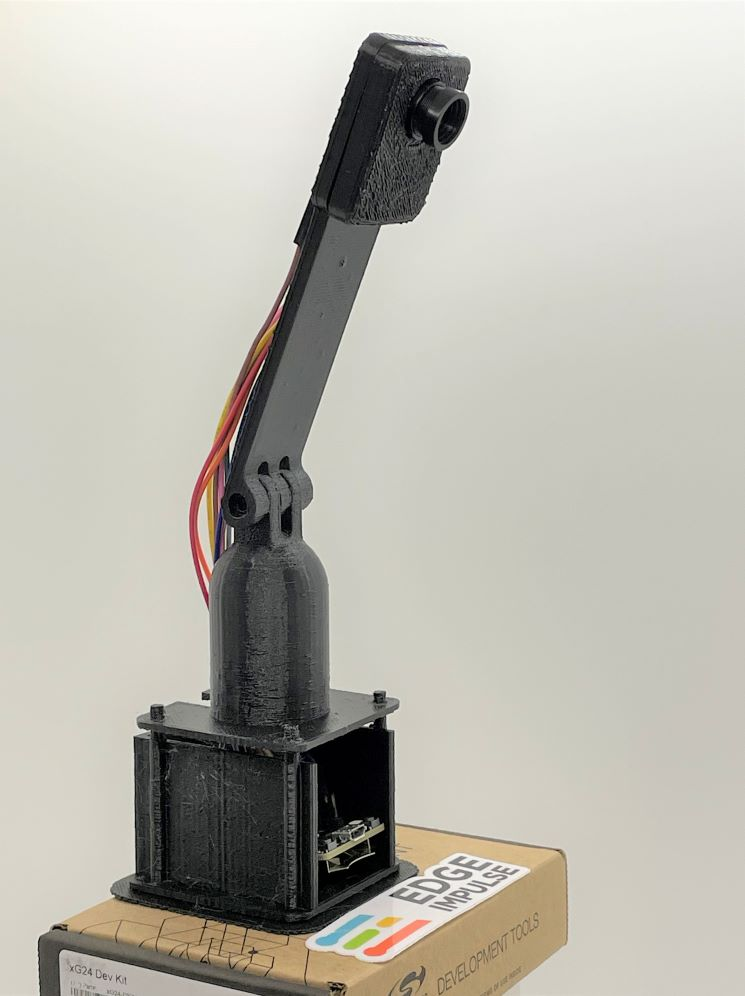


# Use-case Explanation

Sorting cards with a robot arm - in this case somewhat slowly - might not be that useful in practice. Nevertheless, it serves as a starting point into TinyML and robotics, and binds them together with quite straightforward Python programming. Poker playing cards were chosen as they are lightweight and uniform in size, making them optimal to start with. 

In the second part of this tutorial you will learn how to adapt the card sorting solution to sorting waste into different piles. This is not a new idea, Google recently announced having performed a [large scale waste sorting experiment](https://ai.googleblog.com/2023/04/robotic-deep-rl-at-scale-sorting-waste.html) with a fleet of 23 robots using reinforcement learning. Another quite similar approach as used in this tutorial was made by [Peter Ma in 2018](https://www.hackster.io/Nyceane/trash-and-recyclable-sorting-robot-arm-975282). He also used the Dobot Magician robot arm, but with a Raspberry Pi 3 and an Intel Movidius Neural Compute Stick.

Due to the serious issues climate change is causing our planet, we need to take actions to mitigate or at least reduce the effects from our overconsumption of resources. One of these actions is to sort and recycle as much as possible at the source, but also sort the inevitable remaining waste into metals, plastics, bio-waste, etc. for proper recycling or transformation into energy. 

Obviously a robot arm for educational use cannot be used for industrial purposes, but the general ideas learned through these two tutorials can be applied for up-scaling of sorting (e.g. non-defective and defective products on a conveyor belt, unripe and ripe fruits, waste, etc.).


## Components and Hardware Configuration

### Software Used

* Edge Impulse
* Python, any recent 3.x version should be ok
    * pydobot library, install with `pip install pydobot`
    * pyserial library, install with `pip install pyserial`
* Python programs that I wrote to sort cards and waste with, using the Dobot robot arm:
    * [PyDobot_sorting_cards.py](https://github.com/baljo/Playing-poker-at-the-Edge-2/blob/main/PyDobot_sorting_cards.py)
    * [PyDobot_sorting_waste.py](https://github.com/baljo/Playing-poker-at-the-Edge-2/blob/main/PyDobot_sorting_waste.py)

### Hardware Used:

* [SiLabs xG24-DK2601B EFR32xG24 Dev Kit](https://www.silabs.com/development-tools/wireless/efr32xg24-dev-kit?tab=overview)
* [Arducam B0067 2MP OV2640 SPI Camera for Arduino](https://www.welectron.com/Arducam-B0067-2MP-OV2640-SPI-Camera-for-Arduino_1)
* [Pin Header 2.54mm 1x20 Pin](https://www.welectron.com/Pin-Header-254mm-1x20-Pin) for soldering to the SiLabs board
* [Dobot Magician](https://www.dobot-robots.com/products/education/magician.html) robot arm
* 3D-printer to print protective case and stand (Optional)
* Playing cards, poker, UNO, etc.
* Household solid waste of metal, plastic, paper, cardboard, etc.

## Configure the Hardware

* For details about configuring SiLabs and Arducam, check [Tutorial 1](https://docs.edgeimpulse.com/experts/prototype-and-concept-projects/silabs-xg24-card-sorting-and-robotics-1#configure-the-hardware) 
* No special configuration is needed for the robot arm, just ensure it is calibrated. This tutorial is based on the suction cup being installed. 
* The devices are connected through USB-cables, and using serial communication: `Robot arm  <==>  Computer  <==>  SiLabs & Arducam`

## 3D-printing the Stand and the Case

* STL-files are found in the [GitHub repo](https://github.com/baljo/Playing-poker-at-the-Edge-2)
* Print with high quality, I printed with 0.15 mm accuracy, the three larger parts took over two hours each to print with my budget friendly, but slow printer. 
* No support is needed when rotating the parts properly in the slicing software. As I don't have a heated bed, I printed with a raft.
* I used only 10 % in-fill as the equipment is very lightweight
* There are holes for screws, but apart from firmly attaching the camera front to the back, screws are strictly not needed. In the photo below I have not used screws, hence the skewness.

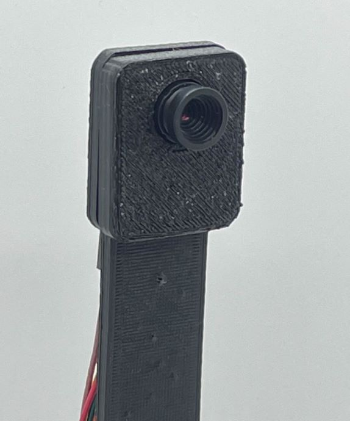

# Data Collection Process

As this project is partly a continuation of part one, please see the [Data Collection Process](https://docs.edgeimpulse.com/experts/prototype-and-concept-projects/silabs-xg24-card-sorting-and-robotics-1#data-collection-process) for how *poker card data* was collected.

For *waste data* the same principles were used, where I used a mobile phone camera for most of the images taken, and the device itself (xG24 + Arducam) for some additional images.

## Software and Hardware Used to Capture Data:

* [Edge Impulse Studio & CLI (Command-Line Interface)](https://www.edgeimpulse.com/)
* SiLabs xG24 was used for ~10 % of the data
    * to use this with Edge Impulse, you first need to flash the Edge Impulse firmware, detailed steps are found in the [documentation](https://docs.edgeimpulse.com/docs/development-platforms/officially-supported-mcu-targets/silabs-xg24-devkit)
* Mobile phone camera (iPhone 12) was used for ~90 % of the data

## Steps to Reproduce

* Please see [Part one](https://docs.edgeimpulse.com/experts/prototype-and-concept-projects/silabs-xg24-card-sorting-and-robotics-1#steps-to-reproduce) for detailed steps how to collect images when using a mobile phone and when using the xG24 and Arducam.
* Also here I noticed that the initial model performance in real situations, and when using the xG24 device was far from perfect

## Collecting Images of Nonuniform Waste Material

It is relatively easy to develop a very robust ML-model when using poker playing cards as they are uniform in size and have very good contrast. The same does however not apply when it comes to waste, as waste comes in many different forms, colours, and sizes. For example, metal can be shining and reflective, but when painted might look very similar to plastic. When looking at these pictures, perhaps you can guess which lids are made of metal, and which of plastic? 

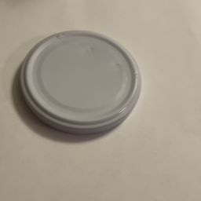

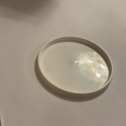

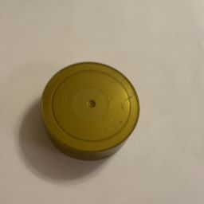

*Answer: The first one is made of metal, the others of plastic.*

Also, poker cards barely cause any shadows at all, but most waste material produce - depending on the light conditions - shadows, which can confuse an ML model. For example, how can you know if the ML model really is "seeing" the object itself, or only focusing on the shadows it's causing? For this reason, I tried to vary the light conditions when collecting images by using different artifical light sources. In addition, I also collected some images using daylight (not easy in Finland in February with very short days...).

The objects used in this project were chosen so that they could be lifted with the robot's suction cup, thus they could not be of any size, form, or weight. I decided to collect images of four types of objects: paper, cardboard, metal, and plastic. In addition, I also collected images where none of the objects where present, in practice mainly of the table I'd put the objects on. For sure, sorting solid waste into only four classes might not be enough in a real scenario, obviously this is dependant on the country and city where you live. At my workplace e.g., we sort using six bins: plastic, glass, metal, paper, cardboard, and biowaste. 

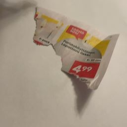

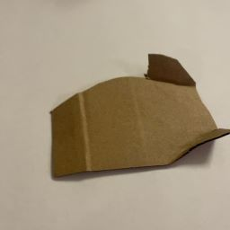

I ended up with a total of 1353 images, very evenly divided into the five classes. Out of these images, I used the xG24 device and Arducam only for a few tens, as it takes so much more time to collect images compared to using a mobile phone camera. But even these few images made a difference, making the final model perform better!


## Building, Training, and Testing the Model

After you've collected some data, you need to build and train the model. The main steps in this process are to create an Impulse, extract features, and finally train the model. Again, with image classification and when using Edge Impulse, this is often pretty straightforward.

### Steps to Reproduce

The steps to build, train, and test the waste classification model are close to identical as [the ones in Part 1](https://docs.edgeimpulse.com/experts/prototype-and-concept-projects/silabs-xg24-card-sorting-and-robotics-1#steps-to-reproduce-1), with the following comments:

* Also here, I knew beforehand that the 256 kB RAM memory would put some constraints on what model configuration to use. Following that, I chose to use an image size of 96x96 pixels when creating the impulse, and MobileNetV1 when later training the model.
* Instead of using `Resize mode:` `Squash` as with the poker cards, I used the default `Fit shortest axis`, although I doubt it matters much in this type of project.
* After having trained with a few different configurations, I found that `MobileNetV1 96x96 0.25 (final layer: 64 neurons, 0.1 dropout)` gave the most bang for the buck.

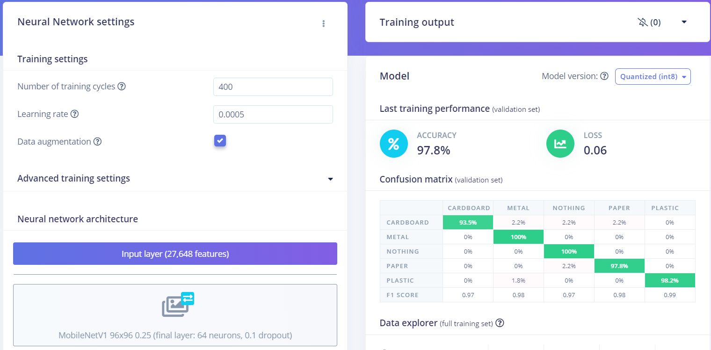

* The trained model has an accuracy of 97.8% which is actually quite good with this relatively sparse data. When looking at the few images it classified incorrectly, one can also understand why some of them can be challenging to predict.
* It might be a coincidence, but all mispredicted images were taken using the Arducam. It has lower image quality than a modern mobile phone camera, and also needs more light to produce decent image quality, so this is something to consider when using Arducam.

| Image                     | Label       | Predicted              |
| -----------               | ----------- | -----------            |
|    | paper       | nothing (= table)      |
|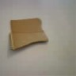| cardboard   | paper                  |
|  | plastic     | metal                  |
|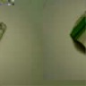| cardboard   | metal                  |

* In this project I later used the [EON Tuner](https://docs.edgeimpulse.com/docs/edge-impulse-studio/eon-tuner) to search for a more optimal model, but as RAM memory is the main constraint when running ML on the xG24, I could not use any of the suggested MobileNetV2 models. 
* The estimated inference time on the xG24 device is quite similar as in Part one

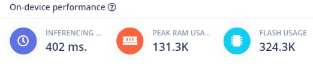

## Testing the Model

Before deploying the model to the device itself, you should check how well it works on data it has not seen before. This is where the 15% Test data that was put aside comes into play. If the model performs poorly on test data, you can expect real performance to be even worse. But even a 100% accuracy on Test data does not guarantee success in real life.

If the training performance is very good, but the test performance is poor, the reason might be that your model is overfitting on the training data. In that case you might need to collect more data, change the model or reduce its complexity. Now would be a good time to try the EON Tuner mentioned earlier.

* To test the model from within Edge Impulse, just click on `Model testing` and then `Classify all`
* In my case, the testing resulted in 100% accuracy, thus even better than the training performance. However, as only a very few of the images taken with Arducam might have ended up in the test category, and those images might be more challenging to predict, I wanted to confirm the model performance in real situations before taking the 100% for granted!

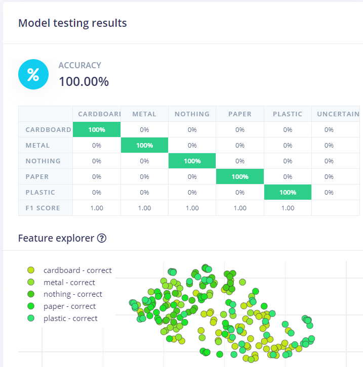

# Model Deployment

Regardless of if you are using the robot to sort cards or solid waste, the deployment steps are identical. For deploying the ML model to the xG24 kit, please use same steps as in [Part 1](https://docs.edgeimpulse.com/experts/prototype-and-concept-projects/silabs-xg24-card-sorting-and-robotics-1#model-deployment) to flash the firmware. 

## Go-live and Results

### Preparations

* If sorting cards, use same or similar cards as when collecting images
* If sorting waste, use the same objects as when collecting images, but try to also find similar, but not identical waste for later testing.
* Connect your computer to Dobot and to the xG24 + Arducam
* Place the Arducam so it points to the place where the robot will pick up objects

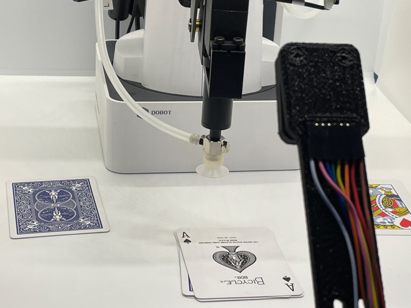

### Dry Run

* Reset or reconnect the xG24 device
* Open a command prompt and run `edge-impulse-run-impulse --debug`, this will show inference results as a running log, but you can also see a live camera output in a browser window.
    * Once you are satisfied with the performance, abort the operation by `Ctrl-c` or by closing the command prompt. If you forget this, the serial port is busy and can't be used by the Python program in next the step.
    * If you already now notice that the model is not performing as expected, go back and collect more images or tune the model.

### Live Run

* Connect the Dobot arm and power it on
* Put the first object where it should be for picking it up with the suction cup
* Open the Python program `PyDobot_sorting_cards.py` or `PyDobot_sorting_waste.py` with an IDE or text editor
    * If you want to do a dry run using this program instead of the command prompt, please change from `only_inference = False` to `only_inference = True` in the `main` function:
    
```
        def main():
            global x,y,z,r,j1,j2,j3,j4
            
            only_inference = True
            while only_inference == True:
                label = inference()
```

    * If you have used different labels than in these tutorials, please adjust the labels in the program `labels = ["back:", "black:", "no_card:", "red:"]`. Remember they have to be in alphabetical order, also remember to put the colon symbol `(:)` at the end of each label!
    * Both programs are parsing the serial stream coming from the xG24 device and stripping away everything apart from the prediction and probability. This part was more challenging to program than I'd thought, partly as the program can start "midstream", partly due to the speed of the serial transmission. Here's how the serial stream might look like, i.e. same as when running `edge-impulse-run-impulse` from a command prompt:
    
```
        Predictions (DSP: 11 ms., Classification: 216 ms., Anomaly: 0 ms.):
        back: 0.00000
        black: 0.00000
        no_card: 0.00391
        red: 0.99609
```

* Run the program, either from within an IDE or from a command prompt
    * The external Pydobot library I'm using has sometimes a challenge connecting to the robot, so you might need to press the **robot's** `Reset` button once or twice to get a connection from Python. The error messages in these cases are typically either `IndexError: index out of range` or `AttributeError: 'NoneType' object has no attribute 'params'`
    * The program shows the inferencing results in the terminal/output window and how many items it has sorted.
    * Watch and be amazed when the robot (hopefully) sorts your waste into four different piles!
    * "Feed" the waste eating robot with more waste!


## Results

Both the card sorting and waste sorting models work quite well in practice, only a few times have objects been misclassified. Main challenges have been with the lighting conditions, as the Arducam seems to need much more light than a mobile phone camera. Other challenges have been more physical in that the robot's suction cup can't lift porous materials, and while it's a versatile robot, it has a limited range of movement.

Especially the waste sorting model can be further up-scaled to really make an impact. To do this wisely one should try to use existing waste data images instead of tediously collecting own images. I actually looked into this and found a few free databases online, one of them at [Kaggle](https://www.kaggle.com/datasets/mostafaabla/garbage-classification). I actually uploaded these >15000 images to Edge Impulse and have tried a few ML models - as well as EON-tuner - to find an optimal one. This dataset consists of 12 classes, including bio-waste, clothes, shoes, three types of glass, etc.

## Conclusion

This was a series of two tutorials, Part one getting up and running with xG24 Dev Kit and Arducam together with Edge Impulse, and Part two introducing how to sort cards or solid waste with a robot arm. I encourage you to replicate one or both of the projects, feel free to clone my Edge Impulse public projects. Why not try developing an ML model that can classify cards into suits, and not only colours! Or, develop an ML model classifying household waste typical for your place of living. While it is more tangible and often also fun using a physical robot arm or similar device to sort objects, I recommend you start with smaller steps, e.g. by connecting the edge device to a display, and showing the inferencing results there.

