# Smart Appliance Control Using Voice Commands - Nordic Thingy:53

Created By:
[Zalmotek](https://zalmotek.com) 

Public Project Link:

[https://studio.edgeimpulse.com/studio/145818](https://studio.edgeimpulse.com/studio/145818)

GitHub Repository:

[https://github.com/Zalmotek/edge-impulse-appliance-control-voice-nordic-thingy53](https://github.com/Zalmotek/edge-impulse-appliance-control-voice-nordic-thingy53)

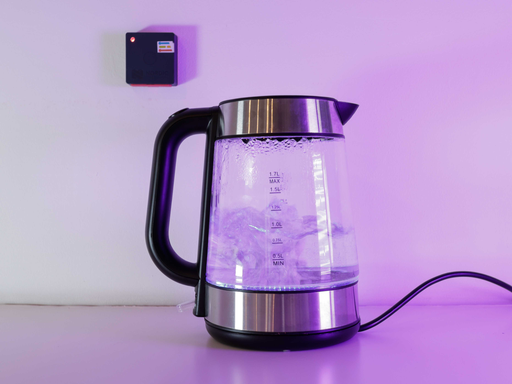

## Introduction

In today's world, voice commands are becoming a popular user input method for various devices, including smart home appliances. While classical UI methods like physical buttons or a remote control will not be soon displaced, the convenience of using voice commands to control an appliance when multitasking or when having your hands busy with something else, like cooking, cannot be denied.

### The Challenge

While very convenient in day to day use, using human speech as user input comes with a number of challenges that must be addressed.

First and foremost, using human speech as user input for smart appliances requires the recognition and understanding of natural language. This means that there must be some sort of keyword detection or voice recognition technology involved. As each user may have their own unique way of phrasing a request, like “ turn on the fan” or “start a 5 minute timer”, the voice recognition algorithms must be fine tuned to obtain the best accuracy.

Another big challenge when implementing such technologies is the security of the gathered data. Privacy concerns regarding speech recognition require cutting-edge encryption techniques to protect voice data and ensure the privacy of any sensitive personal or corporate information transmitted. An easy way to circumvent this is by employing IoT devices that run a machine learning algorithm on the edge and which do not store any data while running the detection algorithm.

### Our Solution

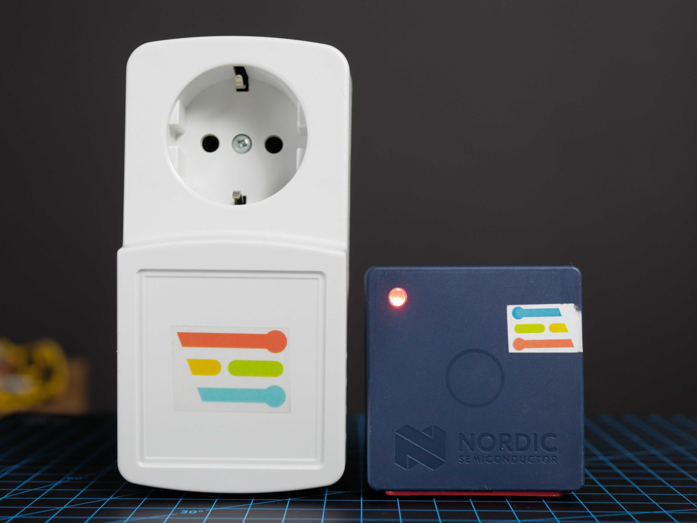

We will be demonstrating the design and build process of a system dedicated to integrating basic voice control functionality in any device by using Nordic Thingy:53 dedicated hardware and an audio categorization model developed and optimized using the Edge Impulse platform.

The Nordic Thingy:53™ is an IoT prototyping platform that enables users to create prototypes and proofs of concept without the need for custom hardware. The Thingy:53 is built around the nRF5340 SoC, Nordic Semiconductor’s flagship dual-core wireless SoC. Its dual Arm Cortex-M33 processors provide ample processing power and memory size to run embedded machine learning (ML) models directly on the device with no constraints.

To build the machine learning model responsible for speech recognition we will be using the Edge Impulse platform. Between the plethora of advantages of using this platform, it’s worth mentioning that it does not require a lot of data to train a performant AI model and that it provides a great number of processing power and energy consumption optimization tools, allowing users to build models that can run even on resource restricted devices.

For this use case, we will be using the Nordic Thingy:53 as an advertising peripheral Bluetooth device that listens for the user input and then sends a message via BLE to the ESP32 connected to a relay that can switch on or off an appliance. This system architecture enables users to control multiple appliances distributed around the house, and only one “gateway” that runs the machine learning model on the edge.

### Hardware requirements

* [Nordic Thingy:53](https://www.nordicsemi.com/Products/Development-hardware/Nordic-Thingy-53)
* Esp32 DevKit
* [Relay](https://www.adafruit.com/product/2895)
* Android/iOS device
* [J-link mini Edu](https://www.segger.com/products/debug-probes/j-link/models/j-link-edu-mini/)
* 220V to 5V power regulator
* Plug-in plastic enclosure

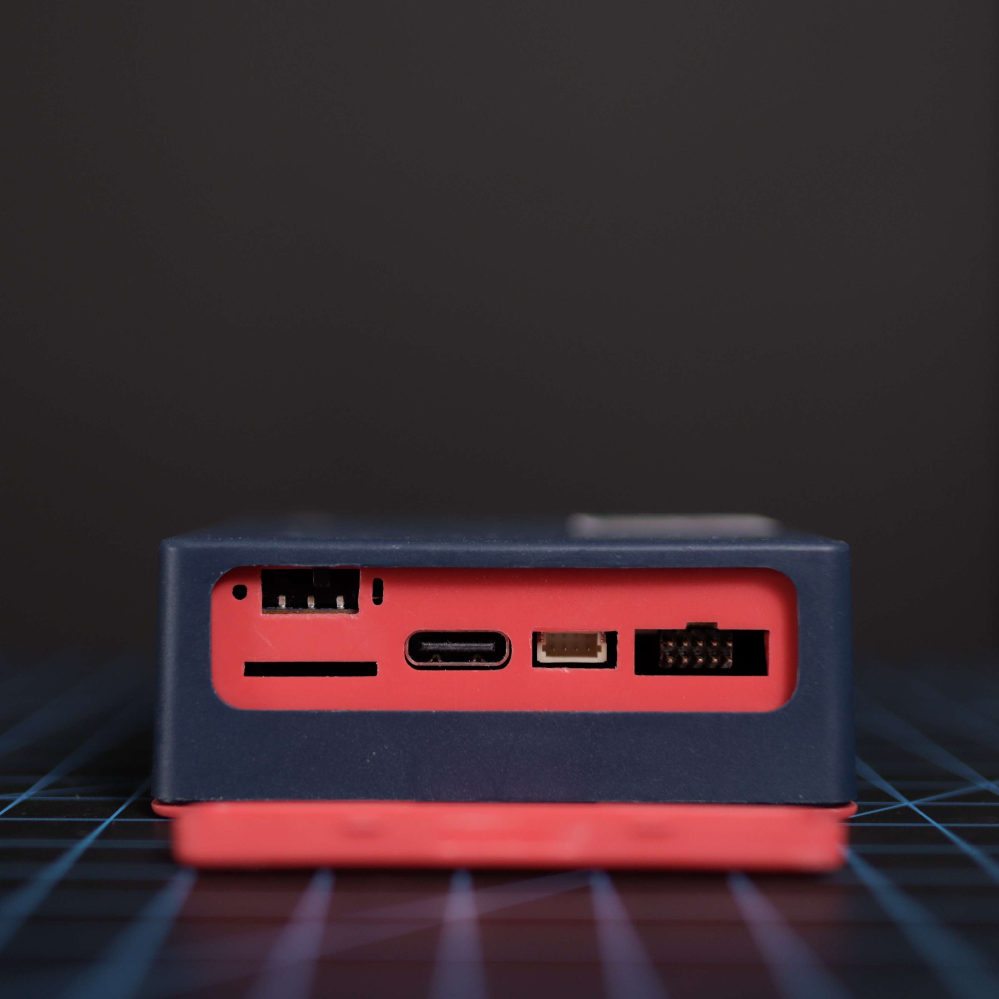


### Software requirements

* Edge Impulse account
* Edge Impulse CLI
* Arduino IDE
* Arduino CLI
* Git
* A working Zephyr environment

## Hardware Setup

To control appliances you will either have to work with AC mains or integrate with some functionality that the appliance might have, such as IR control or switches.

We chose to connect the [Adafruit Non-Latching Mini Relay FeatherWing](https://www.adafruit.com/product/2895) to the ESP32 development board as presented in the following schematic. The **Signal** pin of the relay is connected to the **GPIO32** pin of the ESP32 and the ground is common between the ESP32 and the relay.

You can use this circuit to control AC powered household devices, such as kettles, lights, or stove smoke extractors.

We have chosen an enclosure that will safely protect users from the AC Mains and the rest of the electronics. We have soldered the circuit on a test board by using the following schematic that we tested first on a breadboard. We have kept the testboard neatly separated between low DC voltage that was routed in the top part and AC High voltage that was routed in the lower part of the testboard. 

**Warning: Working with AC mains is dangerous if you have never done it before, please ask for an electronics senior or document yourself thoroughly before undergoing this schematic.**

The enclosure provides an AC In and an AC Out socket plug that allows us to integrate our electronics between thus keeping the test boards continuously supplied and enabling or disabling the output thus turning on or off the supply.

Use the appropriate wire gauge when working with AC so the current draw of the appliance is met. We have used standard 16A wire gauge with the proper colors (blue for neutral, brown for line and yellow/green for grounding according to EU standards).


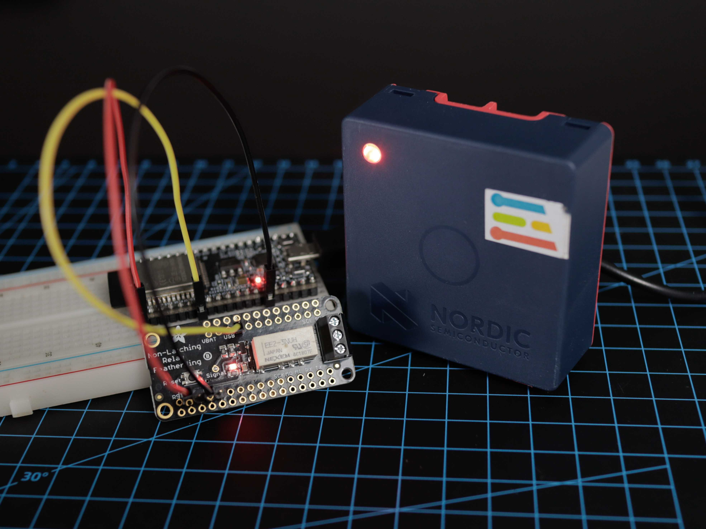

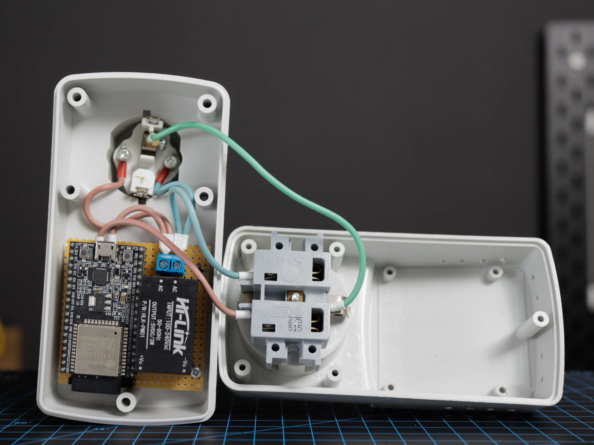

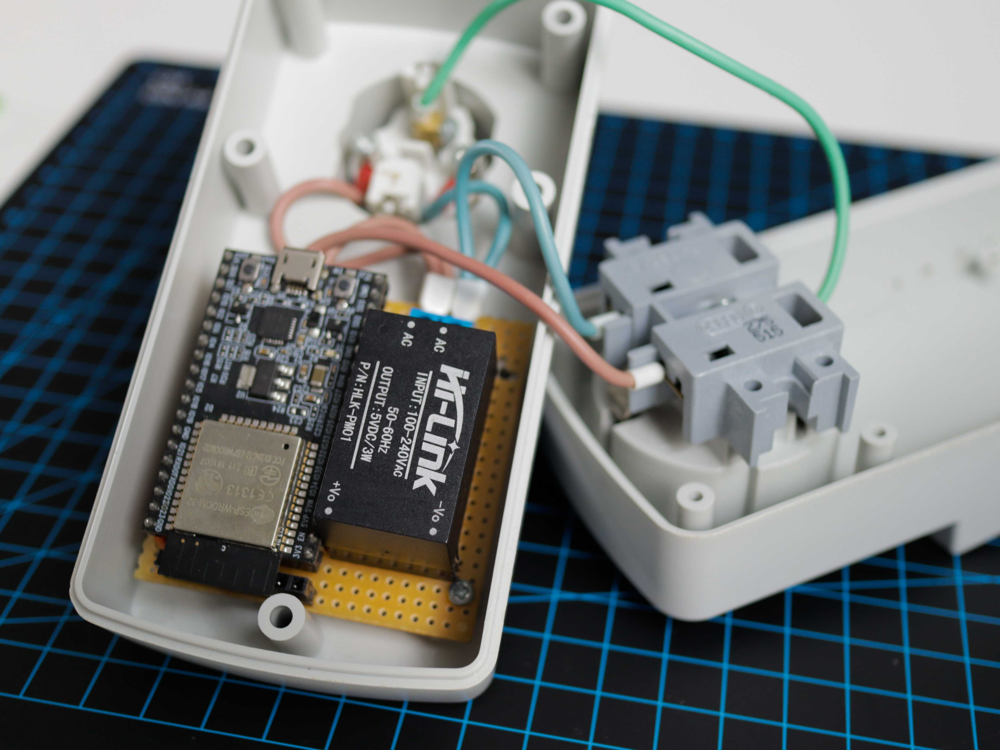

The gateway can be placed anywhere in the house and does not need to be connected to a power outlet as it is battery powered, making it much more convenient for users.

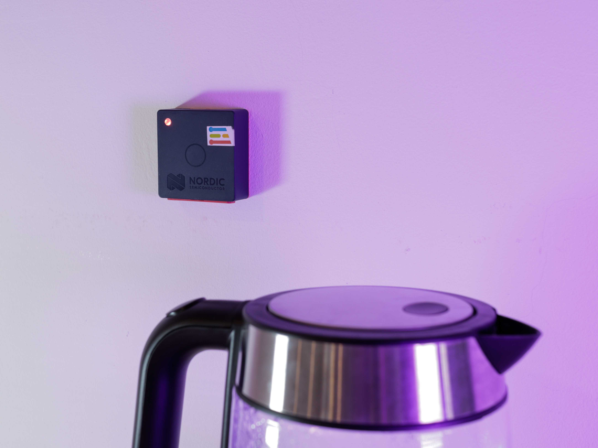

## Software Setup

### Setup the Build Environment

Building and flashing custom applications on the Nordic Thingy:53 board require a working Zephyr environment. To create it, follow the steps in the [Getting Started guide](https://docs.zephyrproject.org/latest/develop/getting_started/index.html) from the official Zephyr documentation. Afterwards, follow the steps presented in the [Developing with Thingy:53](https://developer.nordicsemi.com/nRF_Connect_SDK/doc/latest/nrf/ug_thingy53.html)  guide from the official Nordic Semiconductor documentation.  While this might not be mentioned in either of the documents, you must also install the [J-Link Software and Documentation Pack](https://www.segger.com/downloads/jlink/#J-LinkSoftwareAndDocumentationPack) and the [nRF Command Line Tools(ver 10.15.4)](https://www.nordicsemi.com/Products/Development-tools/nrf-command-line-tools/download) to be able to flash the board.

After following the steps in the guides presented above, you should have a working Zephyr environment. Remember to always work in the virtual environment created during the [Getting Started guide](https://docs.zephyrproject.org/latest/develop/getting_started/index.html) when developing applications for this platform.

### Creating an Edge Impulse Project

Let's start by creating an Edge Impulse project. Select **Developer** as your project type, click **Create a new project**, and give it a significant name.

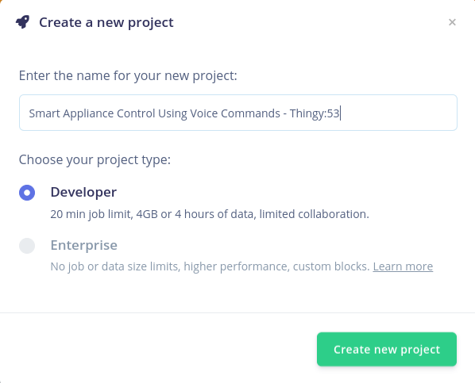

### Connecting the Device

Thingy:53 devices will work with the Nordic nRF Edge Impulse [iPhone](https://apps.apple.com/us/app/nrf-edge-impulse/id1557234087) and [Android](https://play.google.com/store/apps/details?id=no.nordicsemi.android.nrfei&hl=en&gl=US) apps or with the Edge Impulse Studio right away.

First of all, the firmware of the Thingy:53 device must be updated. Download the **nRF Programmer** mobile application and launch it. You will be prompted with a number of available samples.


Select the **Edge Impulse** application, select the version of the sample from the drop-down menu and tap **Download**.

Once that is done, tap **Install** and a list with nearby devices will appear. You have to select your development board from the list and the upload process will begin.


With the firmware updated, connect the Thingy:53 board to a computer that has the **edge-impulse-cli** suite installed, turn it on, launch a terminal and run:

```
edge-impulse-daemon --clean
```

You will be required to provide your username and password before choosing the project to which you want to attach the device.

```
Edge Impulse serial daemon v1.14.10
? What is your user name or e-mail address (edgeimpulse.com)? <your user>
? What is your password? [hidden]
```

Once you select the project and the connection is successful, the board will show up in the **Devices** tab of your project.

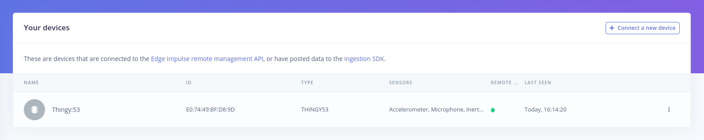

### Building the Dataset

Considering the context, the best way to gather relevant data for your Thingy:53 is to record yourself. To achieve the best performance of the speech recognition model, you can add samples of your own voice to increase the specificity of the detection algorithm.

Go to **Data Acquisition** in your Edge Impulse project and you can start gathering the data set.

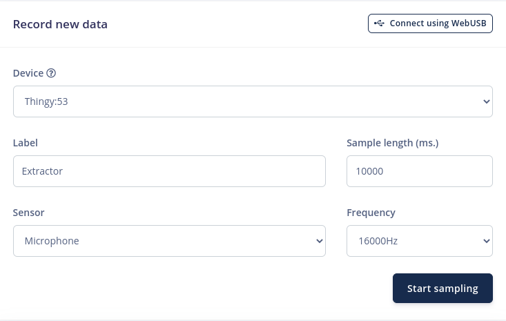

For this particular use case, we will be using the "Light", "Kettle" and "Extractor" keywords to turn on different items in the kitchen. Now start recording 5-10 seconds segments of you saying "Light",  "Kettle" and "Extractor". You will notice that they appear in the **Collected data** tab. Click on the menu symbolized by three points and press **Split Sample**. Edge Impulse automatically splits the sample in 1 second windows but you can adjust those manually. When you are happy with the windows, press **Split**.

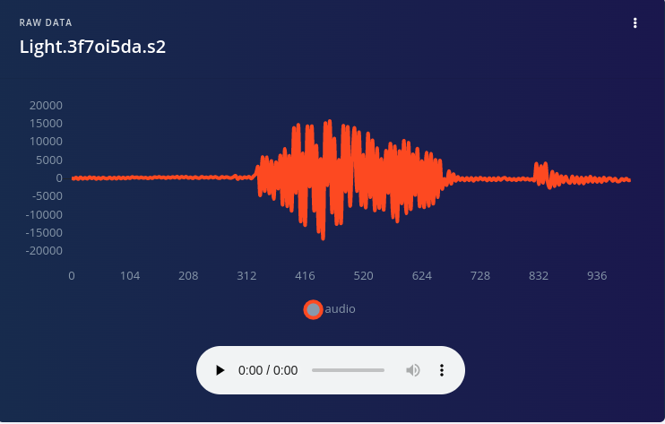

We will also require audio that doesn't contain the  keywords we wish to detect. We must gather a data set with sounds like ambient noise, people speaking in the distance, or different sound from the kitchen all of which fall within the "background" category. This class is identified as "Background". Keep in mind that data is the most important part of machine learning and your model will perform better the more diverse and abundant your data set is. 

From now on, because "Light", "Kettle" and "Extractor" are the classes we wish to detect, we will be referring to them as "positive classes" and to "Background" as a negative class. What we will be doing is use the [keywords dataset](https://cdn.edgeimpulse.com/datasets/keywords2.zip) from the Unknown and Noise samples for background noises.

Download the dataset and navigate to the **Upload data** menu. We will be uploading all the samples to the Training category and we will label the **"Noise"** and **"Unknown"** samples with the label **"Background"**.

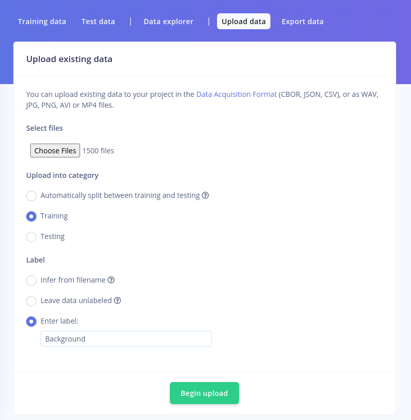

### Designing the Impulse

Let's begin developing our Impulse now that the data are available. An Impulse describes a group of blocks through which data flows and can be viewed as the functional Block of the Edge Impulse ecosystem.

The input level, the signal processing level, the learning level, and the output level are the four levels that make up an impulse.

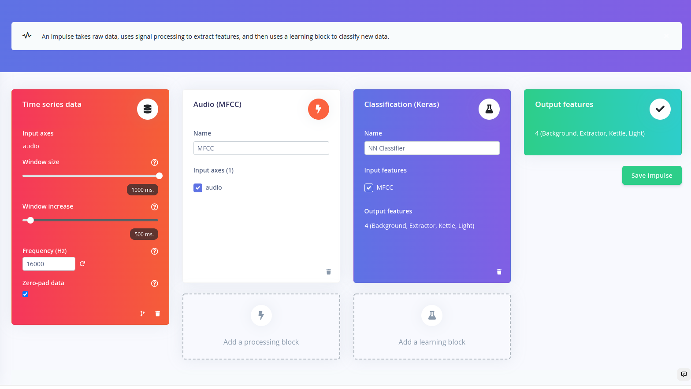

For the input block, we will leave the setting as default. As for the processing and learning block, we have opted for an **Audio (MFCC)** block and a basic **Classification (Keras)**.

Do the set up just like in the image above and click on **Save Impulse** and move on to configure the blocks one by one.

### Configuring the Audio Features Block

The **Audio MFCC (Mel Frequency Cepstral Coefficients)** block extracts coefficients from an audio signal using Mel-scale, a non-linear scale. This block is used for human voice recognition, but can also perform well for some non-voice audio use cases. You can read more about how this block works [here](https://docs.edgeimpulse.com/docs/edge-impulse-studio/processing-blocks/audio-mfcc).

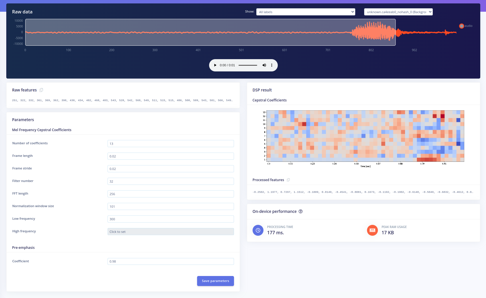

You can use the default values for configuring the MFCC block and click on **Save parameters**. You’ll be prompted to the feature generation page. Click on **Generate features** and you will be able to visualise them in the Feature explorer.

### Configure the Classifier (NN)

The next step in developing our machine learning algorithm is configuring the NN classifier block. Before training the model, you have the opportunity to modify the **Number of training cycles**, the **Learning rate**, the **Validation set size** and to enable the **Auto-balance dataset function**. The learning rate defines how quickly the NN learns, the number of training cycles determines the number of epochs to train the NN on, and the size of the validation set sets the percentage of samples from the training data pool utilized for validation. You can leave everything as it is for now and press **Start training**.


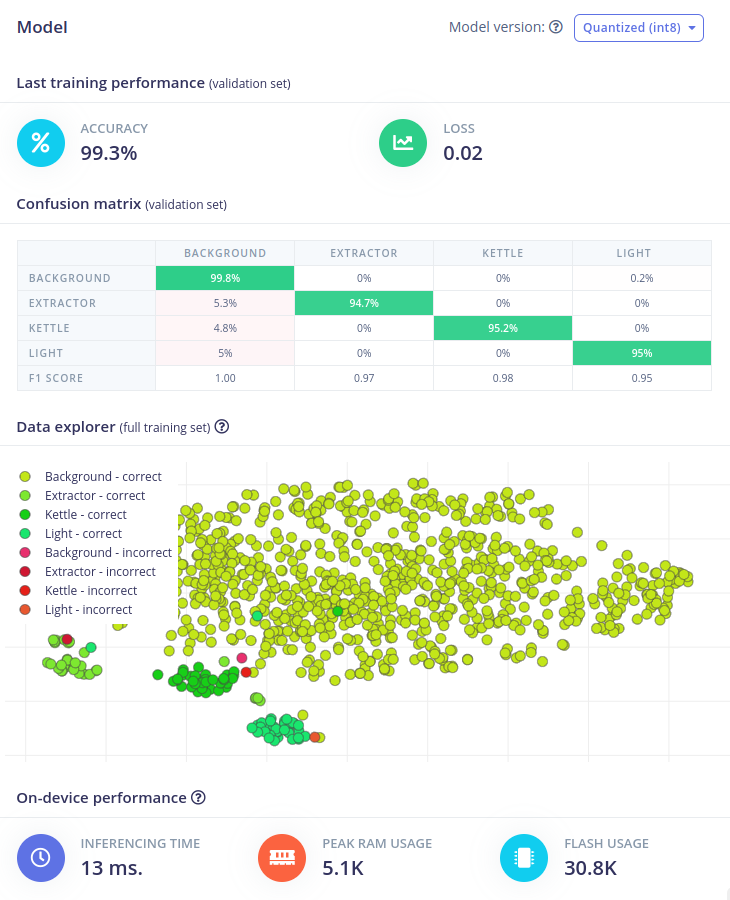

The training will be assigned to a cluster and when the process ends, the training performance tab will be displayed. There will be displayed the Accuracy and the Loss of the model, as well as the right and wrong responses provided by the model. You can also see an intuitive representation of the classification and underneath it, the predicted on-device performance of the NN.

### Test the Impulse Using iOS / Android

One way of deploying the model on the edge is using the Nordic nRF Edge Impulse app for iPhone or Android:

1. Download and install the app for your Android/IoS device.
2. Launch it and log in with your edgeimpulse.com credentials.
3. Select your Smart Appliance Control Using Voice Commands project from the list

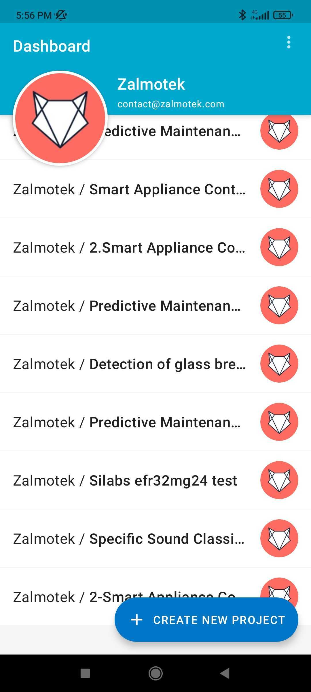

4. Navigate to the Devices tab and connect to the Thingy:53:

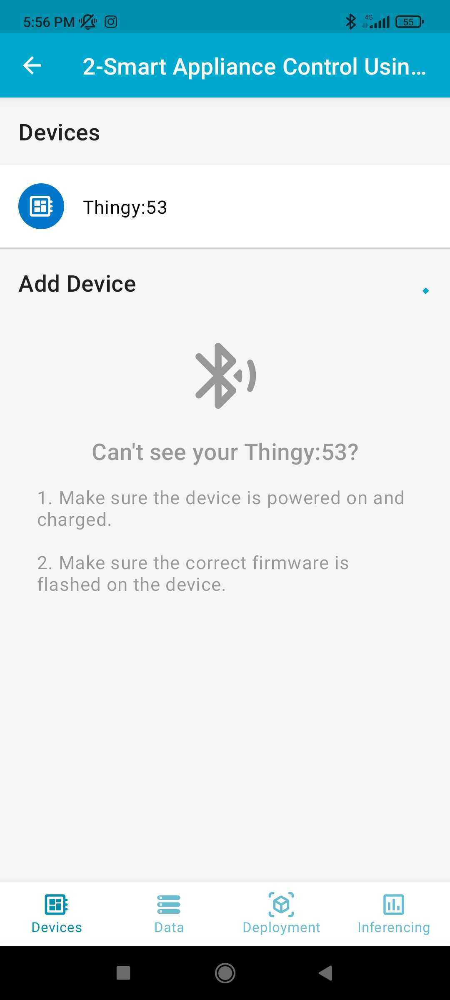

5. Navigate to the **Data tab** and press **Connect**. You will see the status on the button changing from **Connect** to **Disconnect**.

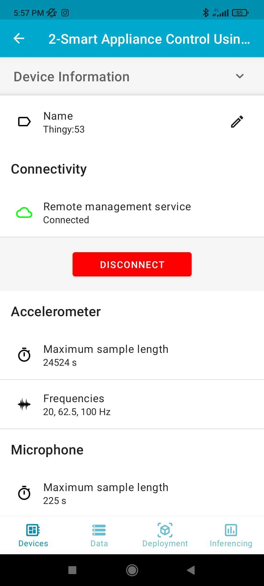

6. Navigate to the **Deployment** tab and press **Deploy**.

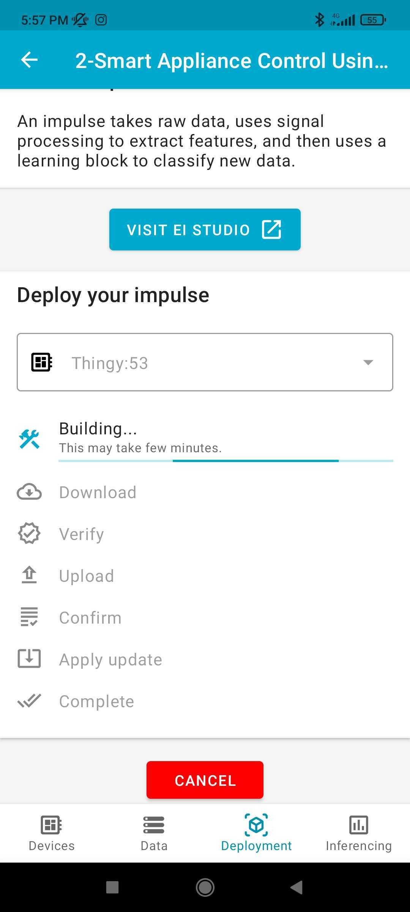

7. In the **Inferencing** tab, you will see the results of the Edge Impulse model you have flashed on the device:

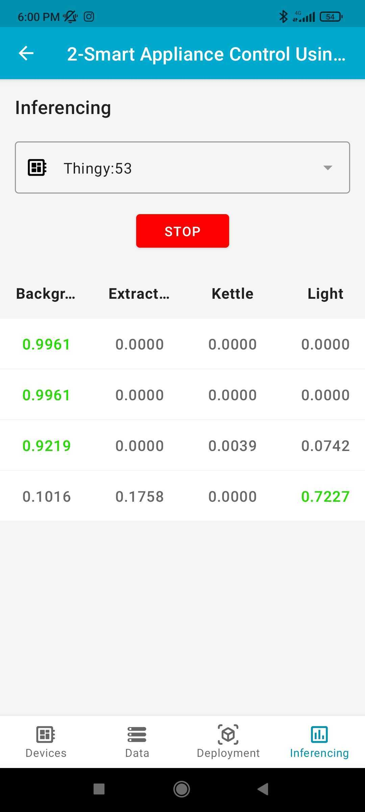

## Creating a Custom Application

To showcase the process of creating a custom application, we have decided to create a basic Bluetooth application. In this application, the Thingy:53 functions as a peripheral bluetooth device that advertises itself. The ESP32 functions as a bluetooth client that scans for available devices to connect to. When it detects the Thingy:53, it pairs with it and awaits a command.
 
After the devices are paired, when the central button of the Thingy:53 is pressed, it sends a message to the Esp32 which triggers a Relay.

[Here you can find the source code](https://github.com/Zalmotek/edge-impulse-appliance-control-voice-nordic-thingy53) for the Thingy:53 and the Esp32.

To build and flash the application on the Nordic hardware, copy the folder named `Thingy53_Peripheral` from the repository, to ncs/nrf folder and then run:

```
&west build -p always -b thingy53_nrf5340_cpuapp
nrf/Thingy53_Peripheral/
```

Make sure you have the board powered on and connected via the J-Link mini Edu to your computer and run

```
&west flash
```

To flash the esp32, follow the steps provided here to set-up the build environment and then, simply copy the code from the ESP32_Client.ino file in a new sketch and press upload.

## Future Development

For this project we have decided to deploy the machine learning algorithm on the Bluetooth peripheral device. This enables the possibility of using multiple Central devices that are dedicated to switching the appliance on and off, while the processing load of running the machine learning algorithm is done by the Thingy:53.

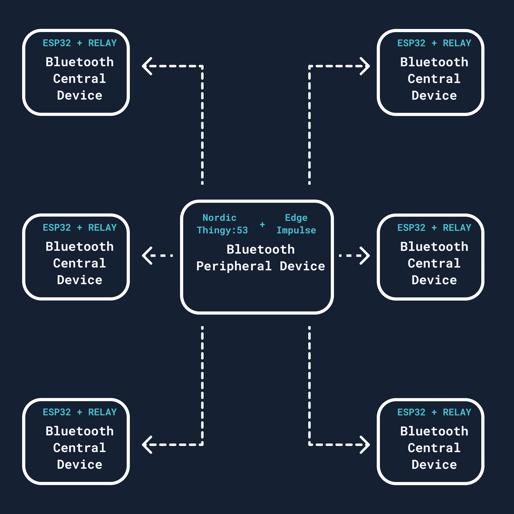

Another great addition to this project would be the implementation of the [Matter protocol](https://csa-iot.org/all-solutions/matter/).

Matter is a royalty free standard and was created to encourage interoperability between different devices and platforms. 

If the appliances already have an IoT layer, the Thingy:53 is fully compatible with the Matter and instead of using relays, it could be directly interfaced with the smart appliances.

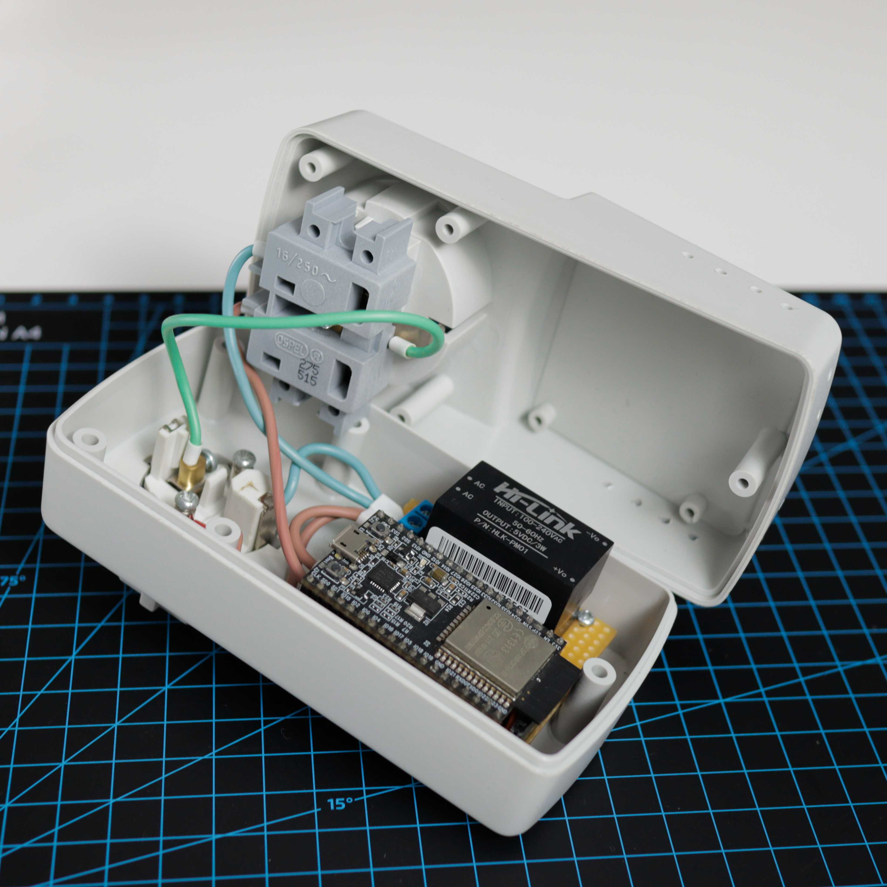

## Conclusion

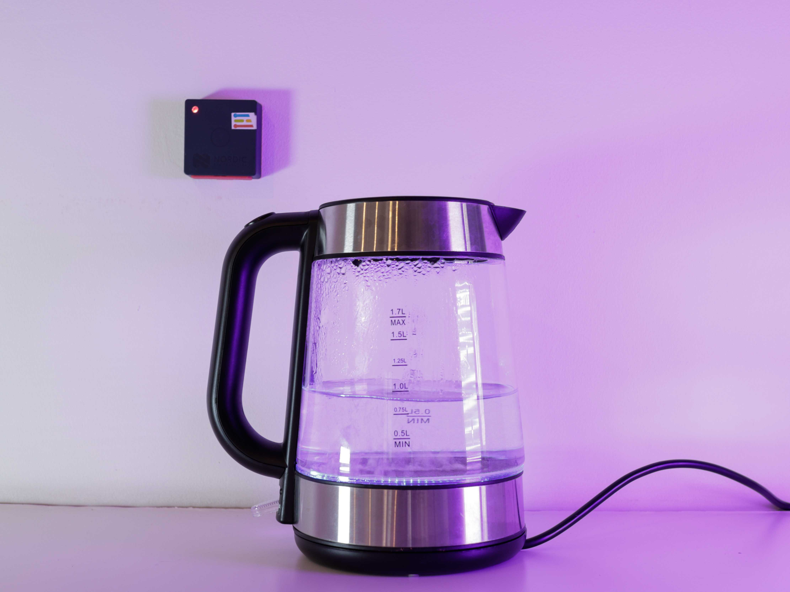

In this article, we have presented a very basic implementation of Edge Impulse on the Thingy:53 to control an appliance using voice commands. The use of Edge Impulse and the integration with Nordic Semiconductor's IoT platform opens up endless possibilities for creating intelligent and user-friendly appliances.

The ability to quickly gather data, create, train and deploy machine learning algorithms greatly simplifies the process for developers, making it easier for them to incorporate these technologies into their projects.

Ultimately, this system provides a convenient and cost-effective way to control multiple appliances in the home.

We hope that this article will inspire you to try out Edge Impulse and Nordic Semi's Thingy:53 in your own smart appliance projects.


