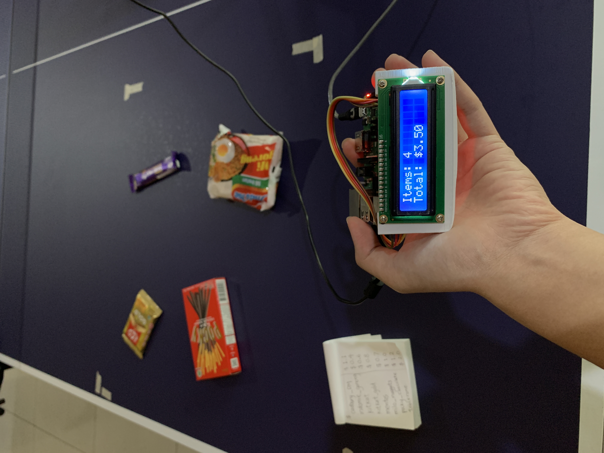
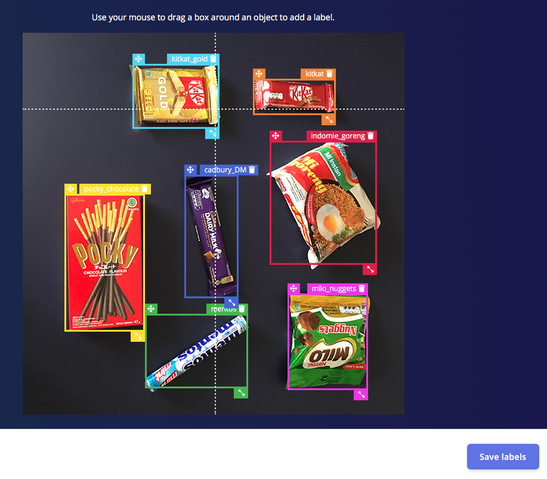
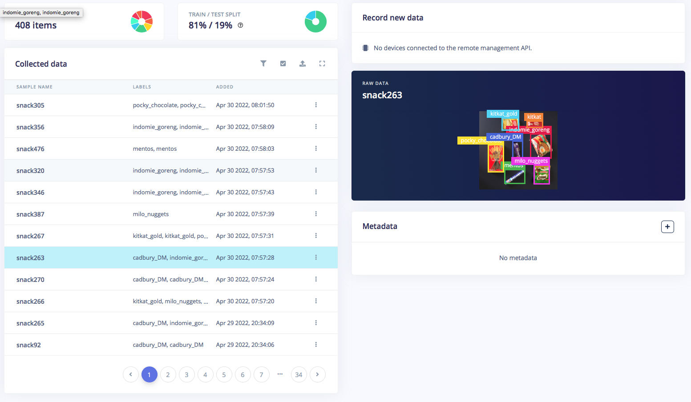
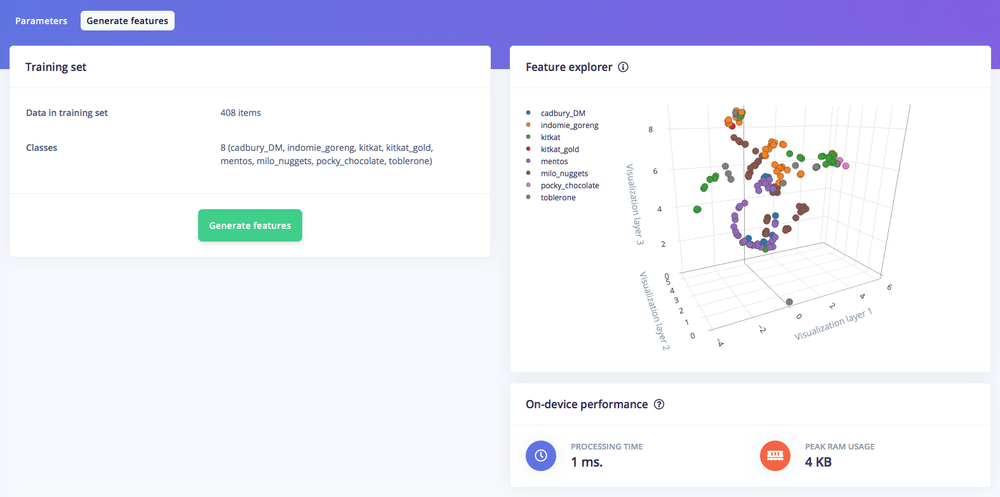
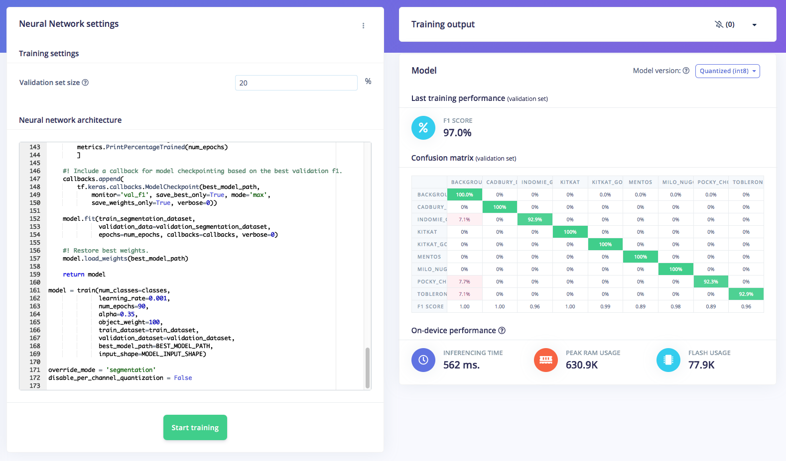

# Smart Cashier with FOMO on a Raspberry Pi

Created By:
Samuel Alexander 

Public Project Link:
[https://studio.edgeimpulse.com/public/101832/latest](https://studio.edgeimpulse.com/public/101832/latest)

## Project Demos





## About this Project

In this project I’m taking advantage of [Edge Impulse's FOMO](https://www.edgeimpulse.com/blog/announcing-fomo-faster-objects-more-objects) (Faster Objects, More Objects) algorithm that’s really fast and efficient in object detection. The algorithm is suitable for recognizing different types of objects placed on a cashier table without the use of a barcode, and is able to output the total price of items. Even a 96x96 pixel image with grayscale color depth provides enough data to make this project work. The model is exported into a Python program which is deployed to a Raspberry Pi, so it can be run locally with no cloud-connectivity needed once deployed. By running the machine learning model on the edge, this device will use less energy, less human labour, and can cut down overall hardware costs. This proof-of-concept can be further developed with more data variation, camera angles, and different cashier environment and lighting conditions to improve its accuracy in a real-world application.



### Hardware Components:

 - Raspberry Pi 4 Model B 
 - USB webcam
 - LCD Display 16 x 2

### Software/Apps & Online Services:

 - Edge Impulse Studio 
 - Raspberry Pi OS
 - Terminal

### Others:

 - 3D printed case for Pi4

## Steps

### Preparation:

Prepare the Raspberry Pi, connect via SSH, install dependencies, and the Edge Impulse for Linux CLI. Follow [this guide](https://docs.edgeimpulse.com/docs/development-platforms/officially-supported-cpu-gpu-targets/raspberry-pi-4) for extra details.

### Data Collection:

For the image collection, I took some pictures using the USB webcam attached to the Raspberry Pi that’s connected to the Edge Impulse Studio, and some other pictures are taken from a smartphone camera. The position and orientation of the items are shifted between pictures to help the ML model recognize the object later in the process.


The photos are taken using a tripod so that the size of the objects placed on the table will not change too much when it’s captured in an image. (This is especially important for the FOMO algorithm; FOMO doesn’t perform well with different object sizes). The total dataset size input is 408 pictures of the items, which consists of 8 different objects (snacks).

### Data Labeling:

Click on Labeling with Bounding-Boxes method, and choose Raspberry Pi 4 for latency calculations.



Then Upload your images, and then drag a box around each object and label it depending upon what type of snack (item) it is. Split or auto split all Training & Test data around 80/20.



### Train and Build Model:

Create an Impulse with 160x160 pixels and Grayscale parameter, and choose Image and Object Detection blocks. Choose FOMO (MobileNet V2 0.35) which will produce 8 layer outputs (Cadbury, Mentos, Indomie, KitKat, etc.) with a pretty accurate result. After testing is done, we can check the video stream from the Raspberry Pi via a browser by using the `edge-impulse-linux-runner`. If the camera is performing as expected, then the model is ready to be deployed to the Raspberry Pi 4

**Deploy Python to the Raspberry Pi 4, output to LCD 16 x 2:**

The Python program I created utilizes the `.eim` file from the training result, which transforms the object input to prices and quantity of objects output. The program also displays the output on a 16 x 2 LCD.







### Deploy and Build the Python Program:

```
            for res, img in runner.classifier(videoCaptureDeviceId):
                if (next_frame > now()):
                    time.sleep((next_frame - now()) / 1000)

                # print('classification runner response', res)

                if "classification" in res["result"].keys():
                    print('Result (%d ms.) ' % (res['timing']['dsp'] + res['timing']['classification']), end='')
                    for label in labels:
                        score = res['result']['classification'][label]
                        print('%s: %.2f\t' % (label, score), end='')
                    print('', flush=True)

                elif "bounding_boxes" in res["result"].keys():
                    print('Found %d bounding boxes (%d ms.)' % (len(res["result"]["bounding_boxes"]), res['timing']['dsp'] + res['timing']['classification']))
                    prices = {"cadbury_DM" : 1.1, "indomie_goreng" : 0.4, "kitkat" : 0.6, "kitkat_gold" : 0.8, "mentos" : 0.7, "milo_nuggets" : 1.0, "pocky_chocolate" : 1.2, "toblerone" : 2.0};   # set item price
                    total = 0
                    for bb in res["result"]["bounding_boxes"]:
                        print('\t%s (%.2f): x=%d y=%d w=%d h=%d' % (bb['label'], bb['value'], bb['x'], bb['y'], bb['width'], bb['height']))
                        img = cv2.rectangle(img, (bb['x'], bb['y']), (bb['x'] + bb['width'], bb['y'] + bb['height']), (255, 0, 0), 1)
                        total += prices[bb['label']]    #set total price
                    print("Writing to display") # write to 16x2 LCD
                    display.lcd_display_string("Items: " + str(len(res["result"]["bounding_boxes"])), 1) # show total bounding boxes as items  
                    display.lcd_display_string("Total: $" + "{:.2f}".format(total), 2) # show total price

                if (show_camera):
                    cv2.imshow('edgeimpulse', cv2.cvtColor(img, cv2.COLOR_RGB2BGR))
                    if cv2.waitKey(1) == ord('q'):
                        break
```

## Summary:

This project is an example of how embedded object detection can be the solution for a real-world problem. The Smart Cashier can identify objects, quantity of objects, and the total price of objects almost instantly.  And beacuse it is running locally using a single board computer, no cloud connectivity is needed.

