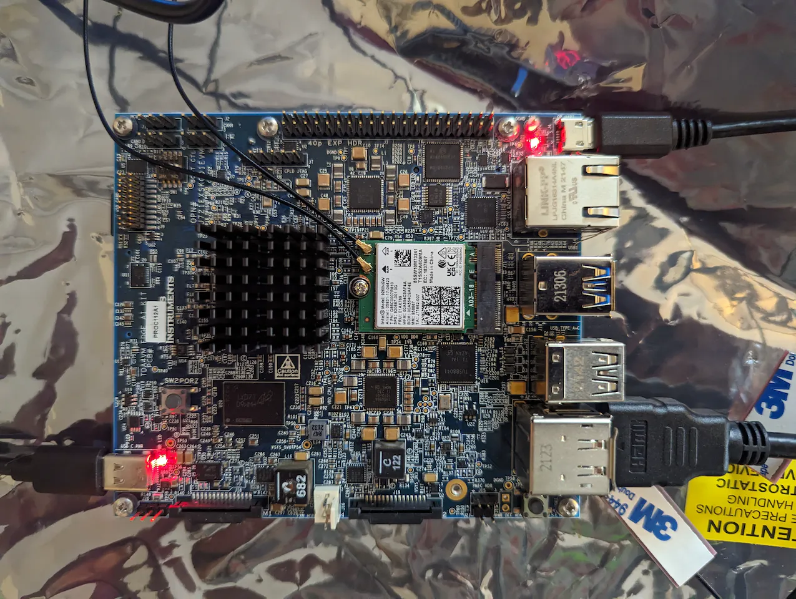
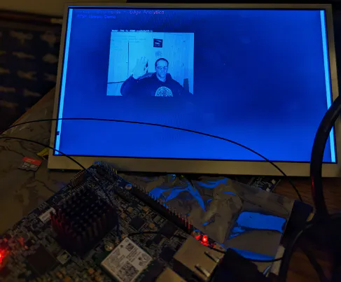
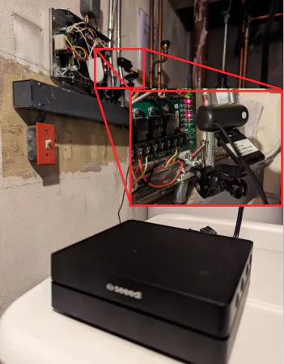
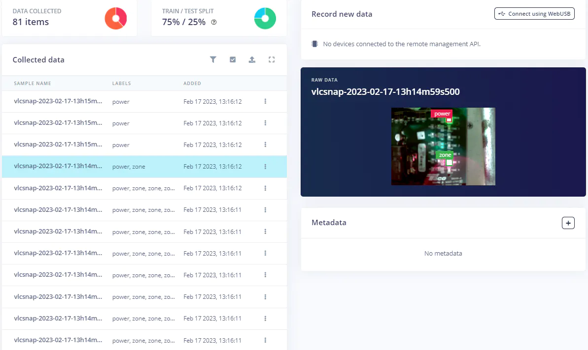
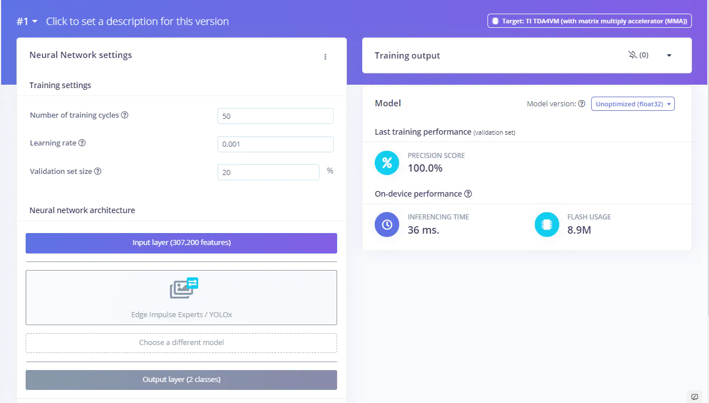
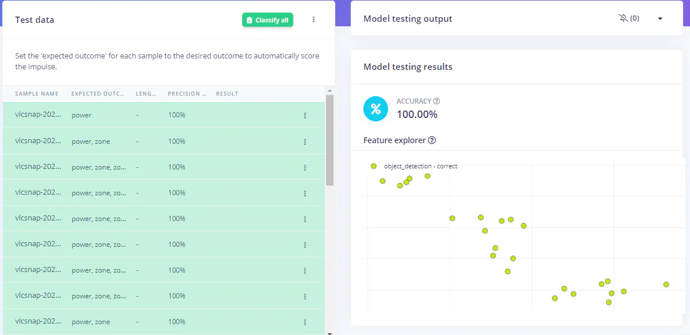
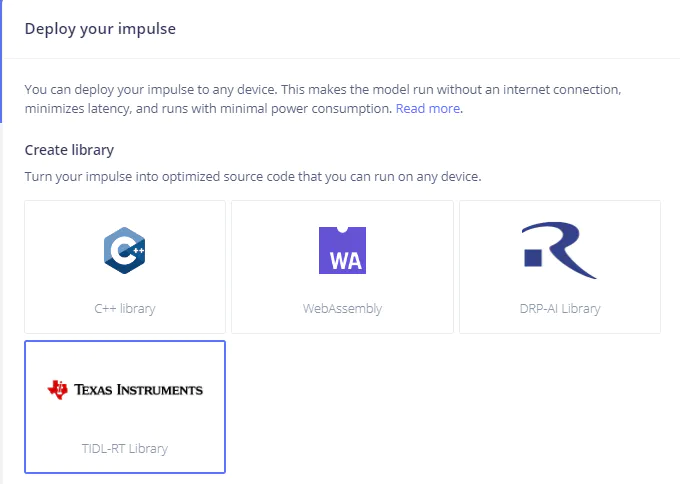
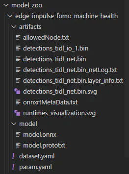
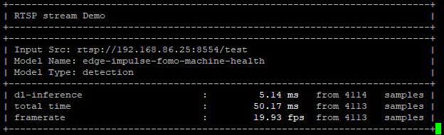

# Smart Factory Prototype with Texas Instruments TDA4VM

Created By:
Justin Lutz 

Public Project Link:
[https://studio.edgeimpulse.com/public/187321/latest](https://studio.edgeimpulse.com/public/187321/latest)

GitHub Repo:

[https://github.com/jlutzwpi/SK-TDA4VM](https://github.com/jlutzwpi/SK-TDA4VM)

## Project Demo



## Introduction

Knowing the status and health of factory machinery is critical to an organization's success. It takes factory operator vigilance to regularly monitor equipment and take action if anomalous behavior is detected. However, it can be fatiguing for personnel to constantly monitor equipment, and if an issue is missed, weeks of downtime for costly repairs can be the result.

This is where the power of computer vision on the edge can be invaluable. Using a computer model trained to detect nominal and off-nominal behavior, operators can be alerted of issues, rather than having to be constantly on the lookout. And with the inferencing being done at the edge, privacy is maintained, and organizational leadership can breathe easy that perhaps sensitive images won't be sent to the cloud for remote inferencing.


## Texas Instruments SK-TDA4VM

The TI SK-TDA4VM starter kit is up to the task for smart factory operations. With the [TDA4VM processor](https://www.ti.com/product/TDA4VM) and 4GB of LPDDR4‐4266 RAM, the system can execute up to 8 Trillion Operations Per Second (TOPS). A full overview of the hardware specs, along with links to the startup guide, [can be found here](https://www.ti.com/tool/SK-TDA4VM).

I was lucky enough to receive a starter kit from the TI and Edge Impulse teams to integrate an Edge Impulse model onto the kit. I wanted to go a step further and test out RSTP streaming with the SK-TDA4VM.

I first started by following [the startup guide](https://software-dl.ti.com/jacinto7/esd/processor-sdk-linux-sk-tda4vm/latest/exports/docs/getting_started.html) and downloading the OS and Processor SDK onto an SD card. At the time of this writing, that version was 8.05. After writing the SDK to a micro SD card, connecting a small HDMI monitor, and connecting a micro USB cable to the UART port, I was up and running fairly quickly and seeing boot up output through my putty serial connection. However, I don't have an Ethernet router near my office (I'm pretty much all wireless) so I ordered an [Intel 9260 Wireless PCIe M2e](https://www.amazon.com/dp/B079QJQF4Y?psc=1&ref=ppx_yo2ov_dt_b_product_details) card to get the ability to connect to the Internet (and receive RTSP streams). I followed [this guide from TI](https://software-dl.ti.com/jacinto7/esd/processor-sdk-linux-sk-tda4vm/08_01_00_02/exports/docs/wifi_oob_demo.html) and connected essentially out of the box. Once I had the internet connection, I remotely connected through Visual Studio Code (as described in the startup guide) so I could edit files through VS Code instead of VI (which I highly recommend).



Since I was planning on running an RTSP stream, I didn't connect a USB or Raspberry Pi camera to the board. Before getting into the RTSP streaming though, I started experimenting with the sample models that come with the SDK, for example image classification, object detection, image segmentation, and pose estimation. I [followed this tutorial](https://software-dl.ti.com/jacinto7/esd/processor-sdk-linux-sk-tda4vm/08_01_00_02/exports/docs/running_simple_demos.html#running-python-based-demo-applications) using the Python demo scripts and found it pretty straightforward to use the config yaml files to change models, inputs, and outputs.

## RTSP Streaming

Before building my Edge Impulse model, I wanted to ensure that I could get RTSP streaming up and running, which proved to be a bit of a challenge. I've had [success on other projects](https://www.hackster.io/justinelutz/protect-your-casa-with-hasa-38b32e) using a commercial RTSP streaming camera out of the box, but they were not working with the SK-TDA4VM. I reached out to TI's E2E technical forum, and they were prompt in responding to my issues. The technical team recommended [following this tutorial](https://gist.github.com/Santiago-vdk/80c378a315722a1b813ae5da1661f890) on setting up an RTSP streamer in Ubuntu. My thread on the E2E forum can be [found here](https://e2e.ti.com/support/processors-group/processors/f/processors-forum/1196339/sk-tda4vm-unable-to-run-rtsp-streaming-demo?tisearch=e2e-sitesearch&keymatch=tda4vm%20rtsp#). I ended up using my Seeed Studio reComputer 1010 (with a Jetson Nano) with an inexpensive USB camera as my setup for the RTSP streamer. Following the instructions of the tutorial, I was able to get the test source working.

The next challenge was correctly forming the gstreamer pipeline to correctly receive the RTSP stream. That proved a bit of a challenge (for a gstreamer noob like me) and after much trial and error was able to run an RTSP stream on the SK-TDA4VM! Below is the gstreamer pipeline that worked for me for the RTSP streamer example:

```
./test-launch  --gst-debug=3 '( v4l2src device=/dev/video0 ! image/jpeg,width=640,height=480,framerate=30/1 ! jpegdec ! videoconvert ! video/x-raw,width=640,height=480,framerate=30/1 ! x264enc tune="zerolatency" byte-stream=true bitrate=2000 ! rtph264pay name=pay0 pt=96 )'
```



While I was eventually successful, this setup took days to figure out, and I hope TI has more out of the box solutions in the future.

## On to my Project

Once I had the setup working, I moved the reComputer down to my basement for my project. Since I don't have any factory equipment in my house, I decided to use my heating zone controller as a demonstration of the capabilities of an Edge Impulse model with the SK-TDA4VM hardware and an RTSP stream.



Once I had the setup complete, and the RTSP server running, I starting collecting data for my Edge Impulse model. For that I simply used VLC media player to stream the RTSP stream. If would then click on `Video > Take Snapshot` to take a screenshot of my controller. I would use my smartphone to change the temperature in various zones, which would cause those zone lights to illuminate red on the controller board. I took about a hundred photos with various lights illuminated (and off). Ideally you would have several hundred images but this was a good start. Once I had those images collected, it was time to start up the [Edge Impulse Studio](https://www.edgeimpulse.com/) and start labelling data. I elected to do an object detection model since I wanted to identify the number of zones illuminated (and hence on), so labelling consisted of created bounding boxes around the illuminated zones (and power LED).



Once all the training and test images were labeled, I created my impulse:


Since my input stream was 640 x 480, I decided to have my model image dimensions be 320 x 320 (they have to be square). I selected Image for the processing block, and Object Detection for the learning block.

Since I wanted to differentiate between the power LED (which is green) and the zone LEDs (which are red), I decided to use RGB images for my model. This ruled out FOMO, which is greyscale only. In hindsight, I think I could have done FOMO and just differentiate by bounding box coordinates which LED is power (it would always be at the top) and which is a zone LED; color wouldn't have to be a determining factor.

## Compatible Models with SK-TDA4VM

I initially selected a YoloV5 model as the model block for my transfer learning model, but I soon found out after deploying it that it wasn't compatible with the TI Deep Learning (TIDL) AI accelerators. Thanks to the Edge Impulse team, I learned that I needed to [use a TI fork of the YoloX model](https://github.com/edgeimpulse/example-custom-ml-block-ti-yolox/tree/onnx-v7) that would play nice with the TIDL framework. This tutorial took me a bit to complete as your system needs to be configured for Virtualization (which mine wasn't) and Docker desktop needs to be installed. It took a couple nights of trying, but I was finally able to push my custom YoloX block to the project.

Once I had that custom block created, I retrained my model with YoloX:



I ran against the test data with great results:



I then deployed my model as a TI TIDL-RT library.



A public version of the project can be [found here](https://studio.edgeimpulse.com/public/187321/latest).

## PSDK Compatibilities

The output of library build is a zip file, however, the contents are in the format for the edge-impulse-linux-runner, and not the TI model zoo format that's found in the SDK. I organized the model contents into a similar format as the other models in the model zoo:



However, I received error messages trying to load the model. After another [trip to TI E2E](https://e2e.ti.com/support/processors-group/processors/f/processors-forum/1198484/sk-tda4vm-import-edge-impulse-model-tidl-rt-library-to-run-on-rtsp_src_streaming-yaml-sdk-example/4518469?focus=true), I found out that the Edge Impulse model library was for the 8.04 SDK, and I was running version 8.05 and the two were thus incompatible. Fortunately for me, within days, Edge Impulse had up-rev'd their library output to be compatible with 8.05, and another hurdle was cleared!

## Scaling

With the release of the Edge Impulse TIDL-RT for PSDK v8.05, I was now able to load the Edge Impulse model and see the RTSP stream without the application crashing. However, I was seeing HUNDREDS of detections. With the help of the Edge Impulse SMEs, I learned that there is a difference between the image input range of the Edge Impulse SDK (0...1) and the YoloX input range (0...255). I therefore had to scale the image input to 1/255 to feed into the Edge Impulse SDK. After a couple hours of searching, I found a variable in the model's `params.yaml` file that can scale the input:

```
input_scale:
    - 0.0039215697906911373
    - 0.0039215697906911373
    - 0.0039215697906911373
```

This was originally set to 1.0. If you do the quick math, 1.0 / 255.0 = 0.0039215697906911373. After I had changed that scaling factor, success!

As you can see below, I was seeing pretty solid inference times of 50 ms for ~20 fps at 640x480 over RTSP. Not bad! I think the 50 ms inference is really strong for object detection.



If you look at my GitHub, you can see my settings for the `rtsp_src_example.yaml`, as well as the model contents and configurations. I made some small changes to the `post_process.py` python file as well.

Overall, this was a good test of learning new concepts for development. From getting the RTSP server up and running, to creating custom blocks, to ensuring the model inputs aligned, I came across several obstacles that I didn't anticipate. However, the end result was a solid demonstration of the SK-TDA4VM board when paired with an Edge Impulse object detection model.

