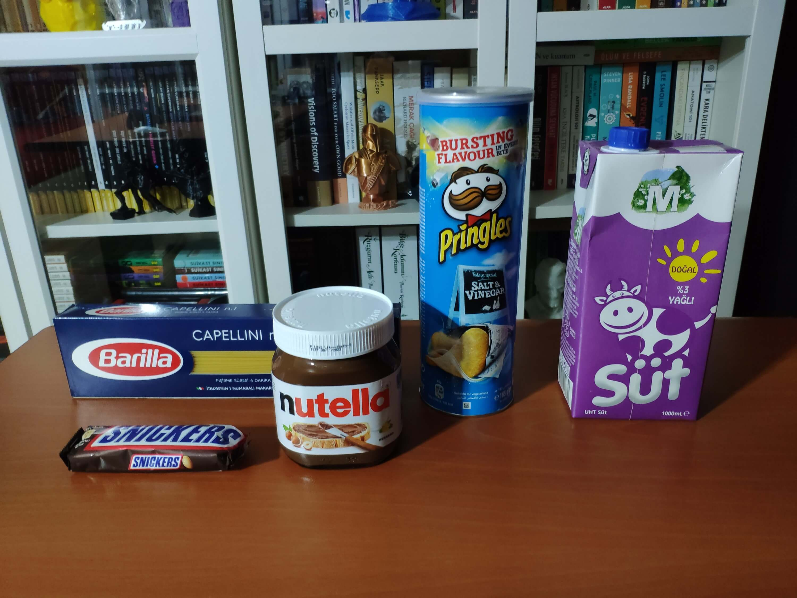

# Smart Grocery Cart Using Computer Vision

Created By: Kutluhan Aktar

Public Project Link: [https://studio.edgeimpulse.com/public/166688/latest](https://studio.edgeimpulse.com/public/166688/latest)


## Description

Especially after the recent success of Amazon Go cashierless convenience stores, there is a surge in adaptations of this relatively new approach to the shopping experience, including computer vision, sensor fusion, and deep learning. Since the nonpareil concept of cashierless stores is to make shoppers avoid tedious checkout lines and self-checkout stations, the stores equipped with this technology improve the customer experience and increase profit margins comparatively. While implementing this technology in a grocery or convenience store, smart grocery carts are the most prominent asset to provide an exceptional customer experience like Amazon Go.

Although smart grocery carts improve the customer experience and plummet maintenance costs by providing an automated product tracking and payment system, the current integration methods are expensive investments for small businesses in the food retail industry since these methods require renovating (remodeling) store layouts or paying monthly fees to cloud services.

After perusing recent research papers on smart grocery carts, I noticed there is no appliance devised for converting regular grocery carts into smart grocery carts without changing anything else in an existing establishment. Therefore, I decided to build a budget-friendly and easy-to-use device giving smart grocery cart perks to regular grocery carts with a user-friendly interface.

To detect different food retail products accurately, I needed to create a valid data set in order to train my object detection model with notable veracity. Since OpenMV Cam H7 is a considerably small high-performance microcontroller board designed specifically for machine vision applications, I decided to utilize OpenMV Cam H7 in this project. Also, I was able to capture product images easily while collecting data and store them on an SD card since OpenMV Cam H7 has a built-in MicroSD card module. Then, I employed a color TFT screen (ST7735) to display a real-time video stream, the prediction (detection) results, and the selection (options) menu.

After completing my data set including various food retail products, I built my object detection model with Edge Impulse to detect products added or removed to/from the grocery cart. I utilized Edge Impulse FOMO (Faster Objects, More Objects) algorithm to train my model, which is a novel machine learning algorithm that brings object detection to highly constrained devices. Since Edge Impulse is nearly compatible with all microcontrollers and development boards, I had not encountered any issues while uploading and running my model on OpenMV Cam H7. As labels, I utilized the product brand names, such as Nutella and Snickers.

After training and testing my object detection (FOMO) model, I deployed and uploaded the model on OpenMV Cam H7 as an OpenMV firmware. Therefore, the device is capable of detecting products by running the model independently without any additional procedures or latency.

Since I wanted to create a full-fledged device providing a wholesome shopping experience, I decided to build a web application from scratch in PHP, JavaScript, CSS, and MySQL. Therefore, I installed an Apache HTTP Server (XAMPP) on LattePanda 3 Delta, which also has a MariaDB database.

This complementing web application lets customers create accounts via its interface, receives requests from the device to add or remove products to/from the customer's database table, and creates a concurrent shopping list from the products added to the grocery cart. Also, the application sends an HTML email to the customer's registered email address when the customer finishes shopping and is ready to leave the store, including the generated shopping list and the payment link.

Since OpenMV Cam H7 does not provide Wi-Fi or cellular connectivity, I employed Beetle ESP32-C3 to get commands from OpenMV Cam H7 via serial communication and communicate with the web application via HTTP GET requests, which is an ultra-small size development board intended for IoT applications. To send commands via serial communication and control the selection menu after a product is detected by the model, I connected a joystick to OpenMV Cam H7. I also utilized the joystick while taking and storing pictures of various food retail products.

To enable the device to determine when the customer completes shopping and is ready to leave the store, I connected an MFRC522 RFID reader to Beetle ESP32-C3 so as to detect the assigned RFID key tag provided by the store per grocery cart. Also, I connected a buzzer and an RGB LED to Beetle ESP32-C3 to inform the customer of the device status.

After completing the wiring on a breadboard for the prototype and testing my code and object detection model, I decided to design a PCB for this project to make the device assembly effortless. Since Scrooge McDuck is one of my favorite cartoon characters and is famous for his wealth and stinginess, I thought it would be hilarious to design a shopping-related PCB based on him.

Lastly, to make the device as robust and sturdy as possible while being attached to a grocery cart and utilized by customers, I designed a semi-transparent hinged case compatible with any grocery cart due to its hooks and snap-fit joints (3D printable).

So, this is my project in a nutshell 😃

In the following steps, you can find more detailed information on coding, capturing food retail product images, storing pictures on an SD card, building an object detection (FOMO) model with Edge Impulse, running the model on OpenMV Cam H7, developing a full-fledged web application, and communicating with the web application via Beetle ESP32-C3.

🎁🎨 Huge thanks to [PCBWay](https://www.pcbway.com/) for sponsoring this project.

🎁🎨 Huge thanks to [DFRobot](https://www.dfrobot.com/?tracking=60f546f8002be) for sponsoring these products:

⭐ Beetle ESP32-C3 | [Inspect](https://www.dfrobot.com/product-2566.html?tracking=60f546f8002be)

⭐ LattePanda 3 Delta 864 | [Inspect](https://www.dfrobot.com/product-2594.html?tracking=60f546f8002be)

⭐ DFRobot 8.9" 1920x1200 IPS Touch Display | [Inspect](https://www.dfrobot.com/product-2007.html?tracking=60f546f8002be)

🎁🎨 Also, huge thanks to [Creality](https://store.creality.com/) for sending me a [Creality Sonic Pad](https://www.creality.com/products/creality-sonic-pad), a [Creality Sermoon V1 3D Printer](https://www.creality.com/products/creality-sermoon-v1-v1-pro-3d-printer), and a [Creality CR-200B 3D Printer](https://www.creality.com/products/cr-200b-3d-printer).


## Step 1: Designing and soldering the Scrooge McDuck-inspired PCB

Before prototyping my Scrooge McDuck-inspired PCB design, I tested all connections and wiring with OpenMV Cam H7 and Beetle ESP32-C3. Then, I checked the connection status between Beetle ESP32-C3 and the web application hosted on LattePanda 3 Delta.


Then, I designed my Scrooge McDuck-inspired PCB by utilizing KiCad. As mentioned earlier, I chose to design my PCB based on Scrooge McDuck since I loved the juxtaposition of shopping and his well-known stinginess :) I attached the Gerber file of the PCB below. Therefore, if you want, you can order this PCB from PCBWay to build this device giving smart grocery cart perks to any grocery cart.


First of all, by utilizing a soldering iron, I attached headers (female), a COM-09032 analog joystick, a buzzer, a 5mm common anode RGB LED, and a power jack to the PCB.

📌 Component list on the PCB:

_OpenMV\_H7\_1, OpenMV\_H7\_2 (Headers for OpenMV Cam H7)_

_Beetle\_C3\_1, Beetle\_C3\_2 (Headers for Beetle ESP32-C3)_

_MFRC522 (Headers for MFRC522 RFID Reader)_

_ST7735 (Headers for ST7735 1.8" Color TFT Display)_

_U1 (COM-09032 Analog Joystick)_

_BZ1 (Buzzer)_

_D1 (5mm Common Anode RGB LED)_

_J1 (Power Jack)_


## Step 1.1: Making connections and adjustments

```
// Connections
// Beetle ESP32-C3 : 
//                                MFRC522
// D7   --------------------------- RST
// D2   --------------------------- SDA
// D6   --------------------------- MOSI
// D5   --------------------------- MISO
// D4   --------------------------- SCK
//                                OpenMV Cam H7
// D0   --------------------------- P4
// D1   --------------------------- P5
//                                5mm Common Anode RGB LED
// D21  --------------------------- R
// D8   --------------------------- G
// D9   --------------------------- B
//                                Buzzer
// D20  --------------------------- +
//
//
// OpenMV Cam H7 :
//                                ST7735 1.8" Color TFT Display
// 3.3V --------------------------- LED
// P2   --------------------------- SCK
// P0   --------------------------- SDA
// P8   --------------------------- AO
// P7   --------------------------- RESET
// P3   --------------------------- CS
// GND  --------------------------- GND
// 3.3V --------------------------- VCC
//                                JoyStick
// P6   --------------------------- VRX
// P9   --------------------------- SW
```

After completing soldering, I attached all remaining components to the Scrooge McDuck PCB via headers — OpenMV Cam H7, Beetle ESP32-C3, MFRC522 RFID reader, and ST7735 color TFT display.

I connected a color TFT screen (ST7735) to [OpenMV Cam H7](https://openmv.io/products/openmv-cam-h7) so as to display the real-time video stream, the detection results after running the object detection (FOMO) model, and the selection (options) menu. To save images under two categories and control the selection menu after a product is detected by the model, I connected an analog joystick (COM-09032) to OpenMV Cam H7.

To be able to transfer commands to [Beetle ESP32-C3](https://wiki.dfrobot.com/SKU\_DFR0868\_Beetle\_ESP32\_C3) via serial communication, I connected the hardware serial port of OpenMV Cam H7 (UART 3) to the hardware serial port of Beetle ESP32-C3 (Serial1). To enable the device to determine when the customer finishes shopping and is ready to leave the store, I connected an MFRC522 RFID reader to Beetle ESP32-C3. Also, I connected a buzzer and an RGB LED to inform the customer of the device status, denoting web application connection and serial communication success.


## Step 2: Designing and printing a semi-transparent hinged case

Since I focused on building a budget-friendly and easy-to-use device that captures food retail product images, detects products with object detection, and provides an exceptional customer experience, I decided to design a robust and sturdy semi-transparent hinged case allowing the customer to access the RFID reader and the joystick effortlessly. To avoid overexposure to dust and prevent loose wire connections, I added two snap-fit joints to the hinged case. Also, I decided to emboss different grocery cart icons on the top part of the hinged case to emphasize the shopping theme gloriously :)

Since I needed to connect the top and bottom parts of the hinged case seamlessly, I designed a pin with pin ends (caps). To make the device compatible with any grocery cart, I added two hooks on the back of the bottom part. Also, I added a ring to the bottom part to attach the assigned RFID key tag.

I designed the top and bottom parts of the hinged case, the pin, and the pin ends in Autodesk Fusion 360. You can download their STL files below.


Then, I sliced all 3D models (STL files) in Ultimaker Cura.


Since I wanted to create a semi-transparent solid structure for the hinged case representing product packaging, I utilized this PLA filament:

* Natural

Finally, I printed all parts (models) with my Creality Sermoon V1 3D Printer and Creality CR-200B 3D Printer in combination with the Creality Sonic Pad. You can find more detailed information regarding the Sonic Pad in Step 2.1.


If you are a maker or hobbyist planning to print your 3D models to create more complex and detailed projects, I highly recommend the Sermoon V1. Since the Sermoon V1 is fully-enclosed, you can print high-resolution 3D models with PLA and ABS filaments. Also, it has a smart filament runout sensor and the resume printing option for power failures.

Furthermore, the Sermoon V1 provides a flexible metal magnetic suction platform on the heated bed. So, you can remove your prints without any struggle. Also, you can feed and remove filaments automatically (one-touch) due to its unique sprite extruder (hot end) design supporting dual-gear feeding. Most importantly, you can level the bed automatically due to its user-friendly and assisted bed leveling function.

:hash: Before the first use, remove unnecessary cable ties and apply grease to the rails.

.jpg>)

.jpg>)

.jpg>)

:hash: Test the nozzle and hot bed temperatures.

.jpg>)

:hash: Go to _Print Setup ➡ Auto leveling_ and adjust five predefined points automatically with the assisted leveling function.

.jpg>)


:hash: Finally, place the filament into the integrated spool holder and feed the extruder with the filament.

.jpg>)

.jpg>)

:hash: Since the Sermoon V1 is not officially supported by Cura, download the latest [Creality Slicer](https://www.creality.com/pages/download-sermoon-v1v1-pro) version and copy the official printer settings provided by Creality, including _Start G-code_ and _End G-code_, to a custom printer profile on Cura.


.png>)

.png>)

.png>)


## Step 2.1: Improving print quality and speed with the Creality Sonic Pad

Since I wanted to improve my print quality and speed with Klipper, I decided to upgrade my Creality CR-200B 3D Printer with the [Creality Sonic Pad](https://www.creality.com/products/creality-sonic-pad).

Creality Sonic Pad is a beginner-friendly device to control almost any FDM 3D printer on the market with the Klipper firmware. Since the Sonic Pad uses precision-oriented algorithms, it provides remarkable results with higher printing speeds. The built-in input shaper function mitigates oscillation during high-speed printing and smooths ringing to maintain high model quality. Also, it supports G-code model preview.

Although the Sonic Pad is pre-configured for some Creality printers, it does not support the CR-200B officially yet. Therefore, I needed to add the CR-200B as a user-defined printer to the Sonic Pad. Since the Sonic Pad needs unsupported printers to be flashed with the self-compiled Klipper firmware before connection, I flashed my CR-200B with the required Klipper firmware settings via _FluiddPI_ by following [this YouTube tutorial](https://www.youtube.com/watch?v=gfZ9Lbyh8qU).

If you do not know how to write a printer configuration file for Klipper, you can download the stock CR-200B configuration file from [here](https://github.com/ChewyJetpack/CR-200B-Klipper-Config/).

:hash: After flashing the CR-200B with the Klipper firmware, copy the configuration file _(printer.cfg)_ to a USB drive and connect the drive to the Sonic Pad.

:hash: After setting up the Sonic Pad, select _Other models_. Then, load the _printer.cfg_ file.

.jpg>)

.jpg>)

:hash: After connecting the Sonic Pad to the CR-200B successfully via a USB cable, the Sonic Pad starts the self-testing procedure, which allows the user to test printer functions and level the bed.


.jpg>)

.jpg>)

:hash: After completing setting up the printer, the Sonic Pad lets the user control all functions provided by the Klipper firmware.


.jpg>)

:hash: In Cura, export the sliced model in the _ufp_ format. After uploading _.ufp_ files to the Sonic Pad via the USB drive, it converts them to sliced G-code files automatically.

:hash: Also, the Sonic Pad can display model preview pictures generated by Cura with the _Create Thumbnail_ script.

## Step 2.2: Assembling the semi-transparent hinged case

After printing all parts (models), I placed the pin through the hinges on the top and bottom parts and fixed the pin via the pin ends (caps).

I affixed the Scrooge McDuck PCB to the bottom part of the hinged case via a hot glue gun.

Then, I attached the ST7735 TFT display to the hinged case via its slot on the bottom part to make customers see the screen even if the hinged case is closed via its built-in snap-fit joints.


Finally, I attached the assigned RFID key tag to the ring on the bottom part of the hinged case. Via the slot on the top part of the hinged case, the customer can approximate the key tag to the MFRC522 RFID reader even if the case is closed.


## Step 3: Creating a Twilio SendGrid account to send emails from localhost

Since I wanted to provide a wholesome user experience with this device, I decided to make it able to send the list of the products added to the grocery cart and the payment link to the customer's registered email address on the database. However, I did not want to make this feature dependent on a paid email forwarder or cloud service. Therefore, I decided to send HTML emails directly from localhost via Twilio's SendGrid Email API.

[SendGrid Email API](https://sendgrid.com/solutions/email-api/) provides proven email deliverability with its cloud-based architecture and has free of charge plan with 100 emails per day for relatively small projects like this. Also, SendGrid API provides official libraries for different programming languages, including PHP.

:hash: First of all, sign up for [SendGrid](https://signup.sendgrid.com/) and create a new free trial account.


:hash: Then, click the _Create a Single Sender_ button and enter the required information to comply with the anti-spam laws. It is recommended to use a unique email service provider other than Gmail, Hotmail, etc.


:hash: After verifying the entered email address, choose PHP as the integration API option for localhost.


:hash: Click the _Create API Key_ button to generate an API key with full feature access.


:hash: After generating the API key, install the latest release of the SendGrid Email API PHP Library on localhost directly from [this GitHub repository](https://github.com/sendgrid/sendgrid-php/releases).


## Step 4: Developing a web application with a user-friendly interface in PHP, JavaScript, CSS, and MySQL

To provide an exceptional online customer experience, I developed a full-fledged web application from scratch in PHP, JavaScript, CSS, and MySQL. This web application lets customers create accounts via its interface, receives requests from the device to add or remove the products detected by the object detection model to/from the customer's database table, and creates a concurrent shopping list. Also, it sends an HTML email to the customer's registered email address via SendGrid Email API when the customer finishes shopping and is ready to leave the store, including the generated shopping list and the payment link.

As shown below, the web application consists of one folder and 7 code files:

* /assets
* \-- /sendgrid-php
* \-- background.jpg
* \-- class.php
* \-- icon.png
* \-- index.css
* \-- index.js
* \-- update\_list.php
* index.php
* product\_list.php
* shopping.php


📁 _class.php_

In the _class.php_ file, I created a class named _\_main_ to bundle the following functions under a specific structure.

⭐ Include the Twilio SendGrid Email API PHP Library.

```
require("sendgrid-php/sendgrid-php.php");
```

⭐ Define the _\_main_ class and its functions.

⭐ Define the API key and the sender email address required by SendGrid Email API.

```
	public $conn;
	
	private $sendgrid_API_Key = "&lt;_API_KEY_>";
	private $from_email = "&lt;_FROM_EMAIL_>";
	
	public function __init__($conn){
		$this->conn = $conn;
	}
```

⭐ In the _database\_create\_customer\_table_ function, create a database table on the MariaDB database and add the given customer information to the recently created database table.

⭐ If the customer information is added to the database table successfully, redirect the customer to the product list page — _product\_list.php_.

⭐ Redirect the customer to the home page if there is a pertinent database error.

```
	public function database_create_customer_table($table, $firstname, $lastname, $card_info, $email){
		// Create a new database table.
		$sql_create = "CREATE TABLE `$table`(		
							id int AUTO_INCREMENT PRIMARY KEY NOT NULL,
							firstname varchar(255) NOT NULL,
							lastname varchar(255) NOT NULL,
							card_info varchar(255) NOT NULL,
							email varchar(255) NOT NULL,
							product_id varchar(255) NOT NULL,
							product_name varchar(255) NOT NULL,
							product_price varchar(255) NOT NULL
					   );";
		if(mysqli_query($this->conn, $sql_create)){
			echo("&lt;br>Database Table Created Successfully!");
			// Add the customer information to the recently created database table.
			$sql_insert = "INSERT INTO `$table`(`firstname`, `lastname`, `card_info`, `email`, `product_id`, `product_name`, `product_price`) 
						   VALUES ('$firstname', '$lastname', '$card_info', '$email', 'X', 'X', 'X')"
					      ;
			if(mysqli_query($this->conn, $sql_insert)) echo("&lt;br>&lt;br>Customer information added to the database table successfully!");
			// If the customer information is added to the database table successfully, redirect the customer to the product list page.
            header("Location: product_list.php");
			exit();
		}else{
			// Redirect the customer to the home page if there is an error. 
			header("Location: ./?databaseTableAlreadyCreated");
			exit();
		}
	}
```

⭐ In the _insert\_new\_data_ function, insert the given product information into the customer's database table.

```
	public function insert_new_data($table, $product_id, $product_name, $product_price){
		$sql_insert = "INSERT INTO `$table`(`firstname`, `lastname`, `card_info`, `email`, `product_id`, `product_name`, `product_price`) 
		               SELECT `firstname`, `lastname`, `card_info`, `email`, '$product_id', '$product_name', '$product_price'
				       FROM `$table` WHERE id=1"
			          ;
		if(mysqli_query($this->conn, $sql_insert)){ return true; } else{ return false; }
	}
```

⭐ In the _remove\_data_ function, delete the first row with the given product ID from the customer's database table.

```
	public function remove_data($table, $product_id){
		$sql_delete = "DELETE FROM `$table` WHERE `product_id`='$product_id' limit 1";
		if(mysqli_query($this->conn, $sql_delete)){ return true; } else{ return false; }
	}
```

⭐ In the _get\_purchased\_product\_list_ function, get all saved product information in the database table and return it as three lists — product names, product IDs, and product prices.

```
	public function get_purchased_product_list($table){
		$product_names = []; $product_ids = []; $product_prices = [];
		$sql_list = "SELECT * FROM `$table` WHERE id!=1 ORDER BY `id` ASC";
		$result = mysqli_query($this->conn, $sql_list);
		$check = mysqli_num_rows($result);
		if($check > 0){
			while($row = mysqli_fetch_assoc($result)){
				array_push($product_names, $row["product_name"]);
				array_push($product_ids, $row["product_id"]);
				array_push($product_prices, $row["product_price"]);
			}
			return array($product_names, $product_ids, $product_prices);
		}else{
			return array(["Not Found!"], ["Not Found!"], ["Not Found!"]);
		}
	}
```

⭐ In the _get\_table\_name_ function, obtain the latest registered customer's (via the web application interface) assigned table name from the database.

⭐ If the _return_ value is true, return the obtained table name as a variable.

⭐ If the _return_ value is false, print the obtained table and its creation date.

_%kutluhan%2022-12-16 23:49:39%_

```
	public function get_table_name($return){
		$sql_get = "SELECT `table_name`, `create_time` FROM `information_schema`.`TABLES` WHERE `table_schema` = 'smart_grocery_cart' ORDER BY `CREATE_TIME` DESC limit 1";
		$result = mysqli_query($this->conn, $sql_get);
		$check = mysqli_num_rows($result);
		if($check > 0){
			while($row = mysqli_fetch_assoc($result)){
				if(!$return) echo("%".$row["table_name"]."%".$row["create_time"]."%");
				else return $row["table_name"];
			}
		}
	}
```

⭐ In the _get\_email_ function, obtain the email address of the given customer from the database.

```
    private function get_email($table){
		$sql_email = "SELECT * FROM `$table` WHERE id=1";
		$result = mysqli_query($this->conn, $sql_email);
		$check = mysqli_num_rows($result);
		if($check > 0){
			if($row = mysqli_fetch_assoc($result)){ return $row["email"]; }
			else{ return "Not Found!"; }
		}
	}
```

⭐ In the _send\_product\_list\_email_ function, obtain (and assign) the three product information arrays generated by the _get\_purchased\_product\_list_ function and create HTML table rows by utilizing these arrays.

Then, send an HTML email via SendGrid Email API to the customer's registered email address, including the list of the products added to the grocery cart and the link to the payment page — _product\_list.php_.

```
	public function send_product_list_email($table, $tag){
		// Get the customer's email address.
		$to_email = $this->get_email($table);
		// Obtain the list of the products added to the cart from the customer's database table.
	    $product_names = []; $product_ids = []; $product_prices = [];
	    list($product_names, $product_ids, $product_prices) = $this->get_purchased_product_list($_GET['table']);
		$list = "";
		for($i=0; $i&lt;count($product_names); $i++){
			$list .= '&lt;tr>
						&lt;td>'.$product_names[$i].'&lt;/td>
						&lt;td>'.$product_ids[$i].'&lt;/td>
						&lt;td>'.$product_prices[$i].'&lt;/td>
					  &lt;/tr>
					 ';   
		}	
		// Send an HTML email via the SendGrid Email PHP API.
		$email = new \SendGrid\Mail\Mail(); 
		$email->setFrom($this->from_email, "Smart Grocery Cart");
		$email->setSubject("Cart Product List");
		$email->addTo($to_email, "Customer");
		$email->addContent("text/html",
		                   '&lt;!DOCTYPE html>
							&lt;html>
							&lt;head>
							&lt;style>
								h1{text-align:center;font-weight:bold;color:#25282A;}
								table{background-color:#043458;width:100%;border:10px solid #25282A;}
								th{background-color:#D1CDDA;color:#25282A;border:5px solid #25282A;font-size:25px;font-weight:bold;}
								td{color:#AEE1CD;border:5px solid #25282A;text-align:left;font-size:20px;font-weight:bold;}
                                a{text-decoration:none;background-color:#5EB0E5;}
							&lt;/style>
							&lt;/head>
							&lt;body>
						    &lt;h1>Thanks for shopping at our store :)&lt;/h1>
						    &lt;h1>Your Customer Tag: '.$tag.'&lt;/h1>
						    &lt;table>
						     &lt;tr>
						      &lt;th>Product Name&lt;/th>
						      &lt;th>Product ID&lt;/th>
						      &lt;th>Product Price&lt;/th>
						     &lt;/tr>
							 '.$list.'
							 &lt;/table>
							 &lt;a href="http://localhost/smart_grocery_cart/product_list.php">&lt;h1>🛒 Checkout 🛒&lt;/h1>&lt;/a>
							 &lt;/body>
							 &lt;/html>
						   '
                          );
			 
		$sendgrid = new \SendGrid($this->sendgrid_API_Key);
		try{
			$response = $sendgrid->send($email);
			print $response->statusCode() . "\n";
			print_r($response->headers());
			print $response->body() . "\n";
		}catch(Exception $e){
			echo 'Caught exception: '. $e->getMessage() ."\n";
		}
	} 
}
```

⭐ Define the required MariaDB database connection settings for LattePanda 3 Delta 864.

```
$server = array(
	"name" => "localhost",
	"username" => "root",
	"password" => "",
	"database" => "smart_grocery_cart"
);

$conn = mysqli_connect($server["name"], $server["username"], $server["password"], $server["database"]);
```

📁 _shopping.php_

⭐ Include the _class.php_ file.

⭐ Define the _customer_ object of the _\_main_ class with its required parameters.

```
include_once "assets/class.php";

// Define the new 'customer' object:
$customer = new _main();
$customer->__init__($conn);
```

⭐ If the customer requests to create an account via the web application interface _(index.php)_, create a new database table for the customer and insert the given customer information as the first row.

```
if(isset($_GET['table']) && isset($_GET['firstname']) && isset($_GET['lastname']) && isset($_GET['card_info']) && isset($_GET['email'])){
	$customer->database_create_customer_table($_GET['table'], $_GET['firstname'], $_GET['lastname'], $_GET['card_info'], $_GET['email']);
}
```

⭐ If Beetle ESP32-C3 transfers the information of the product added to the grocery cart via an HTTP GET request, insert the received product data into the customer's database table.

```
if(isset($_GET['add']) && isset($_GET['table']) && isset($_GET['product_id']) && isset($_GET['product_name']) && isset($_GET['product_price'])){
	if($customer->insert_new_data($_GET['table'], $_GET['product_id'], $_GET['product_name'], $_GET['product_price'])){
		echo("Product information saved successfully to the customer's database table!");
	}else{
		echo("Database error!");
	}
}
```

⭐ If Beetle ESP32-C3 transfers the information of the product removed from the grocery cart via an HTTP GET request, delete the removed product's data from the customer's database table.

```
if(isset($_GET['remove']) && isset($_GET['table']) && isset($_GET['product_id'])){
	if($customer->remove_data($_GET['table'], $_GET['product_id'])){
		echo("Product information removed successfully from the customer's database table!");
	}else{
		echo("Database error!");
	}
}
```

⭐ If requested by Beetle ESP32-C3, send an HTML email to the customer's registered email address via SendGrid Email API, including the list of the products added to the cart, the link to the payment page _(product\_list.php)_, and the assigned RFID key tag UID.

```
if(isset($_GET['table']) && isset($_GET['send_email']) && isset($_GET['tag'])){
	$customer->send_product_list_email($_GET['table'], $_GET['tag']);
}
```

⭐ If requested, get the latest registered table name from the database and print it with its creation date.

```
if(isset($_GET["deviceChangeTable"])){
	$customer->get_table_name(false);
}
```

📁 _index.php_

⭐ Create the web application interface, including the HTML form for creating a new account.

You can inspect and download the _index.php_ file below.

📁 _update\_list.php_

⭐ Include the _class.php_ file.

⭐ Define the _customer_ object of the _\_main_ class with its required parameters.

```
include_once "class.php";

// Define the new 'customer' object:
$customer = new _main();
$customer->__init__($conn);
```

⭐ Obtain the latest registered customer's table name.

```
$table = $customer->get_table_name(true);
```

⭐ Get all saved product information in the database table as three different lists — product names, product IDs, and product prices — and create HTML table rows by utilizing these arrays.

```
$product_names = []; $product_ids = []; $product_prices = [];
list($product_names, $product_ids, $product_prices) = $customer->get_purchased_product_list($table);
$list = "&lt;tr>&lt;th>Product Name&lt;/th>&lt;th>Product ID&lt;/th>&lt;th>Product Price&lt;/th>&lt;/tr>";
for($i=0; $i&lt;count($product_names); $i++){
	$list .= '&lt;tr>
				&lt;td>'.$product_names[$i].'&lt;/td>
				&lt;td>'.$product_ids[$i].'&lt;/td>
				&lt;td>'.$product_prices[$i].'&lt;/td>
			  &lt;/tr>
			 ';   
}
```

⭐ Finally, return the generated table rows as the added product list.

```
echo($list);
```

📁 _index.js_

⭐ In JavaScript (jQuery and AJAX), every 3 seconds, retrieve the list of the products added to the cart from the database table to inform the customer concurrently via the product list (payment) page — _product\_list.php_.

```
setInterval(function(){
	$.ajax({
		url: "./assets/update_list.php",
		type: "GET",
		success: (response) => {
			$(".container table").html(response);
		}
	});
}, 3000);
```

📁 _product\_list.php_

⭐ In the _product\_list.php_ file, create the concurrent HTML table showing the information of the products added to the grocery cart, which is updated every three seconds via the jQuery script.

⭐ You can inspect and download the _product\_list.php_ file below.


## Step 4.1: Setting and running the web application on LattePanda 3 Delta 864

Since I have got a test sample of the brand-new [LattePanda 3 Delta 864](https://www.dfrobot.com/product-2594.html), I decided to host my web application on LattePanda 3 Delta. Therefore, I needed to set up a LAMP web server.

LattePanda 3 Delta is a pocket-sized hackable computer that provides ultra performance with the Intel 11th-generation Celeron N5105 processor.

Plausibly, LattePanda 3 Delta can run the XAMPP application. So, it is effortless to create a server with a MariaDB database on LattePanda 3 Delta.


:hash: First of all, install and set up [the XAMPP application](https://www.apachefriends.org/).

:hash: Then, go to the _XAMPP Control Panel_ and click the _MySQL Admin_ button.

:hash: Once the _phpMyAdmin_ tool pops up, create a new database named _smart\_grocery\_cart_.


## Step 4.2: Providing a wholesome retail customer experience via the web application

After setting the web application on LattePanda 3 Delta 864:

🛒🛍️📲 The web application interface _(index.php)_ lets the customer create an account by filling out the form:

* First name
* Last name
* Email
* Account name
* Card number


🛒🛍️📲 The web application creates and names the customer's database table with the given account name. Then, it inserts the given customer information into the database table as the first row.


🛒🛍️📲 The web application communicates with Beetle ESP32-C3 via HTTP GET requests on the _shopping.php_ file:

_?table=kutluhan\&firstname=kutluhan\&lastname=aktar\&card\_info=5236896598245668\&email=info@theamplituhedron.com_

_?add=OK\&table=kutluhan\&product\_id=001\&product\_name=Barilla\&product\_price=$4.72_

_?remove=OK\&table=kutluhan\&product\_id=001_

_?table=kutluhan\&tag=56\_1B\_0D\_F8\&send\_email=OK_

_?deviceChangeTable_


🛒🛍️📲 The web application saves the list of the products added to the grocery cart in the database.


🛒🛍️📲 On the _product\_list.php_ file, the web application displays the concurrent list of the products added to the cart as an HTML table, updated every three seconds via the jQuery script.


🛒🛍️📲 Also, the web application sends an HTML email to the customer's registered email address via SendGrid Email API when the customer finishes shopping, including the list of the products added to the cart, the link to the payment page _(product\_list.php)_, and the assigned RFID key tag UID.


## Step 5: Capturing and storing product images w/ OpenMV Cam H7

Before proceeding with the following steps, I needed to install the OpenMV IDE in order to program OpenMV Cam H7.

Plausibly, the OpenMV IDE includes all required libraries and modules for this project. Therefore, I did not need to download additional modules after installing the OpenMV IDE from [here](https://openmv.io/pages/download).

You can get more information regarding the specific OpenMV MicroPython libraries from [here](https://docs.openmv.io/library/index.html#libraries-specific-to-the-openmv-cam).

After setting up OpenMV Cam H7 on the OpenMV IDE, I programmed OpenMV Cam H7 to capture product images in order to store them on the SD card and create appropriately labeled samples for the Edge Impulse object detection (FOMO) model.

Since I decided to distinguish foods and drinks with classes while creating a valid data set for the object detection model, I utilized the joystick attached to OpenMV Cam H7 so as to choose among two different classes. After selecting a class, OpenMV Cam H7 captures a picture, appends the selected class name (Food or Drink) with the current date & time to the file name, and then saves the captured image to the SD card under the _samples_ folder.

* Joystick (Up) ➡ Food
* Joystick (Down) ➡ Drink

You can download the _smart\_grocery\_cart\_data\_collect.py_ file to try and inspect the code for capturing images and storing them on the SD card via OpenMV Cam H7.

⭐ Include the required modules.

```
import sensor, image, math, lcd
from time import sleep
from pyb import RTC, Pin, ADC, LED
```

⭐ Initialize the camera sensor with its required settings (pixel format and frame size).

```
sensor.reset()
sensor.set_pixformat(sensor.RGB565) # or sensor.GRAYSCALE
sensor.set_framesize(sensor.QQVGA2) # Special 128x160 framesize for LCD Shield.
```

⭐ Initialize the ST7735 1.8" color TFT screen.

⭐ Set the built-in RTC (real-time clock).

```
lcd.init()

# Set the built-in RTC (real-time clock).
rtc = RTC()
rtc.datetime((2022, 12, 6, 5, 15, 35, 52, 0))
```

⭐ Define the RGB LED and joystick pins.

```
red = LED(1)
green = LED(2)
blue = LED(3)

# Joystick:
J_VRX = ADC(Pin('P6'))
J_SW = Pin("P9", Pin.IN, Pin.PULL_UP)
```

⭐ In the _adjustColor_ function, adjust the color of the built-in RGB LED on OpenMV Cam H7.

```
def adjustColor(leds):
    if leds[0]: red.on()
    else: red.off()
    if leds[1]: green.on()
    else: green.off()
    if leds[2]: blue.on()
    else: blue.off()
```

⭐ In the _save\_sample_ function:

⭐ Get the current date and time.

⭐ Capture an image with OpenMV Cam H7 as a sample in the given frame settings (160X160).

⭐ Save the captured image in the JPG format and turn the built-in RGB LED to the selected class' assigned color.

⭐ Show a glimpse of the captured image on the ST7735 1.8" color TFT screen.

⭐ Also, show the selected class name with its assigned color on the screen.

⭐ Finally, turn off the built-in RGB LED.

```
def save_sample(name, color, leds):
    # Get the current date and time.
    date = rtc.datetime()
    date = ".{}_{}_{}_{}-{}-{}".format(date[0], date[1], date[2], date[4], date[5], date[6])
    # Take a picture with the given frame settings (160X160).
    sensor.set_framesize(sensor.B160X160)
    sample = sensor.snapshot()
    sleep(1)
    # Save the captured image.
    file_name = "/samples/" + name + date + ".jpg"
    sample.save(file_name, quality=20)
    adjustColor(leds)
    print("\nSample Saved: " + file_name + "\n")
    # Show a glimpse of the captured image on the ST7735 1.8" color TFT screen.
    sensor.set_framesize(sensor.QQVGA2)
    lcd_img = sensor.snapshot()
    lcd_img.draw_rectangle(0, 0, 128, 30, fill=1, color =(0,0,0))
    lcd_img.draw_string(int((128-16*len(name))/2), 3, name, color=color, scale=2)
    lcd_img.draw_rectangle(0, 130, 128, 160, fill=1, color =(0,0,0))
    lcd_img.draw_string(int((128-16*len("Saved!"))/2), 132, "Saved!", color=color, scale=2)
    lcd_img.draw_cross(64, 80, color=color, size=8, thickness=2)
    lcd.display(lcd_img)
    sleep(5)
    adjustColor((0,0,0))
```

⭐ In the _readJoystick_ function, get the joystick movements and switch button value.

```
def readJoystick():
    j_x = ((J_VRX.read() * 3.3) + 2047.5) / 4095
    j_x = math.ceil(j_x)
    sw = J_SW.value()
    return (j_x, sw)
```

⭐ In the _while_ loop, display a real-time video stream on the ST7735 1.8" color TFT screen and save image samples named with the selected class (Food or Drink), depending on joystick movements.

```
while(True):
    # Display a real-time video stream on the ST7735 1.8" color TFT screen.
    sensor.set_framesize(sensor.QQVGA2)
    lcd_img = sensor.snapshot()
    lcd.display(lcd_img)

    # Read controls from the joystick.
    j_x, sw = readJoystick()

    # Save samples (images) distinguished by 'food' and 'drink' labels.
    if(j_x > 3):
        save_sample("Food", (255,0,255), (1,0,1))
    if(j_x &lt; 2):
        save_sample("Drink", (0,255,255), (0,1,1))
```


## Step 5.1: Saving the captured product images to the SD card as samples

After uploading and running the code for capturing product images and saving them to the SD card on OpenMV Cam H7:

🛒🛍️📲 The device shows a real-time video stream on the ST7735 color TFT display.


🛒🛍️📲 If the joystick is moved up, the device captures a picture of the given food retail product in the 160x160 frame size. If the device captures the picture successfully, it pauses the video stream, turns the built-in RGB LED to magenta, appends the selected class name (Food) with the current date & time to the file name, and stores the recently captured image on the SD card under the _samples_ folder.

_Food.2022\_12\_6\_15-36-21.jpg_

🛒🛍️📲 Then, the device displays the selected class name and the crosshair with the assigned class color (magenta) on the ST7735 TFT screen.

🛒🛍️📲 Finally, the device resumes the video stream and turns off the built-in RGB LED.


🛒🛍️📲 If the joystick is moved down, the device captures a picture of the given food retail product in the 160x160 frame size. If the device captures the picture successfully, it pauses the video stream, turns the built-in RGB LED to cyan, appends the selected class name (Drink) with the current date & time to the file name, and stores the recently captured image on the SD card under the _samples_ folder.

_Drink.2022\_12\_6\_15-39-26.jpg_

🛒🛍️📲 Then, the device displays the selected class name and the crosshair with the assigned class color (cyan) on the ST7735 TFT screen.

🛒🛍️📲 Finally, the device resumes the video stream and turns off the built-in RGB LED.


🛒🛍️📲 Also, the device prints notifications and the captured image data on the OpenMV IDE serial monitor for debugging.


I decided to add two different classes (Food and Drink) to the file names while collecting product images in order to distinguish products under two main categories. Although I utilized the product brand names, such as Nutella and Snickers, to label my images, these classes helped me to label foods and drinks separately and saved the time of labeling on Edge Impulse.

As far as my experiments go, the device operates impeccably while capturing food retail product images and saving them to the SD card :)


After capturing numerous images of different food retail products, I elicited my relatively modest data set under the _samples_ folder on the SD card, including training and testing samples for my object detection (FOMO) model.

Since OpenMV Cam H7 runs my object detection (FOMO) model, I decided to focus on a small group of products so as to avoid exceeding the memory limitations.

* Barilla
* Milk
* Nutella
* Pringles
* Snickers




## Step 6: Building an object detection (FOMO) model with Edge Impulse

When I completed capturing food retail product images and storing them on the SD card, I started to work on my object detection (FOMO) model to detect different products.

Since Edge Impulse supports almost every microcontroller and development board due to its model deployment options, I decided to utilize Edge Impulse to build my object detection model. Also, Edge Impulse provides an elaborate machine learning algorithm (FOMO) for running more accessible and faster object detection models on edge devices such as OpenMV Cam H7.

[Edge Impulse FOMO (Faster Objects, More Objects)](https://docs.edgeimpulse.com/docs/edge-impulse-studio/learning-blocks/object-detection/fomo-object-detection-for-constrained-devices) is a novel machine learning algorithm that brings object detection to highly constrained devices. FOMO models can count objects, find the location of the detected objects in an image, and track multiple objects in real-time, requiring up to 30x less processing power and memory than MobileNet SSD or YOLOv5.

Even though Edge Impulse supports JPG or PNG files to upload as samples directly, each training or testing sample needs to be labeled manually. Therefore, I needed to follow the steps below to format my data set so as to train my object detection model accurately:

* Data Scaling (Resizing)
* Data Labeling

Since I collected images of food retail products, I preprocessed my data set effortlessly to label each image sample on Edge Impulse by utilizing the product brand names:

* Barilla
* Milk
* Nutella
* Pringles
* Snickers

Plausibly, Edge Impulse allows building predictive models optimized in size and accuracy automatically and deploying the trained model as an OpenMV firmware. Therefore, after scaling (resizing) and preprocessing my data set to label samples, I was able to build an accurate object detection model to detect a small group of products, which runs on OpenMV Cam H7 without getting memory allocation errors.

You can inspect [my object detection (FOMO) model on Edge Impulse](https://studio.edgeimpulse.com/public/166688/latest) as a public project.

## Step 6.1: Uploading images (samples) to Edge Impulse and labeling samples

After collecting training and testing image samples, I uploaded them to my project on Edge Impulse. Then, I utilized the product brand names to label each sample.

:hash: First of all, sign up for [Edge Impulse](https://www.edgeimpulse.com/) and create a new project.


:hash: To be able to label image samples manually on Edge Impulse for object detection models, go to _Dashboard ➡ Project info ➡ Labeling method_ and select _Bounding boxes (object detection)_.


:hash: Navigate to the _Data acquisition_ page and click the _Upload existing data_ button.


:hash: Then, choose the data category (training or testing), select image files, and click the _Begin upload_ button.


After uploading my data set successfully, I labeled each sample by utilizing the product brand names. In Edge Impulse, labeling an object is as easy as dragging a box around it and entering a label. Also, Edge Impulse runs a tracking algorithm in the background while labeling objects, so it moves bounding boxes automatically for the same objects in different images.

:hash: Go to _Data acquisition ➡ Labeling queue (Object detection labeling)_. It shows all the unlabeled images (training and testing) remaining in the given data set.

:hash: Finally, select an unlabeled image, drag bounding boxes around objects, click the _Save labels_ button, and repeat this process until the whole data set is labeled.


## Step 6.2: Training the FOMO model on various food retail products

After labeling my training and testing samples successfully, I designed an impulse and trained it on detecting a small group of food retail products.

An impulse is a custom neural network model in Edge Impulse. I created my impulse by employing the _Image_ preprocessing block and the _Object Detection (Images)_ learning block.

The _Image_ preprocessing block optionally turns the input image format to grayscale and generates a features array from the raw image.

The _Object Detection (Images)_ learning block represents a machine learning algorithm that detects objects on the given image, distinguished between model labels.

:hash: Go to the _Create impulse_ page and set image width and height parameters to 160. Then, select the resize mode parameter as _Fit shortest axis_ so as to scale (resize) given training and testing image samples.

:hash: Select the _Image_ preprocessing block and the _Object Detection (Images)_ learning block. Finally, click _Save Impulse_.


:hash: Before generating features for the object detection model, go to the _Image_ page and set the _Color depth_ parameter as _Grayscale_. Then, click _Save parameters_.


:hash: After saving parameters, click _Generate features_ to apply the _Image_ preprocessing block to training image samples.


:hash: Finally, navigate to the _Object detection_ page and click _Start training_.


According to my experiments with my object detection model, I modified the neural network settings and architecture to build an object detection model with high accuracy and validity:

📌 Neural network settings:

* Number of training cycles ➡ 100
* Learning rate ➡ 0.005
* Validation set size ➡ 5

📌 Neural network architecture:

* FOMO (Faster Objects, More Objects) MobileNetV2 0.35

After generating features and training my FOMO model with training samples, Edge Impulse evaluated the F1 score (accuracy) as _100%_.

The F1 score (accuracy) is approximately _100%_ due to the modest volume and variety of training samples showing a small group of food retail products. In technical terms, the model trains on limited validation samples. Therefore, I am still collecting different product images to broaden the range of products in my data set.

If you encounter any memory allocation errors while uploading the model to OpenMV Cam H7 as an OpenMV firmware, try utilizing 96 x 96 or 80 x 80 image resolutions instead of 160 x 160 while creating your impulse. Even though smaller resolutions plummet the model accuracy, they also reduce the model size.


## Step 6.3: Evaluating the model accuracy and deploying the model

After building and training my object detection model, I tested its accuracy and validity by utilizing testing image samples.

The evaluated accuracy of the model is _90%_.

:hash: To validate the trained model, go to the _Model testing_ page and click _Classify all_.


After validating my object detection model, I deployed it as fully optimized OpenMV firmware. This is the preferred method since the deployed firmware contains merely the object detection model and what is necessary to run the impulse. So, it does not consume much memory space and cause running into memory allocation issues.

:hash: To deploy the validated model as an OpenMV firmware, navigate to the _Deployment_ page and select _OpenMV firmware_.

:hash: Then, choose the _Quantized (int8)_ optimization option to get the best performance possible while running the deployed model.

:hash: Finally, click _Build_ to download the model as an OpenMV firmware in [the generated ZIP folder](https://docs.edgeimpulse.com/docs/deployment/running-your-impulse-openmv#deploying-your-impulse-as-an-openmv-firmware).


## Step 7: Setting up Beetle ESP32-C3 on the Arduino IDE

Before proceeding with the following steps, I needed to set up Beetle ESP32-C3 on the Arduino IDE and install the required libraries for this project.

If your computer cannot recognize Beetle ESP32-C3 when plugged in via a USB cable, connect Pin 9 to GND (pull-down) and try again.

:hash: To add the ESP32-C3 board package to the Arduino IDE, navigate to _File ➡ Preferences_ and paste the URL below under _Additional Boards Manager URLs_.

_https://raw.githubusercontent.com/espressif/arduino-esp32/gh-pages/package\_esp32\_index.json_

.png>)

.png>)

:hash: Then, to install the required core, navigate to _Tools ➡ Board ➡ Boards Manager_ and search for _esp32_.

.png>)


:hash: After installing the core, navigate to _Tools ➡ Board ➡ ESP32 Arduino_ and select _DFRobot Beetle ESP32-C3_.


:hash: To print data on the serial monitor, enable _USB CDC On Boot_ after setting Beetle ESP32-C3.


:hash: Finally, download the required library for the MFRC522 RFID reader:

rfid | [Download](https://github.com/miguelbalboa/rfid)

## Step 7.1: Programming Beetle ESP32-C3 to get commands from OpenMV Cam H7 and communicate with the web application

Since OpenMV Cam H7 does not provide Wi-Fi or cellular connectivity, I employed Beetle ESP32-C3 to get commands from OpenMV Cam H7 via serial communication and communicate with the web application via HTTP GET requests.

Also, Beetle ESP32-C3 determines when the customer concludes shopping and is ready to leave the store if it detects the assigned RFID key tag UID of the grocery cart via the MFRC522 RFID reader.

You can download the _smart\_grocery\_cart\_app\_connection.ino_ file to try and inspect the code for obtaining commands from OpenMV Cam H7 via serial communication and communicating with the web application.

⭐ Include the required libraries.

```
#include &lt;WiFi.h>
#include &lt;SPI.h>
#include &lt;MFRC522.h>
```

⭐ Define the Wi-Fi network settings and the web application server settings on LattePanda 3 Delta 864.

⭐ Then, initialize the _WiFiClient_ object.

```
char ssid[] = "&lt;_SSID_>";        // your network SSID (name)
char pass[] = "&lt;_PASSWORD_>";    // your network password (use for WPA, or use as key for WEP)
int keyIndex = 0;                // your network key Index number (needed only for WEP)

// Define the server on LattePanda 3 Delta 864.
char server[] = "192.168.1.22";
// Define the web application path.
String application = "/smart_grocery_cart/shopping.php";

// Initialize the WiFiClient object.
WiFiClient client; /* WiFiSSLClient client; */
```

⭐ Define the MFRC522 instance and module key input.

```
#define RST_PIN   7
#define SS_PIN    2
MFRC522 mfrc522(SS_PIN, RST_PIN);

// Define the MFRC522 module key input.
MFRC522::MIFARE_Key key;
```

⭐ Initialize the hardware serial port (Serial1) to communicate with OpenMV Cam H7.

```
  Serial1.begin(SERIAL_BAUDRATE ,SERIAL_8N1,/*RX =*/0,/*TX =*/1);
```

⭐ Adjust the PWM pin settings for the RGB LED.

```
  ledcSetup(3, pwm_frequency, resolution); ledcSetup(4, pwm_frequency, resolution); ledcSetup(5, pwm_frequency, resolution);
  ledcAttachPin(red_p, 3); ledcAttachPin(green_p, 4); ledcAttachPin(blue_p, 5);
```

⭐ Initialize the MFRC522 RFID reader.

```
  SPI.begin();          
  mfrc522.PCD_Init();
  Serial.println("\n----------------------------------\nApproximate a New Card or Key Tag : \n----------------------------------\n");
  delay(3000);
```

⭐ Initialize the Wi-Fi module.

⭐ Attempt to connect to the given Wi-Fi network.

⭐ If connected to the network successfully, turn the RGB LED to blue.

```
  WiFi.begin(ssid, pass);
  // Attempt to connect to the WiFi network:
  while(WiFi.status() != WL_CONNECTED){
    // Wait for the connection:
    delay(500);
    Serial.print(".");
  }
  // If connected to the network successfully:
  Serial.println("Connected to the WiFi network successfully!");
  adjustColor(0,0,255);
```

⭐ In the _adjustColor_ function, adjust the color of the RGB LED via the PWM pins.

```
void adjustColor(int r, int g, int b){
  ledcWrite(3, 255-r);
  delay(100);
  ledcWrite(4, 255-g);
  delay(100);
  ledcWrite(5, 255-b);
  delay(100);
}
```

⭐ In the _read\_UID_ function, get the new card or key tag UID if detected.

⭐ Then, copy the detected UID to the _lastRead_ string, process the _lastRead_ string, and print it on the Arduino IDE serial monitor.

⭐ After detecting a UID successfully, turn the RGB LED to magenta.

```
int read_UID(){
  // Detect the new card or tag UID. 
  if ( ! mfrc522.PICC_IsNewCardPresent()) { 
    return 0;
  }
  if ( ! mfrc522.PICC_ReadCardSerial()) {
    return 0;
  }

  // Display the detected UID on the serial monitor.
  Serial.print("\n----------------------------------\nNew Card or Key Tag UID : ");
  for (int i = 0; i &lt; mfrc522.uid.size; i++) {
    lastRead += mfrc522.uid.uidByte[i] &lt; 0x10 ? " 0" : " ";
    lastRead += String(mfrc522.uid.uidByte[i], HEX);
  }
  lastRead.trim();
  lastRead.toUpperCase();
  Serial.print(lastRead);
  Serial.print("\n----------------------------------\n\n");
  adjustColor(255,0,255);
  mfrc522.PICC_HaltA();
  delay(2000);
  return 1;
}
```

⭐ In the _make\_a\_get\_request_ function:

⭐ Connect to the web application named _smart\_grocery\_cart_.

⭐ Create the query string depending on the given command.

⭐ Make an HTTP GET request with the created query string to the web application.

⭐ Turn the RGB LED to yellow and wait until the client is available. Then, retrieve the response from the web application.

⭐ If there is a response from the web application, save the response and turn the RGB LED to green.

```
void make_a_get_request(String request){
  // Connect to the web application named smart_grocery_cart. Change '80' with '443' if you are using SSL connection.
  if (client.connect(server, 80)){
    // If successful:
    Serial.println("\nConnected to the web application successfully!\n");
    // Create the query string:
    String query = application + request;
    // Make an HTTP GET request:
    client.println("GET " + query + " HTTP/1.1");
    client.println("Host: 192.168.1.22");
    client.println("Connection: close");
    client.println();
  }else{
    Serial.println("\nConnection failed to the web application!\n");
    adjustColor(255,0,0);
    delay(2000);
  }
  adjustColor(255,255,0);
  delay(2000); // Wait 2 seconds after connecting...
  // If there are incoming bytes available, get the response from the web application.
  response = "";
  while(client.available()) { char c = client.read(); response += c; }
  if(response != ""){ Serial.println(response); adjustColor(0,255,0); }
}
```

⭐ If the customer shows the assigned RFID key tag of the grocery cart to the MFRC522 RFID reader:

⭐ Remove spaces from the detected UID.

⭐ Make an HTTP GET request to the web application so as to send an HTML email to the customer's registered email address, including the list of the products added to the cart and the link to the payment page.

⭐ Clear the detected UID.

```
  read_UID();
  delay(500);
  if(lastRead != ""){
    // Remove spaces from the detected UID.
    lastRead.replace(" ", "_");
    // Send an HTML email to the customer's registered email address via the web application, including the list of the products added to the cart and the link to the payment page. 
    make_a_get_request("?table="+table_name+"&send_email=OK&tag="+lastRead);
    // Clear the latest detected UID.
    lastRead = "";
    adjustColor(0,0,0);
  }
```

⭐ In the _get\_data\_from\_OpenMV_ function, obtain the transferred data packet from OpenMV Cam H7 via serial communication. After getting the data packet, notify the customer via the RGB LED and the buzzer.

```
void get_data_from_OpenMV(){
  // Obtain the transferred data packet from the OpenMV Cam H7 via serial communication.
  if(Serial1.available() > 0){
    Serial.println("\nTransferred query from the OpenMV Cam H7:");
    OpenMV_data = "";
    OpenMV_data = Serial1.readString();
    Serial.println(OpenMV_data);
    adjustColor(0,51,0);
    delay(2000);
    tone(buzzer_pin, 500);
    delay(1000);
    noTone(buzzer_pin);
    delay(1000);
  }
}
```

⭐ If OpenMV Cam H7 transfers a command (data packet) via serial communication:

⭐ If the received command is _get\_table_, make an HTTP GET request to obtain the latest registered table name in the MariaDB database. Then, elicit the latest registered table name from the web application's response as a substring by utilizing the percentage (%) sign as the delimiter.

⭐ Otherwise, make an HTTP GET request directly to the web application by combining the stored table name and the received command (data packet).

⭐ Finally, clear the latest received command.

```
  get_data_from_OpenMV();
  if(OpenMV_data != ""){
    // If the customer requested to change the table name to the latest registered table name in the database:
    if(OpenMV_data == "get_table"){
      // Make an HTTP Get request to obtain the latest registered table name:
      make_a_get_request("?deviceChangeTable");
      if(response != ""){
        // Elicit and format the received table name:
        int delimiter_1, delimiter_2;
        delimiter_1 = response.indexOf("%");
        delimiter_2 = response.indexOf("%", delimiter_1 + 1);
        // Glean information as substrings.
        table_name = response.substring(delimiter_1 + 1, delimiter_2);
        Serial.println("\nLatest Registered Table Name Obtained: " + table_name);
      }
    }else{
      // Make an HTTP Get request directly with the received command:
      make_a_get_request("?table="+table_name+OpenMV_data);
    }
    // Clear the latest received command:
    OpenMV_data = "";
    adjustColor(0,0,0);
  }
```


## Step 8: Setting up the Edge Impulse FOMO model on OpenMV Cam H7

After building, training, and deploying my object detection (FOMO) model as an OpenMV firmware on Edge Impulse, I needed to flash OpenMV Cam H7 with the generated firmware to run the model directly so as to create an easy-to-use and capable device operating with minimal latency, memory usage, and power consumption.

FOMO object detection models do not output bounding boxes but provide the detected object's location using centroids. Therefore, I was able to modify the returned object location variables to draw circles around the detected objects on the ST7735 color TFT screen with the assigned circle color — magenta.

Since Edge Impulse optimizes and formats preprocessing, configuration, and learning blocks into BIN files for each OpenMV version while deploying models as OpenMV firmware, I was able to flash OpenMV Cam H7 effortlessly to run inferences.

:hash: After downloading the generated OpenMV firmware in the ZIP file format, plug OpenMV Cam H7 into your computer and open the OpenMV IDE.

:hash: Then, go to _Tools ➡ Run Bootloader (Load Firmware)_.


:hash: Choose the firmware file for OpenMV Cam H7 after extracting the generated ZIP folder.


:hash: Select _Erase internal file system_ and click _Run_ to flash OpenMV Cam H7.


After flashing the firmware successfully via the OpenMV IDE, I programmed OpenMV Cam H7 to run inferences so as to detect food retail products.

Also, I employed OpenMV Cam H7 to transmit commands to Beetle ESP32-C3 via serial communication by utilizing the joystick movements and switch button:

* Joystick (Button) ➡ Get the latest registered table name in the database

After running an inference successfully:

* Joystick (Up + Button) ➡ Add the detected product to the database table
* Joystick (Down + Button) ➡ Remove the detected product from the database table

You can download the _smart\_grocery\_cart\_run\_model.py_ file to try and inspect the code for running Edge Impulse neural network models on OpenMV Cam H7.

You can inspect the corresponding functions and settings in Step 5.

⭐ Import the required modules and the _product\_list.py_ file, including the product information for detected products — IDs, names, and prices.

```
import sensor, image, math, lcd, tf
from time import sleep
from pyb import Pin, ADC, LED, UART
from product_list import products
```

⭐ Initialize the camera sensor with its required settings (pixel format and frame size).

```
sensor.reset()
sensor.set_pixformat(sensor.RGB565) # or sensor.GRAYSCALE
sensor.set_framesize(sensor.QQVGA2) # Special 128x160 framesize for LCD Shield.
```

⭐ Define the required parameters to run an inference with the Edge Impulse FOMO model.

```
net = None
labels = None
min_confidence = 0.7
```

⭐ Load the Edge Impulse FOMO model integrated into the firmware. Then, print errors, if any.

```
try:
    labels, net = tf.load_builtin_model('trained')
except Exception as e:
    raise Exception(e)
```

⭐ Initiate the built-in (hardware) serial port (UART 3) on the OpenMV Cam H7.

```
uart = UART(3, 115200, timeout_char=1000)
```

⭐ Initialize the ST7735 color TFT screen.

```
lcd.init()
```

⭐ Define the RGB LED and joystick pins.

```
red = LED(1)
green = LED(2)
blue = LED(3)

# Joystick:
J_VRX = ADC(Pin('P6'))
J_SW = Pin("P9", Pin.IN, Pin.PULL_UP)
```

⭐ In the _while_ loop:

⭐ Display a real-time video stream on the ST7735 color TFT screen.

⭐ If the joystick button is pressed, transfer the _get\_table_ command to Beetle ESP32-C3 via serial communication in order to obtain the latest registered customer's table name for subsequent requests to the web application.

⭐ If transferred successfully, turn the built-in RGB LED to blue and notify the customer via the ST7735 color TFT screen.

⭐ Run an inference with the object detection (FOMO) model to detect food retail products.

⭐ Via the _detect_ function, obtain all detected objects found in the recently captured image, split out per label (product brand name).

⭐ Exclude the class index 0 since it is the background class.

⭐ If the FOMO model detects an object successfully, activate the selection (options) menu for adding or removing the detected product to/from the database table.

⭐ Obtain the detected product's label to retrieve its details saved in the given product list — _product\_list.py_.

⭐ Get the prediction (detection) results for each label and print them on the serial terminal.

⭐ Draw a circle in the center of the detected object (product) with the assigned color — magenta.

```
while(True):
    menu_config = 0

    # Read controls from the joystick.
    j_x, sw = readJoystick()

    # Take a picture with the given frame settings.
    img = sensor.snapshot()
    lcd.display(img)

    # Change the table name on Beetle ESP32-C3 with the latest registered customer's table name in the database.
    if(sw == 0):
        query = "get_table"
        print("\nQuery: " + query + "\n")
        img.draw_rectangle(0, int(160/4), 128, int(160/2), fill=1, color =(0,0,255))
        img.draw_string(int((128-16*len("Query"))/2), int((160/2)-28), "Query", color=(255,255,255), scale=2)
        img.draw_string(int((128-16*len("Sent!"))/2), int((160/2)+8), "Sent!", color=(255,255,255), scale=2)
        lcd.display(img)
        uart.write(query)
        adjustColor((0,0,1))
        sleep(5)
        adjustColor((0,0,0))

    # Run an inference with the FOMO model to detect products.
    # Via the detect function, obtain all detected objects found in the recently captured image, split out per label (class).
    for i, detection_list in enumerate(net.detect(img, thresholds=[(math.ceil(min_confidence * 255), 255)])):
        # Exclude the class index 0 since it is the background class.
        if (i == 0): continue

        # If the Edge Impulse FOMO model predicted a label (class) successfully:
        if (len(detection_list) == 0): continue

        # Activate the selection (options) menu for adding or removing products to/from the database table.
        menu_config = 1

        # Obtain the detected product's label to retrieve its details saved in the given product list.
        detected_product = i

        # Get the prediction (detection) results and print them on the serial terminal.
        print("\n********** %s **********" % labels[i])
        for d in detection_list:
            # Draw a circle in the center of the detected objects (products).
            [x, y, w, h] = d.rect()
            center_x = math.floor(x + (w / 2))
            center_y = math.floor(y + (h / 2))
            img.draw_circle((center_x, center_y, 20), color=(255,0,255), thickness=3)
            print('\nDetected Label: %d | p: (%d, %d)' % (i, center_x, center_y))
```

⭐ If the selection (options) menu is activated:

⭐ Pause the real-time video stream.

⭐ Display the cart choice options on the ST7735 color TFT screen:

* Add Cart
* Remove

⭐ If the joystick is moved up, change the cart choice option to _add_, inform the customer via the ST7735 TFT screen, and turn the built-in RGB LED to green.

⭐ If the joystick is moved down, change the cart choice option to _remove_, inform the customer via the ST7735 TFT screen, and turn the built-in RGB LED to red.

⭐ After selecting a cart choice option, if the joystick button is pressed, generate the query string with the selected cart choice and the given information of the detected product (ID, name, and price) and send it to Beetle ESP32-C3 via serial communication.

⭐ After transferring the query string, turn the built-in RGB LED to blue, notify the customer via the ST7735 TFT screen, and close the selection (options) menu.

⭐ Finally, clear the detected label and the selected cart choice.

```
    if(menu_config == 1):
        # Display the selection (options) menu.
        img.draw_rectangle(0, 0, 128, 30, fill=1, color =(0,0,0))
        img.draw_string(int((128-16*len("Add Cart"))/2), 3, "Add Cart", color=(0,255,0), scale=2)
        img.draw_rectangle(0, 130, 128, 160, fill=1, color =(0,0,0))
        img.draw_string(int((128-16*len("Remove"))/2), 135, "Remove", color=(255,0,0), scale=2)
        lcd.display(img)
        print("Selection Menu Activated!")
        while(menu_config == 1):
            j_x, sw = readJoystick()
            # Add the detected product to the database table.
            if(j_x > 3):
                cart_choice = "add"
                print("Selected Cart Option: " + cart_choice)
                img.draw_rectangle(0, 0, 128, 30, fill=1, color =(0,255,0))
                img.draw_string(int((128-16*len("Add Cart"))/2), 3, "Add Cart", color=(255,255,255), scale=2)
                img.draw_rectangle(0, 130, 128, 160, fill=1, color =(0,0,0))
                img.draw_string(int((128-16*len("Remove"))/2), 135, "Remove", color=(255,0,0), scale=2)
                lcd.display(img)
                adjustColor((0,1,0))
                sleep(1)
            # Remove the detected product from the database table.
            if(j_x &lt; 2):
                cart_choice = "remove"
                print("Selected Cart Option: " + cart_choice)
                img.draw_rectangle(0, 0, 128, 30, fill=1, color =(0,0,0))
                img.draw_string(int((128-16*len("Add Cart"))/2), 3, "Add Cart", color=(0,255,0), scale=2)
                img.draw_rectangle(0, 130, 128, 160, fill=1, color =(255,0,0))
                img.draw_string(int((128-16*len("Remove"))/2), 135, "Remove", color=(255,255,255), scale=2)
                adjustColor((1,0,0))
                lcd.display(img)
                sleep(1)
            # Send the generated query (command), including the selected option (cart choice) and
            # the detected product's details, to the web application via Beetle ESP32-C3.
            if(sw == 0):
                query = "&"+cart_choice+"=OK&product_id="+products[detected_product]["id"]+"&product_name="+products[detected_product]["name"]+"&product_price="+products[detected_product]["price"]
                print("\nQuery: " + query + "\n")
                img.draw_rectangle(0, int(160/4), 128, int(160/2), fill=1, color =(0,0,255))
                img.draw_string(int((128-16*len("Query"))/2), int((160/2)-28), "Query", color=(255,255,255), scale=2)
                img.draw_string(int((128-16*len("Sent!"))/2), int((160/2)+8), "Sent!", color=(255,255,255), scale=2)
                lcd.display(img)
                uart.write(query)
                adjustColor((0,0,1))
                sleep(5)
                adjustColor((0,0,0))
                # Close the selection menu after transferring the product information and the selected option to the web application via Beetle ESP32-C3.
                menu_config = 0
                # Clear the detected label and the selected option (cart choice).
                detected_product = 0
                cart_choice = "EMPTY"
```


## Step 9: Running the FOMO model on OpenMV Cam H7 to detect products and communicating with the web application via Beetle ESP32-C3

My Edge Impulse object detection (FOMO) model scans a captured image and predicts possibilities of trained labels to recognize an object on the given captured image. The prediction result (score) represents the model's _"confidence"_ that the detected object corresponds to each of the five different labels (classes) \[0 - 4], as shown in Step 6:

* Barilla
* Milk
* Nutella
* Pringles
* Snickers

To run the _smart\_grocery\_cart\_run\_model.py_ file on OpenMV Cam H7 when powered up automatically, save it as _main.py_ on the SD card.

🛒🛍️📲 When Beetle ESP32-C3 connects successfully to the given Wi-Fi network, the device turns the RGB LED to blue.

🛒🛍️📲 Also, the device prints notifications and the received commands on the Arduino IDE serial monitor for debugging.


🛒🛍️📲 The device shows a real-time video stream on the ST7735 color TFT display.

🛒🛍️📲 If the joystick button is pressed, OpenMV Cam H7 transfers the _get\_table_ command to Beetle ESP32-C3 via serial communication. Then, Beetle ESP32-C3 makes an HTTP GET request to the web application to obtain the latest registered customer's table name from the database for subsequent requests to the web application.

🛒🛍️📲 After transferring the command, the device informs the customer via the ST7735 color TFT screen and turns the built-in RGB LED on OpenMV Cam H7 to blue.


🛒🛍️📲 The device captures a picture and runs an inference with the Edge Impulse object detection (FOMO) model.

🛒🛍️📲 When the object detection (FOMO) model detects a product, the device pauses the real-time video stream and displays the selection (options) menu on the ST7735 color TFT screen, including two cart choice options:

* Add Cart
* Remove


🛒🛍️📲 On the selection menu, if the joystick is moved up, the device changes the cart choice option to _add_, informs the customer via the ST7735 TFT screen, and turns the built-in RGB LED on OpenMV Cam H7 to green.


🛒🛍️📲 On the selection menu, if the joystick is moved down, the device changes the cart choice option to _remove_, informs the customer via the ST7735 TFT screen, and turns the built-in RGB LED on OpenMV Cam H7 to red.


🛒🛍️📲 After selecting a cart choice, if the joystick button is pressed, OpenMV Cam H7 transfers the generated query string with the selected cart choice and the detected product's given details (ID, name, and price) to Beetle ESP32-C3 via serial communication.

🛒🛍️📲 If OpenMV Cam H7 transfers the query successfully, the device turns the built-in RGB LED to blue, notifies the customer via the ST7735 TFT screen, and closes the selection menu to resume the real-time video stream.


🛒🛍️📲 If Beetle ESP32-C3 receives the transferred data packet from OpenMV Cam H7 via serial communication successfully, the device turns the RGB LED to dark green and notifies the customer via the buzzer.


🛒🛍️📲 Depending on the received command, Beetle ESP32-C3 makes an HTTP GET request to the web application so as to add products to the database table, remove products from the database table, or obtain the latest registered customer's table name.

🛒🛍️📲 If Beetle ESP32-C3 connects to the web application successfully, the device turns the RGB LED to yellow.


🛒🛍️📲 If Beetle ESP32-C3 gets a response from the web application successfully, the device turns the RGB LED to green and prints the response on the Arduino IDE serial monitor.


🛒🛍️📲 On each recognized object (product), the device draws circles (centroids) with the assigned color — magenta.


🛒🛍️📲 The web application adds or removes products to/from the customer's database table according to the HTTP GET requests made by Beetle ESP32-C3.

🛒🛍️📲 Then, the web application displays a concurrent shopping list of the products added to the grocery cart on the product list (payment) page — _product\_list.php_ — as explained in Step 4.


🛒🛍️📲 If Beetle ESP32-C3 detects the assigned RFID key tag of the grocery cart via the MFRC522 RFID reader, the device turns the RGB LED to magenta.


🛒🛍️📲 In this regard, the device determines the customer concluded shopping and is ready to leave the store. Therefore, Beetle ESP32-C3 makes an HTTP GET request to the web application so as to send an HTML email to the customer's registered email address, including the generated shopping list and the payment link.


🛒🛍️📲 Then, the web application sends the HTML email via SendGrid Email API to the customer's registered email address.


🛒🛍️📲 If Beetle ESP32-C3 throws an error, the device turns the RGB LED to red and prints the error details on the Arduino IDE serial monitor.


🛒🛍️📲 Furthermore, the device prints notifications and the generated query string on the OpenMV IDE serial monitor for debugging.


As far as my experiments go, the device recognizes different food retail products precisely, communicates with the web application faultlessly, and shows accurate circles around the detected objects :)


## Videos and Conclusion

[Data collection | IoT AI-driven Smart Grocery Cart w/ Edge Impulse](https://youtu.be/QGrXR1z1t0A)

[Experimenting with the model | IoT AI-driven Smart Grocery Cart w/ Edge Impulse](https://youtu.be/AEBy1O7QDJk)

## Further Discussions

By applying object detection models trained on numerous food retail product images in detecting products automatically while shopping, we can achieve to:

🛒🛍️📲 convert regular grocery carts into AI-assisted smart grocery carts,

🛒🛍️📲 make shoppers avoid tedious checkout lines and self-checkout stations,

🛒🛍️📲 improve the customer experience,

🛒🛍️📲 provide an automated product tracking and payment system,

🛒🛍️📲 reduce the total cost of integrating smart grocery carts for small businesses in the food retail industry,

🛒🛍️📲 provide an exceptional online shopping experience.


