# Building a Voice-Activated Assistant on Your Smartphone: A Step-by-Step Guide 

Created By: Haziqa Sajid

## Introduction

The AI revolution, particularly in the domain of large language models (LLMs) at present, is incredibly impressive. However, these models are energy-hungry, which makes it challenging to run them nonstop on smartphones without quickly draining the battery. That’s why smaller, energy-efficient models are critical for real-world applications, especially for systems that need to stay on all the time.

As Pete Warden and Daniel Situnayake highlight in [TinyML](https://tinymlbook.com/):

> "Google was running neural networks that were just 14 kilobytes (KB) in size! They needed to be so small because they were running on the digital signal processors (DSPs) present in most Android phones, continuously listening for the 'OK Google' wake words..."

This kind of breakthrough shows what’s possible when you focus on keeping models small and efficient.

In this guide, we’ll follow the same philosophy: you’ll build your own custom wake-word detector that runs directly on your phone, using tools like **Edge Impulse**, **TensorFlow Lite**, and **Android Studio**. The system will be optimized to listen for a trigger phrase like “Neo” with minimal power usage, no cloud calls, no bulky models, just fast, local inference.

## Edge AI and Android Integration

Running the model directly on the phone means audio never leaves the device, so privacy stays protected. Latency is low, too. There's no cloud round‑trip, which means faster reaction times. It’s ideal for a wake‑word experience . And yes, even if you're offline, you can still trigger the wake word, especially handy in low‑connectivity scenarios like fieldwork.

However, the question of bringing custom voice recognition directly onto your Android phone would scare many people. That’s where Edge Impulse and on-device AI shine. In this section, we will answer the following questions:

- **Why is Edge Impulse a Natural Fit for Mobile Voice Recognition?**

Edge Impulse provides an end-to-end platform tailored for edge AI, especially audio. Its workflow lets you record samples right from your phone, build a keyword‑spotting model using the built-in MFCC (we’ll check that out later) processing block, and train it to recognize your own wake word. Trained impulse then becomes a self-contained C++ signal‑processing pipeline that’s ready for on-device use.

- **How Edge Impulse Works with Android via TensorFlow Lite?**

Once your model is trained and tested, Edge Impulse lets you export it in TensorFlow Lite format. If you're building in native C++, you can include the Edge Impulse‑generated C++ library using the NDK and CMake. Or, if you prefer a Java/Kotlin route, just load the `.tflite` model and run inference through TFLite’s Interpreter API.

In this guide, we will focus on building in native C++ and include it in our Android application.

## Practical Implementation

Now that we’ve covered the _why_, let’s dive into the _how_. In this section, you’ll learn how to build your own custom wake word detection system using Edge Impulse and deploy it on an Android device. We’ll walk through every stage, which includes setting up your tools, gathering voice data, training your model, testing, and then, most importantly, deploying it on Android.

## Setting Up Your Development Environment

First, you need a few tools before you can start building. Head over to [Edge Impulse](https://studio.edgeimpulse.com) and create a free account. Once you're in, start a new project:

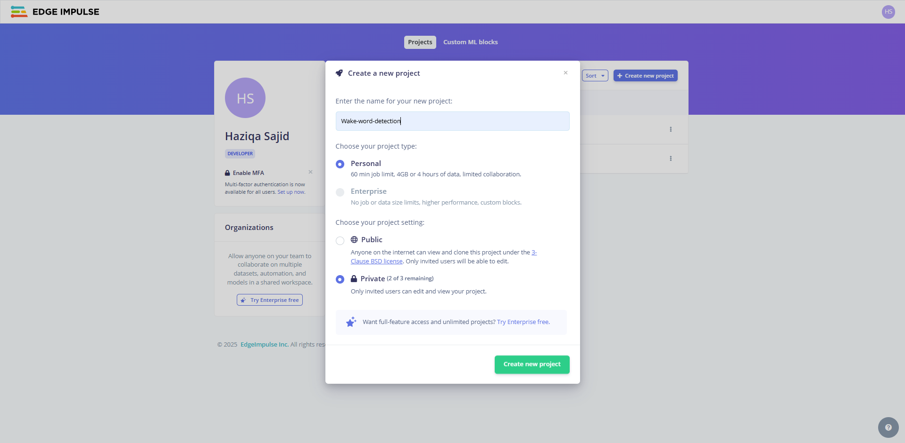

We can also choose “Keyword Spotting” as the project type. Doing so will give you the right building blocks for voice recognition.

Next, install [Android Studio](https://developer.android.com/studio) if you haven’t already done so. Since we’re going to use Edge Impulse’s C++ SDK for running inference on-device, you’ll also need to set up the Android NDK. 

If you install the latest version of Android Studio, it will automatically install the required NDK. Otherwise, you can do that directly from the SDK Manager. Just look for the “NDK” and “CMake” options under the SDK Tools tab and install them.


To make your life easier, Edge Impulse provides an [Android inferencing example on GitHub](https://github.com/edgeimpulse/example-standalone-inferencing-android). Clone that repo, and it has all the scaffolding you need. You'll be modifying this code to run your trained model.

Don’t forget to prepare your phone as well. Enable Developer Mode, turn on USB debugging, and connect it to your machine. This setup lets you install and debug the app directly on your phone using Android Studio. It also gives you access to log output via **Logcat**. This is incredibly helpful when you're testing voice recognition behavior in real-time. 

You can also use an Android Emulator from Android Studio. Just ensure that it is configured with microphone access enabled.

## Collecting Your Voice Data

The very first step in any machine learning project is collecting data, and Edge Impulse makes this part surprisingly smooth. In the left-hand menu, click on **Data Acquisition** to get started.

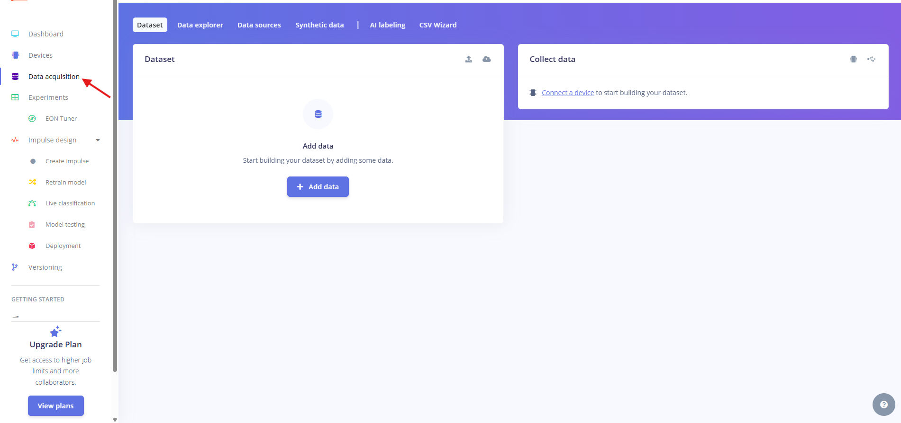

Edge Impulse gives you several options to bring in data. You can upload files directly, pull samples from public projects, or even generate synthetic data for modalities like images or audio. For this project, we’ll be recording data live.

To do that, click **"Connect a device"** and then choose **"Use your computer."** This allows you to record audio samples using your laptop’s microphone right from your browser:

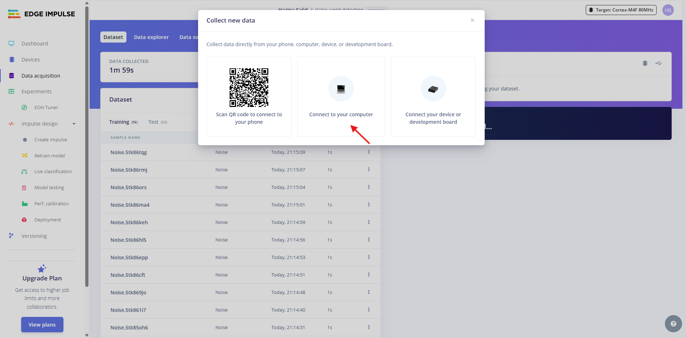

After this, you can record your sound with different labels:

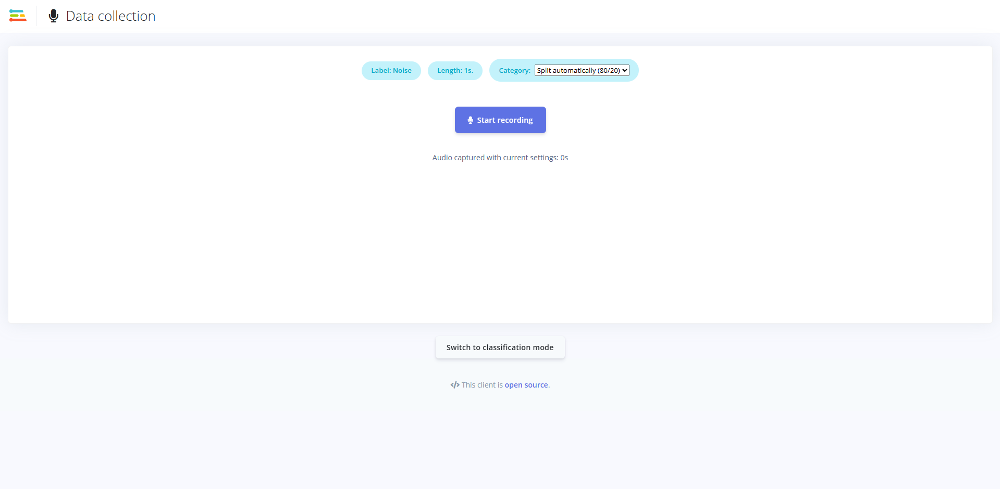

To train our model, we recorded 1-second clips of our chosen wake word: “Neo.” We also wanted to ignore the wrong words. 

To achieve this, we recorded 1-second clips of random background noise, including footsteps, door creaks, and the hum of a fan. These “noise” samples teach the model what not to react to. We repeated this over and over until we had about two minutes of clean voice samples. That’s not a ton of data, but it's enough to get a functional prototype going.

Of course, more data equals better performance, so aim for 5–10 minutes if you have time. All this data gets uploaded to Edge Impulse and labeled accordingly. From there, you’re ready to build your dataset.

## Building Your Dataset

Once your samples are uploaded and labeled, Edge Impulse helps you organize them. It automatically splits your dataset into training (80%) and testing (20%). It’s a good default for most use cases.

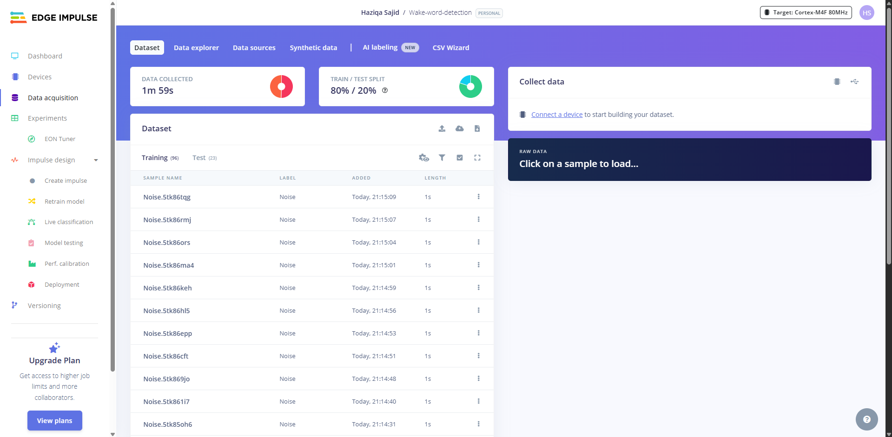

In our case, we had two classes, 'neo' and 'noise', which resulted in a binary classifier for wake word versus everything else. The dataset may be small, but it's clean and consistent. If you are short on time, Edge Impulse provides many [datasets](https://docs.edgeimpulse.com/datasets) that can be used for most general-purpose machine learning.

## Designing Your Voice Recognition Model

This is where your voice gets transformed into something a machine can understand. 

When you speak into a microphone, you’re producing raw audio. This can be described as a waveform that looks like a wavy line. While this works fine for humans (and music apps), it's not ideal for machine learning.

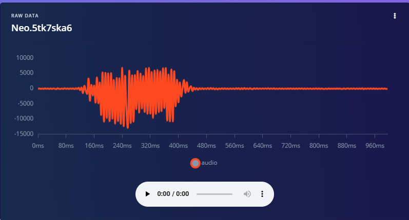

Raw audio is dense, noisy, and complex to learn from. So, before feeding it into a model, we need to transform it into a more structured format. That’s where MFCC (Mel-Frequency Cepstral Coefficients) comes in.

## What is MFCC?

MFCC is a classic feature extraction technique for audio. It works by slicing the audio signal into short frames and applying a filter bank that mimics the human ear's frequency response. Then, transformations turn those filtered signals into something like a frequency “summary.” This gives us a matrix of numbers that highlights which frequencies are active and when. 

Conversion to MFCC involves a spectrogram as a crucial step. A [spectrogram](https://docs.edgeimpulse.com/docs/edge-impulse-studio/processing-blocks/spectrogram) is computed using STFT, which shows how the frequency content of the signal evolves over time.

Instead of passing raw waveforms to our model, we pass these compact numerical representations. That makes training faster, improves accuracy, and helps the model focus on the unique characteristics of your voice when saying a specific word.

### Our Input Configuration

Under the **Impulse design** tab, drag in an **MFCC audio processing block**, then a **Neural Network block**. In our project, here’s how we configured the audio preprocessing:

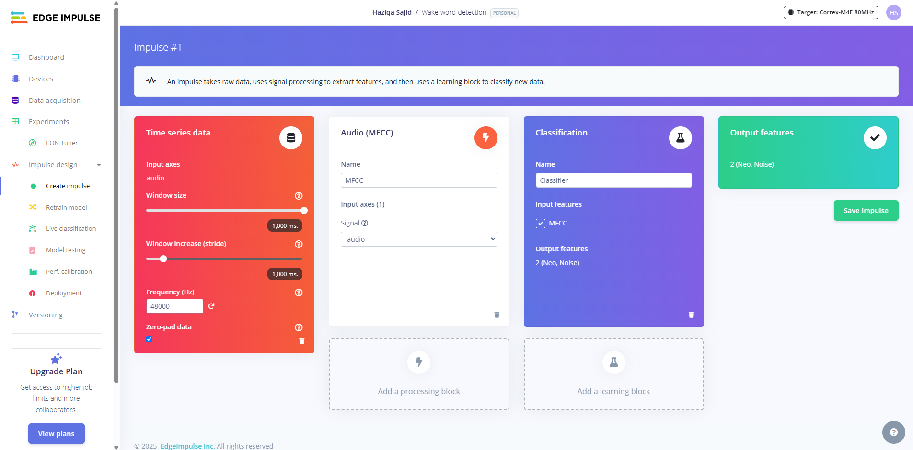

- **Window size**: Defines the length of each slice of audio the model looks at. One second is a sweet spot for short keywords.

- **Window increase (stride)**: How far we move forward to process the next slice of data. In our setup, there is no overlap. Each one-second slice is treated as a separate unit.

- **Frequency**: Our audio sample rate, matching the quality of our microphone setup.

- **Zero padding**: This ensures that all audio slices are the same length, even if the recording was slightly shorter.

Once done, **Save Impulse**, and you will see two new blocks added to the Impulse design section: **MFCC** and **Classifier**. Let’s go to the MFCC block.

### MFCC Settings Explained

Here’s a breakdown of the MFCC parameters we used, along with tips in case you want to tune them:

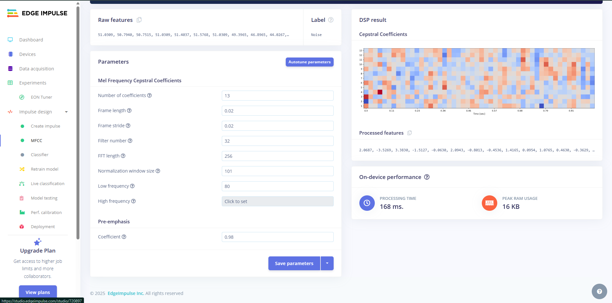

TABLE

These defaults work well for most speech-based tasks. But once your model is up and running, this is a good place to revisit if you're looking to optimize further, especially if you're hearing a lot of false positives or missed detections. Now let’s move on to the classifier

When you open the **NN Classifier** tab in Edge Impulse, the platform automatically sets up a lightweight neural network suitable for audio classification.

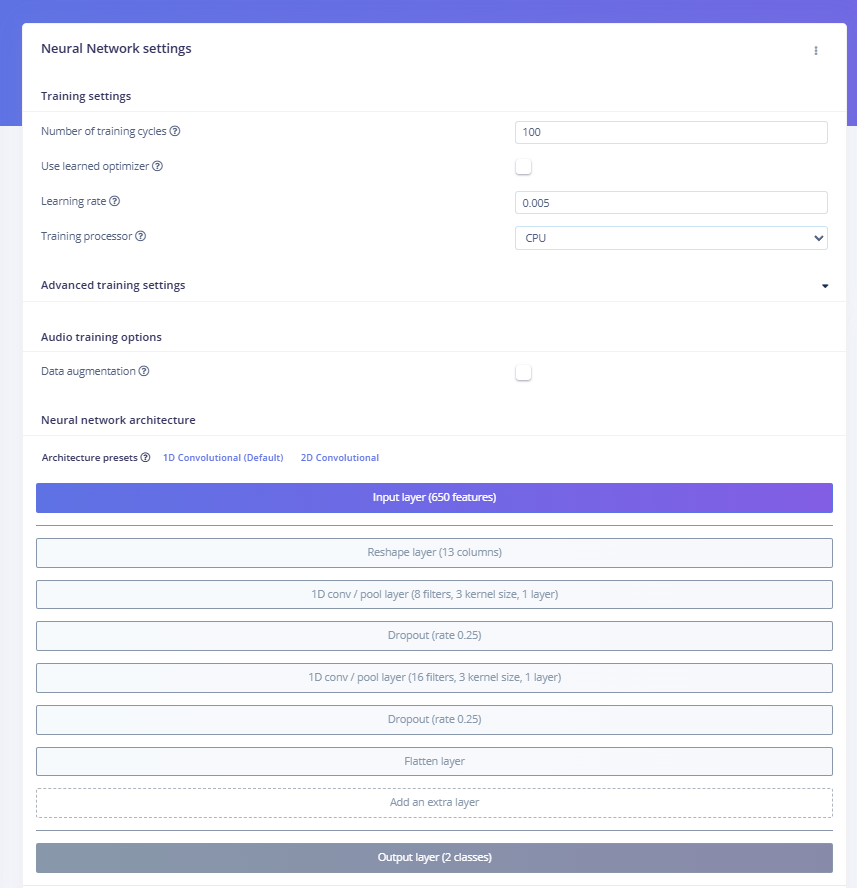

You can select 2D convolutions for better accuracy, but to achieve better performance, we opted for a 1D convolutional layer. It’s designed to be small enough for real-time inference on mobile devices, but still powerful enough to distinguish subtle differences in sound. In our case, we wanted to teach the model to recognize “Neo” as the wake word, while ignoring background noise.

## Training and Testing Your Model

After training the model using our small dataset (just a couple of minutes of voice samples), we got the following results:

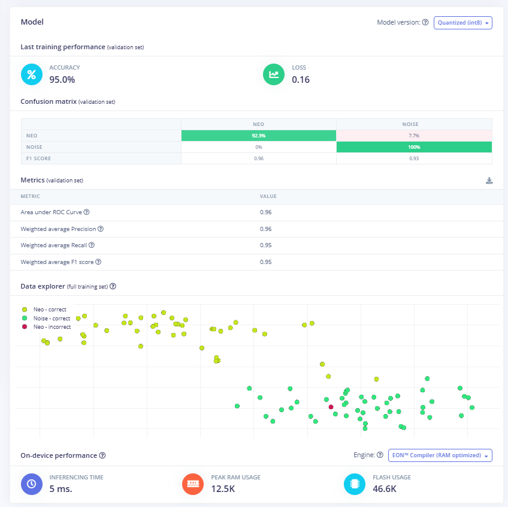

That’s a strong foundation for such a lightweight model, especially considering how little training data we began with. Let’s say you plan to use your wake word detector in the wild (say, inside a moving car or a noisy room). In this case, it’s important to gather more diverse recordings in those specific environments. That extra data can make a big difference in how reliably your assistant responds. 

After training, we can test the model on the test dataset in the **Model Testing** tab:

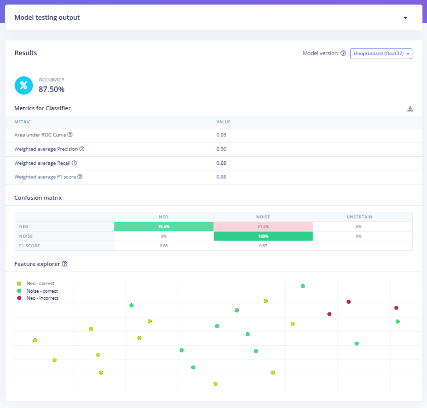

We ran the model against our test set to see how well it generalizes to new, unseen data. Edge Impulse also provides a visual “**Feature Explorer**” that allows us to see how well the model distinguishes between the two classes. Green and yellow dots represent correct classifications, while red dots show where the model misfired. 

## Deploying to Your Android Device

Time to get your trained model running on actual hardware. We'll transform your Edge Impulse model into a working Android app that listens for your custom wake word.

## Getting Your Model from Edge Impulse

In your Edge Impulse project, head to the Deployment tab and select the **C++ library** with TensorFlow Lite enabled. This combination gives you the best mobile performance since TensorFlow Lite is built specifically for phones and tablets. In the model optimization section, we can see quantized (**int8**) and unquantized (**float32**) options. Quantized models are represented in less precise numbers, such as int8, but provide better performance with some accuracy loss.

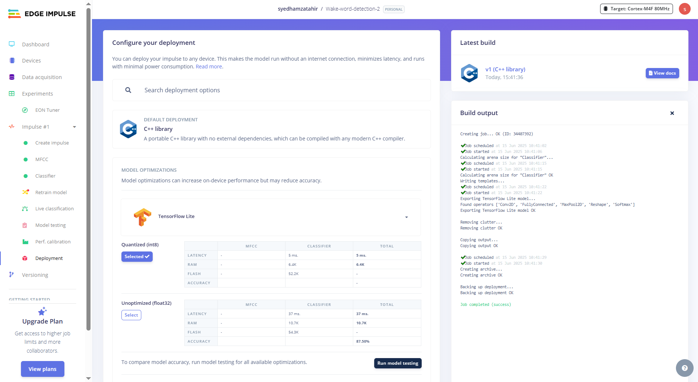

After the build completes, download and extract the zip. You'll get five folders that each serve a specific purpose:

- **tflite-model** contains your neural network converted to TensorFlow Lite format. The `.tflite files` are compressed and optimized versions of your trained model, plus C++ wrapper code that handles loading and running inference.

- **edge-impulse-sdk** is your signal processing toolkit. It includes all the DSP blocks and feature extraction code that convert raw audio into the features your model expects, including MFCC calculators and the core runtime.

- **model-parameters** holds metadata about your model, including input shapes, output classes, and sampling rates. This ensures your Android app processes audio exactly like your training data.

- **CMakeLists.txt** is the build configuration, designed for embedded systems. We'll need to modify this for Android.

## Setting Up the Android Project

Create a new Android project in Android Studio using Java. Since your Edge Impulse model is C++ code, you need Android's NDK to bridge between Java and native code. In your app's `src/main` directory, create a `cpp` folder and copy these three directories from your Edge Impulse export:

- tflite-model/

- edge-impulse-sdk/

- model-parameters/

## Writing the Android CMakeLists.txt

CMake acts as a translator between your source code and the final compiled library. It figures out which files need to be compiled, in what order, and how they should be linked together. The provided CMakeLists.txt won't work with Android's build system. In general, CMake compiles thousands of source files from the Edge Impulse SDK and links your code with TensorFlow Lite and other performance libraries. Here’s our version:

```
# CmakeLists.txt
cmake_minimum_required(VERSION 3.22.1)

project("audiospot")

set(CMAKE_VERBOSE_MAKEFILE TRUE)
set(CMAKE_CXX_FLAGS "${CMAKE_CXX_FLAGS} -v -stdlib=libc++")

include(edge-impulse-sdk/cmake/utils.cmake)

set(CMAKE_CXX_STANDARD 17)
set(CMAKE_CXX_STANDARD_REQUIRED ON)
set(EI_SDK_FOLDER edge-impulse-sdk)

add_definitions(-DEI_CLASSIFIER_ENABLE_DETECTION_POSTPROCESS_OP=1
        -DEI_CLASSIFIER_USE_FULL_TFLITE=1
        -DNDEBUG
)

add_library(
        ${CMAKE_PROJECT_NAME} SHARED
        native-lib.cpp)

target_include_directories(${CMAKE_PROJECT_NAME} PRIVATE .)

file(GLOB EI_SOURCE_FILES
        "${CMAKE_SOURCE_DIR}/edge-impulse-sdk/CMSIS/DSP/Source/TransformFunctions/*.c"
        "${CMAKE_SOURCE_DIR}/edge-impulse-sdk/CMSIS/DSP/Source/CommonTables/*.c"
        "${CMAKE_SOURCE_DIR}/edge-impulse-sdk/CMSIS/DSP/Source/BasicMathFunctions/*.c"
        "${CMAKE_SOURCE_DIR}/edge-impulse-sdk/CMSIS/DSP/Source/ComplexMathFunctions/*.c"
        "${CMAKE_SOURCE_DIR}/edge-impulse-sdk/CMSIS/DSP/Source/FastMathFunctions/*.c"
        "${CMAKE_SOURCE_DIR}/edge-impulse-sdk/CMSIS/DSP/Source/SupportFunctions/*.c"
        "${CMAKE_SOURCE_DIR}/edge-impulse-sdk/CMSIS/DSP/Source/MatrixFunctions/*.c"
        "${CMAKE_SOURCE_DIR}/edge-impulse-sdk/CMSIS/DSP/Source/StatisticsFunctions/*.c"
        "${CMAKE_SOURCE_DIR}/tflite-model/*.cpp"
        "${CMAKE_SOURCE_DIR}/edge-impulse-sdk/dsp/kissfft/*.cpp"
        "${CMAKE_SOURCE_DIR}/edge-impulse-sdk/dsp/dct/*.cpp"
        "${CMAKE_SOURCE_DIR}/edge-impulse-sdk/dsp/memory.cpp"
        "${CMAKE_SOURCE_DIR}/edge-impulse-sdk/porting/posix/*.c*"
        "${CMAKE_SOURCE_DIR}/edge-impulse-sdk/porting/mingw32/*.c*"
        "${EI_SDK_FOLDER}/tensorflow/lite/c/common.c"
)

target_sources(${CMAKE_PROJECT_NAME} PRIVATE ${EI_SOURCE_FILES})

target_link_libraries(${CMAKE_PROJECT_NAME}
        android
        log
        tensorflow-lite
        farmhash
        fft2d_fftsg
        fft2d_fftsg2d
        ruy
        XNNPACK
        cpuinfo
        pthreadpool
)
```

Without this `CMakeLists.txt`, you'd hit hundreds of build errors. The Edge Impulse SDK relies on precise compiler flags, include paths, and libraries like XNNPACK (for faster inference) and Ruy (for optimized matrix operations).

File organization is also critical as CMake needs to locate CMSIS-DSP, Edge Impulse utilities, and TensorFlow Lite components in the right order. For more information, visit the [Android inferencing example](https://github.com/edgeimpulse/example-android-inferencing). 

To compile and link your C++ inference code with TensorFlow Lite, we need to install the native TensorFlow Lite C++ static library (`libtensorflow-lite.a`) for Android ARM64.For that, clone the repo and run the script:

```
git clone https://github.com/edgeimpulse/example-android-inferencing.git
cp -r example-android-inferencing/example_static_buffer/app/src/main/cpp/tflite "<Your_project>/app/src/main/cpp/"
cd <Your_project>\app\src\main\cpp
sh download_tflite_libs.bat
```

Also, copy the following, as the `tensorflow-lite` directory contains the source code and headers for the TensorFlow Lite runtime. This is essential for running on-device inference.

## Building the JNI Bridge

JNI (Java Native Interface) is Android's way of letting Java code interact with C++ code. Your Android app captures audio and handles the user interface in Java, but your machine learning model runs in C++. JNI creates a bridge between these two environments. 

Create `native-lib.cpp` in your `cpp` directory. This connects your Java code to the Edge Impulse inference engine:

```
#include <jni.h>
#include <string>
#include <android/log.h>
#include "edge-impulse-sdk/classifier/ei_run_classifier.h"
#include "model-parameters/model_metadata.h"

#define LOG_TAG "EdgeImpulse"
#define LOGI(...) __android_log_print(ANDROID_LOG_INFO, LOG_TAG, __VA_ARGS__)
#define LOGE(...) __android_log_print(ANDROID_LOG_ERROR, LOG_TAG, __VA_ARGS__)

extern "C" JNIEXPORT jstring JNICALL
Java_com_example_audio_1spotting_MainActivity_getModelInfo(JNIEnv *env, jobject thiz) {
    std::string info = "Model: " + std::string(EI_CLASSIFIER_PROJECT_NAME) + ", Version: " + std::to_string(EI_CLASSIFIER_PROJECT_DEPLOY_VERSION);
    return env->NewStringUTF(info.c_str());
}

extern "C" JNIEXPORT jfloatArray JNICALL
Java_com_example_audio_1spotting_MainActivity_classifyAudio(JNIEnv *env, jobject thiz, jfloatArray raw_audio) {
    jfloat *audio_buffer = env->GetFloatArrayElements(raw_audio, nullptr);
    jsize buffer_size = env->GetArrayLength(raw_audio);

    LOGI("Running inference on %d samples", buffer_size);

    static jfloat* global_audio_buffer = nullptr;
    static size_t global_buffer_size = 0;
    global_audio_buffer = audio_buffer;
    global_buffer_size = buffer_size;

    signal_t signal;
    signal.total_length = buffer_size;
    signal.get_data = [](size_t offset, size_t length, float *out_ptr) -> int {
        if (global_audio_buffer == nullptr || offset + length > global_buffer_size) {
            return -1;
        }
        for (size_t i = 0; i < length; i++) {
            out_ptr[i] = global_audio_buffer[offset + i];
        }
        return 0;
    };

    ei_impulse_result_t result = {0};
    EI_IMPULSE_ERROR res = run_classifier(&signal, &result, false);

    if (res != EI_IMPULSE_OK) {
        LOGE("Classifier failed: %d", res);
        env->ReleaseFloatArrayElements(raw_audio, audio_buffer, JNI_ABORT);
        return nullptr;
    }

    jfloatArray predictions = env->NewFloatArray(EI_CLASSIFIER_LABEL_COUNT);
    jfloat temp[EI_CLASSIFIER_LABEL_COUNT];

    for (int i = 0; i < EI_CLASSIFIER_LABEL_COUNT; i++) {
        temp[i] = result.classification[i].value;
        LOGI("Class %d: %.3f", i, temp[i]);
    }

    env->SetFloatArrayRegion(predictions, 0, EI_CLASSIFIER_LABEL_COUNT, temp);
    env->ReleaseFloatArrayElements(raw_audio, audio_buffer, JNI_ABORT);

    return predictions;
}
```

The `getModelInfo` function helps verify that your model is loaded correctly. The main `classifyAudio` function takes audio samples from Java, wraps them in Edge Impulse's signal structure, runs inference, and returns classification probabilities. Edge Impulse uses a callback pattern for audio data rather than direct memory access. This allows efficient streaming and better memory management.

## Android Build Configuration

Add NDK support to your app-level `build.gradle`:

```
android {
   namespace = "com.example.audio_spotting"
   compileSdk = 35

   defaultConfig {
       applicationId = "com.example.audio_spotting"
       minSdk = 28
       targetSdk = 35
       versionCode = 1
       versionName = "1.0"

       testInstrumentationRunner = "androidx.test.runner.AndroidJUnitRunner"

       externalNativeBuild {
           cmake {
               cppFlags += "-std=c++17"
               arguments.add("-DANDROID_STL=c++_shared")
           }
       }
       ndk {
           abiFilters += "arm64-v8a"
       }

   }
```

## Interface-related Code with Java

This Android app creates a real-time audio classification interface that connects to a native C++ library through JNI (Java Native Interface).

## Key Imports and JNI Setup

```
import android.media.AudioRecord;
import android.media.MediaRecorder;
import android.media.AudioFormat;

// Load native library
static {
    System.loadLibrary("audiospot");
}

// Native method declarations
public native String getModelInfo();
public native float[] classifyAudio(float[] audioData);
```

The `System.loadLibrary("audiospot")` loads the compiled native library, and the `native` method declarations create the bridge to C++ functions that handle the actual ML inference.

## Audio Processing and Classification

To capture the audio, the AudioRecord object captures live microphone input at a 48 kHz sample rate (the same frequency as the input size). The `audioRecord.read()` method fills the buffer with raw audio samples from the device microphone.

```
audioRecord = new AudioRecord(MediaRecorder.AudioSource.MIC,
        SAMPLE_RATE, CHANNEL_CONFIG, AUDIO_FORMAT, bufferSize);
```

The code below converts raw audio to float arrays, passes them to the native `classifyAudio()` method via JNI, receives confidence scores back, and updates the UI based on the detection thresholds. If the confidence exceeds **70%** probability, then the wake word will be detected. We can change this threshold according to our use case.

```
// Convert audio data and run inference
while (isRecording) {
   int samplesRead = audioRecord.read(audioBuffer, 0, windowSize);

for (int i = 0; i < samplesRead; i++) {
    floatBuffer[i] = audioBuffer[i] / 32768.0f;
}

float[] results = classifyAudio(floatBuffer);

if (results != null && results.length > 0) {
    float confidence = results[0];
    
    if (confidence > 0.7f && !isWakeWordDetected) {
        isWakeWordDetected = true;
        updateStatus("Wake word detected!");
        showResponse("I can hear you, once I'm entirely ready I will work for you as well.");
    }
    
    Log.d(TAG, String.format("Wake word confidence: %.3f", confidence));
   }
 }
```

Your app needs to capture audio continuously and feed it to the model. Most wake word systems use a sliding window. They capture audio in small chunks (around 100ms) but maintain a rolling buffer of your full model window size (typically 1-2 seconds).

Match your audio format exactly to your training data. If you trained with 16 kHz mono audio, configure AudioRecord with those same parameters.

## Building and Testing

Build your project, and Android Studio will compile the C++ code and package everything into an APK. The first build takes time as it compiles the entire Edge Impulse SDK, but subsequent builds are faster. Here’s what it looks like:

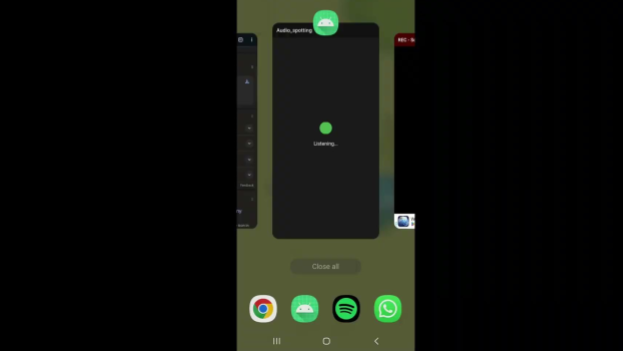

We did it! Our audio recognition model is now live on Android.

## Conclusion

The next steps involve testing your completed voice-activated assistant, which requires deployment across various real-world scenarios to validate performance. Test in various acoustic environments, with different background noise levels, and at varying speaking distances. Make sure that the monitoring confidence thresholds are balanced between detection accuracy and false positive rates. Once your basic wake word detection proves reliable, expanding functionality becomes straightforward.

Train new models with Edge Impulse to recognize commands like "stop," "pause," or "next" by creating multi-class classification systems. This foundation opens doors to sophisticated mobile AI applications that combine multiple sensor inputs, like accelerometer and camera data, for context-aware assistants.
 
True innovation is when energy is consumed efficiently. Running models directly on edge makes this possible, with added benefits such as improved privacy, reduced latency, and offline capabilities. Check out [Edge Impulse](https://edgeimpulse.com) to start building smarter, faster, and greener AI solutions.
